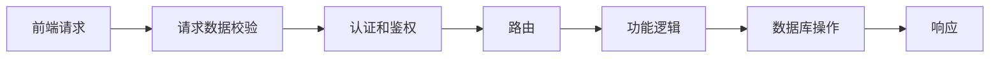

# 编程范式与接口服务流程


---


## 一、编程范式概述

### 1.1 什么是编程范式

**概念说明**  
编程范式（Programming Paradigm）代表着编写代码的方式或风格。不同的编程范式提供了不同的思维模式和代码组织方式。

**三种主流范式**

| 缩写 | 英文全称 | 中文含义 | 核心思想 |
|------|---------|---------|---------|
| **FP** | Functional Programming | 函数式编程 | 以函数为核心，强调纯函数和数据不可变 |
| **OOP** | Object-Oriented Programming | 面向对象编程 | 以对象为核心，强调抽象、封装、继承、多态 |
| **FRP** | Functional Reactive Programming | 函数响应式编程 | 结合函数式和响应式，处理异步数据流 |

**注意事项**
- 编程范式不是互斥的，一个项目中可以混合使用多种范式
- 选择哪种范式取决于场景、团队能力和个人习惯
- 现代前端框架（Vue、React）偏向函数式编程风格

---

## 二、函数式编程（FP）

### 2.1 核心概念

**概念说明**  
函数式编程将程序分解为一系列函数，每个函数完成特定的、独立的任务。强调数据的输入输出，避免副作用。

**核心特点**

```
函数式编程三大特征：
│
├──  确定的输入输出
│   ├── 相同输入必定得到相同输出
│   ├── 函数执行结果可预测
│   └── 便于测试和调试
│
├──  无副作用
│   ├── 不修改外部状态
│   ├── 不创建 DOM 节点
│   └── 不发起 HTTP 请求
│
└──  引用透明
    ├── 函数调用可被返回值替换
    ├── IDE 友好，易于跳转查看
    └── 代码逻辑清晰易懂
```

### 2.2 实战案例：用户登录表单

#### 需求描述

实现一个用户登录表单：
- 输入用户名和密码
- 校验：用户名和密码必填，密码长度需大于 6 位
- 校验通过后打印用户信息并提示登录成功
- 校验失败提示"用户名或密码不符合要求"

#### 面向过程实现（对比）

```javascript
//  面向过程：代码耦合度高，难以复用

// 获取 DOM 节点
const form = document.querySelector('#loginForm');
const usernameInput = document.querySelector('#username');
const passwordInput = document.querySelector('#password');

// 绑定事件
form.addEventListener('submit', function(e) {
  e.preventDefault(); // 阻止默认提交
  
  // 读取输入值
  const username = usernameInput.value;
  const password = passwordInput.value;
  
  // 校验逻辑
  if (!username || !password || password.length <= 6) {
    alert('用户名或密码不符合要求');
    return;
  }
  
  // 处理数据
  const user = { username, password };
  console.log('用户信息：', user);
  alert('登录成功');
});
```

**面向过程的问题**：
- 所有逻辑写在一起，耦合度高
- 难以复用和扩展
- 不易维护和测试

#### 函数式编程实现

```javascript
//  函数式编程：逻辑清晰，易于复用和维护

// ========== 函数定义 ==========

/**
 * 创建表单实例
 * @param {string} formId - 表单 ID
 * @param {Function} handler - 提交处理函数
 */
function createForm(formId, handler) {
  const form = document.querySelector(`#${formId}`);
  form.addEventListener('submit', (e) => {
    e.preventDefault();
    handler();
  });
}

/**
 * 获取用户输入
 * @param {string} usernameId - 用户名输入框 ID
 * @param {string} passwordId - 密码输入框 ID
 * @returns {Object} 用户输入数据
 */
function getUserInput(usernameId, passwordId) {
  const username = document.querySelector(`#${usernameId}`).value;
  const password = document.querySelector(`#${passwordId}`).value;
  return { username, password };
}

/**
 * 创建用户对象
 * @param {Object} input - 用户输入数据
 * @param {boolean} needValidate - 是否需要校验
 * @returns {Object|null} 用户对象或 null
 */
function createUser(input, needValidate = true) {
  if (needValidate && !validate(input)) {
    return null;
  }
  
  return {
    username: input.username,
    password: input.password,
    createdAt: new Date().toISOString()
  };
}

/**
 * 校验用户输入
 * @param {Object} input - 用户输入数据
 * @returns {boolean} 校验结果
 */
function validate(input) {
  const { username, password } = input;
  
  // 可扩展的校验规则
  const rules = [
    { check: () => !!username, message: '用户名不能为空' },
    { check: () => !!password, message: '密码不能为空' },
    { check: () => password.length > 6, message: '密码长度必须大于 6 位' }
  ];
  
  return rules.every(rule => rule.check());
}

/**
 * 提示用户
 * @param {string} message - 提示消息
 */
function showMessage(message) {
  alert(message);
}

// ========== 业务逻辑组合 ==========

/**
 * 登录处理函数
 */
function submitHandler() {
  // 1. 获取输入
  const input = getUserInput('username', 'password');
  
  // 2. 创建用户（带校验）
  const user = createUser(input, true);
  
  // 3. 处理结果
  if (user) {
    console.log('用户信息：', user);
    showMessage('登录成功');
  } else {
    showMessage('用户名或密码不符合要求');
  }
}

// ========== 初始化 ==========

createForm('loginForm', submitHandler);
```

**函数式编程优势**：

| 优势 | 说明 |
|------|------|
| **逻辑清晰** | 每个函数职责单一，易于理解 |
| **易于复用** | `createForm`、`validate` 等函数可在多处使用 |
| **便于扩展** | 新增校验规则只需修改 `validate` 函数 |
| **易于维护** | 问题定位精准，修改某个函数不影响其他部分 |
| **IDE 友好** | 函数跳转方便，代码提示完善 |


### 2.3 函数式编程最佳实践

```javascript
// ========== 纯函数示例 ==========

//  纯函数：相同输入必定得到相同输出，无副作用
function add(a, b) {
  return a + b;
}

function formatUserName(firstName, lastName) {
  return `${firstName} ${lastName}`;
}

//  非纯函数：依赖外部状态，有副作用
let count = 0;
function increment() {
  count++; // 修改外部状态
  return count;
}

function logMessage(message) {
  console.log(message); // 产生副作用（I/O 操作）
}


// ========== 不可变性示例 ==========

//  不可变操作：返回新对象，不修改原对象
const user = { name: 'Tom', age: 25 };

function updateUserAge(user, newAge) {
  return { ...user, age: newAge }; // 返回新对象
}

const updatedUser = updateUserAge(user, 26);
console.log(user);       // { name: 'Tom', age: 25 } - 原对象未变
console.log(updatedUser); // { name: 'Tom', age: 26 }

//  可变操作：直接修改原对象
function updateUserAgeMutable(user, newAge) {
  user.age = newAge; // 直接修改原对象
  return user;
}


// ========== 高阶函数示例 ==========

// 高阶函数：接收函数作为参数，或返回函数
function createValidator(rules) {
  return function(input) {
    return rules.every(rule => rule.check(input));
  };
}

const passwordRules = [
  { check: (pwd) => pwd.length >= 8, message: '至少 8 位' },
  { check: (pwd) => /[A-Z]/.test(pwd), message: '包含大写字母' },
  { check: (pwd) => /[0-9]/.test(pwd), message: '包含数字' }
];

const validatePassword = createValidator(passwordRules);

console.log(validatePassword('abc123'));      // false
console.log(validatePassword('Abcdefg123'));  // true
```

### 2.4 现代框架中的函数式编程

#### React Hooks

```javascript
import React, { useState, useEffect } from 'react';

//  React 函数组件 + Hooks：函数式编程思想
function UserForm() {
  const [username, setUsername] = useState('');
  const [password, setPassword] = useState('');

  // 纯函数处理事件
  const handleSubmit = () => {
    const user = createUser({ username, password });
    if (user) {
      console.log('登录成功', user);
    }
  };

  return (
    <form onSubmit={handleSubmit}>
      <input 
        value={username} 
        onChange={(e) => setUsername(e.target.value)} 
      />
      <input 
        type="password"
        value={password} 
        onChange={(e) => setPassword(e.target.value)} 
      />
      <button type="submit">登录</button>
    </form>
  );
}
```

#### Vue 3 Composition API

```javascript
import { ref, computed } from 'vue';

//  Vue 3 组合式 API：函数式编程思想
export default {
  setup() {
    const username = ref('');
    const password = ref('');

    // 纯函数校验
    const isValid = computed(() => {
      return username.value && 
             password.value && 
             password.value.length > 6;
    });

    const handleSubmit = () => {
      if (isValid.value) {
        console.log('登录成功', {
          username: username.value,
          password: password.value
        });
      }
    };

    return { username, password, isValid, handleSubmit };
  }
};
```

---

## 三、面向对象编程（OOP）

### 3.1 核心概念

**概念说明**  
面向对象编程将程序分解为一系列对象，每个对象包含数据（属性）和行为（方法）。通过抽象、封装、继承、多态来组织代码。

**三大特性**

```
面向对象编程三大特性：
│
├──  封装性
│   ├── 属性和方法封装在类中
│   ├── 外部不能直接访问内部数据
│   └── 通过公共方法操作内部状态
│
├──  继承性
│   ├── 子类继承父类的属性和方法
│   ├── 避免代码重复
│   └── 建立类之间的层级关系
│
└──  多态性
    ├── 同一个方法名，不同对象有不同实现
    ├── 提高代码灵活性
    └── 降低代码耦合度
```


### 3.2 实战案例：用户登录表单（OOP 实现）

```javascript
// ========== 类定义 ==========

/**
 * 校验器类
 * 提供静态校验方法
 */
class Validator {
  /**
   * 校验用户名和密码
   * @param {string} username - 用户名
   * @param {string} password - 密码
   * @returns {boolean} 校验结果
   */
  static validate(username, password) {
    if (!username || !password) {
      return false;
    }
    if (password.length <= 6) {
      return false;
    }
    return true;
  }
}

/**
 * 用户类
 * 封装用户数据和行为
 */
class User {
  // 私有属性（ES2022 新特性）
  #username;
  #password;

  constructor(username, password) {
    this.#username = username;
    this.#password = password;
  }

  // Getter 方法
  get username() {
    return this.#username;
  }

  get password() {
    return this.#password;
  }

  /**
   * 用户问候语
   */
  greet() {
    console.log(`欢迎用户：${this.#username}`);
  }

  /**
   * 打印用户信息
   */
  printInfo() {
    console.log({
      username: this.#username,
      password: '******', // 脱敏显示
      createdAt: new Date().toISOString()
    });
  }
}

/**
 * 用户表单类
 * 封装表单逻辑
 */
class UserForm {
  // 私有属性
  #form;
  #usernameInput;
  #passwordInput;

  constructor(formId) {
    // 初始化 DOM 引用
    this.#form = document.querySelector(`#${formId}`);
    this.#usernameInput = document.querySelector('#username');
    this.#passwordInput = document.querySelector('#password');

    // 绑定事件
    this.#init();
  }

  // 私有方法：初始化
  #init() {
    this.#form.addEventListener('submit', (e) => {
      e.preventDefault();
      this.#handleSubmit();
    });
  }

  // 私有方法：提交处理
  #handleSubmit() {
    const username = this.#usernameInput.value;
    const password = this.#passwordInput.value;

    // 使用 Validator 类进行校验
    if (!Validator.validate(username, password)) {
      alert('用户名或密码不符合要求');
      return;
    }

    // 创建 User 对象
    const user = new User(username, password);
    
    // 调用 User 对象的方法
    user.printInfo();
    user.greet();
    
    alert('登录成功');
  }
}

// ========== 初始化 ==========

const loginForm = new UserForm('loginForm');
```

**OOP 优势**：

| 特性 | 说明 | 示例 |
|------|------|------|
| **抽象** | 从具体问题中抽象出通用概念 | `User`、`Validator`、`UserForm` |
| **封装** | 数据和方法封装在类中 | 私有属性 `#username`、`#password` |
| **复用** | 类可以在多个地方实例化 | 创建多个表单：`new UserForm('registerForm')` |
| **扩展** | 通过继承扩展功能 | 可创建 `AdminUser extends User` |
| **多态** | 同一方法不同实现 | 不同用户类型的 `greet()` 方法 |

### 3.3 继承与多态示例

```javascript
// ========== 基类：用户 ==========

class User {
  constructor(name, email) {
    this.name = name;
    this.email = email;
  }

  // 基础问候方法
  greet() {
    return `你好，我是 ${this.name}`;
  }

  // 获取权限
  getPermissions() {
    return ['read'];
  }
}

// ========== 子类：管理员 ==========

class AdminUser extends User {
  constructor(name, email, department) {
    super(name, email); // 调用父类构造函数
    this.department = department;
  }

  // 重写（Override）父类方法 - 多态
  greet() {
    return `你好，我是管理员 ${this.name}，负责 ${this.department}`;
  }

  // 扩展父类权限
  getPermissions() {
    return [...super.getPermissions(), 'write', 'delete'];
  }

  // 新增方法
  banUser(user) {
    console.log(`${this.name} 封禁了用户 ${user.name}`);
  }
}

// ========== 子类：VIP用户 ==========

class VIPUser extends User {
  constructor(name, email, level) {
    super(name, email);
    this.level = level;
  }

  // 多态：不同的问候实现
  greet() {
    return `你好，我是 VIP${this.level} 用户 ${this.name}`;
  }

  // VIP 特有方法
  getDiscount() {
    return this.level === 1 ? 0.9 : 0.8;
  }
}

// ========== 使用示例 ==========

const normalUser = new User('小明', 'xiaoming@example.com');
const admin = new AdminUser('张三', 'zhangsan@example.com', '技术部');
const vip = new VIPUser('李四', 'lisi@example.com', 2);

// 多态：同一个方法，不同的行为
console.log(normalUser.greet());  // 你好，我是 小明
console.log(admin.greet());       // 你好，我是管理员 张三，负责 技术部
console.log(vip.greet());         // 你好，我是 VIP2 用户 李四

// 继承：复用父类功能
console.log(normalUser.getPermissions()); // ['read']
console.log(admin.getPermissions());       // ['read', 'write', 'delete']

// 扩展：子类特有功能
admin.banUser(normalUser); // 张三 封禁了用户 小明
console.log(vip.getDiscount()); // 0.8
```


### 3.4 OOP 在前端框架中的应用

#### NestJS（后端框架）

```typescript
//  NestJS 典型的 OOP 风格

@Controller('users')
export class UserController {
  // 依赖注入
  constructor(private readonly userService: UserService) {}

  @Get()
  getUsers() {
    return this.userService.findAll();
  }

  @Post()
  createUser(@Body() createUserDto: CreateUserDto) {
    return this.userService.create(createUserDto);
  }
}

@Injectable()
export class UserService {
  constructor(
    @InjectRepository(User)
    private userRepository: Repository<User>,
  ) {}

  findAll(): Promise<User[]> {
    return this.userRepository.find();
  }

  create(createUserDto: CreateUserDto): Promise<User> {
    const user = this.userRepository.create(createUserDto);
    return this.userRepository.save(user);
  }
}
```

#### Angular（前端框架）

```typescript
//  Angular 完全面向对象

@Component({
  selector: 'app-user',
  template: `
    <div *ngFor="let user of users">
      {{ user.name }}
    </div>
  `
})
export class UserComponent implements OnInit {
  users: User[] = [];

  // 依赖注入
  constructor(private userService: UserService) {}

  ngOnInit() {
    this.loadUsers();
  }

  loadUsers() {
    this.userService.getUsers().subscribe(users => {
      this.users = users;
    });
  }
}
```

---

## 四、函数响应式编程（FRP）

### 4.1 核心概念

**概念说明**  
函数响应式编程结合了函数式编程和响应式编程的思想，主要用于处理异步数据流和事件流。

**核心特点**

```
函数响应式编程特征：
│
├──  数据流驱动
│   ├── 一切皆数据流
│   ├── 数据变化自动传播
│   └── 声明式编程风格
│
├──  异步场景优化
│   ├── 处理复杂的事件组合
│   ├── 用户输入防抖/节流
│   └── API 请求流式处理
│
└──  组合能力强
    ├── 多个数据流合并
    ├── 数据转换链式调用
    └── 错误处理统一管理
```

### 4.2 应用场景

#### 场景一：表单实时校验

```javascript
// 使用 RxJS 实现输入框实时校验

import { fromEvent } from 'rxjs';
import { map, debounceTime, distinctUntilChanged, filter } from 'rxjs';

const usernameInput = document.querySelector('#username');
const submitBtn = document.querySelector('#submitBtn');

// 创建输入事件流
fromEvent(usernameInput, 'input')
  .pipe(
    map(event => event.target.value),           // 提取输入值
    debounceTime(300),                          // 防抖：300ms
    distinctUntilChanged(),                     // 去重：值相同时不触发
    filter(value => value.length >= 3),         // 过滤：长度 >= 3
    map(value => validateUsername(value))       // 校验
  )
  .subscribe(result => {
    submitBtn.disabled = !result.isValid;
    console.log(result.message);
  });

function validateUsername(username) {
  if (username.length < 3) {
    return { isValid: false, message: '用户名至少 3 个字符' };
  }
  if (!/^[a-zA-Z0-9_]+$/.test(username)) {
    return { isValid: false, message: '只能包含字母、数字、下划线' };
  }
  return { isValid: true, message: '用户名可用' };
}
```

#### 场景二：好友推荐列表（课堂案例）

**需求描述**：
- 显示好友推荐列表（3 条）
- 点击删除按钮移除一条推荐
- 删除后自动请求新数据填充
- 类似 QQ/微信的好友推荐功能

```javascript
import { fromEvent, from } from 'rxjs';
import { mergeMap, scan, startWith } from 'rxjs';

// 模拟 API 请求
function fetchRecommendation() {
  return from(
    fetch('/api/recommendation')
      .then(res => res.json())
      .then(data => data.user)
  );
}

// 删除事件流
const deleteClick$ = fromEvent(document, 'click')
  .pipe(
    filter(event => event.target.classList.contains('delete-btn')),
    mergeMap(() => fetchRecommendation())  // 删除后立即请求新数据
  );

// 订阅删除事件
deleteClick$.subscribe(newUser => {
  console.log('新推荐用户：', newUser);
  // 更新 UI
  updateRecommendationList(newUser);
});
```


### 4.3 RxJS 核心概念

```javascript
import { Observable, from, of, interval, fromEvent } from 'rxjs';
import { map, filter, mergeMap, take, switchMap } from 'rxjs';

// ========== Observable（可观察对象）==========

// 创建 Observable
const observable$ = new Observable(subscriber => {
  subscriber.next(1);
  subscriber.next(2);
  subscriber.next(3);
  subscriber.complete();
});

// 订阅 Observable
observable$.subscribe({
  next: value => console.log(value),
  complete: () => console.log('完成')
});
// 输出：1, 2, 3, 完成


// ========== 常用创建操作符 ==========

// from：从数组/Promise 创建
const fromArray$ = from([1, 2, 3, 4, 5]);

// of：创建单个值
const singleValue$ = of('Hello');

// interval：定时发送递增值
interval(1000) // 每秒发送 0, 1, 2, 3...
  .pipe(take(5)) // 只取前 5 个
  .subscribe(value => console.log(value));


// ========== 常用管道操作符 ==========

from([1, 2, 3, 4, 5, 6, 7, 8, 9, 10])
  .pipe(
    filter(num => num % 2 === 0),  // 过滤偶数
    map(num => num * 10),          // 乘以 10
    take(3)                        // 只取前 3 个
  )
  .subscribe(value => console.log(value));
// 输出：20, 40, 60


// ========== 实战：搜索建议 ==========

const searchInput = document.querySelector('#search');

fromEvent(searchInput, 'input')
  .pipe(
    map(event => event.target.value),
    debounceTime(500),              // 防抖 500ms
    distinctUntilChanged(),         // 去重
    filter(query => query.length > 0),
    switchMap(query =>               // 切换到最新的搜索请求
      from(fetch(`/api/search?q=${query}`).then(res => res.json()))
    )
  )
  .subscribe(results => {
    console.log('搜索结果：', results);
    // 渲染搜索建议列表
    renderSuggestions(results);
  });
```

### 4.4 Vue 3 中的响应式

```javascript
import { ref, computed, watch, watchEffect } from 'vue';

//  Vue 3 响应式系统：简化版的 FRP

export default {
  setup() {
    // 响应式数据（数据流）
    const count = ref(0);
    const doubleCount = computed(() => count.value * 2);

    // 自动追踪依赖的副作用（响应式）
    watchEffect(() => {
      console.log(`count 变化了：${count.value}`);
    });

    // 监听特定数据源
    watch(count, (newVal, oldVal) => {
      console.log(`count 从 ${oldVal} 变为 ${newVal}`);
    });

    return { count, doubleCount };
  }
};
```

---

## 五、三种编程范式对比

### 5.1 核心对比

| 维度 | 函数式编程（FP） | 面向对象编程（OOP） | 函数响应式编程（FRP） |
|------|-----------------|-------------------|---------------------|
| **核心思想** | 函数 + 数据流 | 对象 + 封装 | 数据流 + 响应式 |
| **代码组织** | 函数组合 | 类和对象 | Observable + 操作符 |
| **状态管理** | 不可变数据 | 可变状态（封装） | 流式传播 |
| **适用场景** | 数据转换、逻辑复用 | 业务建模、大型应用 | 异步事件、实时数据 |
| **学习曲线** | 中等 | 较陡 | 较陡 |
| **框架代表** | React、Vue 3 | Angular、NestJS | RxJS、RxJava |
| **优势** | 逻辑清晰、易测试 | 易于建模、结构化 | 异步处理能力强 |
| **劣势** | 业务建模不直观 | 继承滥用、耦合 | 学习成本高 |

### 5.2 如何选择

```
编程范式选择指南：
│
├──  选择函数式编程（FP）当：
│   ├── 需要大量数据转换和处理
│   ├── 希望代码易于测试和维护
│   ├── 使用 React/Vue 等现代框架
│   └── 团队偏好声明式编程风格
│
├──  选择面向对象编程（OOP）当：
│   ├── 业务逻辑复杂，需要建模
│   ├── 大型企业级应用
│   ├── 使用 Angular/NestJS 等框架
│   └── 团队有 Java/C# 背景
│
└──  选择函数响应式编程（FRP）当：
    ├── 处理复杂的异步事件流
    ├── 实时数据更新场景
    ├── 需要灵活的事件组合
    └── 使用 RxJS/RxJava 等库
```


### 5.3 实际项目中的混合使用

```javascript
// ========== 混合使用示例 ==========

//  OOP：定义类和对象
class UserService {
  private users: User[] = [];

  //  FP：纯函数处理数据
  private validateUser(user: User): boolean {
    return !!user.name && user.age >= 0;
  }

  //  FP：不可变操作
  addUser(user: User): User[] {
    if (!this.validateUser(user)) {
      throw new Error('Invalid user');
    }
    this.users = [...this.users, user]; // 不可变更新
    return this.users;
  }

  //  FP：函数组合
  getAdultUsers(): User[] {
    return this.users
      .filter(user => user.age >= 18)
      .map(user => ({ ...user, isAdult: true }));
  }
}

//  FRP：处理异步事件
fromEvent(searchInput, 'input')
  .pipe(
    debounceTime(300),
    map(event => event.target.value),
    switchMap(query => userService.search(query))
  )
  .subscribe(results => {
    console.log('搜索结果：', results);
  });
```

---

## 六、常见问题与解决方案

| 问题 | 原因 | 解决方案 |
|------|------|----------|
| FP 代码难以理解 | 过度使用高阶函数和组合 | 保持函数简单，添加清晰的命名和注释 |
| OOP 类继承层次过深 | 过度使用继承 | 优先使用组合而非继承（Composition over Inheritance） |
| FP 无状态导致频繁传参 | 避免副作用过度 | 适当使用闭包或模块级状态 |
| OOP 类之间耦合严重 | 职责划分不清 | 遵循单一职责原则，使用依赖注入 |
| FRP 代码调试困难 | 数据流复杂 | 使用 RxJS 的 `tap` 操作符打印中间状态 |
| 不知道选哪种范式 | 对场景理解不足 | 从简单开始，逐步混合使用，根据场景调整 |
| FP 性能问题 | 频繁创建新对象 | 对于大数据量，考虑使用不可变数据方案（如 Immer） |
| OOP 灵活性不足 | 类设计过于僵化 | 使用接口和抽象类，增加扩展点 |

---

## 七、学习要点总结

### 核心要点

1. **编程范式是工具**：没有最好的范式，只有最适合场景的范式
2. **函数式编程核心**：纯函数、不可变性、函数组合、无副作用
3. **面向对象编程核心**：抽象、封装、继承、多态
4. **函数响应式编程核心**：数据流、异步处理、声明式
5. **混合使用**：现代项目中通常会混合使用多种范式

### 行动建议

```
学习路径：
│
├──  第一阶段：理解概念（1 周）
│   ├── 理解三种范式的核心思想
│   ├── 完成课堂中的登录表单示例
│   └── 对比不同实现的优劣
│
├──  第二阶段：实战练习（2 周）
│   ├── 用 FP 重构现有代码中的工具函数
│   ├── 用 OOP 设计一个简单的业务模块
│   └── 用 RxJS 实现搜索建议功能
│
└──  第三阶段：框架应用（持续）
    ├── React/Vue 中应用 FP 思想
    ├── NestJS 中应用 OOP 思想
    └── 根据场景灵活选择范式
```

---

## 八、延伸学习资源

### 官方资源

-  [RxJS 官方文档](https://rxjs.dev/)
-  [Learn RxJS](https://www.learnrxjs.io/)
-  [TypeScript 类与接口](https://www.typescriptlang.org/docs/handbook/2/classes.html)

### 推荐书籍

-  《JavaScript 函数式编程》
-  《JavaScript 设计模式》
-  《JavaScript 高级程序设计》第 8 章：对象、类与面向对象编程

### 练习建议

1. **练习 1**：将现有项目中的工具函数改造成纯函数
2. **练习 2**：设计一个购物车类，应用封装、继承、多态
3. **练习 3**：使用 RxJS 实现一个自动完成的搜索框
4. **练习 4**：对比同一个需求用 FP 和 OOP 实现的差异
5. **练习 5**：在 React 项目中应用函数式编程思想（自定义 Hooks）

### 延伸思考

```
思考题：
│
├──  为什么 Vue 3 和 React 都偏向函数式编程？
├──  为什么 NestJS 和 Angular 选择面向对象？
├──  在什么场景下应该使用 FRP？
└──  如何在团队中推广最佳实践？
```

---

## 附录：编程范式速查表

| 概念 | FP | OOP | FRP |
|------|----|----|-----|
| **基本单元** | 函数 | 类/对象 | Observable |
| **数据** | 不可变 | 可变（封装） | 流式 |
| **状态** | 无状态 | 对象状态 | 自动传播 |
| **控制流** | 函数组合 | 方法调用 | 操作符链 |
| **复用方式** | 函数复用 | 继承/组合 | 操作符复用 |
| **核心原则** | 纯函数、无副作用 | 封装、继承、多态 | 响应式、声明式 |

---


---


## 一、接口服务的重要环节

### 1.1 为什么需要接口服务环节？

前端同学可能很少涉及接口服务开发，但理解这些环节非常重要。当前端发送请求到接口服务后，需要经过多个重要环节：

**核心问题**：
-  如果没有数据校验，什么数据都进入数据库
-  可能导致 SQL 注入攻击
-  可能导致脏数据（如字符串传入整形字段）
-  可能导致数据类型不匹配（如非日期字符串传入日期字段）

### 1.2 接口服务的五大环节



#### 环节一：请求数据校验

**作用**：拦截异常数据，保证数据合法性

**校验内容**：
-  数据类型校验（整形、字符串、日期等）
-  数据格式校验（邮箱、手机号、身份证等）
-  数据长度校验（密码长度、用户名长度等）
-  防止 SQL 注入攻击
-  防止 XSS 攻击

#### 环节二：认证和鉴权

**认证（Authentication）**：
- 类比：拿到公园的门票
- 作用：验证用户身份
- 实现：登录、Token 验证

**鉴权（Authorization）**：
- 类比：拿到酒店的房卡
- 作用：验证用户权限
- 实现：角色权限、资源权限

**认证 vs 鉴权对比**：

| 对比项 | 认证（Authentication） | 鉴权（Authorization） |
|--------|------------------------|------------------------|
| **类比** | 公园门票 | 酒店房卡 |
| **作用** | 验证身份 | 验证权限 |
| **时机** | 最先执行 | 认证后执行 |
| **示例** | 登录验证 | 角色检查 |

#### 环节三：路由

**作用**：
- 类似前端路由，是一个路径
- 不同的路由对应不同的功能逻辑
- 实现功能的可扩展性

#### 环节四：功能逻辑

**作用**：
- 通过 Service 分层
- 把可抽离的逻辑单独放置
- 实现业务逻辑处理

#### 环节五：数据库操作

**作用**：
- 数据持久化
- 数据查询
- 数据更新

---

## 二、核心概念与接口环节的映射关系

### 2.1 映射关系总览

前端请求经过的每个环节，都有对应的 NestJS 核心概念：

```
接口服务环节         NestJS 核心概念
─────────────────────────────────────
请求数据校验    →    Pipe（管道）
认证和鉴权      →    Guard（守卫）
路由            →    Controller（控制器）
功能逻辑        →    Service（服务）
数据库操作      →    Repository（存储库）
```


### 2.2 映射关系详解

#### Pipe（管道）→ 请求数据校验

```typescript
// 管道用于验证和转换请求数据
import { PipeTransform, Injectable, ArgumentMetadata } from '@nestjs/common';

@Injectable()
export class ValidationPipe implements PipeTransform {
  transform(value: any, metadata: ArgumentMetadata) {
    // 数据校验逻辑
    if (!value || typeof value !== 'object') {
      throw new BadRequestException('Invalid data format');
    }
    return value;
  }
}

// 使用 class-validator 进行 DTO 验证
import { IsString, IsInt, Min, Max, IsEmail } from 'class-validator';

export class CreateUserDto {
  @IsString()
  username: string;

  @IsInt()
  @Min(18)
  @Max(100)
  age: number;

  @IsEmail()
  email: string;
}
```

#### Guard（守卫）→ 认证和鉴权

```typescript
// 守卫用于认证和鉴权
import { Injectable, CanActivate, ExecutionContext, UnauthorizedException } from '@nestjs/common';

@Injectable()
export class AuthGuard implements CanActivate {
  canActivate(context: ExecutionContext): boolean {
    const request = context.switchToHttp().getRequest();
    const token = request.headers.authorization;
    
    // 认证：验证 Token 是否有效
    if (!token) {
      throw new UnauthorizedException('Token not found');
    }
    
    // 鉴权：验证用户是否有权限访问
    const user = this.validateToken(token);
    request.user = user;
    
    return true;
  }

  private validateToken(token: string) {
    // Token 验证逻辑
    return { id: 1, role: 'admin' };
  }
}

// 角色鉴权守卫
@Injectable()
export class RolesGuard implements CanActivate {
  canActivate(context: ExecutionContext): boolean {
    const request = context.switchToHttp().getRequest();
    const user = request.user;
    
    // 鉴权：检查用户角色
    const requiredRoles = this.reflectRoles(context);
    return requiredRoles.includes(user.role);
  }

  private reflectRoles(context: ExecutionContext): string[] {
    return Reflect.getMetadata('roles', context.getHandler()) || [];
  }
}
```

#### Controller（控制器）→ 路由

```typescript
// 控制器处理路由
import { Controller, Get, Post, Body, Param, UseGuards, UsePipes } from '@nestjs/common';
import { UsersService } from './users.service';
import { CreateUserDto } from './dto/create-user.dto';
import { AuthGuard } from '../common/guards/auth.guard';
import { ValidationPipe } from '../common/pipes/validation.pipe';

@Controller('users')
@UseGuards(AuthGuard)  // 应用守卫
@UsePipes(ValidationPipe)  // 应用管道
export class UsersController {
  constructor(private readonly usersService: UsersService) {}

  // GET /users
  @Get()
  findAll() {
    return this.usersService.findAll();
  }

  // GET /users/:id
  @Get(':id')
  findOne(@Param('id') id: string) {
    return this.usersService.findOne(+id);
  }

  // POST /users
  @Post()
  create(@Body() createUserDto: CreateUserDto) {
    return this.usersService.create(createUserDto);
  }
}
```

#### Service（服务）→ 功能逻辑

```typescript
// 服务处理业务逻辑
import { Injectable } from '@nestjs/common';
import { InjectRepository } from '@nestjs/typeorm';
import { Repository } from 'typeorm';
import { User } from './entities/user.entity';
import { CreateUserDto } from './dto/create-user.dto';

@Injectable()
export class UsersService {
  constructor(
    @InjectRepository(User)
    private usersRepository: Repository<User>,
  ) {}

  // 查询所有用户
  async findAll(): Promise<User[]> {
    return this.usersRepository.find();
  }

  // 查询单个用户
  async findOne(id: number): Promise<User> {
    return this.usersRepository.findOne({ where: { id } });
  }

  // 创建用户
  async create(createUserDto: CreateUserDto): Promise<User> {
    // 业务逻辑：数据转换
    const user = this.usersRepository.create(createUserDto);
    
    // 业务逻辑：数据处理
    user.createdAt = new Date();
    
    return this.usersRepository.save(user);
  }
}
```

#### Repository（存储库）→ 数据库操作

```typescript
// 存储库处理数据库操作
import { Entity, PrimaryGeneratedColumn, Column, Repository } from 'typeorm';

// 实体定义
@Entity('users')
export class User {
  @PrimaryGeneratedColumn()
  id: number;

  @Column()
  username: string;

  @Column()
  age: number;

  @Column()
  email: string;

  @Column({ type: 'timestamp', default: () => 'CURRENT_TIMESTAMP' })
  createdAt: Date;
}

// Repository 会自动注入到 Service 中
// TypeORM 提供了丰富的 CRUD 方法
// find(), findOne(), save(), remove(), update() 等
```

---

## 三、Redis 与 MySQL 的应用


### 3.1 Redis 的应用场景

**特点**：
- 数据缓存（存储在内存中）
- 也有持久化功能（可配置写入硬盘）
- 高性能读写

**应用场景**：

```
Redis 常见应用场景：
│
├── 1⃣ 用户认证信息缓存
│   └── 登录后 Token 存入 Redis，无需每次验证
│
├── 2⃣ 首页数据缓存
│   └── 频繁访问的首页数据，减少数据库压力
│
├── 3⃣ 热榜数据
│   └── 实时更新的排行榜数据
│
├── 4⃣ 积分数据
│   └── 用户积分实时更新
│
└── 5⃣ Session 共享
    └── 分布式系统中的 Session 存储
```

**类比理解**：
- 公园门票类比：用户认证后，门票存入 Redis
- 后续游玩所有项目，无需再次出示门票
- 提升用户体验，减少重复验证

**Redis 配置示例**：

```typescript
// app.module.ts
import { Module } from '@nestjs/common';
import { RedisModule } from '@nestjs/redis';

@Module({
  imports: [
    RedisModule.forRoot({
      config: {
        url: 'redis://localhost:6379',
      },
    }),
  ],
})
export class AppModule {}

// auth.service.ts
import { Injectable } from '@nestjs/common';
import { RedisService } from '@nestjs/redis';

@Injectable()
export class AuthService {
  private redis: any;

  constructor(private readonly redisService: RedisService) {
    this.redis = this.redisService.getClient();
  }

  // 存储 Token 到 Redis
  async setToken(userId: number, token: string): Promise<void> {
    await this.redis.set(`token:${userId}`, token, 'EX', 3600); // 1小时过期
  }

  // 从 Redis 获取 Token
  async getToken(userId: number): Promise<string | null> {
    return this.redis.get(`token:${userId}`);
  }

  // 删除 Token（登出）
  async deleteToken(userId: number): Promise<void> {
    await this.redis.del(`token:${userId}`);
  }
}
```

### 3.2 MySQL 的应用

**特点**：
- 关系型数据库
- 数据持久化
- 事务支持

**ORM 库的作用**：
- 在数据库上做分层
- 通过 ORM 与不同类型数据库对接
- TypeORM、Prisma、Sequelize 等

```typescript
// TypeORM 配置示例
import { TypeOrmModule } from '@nestjs/typeorm';

@Module({
  imports: [
    TypeOrmModule.forRoot({
      type: 'mysql',
      host: 'localhost',
      port: 3306,
      username: 'root',
      password: 'password',
      database: 'test',
      entities: [User],
      synchronize: true,
    }),
  ],
})
export class AppModule {}
```

### 3.3 Redis vs MySQL 对比

| 对比项 | Redis | MySQL |
|--------|-------|-------|
| **存储位置** | 内存（可持久化） | 硬盘 |
| **读写性能** | 极高 | 较高 |
| **数据结构** | Key-Value | 关系型表 |
| **适用场景** | 缓存、Session、排行榜 | 持久化数据、事务 |
| **数据类型** | String、Hash、List 等 | 表、索引 |
| **持久化** | 可配置（RDB/AOF） | 默认持久化 |

---

## 四、NestJS 核心概念总结

### 4.1 核心概念一览

```
NestJS 核心概念：
│
├──  Controller（控制器）
│   └── 作用：路由处理请求和响应
│
├──  Service（服务）
│   └── 作用：数据访问和核心逻辑
│
├──  Module（模块）
│   └── 作用：组合所有逻辑，形成独立模块
│
├──  Pipe（管道）
│   └── 作用：核验请求数据
│
├──  Filter（过滤器）
│   └── 作用：处理请求错误，统一日志记录
│
├──  Guard（守卫）
│   └── 作用：认证和鉴权
│
├──  Interceptor（拦截器）
│   └── 作用：丰富控制器，请求前后处理逻辑
│
└──  Repository（存储库）
    └── 作用：数据库操作
```


### 4.2 核心概念详细说明

#### 4.2.1 Controller（控制器）

**一句话总结**：路由处理请求和响应

**职责**：
- 接收 HTTP 请求
- 调用 Service 处理业务逻辑
- 返回 HTTP 响应

```typescript
@Controller('users')
export class UsersController {
  constructor(private readonly usersService: UsersService) {}

  @Get()
  findAll() {
    return this.usersService.findAll();
  }
}
```

#### 4.2.2 Service（服务）

**一句话总结**：数据访问和核心逻辑

**职责**：
- 业务逻辑处理
- 数据库操作
- 数据转换

```typescript
@Injectable()
export class UsersService {
  constructor(
    @InjectRepository(User)
    private usersRepository: Repository<User>,
  ) {}

  async findAll(): Promise<User[]> {
    return this.usersRepository.find();
  }
}
```

#### 4.2.3 Module（模块）

**一句话总结**：把逻辑组合成独立模块

**职责**：
- 组织 Controller、Service、Provider
- 管理模块依赖关系
- 实现模块化架构

```typescript
@Module({
  imports: [TypeOrmModule.forFeature([User])],
  controllers: [UsersController],
  providers: [UsersService],
  exports: [UsersService],
})
export class UsersModule {}
```

#### 4.2.4 Pipe（管道）

**一句话总结**：核验请求数据

**职责**：
- 数据验证
- 数据转换
- 拦截非法数据

#### 4.2.5 Filter（过滤器）

**一句话总结**：处理请求错误，统一日志记录

**职责**：
- 捕获异常
- 统一错误格式
- 记录错误日志

```typescript
@Catch()
export class AllExceptionsFilter implements ExceptionFilter {
  catch(exception: unknown, host: ArgumentsHost) {
    const ctx = host.switchToHttp();
    const response = ctx.getResponse();
    const request = ctx.getRequest();

    const status = exception instanceof HttpException
      ? exception.getStatus()
      : 500;

    response.status(status).json({
      statusCode: status,
      timestamp: new Date().toISOString(),
      path: request.url,
      message: exception.message,
    });
  }
}
```

#### 4.2.6 Guard（守卫）

**一句话总结**：认证和鉴权

**职责**：
- 验证用户身份
- 检查用户权限
- 决定是否允许访问

#### 4.2.7 Interceptor（拦截器）

**一句话总结**：丰富控制器，请求前后处理逻辑

**职责**：
- 请求前处理（日志、转换）
- 响应后处理（转换、缓存）
- 性能监控

```typescript
@Injectable()
export class LoggingInterceptor implements NestInterceptor {
  intercept(context: ExecutionContext, next: CallHandler): Observable<any> {
    const now = Date.now();
    console.log('Before...');

    return next
      .handle()
      .pipe(
        tap(() => console.log(`After... ${Date.now() - now}ms`)),
      );
  }
}
```

#### 4.2.8 Repository（存储库）

**一句话总结**：数据库操作

**职责**：
- 数据库 CRUD 操作
- 数据持久化
- 数据查询

---

## 五、实战案例：接口开发流程


### 5.1 案例一：获取用户列表（GET）

#### 需求分析

**接口信息**：
```typescript
// 请求
GET /api/users

// 响应
{
  "code": 200,
  "message": "获取成功",
  "data": [
    { "id": 1, "username": "user1", "age": 25 },
    { "id": 2, "username": "user2", "age": 30 }
  ]
}
```

#### 环节分析

```
获取用户列表环节分析：
│
├──  请求数据校验
│   └── 原因：GET 请求无参数，无需校验
│
├──  认证和鉴权
│   └── 原因：无需 Token，公开接口
│
├──  路由
│   └── 原因：需要路由到 /api/users
│
├──  功能逻辑
│   └── 原因：需要从数据库查询用户列表
│
└──  数据库操作
    └── 原因：需要查询数据库
```

#### 完整实现

```typescript
// 1. Controller（控制器）
@Controller('users')
export class UsersController {
  constructor(private readonly usersService: UsersService) {}

  @Get()
  async findAll() {
    const users = await this.usersService.findAll();
    return {
      code: 200,
      message: '获取成功',
      data: users,
    };
  }
}

// 2. Service（服务）
@Injectable()
export class UsersService {
  constructor(
    @InjectRepository(User)
    private usersRepository: Repository<User>,
  ) {}

  async findAll(): Promise<User[]> {
    return this.usersRepository.find();
  }
}

// 3. Module（模块）
@Module({
  imports: [TypeOrmModule.forFeature([User])],
  controllers: [UsersController],
  providers: [UsersService],
})
export class UsersModule {}
```

### 5.2 案例二：新增用户（POST）

#### 需求分析

**接口信息**：
```typescript
// 请求
POST /api/users
{
  "username": "newuser",
  "age": 25,
  "email": "newuser@example.com"
}

// 响应
{
  "code": 200,
  "message": "新增成功",
  "data": {
    "id": 3,
    "username": "newuser",
    "age": 25,
    "email": "newuser@example.com"
  }
}
```

#### 环节分析

```
新增用户环节分析：
│
├──  请求数据校验
│   └── 原因：需要校验用户传递的数据
│
├──  认证和鉴权
│   └── 原因：无需 Token，公开接口
│
├──  路由
│   └── 原因：需要路由到 /api/users
│
├──  功能逻辑
│   └── 原因：需要创建用户逻辑
│
└──  数据库操作
    └── 原因：需要插入数据库
```

#### 完整实现

```typescript
// 1. DTO（数据传输对象）
import { IsString, IsInt, Min, Max, IsEmail } from 'class-validator';

export class CreateUserDto {
  @IsString()
  username: string;

  @IsInt()
  @Min(18)
  @Max(100)
  age: number;

  @IsEmail()
  email: string;
}

// 2. Controller（控制器）
@Controller('users')
@UsePipes(new ValidationPipe()) // 应用数据校验
export class UsersController {
  constructor(private readonly usersService: UsersService) {}

  @Post()
  async create(@Body() createUserDto: CreateUserDto) {
    const user = await this.usersService.create(createUserDto);
    return {
      code: 200,
      message: '新增成功',
      data: user,
    };
  }
}

// 3. Service（服务）
@Injectable()
export class UsersService {
  constructor(
    @InjectRepository(User)
    private usersRepository: Repository<User>,
  ) {}

  async create(createUserDto: CreateUserDto): Promise<User> {
    const user = this.usersRepository.create(createUserDto);
    return this.usersRepository.save(user);
  }
}
```

### 5.3 开发流程总结

```
接口开发流程：
│
├── 1⃣ 需求分析
│   ├── 确定请求方法（GET/POST/PUT/DELETE）
│   ├── 确定请求路径
│   ├── 确定请求参数
│   └── 确定响应数据
│
├── 2⃣ 环节判断
│   ├── 是否需要数据校验？ → Pipe
│   ├── 是否需要认证鉴权？ → Guard
│   ├── 是否需要路由？ → Controller
│   ├── 是否需要业务逻辑？ → Service
│   └── 是否需要数据库操作？ → Repository
│
├── 3⃣ 编码实现
│   ├── 定义 DTO（如需要）
│   ├── 实现 Controller
│   ├── 实现 Service
│   └── 配置 Module
│
└── 4⃣ 测试验证
    ├── 单元测试
    └── 接口测试
```

---

## 六、最佳实践


### 6.1 接口设计原则

**1. RESTful 规范**

```
RESTful API 设计规范：
│
├── GET /users          → 获取用户列表
├── GET /users/:id      → 获取单个用户
├── POST /users         → 创建用户
├── PUT /users/:id      → 更新用户（完整）
├── PATCH /users/:id    → 更新用户（部分）
└── DELETE /users/:id   → 删除用户
```

**2. 响应格式统一**

```typescript
// 统一响应格式
interface ApiResponse<T> {
  code: number;      // 状态码
  message: string;   // 提示信息
  data: T;           // 响应数据
  timestamp?: number; // 时间戳
}

// 成功响应
{
  "code": 200,
  "message": "操作成功",
  "data": { ... },
  "timestamp": 1640000000000
}

// 错误响应
{
  "code": 400,
  "message": "参数错误",
  "data": null,
  "timestamp": 1640000000000
}
```

**3. 错误处理统一**

```typescript
// 全局异常过滤器
@Catch()
export class GlobalExceptionFilter implements ExceptionFilter {
  catch(exception: unknown, host: ArgumentsHost) {
    const ctx = host.switchToHttp();
    const response = ctx.getResponse();
    const request = ctx.getRequest();

    let status = 500;
    let message = '服务器内部错误';

    if (exception instanceof HttpException) {
      status = exception.getStatus();
      const exceptionResponse = exception.getResponse();
      message = typeof exceptionResponse === 'string' 
        ? exceptionResponse 
        : (exceptionResponse as any).message;
    }

    // 记录错误日志
    console.error(`[${new Date().toISOString()}] ${request.method} ${request.url}`, {
      status,
      message,
      stack: exception instanceof Error ? exception.stack : '',
    });

    response.status(status).json({
      code: status,
      message,
      data: null,
      timestamp: Date.now(),
    });
  }
}
```

### 6.2 数据校验最佳实践

```typescript
// 使用 class-validator 和 class-transformer
import { IsString, IsInt, Min, Max, IsEmail, IsOptional, IsDateString } from 'class-validator';
import { Type } from 'class-transformer';

export class CreateUserDto {
  @IsString()
  @MinLength(2)
  @MaxLength(20)
  username: string;

  @IsInt()
  @Min(18)
  @Max(100)
  @Type(() => Number) // 自动转换
  age: number;

  @IsEmail()
  email: string;

  @IsOptional()
  @IsDateString()
  birthday?: Date;
}
```

### 6.3 认证鉴权最佳实践

```typescript
// JWT 认证守卫
@Injectable()
export class JwtAuthGuard implements CanActivate {
  constructor(private jwtService: JwtService) {}

  async canActivate(context: ExecutionContext): Promise<boolean> {
    const request = context.switchToHttp().getRequest();
    const token = this.extractTokenFromHeader(request);

    if (!token) {
      throw new UnauthorizedException('Token not found');
    }

    try {
      const payload = await this.jwtService.verifyAsync(token);
      request.user = payload;
    } catch (error) {
      throw new UnauthorizedException('Invalid token');
    }

    return true;
  }

  private extractTokenFromHeader(request: Request): string | undefined {
    const [type, token] = request.headers.authorization?.split(' ') ?? [];
    return type === 'Bearer' ? token : undefined;
  }
}
```

### 6.4 性能优化建议

```
性能优化建议：
│
├── 1⃣ 使用 Redis 缓存
│   ├── 频繁访问的数据
│   ├── 用户认证信息
│   └── 热点数据
│
├── 2⃣ 数据库优化
│   ├── 添加索引
│   ├── 分页查询
│   └── 避免 N+1 查询
│
├── 3⃣ 接口优化
│   ├── 数据压缩
│   ├── 限流
│   └── 异步处理
│
└── 4⃣ 日志优化
    ├── 错误日志记录
    ├── 访问日志记录
    └── 性能监控
```

---


## 七、常见问题与解决方案

| 问题 | 原因 | 解决方案 |
|------|------|----------|
| 数据校验不生效 | 未启用 ValidationPipe | 在 main.ts 中启用 `app.useGlobalPipes(new ValidationPipe())` |
| 认证失败 | Token 格式错误 | 检查 Authorization 头格式：`Bearer <token>` |
| 跨域问题 | CORS 未配置 | 在 main.ts 中启用 `app.enableCors()` |
| 依赖注入失败 | 模块未导入 | 检查 Module 的 imports 配置 |
| 数据库连接失败 | 配置错误 | 检查数据库连接配置和状态 |
| 接口响应慢 | 未使用缓存 | 使用 Redis 缓存热点数据 |
| 内存泄漏 | 未释放资源 | 及时关闭数据库连接、清理定时器 |
| SQL 注入 | 未使用参数化查询 | 使用 ORM 或参数化查询 |

---

## 八、学习要点总结

### 8.1 核心要点

1. **接口服务五大环节**：请求数据校验 → 认证鉴权 → 路由 → 功能逻辑 → 数据库操作
2. **核心概念映射**：Pipe → Guard → Controller → Service → Repository
3. **认证 vs 鉴权**：认证是验证身份，鉴权是验证权限
4. **Redis 应用**：缓存、Session、热点数据
5. **开发流程**：需求分析 → 环节判断 → 编码实现 → 测试验证

### 8.2 记忆技巧

```
记忆技巧：
│
├──  五大环节
│   └── 校验 → 认证 → 路由 → 逻辑 → 数据库
│
├──  核心概念
│   └── Pipe → Guard → Controller → Service → Repository
│
├──  认证 vs 鉴权
│   └── 认证 = 门票，鉴权 = 房卡
│
└──  开发流程
    └── 分析 → 判断 → 编码 → 测试
```

### 8.3 学习路径

```
学习路径规划：
│
├── 第一阶段：理解概念（1-2 天）
│   ├── 理解五大环节
│   ├── 理解核心概念映射
│   └── 理解认证和鉴权区别
│
├── 第二阶段：实践练习（1 周）
│   ├── 实现 GET 接口
│   ├── 实现 POST 接口
│   └── 实现认证鉴权
│
└── 第三阶段：深入应用（持续）
    ├── Redis 缓存应用
    ├── 数据库优化
    └── 性能优化
```

---

## 九、延伸学习资源

### 9.1 官方文档

- [NestJS 官方文档](https://docs.nestjs.com/)
- [NestJS 中文文档](https://docs.nestjs.cn/)
- [TypeORM 官方文档](https://typeorm.io/)
- [Redis 官方文档](https://redis.io/documentation)

### 9.2 推荐阅读

- 《Node.js 设计模式》
- 《深入浅出 NestJS》
- 《RESTful API 设计指南》
- 《数据库索引设计与优化》

### 9.3 练习建议

1. **基础练习**：实现 CRUD 接口
2. **进阶练习**：实现认证鉴权系统
3. **实战练习**：实现完整的用户管理模块
4. **优化练习**：使用 Redis 优化接口性能

---

## 十、知识图谱

```
接口服务开发知识图谱：
│
├── 接口服务环节
│   ├── 请求数据校验 → Pipe
│   ├── 认证和鉴权 → Guard
│   ├── 路由 → Controller
│   ├── 功能逻辑 → Service
│   └── 数据库操作 → Repository
│
├── 数据存储
│   ├── Redis（缓存）
│   └── MySQL（持久化）
│
├── NestJS 核心概念
│   ├── Controller（控制器）
│   ├── Service（服务）
│   ├── Module（模块）
│   ├── Pipe（管道）
│   ├── Filter（过滤器）
│   ├── Guard（守卫）
│   ├── Interceptor（拦截器）
│   └── Repository（存储库）
│
└── 开发流程
    ├── 需求分析
    ├── 环节判断
    ├── 编码实现
    └── 测试验证
```

---


前面学过如何调试 Nest 项目，那如何调试 Nest 源码呢？

有的同学说，调试 Nest 项目的时候，调用栈里不就有源码部分么？

其实不是的，这部分是编译后的代码：

新建个 Nest 项目：

```
nest new debug-nest-source
```
点击 debug 面板的 create a launch.json file 按钮：

输入 npm，选择 launch via npm，创建一个调试 npm scripts 的配置：

改为这样：

```json
{
    "name": "Launch via NPM",
    "request": "launch",
    "runtimeArgs": [
        "run-script",
        "start:dev"
    ],
    "runtimeExecutable": "npm",
    "console": "integratedTerminal",
    "skipFiles": [
        "<node_internals>/**"
    ],
    "type": "node"
}
```

这个就是跑 npm run start:dev 的调试配置。

指定 console 为 integratedTerminal，这样日志会输出在 terminal。

不然，日志会输出在 debug console。颜色等都不一样：

在 AppController 的 getHello 打个断点：

点击 debug 启动：

然后浏览器重新访问 http://localhost:3000

这时候代码就会在断点处断住：

这样就可以断点调试 Nest 项目了。

但如果想调试源码，还需要再做一步：

因为现在调用栈里的 Nest 源码部分都是编译后的：

想调试 Nest 的 ts 源码，这就需要用到 sourcemap 了。

用 npm install 下载的包没有 sourcemap 的代码，想要 sourcemap，需要自己 build 源码。

把 Nest 项目下载下来，并安装依赖（加个 --depth=1 是下载单 commit，--single-branch 是下载单个分支，这样速度会快很多）：

```
git clone --depth=1 --single-branch https://github.com/nestjs/nest
```
build 下：
```
npm install
npm run build
```
会在 node_modules/@nestjs 下生成编译后的代码。

看下 npm scripts：

可以看到它做的事情就是 tsc 编译代码，然后把编译后的文件移动到 node_modules/@nestjs 目录下。

move 的具体实现可以看 tools/gulp/tasks/move.ts 的代码：

所以，执行 npm run build，你就会在 node_modules/@nestjs 下看到这样的代码：

只包含了 js 和 ts，没有 sourcemap：

生成 sourcemap 需要改下 tsc 编译配置，也就是 packages/tsconfig.build.json 文件：

设置 sourceMap 为 true 也就是生成 sourcemap，但默认的 sourcemap 里不包含内联的源码，也就是 sourcesContent 部分，需要设置 inlineSources 来包含。

再次执行 npm run build，就会生成带有 sourcemap 的代码：

并且 sourcemap 是内联了源码的：

然后跑一下 Nest 的项目，直接跑 samples 目录下的项目即可，这是 Nest 内置的一些案例项目：

进入 01-cats-app 目录，安装依赖

```
npm install
```
然后把根目录 node_modules 下生成的代码覆盖下 cats 项目的 node_modules 下的代码：

创建一个调试配置：

改成这样：

```json
{
    "name": "调试 nest 源码",
    "request": "launch",
    "runtimeArgs": [
        "run-script",
        "start:dev"
    ],
    "runtimeExecutable": "npm",
    "console": "integratedTerminal",
    "cwd": "${workspaceFolder}/samples/01-cats-app/",
    "resolveSourceMapLocations": [
        "${workspaceFolder}/**",
        // "!**/node_modules/**"
    ],
    "skipFiles": [
        "<node_internals>/**"
    ],
    "type": "node"
}
```
指定 cwd 为那个项目的目录，也就是在那个目录下执行 npm run start:dev。

resolveSourceMapLocations 是从哪里找 sourcemap，默认排除掉了 node_modules，把它去掉。

在 samples/01-cats-app 的 src/cats/cats.controller.ts 打个断点：

然后点击 debug 调试：

如果提示端口被占用，你需要先 kill 掉之前的进程再跑：

浏览器访问 http://localhost:3000/cats

断住之后你看下调用栈：

这时候 sourcemap 就生效了，可以看到调用栈中的就是 Nest 的 ts 源码。

这样就可以调试 Nest 源码了。

比如看下 Nest 的 AOP 部分的源码：

点击这个调用栈：

可以看到它先创建了所有的 pipes、interceptors、guards 的实例，然后封装了调用 pipe 和 guard 的函数：

下面调用 handler 的时候，先调用 guard、再调用 interceptor，然后调用 handler，并且 handler 里会先用 pipe 处理参数：

这就是 AOP 机制的源码。

而如果你想在你的项目里调试 Nest 源码，只要把 node_modules/@nestjs 覆盖你项目下那个就好了。

## 总结

这节学习了如何调试 Nest 源码。

vscode 里创建 npm scripts 的调试配置，就可以调试 npm run start:dev 的服务。

但如果想调试源码，需要把 Nest 源码下载下来，build 出一份带有 sourcemap 版本的代码。

同时还要设置 resolveSourcemapLocations 去掉排除 node_modules 的配置。

然后再调试，就可以直接调试 Nest 的 ts 源码了。

调试了下 AOP 部分的源码，以后你对哪部分的实现原理感兴趣，也可以自己调试源码了。
