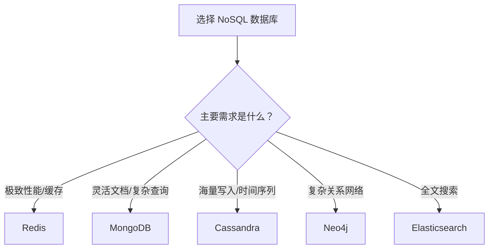

# NoSQL 简介

NoSQL（Not Only SQL，不仅仅是 SQL）是一类非关系型数据库的统称，旨在解决传统关系型数据库在大数据量、高并发场景下遇到的扩展性和性能瓶颈问题。

## 发展背景

2008 年左右，随着网站、论坛、社交网络的高速发展，传统的关系型数据库在存储及处理数据时遇到了严峻挑战：

```
┌─────────────────────────────────────────────────────────────┐
│                    传统 RDBMS 面临的挑战                      │
├─────────────────────────────────────────────────────────────┤
│  ┌─────────────────┐    ┌─────────────────┐                │
│  │  高并发写入瓶颈  │    │   海量数据查询   │                │
│  │  每秒上万次写入  │    │   上亿量级数据   │                │
│  └─────────────────┘    └─────────────────┘                │
│  ┌─────────────────┐    ┌─────────────────┐                │
│  │  水平扩展困难    │    │   表结构僵化     │                │
│  │  分库分表复杂    │    │   修改代价高昂   │                │
│  └─────────────────┘    └─────────────────┘                │
└─────────────────────────────────────────────────────────────┘
```

在许多互联网应用场景中：
- 对数据联表查询的需求不强
- 不需要在数据写入后立刻读取
- 对数据的读取和并发写入速度有极高要求

这些需求催生了 NoSQL 数据库的高速发展。

---

## 核心特性

### BASE 特性

与关系型数据库的 ACID 特性相对，NoSQL 遵循 BASE 原则：

| 特性 | 全称 | 说明 |
|------|------|------|
| **B** | Basically Available | 基本可用，系统在出现故障时允许损失部分可用性 |
| **S** | Soft State | 软状态，允许系统存在中间状态，不要求实时一致 |
| **E** | Eventually Consistent | 最终一致性，系统在一段时间后最终达到一致状态 |

### ACID vs BASE 对比

```
┌─────────────────────────────────────────────────────────────┐
│                     一致性模型对比                           │
├───────────────────┬─────────────────────────────────────────┤
│       ACID        │               BASE                      │
├───────────────────┼─────────────────────────────────────────┤
│ 强一致性          │ 最终一致性                              │
│ 事务完整支持      │ 有限的事务支持                          │
│ 适合金融/核心业务 │ 适合社交/日志/缓存等场景                │
│ 垂直扩展为主      │ 水平扩展为主                            │
└───────────────────┴─────────────────────────────────────────┘
```

### 其他核心特性

- **可弹性扩展**：支持水平扩展，可动态增减节点
- **大数据量、高性能**：针对海量数据优化，读写性能优异
- **灵活的数据模型**：无需预定义 Schema，数据结构灵活
- **高可用性**：天然支持数据冗余和故障转移

---

## 系统架构

### 分布式架构示意

```
┌─────────────────────────────────────────────────────────────┐
│                        客户端应用层                          │
│                 (Web / Mobile / IoT 设备)                   │
└─────────────────────────────┬───────────────────────────────┘
                              │
                              ▼
┌─────────────────────────────────────────────────────────────┐
│                      负载均衡层                              │
│                  (请求分发 / 路由策略)                       │
└─────────────────────────────┬───────────────────────────────┘
                              │
          ┌───────────────────┼───────────────────┐
          ▼                   ▼                   ▼
┌─────────────────┐ ┌─────────────────┐ ┌─────────────────┐
│    Node 1       │ │    Node 2       │ │    Node N       │
│  ┌───────────┐  │ │  ┌───────────┐  │ │  ┌───────────┐  │
│  │  Shard 1  │  │ │  │  Shard 2  │  │ │  │  Shard N  │  │
│  │ (Primary) │  │ │  │ (Primary) │  │ │  │ (Primary) │  │
│  └───────────┘  │ │  └───────────┘  │ │  └───────────┘  │
│  ┌───────────┐  │ │  ┌───────────┐  │ │  ┌───────────┐  │
│  │  Replica  │  │ │  │  Replica  │  │ │  │  Replica  │  │
│  └───────────┘  │ │  └───────────┘  │ │  └───────────┘  │
└─────────────────┘ └─────────────────┘ └─────────────────┘
         │                   │                   │
         └───────────────────┴───────────────────┘
                        数据同步 / 复制
```

### 核心组件

| 组件 | 说明 | 功能 |
|------|------|------|
| **Shard（分片）** | 数据分区单元 | 实现数据水平切分，分散存储压力 |
| **Replica（副本）** | 数据备份单元 | 提供数据冗余，保障高可用 |
| **Config Server** | 配置服务器 | 存储集群元数据和路由信息 |
| **Query Router** | 查询路由器 | 将请求路由到正确的分片 |

---

## 数据库分类

### 分类总览

```
┌─────────────────────────────────────────────────────────────┐
│                    NoSQL 数据库分类                          │
├─────────────────────────────────────────────────────────────┤
│                                                             │
│  ┌─────────────┐   ┌─────────────┐   ┌─────────────┐      │
│  │   键值存储   │   │  文档存储   │   │  列式存储   │      │
│  │             │   │             │   │             │      │
│  │   Redis     │   │  MongoDB    │   │  Cassandra  │      │
│  │   Memcached │   │  CouchDB    │   │  HBase      │      │
│  │   LevelDB   │   │             │   │             │      │
│  └─────────────┘   └─────────────┘   └─────────────┘      │
│                                                             │
│                    ┌─────────────┐                          │
│                    │   图存储    │                          │
│                    │             │                          │
│                    │   Neo4j     │                          │
│                    │   JanusGraph│                          │
│                    └─────────────┘                          │
└─────────────────────────────────────────────────────────────┘
```

### 1. 键值数据库（Key-Value）

**代表产品**：Redis、Memcached、LevelDB、DynamoDB

**数据模型**：

```json
// 键值对形式存储
{
  "user:1001": '{"name": "Alice", "age": 30}',
  "session:abc123": '{"userId": 1001, "expireAt": 1699900000}',
  "counter:page_views": "15234"
}
```

**特点**：

| 优点 | 缺点 |
|------|------|
| 极高的读写性能 | 不支持复杂查询 |
| 数据结构简单 | 无 Schema 约束 |
| 易于水平扩展 | 数据关系难以表达 |

**适用场景**：
- 缓存系统
- 会话存储
- 计数器、排行榜
- 消息队列

### 2. 文档型数据库（Document）

**代表产品**：MongoDB、CouchDB、Elasticsearch

**数据模型**：

```json
// 文档形式存储（BSON 格式）
{
  "_id": ObjectId("6388b3d94a33f23a9735a257"),
  "name": "Alice",
  "email": "alice@example.com",
  "age": 30,
  "courses": ["Math", "Physics"],
  "address": {
    "street": "123 Main St",
    "city": "Beijing",
    "zip": "100000"
  },
  "createdAt": ISODate("2023-01-15T10:30:00Z")
}
```

**特点**：

| 优点 | 缺点 |
|------|------|
| 灵活的文档结构 | 不支持多表关联查询 |
| 支持嵌套数据 | 事务支持有限 |
| 丰富的查询语言 | 空间占用相对较大 |

**适用场景**：
- 内容管理系统
- 用户画像
- 日志分析
- 产品目录

### 3. 列式数据库（Column-Family）

**代表产品**：Cassandra、HBase、Bigtable

**数据模型**：

```
// 列族存储结构
Row Key: user_1001
├── info (Column Family)
│   ├── name: "Alice"
│   ├── email: "alice@example.com"
│   └── age: "30"
└── activity (Column Family)
    ├── login_2023_01_15: "10:30:00"
    ├── login_2023_01_16: "09:15:00"
    └── login_2023_01_17: "11:45:00"
```

**特点**：

| 优点 | 缺点 |
|------|------|
| 查询速度极快 | 学习曲线陡峭 |
| 高度可扩展 | 不适合小数据量 |
| 适合稀疏数据 | 事务支持较弱 |

**适用场景**：
- 时间序列数据
- 日志/监控系统
- 推荐系统
- IoT 数据存储

### 4. 图数据库（Graph）

**代表产品**：Neo4j、JanusGraph、Amazon Neptune

**数据模型**：

```cypher
// 图查询语言示例（Cypher）
// 创建节点和关系
CREATE (alice:User {name: 'Alice'})
CREATE (bob:User {name: 'Bob'})
CREATE (alice)-[:FRIEND {since: 2020}]->(bob)
CREATE (alice)-[:FOLLOWS]->(bob)

// 查询朋友的朋友
MATCH (u:User {name: 'Alice'})-[:FRIEND]->()-[:FRIEND]->(fof)
RETURN fof.name
```

**特点**：

| 优点 | 缺点 |
|------|------|
| 高效的关系查询 | 复杂度高 |
| 直观的数据建模 | 学习成本高 |
| 适合复杂网络分析 | 生态系统相对较小 |

**适用场景**：
- 社交网络
- 推荐系统
- 欺诈检测
- 知识图谱

---

## CAP 理论

CAP 定理由 Eric Brewer 提出，是分布式系统设计的基础理论。

### CAP 含义

```
          ┌─────────────────────────────────────┐
          │            CAP 理论                  │
          └─────────────────────────────────────┘
                         │
        ┌────────────────┼────────────────┐
        ▼                ▼                ▼
┌───────────────┐ ┌───────────────┐ ┌───────────────┐
│  Consistency  │ │  Availability │ │ Partition     │
│   一致性      │ │    可用性     │ │ Tolerance     │
│               │ │               │ │ 分区容错性    │
│ 所有节点同一  │ │ 每个请求都有  │ │ 网络分区时    │
│ 时间看到相同  │ │ 响应，不保证  │ │ 系统仍能运行  │
│ 数据          │ │ 数据最新      │ │               │
└───────────────┘ └───────────────┘ └───────────────┘
```

### CAP 权衡

CAP 理论指出：**一个分布式系统最多只能同时满足三项中的两项**。

| 组合 | 说明 | 代表产品 |
|------|------|----------|
| **CA** | 一致性 + 可用性（无分区容错） | 传统 RDBMS |
| **CP** | 一致性 + 分区容错（牺牲可用性） | MongoDB、HBase、Redis |
| **AP** | 可用性 + 分区容错（牺牲一致性） | Cassandra、CouchDB、DynamoDB |

### 选择建议

```
┌─────────────────────────────────────────────────────────────┐
│                    CAP 选择决策树                            │
├─────────────────────────────────────────────────────────────┤
│                                                             │
│                    是否允许数据不一致？                      │
│                           │                                 │
│              ┌────────────┴────────────┐                    │
│              ▼                         ▼                    │
│            不允许                    允许                    │
│         (强一致性需求)            (最终一致即可)             │
│              │                         │                    │
│              ▼                         ▼                    │
│         选择 CP 系统              选择 AP 系统               │
│        (MongoDB/HBase)          (Cassandra/DynamoDB)        │
│                                                             │
└─────────────────────────────────────────────────────────────┘
```

---

## NoSQL vs 关系型数据库

### 详细对比

| 对比维度 | 关系型数据库 (RDBMS) | NoSQL 数据库 |
|----------|---------------------|--------------|
| **数据模型** | 表格结构，行列固定 | 文档/键值/列族/图等灵活结构 |
| **Schema** | 需预定义，修改成本高 | 无需预定义，灵活可变 |
| **查询语言** | SQL（标准化） | 各产品自有语法 |
| **事务支持** | ACID 强一致性 | BASE 最终一致性 |
| **扩展方式** | 垂直扩展为主 | 水平扩展为主 |
| **关联查询** | 支持 JOIN | 有限支持或不支持 |
| **适用场景** | 结构化数据、事务处理 | 非结构化数据、海量数据 |

### 选择决策矩阵

```
┌─────────────────────────────────────────────────────────────┐
│                     数据库选型矩阵                           │
├──────────────┬──────────────────┬───────────────────────────┤
│   考虑因素   │   推荐 RDBMS     │      推荐 NoSQL           │
├──────────────┼──────────────────┼───────────────────────────┤
│ 数据关联性   │ 多表关联复杂     │ 数据相对独立              │
│ 数据量级     │ 中小规模         │ 海量数据                  │
│ 并发需求     │ 适中             │ 高并发读写                │
│ 一致性要求   │ 强一致性（金融） │ 最终一致可接受            │
│ Schema 稳定 │ 结构稳定         │ 结构频繁变化              │
│ 查询复杂度   │ 复杂 SQL 查询    │ 简单查询为主              │
└──────────────┴──────────────────┴───────────────────────────┘
```

---

## 选型指南

### 场景匹配

#### 高性能缓存 → 选择 Redis

```javascript
// Redis 缓存示例
const redis = require('redis');
const client = redis.createClient();

await client.connect();

// 设置缓存
await client.set('user:1001', JSON.stringify(user), {
  EX: 3600  // 1小时过期
});

// 获取缓存
const cached = await client.get('user:1001');
```

#### 文档存储/灵活 Schema → 选择 MongoDB

```javascript
// MongoDB 文档操作示例
const { MongoClient } = require('mongodb');
const client = new MongoClient('mongodb://localhost:27017');

await client.connect();
const db = client.db('myapp');
const users = db.collection('users');

// 插入文档（无需预定义 Schema）
await users.insertOne({
  name: 'Alice',
  email: 'alice@example.com',
  // 可以随时添加新字段
  preferences: { theme: 'dark', language: 'zh-CN' }
});
```

#### 海量写入/时间序列 → 选择 Cassandra

```sql
-- Cassandra 时间序列表设计
CREATE TABLE events (
  event_id UUID,
  event_time TIMESTAMP,
  event_type TEXT,
  data JSON,
  PRIMARY KEY ((event_type), event_time)
) WITH CLUSTERING ORDER BY (event_time DESC);
```

#### 复杂关系分析 → 选择 Neo4j

```cypher
// Neo4j 社交关系查询
// 查找共同好友
MATCH (u1:User {id: 'user1'})-[:FRIEND]->(common)-[:FRIEND]->(u2:User {id: 'user2'})
RETURN common.name AS mutualFriend
```

### 混合架构建议

实际项目中，往往采用多数据库混合架构：

```
┌─────────────────────────────────────────────────────────────┐
│                     混合数据库架构                           │
├─────────────────────────────────────────────────────────────┤
│                                                             │
│  ┌─────────────────────────────────────────────────────┐   │
│  │                    应用服务层                        │   │
│  └───────────────────────────┬─────────────────────────┘   │
│                              │                              │
│      ┌───────────────────────┼───────────────────────┐     │
│      │                       │                       │     │
│      ▼                       ▼                       ▼     │
│  ┌────────┐           ┌────────────┐          ┌────────┐  │
│  │ MySQL  │           │  MongoDB   │          │ Redis  │  │
│  │        │           │            │          │        │  │
│  │用户账户│           │ 商品目录   │          │ 缓存   │  │
│  │订单记录│           │ 日志数据   │          │ 会话   │  │
│  │交易流水│           │ 用户画像   │          │ 排行榜 │  │
│  └────────┘           └────────────┘          └────────┘  │
│   (强一致性)            (灵活 Schema)          (高性能)    │
│                                                             │
└─────────────────────────────────────────────────────────────┘
```

---

## 常见问题解答

### Q1: NoSQL 能完全取代关系型数据库吗？

**不能。** NoSQL 和关系型数据库各有适用场景：

- **RDBMS 更适合**：金融交易、ERP 系统、需要复杂 SQL 查询和事务保证的场景
- **NoSQL 更适合**：海量数据存储、高并发读写、数据结构频繁变化的场景

> **建议**：根据业务特点选择，或采用混合架构，各取所长。

### Q2: 如何理解"最终一致性"？

最终一致性意味着：

```
┌─────────────────────────────────────────────────────────────┐
│                      最终一致性示意                          │
├─────────────────────────────────────────────────────────────┤
│                                                             │
│  时间轴 ─────────────────────────────────────────────────▶  │
│                                                             │
│  T1: 写入 Node A ───── "Alice"                              │
│                          │                                  │
│  T2: 读取 Node B ───── "Bob" (旧数据)                       │
│                          │                                  │
│  T3: 同步完成 ───────────┼───────────────────────           │
│                          ▼                                  │
│  T4: 读取 Node B ───── "Alice" (新数据，最终一致)           │
│                                                             │
└─────────────────────────────────────────────────────────────┘
```

系统保证在**一段时间后**，所有副本的数据最终达到一致状态。这对于社交动态、日志等场景是可接受的。

### Q3: NoSQL 支持事务吗？

| 数据库类型 | 事务支持程度 |
|------------|-------------|
| **Redis** | 支持简单事务（MULTI/EXEC），但非 ACID |
| **MongoDB** | 4.0+ 支持多文档事务 |
| **Cassandra** | 支持 Batch 操作，但有限 |
| **Neo4j** | 支持 ACID 事务 |

> **注意**：即使支持事务，性能也会有所下降，应根据实际需求权衡。

### Q4: 如何选择合适的 NoSQL 数据库？



### Q5: NoSQL 数据库如何保证数据安全？

主要措施：

1. **数据持久化**：RDB/AOF（Redis）、Journal（MongoDB）
2. **副本集**：数据冗余存储
3. **备份策略**：定期全量 + 增量备份
4. **访问控制**：认证授权机制
5. **加密传输**：TLS/SSL 连接

---

## 总结

### NoSQL 核心要点

```
┌─────────────────────────────────────────────────────────────┐
│                    NoSQL 核心知识图谱                        │
├─────────────────────────────────────────────────────────────┤
│                                                             │
│  ┌─────────────────────────────────────────────────────┐   │
│  │                   设计理念                           │   │
│  │  BASE 模型 · 最终一致 · 水平扩展 · 灵活 Schema      │   │
│  └─────────────────────────────────────────────────────┘   │
│                                                             │
│  ┌─────────────────────────────────────────────────────┐   │
│  │                   四大分类                           │   │
│  │  键值(Redis) · 文档(MongoDB) · 列式(Cassandra)      │   │
│  │  · 图(Neo4j)                                        │   │
│  └─────────────────────────────────────────────────────┘   │
│                                                             │
│  ┌─────────────────────────────────────────────────────┐   │
│  │                   选型原则                           │   │
│  │  数据关联 · 一致性要求 · 并发规模 · 查询复杂度      │   │
│  └─────────────────────────────────────────────────────┘   │
│                                                             │
└─────────────────────────────────────────────────────────────┘
```

### 最佳实践建议

1. **不要盲目追新**：关系型数据库仍是许多场景的最佳选择
2. **理解业务需求**：根据数据特点、访问模式、一致性要求选型
3. **考虑运维成本**：不同数据库的运维复杂度差异很大
4. **做好数据迁移规划**：选择后更换成本高昂
5. **混合架构可行**：不同数据使用不同存储方案

---

> **重要提示**：一个项目并非只能选择一种数据库。可以将需要强一致性、复杂关联的数据放到 RDBMS 中管理，而将海量数据、高并发访问的数据放到 NoSQL 中管理，实现各取所长。
