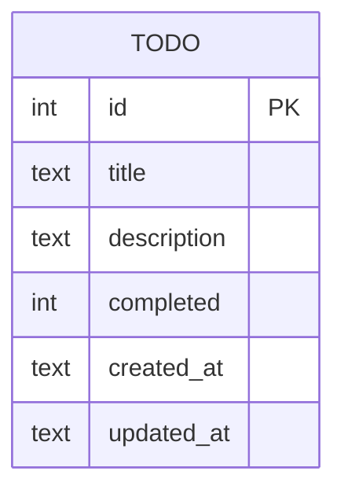
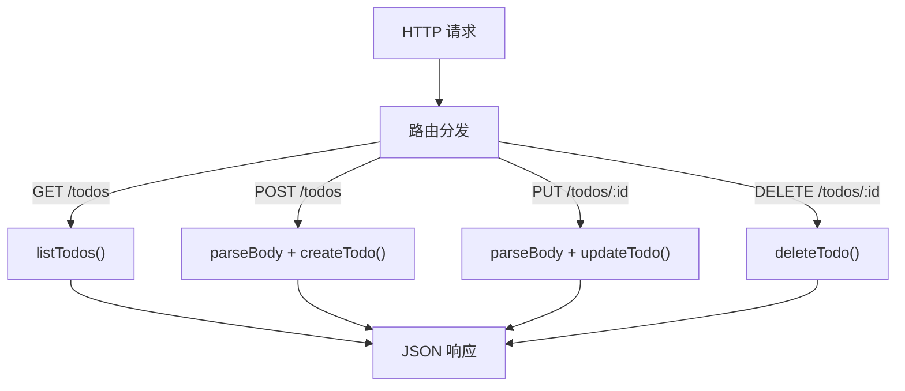

# SQLite

## 概述

SQLite 是嵌入式关系型数据库，无需独立服务进程，数据库以单文件形式存储。适合中小规模应用、原型开发、桌面/移动应用和测试场景。

## SQLite vs 其他数据库

| 维度 | SQLite | MySQL | PostgreSQL | MongoDB |
|------|--------|-------|------------|---------|
| 部署方式 | 嵌入式（单文件） | 独立服务 | 独立服务 | 独立服务 |
| 配置复杂度 | 零配置 | 中等 | 中等 | 中等 |
| 并发写入 | 单写者 | 多写者 | 多写者 | 多写者 |
| 并发读取 | 高 | 高 | 高 | 高 |
| 数据量上限 | ~281 TB | 取决于配置 | 取决于配置 | 取决于配置 |
| 适用场景 | 原型/小型应用/测试 | Web 应用 | 复杂查询 | 文档型数据 |

## 安装与连接

```bash
npm install sqlite3
```

```js
const sqlite3 = require('sqlite3')
const path = require('path')

const DB_PATH = path.join(__dirname, 'data.db')

const db = new sqlite3.Database(DB_PATH, (err) => {
  if (err) throw err
  console.log('SQLite connected:', DB_PATH)
})
```

## 数据表设计



```js
const CREATE_TABLE_SQL = `
  CREATE TABLE IF NOT EXISTS todo (
    id          INTEGER PRIMARY KEY AUTOINCREMENT,
    title       TEXT NOT NULL,
    description TEXT DEFAULT '',
    completed   INTEGER DEFAULT 0,
    created_at  TEXT DEFAULT (datetime('now', 'localtime')),
    updated_at  TEXT DEFAULT (datetime('now', 'localtime'))
  )
`

db.run(CREATE_TABLE_SQL, (err) => {
  if (err) throw err
  console.log('Table created')
})
```

## CRUD 操作

### Create

```js
function createTodo(title, description = '') {
  return new Promise((resolve, reject) => {
    db.run(
      'INSERT INTO todo (title, description) VALUES (?, ?)',
      [title, description],
      function (err) {
        if (err) reject(err)
        else resolve({ id: this.lastID, title, description })
      }
    )
  })
}
```

### Read

```js
// 查询全部
function listTodos() {
  return new Promise((resolve, reject) => {
    db.all('SELECT * FROM todo ORDER BY created_at DESC', (err, rows) => {
      if (err) reject(err)
      else resolve(rows)
    })
  })
}

// 条件查询
function findTodo(id) {
  return new Promise((resolve, reject) => {
    db.get('SELECT * FROM todo WHERE id = ?', [id], (err, row) => {
      if (err) reject(err)
      else resolve(row)
    })
  })
}
```

### Update

```js
function updateTodo(id, { title, description, completed }) {
  const fields = []
  const values = []

  if (title !== undefined) { fields.push('title = ?'); values.push(title) }
  if (description !== undefined) { fields.push('description = ?'); values.push(description) }
  if (completed !== undefined) { fields.push('completed = ?'); values.push(completed ? 1 : 0) }

  fields.push("updated_at = datetime('now', 'localtime')")
  values.push(id)

  return new Promise((resolve, reject) => {
    db.run(
      `UPDATE todo SET ${fields.join(', ')} WHERE id = ?`,
      values,
      function (err) {
        if (err) reject(err)
        else resolve({ changes: this.changes })
      }
    )
  })
}
```

### Delete

```js
function deleteTodo(id) {
  return new Promise((resolve, reject) => {
    db.run('DELETE FROM todo WHERE id = ?', [id], function (err) {
      if (err) reject(err)
      else resolve({ deleted: this.changes > 0 })
    })
  })
}
```

## 与 HTTP 服务集成



```js
const http = require('http')
const url = require('url')

const server = http.createServer(async (req, res) => {
  const { pathname } = url.parse(req.url)
  const method = req.method

  res.setHeader('Content-Type', 'application/json; charset=utf-8')

  try {
    // GET /todos
    if (method === 'GET' && pathname === '/todos') {
      const todos = await listTodos()
      return respond(res, 200, todos)
    }

    // POST /todos
    if (method === 'POST' && pathname === '/todos') {
      const body = await parseBody(req)
      const todo = await createTodo(body.title, body.description)
      return respond(res, 201, todo)
    }

    // DELETE /todos/:id
    if (method === 'DELETE' && pathname.startsWith('/todos/')) {
      const id = pathname.split('/').pop()
      const result = await deleteTodo(id)
      return respond(res, 200, result)
    }

    respond(res, 404, { error: 'Not Found' })
  } catch (err) {
    respond(res, 500, { error: err.message })
  }
})

function respond(res, status, data) {
  res.writeHead(status)
  res.end(JSON.stringify(data))
}

function parseBody(req) {
  return new Promise((resolve) => {
    let body = ''
    req.on('data', (chunk) => { body += chunk })
    req.on('end', () => {
      try { resolve(JSON.parse(body)) }
      catch { resolve({}) }
    })
  })
}

server.listen(3000)
```

## POST 数据格式处理

HTTP 服务需支持多种请求体格式：

```js
function parseBody(req) {
  const contentType = req.headers['content-type'] || ''

  return new Promise((resolve) => {
    let body = ''
    req.on('data', (chunk) => { body += chunk })
    req.on('end', () => {
      if (contentType.includes('application/json')) {
        try { resolve(JSON.parse(body)) }
        catch { resolve({}) }
      } else if (contentType.includes('application/x-www-form-urlencoded')) {
        resolve(Object.fromEntries(new URLSearchParams(body)))
      } else {
        resolve({ raw: body })
      }
    })
  })
}
```

| Content-Type | 解析方式 | 示例 |
|-------------|---------|------|
| `application/json` | `JSON.parse()` | `{"title":"Hello"}` |
| `application/x-www-form-urlencoded` | `URLSearchParams` | `title=Hello&desc=World` |
| `multipart/form-data` | 第三方库（如 `formidable`） | 文件上传 |

## 事务处理

```js
db.serialize(() => {
  db.run('BEGIN TRANSACTION')

  db.run('INSERT INTO todo (title) VALUES (?)', ['Task 1'])
  db.run('INSERT INTO todo (title) VALUES (?)', ['Task 2'])

  // 出错自动回滚
  db.run('COMMIT', (err) => {
    if (err) {
      db.run('ROLLBACK')
      console.error('Transaction failed:', err.message)
    } else {
      console.log('Transaction committed')
    }
  })
})
```

## 数据库连接管理

```js
// 应用退出时关闭连接
process.on('SIGINT', () => {
  db.close((err) => {
    if (err) console.error('Close error:', err.message)
    process.exit(err ? 1 : 0)
  })
})

// 使用 Promise 封装
const dbAsync = {
  run(sql, params = []) {
    return new Promise((resolve, reject) => {
      db.run(sql, params, function (err) {
        if (err) reject(err)
        else resolve({ lastID: this.lastID, changes: this.changes })
      })
    })
  },
  get(sql, params = []) {
    return new Promise((resolve, reject) => {
      db.get(sql, params, (err, row) => {
        if (err) reject(err)
        else resolve(row)
      })
    })
  },
  all(sql, params = []) {
    return new Promise((resolve, reject) => {
      db.all(sql, params, (err, rows) => {
        if (err) reject(err)
        else resolve(rows)
      })
    })
  },
}
```

## 最佳实践

| 场景 | 推荐方案 |
|------|---------|
| 原型开发 | SQLite + 简单封装 |
| 生产应用 | MySQL / PostgreSQL |
| 数据迁移 | 使用 ORM（Prisma / Sequelize） |
| 测试环境 | 内存数据库 `:memory:` |
| 并发写入 | 避免多进程同时写同一文件 |
| SQL 注入防护 | 始终使用参数化查询 `?` 占位符 |
