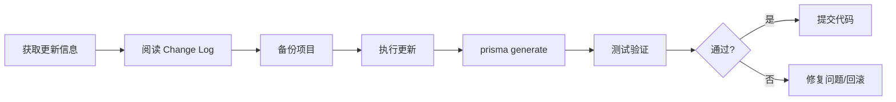

# Prisma 版本升级指南：从 4 到 5

## 概述

Prisma 主版本升级涉及 Breaking Changes、依赖环境要求和 API 变更。本文以 Prisma 4 → 5 为例，系统讲解版本升级的完整流程、新特性、常见问题及回滚方案。

## 前置知识

- [Prisma 的全部命令](02-Prisma%20的全部命令.md)
- [Prisma 实体关系定义详解](06-Prisma实体关系定义详解.md)
- Node.js 版本管理与 npm/pnpm 基础

## 学习目标

1. 掌握获取版本更新信息的多种途径
2. 理解 Prisma 5 的新特性与 Breaking Changes
3. 熟练执行从 Prisma 4 到 5 的完整升级流程
4. 能够处理升级过程中的常见兼容性问题

---

## 一、版本升级流程



---

## 二、获取版本更新

### npm 工具

```bash
# 检查过时依赖
npm outdated

# 使用 npm-check-updates（推荐）
ncu                          # 查看所有可更新依赖
ncu -f prisma,@prisma/client # 只看 Prisma 相关
ncu -u                       # 更新 package.json
ncu -i                       # 交互式选择
```

### 其他途径

- GitHub Releases：`https://github.com/prisma/prisma/releases`
- 官方 Change Log：`https://www.prisma.io/docs`
- 升级指南：`https://www.prisma.io/docs/guides/upgrade-guides`

---

## 三、Prisma 5 主要变更

### 环境要求变更

| 依赖项 | Prisma 4 | Prisma 5 |
|--------|----------|----------|
| Node.js | 14.x, 16.x | 16.x, 18.x, 20.x |
| TypeScript | 4.x | 5.x |
| PostgreSQL | 14.x | 15.x, 16.x |

### 新增特性

```typescript
// 字段引用（field references）：支持列与列的比较（如 price > salePrice）
const products = await prisma.product.findMany({
  where: {
    price: { gt: prisma.product.fields.salePrice },
  },
});
```

- 字段引用 GA：查询条件中可以直接引用同表的另一列
- 引擎与连接层改进：Rust-free 引擎类型进入预览、`driverAdapters` 预览特性、默认开启查询批处理
- 生成产物优化：默认 client 体积更小、`prisma generate` 更快

### 性能改进

- 查询优化：减少数据库往返次数，优化 JOIN 查询
- 连接池优化：更高效的连接管理，提升并发性能
- 类型生成优化：更快的 `prisma generate`，更小的生成文件

### Breaking Changes 总结

| 类型 | 影响 | 处理方式 |
|------|------|---------|
| Node.js 14 不再支持 | 运行环境不兼容 | 升级到 Node.js 16+ |
| TypeScript 5.x 要求 | 类型推断变化 | 升级 TypeScript |
| 废弃 API 移除 | 编译报错 | 替换为新 API |
| 配置格式变更 | Schema 解析失败 | 更新 schema.prisma |

---

## 四、升级实战步骤

### 升级前准备

```bash
# 1. 检查环境
node -v          # 确保 >= 16
npx prisma -v    # 查看当前版本

# 2. 备份项目
git add . && git commit -m "chore: backup before Prisma 5 upgrade"
git branch backup-prisma-4
```

### 执行升级

```bash
# 更新 Prisma 包
pnpm update @prisma/client@5
pnpm update -D prisma@5

# 必须：重新生成类型文件
npx prisma generate

# 验证
pnpm build
pnpm start:dev
pnpm test
```

### 一键升级脚本

```bash
#!/bin/bash
echo "=== Prisma 4 → 5 升级 ==="

NODE_VERSION=$(node -v | cut -d 'v' -f 2 | cut -d '.' -f 1)
if [ "$NODE_VERSION" -lt 16 ]; then
    echo "错误：需要 Node.js 16+"; exit 1
fi

pnpm update @prisma/client@5 && pnpm update -D prisma@5
npx prisma generate
pnpm build

if [ $? -eq 0 ]; then
    echo "升级成功"
else
    echo "构建失败，请检查错误"
fi
```

---

## 五、常见问题解决

### 找不到 Prisma Client 类型

```bash
# 错误：Cannot find module '@prisma/client/index'
# 原因：更新后未重新生成类型
npx prisma generate
```

### Node.js 版本不兼容

```bash
# 错误：The engine "node" is incompatible
nvm install 18 && nvm use 18
```

### TypeScript 类型错误

```bash
# 错误：'PrismaClient' refers to a value, but is being used as a type
npm install -D typescript@5
```

### 依赖冲突

```bash
# 清理后重新安装
rm -rf node_modules pnpm-lock.yaml
pnpm install
npx prisma generate
```

### 迁移文件不兼容

```bash
npx prisma migrate status          # 检查迁移状态
npx prisma migrate dev --name init # 重新生成迁移
npx prisma migrate reset           # 重置（会清空数据）
```

---

## 六、回滚方案

```bash
# 恢复 package.json 和锁文件
git checkout package.json pnpm-lock.yaml

# 重新安装依赖
pnpm install

# 重新生成 Prisma Client
npx prisma generate

# 或直接切换到备份分支
git checkout backup-prisma-4
```

---

## 最佳实践

### 升级前检查清单

| 类别 | 检查项 |
|------|--------|
| 环境 | Node.js 版本符合要求；包管理器版本最新 |
| 备份 | 提交代码到 Git；创建备份分支 |
| 信息 | 阅读 Change Log；记录 Breaking Changes |
| 计划 | 确定升级顺序；准备回滚方案；通知团队 |

### 升级后验证清单

| 类别 | 验证项 |
|------|--------|
| 编译 | TypeScript 编译通过；ESLint 无报错；项目构建成功 |
| 运行 | 开发服务器启动正常；数据库连接正常；API 响应正常 |
| 功能 | CRUD 操作正常；关系查询正常；事务处理正常 |
| 性能 | 响应时间正常；内存占用正常 |

### 命令速查

| 操作 | 命令 |
|------|------|
| 检查更新 | `ncu` |
| 更新指定包 | `ncu -f prisma,@prisma/client -u` |
| 生成类型 | `npx prisma generate` |
| 检查版本 | `npx prisma -v` |
| 一键升级 | `pnpm update @prisma/client@5 && pnpm update -D prisma@5 && npx prisma generate` |

---

## 延伸阅读

- [Prisma 5 Release Notes](https://github.com/prisma/prisma/releases)
- [Upgrade to Prisma 5 官方指南](https://www.prisma.io/docs/guides/upgrade-guides/upgrading-versions/upgrading-to-prisma-5)
- [npm-check-updates](https://github.com/raineorshine/npm-check-updates)

---

> 上一篇：[Prisma 实体关系定义详解](06-Prisma实体关系定义详解.md)
> 下一篇：[Prisma 数据库同步与迁移命令详解](08-Prisma数据库同步与迁移命令详解.md)
