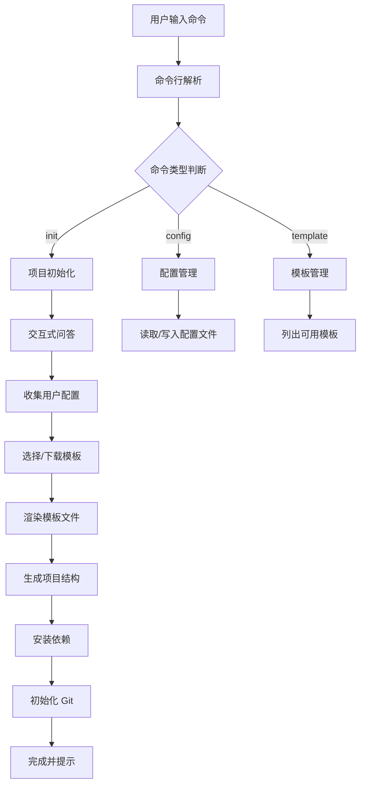

# Node.js 脚手架开发指南

## 1. 引言

### 1.1. 什么是脚手架

脚手架（Scaffold）是前端和后端开发中不可或缺的工具，它能够根据预设的模板和配置，快速生成项目的基本结构、配置文件和示例代码。使用脚手架可以显著提升开发效率，统一团队技术栈，并降低项目初始化的复杂度。

**典型应用场景**：

- 项目初始化：如 `create-react-app`、`vue-cli`、`angular-cli`
- 代码生成：自动生成组件、页面、路由等模板代码
- 项目配置：统一 ESLint、Prettier、TypeScript 等配置
- 团队规范：强制执行团队编码规范和项目结构标准

### 1.2. 为什么需要 Node.js 脚手架

- **自动化**：自动完成项目创建、配置、依赖安装等重复性工作。
- **标准化**：确保团队成员使用统一的项目结构、编码规范和构建流程。
- **高效率**：几条命令即可搭建一个功能完备的开发环境，让开发者专注于业务逻辑。
- **可维护性**：集中管理项目模板和配置，便于统一升级和维护。

## 2. 系统架构

### 2.1. 脚手架工作流程



### 2.2. 核心模块架构

```
┌─────────────────────────────────────────────────────────────┐
│                        CLI 入口层                            │
│                    (bin/cli.js)                             │
└─────────────────────────────────────────────────────────────┘
                              │
        ┌─────────────────────┼─────────────────────┐
        ▼                     ▼                     ▼
┌───────────────┐    ┌───────────────┐    ┌───────────────┐
│ 命令解析模块   │    │ 交互式问答模块 │    │ 工具函数模块   │
│ (commander)   │    │ (inquirer)    │    │ (utils)       │
└───────────────┘    └───────────────┘    └───────────────┘
        │                     │                     │
        └─────────────────────┼─────────────────────┘
                              ▼
┌─────────────────────────────────────────────────────────────┐
│                      业务逻辑层                              │
│         (commands/init.js, commands/config.js)              │
└─────────────────────────────────────────────────────────────┘
                              │
        ┌─────────────────────┼─────────────────────┐
        ▼                     ▼                     ▼
┌───────────────┐    ┌───────────────┐    ┌───────────────┐
│ 模板引擎模块   │    │ 文件操作模块   │    │ 网络请求模块   │
│ (ejs/handlebars)│   │ (fs-extra)    │    │ (axios)       │
└───────────────┘    └───────────────┘    └───────────────┘
                              │
                              ▼
┌─────────────────────────────────────────────────────────────┐
│                      输出展示层                              │
│              (chalk, ora, console)                          │
└─────────────────────────────────────────────────────────────┘
```

### 2.3. 典型目录结构

```
my-cli/
├── bin/
│   └── cli.js              # CLI 入口文件
├── lib/
│   ├── creator.js          # 项目创建核心逻辑
│   ├── generator.js        # 文件生成器
│   └── utils.js            # 工具函数
├── commands/
│   ├── init.js             # init 命令实现
│   ├── config.js           # config 命令实现
│   └── list.js             # list 命令实现
├── templates/              # 本地模板目录
│   ├── vue/
│   ├── react/
│   └── node/
├── package.json
└── README.md
```

## 3. 核心模块介绍

详细的模块介绍请参考：[脚手架核心模块详解](02-脚手架核心模块.md)

本章节已提取为独立文档，包含：
- 命令行交互模块（Commander、Inquirer、Yargs）
- 文件与目录操作模块（fs-extra、mem-fs、globby）
- 模板处理模块（EJS、Handlebars）
- 终端美化与提示模块（chalk、ora、update-notifier）
- 其他实用模块（download-git-repo、cross-spawn）

## 4. 脚手架开发基本步骤

### 4.1. 初始化项目

首先，创建项目目录并初始化 `package.json` 文件。

```bash
# 创建项目目录并进入
mkdir my-cli && cd my-cli

# 初始化 package.json
npm init -y

# 安装核心依赖（CLI 运行时依赖，应装入 dependencies 而非 devDependencies）
pnpm add commander inquirer fs-extra ejs chalk ora
```

**package.json 配置说明**：

```json
{
  "name": "my-cli",
  "version": "1.0.0",
  "description": "一个简单的脚手架工具",
  "main": "bin/cli.js",
  "bin": {
    "my-cli": "bin/cli.js"
  },
  "files": [
    "bin",
    "lib",
    "commands",
    "templates"
  ],
  "keywords": [
    "cli",
    "scaffold",
    "generator"
  ],
  "author": "Your Name",
  "license": "MIT",
  "engines": {
    "node": ">=14.0.0"
  }
}
```

**字段说明**：
- `bin`: 定义命令行工具的入口文件，键名为命令名称
- `files`: 指定发布到 npm 时包含的文件
- `engines`: 指定 Node.js 版本要求

### 4.2. 创建 CLI 入口文件

在项目根目录创建 `bin/cli.js` 文件，并添加 `shebang`，使其可以作为脚本直接执行。

```javascript
#!/usr/bin/env node

const { program } = require('commander')
const { version } = require('../package.json')

// 设置命令行工具的基本信息
program
  .name('my-cli')
  .version(version, '-v, --version', '查看当前版本')
  .description('一个简单的脚手架工具')

// 注册 init 命令
program
  .command('init <project-name>')
  .alias('i')
  .description('初始化一个新项目')
  .option('-f, --force', '强制覆盖已存在的目录')
  .option('-t, --template <template>', '指定模板名称')
  .action((projectName, options) => {
    require('../commands/init')(projectName, options)
  })

// 注册 list 命令
program
  .command('list')
  .alias('ls')
  .description('列出所有可用模板')
  .action(() => {
    require('../commands/list')()
  })

// 解析命令行参数
program.parse(process.argv)

// 如果没有输入任何命令，显示帮助信息
if (!process.argv.slice(2).length) {
  program.outputHelp()
}
```

**重要提示**：
- `#!/usr/bin/env node` 是 shebang 声明，告诉系统使用 Node.js 执行此文件
- `#!/usr/bin/env node` 比 `#!/usr/bin/node` 更具跨平台兼容性
- 文件需要具有可执行权限（在 macOS/Linux 上执行 `chmod +x bin/cli.js`）

### 4.3. 实现 `init` 命令

创建 `commands/init.js` 文件，用于处理项目初始化逻辑。

```javascript
const inquirer = require("inquirer")
const fs = require("fs-extra")
const path = require("path")
const chalk = require("chalk")
const ora = require("ora")
const { render } = require("ejs")

module.exports = async (projectName) => {
  // 1. 检查目录是否存在
  const dest = path.join(process.cwd(), projectName)
  if (fs.existsSync(dest)) {
    console.log(chalk.red("错误：目录已存在！"))
    process.exit(1)
  }

  // 2. 收集用户输入
  const answers = await inquirer.prompt([
    {
      type: "input",
      name: "description",
      message: "请输入项目描述:",
      default: "A new project"
    },
    {
      type: "list",
      name: "template",
      message: "请选择一个模板:",
      choices: ["vue", "react", "node"]
    }
  ])

  // 3. 复制模板文件
  const spinner = ora("正在生成项目...").start()
  try {
    const templatePath = path.join(__dirname, `../templates/${answers.template}`)
    await fs.copy(templatePath, dest)

    // 4. 使用 EJS 处理模板变量
    const pkgPath = path.join(dest, "package.json")
    if (fs.existsSync(pkgPath)) {
      const content = await fs.readFile(pkgPath, "utf-8")
      const newContent = render(content, {
        name: projectName,
        description: answers.description
      })
      await fs.writeFile(pkgPath, newContent)
    }

    spinner.succeed(chalk.green("项目创建成功！"))
    console.log(
      chalk.cyan(`
      下一步:
      $ cd ${projectName}
      $ npm install
      $ npm run dev
    `)
    )
  } catch (err) {
    spinner.fail(chalk.red("项目创建失败"))
    console.error(err)
    process.exit(1)
  }
}
```

### 4.4. 创建项目模板

在项目根目录下创建 `templates` 文件夹，并为每种技术栈创建对应的模板。

```
templates/
├── vue/
│   ├── public/
│   ├── src/
│   └── package.json  // 使用 ejs 变量，如 <%= name %>
├── react/
│   └── ...
└── node/
    └── ...
```

`templates/vue/package.json` 示例：

```json
{
  "name": "<%= name %>",
  "version": "1.0.0",
  "description": "<%= description %>",
  "main": "index.js",
  "scripts": {
    "dev": "vite"
  }
}
```

## 5. 高级功能实现

### 5.1. 动态获取远程模板

从远程 Git 仓库获取模板列表，使用户可以动态选择。

```javascript
// 需要安装 axios: pnpm add axios
const axios = require("axios")

async function getRemoteTemplates() {
  try {
    // 替换为你的模板仓库 API
    const { data } = await axios.get("https://api.github.com/orgs/your-org/repos")
    return data.map((item) => item.name)
  } catch (error) {
    console.error(chalk.red("获取远程模板失败:"), error)
    return []
  }
}
```

### 5.2. 自动安装依赖

在项目创建成功后，自动执行 `npm install`。

```javascript
// 使用 cross-spawn 保证跨平台兼容性
const spawn = require("cross-spawn")

function installDependencies(targetDir) {
  return new Promise((resolve, reject) => {
    const child = spawn("npm", ["install"], {
      cwd: targetDir,
      stdio: "inherit" // 将子进程的 stdio 连接到父进程
    })

    child.on("close", (code) => {
      if (code !== 0) {
        reject(new Error("依赖安装失败！"))
        return
      }
      resolve()
    })
  })
}

// 在 init 命令成功后调用
// await installDependencies(dest);
```

### 5.3. 添加更新检查机制

在 CLI 入口文件 `bin/cli.js` 中添加更新通知功能。

```javascript
#!/usr/bin/env node

const updateNotifier = require("update-notifier")
const pkg = require("../package.json")

// 检查更新，每天检查一次
const notifier = updateNotifier({ pkg })
notifier.notify()

// ... 其他代码
```

## 6. 发布与测试

### 6.1. 发布到 npm

```bash
# 1. 登录 npm (需要有 npm 账号)
npm login

# 2. 发布包
npm publish
```

**发布注意事项**：

1. **包名唯一性**：确保包名在 npm 上未被占用
2. **版本管理**：遵循语义化版本规范（SemVer）
3. **README 文档**：提供清晰的使用说明和示例
4. **License**：添加开源许可证
5. **.npmignore**：排除不必要的文件

```bash
# 发布前检查
npm publish --dry-run

# 发布 beta 版本
npm publish --tag beta

# 发布作用域包（如 @org/my-cli）
npm publish --access public
```

### 6.2. 本地测试

在发布前，可以使用 `npm link` 在本地模拟全局安装。

```bash
# 在项目根目录执行
npm link

# 现在可以在任何地方测试你的命令
my-cli init test-project

# 测试完成后，取消链接
npm unlink -g my-cli
```

### 6.3. 全局安装测试

发布成功后，可以通过全局安装来测试。

```bash
# 全局安装
npm install -g my-cli

# 使用脚手架
my-cli init my-awesome-project

# 查看帮助
my-cli --help
```

## 7. API 接口说明

### 7.1. Commander API

#### 命令定义

```javascript
// 定义命令
program.command('init <name>')
  .description('初始化项目')
  .alias('i')              // 命令别名
  .option('-f, --force')   // 命令选项
  .action((name, options) => {
    // 处理逻辑
  })

// 定义子命令（command() 返回新建的命令对象，需用变量承接后再挂子命令）
const config = program
  .command('config')
  .description('配置管理')

config.command('set <key> <value>', '设置配置项')
config.command('get <key>', '获取配置项')
```

#### 选项定义

```javascript
// 基础选项
program.option('-d, --debug', '启用调试模式')
program.option('-p, --port <number>', '端口号', '3000')

// 必填选项
program.requiredOption('-n, --name <name>', '项目名称')

// 带默认值的选项
program.option('-t, --template <name>', '模板名称', 'vue')

// 变长参数选项
program.option('-f, --files <files...>', '文件列表')
```

### 7.2. Inquirer API

#### 问题类型

```javascript
// 文本输入
{
  type: 'input',
  name: 'projectName',
  message: '项目名称',
  default: 'my-project',
  validate: (input) => input.length > 0 || '名称不能为空'
}

// 密码输入
{
  type: 'password',
  name: 'token',
  message: 'API Token',
  mask: '*'
}

// 单选列表
{
  type: 'list',
  name: 'template',
  message: '选择模板',
  choices: ['vue', 'react', 'node']
}

// 多选列表
{
  type: 'checkbox',
  name: 'features',
  message: '选择功能',
  choices: [
    { name: 'ESLint', value: 'eslint', checked: true },
    { name: 'Prettier', value: 'prettier' }
  ]
}

// 确认提示
{
  type: 'confirm',
  name: 'continue',
  message: '是否继续？',
  default: true
}
```

### 7.3. fs-extra API

```javascript
// 文件操作
await fs.copy(src, dest)              // 复制
await fs.move(src, dest)              // 移动
await fs.remove(path)                 // 删除
await fs.emptyDir(dir)                // 清空目录

// 文件读写
await fs.readJson(file)               // 读取 JSON
await fs.writeJson(file, obj, { spaces: 2 })  // 写入 JSON
await fs.readFile(file, 'utf-8')      // 读取文件
await fs.writeFile(file, content)     // 写入文件

// 目录操作
await fs.ensureDir(dir)               // 确保目录存在
await fs.ensureFile(file)             // 确保文件存在

// 检查
fs.existsSync(path)                   // 同步检查是否存在
await fs.pathExists(path)             // 异步检查是否存在
```

## 8. 配置参数详解

### 8.1. package.json 配置

```json
{
  "name": "my-cli",
  "version": "1.0.0",
  "description": "脚手架工具描述",
  "main": "bin/cli.js",
  "bin": {
    "my-cli": "bin/cli.js",
    "mc": "bin/cli.js"
  },
  "files": [
    "bin",
    "lib",
    "commands",
    "templates"
  ],
  "keywords": ["cli", "scaffold", "generator"],
  "author": "Your Name",
  "license": "MIT",
  "repository": {
    "type": "git",
    "url": "https://github.com/username/my-cli"
  },
  "bugs": {
    "url": "https://github.com/username/my-cli/issues"
  },
  "homepage": "https://github.com/username/my-cli#readme",
  "engines": {
    "node": ">=14.0.0"
  },
  "dependencies": {
    "commander": "^11.0.0",
    "inquirer": "^8.2.0",
    "fs-extra": "^11.0.0",
    "ejs": "^3.1.0",
    "chalk": "^4.1.0",
    "ora": "^5.4.0"
  },
  "devDependencies": {
    "jest": "^29.0.0"
  }
}
```

### 8.2. 模板配置文件

创建 `.clirc` 或 `cli.config.js` 配置文件：

```javascript
// cli.config.js
module.exports = {
  // 模板配置
  templates: [
    {
      name: 'Vue 3 + TypeScript',
      value: 'vue-ts',
      repository: 'github:username/vue-template'
    },
    {
      name: 'React + TypeScript',
      value: 'react-ts',
      repository: 'github:username/react-template'
    }
  ],
  
  // 默认配置
  defaults: {
    author: 'Your Name',
    license: 'MIT',
    packageManager: 'pnpm'
  },
  
  // 忽略文件
  ignore: [
    'node_modules',
    '.git',
    'dist',
    '*.log'
  ]
}
```

### 8.3. 环境变量配置

```bash
# .env
CLI_REGISTRY=https://registry.npmmirror.com
CLI_TEMPLATE_REPO=https://github.com/username/templates
CLI_DEBUG=false
```

## 9. 最佳实践

### 9.1. 错误处理

```javascript
// 统一错误处理
process.on('uncaughtException', (error) => {
  console.error(chalk.red('未捕获的异常:'), error.message)
  process.exit(1)
})

process.on('unhandledRejection', (reason) => {
  console.error(chalk.red('未处理的 Promise 拒绝:'), reason)
  process.exit(1)
})

// 命令错误处理
program.exitOverride((error) => {
  if (error.code === 'commander.help') {
    process.exit(0)
  }
  console.error(chalk.red(error.message))
  process.exit(1)
})
```

### 9.2. 日志管理

```javascript
// lib/logger.js
const chalk = require('chalk')

class Logger {
  info(message) {
    console.log(chalk.blue('ℹ'), message)
  }
  
  success(message) {
    console.log(chalk.green('✓'), message)
  }
  
  warn(message) {
    console.log(chalk.yellow('⚠'), message)
  }
  
  error(message) {
    console.log(chalk.red('✗'), message)
  }
  
  debug(message) {
    if (process.env.DEBUG) {
      console.log(chalk.gray('[DEBUG]'), message)
    }
  }
}

module.exports = new Logger()
```

### 9.3. 模板变量最佳实践

```javascript
// 模板变量命名规范
const templateData = {
  // 基本信息
  name: projectName,
  description: answers.description,
  author: answers.author,
  version: '1.0.0',
  
  // 功能开关
  typescript: answers.features.includes('typescript'),
  eslint: answers.features.includes('eslint'),
  prettier: answers.features.includes('prettier'),
  
  // 路径信息
  projectDir: dest,
  templateDir: templatePath,
  
  // 时间戳
  year: new Date().getFullYear(),
  date: new Date().toLocaleDateString('zh-CN')
}
```

### 9.4. 性能优化

```javascript
// 并发处理（p-queue v7+ 仅提供 ESM，CommonJS 项目请使用 p-queue@6）
const { default: PQueue } = require('p-queue')

const queue = new PQueue({ concurrency: 5 })

// 并发处理文件
const files = await globby('**/*', { cwd: templateDir })
await Promise.all(
  files.map(file => 
    queue.add(() => processTemplate(file, templateData))
  )
)

// 缓存机制
const cache = new Map()

async function getTemplate(name) {
  if (cache.has(name)) {
    return cache.get(name)
  }
  const template = await downloadTemplate(name)
  cache.set(name, template)
  return template
}
```

## 10. 常见问题解答

### 10.1. 安装和使用问题

**Q: 全局安装后命令找不到？**

```bash
# 检查安装路径
npm config get prefix

# 确保 PATH 包含 npm 全局路径
export PATH=$(npm config get prefix)/bin:$PATH

# 或重新安装
npm uninstall -g my-cli
npm install -g my-cli
```

**Q: 权限被拒绝错误？**

```bash
# macOS/Linux: 给文件添加执行权限
chmod +x bin/cli.js

# 或修改 npm 默认目录
mkdir ~/.npm-global
npm config set prefix '~/.npm-global'
```

**Q: Windows 下命令无法执行？**

确保 `package.json` 中的 `bin` 路径使用正斜杠：

```json
{
  "bin": {
    "my-cli": "./bin/cli.js"
  }
}
```

### 10.2. 开发问题

**Q: 如何调试脚手架？**

```bash
# 方法 1: 使用 node 直接运行
node bin/cli.js init test-project

# 方法 2: 启用调试模式
DEBUG=* my-cli init test-project

# 方法 3: 使用 node --inspect
node --inspect bin/cli.js init test-project
```

**Q: 如何处理模板中的特殊字符？**

```javascript
// EJS: 使用转义
{
  "name": "<%= name.replace(/"/g, '\\"') %>"
}

// 或在渲染前预处理
const escapeJson = (str) => str.replace(/"/g, '\\"')
const data = { name: escapeJson(projectName) }
```

**Q: 如何实现插件系统？**

```javascript
// lib/plugin.js
class PluginManager {
  constructor() {
    this.plugins = new Map()
  }
  
  register(name, plugin) {
    this.plugins.set(name, plugin)
  }
  
  async apply(name, context) {
    const plugin = this.plugins.get(name)
    if (plugin) {
      await plugin(context)
    }
  }
}

// 使用
const plugins = new PluginManager()
plugins.register('eslint', eslintPlugin)
plugins.register('prettier', prettierPlugin)
```

### 10.3. 发布问题

**Q: 包名已被占用怎么办？**

```bash
# 使用作用域包名
npm init --scope=@your-org

# 或使用不同的名称
npm search your-package-name
```

**Q: 如何发布 beta 版本？**

```bash
# 修改版本号
npm version 2.0.0-beta.1

# 发布 beta 版本
npm publish --tag beta

# 安装 beta 版本
npm install -g my-cli@beta
```

### 10.4. 兼容性问题

**Q: 如何确保跨平台兼容性？**

```javascript
// 使用 cross-spawn 执行命令
const spawn = require('cross-spawn')

// 使用 path 处理路径
const path = require('path')
const filePath = path.join('dir', 'file.txt')

// 使用 os 获取用户目录
const os = require('os')
const homeDir = os.homedir()
```

**Q: 如何检查 Node.js 版本？**

```javascript
const semver = require('semver')
const { engines } = require('./package.json')

const version = engines.node
if (!semver.satisfies(process.version, version)) {
  console.error(chalk.red(
    `需要 Node.js ${version}，当前版本 ${process.version}`
  ))
  process.exit(1)
}
```

## 11. 总结

### 11.1. 核心要点

1. **模块化设计**：将功能拆分为独立模块，便于维护和扩展
2. **用户体验**：提供友好的交互界面和清晰的提示信息
3. **错误处理**：完善的错误处理和日志记录
4. **性能优化**：使用缓存、并发等技术提升执行效率
5. **跨平台兼容**：确保在不同操作系统上正常运行

### 11.2. 进阶方向

- **插件系统**：支持第三方插件扩展功能
- **模板市场**：集成在线模板市场
- **配置管理**：提供可视化配置管理界面
- **项目升级**：支持项目版本升级和迁移
- **AI 辅助**：集成 AI 能力智能生成代码

### 11.3. 学习资源

- [Commander.js 文档](https://github.com/tj/commander.js)
- [Inquirer.js 文档](https://github.com/SBoudrias/Inquirer.js)
- [fs-extra 文档](https://github.com/jprichardson/node-fs-extra)
- [EJS 文档](https://ejs.co/)
- [npm 开发指南](https://docs.npmjs.com/cli/v9/using-npm/developers)
