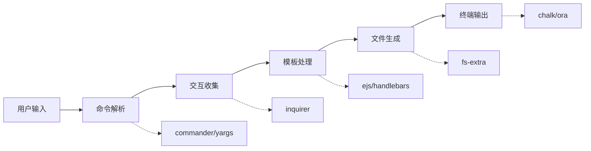

# 脚手架核心模块

## 1. 概述

开发一个功能强大的 Node.js 脚手架，需要组合使用多类核心模块。本文档详细介绍各个模块的功能特性、使用方法和最佳实践。

### 1.1 模块分类

```
┌─────────────────────────────────────────────────────────┐
│                  脚手架核心模块架构                       │
└─────────────────────────────────────────────────────────┘
                           │
       ┌───────────────────┼───────────────────┐
       │                   │                   │
   ┌───▼────┐        ┌────▼─────┐       ┌────▼────┐
   │命令行  │        │ 文件操作 │       │ 模板    │
   │交互模块│        │ 模块     │       │ 处理模块│
   └────────┘        └──────────┘       └─────────┘
       │                   │                   │
       └───────────────────┼───────────────────┘
                           │
       ┌───────────────────┼───────────────────┐
       │                   │                   │
   ┌───▼────┐        ┌────▼─────┐       ┌────▼────┐
   │终端美化│        │ 其他实用 │       │ 工具库  │
   │提示模块│        │ 模块     │       │         │
   └────────┘        └──────────┘       └─────────┘
```

### 1.2 模块职责

| 模块类别 | 主要职责 | 代表库 |
|---------|---------|--------|
| 命令行交互 | 解析命令参数、用户输入收集 | commander, inquirer, yargs |
| 文件操作 | 文件读写、目录管理、模板复制 | fs-extra, mem-fs, globby |
| 模板处理 | 动态渲染、变量替换、代码生成 | ejs, handlebars, mustache |
| 终端美化 | 输出着色、进度提示、动画效果 | chalk, ora, cli-table |
| 其他工具 | Git 操作、子进程、网络请求 | download-git-repo, cross-spawn |

## 2. 系统架构

### 2.1 数据流架构



### 2.2 模块协作示例

```javascript
// 典型的模块协作流程
const { program } = require('commander')    // 命令解析
const inquirer = require('inquirer')        // 交互收集
const fs = require('fs-extra')              // 文件操作
const ejs = require('ejs')                  // 模板渲染
const chalk = require('chalk')              // 终端美化
const ora = require('ora')                  // 进度提示

async function createProject(name) {
  // 1. 收集用户输入
  const answers = await inquirer.prompt([...])
  
  // 2. 加载并渲染模板
  const spinner = ora('生成项目中...').start()
  const template = await ejs.renderFile('template.ejs', answers)
  
  // 3. 写入文件
  await fs.writeFile(`./${name}/index.js`, template)
  
  // 4. 提示结果
  spinner.succeed(chalk.green('项目创建成功!'))
}
```

## 3. 命令行交互模块

这类模块负责解析命令行参数，并提供丰富的交互式界面。

### 3.1. commander

完整的 Node.js 命令行解决方案，功能强大，API 设计优雅。

#### 核心特性

- ✅ 支持子命令和参数解析
- ✅ 自动生成帮助信息
- ✅ 支持选项默认值、必填选项
- ✅ 支持命令别名和参数验证
- ✅ 支持 TypeScript 类型定义

#### 安装

```bash
# 安装最新版本
pnpm install commander

# 或使用 npm
npm install commander
```

#### 版本说明

| 版本 | Node.js 要求 | 模块类型 | 推荐场景 |
|------|-------------|---------|---------|
| 11.x+ | Node.js 16+ | 双模式（ESM + CommonJS） | 新项目 |
| 9.x-10.x | Node.js 14+ | 双模式（ESM + CommonJS） | 现有项目 |
| 8.x | Node.js 12+ | CommonJS | 旧项目维护 |

#### 基础用法

```javascript
const { program } = require('commander')

// 设置程序信息
program
  .name('my-cli')
  .description('一个现代化的脚手架工具')
  .version('1.0.0', '-v, --version', '查看当前版本')

// 定义全局选项
program
  .option('-d, --debug', '启用调试模式')
  .option('-c, --config <path>', '指定配置文件路径')

// 定义 init 命令
program
  .command('init <project-name>')
  .alias('i')
  .description('初始化一个新项目')
  .option('-f, --force', '强制覆盖已存在的目录')
  .option('-t, --template <name>', '指定模板名称', 'vue')
  .option('--no-git', '不初始化 Git 仓库')
  .action((projectName, options) => {
    console.log(`创建项目: ${projectName}`)
    console.log(`模板: ${options.template}`)
    console.log(`强制覆盖: ${options.force}`)
  })

// 定义 add 命令
program
  .command('add <type> [name]')
  .description('添加新组件或页面')
  .action((type, name, options) => {
    console.log(`添加 ${type}: ${name || '默认名称'}`)
  })

// 解析命令行参数
program.parse(process.argv)

// 未提供命令时显示帮助
if (!process.argv.slice(2).length) {
  program.outputHelp()
}
```

#### 高级用法

##### 1. 自定义参数处理

```javascript
const { program, InvalidArgumentError } = require('commander')

program
  .option('-p, --port <number>', '端口号', (value) => {
    const port = parseInt(value, 10)
    if (isNaN(port) || port < 1 || port > 65535) {
      throw new InvalidArgumentError('端口号必须在 1-65535 之间')
    }
    return port
  }, 3000)
```

##### 2. 可变参数

```javascript
program
  .command('install [packages...]')
  .description('安装依赖包')
  .action((packages) => {
    if (packages.length === 0) {
      console.log('安装所有依赖')
    } else {
      console.log(`安装: ${packages.join(', ')}`)
    }
  })
```

##### 3. 必填选项

```javascript
program
  .command('deploy')
  .requiredOption('-e, --env <environment>', '部署环境')
  .requiredOption('-t, --token <token>', '访问令牌')
  .action((options) => {
    console.log(`部署到 ${options.env}`)
  })
```

##### 4. 命令钩子

```javascript
program
  .hook('preAction', (thisCommand, actionCommand) => {
    console.log(`即将执行命令: ${actionCommand.name()}`)
  })
  .hook('postAction', (thisCommand, actionCommand) => {
    console.log('命令执行完成')
  })
```

#### 常用 API 详解

| API | 说明 | 示例 |
|-----|------|------|
| `.name(name)` | 设置命令名称 | `.name('my-cli')` |
| `.version(version, flags, description)` | 设置版本 | `.version('1.0.0', '-v, --version')` |
| `.description(desc)` | 设置描述 | `.description('初始化项目')` |
| `.option(flags, description, defaultValue)` | 定义选项 | `.option('-d, --debug', '调试模式')` |
| `.requiredOption(flags, description)` | 必填选项 | `.requiredOption('-n, --name <name>')` |
| `.command(name)` | 定义子命令 | `.command('init <name>')` |
| `.alias(alias)` | 设置别名 | `.alias('i')` |
| `.argument(spec, description, defaultValue)` | 定义参数 | `.argument('<name>', '项目名称')` |
| `.action(callback)` | 设置处理函数 | `.action((name) => {...})` |
| `.hook(event, callback)` | 设置钩子 | `.hook('preAction', callback)` |

#### 完整示例

```javascript
#!/usr/bin/env node

const { program } = require('commander')
const pkg = require('../package.json')

program
  .name('my-cli')
  .version(pkg.version)
  .description('现代化的项目脚手架工具')

// init 命令
program
  .command('init [name]')
  .description('初始化新项目')
  .option('-t, --template <template>', '选择模板', 'vue')
  .option('-f, --force', '强制覆盖目录')
  .option('--no-install', '跳过依赖安装')
  .action(async (name, options) => {
    const projectName = name || 'my-project'
    console.log(`创建项目: ${projectName}`)
    console.log(`使用模板: ${options.template}`)
    
    if (options.force) {
      console.log('警告: 将覆盖现有目录')
    }
  })

// add 命令
program
  .command('add <type>')
  .description('添加组件/页面/服务')
  .argument('[name]', '名称', 'default')
  .option('-p, --path <path>', '指定路径')
  .action((type, name, options) => {
    console.log(`添加 ${type}: ${name}`)
  })

// config 命令（command() 返回新建的命令对象，需用变量承接后再挂子命令）
const config = program
  .command('config')
  .description('配置管理')

config.command('set <key> <value>', '设置配置项')
config.command('get <key>', '获取配置项')
config.command('list', '列出所有配置')

program.parse()
```

### 3.2. inquirer

强大的交互式命令行工具，提供多种交互方式。

#### 核心特性

- ✅ 多种问题类型（输入、选择、确认等）
- ✅ 输入验证和过滤
- ✅ 条件性问题（基于前面的答案）
- ✅ 异步验证支持
- ✅ 可定制 UI 样式

#### 安装

```bash
# CommonJS 项目使用 8.x 版本（推荐）
pnpm install inquirer@8

# ES Module 项目使用最新版
pnpm install inquirer

# TypeScript 支持
pnpm install @types/inquirer -D
```

#### 版本差异

| 版本 | 模块类型 | 特点 |
|------|---------|------|
| 9.x+ | ESM | 现代化 API，支持 TypeScript |
| 8.x | CommonJS | 稳定版本，兼容性好 |
| 7.x | CommonJS | 长期支持版本 |

#### 问题类型详解

##### 1. input - 文本输入

```javascript
{
  type: 'input',
  name: 'projectName',
  message: '请输入项目名称:',
  default: 'my-project',
  // 输入验证
  validate: (input) => {
    if (!input.trim()) {
      return '项目名称不能为空'
    }
    if (!/^[a-zA-Z0-9-_]+$/.test(input)) {
      return '只能包含字母、数字、中划线和下划线'
    }
    if (input.length > 50) {
      return '项目名称不能超过 50 个字符'
    }
    return true
  },
  // 输入过滤
  filter: (input) => input.trim().toLowerCase(),
  // 转换显示
  transformer: (input) => `📁 ${input}`
}
```

##### 2. number - 数字输入

```javascript
{
  type: 'number',
  name: 'port',
  message: '请输入端口号:',
  default: 3000,
  validate: (value) => {
    if (value < 1 || value > 65535) {
      return '端口号必须在 1-65535 之间'
    }
    return true
  }
}
```

##### 3. password - 密码输入

```javascript
{
  type: 'password',
  name: 'token',
  message: '请输入访问令牌:',
  mask: '*',  // 显示的遮罩字符
  validate: (input) => {
    if (input.length < 10) {
      return '令牌长度至少为 10 个字符'
    }
    return true
  }
}
```

##### 4. list - 单选列表

```javascript
{
  type: 'list',
  name: 'template',
  message: '请选择项目模板:',
  choices: [
    { name: 'Vue 3 + TypeScript + Vite', value: 'vue-ts' },
    { name: 'React 18 + TypeScript + Vite', value: 'react-ts' },
    { name: 'Node.js + Express', value: 'node-express' },
    new inquirer.Separator('--- 其他模板 ---'),
    { name: '自定义模板', value: 'custom' }
  ],
  default: 'vue-ts',
  pageSize: 10  // 显示的选项数量
}
```

##### 5. rawlist - 带序号的单选

```javascript
{
  type: 'rawlist',
  name: 'packageManager',
  message: '选择包管理器:',
  choices: ['npm', 'yarn', 'pnpm'],
  default: 0  // 默认选中的索引
}
```

##### 6. checkbox - 多选列表

```javascript
{
  type: 'checkbox',
  name: 'features',
  message: '请选择需要的功能:',
  choices: [
    { name: 'ESLint (代码检查)', value: 'eslint', checked: true },
    { name: 'Prettier (代码格式化)', value: 'prettier', checked: true },
    { name: 'Husky (Git 钩子)', value: 'husky' },
    { name: 'Commitlint (提交规范)', value: 'commitlint' },
    { name: 'TypeScript', value: 'typescript' },
    { name: 'Jest (单元测试)', value: 'jest' }
  ],
  validate: (answer) => {
    if (answer.length < 1) {
      return '请至少选择一个功能'
    }
    return true
  }
}
```

##### 7. confirm - 确认提示

```javascript
{
  type: 'confirm',
  name: 'installDeps',
  message: '是否自动安装依赖?',
  default: true
}
```

##### 8. editor - 编辑器输入

```javascript
{
  type: 'editor',
  name: 'description',
  message: '请输入项目描述（将打开编辑器）:',
  default: '# 项目描述\n\n请在这里填写...',
  postfix: '.md'  // 文件后缀
}
```

##### 9. expand - 扩展选择

```javascript
{
  type: 'expand',
  name: 'overwrite',
  message: '目录已存在，如何处理?',
  choices: [
    { key: 'o', name: '覆盖', value: 'overwrite' },
    { key: 'm', name: '合并', value: 'merge' },
    { key: 'c', name: '取消', value: 'cancel' }
  ],
  default: 'overwrite'
}
```

#### 条件性问题

```javascript
const questions = [
  {
    type: 'list',
    name: 'projectType',
    message: '选择项目类型:',
    choices: ['frontend', 'backend', 'fullstack']
  },
  {
    type: 'list',
    name: 'framework',
    message: '选择前端框架:',
    choices: ['vue', 'react', 'angular'],
    // 仅当项目类型为 frontend 或 fullstack 时显示
    when: (answers) => ['frontend', 'fullstack'].includes(answers.projectType)
  },
  {
    type: 'list',
    name: 'backendFramework',
    message: '选择后端框架:',
    choices: ['express', 'koa', 'nest'],
    // 仅当项目类型为 backend 或 fullstack 时显示
    when: (answers) => ['backend', 'fullstack'].includes(answers.projectType)
  },
  {
    type: 'checkbox',
    name: 'features',
    message: '选择额外功能:',
    choices: (answers) => {
      const baseFeatures = [
        { name: 'ESLint', value: 'eslint', checked: true },
        { name: 'Prettier', value: 'prettier', checked: true }
      ]
      
      // 根据项目类型添加特定选项
      if (answers.framework === 'vue') {
        baseFeatures.push({ name: 'Vue Router', value: 'router' })
        baseFeatures.push({ name: 'Pinia', value: 'pinia' })
      } else if (answers.framework === 'react') {
        baseFeatures.push({ name: 'React Router', value: 'router' })
        baseFeatures.push({ name: 'Redux Toolkit', value: 'redux' })
      }
      
      return baseFeatures
    }
  }
]
```

#### 完整示例

```javascript
const inquirer = require('inquirer')
const fs = require('fs-extra')
const path = require('path')

async function promptUser() {
  const questions = [
    {
      type: 'input',
      name: 'projectName',
      message: '项目名称:',
      default: path.basename(process.cwd()),
      validate: (input) => {
        if (!input.trim()) return '项目名称不能为空'
        if (!/^[a-zA-Z0-9-_]+$/.test(input)) {
          return '只能包含字母、数字、中划线和下划线'
        }
        return true
      }
    },
    {
      type: 'input',
      name: 'description',
      message: '项目描述:',
      default: 'A new project'
    },
    {
      type: 'input',
      name: 'author',
      message: '作者:',
      default: process.env.USER || 'Your Name'
    },
    {
      type: 'list',
      name: 'template',
      message: '选择模板:',
      choices: [
        { name: 'Vue 3 + TypeScript', value: 'vue-ts' },
        { name: 'React 18 + TypeScript', value: 'react-ts' },
        { name: 'Node.js + Express', value: 'node-express' }
      ]
    },
    {
      type: 'checkbox',
      name: 'features',
      message: '选择功能:',
      choices: [
        { name: 'ESLint', value: 'eslint', checked: true },
        { name: 'Prettier', value: 'prettier', checked: true },
        { name: 'Husky', value: 'husky' },
        { name: 'TypeScript', value: 'typescript' }
      ]
    },
    {
      type: 'confirm',
      name: 'git',
      message: '初始化 Git 仓库?',
      default: true
    },
    {
      type: 'confirm',
      name: 'install',
      message: '自动安装依赖?',
      default: true
    }
  ]

  const answers = await inquirer.prompt(questions)
  console.log('\n配置信息:')
  console.log(JSON.stringify(answers, null, 2))
  
  return answers
}

// 执行
promptUser().catch(console.error)
```

### 3.3. yargs

另一个流行的命令行参数解析器，支持复杂的参数解析和命令构建。

#### 核心特性

- ✅ 功能丰富的参数解析
- ✅ 自动生成帮助信息
- ✅ 支持命令分组
- ✅ 支持管道输入
- ✅ 详细的错误提示

#### 安装

```bash
pnpm install yargs
```

#### 基础用法

```javascript
const yargs = require('yargs/yargs')
const { hideBin } = require('yargs/helpers')

yargs(hideBin(process.argv))
  .scriptName('my-cli')
  .usage('$0 <cmd> [args]')
  .command('init [name]', '初始化项目', (yargs) => {
    return yargs
      .positional('name', {
        type: 'string',
        describe: '项目名称',
        default: 'my-project'
      })
      .option('template', {
        alias: 't',
        type: 'string',
        describe: '模板名称',
        choices: ['vue', 'react', 'node'],
        default: 'vue'
      })
      .option('force', {
        alias: 'f',
        type: 'boolean',
        describe: '强制覆盖',
        default: false
      })
  }, (argv) => {
    console.log(`创建项目: ${argv.name}`)
    console.log(`模板: ${argv.template}`)
    if (argv.force) console.log('强制覆盖模式')
  })
  .command('add <type>', '添加组件', (yargs) => {
    return yargs.positional('type', {
      describe: '类型',
      choices: ['component', 'page', 'service']
    })
  }, (argv) => {
    console.log(`添加 ${argv.type}`)
  })
  .option('verbose', {
    alias: 'v',
    type: 'boolean',
    describe: '详细输出'
  })
  .demandCommand(1, '请指定一个命令')
  .help()
  .alias('help', 'h')
  .version()
  .alias('version', 'V')
  .epilog('更多信息请访问: https://github.com/user/my-cli')
  .parse()
```

#### Commander vs Yargs 对比

| 特性 | Commander | Yargs |
|------|-----------|-------|
| 学习曲线 | 简单 ⭐⭐ | 较复杂 ⭐⭐⭐ |
| 代码简洁性 | 简洁 ⭐⭐⭐⭐ | 较繁琐 ⭐⭐ |
| 文档质量 | 优秀 ⭐⭐⭐⭐⭐ | 良好 ⭐⭐⭐⭐ |
| TypeScript 支持 | 优秀 ⭐⭐⭐⭐⭐ | 良好 ⭐⭐⭐⭐ |
| 社区活跃度 | 高 ⭐⭐⭐⭐⭐ | 高 ⭐⭐⭐⭐ |
| 功能丰富性 | 标准 ⭐⭐⭐⭐ | 丰富 ⭐⭐⭐⭐⭐ |
| 自定义能力 | 良好 ⭐⭐⭐⭐ | 优秀 ⭐⭐⭐⭐⭐ |

**推荐选择**：
- 🥇 新项目：推荐 **Commander**（简单易用、文档清晰）
- 🥈 复杂场景：考虑 **Yargs**（功能更丰富）

## 4. 文件与目录操作模块

这些模块用于高效地创建、读取、复制和修改文件。

### 4.1. fs-extra

`fs` 模块的超集，提供了更多便利的文件操作方法。

#### 核心特性

- ✅ Promise 化的 API
- ✅ 自动创建不存在的目录
- ✅ 增强的错误处理
- ✅ 支持递归操作
- ✅ 完全兼容原生 fs

#### 安装

```bash
pnpm install fs-extra
```

#### 常用方法对比

| 原生 fs | fs-extra | 说明 |
|---------|----------|------|
| `fs.mkdirSync(path, { recursive: true })` | `fs.ensureDirSync(path)` | 更简洁 |
| `fs.readFileSync()` + `JSON.parse()` | `fs.readJsonSync()` | 直接读取 JSON |
| `fs.writeFileSync()` + `JSON.stringify()` | `fs.writeJsonSync()` | 直接写入 JSON |
| 手动实现 | `fs.copySync()` | 一键复制 |
| 手动实现 | `fs.emptyDirSync()` | 一键清空 |

#### 完整 API 列表

```javascript
const fs = require('fs-extra')

// ========== 文件操作 ==========

// 复制文件/目录
await fs.copy(src, dest, options)
fs.copySync(src, dest, options)

// 移动文件/目录
await fs.move(src, dest, options)
fs.moveSync(src, dest, options)

// 删除文件/目录
await fs.remove(path)
fs.removeSync(path)

// 清空目录（不删除目录本身）
await fs.emptyDir(path)
fs.emptyDirSync(path)

// ========== 文件读写 ==========

// 读取文件
const content = await fs.readFile(file, 'utf-8')
const content = fs.readFileSync(file, 'utf-8')

// 写入文件
await fs.writeFile(file, data, options)
fs.writeFileSync(file, data, options)

// 追加内容
await fs.appendFile(file, data)
fs.appendFileSync(file, data)

// 读取 JSON
const obj = await fs.readJson(file)
const obj = fs.readJsonSync(file)

// 写入 JSON
await fs.writeJson(file, obj, { spaces: 2 })
fs.writeJsonSync(file, obj, { spaces: 2 })

// ========== 目录操作 ==========

// 确保目录存在（不存在则创建）
await fs.ensureDir(dir)
fs.ensureDirSync(dir)

// 确保文件存在（不存在则创建空文件）
await fs.ensureFile(file)
fs.ensureFileSync(file)

// 创建目录结构（自动创建中间目录）
await fs.outputFile(file, data)
fs.outputFileSync(file, data)

// ========== 检查操作 ==========

// 检查路径是否存在
fs.existsSync(path)
await fs.pathExists(path)

// 获取文件状态
const stats = await fs.stat(path)
const stats = fs.statSync(path)

// 读取目录内容
const files = await fs.readdir(dir)
const files = fs.readdirSync(dir)
```

#### 实战示例

```javascript
const fs = require('fs-extra')
const path = require('path')

class ProjectCreator {
  constructor(projectName) {
    this.projectDir = path.join(process.cwd(), projectName)
  }
  
  async create() {
    // 1. 检查目录是否存在
    if (await fs.pathExists(this.projectDir)) {
      throw new Error('目录已存在')
    }
    
    // 2. 创建项目目录
    await fs.ensureDir(this.projectDir)
    
    // 3. 复制模板文件
    const templateDir = path.join(__dirname, 'templates/vue')
    await fs.copy(templateDir, this.projectDir, {
      overwrite: true,
      filter: (src) => {
        // 排除 node_modules
        return !src.includes('node_modules')
      }
    })
    
    // 4. 修改 package.json
    const pkgPath = path.join(this.projectDir, 'package.json')
    const pkg = await fs.readJson(pkgPath)
    pkg.name = path.basename(this.projectDir)
    pkg.version = '1.0.0'
    await fs.writeJson(pkgPath, pkg, { spaces: 2 })
    
    // 5. 创建额外目录
    await fs.ensureDir(path.join(this.projectDir, 'src/components'))
    await fs.ensureDir(path.join(this.projectDir, 'src/utils'))
    
    // 6. 创建 README.md
    await fs.outputFile(
      path.join(this.projectDir, 'README.md'),
      `# ${pkg.name}\n\n${pkg.description || '项目描述'}`
    )
    
    console.log('项目创建成功!')
  }
  
  async cleanup() {
    await fs.emptyDir(this.projectDir)
    await fs.remove(this.projectDir)
  }
}

// 使用
const creator = new ProjectCreator('my-project')
creator.create().catch(console.error)
```

### 4.2. mem-fs / mem-fs-editor

基于内存的文件系统，用于在内存中执行文件操作，提升模板处理效率。

#### 核心特性

- ✅ 内存中操作，性能优异
- ✅ 支持模板变量替换
- ✅ 批量写入磁盘
- ✅ 支持文件冲突检测

#### 安装

```bash
pnpm install mem-fs mem-fs-editor
```

#### 基础用法

```javascript
const memFs = require('mem-fs')
const memFsEditor = require('mem-fs-editor')

// 创建内存文件系统
const store = memFs.create()
const fs = memFsEditor.create(store)

// ========== 文件写入 ==========

// 写入文件（内存中）
fs.write('output/hello.txt', 'Hello World')

// 复制文件
fs.copy('template/index.js', 'output/index.js')

// 复制并重命名
fs.copy('template/component.js', 'output/MyComponent.js')

// ========== 模板渲染 ==========

// 使用 EJS 模板
fs.copyTpl(
  'template/package.json',
  'output/package.json',
  { name: 'my-project', version: '1.0.0' }
)

// 批量处理
fs.copyTpl(
  'templates/**/*.js',
  'output',
  { author: 'John Doe' },
  {},
  { globOptions: { dot: true } }
)

// ========== 提交更改 ==========

// 将内存中的文件写入磁盘
fs.commit((err) => {
  if (err) {
    console.error('写入失败:', err)
    return
  }
  console.log('文件生成完成!')
})

// 使用 Promise
await new Promise((resolve, reject) => {
  fs.commit((err) => {
    if (err) reject(err)
    else resolve()
  })
})
```

#### 完整示例

```javascript
const memFs = require('mem-fs')
const memFsEditor = require('mem-fs-editor')
const path = require('path')

class Generator {
  constructor(targetDir) {
    this.targetDir = targetDir
    const store = memFs.create()
    this.fs = memFsEditor.create(store)
  }
  
  // 复制模板文件
  copyTemplates(templateDir) {
    this.fs.copyTpl(
      path.join(templateDir, '**'),
      this.targetDir,
      this.templateData,
      {},
      {
        globOptions: {
          dot: true,      // 包含隐藏文件
          ignore: ['**/node_modules/**']
        }
      }
    )
  }
  
  // 处理 package.json
  processPackageJson() {
    const pkgPath = path.join(this.targetDir, 'package.json')
    const pkg = this.fs.readJSON(pkgPath)
    
    pkg.name = this.templateData.name
    pkg.version = this.templateData.version
    pkg.author = this.templateData.author
    
    this.fs.writeJSON(pkgPath, pkg, { spaces: 2 })
  }
  
  // 写入文件
  async write() {
    return new Promise((resolve, reject) => {
      this.fs.commit((err) => {
        if (err) reject(err)
        else {
          console.log('✅ 文件生成完成')
          resolve()
        }
      })
    })
  }
}

// 使用
const generator = new Generator('./output/my-project')
generator.templateData = {
  name: 'my-project',
  version: '1.0.0',
  author: 'John Doe'
}

generator.copyTemplates('./templates/vue')
generator.processPackageJson()
await generator.write()
```

### 4.3. globby

增强版的文件模式匹配工具，用于查找符合特定规则的文件路径。

#### 核心特性

- ✅ 支持 glob 模式匹配
- ✅ 支持多种忽略模式
- ✅ 支持流式处理
- ✅ 性能优异

#### 安装

```bash
# CommonJS 项目使用 v11（v12 起仅提供 ESM）
pnpm install globby@11

# ES Module 项目使用最新版
pnpm install globby
```

#### 基础用法

```javascript
const globby = require('globby')

// ========== 基础匹配 ==========

// 查找所有 JS 文件
const jsFiles = await globby('**/*.js')

// 查找多种类型文件
const files = await globby(['**/*.js', '**/*.ts', '**/*.jsx'])

// ========== 使用选项 ==========

// 指定工作目录
const srcFiles = await globby('**/*.js', {
  cwd: './src'
})

// 忽略文件
const allJsFiles = await globby('**/*.js', {
  ignore: ['**/node_modules/**', '**/dist/**', '**/*.test.js']
})

// 包含隐藏文件
const allFiles = await globby('**/*', {
  dot: true
})

// 仅返回文件（排除目录）
const onlyFiles = await globby('**', {
  onlyFiles: true
})

// ========== 同步方法 ==========

const files = globby.sync('**/*.js')

// ========== 流式方法 ==========

const stream = globby.stream('**/*.js')
for await (const file of stream) {
  console.log(file)
}
```

#### 实战示例

```javascript
const globby = require('globby')
const ejs = require('ejs')
const fs = require('fs-extra')
const path = require('path')

// 查找并处理所有模板文件
async function processTemplates(templateDir, outputDir, data) {
  const files = await globby('**/*.ejs', {
    cwd: templateDir,
    ignore: ['**/node_modules/**']
  })
  
  for (const file of files) {
    const inputPath = path.join(templateDir, file)
    const outputPath = path.join(
      outputDir,
      file.replace('.ejs', '')  // 移除 .ejs 后缀
    )
    
    // 渲染模板
    const content = await ejs.renderFile(inputPath, data)
    await fs.outputFile(outputPath, content)
  }
}

// 查找大文件
async function findLargeFiles(dir, sizeInMB = 1) {
  const files = await globby('**/*', { cwd: dir })
  const largeFiles = []
  
  for (const file of files) {
    const filePath = path.join(dir, file)
    const stats = await fs.stat(filePath)
    const sizeMB = stats.size / 1024 / 1024
    
    if (sizeMB > sizeInMB) {
      largeFiles.push({ file, sizeMB: sizeMB.toFixed(2) })
    }
  }
  
  return largeFiles
}
```

## 5. 模板处理模块

模板引擎用于将用户输入的数据动态渲染到模板文件中。

### 5.1. EJS

嵌入式 JavaScript 模板引擎，语法简单，易于上手。

#### 核心特性

- ✅ 语法简单，类似 JSP/ERB
- ✅ 支持完整的 JavaScript 语法
- ✅ 支持模板继承和包含
- ✅ 支持缓存机制
- ✅ 零依赖

#### 安装

```bash
pnpm install ejs
```

#### 语法详解

```ejs
<!-- 输出转义后的值 -->
<p><%= name %></p>

<!-- 输出原始值（不转义，用于 HTML） -->
<div><%- htmlContent %></div>

<!-- JavaScript 代码块 -->
<% if (user) { %>
  <span><%= user.name %></span>
<% } %>

<!-- 循环 -->
<ul>
  <% items.forEach(function(item) { %>
    <li><%= item.name %></li>
  <% }); %>
</ul>

<!-- 包含其他模板 -->
<%- include('header', { title: 'Page Title' }); %>

<!-- 注释（不会输出到 HTML） -->
<%# This is a comment %>
```

#### 高级特性

##### 1. 条件渲染

```ejs
<% if (typescript) { %>
  "type-check": "tsc --noEmit",
<% } %>

<% if (features.includes('eslint')) { %>
  "lint": "eslint src --ext .js,.jsx,.ts,.tsx",
<% } %>
```

##### 2. 循环渲染

```ejs
"dependencies": {
  <% dependencies.forEach(function(dep, index) { %>
    "<%= dep.name %>": "<%= dep.version %>"<%= index < dependencies.length - 1 ? ',' : '' %>
  <% }); %>
}
```

##### 3. 辅助函数

```javascript
// 在渲染时传入辅助函数
const templateData = {
  name: 'my-project',
  capitalize: (str) => str.charAt(0).toUpperCase() + str.slice(1),
  formatDate: (date) => new Date(date).toLocaleDateString()
}
```

```ejs
<!-- 使用辅助函数 -->
<ProjectName><%= capitalize(name) %></ProjectName>
<Date><%= formatDate(new Date()) %></Date>
```

#### 完整示例

```javascript
const ejs = require('ejs')
const fs = require('fs-extra')
const path = require('path')

// ========== 渲染字符串 ==========
const template = 'Hello, <%= name %>! Today is <%= date %>.'
const result = ejs.render(template, {
  name: 'World',
  date: new Date().toLocaleDateString()
})
console.log(result) // Hello, World! Today is 2024/1/1.

// ========== 渲染文件 ==========
const pkgContent = await ejs.renderFile(
  './templates/package.json.ejs',
  {
    name: 'my-project',
    version: '1.0.0',
    description: 'A new project',
    author: 'John Doe',
    license: 'MIT',
    dependencies: [
      { name: 'vue', version: '^3.3.0' },
      { name: 'vue-router', version: '^4.2.0' }
    ],
    features: ['typescript', 'eslint', 'prettier']
  },
  {
    cache: true,           // 启用缓存
    debug: false,          // 调试模式
    rmWhitespace: true,    // 移除空白字符
    views: ['./templates'] // 模板查找路径
  }
)

await fs.writeFile('./output/package.json', pkgContent)

// ========== 批量渲染 ==========
async function renderTemplates(templateDir, outputDir, data) {
  const files = await globby('**/*.ejs', { cwd: templateDir })
  
  for (const file of files) {
    const inputPath = path.join(templateDir, file)
    const outputPath = path.join(
      outputDir,
      file.replace('.ejs', '')
    )
    
    const content = await ejs.renderFile(inputPath, data)
    await fs.outputFile(outputPath, content)
  }
}
```

#### package.json.ejs 示例

```json
{
  "name": "<%= name %>",
  "version": "<%= version %>",
  "description": "<%= description %>",
  "author": "<%= author %>",
  "license": "<%= license %>",
  "scripts": {
    "dev": "vite",
    "build": "vite build"<% if (features.includes('typescript')) { %>,
    "type-check": "vue-tsc --noEmit"<% } %><% if (features.includes('eslint')) { %>,
    "lint": "eslint . --ext .vue,.js,.jsx,.cjs,.mjs,.ts,.tsx,.cts,.mts --fix"<% } %><% if (features.includes('prettier')) { %>,
    "format": "prettier --write src/"<% } %>
  },
  "dependencies": {
    <% dependencies.forEach(function(dep, index) { %>
      "<%= dep.name %>": "<%= dep.version %>"<%= index < dependencies.length - 1 ? ',' : '' %>
    <% }); %>
  }
}
```

### 5.2. Handlebars

功能强大的模板引擎，适合构建复杂的模板。

#### 核心特性

- ✅ 逻辑分离，模板更清晰
- ✅ 支持自定义 Helper
- ✅ 支持模板片段（Partial）
- ✅ 支持条件判断和循环
- ✅ 性能优异

#### 安装

```bash
pnpm install handlebars
```

#### 语法详解

```handlebars
<!-- 变量输出 -->
<p>{{name}}</p>

<!-- 不转义输出 -->
<p>{{{html}}}</p>

<!-- 条件判断 -->
{{#if user}}
  <span>{{user.name}}</span>
{{else}}
  <span>Guest</span>
{{/if}}

<!-- 循环 -->
<ul>
  {{#each items}}
    <li>{{name}} - {{price}}</li>
  {{/each}}
</ul>

<!-- 循环索引 -->
{{#each items}}
  {{@index}}: {{this}}
{{/each}}

<!-- 包含 Partial -->
{{> header title="Page Title"}}

<!-- 注释 -->
{{! This is a comment }}
```

#### 自定义 Helper

```javascript
const Handlebars = require('handlebars')

// ========== 比较运算 ==========

Handlebars.registerHelper('eq', (a, b) => a === b)
Handlebars.registerHelper('ne', (a, b) => a !== b)
Handlebars.registerHelper('gt', (a, b) => a > b)
Handlebars.registerHelper('lt', (a, b) => a < b)

// ========== 字符串处理 ==========

Handlebars.registerHelper('uppercase', (str) => str.toUpperCase())
Handlebars.registerHelper('lowercase', (str) => str.toLowerCase())
Handlebars.registerHelper('capitalize', (str) => {
  return str.charAt(0).toUpperCase() + str.slice(1)
})

// ========== 数组处理 ==========

Handlebars.registerHelper('join', (arr, separator) => {
  return arr.join(separator || ', ')
})

Handlebars.registerHelper('first', (arr) => arr[0])
Handlebars.registerHelper('last', (arr) => arr[arr.length - 1])

// ========== 条件判断 ==========

Handlebars.registerHelper('and', (a, b) => a && b)
Handlebars.registerHelper('or', (a, b) => a || b)
Handlebars.registerHelper('not', (a) => !a)

// ========== 实用工具 ==========

Handlebars.registerHelper('json', (obj) => JSON.stringify(obj, null, 2))
Handlebars.registerHelper('default', (value, defaultValue) => value || defaultValue)
```

#### 模板示例

```handlebars
{
  "name": "{{name}}",
  "version": "{{version}}",
  "description": "{{description}}",
  "author": "{{author}}",
  "scripts": {
    "dev": "vite",
    "build": "vite build"{{#if typescript}},
    "type-check": "tsc --noEmit"{{/if}}{{#if eslint}},
    "lint": "eslint src --ext .js,.ts"{{/if}}
  },
  "dependencies": {
    {{#each dependencies}}
      "{{name}}": "{{version}}"{{#unless @last}},{{/unless}}
    {{/each}}
  }{{#if devDependencies}},
  "devDependencies": {
    {{#each devDependencies}}
      "{{name}}": "{{version}}"{{#unless @last}},{{/unless}}
    {{/each}}
  }{{/if}}
}
```

#### 完整示例

```javascript
const Handlebars = require('handlebars')
const fs = require('fs-extra')

// 注册自定义 Helper
Handlebars.registerHelper('eq', (a, b) => a === b)
Handlebars.registerHelper('uppercase', (str) => str.toUpperCase())
Handlebars.registerHelper('join', (arr, sep) => arr.join(sep || ', '))

// 注册 Partial
Handlebars.registerPartial('scripts', `
  "scripts": {
    "dev": "vite",
    "build": "vite build"
  }
`)

// 编译并渲染
async function renderTemplate(templatePath, data) {
  const source = await fs.readFile(templatePath, 'utf-8')
  const template = Handlebars.compile(source)
  const result = template(data)
  return result
}

// 使用
const result = await renderTemplate('./template.hbs', {
  name: 'my-project',
  version: '1.0.0',
  typescript: true,
  features: ['eslint', 'prettier'],
  dependencies: [
    { name: 'vue', version: '^3.3.0' },
    { name: 'vue-router', version: '^4.2.0' }
  ]
})

await fs.writeFile('./output/package.json', result)
```

### 5.3. 模板引擎对比

| 特性 | EJS | Handlebars | Mustache |
|------|-----|------------|----------|
| 学习曲线 | 简单 ⭐⭐⭐⭐⭐ | 中等 ⭐⭐⭐⭐ | 简单 ⭐⭐⭐⭐⭐ |
| 逻辑支持 | 完整 JS ⭐⭐⭐⭐⭐ | 受限 ⭐⭐⭐ | 无 ⭐ |
| 性能 | 快 ⭐⭐⭐⭐ | 很快 ⭐⭐⭐⭐⭐ | 快 ⭐⭐⭐⭐ |
| 灵活性 | 高 ⭐⭐⭐⭐⭐ | 中 ⭐⭐⭐⭐ | 低 ⭐⭐⭐ |
| 可维护性 | 中 ⭐⭐⭐ | 高 ⭐⭐⭐⭐⭐ | 高 ⭐⭐⭐⭐⭐ |
| 社区支持 | 高 ⭐⭐⭐⭐ | 高 ⭐⭐⭐⭐⭐ | 中 ⭐⭐⭐⭐ |

**选择建议**：
- 🥇 **EJS**：适合需要完整 JS 能力的场景
- 🥈 **Handlebars**：适合复杂但逻辑分离的项目
- 🥉 **Mustache**：适合简单的文本替换

## 6. 终端美化与提示模块

提升命令行工具的用户体验。

### 6.1. chalk

用于在终端输出带颜色的字符串，使关键信息更醒目。

#### 核心特性

- ✅ 支持 16 种基本颜色
- ✅ 支持 256 色
- ✅ 支持嵌套样式
- ✅ 支持模板字符串
- ✅ 自动检测颜色支持

#### 安装

```bash
# CommonJS 项目使用 4.x 版本
pnpm install chalk@4

# ES Module 项目使用最新版
pnpm install chalk
```

#### 基础用法

```javascript
const chalk = require('chalk')

// ========== 基本颜色 ==========
console.log(chalk.blue('蓝色文字'))
console.log(chalk.red('红色文字'))
console.log(chalk.green('绿色文字'))
console.log(chalk.yellow('黄色文字'))
console.log(chalk.magenta('品红色文字'))
console.log(chalk.cyan('青色文字'))
console.log(chalk.white('白色文字'))
console.log(chalk.gray('灰色文字'))
console.log(chalk.grey('灰色文字'))

// ========== 背景色 ==========
console.log(chalk.bgBlue('蓝色背景'))
console.log(chalk.bgRed('红色背景'))
console.log(chalk.bgGreen('绿色背景'))

// ========== 文本样式 ==========
console.log(chalk.bold('加粗文字'))
console.log(chalk.dim('暗淡文字'))
console.log(chalk.italic('斜体文字'))
console.log(chalk.underline('下划线文字'))
console.log(chalk.strikethrough('删除线文字'))

// ========== 组合样式 ==========
console.log(chalk.bold.red('加粗红色'))
console.log(chalk.bgBlue.white.bold('蓝底白字加粗'))
console.log(chalk.underline.rgb(123, 45, 67)('自定义颜色下划线'))

// ========== 模板字符串 ==========
console.log(chalk`{bold.red 错误:} {blue 文件未找到}`)
console.log(chalk`{bgYellow.black 警告:} {white 配置文件缺失}`)

// ========== RGB 和 HEX 颜色 ==========
console.log(chalk.rgb(123, 45, 67)('RGB 颜色'))
console.log(chalk.hex('#DEADED')('HEX 颜色'))
console.log(chalk.bgHex('#DEADED')('HEX 背景色'))

// ========== 256 色 ==========
console.log(chalk.keyword('orange')('关键词颜色'))
console.log(chalk.bgKeyword('orange')('关键词背景色'))
```

#### 自定义主题

```javascript
const chalk = require('chalk')

// 定义主题
const theme = {
  error: chalk.bold.red,
  warn: chalk.bold.yellow,
  success: chalk.bold.green,
  info: chalk.bold.blue,
  highlight: chalk.bold.cyan,
  muted: chalk.gray
}

// 使用主题
console.log(theme.error('✗ 操作失败'))
console.log(theme.warn('⚠ 警告信息'))
console.log(theme.success('✓ 操作成功'))
console.log(theme.info('ℹ 提示信息'))
console.log(theme.highlight('★ 重要信息'))
console.log(theme.muted('次要信息'))

// 导出主题
module.exports = theme
```

#### 进阶用法

```javascript
const chalk = require('chalk')

// 创建自定义实例
const customChalk = new chalk.Instance({
  level: 2,  // 强制使用 256 色
  enabled: true
})

// 条件着色
function log(message, color = 'white') {
  if (process.env.NO_COLOR) {
    console.log(message)
  } else {
    console.log(chalk[color](message))
  }
}

// 创建格式化器
const formatter = {
  title: (text) => chalk.bold.blue(`\n${text}\n${'='.repeat(text.length)}`),
  item: (text) => chalk.cyan('  • ') + text,
  error: (text) => chalk.red('✗ ') + text,
  success: (text) => chalk.green('✓ ') + text
}

console.log(formatter.title('项目创建成功'))
console.log(formatter.item('创建目录: src/'))
console.log(formatter.item('生成文件: package.json'))
console.log(formatter.success('安装依赖完成'))
```

### 6.2. ora

提供优雅的终端加载动画（Spinner），用于在耗时操作中给予用户反馈

#### 核心特性

- ✅ 优雅的加载动画
- ✅ 多种状态切换
- ✅ 自定义动画样式
- ✅ 支持 Promise
- ✅ 支持多行输出

#### 安装

```bash
# CommonJS 项目使用 5.x 版本
pnpm install ora@5

# ES Module 项目使用最新版
pnpm install ora
```

#### 基础用法

```javascript
const ora = require('ora')

// ========== 基础用法 ==========
const spinner = ora('正在加载...').start()

setTimeout(() => {
  spinner.succeed('加载成功!')
}, 2000)

// ========== 不同状态 ==========
spinner.start('开始处理...')  // 开始动画
spinner.succeed('处理成功!')  // 成功 ✓
spinner.fail('处理失败')      // 失败 ✗
spinner.warn('警告信息')      // 警告 ⚠
spinner.info('提示信息')      // 信息 ℹ
spinner.stop()                // 停止动画
spinner.clear()               // 清除输出

// ========== 链式调用 ==========
ora('正在初始化...').start()
  .info('使用默认配置')
  .start('正在安装依赖...')
  .succeed('安装完成')
```

#### 自定义样式

```javascript
const ora = require('ora')

// 自定义样式
const spinner = ora({
  text: '正在下载模板...',
  spinner: 'dots',     // 动画类型
  color: 'cyan',       // 颜色
  interval: 80,        // 动画间隔（毫秒）
  indent: 0,           // 缩进
  isEnabled: true,     // 是否启用
  isSilent: false      // 是否静默
}).start()

// 内置动画类型
const spinners = {
  dots: 'dots',           // ⠋⠙⠹⠸⠼⠴⠦⠧⠇⠏
  line: 'line',           // ─\|/
  circle: 'circle',       // ◠◡◝◞
  bounce: 'bounce',       // ⠁⠂⠄⠂
  arrow: 'arrow3',        // ↙↘↗↖
  toggle: 'toggle',       // ∙∙∙∙∙∙∙
  hamburger: 'hamburger', // ☱☱☱☱☱☱
  weather: 'weather',     // ☀️☁️🌧️
  moon: 'moon',           // 🌑🌒🌓🌔🌕🌖🌗🌘
  clock: 'clock',         // 🕐🕑🕒🕓🕔🕕🕖🕗🕘🕙🕚🕛
  earth: 'earth',         // 🌍🌎🌏
  point: 'point',         // ∙∙∙∙∙∙∙
  layer: 'layer'          // ▁▂▃▄▅▆▇█▇▆▅▄▃▂▁
}

// 使用自定义动画
const customSpinner = ora({
  text: '处理中...',
  spinner: {
    interval: 120,
    frames: ['🌍', '🌎', '🌏']
  }
}).start()
```

#### 实战示例

```javascript
const ora = require('ora')
const chalk = require('chalk')

class ProgressIndicator {
  constructor() {
    this.spinner = null
  }
  
  async downloadTemplate(url) {
    this.spinner = ora('正在下载模板...').start()
    
    try {
      await this.mockDownload(url)
      this.spinner.succeed(chalk.green('模板下载成功'))
    } catch (error) {
      this.spinner.fail(chalk.red('模板下载失败'))
      throw error
    }
  }
  
  async installDependencies(projectDir) {
    this.spinner = ora('正在安装依赖...').start()
    
    try {
      await this.mockInstall(projectDir)
      this.spinner.succeed(chalk.green('依赖安装完成'))
    } catch (error) {
      this.spinner.fail(chalk.red('依赖安装失败'))
      throw error
    }
  }
  
  async initGit(projectDir) {
    this.spinner = ora('正在初始化 Git...').start()
    
    try {
      await this.mockGitInit(projectDir)
      this.spinner.succeed(chalk.green('Git 初始化完成'))
    } catch (error) {
      this.spinner.warn(chalk.yellow('Git 初始化跳过'))
    }
  }
  
  // 模拟操作
  mockDownload(url) {
    return new Promise((resolve) => {
      setTimeout(resolve, 1500)
    })
  }
  
  mockInstall(dir) {
    return new Promise((resolve) => {
      setTimeout(resolve, 2000)
    })
  }
  
  mockGitInit(dir) {
    return new Promise((resolve) => {
      setTimeout(resolve, 500)
    })
  }
}

// 使用
const progress = new ProgressIndicator()
await progress.downloadTemplate('https://github.com/user/template')
await progress.installDependencies('./my-project')
await progress.initGit('./my-project')
```

#### 多个 Spinner

```javascript
const ora = require('ora')

// 创建多个并行的 spinner
async function parallelTasks() {
  const spinners = [
    ora('Task 1...').start(),
    ora('Task 2...').start(),
    ora('Task 3...').start()
  ]
  
  // 模拟不同耗时的任务
  setTimeout(() => spinners[0].succeed('Task 1 完成'), 1000)
  setTimeout(() => spinners[1].succeed('Task 2 完成'), 2000)
  setTimeout(() => spinners[2].succeed('Task 3 完成'), 1500)
}

parallelTasks()
```

### 6.3. update-notifier

自动检查 npm 包是否有新版本，并向用户推送更新通知。

#### 安装

```bash
# CommonJS 项目使用 5.x（v6 起仅提供 ESM）
pnpm install update-notifier@5
```

#### 基础用法

```javascript
const updateNotifier = require('update-notifier')
const pkg = require('./package.json')

// 检查更新（默认每天检查一次）
const notifier = updateNotifier({ pkg })

// 显示更新通知
notifier.notify()

// 自定义通知消息
notifier.notify({
  message: '发现新版本 {currentVersion}，请运行 {updateCommand} 更新',
  defer: false,  // 立即显示，而不是在进程退出时
  isGlobal: true // 显示全局安装命令
})

// 获取更新信息
if (notifier.update) {
  console.log(`当前版本: ${notifier.update.current}`)
  console.log(`最新版本: ${notifier.update.latest}`)
  console.log(`更新类型: ${notifier.update.type}`) // major | minor | patch
}
```

#### 完整示例

```javascript
#!/usr/bin/env node

const updateNotifier = require('update-notifier')
const pkg = require('./package.json')
const chalk = require('chalk')

// 检查更新
const notifier = updateNotifier({
  pkg,
  updateCheckInterval: 1000 * 60 * 60 * 24 // 每天检查一次
})

// 自定义通知
if (notifier.update) {
  const { current, latest, type } = notifier.update
  
  console.log(chalk`
    {yellow.bold 更新通知}
    发现新版本: {green ${latest}}
    当前版本: {red ${current}}
    更新类型: {blue ${type}}
    
    请运行以下命令更新:
    {cyan npm install -g ${pkg.name}}
  `)
}

// 主程序逻辑
console.log('脚手架工具运行中...')
```

### 6.4. cli-table3

用于在终端输出格式化的表格。

#### 安装

```bash
pnpm install cli-table3
```

#### 基础用法

```javascript
const Table = require('cli-table3')

// 创建表格
const table = new Table({
  head: ['模板名称', '描述', '标签'],
  colWidths: [20, 40, 20],
  style: {
    head: ['cyan', 'bold'],
    border: ['gray']
  }
})

// 添加行
table.push(
  ['vue-ts', 'Vue 3 + TypeScript + Vite', 'frontend, vue'],
  ['react-ts', 'React 18 + TypeScript + Vite', 'frontend, react'],
  ['node-express', 'Node.js + Express', 'backend, node']
])

console.log(table.toString())
```

## 7. 其他实用模块

### 7.1. download-git-repo

用于从 GitHub、GitLab 等代码托管平台下载 Git 仓库作为项目模板。

#### 安装

```bash
pnpm install download-git-repo
```

#### 基础用法

```javascript
const download = require('download-git-repo')

// ========== 从 GitHub 下载 ==========
download('owner/repo', 'target-directory', (err) => {
  if (err) console.error('下载失败:', err)
  else console.log('下载成功!')
})

// ========== 下载指定分支 ==========
download('owner/repo#main', 'target-directory')
download('owner/repo#develop', 'target-directory')

// ========== 下载指定 tag ==========
download('owner/repo#v1.0.0', 'target-directory')

// ========== 从 GitLab 下载 ==========
download('gitlab:owner/repo', 'target-directory')

// ========== 从 Bitbucket 下载 ==========
download('bitbucket:owner/repo', 'target-directory')

// ========== 直接使用 URL ==========
download('direct:https://github.com/owner/repo/archive/main.zip', 'target-directory', {
  clone: false
})

// ========== 使用 Git Clone ==========
download('direct:https://github.com/owner/repo.git', 'target-directory', {
  clone: true
})
```

#### Promise 化

```javascript
const download = require('download-git-repo')
const util = require('util')

// 将 download 转换为 Promise
const downloadPromise = util.promisify(download)

// 使用
async function downloadTemplate(repo, dest) {
  try {
    await downloadPromise(repo, dest, { clone: false })
    console.log('下载成功!')
  } catch (error) {
    console.error('下载失败:', error)
    throw error
  }
}
```

#### 完整示例

```javascript
const download = require('download-git-repo')
const ora = require('ora')
const chalk = require('chalk')

class TemplateDownloader {
  constructor() {
    this.spinner = null
  }
  
  async download(repo, dest, options = {}) {
    this.spinner = ora(`正在下载模板 ${repo}...`).start()
    
    return new Promise((resolve, reject) => {
      download(repo, dest, options, (err) => {
        if (err) {
          this.spinner.fail(chalk.red('模板下载失败'))
          reject(err)
        } else {
          this.spinner.succeed(chalk.green('模板下载成功'))
          resolve()
        }
      })
    })
  }
  
  // GitHub: owner/repo
  async fromGitHub(owner, repo, dest) {
    return this.download(`${owner}/${repo}`, dest)
  }
  
  // GitLab: gitlab:owner/repo
  async fromGitLab(owner, repo, dest) {
    return this.download(`gitlab:${owner}/${repo}`, dest)
  }
  
  // 直接 URL
  async fromUrl(url, dest) {
    return this.download(`direct:${url}`, dest, { clone: false })
  }
}

// 使用
const downloader = new TemplateDownloader()
await downloader.fromGitHub('vuejs', 'vue-next', './my-project')
```

### 7.2. cross-spawn

跨平台地执行子进程命令，解决了 Windows 和 Unix 系统下 `child_process.spawn` 的兼容性问题。

#### 安装

```bash
pnpm install cross-spawn
```

#### 基础用法

```javascript
const spawn = require('cross-spawn')

// ========== 同步执行 ==========
const result = spawn.sync('npm', ['install'], {
  cwd: './my-project',    // 工作目录
  stdio: 'inherit'        // 继承父进程的 stdio
})

if (result.status !== 0) {
  console.error('命令执行失败')
  process.exit(1)
}

// ========== 异步执行 ==========
const child = spawn('npm', ['run', 'dev'], {
  cwd: './my-project',
  stdio: 'inherit'
})

child.on('close', (code) => {
  console.log(`进程退出码: ${code}`)
})

child.on('error', (err) => {
  console.error('执行失败:', err)
})
```

#### stdio 选项

| 值 | 说明 |
|----|------|
| `'inherit'` | 继承父进程的 stdio（推荐） |
| `'pipe'` | 创建管道（可捕获输出） |
| `'ignore'` | 忽略输出 |
| `[stdin, stdout, stderr]` | 分别设置每个流 |

#### 实战示例

```javascript
const spawn = require('cross-spawn')
const ora = require('ora')
const chalk = require('chalk')

class PackageManager {
  constructor(packageManager = 'npm') {
    this.packageManager = packageManager
  }
  
  // 安装依赖
  async install(cwd) {
    const spinner = ora('正在安装依赖...').start()
    
    return new Promise((resolve, reject) => {
      const child = spawn(this.packageManager, ['install'], {
        cwd,
        stdio: 'inherit'
      })
      
      child.on('close', (code) => {
        if (code === 0) {
          spinner.succeed(chalk.green('依赖安装完成'))
          resolve()
        } else {
          spinner.fail(chalk.red('依赖安装失败'))
          reject(new Error(`安装失败，退出码: ${code}`))
        }
      })
      
      child.on('error', (err) => {
        spinner.fail(chalk.red('依赖安装失败'))
        reject(err)
      })
    })
  }
  
  // 运行脚本
  async run(cwd, script) {
    return new Promise((resolve, reject) => {
      const child = spawn(this.packageManager, ['run', script], {
        cwd,
        stdio: 'inherit'
      })
      
      child.on('close', resolve)
      child.on('error', reject)
    })
  }
  
  // 添加依赖
  async add(cwd, packages, isDev = false) {
    const args = isDev 
      ? ['add', '-D', ...packages]
      : ['add', ...packages]
    
    return new Promise((resolve, reject) => {
      const child = spawn(this.packageManager, args, {
        cwd,
        stdio: 'inherit'
      })
      
      child.on('close', resolve)
      child.on('error', reject)
    })
  }
  
  // 初始化 Git
  async initGit(cwd) {
    return new Promise((resolve, reject) => {
      const child = spawn('git', ['init'], {
        cwd,
        stdio: 'inherit'
      })
      
      child.on('close', (code) => {
        if (code === 0) resolve()
        else reject(new Error('Git 初始化失败'))
      })
    })
  }
}

// 使用
const pm = new PackageManager('pnpm')
await pm.install('./my-project')
await pm.add('./my-project', ['eslint', 'prettier'], true)
await pm.run('./my-project', 'dev')
```

## 8. 模块选择指南

### 8.1. 决策树

```
开始选择模块
    │
    ├─ 命令行参数解析
    │   ├─ 需要简单易用？ ──→ Commander ✅
    │   └─ 需要复杂功能？ ──→ Yargs
    │
    ├─ 用户交互
    │   ├─ 多种问题类型？ ──→ Inquirer ✅
    │   └─ 简单确认提示？ ──→ Enquirer
    │
    ├─ 文件操作
    │   ├─ 简单文件操作？ ──→ fs-extra ✅
    │   └─ 复杂模板处理？ ──→ mem-fs-editor
    │
    ├─ 模板引擎
    │   ├─ 需要完整 JS？ ──→ EJS ✅
    │   ├─ 逻辑分离？ ──→ Handlebars
    │   └─ 简单替换？ ──→ Mustache
    │
    └─ 终端美化
        ├─ 颜色输出？ ──→ Chalk ✅
        ├─ 加载动画？ ──→ Ora ✅
        └─ 表格展示？ ──→ cli-table3
```

### 8.2. 组合推荐

#### 基础脚手架

```javascript
// 最小化组合
{
  "commander": "^11.0.0",     // 命令解析
  "inquirer": "^8.2.0",       // 用户交互
  "fs-extra": "^11.0.0",      // 文件操作
  "ejs": "^3.1.0",            // 模板渲染
  "chalk": "^4.1.0",          // 终端着色
  "ora": "^5.4.0"             // 加载动画
}
```

#### 高级脚手架

```javascript
// 完整功能组合
{
  "commander": "^11.0.0",
  "inquirer": "^8.2.0",
  "fs-extra": "^11.0.0",
  "mem-fs": "^1.1.0",
  "mem-fs-editor": "^9.0.0",
  "ejs": "^3.1.0",
  "handlebars": "^4.7.0",
  "chalk": "^4.1.0",
  "ora": "^5.4.0",
  "download-git-repo": "^3.0.0",
  "cross-spawn": "^7.0.0",
  "update-notifier": "^5.0.0",
  "globby": "^11.0.0",
  "cli-table3": "^0.6.0"
}
```

## 9. 常见问题解答

### 9.1. Commander 相关

**Q: 如何在 commander 中获取未定义的选项？**

```javascript
program
  .allowUnknownOption()  // 允许未知选项
  .parse(process.argv)

console.log(program.args)  // 未定义的参数
```

**Q: 如何实现命令的默认值？**

```javascript
program
  .command('serve')
  .argument('[port]', '端口号', '3000')
  .action((port) => {
    console.log(`启动服务在端口 ${port}`)
  })
```

### 9.2. Inquirer 相关

**Q: 如何实现动态问题列表？**

```javascript
{
  type: 'checkbox',
  name: 'features',
  message: '选择功能:',
  choices: (answers) => {
    // 根据前面的答案动态生成选项
    if (answers.framework === 'vue') {
      return ['Vue Router', 'Pinia', 'Vitest']
    } else {
      return ['React Router', 'Redux', 'Jest']
    }
  }
}
```

**Q: 如何跳过某些问题？**

```javascript
{
  type: 'input',
  name: 'name',
  message: '项目名称:',
  when: (answers) => answers.createProject === true
}
```

### 9.3. 文件操作相关

**Q: 如何处理文件复制时的冲突？**

```javascript
await fs.copy(src, dest, {
  overwrite: false,        // 不覆盖
  errorOnExist: true,      // 存在时报错
  filter: (src) => {
    // 自定义过滤规则
    return !src.includes('node_modules')
  }
})
```

**Q: 如何确保目录权限？**

```javascript
await fs.ensureDir(dir, {
  mode: 0o755  // 设置权限
})
```

### 9.4. 跨平台兼容

**Q: 如何处理路径分隔符？**

```javascript
const path = require('path')

// 使用 path.join 处理路径
const filePath = path.join('src', 'components', 'Button.vue')

// 使用 path.sep 获取分隔符
console.log(path.sep)  // Windows: '\', Unix: '/'
```

**Q: 如何处理环境变量？**

```javascript
const path = require('path')
const os = require('os')

// 获取用户主目录
const homeDir = os.homedir()

// 获取临时目录
const tmpDir = os.tmpdir()

// 获取环境变量
const env = process.env.NODE_ENV || 'development'
```

## 10. 最佳实践

### 10.1. 错误处理

```javascript
// 统一错误处理
process.on('uncaughtException', (error) => {
  console.error(chalk.red('未捕获的异常:'), error.message)
  process.exit(1)
})

process.on('unhandledRejection', (reason) => {
  console.error(chalk.red('未处理的 Promise 拒绝:'), reason)
  process.exit(1)
})
```

### 10.2. 配置管理

```javascript
// 使用配置文件
const fs = require('fs-extra')
const path = require('path')

class Config {
  constructor() {
    this.configPath = path.join(process.cwd(), '.clirc')
  }
  
  async load() {
    if (await fs.pathExists(this.configPath)) {
      return await fs.readJson(this.configPath)
    }
    return {}
  }
  
  async save(config) {
    await fs.writeJson(this.configPath, config, { spaces: 2 })
  }
}
```

### 10.3. 日志系统

```javascript
const chalk = require('chalk')

class Logger {
  constructor(verbose = false) {
    this.verbose = verbose
  }
  
  info(message) {
    console.log(chalk.blue('ℹ'), message)
  }
  
  success(message) {
    console.log(chalk.green('✓'), message)
  }
  
  warn(message) {
    console.log(chalk.yellow('⚠'), message)
  }
  
  error(message) {
    console.log(chalk.red('✗'), message)
  }
  
  debug(message) {
    if (this.verbose) {
      console.log(chalk.gray('[DEBUG]'), message)
    }
  }
}

module.exports = new Logger()
```

### 10.4. 性能优化

```javascript
// p-queue v7+ 仅提供 ESM，CommonJS 项目请使用 p-queue@6
const { default: PQueue } = require('p-queue')

// 并发处理
async function processFiles(files, processor) {
  const queue = new PQueue({ concurrency: 5 })
  
  return Promise.all(
    files.map(file => 
      queue.add(() => processor(file))
    )
  )
}

// 缓存机制
const cache = new Map()

async function getWithCache(key, fetcher) {
  if (cache.has(key)) {
    return cache.get(key)
  }
  
  const value = await fetcher()
  cache.set(key, value)
  return value
}
```

---

## 参考资料

- [Commander.js 文档](https://github.com/tj/commander.js)
- [Inquirer.js 文档](https://github.com/SBoudrias/Inquirer.js)
- [fs-extra 文档](https://github.com/jprichardson/node-fs-extra)
- [EJS 文档](https://ejs.co/)
- [Handlebars 文档](https://handlebarsjs.com/)
- [Chalk 文档](https://github.com/chalk/chalk)
- [Ora 文档](https://github.com/sindresorhus/ora)
- [Node.js 最佳实践](https://github.com/goldbergyoni/nodebestpractices)
