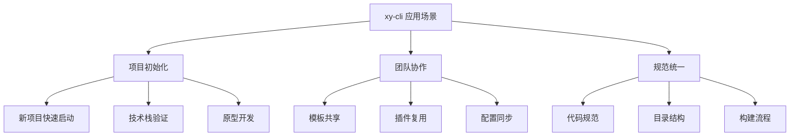
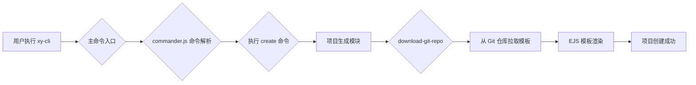
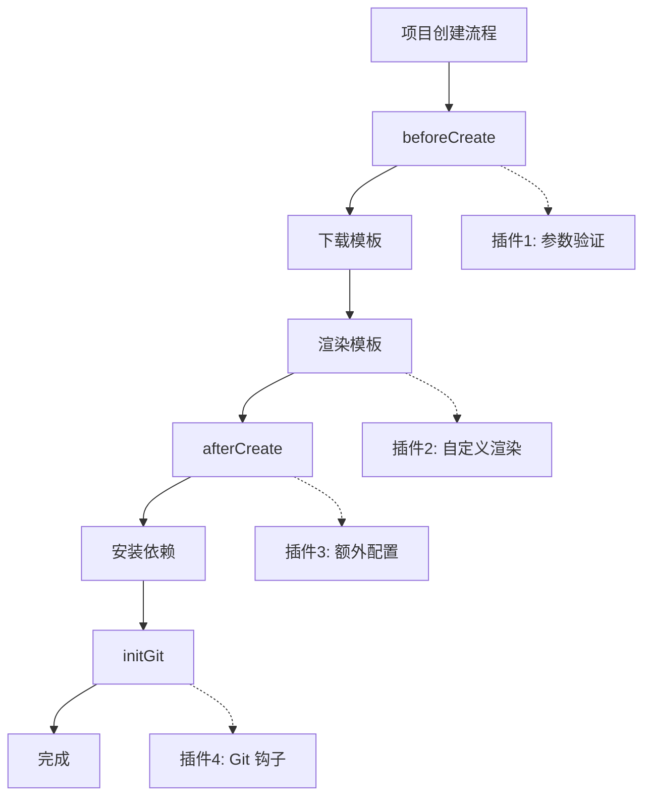

# xy-cli 脚手架工具技术文档

**版本：1.0.0**

---

## 1. 简介

`xy-cli` 是一个轻量级、可扩展的前端脚手架工具，旨在帮助开发者快速创建和管理现代化前端项目。它提供了标准化的项目模板、统一的编码规范和高效的开发工作流，让您能更专注于业务逻辑的实现。

### 1.1. 功能特性

| 特性 | 说明 | 版本要求 |
|------|------|----------|
| **快速项目创建** | 通过简单的命令，快速从预设模板创建新项目 | v1.0.0+ |
| **多模板支持** | 内置 Vue、React、Node.js 等多种项目模板 | v1.0.0+ |
| **交互式问答** | 提供友好的命令行交互界面，引导用户完成项目配置 | v1.0.0+ |
| **模板自定义** | 支持自定义模板，满足团队特定需求 | v1.0.0+ |
| **插件系统** | 提供插件机制，方便扩展脚手架功能 | v1.0.0+ |
| **自动依赖安装** | 项目创建后自动安装依赖，开箱即用 | v1.0.0+ |
| **Git 初始化** | 自动初始化 Git 仓库，配置 .gitignore | v1.0.0+ |
| **远程模板** | 支持从 Git 仓库下载模板 | v1.0.0+ |
| **模板缓存** | 本地缓存模板，提升创建速度 | v1.0.0+ |

### 1.2. 应用场景



### 1.3. 架构设计

`xy-cli` 的核心架构基于 Node.js，采用模块化设计，主要由以下几个模块组成：



#### 核心模块架构

```
┌─────────────────────────────────────────────────────────────┐
│                        CLI 入口层                            │
│                    (bin/cli.js)                             │
└─────────────────────────────────────────────────────────────┘
                              │
        ┌─────────────────────┼─────────────────────┐
        ▼                     ▼                     ▼
┌───────────────┐    ┌───────────────┐    ┌───────────────┐
│ 命令解析模块   │    │ 交互式问答模块 │    │ 工具函数模块   │
│ (commander)   │    │ (inquirer)    │    │ (utils)       │
└───────────────┘    └───────────────┘    └───────────────┘
        │                     │                     │
        └─────────────────────┼─────────────────────┘
                              ▼
┌─────────────────────────────────────────────────────────────┐
│                      业务逻辑层                              │
│         (commands/init.js, commands/config.js)              │
└─────────────────────────────────────────────────────────────┘
                              │
        ┌─────────────────────┼─────────────────────┐
        ▼                     ▼                     ▼
┌───────────────┐    ┌───────────────┐    ┌───────────────┐
│ 模板引擎模块   │    │ 文件操作模块   │    │ 网络请求模块   │
│ (ejs)         │    │ (fs-extra)    │    │ (axios)       │
└───────────────┘    └───────────────┘    └───────────────┘
                              │
                              ▼
┌─────────────────────────────────────────────────────────────┐
│                      输出展示层                              │
│              (chalk, ora, console)                          │
└─────────────────────────────────────────────────────────────┘
```

#### 模块职责

| 模块 | 职责 | 依赖库 |
|------|------|--------|
| **命令解析** | 解析命令行参数，定义命令和选项 | commander |
| **交互问答** | 收集用户输入，提供选择界面 | inquirer |
| **模板渲染** | 处理模板变量，生成最终代码 | ejs |
| **文件操作** | 创建目录、复制文件、写入内容 | fs-extra |
| **远程下载** | 从 Git 仓库下载模板 | download-git-repo |
| **终端美化** | 彩色输出、加载动画、进度提示 | chalk, ora |

---

## 2. 快速上手

### 2.1. 环境要求

| 环境 | 最低版本 | 推荐版本 |
|------|----------|----------|
| Node.js | 14.0.0 | 18.0.0+ |
| npm | 6.0.0 | 9.0.0+ |
| Git | 2.0.0 | 最新版 |

**版本检查：**

```bash
# 检查 Node.js 版本
node -v

# 检查 npm 版本
npm -v

# 检查 Git 版本
git --version
```

### 2.2. 安装

通过 npm 进行全局安装：

```bash
npm install -g xy-cli
```

或使用其他包管理器：

```bash
# 使用 yarn
yarn global add xy-cli

# 使用 pnpm
pnpm add -g xy-cli
```

安装完成后，验证安装：

```bash
xy-cli --version
# 输出: 1.0.0

xy-cli --help
# 输出帮助信息
```

### 2.3. 创建项目

使用 `create` 命令快速创建一个新项目：

```bash
xy-cli create my-awesome-project
```

执行后会进入交互式问答界面：

```
? 请选择项目模板: (Use arrow keys)
❯ Vue 3 + TypeScript + Vite
  React 18 + TypeScript + Vite
  Node.js + Express
  自定义模板

? 请输入项目描述: (A new project)

? 请选择需要的功能: (Press <space> to select, <a> to toggle all)
❯◉ ESLint (代码检查)
 ◉ Prettier (代码格式化)
 ◯ Husky (Git 钩子)
 ◯ TypeScript
 ◯ Jest (单元测试)

? 是否初始化 Git 仓库? (Y/n)

? 是否自动安装依赖? (Y/n)
```

创建完成后，进入项目目录并启动：

```bash
cd my-awesome-project
npm run dev
```

### 2.4. 目录结构

创建的项目目录结构如下：

```
my-awesome-project/
├── public/                 # 静态资源目录
│   └── favicon.ico
├── src/                    # 源代码目录
│   ├── assets/            # 资源文件
│   ├── components/        # 公共组件
│   ├── views/             # 页面视图
│   ├── router/            # 路由配置
│   ├── store/             # 状态管理
│   ├── utils/             # 工具函数
│   ├── App.vue            # 根组件
│   └── main.js            # 入口文件
├── .eslintrc.js           # ESLint 配置
├── .prettierrc            # Prettier 配置
├── .gitignore             # Git 忽略配置
├── index.html             # HTML 模板
├── package.json           # 项目配置
├── README.md              # 项目说明
└── vite.config.js         # Vite 配置
```

---

## 3. 核心命令

### 3.1. `xy-cli create <project-name>`

这是 `xy-cli` 最核心的命令，用于创建一个新的前端项目。

**用法：**

```bash
xy-cli create <project-name> [options]
```

**参数：**

| 参数 | 类型 | 必填 | 说明 |
|------|------|------|------|
| `<project-name>` | string | 是 | 要创建的项目名称 |

**选项：**

| 选项 | 简写 | 说明 | 默认值 |
|------|------|------|--------|
| `--template <name>` | `-t` | 指定模板名称 | 交互选择 |
| `--force` | `-f` | 强制覆盖已存在的目录 | false |
| `--no-git` | - | 不初始化 Git 仓库 | false |
| `--no-install` | - | 不自动安装依赖 | false |
| `--package-manager <name>` | `-p` | 指定包管理器 (npm/yarn/pnpm) | npm |

**使用示例：**

```bash
# 基础用法 - 交互式创建
xy-cli create my-app

# 指定模板创建
xy-cli create my-app --template vue-ts

# 强制覆盖已存在的目录
xy-cli create my-app --force

# 跳过 Git 初始化和依赖安装
xy-cli create my-app --no-git --no-install

# 使用 pnpm 作为包管理器
xy-cli create my-app -p pnpm

# 组合使用
xy-cli create my-app -t react-ts -f -p yarn
```

### 3.2. `xy-cli list`

列出所有可用的项目模板。

**用法：**

```bash
xy-cli list [options]
```

**选项：**

| 选项 | 说明 |
|------|------|
| `--json` | 以 JSON 格式输出 |

**示例：**

```bash
xy-cli list

# 输出:
# ┌────────────────┬────────────────────────────────┬─────────────────┐
# │ 模板名称        │ 描述                            │ 标签            │
# ├────────────────┼────────────────────────────────┼─────────────────┤
# │ vue-ts         │ Vue 3 + TypeScript + Vite      │ frontend, vue   │
# │ react-ts       │ React 18 + TypeScript + Vite   │ frontend, react │
# │ node-express   │ Node.js + Express              │ backend, node   │
# └────────────────┴────────────────────────────────┴─────────────────┘

# JSON 格式输出
xy-cli list --json
```

### 3.3. `xy-cli config`

管理脚手架配置。

**用法：**

```bash
xy-cli config <action> [key] [value]
```

**子命令：**

| 子命令 | 说明 | 示例 |
|--------|------|------|
| `set` | 设置配置项 | `xy-cli config set registry https://registry.npmmirror.com` |
| `get` | 获取配置项 | `xy-cli config get registry` |
| `list` | 列出所有配置 | `xy-cli config list` |
| `delete` | 删除配置项 | `xy-cli config delete registry` |

**示例：**

```bash
# 设置默认包管理器
xy-cli config set packageManager pnpm

# 获取配置
xy-cli config get packageManager
# 输出: pnpm

# 查看所有配置
xy-cli config list
```

### 3.4. 全局选项

以下选项可用于所有命令：

| 选项 | 说明 |
|------|------|
| `-V, --version` | 显示当前脚手架的版本号 |
| `-h, --help` | 显示帮助信息 |
| `-d, --debug` | 启用调试模式，输出详细日志 |
| `--dest <path>` | 指定项目的输出目录 |
| `--no-color` | 禁用彩色输出 |

---

## 4. 配置参数详解

### 4.1. package.json 配置

```json
{
  "name": "xy-cli",
  "version": "1.0.0",
  "description": "一个轻量级的前端脚手架工具",
  "main": "bin/cli.js",
  "bin": {
    "xy-cli": "bin/cli.js"
  },
  "files": [
    "bin",
    "lib",
    "commands",
    "templates"
  ],
  "keywords": [
    "cli",
    "scaffold",
    "generator",
    "vue",
    "react"
  ],
  "author": "Your Name",
  "license": "MIT",
  "repository": {
    "type": "git",
    "url": "https://github.com/username/xy-cli"
  },
  "bugs": {
    "url": "https://github.com/username/xy-cli/issues"
  },
  "homepage": "https://github.com/username/xy-cli#readme",
  "engines": {
    "node": ">=14.0.0"
  },
  "dependencies": {
    "commander": "^11.0.0",
    "inquirer": "^8.2.0",
    "fs-extra": "^11.0.0",
    "ejs": "^3.1.0",
    "chalk": "^4.1.0",
    "ora": "^5.4.0",
    "download-git-repo": "^3.0.0",
    "cross-spawn": "^7.0.0"
  }
}
```

**核心字段说明：**

| 字段 | 说明 |
|------|------|
| `bin` | 定义命令行工具入口，键名为命令名称 |
| `files` | 指定发布到 npm 时包含的文件 |
| `engines` | 指定 Node.js 版本要求 |

### 4.2. 模板配置文件

在项目根目录创建 `.xyclirc.js` 配置文件：

```javascript
module.exports = {
  // 模板配置
  templates: [
    {
      name: 'Vue 3 + TypeScript',
      value: 'vue-ts',
      repository: 'github:username/vue-template',
      description: 'Vue 3 + TypeScript + Vite 项目模板',
      tags: ['frontend', 'vue']
    },
    {
      name: 'React 18 + TypeScript',
      value: 'react-ts',
      repository: 'github:username/react-template',
      description: 'React 18 + TypeScript + Vite 项目模板',
      tags: ['frontend', 'react']
    },
    {
      name: 'Node.js + Express',
      value: 'node-express',
      repository: 'github:username/node-template',
      description: 'Node.js + Express 后端模板',
      tags: ['backend', 'node']
    }
  ],
  
  // 默认配置
  defaults: {
    author: 'Your Name',
    license: 'MIT',
    packageManager: 'npm',
    git: true,
    install: true
  },
  
  // 忽略文件（复制模板时）
  ignore: [
    'node_modules',
    '.git',
    'dist',
    '*.log',
    '.DS_Store'
  ],
  
  // 模板变量
  variables: {
    year: new Date().getFullYear()
  }
}
```

### 4.3. 环境变量配置

创建 `.env` 文件配置环境变量：

```bash
# .env

# npm 镜像源
CLI_REGISTRY=https://registry.npmmirror.com

# 模板仓库地址
CLI_TEMPLATE_REPO=https://github.com/username/templates

# 调试模式
CLI_DEBUG=false

# 缓存目录
CLI_CACHE_DIR=~/.xy-cli/cache
```

**环境变量说明：**

| 变量名 | 说明 | 默认值 |
|--------|------|--------|
| `CLI_REGISTRY` | npm 镜像源 | https://registry.npmjs.org |
| `CLI_TEMPLATE_REPO` | 模板仓库地址 | - |
| `CLI_DEBUG` | 调试模式 | false |
| `CLI_CACHE_DIR` | 缓存目录 | ~/.xy-cli/cache |

---

## 5. 插件开发

### 5.1. 插件机制

`xy-cli` 的插件系统允许开发者在不修改核心代码的情况下，扩展脚手架的功能。插件可以在项目创建的不同生命周期中执行自定义逻辑。



### 5.2. 开发指南

#### 创建插件

一个插件本质上是一个 Node.js 模块，它导出一个包含特定生命周期钩子的对象。

```javascript
// my-plugin.js
module.exports = {
  name: 'my-plugin',
  version: '1.0.0',
  
  // 插件描述
  description: '这是一个示例插件',
  
  // 钩子函数
  hooks: {
    // 项目创建前执行
    beforeCreate: async (context) => {
      const { projectName, options } = context
      console.log(`即将创建项目: ${projectName}`)
      
      // 可以修改 options
      if (!options.template) {
        options.template = 'vue-ts'
      }
      
      // 返回 false 可以中止创建流程
      return true
    },
    
    // 模板渲染后执行
    afterCreate: async (context) => {
      const { projectDir, projectName } = context
      console.log(`项目 ${projectName} 创建完成！`)
      console.log(`项目路径: ${projectDir}`)
      
      // 可以执行额外操作，如创建额外文件
      const fs = require('fs-extra')
      const path = require('path')
      
      await fs.writeJson(
        path.join(projectDir, '.vscode/settings.json'),
        {
          'editor.formatOnSave': true,
          'editor.defaultFormatter': 'esbenp.prettier-vscode'
        },
        { spaces: 2 }
      )
    },
    
    // 依赖安装后执行
    afterInstall: async (context) => {
      console.log('依赖安装完成')
    },
    
    // Git 初始化后执行
    afterGitInit: async (context) => {
      const { projectDir } = context
      console.log('Git 仓库初始化完成')
    }
  }
}
```

#### 注册插件

在 `.xyclirc.js` 中注册插件：

```javascript
module.exports = {
  // ...其他配置
  
  plugins: [
    // 本地插件路径
    './plugins/my-plugin.js',
    
    // npm 包名
    'xy-cli-plugin-eslint',
    
    // 带配置的插件
    {
      name: 'xy-cli-plugin-prettier',
      options: {
        semi: false,
        singleQuote: true
      }
    }
  ]
}
```

### 5.3. 内置钩子

| 钩子名称 | 触发时机 | 参数 |
|----------|----------|------|
| `beforeCreate` | 项目创建前 | `{ projectName, options, cwd }` |
| `afterCreate` | 项目创建后 | `{ projectName, projectDir, options }` |
| `beforeInstall` | 依赖安装前 | `{ projectDir, packageManager }` |
| `afterInstall` | 依赖安装后 | `{ projectDir, packageManager }` |
| `beforeGitInit` | Git 初始化前 | `{ projectDir }` |
| `afterGitInit` | Git 初始化后 | `{ projectDir }` |

**钩子函数上下文：**

```javascript
{
  // 项目名称
  projectName: 'my-project',
  
  // 项目目录（绝对路径）
  projectDir: '/Users/xxx/projects/my-project',
  
  // 命令行选项
  options: {
    template: 'vue-ts',
    force: false,
    git: true,
    install: true
  },
  
  // 当前工作目录
  cwd: '/Users/xxx/projects',
  
  // 包管理器
  packageManager: 'npm',
  
  // 模板数据（用于渲染）
  templateData: {
    name: 'my-project',
    description: 'A new project',
    author: 'Your Name'
  }
}
```

---

## 6. API 参考

### 6.1. Commander API

`xy-cli` 基于 `commander.js` 实现命令解析，核心 API 如下：

#### 命令定义

```javascript
const { program } = require('commander')

// 定义命令
program
  .command('create <name>')
  .description('创建新项目')
  .alias('c')              // 命令别名
  .option('-t, --template <name>', '模板名称')
  .option('-f, --force', '强制覆盖')
  .action((name, options) => {
    // 处理逻辑
  })
```

#### 选项定义

| 方法 | 说明 | 示例 |
|------|------|------|
| `.option(flags, description)` | 定义可选选项 | `.option('-d, --debug', '调试模式')` |
| `.option(flags, description, default)` | 定义带默认值的选项 | `.option('-p, --port <number>', '端口', 3000)` |
| `.requiredOption(flags, description)` | 定义必填选项 | `.requiredOption('-n, --name <name>', '名称')` |

#### 常用 API

| API | 说明 |
|-----|------|
| `.name(name)` | 设置命令名称 |
| `.version(version, flags)` | 设置版本号 |
| `.description(desc)` | 设置描述 |
| `.command(name)` | 定义子命令 |
| `.argument(spec, description)` | 定义参数 |
| `.action(callback)` | 设置处理函数 |
| `.parse(argv)` | 解析命令行参数 |

### 6.2. 模板渲染 API

使用 EJS 进行模板渲染：

```javascript
const ejs = require('ejs')

// 渲染字符串
const result = ejs.render('Hello, <%= name %>!', { name: 'World' })

// 渲染文件
const content = await ejs.renderFile('./template.ejs', {
  name: 'my-project',
  version: '1.0.0',
  description: '项目描述'
}, {
  cache: true,
  rmWhitespace: true
})
```

**EJS 语法：**

| 语法 | 说明 | 示例 |
|------|------|------|
| `<%= %>` | 输出转义后的值 | `<%= name %>` |
| `<%- %>` | 输出原始值 | `<%- htmlContent %>` |
| `<% %>` | JavaScript 代码块 | `<% if (user) { %>` |
| `<%# %>` | 注释 | `<%# 这是注释 %>` |

### 6.3. 文件操作 API

使用 `fs-extra` 进行文件操作：

```javascript
const fs = require('fs-extra')

// 复制文件/目录
await fs.copy(src, dest, {
  overwrite: true,
  filter: (src) => !src.includes('node_modules')
})

// 读取 JSON 文件
const pkg = await fs.readJson('./package.json')

// 写入 JSON 文件
await fs.writeJson('./package.json', pkg, { spaces: 2 })

// 确保目录存在
await fs.ensureDir('./src/components')

// 删除文件/目录
await fs.remove('./dist')
```

**常用方法：**

| 方法 | 说明 |
|------|------|
| `fs.copy(src, dest)` | 复制文件/目录 |
| `fs.move(src, dest)` | 移动文件/目录 |
| `fs.remove(path)` | 删除文件/目录 |
| `fs.ensureDir(dir)` | 确保目录存在 |
| `fs.readJson(file)` | 读取 JSON 文件 |
| `fs.writeJson(file, obj)` | 写入 JSON 文件 |
| `fs.pathExists(path)` | 检查路径是否存在 |

---

## 7. 性能优化

### 7.1. 模板缓存策略

对于不经常变动的模板，采用本地缓存策略避免重复下载：

```javascript
const path = require('path')
const fs = require('fs-extra')
const os = require('os')

class TemplateCache {
  constructor() {
    this.cacheDir = path.join(os.homedir(), '.xy-cli', 'cache')
  }
  
  async get(templateName) {
    const cachePath = path.join(this.cacheDir, templateName)
    
    if (await fs.pathExists(cachePath)) {
      const stats = await fs.stat(cachePath)
      const cacheTime = stats.mtime.getTime()
      const now = Date.now()
      
      // 缓存有效期：7天
      if (now - cacheTime < 7 * 24 * 60 * 60 * 1000) {
        return cachePath
      }
    }
    
    return null
  }
  
  async set(templateName, templatePath) {
    const cachePath = path.join(this.cacheDir, templateName)
    await fs.ensureDir(this.cacheDir)
    await fs.copy(templatePath, cachePath)
  }
  
  async clear() {
    await fs.remove(this.cacheDir)
  }
}
```

### 7.2. 按需加载机制

将不同命令的实现拆分到独立的文件中，按需加载：

```javascript
// bin/cli.js
const { program } = require('commander')

// 按需加载命令实现
program
  .command('create <name>')
  .action(async (name, options) => {
    // 动态导入，加快启动速度
    const create = await import('../commands/create.js')
    await create.default(name, options)
  })

program
  .command('list')
  .action(async () => {
    const list = await import('../commands/list.js')
    await list.default()
  })
```

### 7.3. 依赖优化

定期审查并移除不必要的 npm 依赖：

```bash
# 检查未使用的依赖
npx depcheck

# 检查依赖大小
npx cost-of-modules
```

**优化建议：**

| 优化项 | 说明 |
|--------|------|
| 移除未使用的依赖 | 定期运行 `depcheck` 检查 |
| 使用轻量级替代 | 如用 `lodash-es` 替代 `lodash` |
| 锁定版本范围 | 使用精确版本号避免意外升级 |
| 分离 devDependencies | 开发依赖不应发布到生产环境 |

---

## 8. 常见问题 (Q&A)

### 安装问题

**Q1: `npm link` 失败怎么办？**

**A1**: 请确保您有足够的权限。在 macOS 或 Linux 上：

```bash
# 方法 1: 使用 sudo
sudo npm link

# 方法 2: 修改 npm 默认目录
mkdir ~/.npm-global
npm config set prefix '~/.npm-global'
# 然后在 ~/.bashrc 或 ~/.zshrc 中添加:
export PATH=~/.npm-global/bin:$PATH
```

**Q2: 全局安装后命令找不到？**

**A2**: 检查 npm 全局路径是否在 PATH 中：

```bash
# 查看全局安装路径
npm config get prefix

# 将 bin 目录添加到 PATH
export PATH=$(npm config get prefix)/bin:$PATH
```

### 使用问题

**Q3: 下载模板时出现错误？**

**A3**: 可能原因及解决方案：

| 原因 | 解决方案 |
|------|----------|
| 网络问题 | 切换镜像源或使用代理 |
| Git 仓库地址错误 | 检查 `.xyclirc.js` 中的配置 |
| 权限不足 | 检查是否有仓库访问权限 |

```bash
# 使用代理
export HTTP_PROXY=http://proxy.example.com:8080
export HTTPS_PROXY=http://proxy.example.com:8080

# 切换镜像源
xy-cli config set registry https://registry.npmmirror.com
```

**Q4: 如何使用自定义的项目模板？**

**A4**: 两种方式：

1. **修改配置文件**：
   ```javascript
   // .xyclirc.js
   module.exports = {
     templates: [
       {
         name: '自定义模板',
         value: 'custom',
         repository: 'github:your-username/your-template'
       }
     ]
   }
   ```

2. **使用远程 URL**：
   ```bash
   xy-cli create my-app --template direct:https://github.com/user/repo.git
   ```

**Q5: 创建项目时目录已存在怎么办？**

**A5**: 使用 `--force` 选项强制覆盖：

```bash
xy-cli create my-app --force
# 或简写
xy-cli create my-app -f
```

### 开发问题

**Q6: 如何调试脚手架？**

**A6**:

```bash
# 方法 1: 启用调试模式
xy-cli create my-app --debug

# 方法 2: 使用 node --inspect
node --inspect bin/cli.js create my-app

# 方法 3: 使用 node 直接运行
node bin/cli.js create my-app
```

**Q7: 如何处理模板中的特殊字符？**

**A7**: 在 EJS 模板中注意转义：

```ejs
{
  "name": "<%= name.replace(/"/g, '\\"') %>"
}
```

或在渲染前预处理：

```javascript
const data = {
  name: projectName.replace(/"/g, '\\"')
}
```

---

## 9. 贡献指南

欢迎任何形式的贡献！您可以：

### 贡献方式

- 🐛 **报告 Bug**：提交 Issue 描述问题
- 💡 **功能建议**：提交 Issue 描述新功能
- 📝 **文档改进**：完善文档或翻译
- 🔧 **代码贡献**：提交 Pull Request

### 开发流程

```bash
# 1. Fork 并克隆仓库
git clone https://github.com/your-username/xy-cli.git
cd xy-cli

# 2. 安装依赖
npm install

# 3. 创建功能分支
git checkout -b feature/your-feature

# 4. 开发并测试
npm run test
npm run lint

# 5. 提交代码
git commit -m 'feat: add new feature'

# 6. 推送并创建 PR
git push origin feature/your-feature
```

### 提交规范

使用 [Conventional Commits](https://www.conventionalcommits.org/) 规范：

| 类型 | 说明 |
|------|------|
| `feat` | 新功能 |
| `fix` | Bug 修复 |
| `docs` | 文档更新 |
| `style` | 代码格式调整 |
| `refactor` | 代码重构 |
| `test` | 测试相关 |
| `chore` | 构建/工具相关 |

---

## 10. 版本记录

### v1.0.0 (2024-01-01)

- 🎉 **初始版本发布**
- ✨ 支持通过 `create` 命令从模板创建项目
- ✨ 内置 Vue、React、Node.js 模板
- ✨ 集成交互式命令行问答
- ✨ 支持插件扩展机制
- ✨ 自动初始化 Git 仓库
- ✨ 自动安装项目依赖
- ✨ 模板本地缓存

### v0.9.0 (2023-12-01)

- 🚀 Beta 版本
- ✨ 基础命令实现

---

## 11. 相关链接与参考资料

### 官方文档

- [Commander.js](https://github.com/tj/commander.js) - 命令行参数解析
- [Inquirer.js](https://github.com/SBoudrias/Inquirer.js) - 交互式命令行界面
- [EJS](https://ejs.co/) - 模板引擎
- [fs-extra](https://github.com/jprichardson/node-fs-extra) - 文件操作增强

### 相关工具

- [download-git-repo](https://gitlab.com/flippidippi/download-git-repo) - Git 仓库下载
- [chalk](https://github.com/chalk/chalk) - 终端彩色输出
- [ora](https://github.com/sindresorhus/ora) - 终端加载动画
- [cross-spawn](https://github.com/moxystudio/node-cross-spawn) - 跨平台进程执行

### 参考项目

- [Vue CLI](https://github.com/vuejs/vue-cli) - Vue.js 官方脚手架
- [Create React App](https://github.com/facebook/create-react-app) - React 官方脚手架
- [Vite](https://github.com/vitejs/vite) - 下一代前端构建工具

### 学习资源

- [Node.js 官方文档](https://nodejs.org/)
- [npm 开发指南](https://docs.npmjs.com/cli/v9/using-npm/developers)
- [前端工程化实践](https://github.com/goldbergyoni/nodebestpractices)
