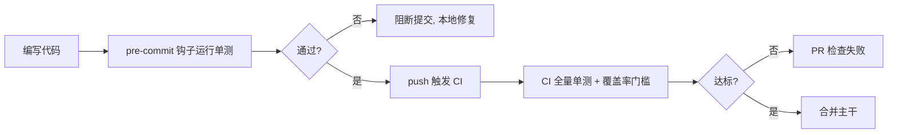

# 单元测试

## 介绍

### 什么是单元测试

单元测试（Unit Testing）是对软件中**最小可测试单元**（通常是一个函数、方法或模块）进行隔离验证的测试手段。它的目标是快速、确定地证明"给定输入，这个单元产生预期输出"。在测试金字塔中，单元测试处于最底层，数量最多、运行最快、维护成本最低。

```text
单元测试 → 集成测试 → 端到端测试
  ↓           ↓           ↓
单一模块    多模块协作    完整系统
数量多       数量中        数量少
速度快       速度中        速度慢
```

### 单元测试的核心原则（FIRST）

- **F**ast（快）：单测应在毫秒级完成，才能放进 pre-commit 频繁跑。
- **I**solated（隔离）：不依赖网络、数据库、文件系统等外部状态；依赖通过 Mock/Stub 注入。
- **R**epeatable（可重复）：任意顺序、任意次数运行结果一致。
- **S**elf-Validating（自校验）：断言明确，非人工比对。
- **T**imely（及时）：与生产代码同期编写（TDD 或事后补但紧跟需求）。

### 为什么 Node.js 特别需要单元测试

Node.js 是动态类型、弱约束的语言，且大量逻辑依赖异步回调与边界条件（空值、异常、并发）。单元测试是防止"改一处崩一片"的主要屏障，也是重构（如 CommonJS → ESM、框架升级）时的安全网。

## 测试框架选型（v22 基线）

| 维度 | Jest | Vitest |
|------|------|--------|
| 底层 | 自研 runner + JSDOM | Vite + esbuild |
| 启动速度 | 中等（babel 转换） | 快（原生 ESM、按需编译） |
| 原生 ESM | 需配置 | 一等公民 |
| 生态 | 成熟、文档全 | 增长快、API 兼容 Jest |
| 适用 | 存量项目、React 配套 | 新项目、Vite 技术栈 |

> 新项目建议 Vitest；存量 Jest 项目不必强迁，关注 `node --test`（Node 内置测试 runner）作为轻量替代。

## 一个最小可运行示例（Vitest + ESM）

```ts
// math.ts
export function add(a: number, b: number): number {
  return a + b;
}

export function divide(a: number, b: number): number {
  if (b === 0) throw new Error('division by zero');
  return a / b;
}
```

```ts
// math.test.ts
import { describe, it, expect } from 'vitest';
import { add, divide } from './math';

describe('add', () => {
  it('正数相加', () => {
    expect(add(1, 2)).toBe(3);
  });

  it('支持负数', () => {
    expect(add(-1, 1)).toBe(0);
  });
});

describe('divide', () => {
  it('正常除法', () => {
    expect(divide(6, 3)).toBe(2);
  });

  it('除零抛错', () => {
    expect(() => divide(1, 0)).toThrow('division by zero');
  });
});
```

## 断言、Mock 与异步测试

### 断言风格

- `toBe` / `toEqual`：值相等 / 结构深相等
- `toThrow`：异常断言
- `toMatchObject`：部分匹配（适合大对象）

### Mock 外部依赖

```ts
import { it, expect, vi } from 'vitest';

it('mock 掉数据库查询', async () => {
  const db = { query: vi.fn().mockResolvedValue([{ id: 1 }]) };
  const result = await getUser(db, 1);
  expect(db.query).toHaveBeenCalledWith(1);
  expect(result).toEqual({ id: 1 });
});
```

### 异步测试的正确姿势

```ts
it('await 异步结果', async () => {
  await expect(fetchUser(1)).resolves.toMatchObject({ id: 1 });
});

it('拒绝的 promise', async () => {
  await expect(fetchUser(-1)).rejects.toThrow('invalid id');
});
```

## 运行与覆盖率

```bash
# Vitest
npx vitest run            # 一次性运行
npx vitest --coverage     # 带覆盖率
npx vitest watch          # 监听模式

# Node 内置（v22）
node --test               # 运行 *.test.js
```

覆盖率关注四个维度：

- **行覆盖率（Line）**：多少行被执行
- **分支覆盖率（Branch）**：if/else 各分支是否走到
- **函数覆盖率（Function）**：函数是否被调用
- **语句覆盖率（Statement）**：语句是否执行

> 不要盲目追求 100%。优先覆盖核心业务逻辑、边界条件与异常路径；对纯 getter、简单胶水代码可适当放宽。

## 工程化集成

将单元测试嵌入开发流程：



建议配合 `husky` + `lint-staged` 在 pre-commit 仅跑变更文件单测，CI 跑全量并设覆盖率门槛（如增量不低于 80%）。

## 常见误区

- **测试实现细节而非行为**：断言"调用了某私有方法"不如断言"输出正确"。
- **Mock 过度**：把所有依赖都 mock 后，测试通过的代码上线仍可能崩。
- **依赖真实外部状态**：测试间共享数据库导致随机失败（flaky）。
- **把单测写成集成测试**：单测里连真实 DB/网络，失去"快"与"隔离"优势。

## 小结

单元测试是 Node.js 工程质量的地基：选对框架（新项目 Vitest、存量 Jest）、坚守 FIRST 原则、隔离外部依赖、融入 pre-commit/CI 流程，并以行为而非实现为断言对象。
