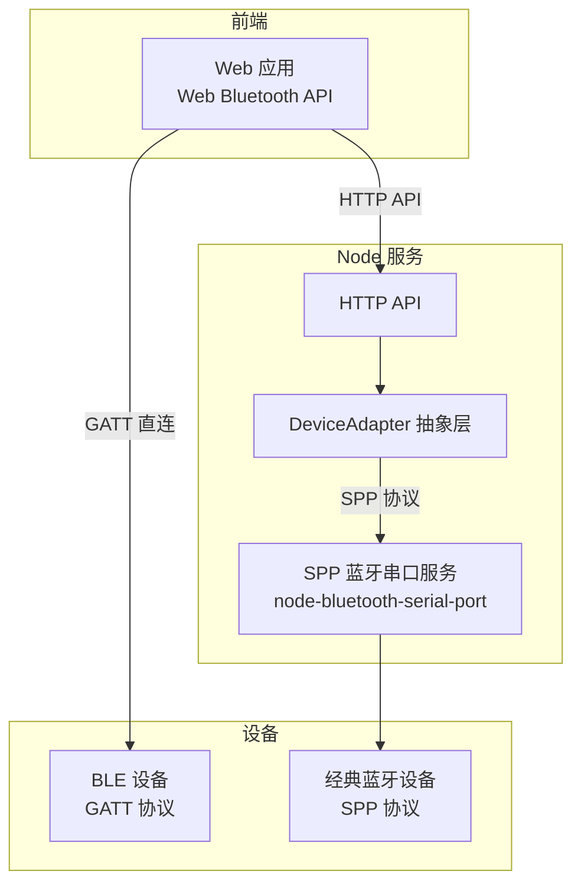
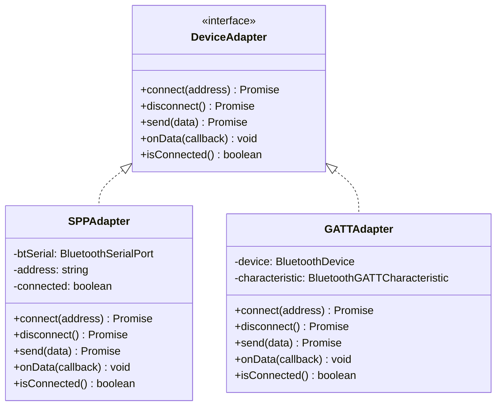
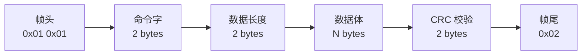
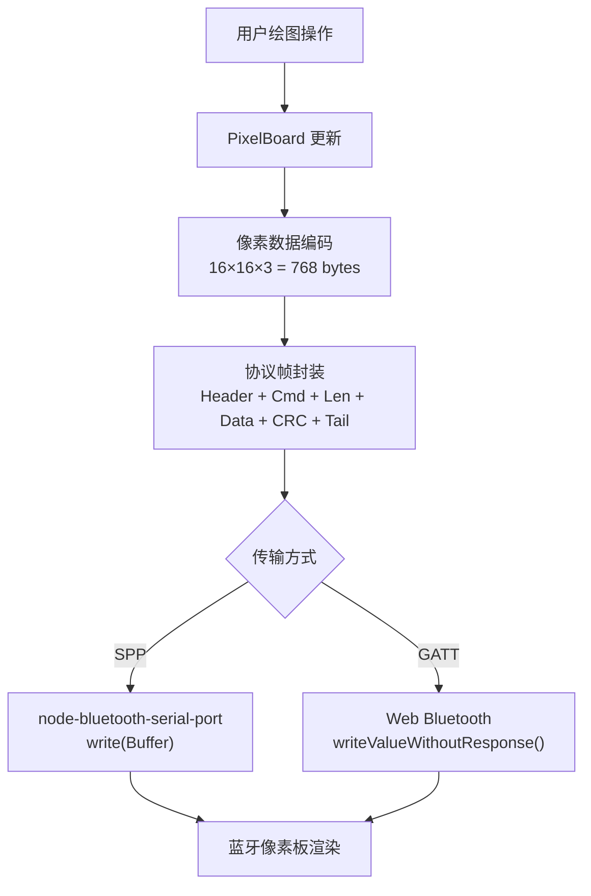

# 蓝牙设备通信项目

## 项目背景

本项目实现一个蓝牙智能设备通用服务平台，支持 GATT（低功耗蓝牙）和 SPP（经典蓝牙串口）双协议通信，以蓝牙像素板（Divoom）为实战目标设备。



## 技术选型

### GATT vs SPP 对比

| 维度 | GATT (BLE) | SPP (经典蓝牙) |
|------|------------|----------------|
| 协议 | 低功耗蓝牙 | 经典蓝牙 RFCOMM |
| 传输速率 | 低（~1 Mbps） | 中（~2.1 Mbps） |
| 功耗 | 极低 | 较高 |
| 连接方式 | 前端 Web Bluetooth API | Node.js 后端串口 |
| 适用场景 | 简单控制、传感器数据 | 批量数据传输、持续通信 |
| Node.js 支持 | Web 端直接操作 | node-bluetooth-serial-port |

### 双协议架构设计



## SPP 服务实现

### 安装与初始化

```bash
npm install node-bluetooth-serial-port
```

```js
const { BluetoothSerialPort } = require('node-bluetooth-serial-port')

class SPPAdapter {
  constructor() {
    this.btSerial = new BluetoothSerialPort()
    this.connected = false
    this.address = null
    this.dataCallbacks = []
  }

  async connect(address) {
    return new Promise((resolve, reject) => {
      this.btSerial.findSerialPortChannel(address, (channel) => {
        this.btSerial.connect(address, channel, () => {
          this.connected = true
          this.address = address
          console.log(`[SPP] Connected to ${address} on channel ${channel}`)

          this.btSerial.on('data', (buffer) => {
            this.dataCallbacks.forEach(cb => cb(buffer))
          })

          resolve()
        }, reject)
      }, reject)
    })
  }

  async disconnect() {
    if (this.connected) {
      this.btSerial.close()
      this.connected = false
      this.address = null
    }
  }

  async send(data) {
    if (!this.connected) throw new Error('Not connected')
    return new Promise((resolve, reject) => {
      this.btSerial.write(Buffer.from(data), (err) => {
        if (err) reject(err)
        else resolve()
      })
    })
  }

  onData(callback) {
    this.dataCallbacks.push(callback)
  }

  isConnected() {
    return this.connected
  }
}
```

### 设备扫描

```js
async function scanDevices() {
  return new Promise((resolve) => {
    const devices = []
    const bt = new BluetoothSerialPort()

    bt.on('found', (address, name) => {
      devices.push({ address, name })
    })

    bt.inquire()

    // 扫描 10 秒
    setTimeout(() => {
      bt.close()
      resolve(devices)
    }, 10000)
  })
}
```

## 蓝牙像素板绘图 API

### Divoom 协议解析

Divoom 设备使用自定义二进制协议，数据帧结构如下：



### 图像编码

像素板为 16×16 RGB LED 矩阵，每个像素需要 3 字节（R/G/B）：

```js
class PixelBoard {
  constructor(width = 16, height = 16) {
    this.width = width
    this.height = height
    this.pixels = Buffer.alloc(width * height * 3, 0)
  }

  setPixel(x, y, r, g, b) {
    if (x < 0 || x >= this.width || y < 0 || y >= this.height) return
    const offset = (y * this.width + x) * 3
    this.pixels[offset] = r
    this.pixels[offset + 1] = g
    this.pixels[offset + 2] = b
  }

  toBuffer() {
    return this.pixels
  }

  clear() {
    this.pixels.fill(0)
  }
}
```

### 绘图 API 设计

```js
const http = require('http')
const url = require('url')

class DrawingAPI {
  constructor(adapter) {
    this.adapter = adapter
    this.board = new PixelBoard()
  }

  // 绘制单个像素
  drawPixel(x, y, color) {
    const [r, g, b] = this.parseColor(color)
    this.board.setPixel(x, y, r, g, b)
    return { x, y, color }
  }

  // 批量绘制
  drawBatch(pixels) {
    for (const { x, y, color } of pixels) {
      const [r, g, b] = this.parseColor(color)
      this.board.setPixel(x, y, r, g, b)
    }
    return { count: pixels.length }
  }

  // 渲染到设备
  async render() {
    const frame = this.buildFrame(this.board.toBuffer())
    await this.adapter.send(frame)
    return { rendered: true, size: frame.length }
  }

  buildFrame(pixelData) {
    const header = Buffer.from([0x01, 0x01])
    const command = Buffer.from([0x00, 0x0C]) // 绘图命令
    const length = Buffer.alloc(2)
    length.writeUInt16LE(pixelData.length)
    const crc = this.crc16(pixelData)
    const footer = Buffer.from([0x02])

    return Buffer.concat([header, command, length, pixelData, crc, footer])
  }

  parseColor(color) {
    if (typeof color === 'string') {
      const hex = color.replace('#', '')
      return [
        parseInt(hex.substring(0, 2), 16),
        parseInt(hex.substring(2, 4), 16),
        parseInt(hex.substring(4, 6), 16),
      ]
    }
    return color
  }

  crc16(buffer) {
    let crc = 0xFFFF
    for (let i = 0; i < buffer.length; i++) {
      crc ^= buffer[i]
      for (let j = 0; j < 8; j++) {
        if (crc & 0x0001) crc = (crc >> 1) ^ 0xA001
        else crc >>= 1
      }
    }
    const result = Buffer.alloc(2)
    result.writeUInt16LE(crc)
    return result
  }
}
```

### HTTP API 路由

```js
function createServer(drawingAPI) {
  return http.createServer(async (req, res) => {
    const { pathname } = url.parse(req.url)
    res.setHeader('Content-Type', 'application/json; charset=utf-8')

    try {
      if (pathname === '/api/pixel' && req.method === 'POST') {
        const { x, y, color } = await parseBody(req)
        const result = drawingAPI.drawPixel(x, y, color)
        respond(res, 200, result)
      }

      else if (pathname === '/api/pixel/batch' && req.method === 'POST') {
        const { pixels } = await parseBody(req)
        const result = drawingAPI.drawBatch(pixels)
        respond(res, 200, result)
      }

      else if (pathname === '/api/render' && req.method === 'POST') {
        const result = await drawingAPI.render()
        respond(res, 200, result)
      }

      else if (pathname === '/api/clear' && req.method === 'POST') {
        drawingAPI.board.clear()
        respond(res, 200, { cleared: true })
      }

      else {
        respond(res, 404, { error: 'Not Found' })
      }
    } catch (err) {
      respond(res, 500, { error: err.message })
    }
  })
}
```

### API 端点汇总

| 方法 | 路径 | 说明 | 请求体 |
|------|------|------|--------|
| POST | `/api/pixel` | 绘制单个像素 | `{ x, y, color }` |
| POST | `/api/pixel/batch` | 批量绘制 | `{ pixels: [{ x, y, color }] }` |
| POST | `/api/render` | 渲染到设备 | — |
| POST | `/api/clear` | 清空画布 | — |

## 前端集成（Web Bluetooth GATT）

```js
// 浏览器端：通过 Web Bluetooth API 直连 BLE 设备
async function connectGATT() {
  const device = await navigator.bluetooth.requestDevice({
    filters: [{ services: ['0000ffe0-0000-1000-8000-00805f9b34fb'] }],
  })

  const server = await device.gatt.connect()
  const service = await server.getPrimaryService('0000ffe0-0000-1000-8000-00805f9b34fb')
  const characteristic = await service.getCharacteristic('0000ffe1-0000-1000-8000-00805f9b34fb')

  // 发送数据
  await characteristic.writeValue(frameBuffer)

  // 接收数据
  characteristic.addEventListener('characteristicvaluechanged', (event) => {
    const value = event.target.value
    console.log('Received:', value)
  })

  await characteristic.startNotifications()
}
```

## 项目工程化

### 构建配置

```js
// esbuild.config.js
const esbuild = require('esbuild')

esbuild.build({
  entryPoints: ['src/index.js'],
  bundle: true,
  platform: 'node',
  target: 'node18',
  outfile: 'dist/server.js',
  external: ['node-bluetooth-serial-port'], // 原生模块不打包
  format: 'esm',
})
```

### 项目结构

```
bluetooth-pixel-board/
├── src/
│   ├── adapters/
│   │   ├── spp-adapter.js      # SPP 蓝牙适配器
│   │   └── gatt-adapter.js     # GATT 蓝牙适配器（前端）
│   ├── protocol/
│   │   └── divoom.js           # Divoom 协议编解码
│   ├── pixel-board.js          # 像素画布逻辑
│   ├── drawing-api.js          # HTTP 绘图 API
│   └── index.js                # 入口
├── public/
│   └── index.html              # 前端页面
├── package.json
└── esbuild.config.js
```

## 数据编码流程



## 最佳实践

| 场景 | 推荐方案 |
|------|---------|
| 设备协议抽象 | Adapter 模式，屏蔽协议差异 |
| 原生模块打包 | `external` 排除，运行时动态加载 |
| 蓝牙连接稳定性 | 自动重连 + 心跳检测 + 超时机制 |
| 数据帧校验 | CRC16 校验，丢弃错误帧 |
| 前端蓝牙权限 | 用户手势触发 `requestDevice()`，不可自动弹出 |
| 并发绘制请求 | 请求队列 + 串行化发送，避免帧交错 |
