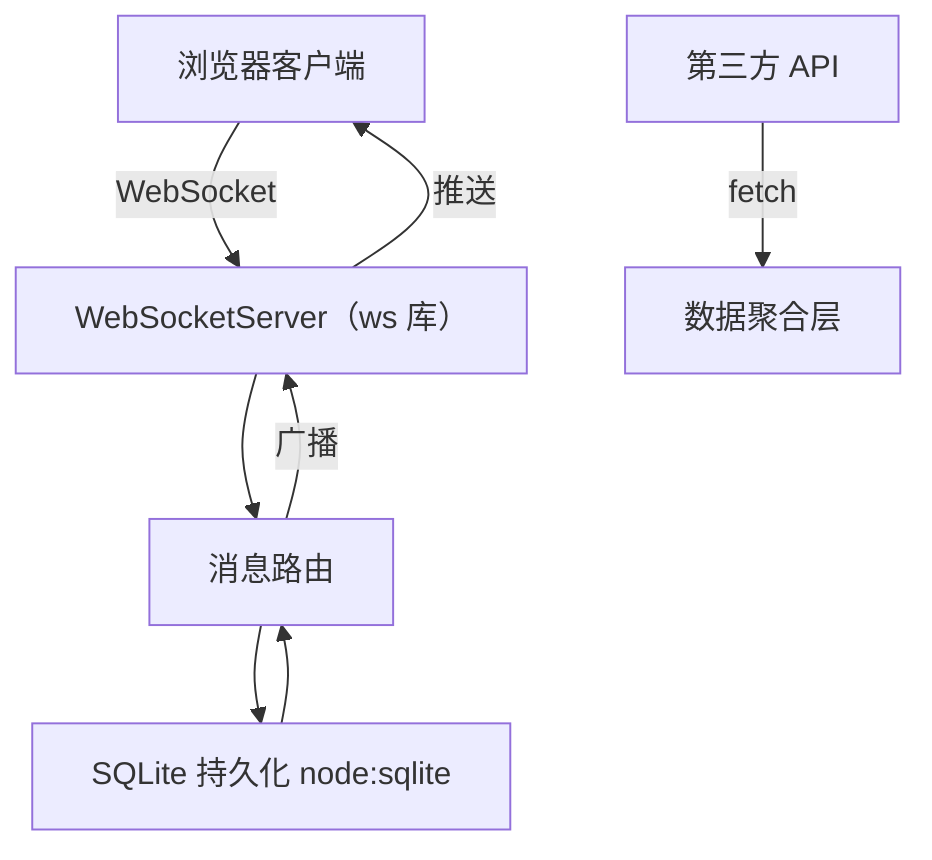

# Node.js v22 原生能力实战：WebSocket + fetch + node:sqlite 协作看板

Node.js v22 在「去第三方依赖」方向上迈出关键一步：内置 `WebSocket` **客户端**（22.4 起稳定）、全局 `fetch`（稳定）、以及实验性 `node:sqlite` 同步 API。需要注意：Node 至今没有内置 WebSocket **服务端**，本实战的服务端广播仍使用成熟的 `ws` 库，其余部分尽量采用原生能力——任务持久化到 `node:sqlite`，外部数据经 `fetch` 聚合。

## 架构全景



## 1. 服务端骨架（v22 ESM）

```js
// npm install ws（WebSocket 服务端暂无内置实现，Node 原生仅提供客户端）
import { WebSocketServer } from 'ws';
import { DatabaseSync } from 'node:sqlite';
import { createServer } from 'node:http';

const db = new DatabaseSync(':memory:');
db.exec(`CREATE TABLE tasks(id INTEGER PRIMARY KEY, title TEXT, done INTEGER)`);

const server = createServer();
const wss = new WebSocketServer({ server });

wss.on('connection', (ws) => {
  ws.on('message', (raw) => {
    const msg = JSON.parse(raw.toString());
    if (msg.type === 'add') {
      db.prepare('INSERT INTO tasks(title, done) VALUES(?, 0)').run(msg.title);
    }
    const tasks = db.prepare('SELECT * FROM tasks').all();
    const payload = JSON.stringify({ type: 'sync', tasks });
    for (const c of wss.clients) c.send(payload); // 广播一致性
  });
});

server.listen(3000);
```

## 2. 客户端实时同步

```js
const ws = new WebSocket('ws://localhost:3000');
ws.onmessage = (e) => {
  const { tasks } = JSON.parse(e.data);
  render(tasks); // 全量重渲染，保持各端最终一致
};
document.querySelector('#add').onclick = () =>
  ws.send(JSON.stringify({ type: 'add', title: input.value }));
```

## 3. 通过 fetch 聚合外部数据

```js
const res = await fetch('https://api.example.com/weather');
const { temp } = await res.json();
db.prepare('INSERT INTO tasks(title, done) VALUES(?, 0)').run(`天气播报：${temp}℃`);
```

## 关键工程要点

- **广播顺序一致性**：写入 SQLite 后再广播，避免客户端状态落后于持久层。
- **WebSocket 生命周期**：`connection` 后需监听 `close` 清理定时器/会话。
- **node:sqlite 同步阻塞**：v22 仍为同步 API，高并发写入建议放入 Worker 线程（见 `13-编译与底层原理` 的线程池篇）。
- **fetch 超时**：原生 fetch 支持 `AbortSignal.timeout(3000)`，防止外部 API 拖垮看板。

## 何时用原生能力 vs 第三方

| 能力 | 原生（v22） | 第三方（ws/sequelize/axios） |
|------|------------|------------------------------|
| WebSocket 客户端 | ✅ 内置（22.4+ 稳定） | 特殊场景用 `ws` |
| WebSocket 服务端 | ❌ 未内置 | 服务端用 `ws` |
| HTTP 客户端 | ✅ fetch 稳定 | 需拦截器用 axios |
| 数据库 | ⚠️ sqlite 实验期 | 生产用 better-sqlite3 |
