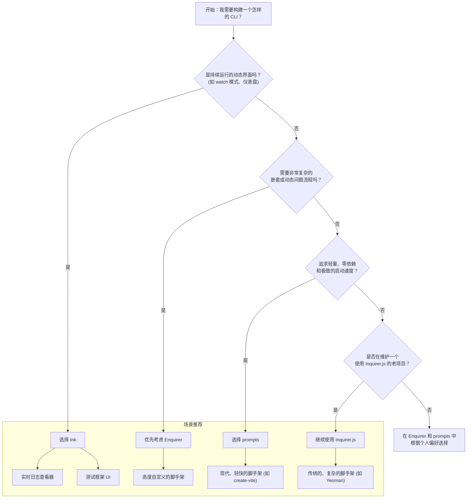

# 命令行交互

## 1. TUI 组件库概述

在现代的命令行工具（CLI）开发中，用户体验变得至关重要。一个优秀的 CLI 不应仅仅是功能的堆砌，更应提供清晰、直观、甚至令人愉悦的交互过程。终端用户界面（Terminal User Interface, TUI）组件库应运而生，它们将构建交互式命令行的复杂底层操作（如监听键盘输入、控制光标、管理终端状态）抽象出来，让开发者能像开发 Web 应用一样，专注于交互逻辑本身

### 1.1 设计理念与核心目标

尽管不同的 TUI 库在 API 设计和实现上各有千秋，但它们共同的核心目标是一致的：

- **提升用户体验**：变被动的命令行参数输入为主动的、引导式的交互问答，降低用户的使用门槛和记忆成本
- **简化开发流程**：提供声明式的 API，让开发者用简单的配置对象或组件来定义复杂的交互流程，而无需关心底层终端控制细节
- **标准化交互模式**：提供一套经过实践检验的、符合用户直觉的标准化交互组件（如输入框、选择列表、确认框等）

### 1.2 主要功能特性

主流的 TUI 库通常具备以下功能特性，为开发者提供了强大的工具集：

- **声明式 API**：通过 JavaScript 对象、链式调用或 JSX 组件来定义交互流程，代码更具可读性和可维护性
- **丰富的交互组件**：
  - **文本输入 (Text Input)**: 用于获取项目名称、路径等自由文本
  - **列表选择 (Select/List)**: 单选，适用于框架选择、模板切换等场景
  - **多项选择 (Checkbox/Multiselect)**: 复选，适用于插件安装、功能配置等场景
  - **确认 (Confirm)**: 提供 `(Y/n)` 形式的快速确认，用于危险操作提醒、协议同意等
  - **密码输入 (Password)**: 输入内容会被隐藏，用于获取 Token、密码等敏感信息
- **跨平台兼容性**：自动处理不同操作系统（Windows, macOS, Linux）下终端环境的差异，确保交互在 `cmd`、`bash`、`zsh` 等不同 Shell 中表现一致
- **内置状态管理**：自动管理光标位置、用户输入状态、校验逻辑和界面重绘，开发者无需手动操作
- **灵活的样式定制**：通常内置或良好地集成了 `chalk` 等样式库，可以轻松实现彩色的、格式化的终端输出，提升视觉效果

### 1.3 技术栈与环境兼容性

- **技术栈**: 本指南讨论的所有库都构建于 **Node.js** 生态之上，是开发 Node.js CLI 工具的首选。
- **环境兼容性**:
  - **操作系统**: 完美兼容主流的 **macOS, Linux, 和 Windows** 操作系统。
  - **终端环境**: 在绝大部分现代终端模拟器中都能正常工作。但需要注意，对于一些非常老旧或非标准的终端，可能会出现显示问题。
  - **响应式布局**: 在处理终端窗口大小变化方面，基于 React 布局模型的 **`Ink`** 拥有天然的优势，可以实现类似 Web 的响应式效果。而 `Inquirer`、`Enquirer`、`prompts` 等库通常在渲染时获取一次终端尺寸，动态调整能力有限，窗口大小剧烈变化时可能导致显示错乱。

## 2. 组件库分类与选型指南 (Classification and Selection Guide)

面对这几个优秀的库，该如何选择？理解它们的分类和核心设计哲学是关键。可以将它们分为两大阵营：

### 2.1 分类说明

#### 2.1.1 传统问答式 (Prompt-based)

这类库是构建 CLI 的“正规军”，它们通过一系列预设的“问题”来与用户交互，收集信息，然后一次性返回所有答案。它们非常适合构建线性的、一步接一步的交互流程，例如项目脚手架、配置向导等。

- **代表库**: `Inquirer.js`, `Enquirer`, `prompts`
- **工作模式**: 调用一个 `prompt` 函数，传入一个问题对象数组，通过 `Promise` (`async/await`) 获取包含所有答案的对象。
- **核心优势**: API 简单直观，上手快，能快速满足绝大部分 CLI 的交互需求。

#### 2.1.2 组件化渲染式 (Component-based)

这类库将现代前端开发的思想（特别是 React）引入了命令行。你不再是简单地“提问”，而是在“渲染”一个由组件构成的界面。它更像是在终端里运行一个“应用”。

- **代表库**: `Ink`
- **工作模式**: 使用 JSX 语法来定义界面结构，通过组件的 `state` 和 `props` 来管理界面状态和数据。界面是持续存在的，可以根据外部事件（如文件变化、API 返回）或内部状态（如计时器）动态更新。
- **核心优势**: 适合构建非线性的、持续运行的、动态更新的复杂 TUI，例如测试框架的 watch 模式、实时仪表盘、交互式编辑器等。

### 2.2 快速选型指南

为了帮助你快速决策，可以参考下方的决策树和场景推荐：

**决策流程图:**



**一句话总结：**

- **简单脚手架**：用 `prompts`。
- **复杂脚手架**：用 `Enquirer`。
- **维护老项目**：用 `Inquirer.js`。
- **做个“应用”**：用 `Ink`。


## 3. 核心库详细文档 (Core Libraries Deep Dive)

### 3.1 Inquirer.js

`Inquirer.js` 是 TUI 领域的“老将”，是许多经典 CLI 工具（如 `Yeoman`、旧版 `vue-cli`）的基石。它功能全面，生态成熟，拥有强大的插件系统。

- **功能描述**: 一个功能丰富、可扩展的交互式命令行提示工具。
- **核心 API**: `inquirer.prompt(questions)`

#### 属性/参数说明

`questions` 是一个问题对象数组，每个对象可以包含以下核心属性：

| 属性          | 类型                                          | 描述                                                                                                                    | 默认值      |
| :------------ | :-------------------------------------------- | :---------------------------------------------------------------------------------------------------------------------- | :---------- |
| `type`        | `String`                                      | 提示的类型。可选值包括 `input`, `number`, `confirm`, `list`, `rawlist`, `expand`, `checkbox`, `password`, `editor`。    | `input`     |
| `name`        | `String`                                      | 存储答案的键名，最终会在答案对象中作为 key。                                                                            | -           |
| `message`     | `String` or `Function`                        | 要打印的问题。如果为函数，它将接收当前用户的答案对象作为参数，允许你动态生成问题。                                      | -           |
| `default`     | `String` or `Number` or `Array` or `Function` | 用户未输入时的默认值。如果为函数，同样接收答案对象作为参数。                                                            | `undefined` |
| `choices`     | `Array` or `Function`                         | 用于 `list`, `rawlist`, `expand`, `checkbox` 类型。数组成员可以是字符串，也可以是包含 `name`, `value`, `short` 的对象。 | `undefined` |
| `validate`    | `Function`                                    | 接收用户输入作为参数，如果验证通过应返回 `true`，否则返回错误信息字符串。                                               | `undefined` |
| `filter`      | `Function`                                    | 接收用户输入，返回一个处理过的值，该值将作为最终答案。                                                                  | `undefined` |
| `transformer` | `Function`                                    | 接收用户输入，返回一个转换后的值用于在界面上显示，但不会改变最终的答案值。                                              | `undefined` |
| `when`        | `Boolean` or `Function`                       | 接收当前答案对象，返回 `true` 或 `false`，决定此问题是否应该被提出。                                                    | `true`      |
| `pageSize`    | `Number`                                      | 改变 `list` 或 `rawlist` 中一次显示多少个选项。                                                                         | 7           |
| `prefix`      | `String`                                      | 修改问题前的前缀符号，默认为一个绿色的 `?`。                                                            | `?`         |
| `suffix`      | `String`                                      | 修改问题后的后缀。                                                                                                      | `''`        |

#### 事件和方法

`Inquirer.js` 基于 RxJS，其 `prompt` 方法返回的 `ui` 对象是一个可观察对象，允许你监听特定事件，但这在现代 `async/await` 工作流中较少使用。主要交互还是通过 `Promise` 完成。

> 版本提示：自 v9（2023 年）起，Inquirer.js 转为纯 ESM 包，`inquirer.prompt(questions)` 的经典用法依然保留并返回 `Promise`；新项目也可以选用按提示类型单独导入的 `@inquirer/prompts` 拆分包。

- **取消操作**: 当用户按下 `Ctrl+C` 时，`prompt` 会被拒绝（reject），因此建议使用 `try...catch` 来捕获此种情况。

#### 样式定制指南

`Inquirer.js` 内部使用 `chalk`。虽然没有直接的 API 来注入 `chalk` 实例或主题，但你可以通过在 `message`、`choices` 的 `name` 等属性中使用 `chalk` 字符串来实现自定义样式。

```javascript
import chalk from 'chalk';

{
  message: `请选择您的框架，${chalk.yellow('Vue')} 是推荐选项`,
  // ...
}
```

#### 使用限制和注意事项

- **API 风格略显陈旧**: 基于 Promise 的 `.then()` 语法在示例中很常见，虽然完全兼容 `async/await`，但其整体设计和文档风格相比新库略显老派。
- **性能**: 在处理非常长的列表或复杂的动态问题时，性能可能不如 `Enquirer`。
- **依赖**: 相比 `prompts`，`Inquirer.js` 的依赖项更多，体积也更大。

### 3.2 Enquirer

`Enquirer` 被誉为 `Inquirer.js` 的现代替代品，它更轻快、更灵活，并拥有更现代的 API 设计。`webpack-cli` 等工具都采用了它。

- **功能描述**: 一个快速、易于使用且高度可定制的命令行提示工具。
- **核心 API**: `prompt(questions)` 或链式调用 `new Select({ ... }).run()`

#### 属性/参数说明

`Enquirer` 的 `prompt` 方法与 `Inquirer.js` 非常相似，但它也鼓励一种更模块化的链式调用方式。

| 属性       | 类型       | 描述                                                                      |
| :--------- | :--------- | :------------------------------------------------------------------------ |
| `type`     | `String`   | 提示类型，如 `input`, `select`, `multiselect`, `confirm`, `password` 等。 |
| `name`     | `String`   | 答案的键名。                                                              |
| `message`  | `String`   | 要显示的问题。                                                            |
| `choices`  | `Array`    | 选项列表，支持字符串或对象。                                              |
| `initial`  | `any`      | 初始值或默认光标位置。                                                    |
| `format`   | `Function` | 格式化最终返回的答案值。                                                  |
| `result`   | `Function` | 对选项值进行处理，返回最终结果。例如，将选项的 `name` 映射为 `value`。    |
| `validate` | `Function` | 验证函数，返回 `true` 或错误信息。                                        |
| `onSubmit` | `Function` | 在提交时触发的回调。                                                      |

#### 事件和方法

`Enquirer` 的实例是 `EventEmitter`，这使得事件处理非常直观。

- **事件监听**: 你可以监听 `run`, `submit`, `cancel`, `error` 等事件。

  ```javascript
  const { Select } = require("enquirer")
  const prompt = new Select({
    name: "color",
    message: "Pick a color",
    choices: ["red", "green", "blue"]
  })

  prompt.on("cancel", () => console.log("Cancelled!"))
  prompt
    .run()
    .then((answer) => console.log("Answer:", answer))
    .catch(console.error)
  ```

- **取消操作**: `run()` 方法返回的 Promise 会在取消时被拒绝，同时会触发 `cancel` 事件。

#### 样式定制指南

`Enquirer` 提供了更强大的样式定制能力。你可以通过 `symbols` 选项修改提示符号，也可以通过在 `format` 方法中使用 `chalk` 等库来自定义高亮。

```javascript
const { Select } = require("enquirer")
const chalk = require("chalk")

const prompt = new Select({
  name: "status",
  message: "Select status",
  choices: ["pending", "active", "completed"],
  format(value) {
    if (this.state.submitted) {
      const color = {
        pending: "yellow",
        active: "cyan",
        completed: "green"
      }[value]
      // 注意：Enquirer 内部有自己的样式方法，但用 chalk 也是可以的
      return chalk[color](value)
    }
    return value
  }
})
```

#### 使用限制和注意事项

- **灵活性带来的复杂性**: 虽然链式调用和事件模型非常强大，但对于非常简单的场景，可能比 `prompts` 的单一配置对象要繁琐一些。
- **生态系统**: 虽然自身很强大，但其周边插件和社区示例不如 `Inquirer.js` 那样历史悠久和丰富。

### 3.3 prompts

`prompts` 是一个轻量级、设计精美且零依赖的库，因其出色的用户体验和简洁的 API 而被 `create-vite` 等现代工具链所青睐。

- **功能描述**: 一个轻量、美观、零依赖的交互式提示工具。
- **核心 API**: `prompts(questions, options)`

#### 属性/参数说明

`prompts` 的配置与 `Inquirer.js` 类似，但做了一些简化和调整，使其更直观。

| 属性       | 类型                   | 描述                                                                                             |
| :--------- | :--------------------- | :----------------------------------------------------------------------------------------------- |
| `type`     | `String` or `Function` | 提示类型，如 `text`, `password`, `confirm`, `select`, `multiselect` 等。可为函数以动态决定类型。 |
| `name`     | `String` or `Function` | 答案的键名。                                                                                     |
| `message`  | `String` or `Function` | 要显示的问题。                                                                                   |
| `choices`  | `Array`                | 选项列表。`prompts` 的 `choices` 数组中，每个对象需要有 `title` 和 `value` 两个属性。            |
| `initial`  | `any`                  | 初始值。                                                                                         |
| `hint`     | `String`               | 显示在问题旁边作为提示的灰色文字，默认为空。                                                     |
| `style`    | `String`               | 仅用于 `confirm` 类型，改变切换按钮的样式，可选 `'default'` 或 `'big'`。                         |
| `onRender` | `Function`             | 在每次渲染时调用的函数，允许你动态修改颜色等样式。                                               |

#### 事件和方法

`prompts` 的 API 设计非常简洁，主要通过 `async/await` 进行交互。

- **取消操作**: `prompts` 提供了更优雅的取消处理。通过 `options` 参数可以传入一个 `onCancel` 回调函数。当用户取消时（如 `Ctrl+C`），该函数会被调用，`prompt` 会返回一个包含所有已收集答案的对象，且后续问题不会被提出。

  ```javascript
  import prompts from "prompts"
  ;(async () => {
    const onCancel = (prompt) => {
      console.log("Never stop prompting!")
      return true
    }

    const response = await prompts(
      {
        type: "text",
        name: "value",
        message: "How are you?"
      },
      { onCancel }
    )
  })()
  ```

#### 样式定制指南

`prompts` 的设计哲学是“开箱即美”，因此它不像 `Enquirer` 那样提供深入的样式定制选项。但你仍然可以通过 `onRender` 钩子和 `kleur`（`prompts` 内置的颜色库）来进行一些自定义。

```javascript
import prompts from "prompts"
import kleur from "kleur"
;(async () => {
  const response = await prompts({
    type: "text",
    name: "value",
    message: "Enter a value",
    onRender() {
      this.msg = kleur.cyan(this.msg)
    }
  })
})()
```

#### 使用限制和注意事项

- **功能相对基础**: 为了保持轻量，`prompts` 省去了一些 `Inquirer.js` 中的复杂功能（如 `rawlist`, `expand`）。对于绝大多数场景来说足够，但极端复杂的交互可能需要 `Enquirer`。
- **零依赖**: 这是其核心优势之一，意味着更快的安装速度和更小的 `node_modules` 体积，非常符合现代前端工具链对性能的追求。
- **优秀的 UX**: `prompts` 在很多细节上都做了优化，例如清晰的提示、优雅的取消处理，整体交互体验非常流畅。

### 3.4 Ink

`Ink` 是一个独树一帜的库，它允许你使用 React 组件来构建命令行界面。这使得构建复杂的、有状态的、动态更新的 TUI 成为可能，`Jest`、`Gatsby` 等知名项目都用它来构建其交互式界面。

- **功能描述**: 一个使用 React 构建交互式命令行应用的渲染器。
- **核心 API**: `render(<App />)`

#### 属性/参数说明 (核心组件)

在 `Ink` 中，你不是配置问题对象，而是使用一系列内置组件来搭建界面。这与 Web 开发中的 React 非常相似。

| 组件名        | 描述                                                                                                                             |
| :------------ | :------------------------------------------------------------------------------------------------------------------------------- |
| `<Text>`      | 基础的文本组件，类似于 HTML 中的 `<span>`。支持 `color`, `backgroundColor`, `bold`, `italic`, `underline` 等样式属性。           |
| `<Box>`       | 核心的布局组件，实现了 Flexbox 布局。支持 `flexDirection`, `alignItems`, `justifyContent`, `width`, `height`, `padding` 等属性。 |
| `<Static>`    | 用于渲染不会被后续重绘清除的静态内容。适合输出日志、标题等只需要出现一次的内容。                                                 |
| `<Transform>` | 一个可以让你在渲染时修改输出字符串的组件，例如给文本添加前缀。                                                                   |
| `<Newline>`   | 插入一个换行符，用于控制间距。                                                                                                   |

此外，`Ink` 提供了 `useInput`, `useApp`, `useStdin`, `useStdout` 等 Hooks 来与终端进行底层交互。

- **`useInput((input, key) => { ... })`**: 监听用户键盘输入，是实现交互的关键。
- **`useApp().exit()`**: 退出应用的函数。

#### 事件和方法

`Ink` 的事件处理模型与 React 完全一致，都是通过在组件上传递回调函数（如 `onChange`）来实现的。对于键盘事件，主要使用 `useInput` Hook。

#### 样式定制指南

样式在 `Ink` 中是一等公民。你可以像在 React Native 或使用 CSS-in-JS 的 Web 项目中一样，通过 `props` 来为组件指定样式。

```jsx
import React from "react"
import { render, Text, Box } from "ink"

const MyUI = () => (
  <Box borderStyle="round" borderColor="green" padding={1}>
    <Text color="yellow" bold>
      Hello, World!
    </Text>
  </Box>
)

render(<MyUI />)
```

`Ink` 的 `<Box>` 组件实现了 Flexbox 布局，这使得构建复杂的、响应式的终端布局变得异常简单。

#### 使用限制和注意事项

- **需要 React 知识**: 这是使用 `Ink` 的最大前提。如果你不熟悉 React 及其 Hooks，学习曲线会比较陡峭。
- **不适合简单场景**: 对于只需要几个简单问答的脚手架，使用 `Ink` 无疑是“杀鸡用牛刀”，会引入不必要的复杂性（需要 React 作为依赖、需要处理构建等）。
- **生态系统**: `Ink` 拥有一个活跃的社区，有许多第三方的组件库（如 `ink-text-input`, `ink-select-input`, `ink-table` 等），可以帮助你快速构建功能丰富的应用。
- **性能**: 作为一个完整的 UI 渲染库，`Ink` 会持续监听并重绘界面。对于性能敏感的场景，需要注意使用 `React.memo` 等优化手段，避免不必要的渲染。

## 4. 使用示例 (Practical Examples)

理论结合实践是最好的学习方式。下面通过三个典型场景来展示这些库的实际用法和差异。

### 4.1 场景一：构建现代化脚手架

- **场景说明**: 模拟 `create-vite`，需要询问用户项目名称、选择一个前端框架、并确认是否使用 TypeScript。这是一个典型的线性问答流程。
- **最佳工具**: `prompts` (因其轻量和优秀的 UX) 或 `Enquirer` (若未来需要更复杂的逻辑)。

#### 代码实现 (使用 `prompts`)

```javascript
import prompts from "prompts"
import kleur from "kleur"
;(async () => {
  const response = await prompts([
    {
      type: "text",
      name: "projectName",
      message: "Project name:",
      initial: "my-app"
    },
    {
      type: "select",
      name: "framework",
      message: "Select a framework",
      choices: [
        {
          title: "React",
          description: "A JavaScript library for building user interfaces",
          value: "react"
        },
        {
          title: "Vue",
          description: "The Progressive JavaScript Framework",
          value: "vue"
        },
        {
          title: "Svelte",
          description: "Cybernetically enhanced web apps",
          value: "svelte"
        }
      ]
    },
    {
      type: "confirm",
      name: "useTypescript",
      message: "Use TypeScript?",
      initial: true
    }
  ])

  console.log(kleur.green("\nProject configuration:"))
  console.log(response)
})()
```

#### 预期效果描述

终端会依次出现三个问题：

1.  一个带有默认值 `my-app` 的文本输入框。
2.  一个可以使用上下箭头选择框架的列表，右侧还附有描述。
3.  一个 `(Y/n)` 形式的确认提示，默认为 Yes。

全部回答完毕后，程序会打印出用户选择的配置对象。

#### 常见问题解答

- **Q: 如果我想在用户选择了 `Svelte` 后，再追加一个是否使用 `SvelteKit` 的问题，该怎么做？**
- **A:** `prompts` 的 `type` 和 `message` 等属性都可以是函数。你可以在后续问题的 `type` 或 `message` 函数中，通过检查前面问题的答案（函数会接收一个包含前面答案的对象作为参数）来动态决定是否提出这个问题。

### 4.2 场景二：实现交互式安装脚本

- **场景说明**: 一个脚本，需要让用户从一个列表中多选需要安装的插件，并在开始安装前要求用户同意用户协议。
- **最佳工具**: `Inquirer.js` (其 `checkbox` 类型非常适合) 或 `Enquirer` (的 `multiselect` 类型)。

#### 代码实现 (使用 `Inquirer.js`)

```javascript
import inquirer from "inquirer"
;(async () => {
  const answers = await inquirer.prompt([
    {
      type: "checkbox",
      name: "plugins",
      message: "Select plugins to install:",
      choices: [
        new inquirer.Separator("-- Linters & Formatters --"),
        { name: "ESLint", checked: true },
        { name: "Prettier" },
        new inquirer.Separator("-- Testing --"),
        { name: "Jest" },
        { name: "Mocha" }
      ]
    },
    {
      type: "confirm",
      name: "agree",
      message: "Do you agree to the terms of service?",
      default: false,
      when: (answers) => answers.plugins.length > 0
    }
  ])

  if (answers.agree) {
    console.log("\nStarting installation for:", answers.plugins.join(", "))
    // ... installation logic
  } else {
    console.log("\nInstallation cancelled.")
  }
})()
```

#### 预期效果描述

1.  终端会显示一个多选列表，用户可以用空格键勾选/取消勾选，并用上下箭头移动。`ESLint` 默认被选中。列表中还有分隔线，使分类更清晰。
2.  只有当用户至少选择了一个插件时，才会出现第二个问题，要求确认协议。

#### 常见问题解答

- **Q: `inquirer.Separator` 是什么？**
- **A:** 这是 `Inquirer.js` 提供的一个特殊 `choice` 类型，它会在列表中渲染为一条不可选的分割线，用于在视觉上对选项进行分组，非常实用。

### 4.3 场景三：创建实时监控仪表盘

- **场景说明**: 需要开发一个工具，它能实时、动态地显示当前时间和一个不断增加的计数器。
- **最佳工具**: `Ink` (这是 `Ink` 的核心优势所在)。

#### 代码实现 (使用 `Ink`)

```jsx
import React, { useState, useEffect } from "react"
import { render, Text, Box } from "ink"
import Gradient from "ink-gradient"
import BigText from "ink-big-text"

const App = () => {
  const [time, setTime] = useState(new Date())
  const [counter, setCounter] = useState(0)

  useEffect(() => {
    const timer = setInterval(() => {
      setTime(new Date())
      setCounter((prev) => prev + 1)
    }, 1000)

    return () => clearInterval(timer)
  }, [])

  return (
    <Box flexDirection="column" alignItems="center">
      <Gradient name="rainbow">
        <BigText text="TUI Dashboard" />
      </Gradient>
      <Box borderStyle="round" paddingX={2} marginTop={1}>
        <Text>Current Time: </Text>
        <Text color="cyan">{time.toLocaleTimeString()}</Text>
      </Box>
      <Box marginTop={1}>
        <Text>Update Count: </Text>
        <Text color="yellow">{counter}</Text>
      </Box>
    </Box>
  )
}

render(<App />)
```

#### 预期效果描述

终端界面会被 `Ink` 接管，显示一个标题、当前时间和计数器。整个界面会每秒刷新一次，时间会走动，计数器会增加，而这一切都发生在同一个位置，没有新的输出流，界面干净、动态。

#### 常见问题解答

- **Q: `ink-gradient` 和 `ink-big-text` 是什么？**
- **A:** 它们是社区开发的第三方 `Ink` 组件，可以直接通过 npm 安装。这展示了 `Ink` 生态的强大之处：你可以像在 Web 开发中一样，组合社区组件来快速构建复杂的 UI。

## 5. 最佳实践 (Best Practices)

掌握了工具后，还需要一些通用的设计原则和技巧来让我们的 CLI 更上一层楼。

### 5.1 组件组合与流程控制

- **动态问题流程**: 几乎所有“问答式”库都支持动态问题。善用 `when` 条件（`Inquirer.js`）或将 `type`/`message` 定义为函数（`prompts`, `Enquirer`），可以根据用户的先前答案来决定后续流程。这是创建智能向导的关键。
  ```javascript
  // prompts 示例：只有在用户选择需要高级选项时才提问
  {
    type: 'confirm',
    name: 'needsAdvanced',
    message: 'Show advanced options?'
  },
  {
    type: prev => prev === true ? 'text' : null, // 如果上一个答案为 true，则提问，否则跳过
    name: 'advancedSetting',
    message: 'Enter advanced setting'
  }
  ```
- **原子化你的问题**: 尽量让每个问题只关注一件事。避免在一个问题中让用户输入多个信息。

### 5.2 性能优化建议

- **为 `prompts` 和 `Enquirer` 瘦身**: 这两个库本身已经很快，但如果你在 `choices` 或 `message` 的函数中执行了复杂的同步计算，依然会拖慢响应速度。尽量保持这些函数的轻量。
- **`Ink` 的性能优化**: 对于 `Ink` 应用，遵循 React 的性能优化最佳实践至关重要：
  - 使用 `React.memo` 来避免不必要的组件重渲染。
  - 对于昂贵的计算，使用 `useMemo` 进行缓存。
  - 谨慎使用 `useContext`，因为它可能导致大范围的组件重渲染。
- **懒加载 `choices`**: 对于需要从 API 或文件系统动态获取的长列表，不要在 CLI 启动时就去加载。可以在 `choices` 函数中异步获取数据，这样可以显著加快 CLI 的启动速度。

### 5.3 可访问性 (Accessibility) 指南

可访问性在 CLI 中同样重要，它关乎你的工具是否对所有人友好。

- **清晰的 `message`**: 问题应该清晰、无歧义。用户应该能明确知道你需要他们提供什么信息。
- **有用的 `hint`**: `prompts` 的 `hint` 属性是一个很好的例子。用它来提供格式示例、额外说明或重要提示。
- **合理的 `default` 值**: 为常见选项提供一个明智的默认值，可以极大提升效率，减少用户的思考和输入成本。
- **颜色不是唯一的信息渠道**: 尽管颜色很棒，但不要仅依赖颜色来传达重要信息（如错误或成功）。有些用户的终端不支持颜色，或者他们可能有色觉障碍。确保信息在没有颜色的情况下依然可读。

### 5.4 优雅地处理中断

用户随时可能按下 `Ctrl+C` 来终止你的程序。一个健壮的 CLI 应该优雅地处理这种情况，而不是崩溃或留下未完成的任务。

- **使用 `try...catch`**: 对于 `Inquirer.js` 和 `Enquirer`，它们的 `prompt()` 或 `.run()` 方法在取消时会返回一个被拒绝的 Promise。使用 `try...catch` 块来捕获这个拒绝，并打印一条友好的退出信息。
- **使用 `onCancel`**: `prompts` 提供了专门的 `onCancel` 回调，这是处理中断的最优雅方式。你可以在这里进行清理工作，或者像示例中那样“固执地”拒绝退出。

```javascript
// 优雅退出示例
import prompts from "prompts"
;(async () => {
  try {
    const response = await prompts(
      { type: "text", name: "value", message: "... " },
      {
        onCancel: () => {
          // 抛出一个自定义错误或直接处理
          throw new Error("Cancelled by user")
        }
      }
    )
  } catch (e) {
    console.log("\n👋 Operation cancelled. Goodbye!")
    process.exit(0)
  }
})()
```

## 6. 总结与未来展望

已经深入探讨了四个主流的 Node.js TUI 库，从理念到实践，涵盖了它们各自的优缺点和适用场景。

- **`Inquirer.js`**: 功能全面、生态成熟的“老兵”，适合维护现有大型项目。
- **`Enquirer`**: 性能优越、API 灵活的“中坚力量”，适合需要高性能和复杂自定义的场景。
- **`prompts`**: 轻量、美观、零依赖的“新星”，是现代轻快型脚手架的最佳选择。
- **`Ink`**: 将 React 带入命令行的“革命者”，是构建复杂、动态、应用级 TUI 的不二之选。

选择哪个库并没有绝对的答案，关键在于理解你的真实需求。对于大多数标准的 CLI 工具来说，`prompts` 和 `Enquirer` 足以覆盖 99% 的需求。而当你想要在终端中创造出更具想象力的、动态的交互体验时，`Ink` 则为你打开了一扇全新的大门。

随着前端技术的不断演进，可以期待未来的 TUI 工具会变得更加强大和富有表现力。或许有一天，可以在终端里体验到由 WebAssembly 驱动的高性能图形渲染，或是与 AI 大模型直接进行流畅的自然语言交互。但无论未来如何，提升开发者和用户的“体验”，将永远是这些工具不变的追求。
