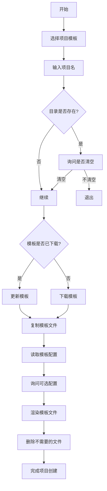

# Node.js CLI 脚手架：create 命令实现指南

## 概述

本文档详细介绍了如何构建一个功能完整的 Node.js CLI 脚手架工具，重点讲解 `create` 命令的实现原理、架构设计和最佳实践。通过本指南，你将学会如何创建一个支持项目模板选择、依赖管理、代码生成等功能的现代化脚手架工具。

## 项目架构

### 整体架构图

```text
┌─────────────────────────────────────────────────────────────┐
│                        CLI 脚手架工具                        │
├─────────────────────────────────────────────────────────────┤
│  CLI 入口 (bin/cli.js)                                     │
├─────────────────────────────────────────────────────────────┤
│  命令解析器 (yargs/commander)  →  create 命令处理器          │
├─────────────────────────────────────────────────────────────┤
│  核心功能层                                                 │
│  ├── 模板管理 (NpmPackage 类)                              │
│  ├── 用户交互 (@inquirer/prompts)                           │
│  ├── 文件操作 (fs-extra)                                  │
│  ├── 代码渲染 (ejs)                                       │
│  └── 进度显示 (ora)                                        │
├─────────────────────────────────────────────────────────────┤
│  工具层                                                     │
│  ├── 路径处理 (path)                                      │
│  ├── 系统信息 (os)                                        │
│  └── 异步处理                                              │
└─────────────────────────────────────────────────────────────┘
```

### 项目结构

```bash
guang-cli/
├── packages/
│   ├── cli/                    # CLI 入口包
│   │   ├── bin/
│   │   │   └── cli.js         # 可执行文件
│   │   ├── src/
│   │   │   └── index.ts       # CLI 主程序
│   │   └── package.json
│   ├── create/                # create 命令实现
│   │   ├── src/
│   │   │   └── index.ts       # create 命令核心逻辑
│   │   └── package.json
│   ├── utils/                 # 工具包
│   │   ├── src/
│   │   │   └── npm-package.ts # NPM 包管理类
│   │   └── package.json
│   ├── template-react/        # React 模板
│   │   ├── template/          # 模板文件目录
│   │   ├── questions.json     # 模板配置
│   │   └── package.json
│   └── template-vue/          # Vue 模板
│       ├── template/          # 模板文件目录
│       └── package.json
├── pnpm-workspace.yaml        # pnpm 工作区配置
└── package.json
```

## 核心功能

### 1. 模板选择系统

```typescript
// 模板配置定义
interface TemplateChoice {
  name: string // 显示名称
  value: string // 模板包名
  description?: string // 描述信息
}

// 模板选择实现
const projectTemplate = await select({
  message: "请选择项目模版",
  choices: [
    {
      name: "React 项目",
      value: "@guang-cli/template-react",
      description: "基于 Vite 的 React 项目模板"
    },
    {
      name: "Vue 项目",
      value: "@guang-cli/template-vue",
      description: "基于 Vite 的 Vue 项目模板"
    }
  ]
})
```

### 2. 项目命名验证

```typescript
// 项目名验证逻辑
let projectName = ""
while (!projectName) {
  projectName = await input({
    message: "请输入项目名",
    validate: (value) => {
      if (!value.trim()) {
        return "项目名不能为空"
      }
      if (!/^[a-zA-Z0-9-_]+$/.test(value)) {
        return "项目名只能包含字母、数字、连字符和下划线"
      }
      return true
    }
  })
}
```

### 3. 目录冲突处理

```typescript
// 目录存在性检查和冲突解决
const targetPath = path.join(process.cwd(), projectName)

if (fse.existsSync(targetPath)) {
  const stats = await fse.stat(targetPath)

  if (stats.isDirectory()) {
    const files = await fse.readdir(targetPath)

    if (files.length > 0) {
      const shouldEmpty = await confirm({
        message: `目录 ${projectName} 不为空，是否清空?`
      })

      if (shouldEmpty) {
        await fse.emptyDir(targetPath)
      } else {
        console.log("操作已取消")
        process.exit(0)
      }
    }
  } else {
    console.error(`错误: ${projectName} 已存在且不是目录`)
    process.exit(1)
  }
}
```

## create 命令实现原理

### 整体流程



### 核心实现代码

```typescript
// create 命令核心实现
import { select, input, confirm } from "@inquirer/prompts"
import os from "node:os"
import { NpmPackage } from "@guang-cli/utils"
import path from "node:path"
import ora from "ora"
import fse from "fs-extra"
import ejs from "ejs"
import { glob } from "glob"

export async function create() {
  try {
    // 1. 选择项目模板
    const projectTemplate = await selectTemplate()

    // 2. 获取项目名
    const projectName = await getProjectName()

    // 3. 处理目录冲突
    const targetPath = await handleDirectoryConflict(projectName)

    // 4. 下载/更新模板
    const templatePkg = await downloadOrUpdateTemplate(projectTemplate)

    // 5. 复制模板文件
    await copyTemplateFiles(templatePkg, targetPath)

    // 6. 处理模板配置
    const renderData = await processTemplateConfig(templatePkg, projectName)

    // 7. 渲染模板文件
    await renderTemplateFiles(targetPath, renderData)

    // 8. 清理不需要的文件
    await cleanupUnusedFiles(targetPath, renderData)

    // 9. 显示成功信息
    showSuccessMessage(targetPath)
  } catch (error) {
    console.error("项目创建失败:", error)
    process.exit(1)
  }
}
```

### 模板下载与更新

```typescript
// create 命令核心实现
import path from "node:path"
import fse from "fs-extra"
import execa from "execa"

class NpmPackage {
  private name: string
  private targetPath: string
  private npmFilePath: string

  constructor(options: { name: string; targetPath: string }) {
    this.name = options.name
    this.targetPath = options.targetPath
    this.npmFilePath = path.join(this.targetPath, "node_modules", this.name)
  }

  async exists(): Promise<boolean> {
    try {
      await fse.access(this.npmFilePath)
      return true
    } catch {
      return false
    }
  }

  async install(): Promise<void> {
    // 创建目标目录
    await fse.ensureDir(this.targetPath)

    // 初始化 package.json
    const packageJson = {
      name: "temp-template",
      version: "1.0.0",
      private: true
    }

    await fse.writeJSON(path.join(this.targetPath, "package.json"), packageJson)

    // 安装模板包
    await execa("npm", ["install", this.name], {
      cwd: this.targetPath,
      stdio: "pipe"
    })
  }

  async update(): Promise<void> {
    await execa("npm", ["update", this.name], {
      cwd: this.targetPath,
      stdio: "pipe"
    })
  }
}
```

## 模板管理系统

### 模板包结构

```text
template-react/
├── template/              # 模板文件目录
│   ├── src/
│   │   ├── main.tsx      # 入口文件
│   │   └── App.tsx       # 主组件
│   ├── public/
│   │   └── index.html    # HTML 模板
│   ├── package.json      # 项目配置 (EJS 模板)
│   ├── vite.config.ts    # 构建配置
│   └── eslint.config.js  # ESLint 配置 (可选)
├── questions.json        # 模板配置
└── package.json         # 模板包配置
```

### 模板配置文件

```json
{
  "eslint": {
    "description": "是否启用 ESLint 代码检查",
    "files": ["eslint.config.js", ".eslintrc.js"],
    "dependencies": {
      "eslint": "^9.13.0",
      "eslint-plugin-react": "^7.37.0",
      "eslint-plugin-react-hooks": "^5.0.0"
    },
    "scripts": {
      "lint": "eslint . --ext .js,.jsx,.ts,.tsx"
    }
  },
  "typescript": {
    "description": "是否启用 TypeScript 支持",
    "files": ["tsconfig.json"],
    "dependencies": {
      "typescript": "^5.0.0",
      "@types/react": "^18.0.0",
      "@types/react-dom": "^18.0.0"
    }
  }
}
```

### 动态模板处理

```typescript
interface TemplateConfig {
  [key: string]: {
    description: string
    files: string[]
    dependencies?: Record<string, string>
    scripts?: Record<string, string>
  }
}

async function processTemplateConfig(
  templatePkg: NpmPackage,
  projectName: string
): Promise<Record<string, any>> {
  const renderData: Record<string, any> = {
    projectName,
    dependencies: {},
    scripts: {}
  }
  const deleteFiles: string[] = []

  const configPath = path.join(templatePkg.npmFilePath, "questions.json")

  if (await fse.pathExists(configPath)) {
    const config: TemplateConfig = await fse.readJSON(configPath)

    for (const [key, option] of Object.entries(config)) {
      const enabled = await confirm({
        message: option.description || `是否启用 ${key}?`
      })

      renderData[key] = enabled

      if (!enabled) {
        deleteFiles.push(...option.files)
      } else {
        // 合并依赖和脚本
        if (option.dependencies) {
          Object.assign(renderData.dependencies, option.dependencies)
        }
        if (option.scripts) {
          Object.assign(renderData.scripts, option.scripts)
        }
      }
    }
  }

  renderData.deleteFiles = deleteFiles
  return renderData
}
```

## 代码生成与渲染

### EJS 模板语法

```json
// package.json 模板示例
{
  "name": "<%= projectName %>",
  "version": "1.0.0",
  "description": "A <%= projectName %> project",
  "scripts": {
    "dev": "vite",
    "build": "vite build",
    "preview": "vite preview"
    <% if (eslint) { %>,
    "lint": "<%= scripts.lint %>"
    <% } %>
  },
  "dependencies": {
    "react": "^18.2.0",
    "react-dom": "^18.2.0"
    <% if (Object.keys(dependencies).length > 0) { %>,
    <% Object.entries(dependencies).forEach(([name, version], index) => { %>
    "<%= name %>": "<%= version %>"<%= index < Object.keys(dependencies).length - 1 ? ',' : '' %>
    <% }); %>
    <% } %>
  }
}
```

### 文件渲染流程

```typescript
async function renderTemplateFiles(
  targetPath: string,
  renderData: Record<string, any>
): Promise<void> {
  const files = await glob("**", {
    cwd: targetPath,
    nodir: true,
    ignore: ["node_modules/**", ".git/**"]
  })

  for (const file of files) {
    const filePath = path.join(targetPath, file)

    try {
      // 尝试作为 EJS 模板渲染
      const rendered = await ejs.renderFile(filePath, renderData, {
        async: true,
        root: targetPath
      })

      await fse.writeFile(filePath, rendered)
    } catch (error) {
      // 如果渲染失败，保持原文件内容
      console.warn(`文件 ${file} 渲染失败，保持原内容`)
    }
  }
}
```

### 清理不需要的文件

```typescript
async function cleanupUnusedFiles(
  targetPath: string,
  renderData: Record<string, any>
): Promise<void> {
  const deleteFiles = renderData.deleteFiles || []

  for (const file of deleteFiles) {
    const filePath = path.join(targetPath, file)

    if (await fse.pathExists(filePath)) {
      await fse.remove(filePath)
      console.log(`已删除: ${file}`)
    }
  }
}
```

## 配置与扩展

### CLI 配置

```typescript
// cli/src/index.ts
import { Command } from "commander"
import { create } from "@guang-cli/create"

const program = new Command()

program.name("guang-cli").description("现代化前端项目脚手架工具").version("1.0.0")

program
  .command("create")
  .description("创建新项目")
  .option("-t, --template <template>", "指定项目模板")
  .option("-n, --name <name>", "项目名称")
  .option("--no-eslint", "禁用 ESLint")
  .option("--no-typescript", "禁用 TypeScript")
  .action(async (options) => {
    try {
      await create(options)
    } catch (error) {
      console.error("创建失败:", error)
      process.exit(1)
    }
  })

program.parse()
```

### 模板扩展

```typescript
// 支持自定义模板源
interface TemplateSource {
  name: string
  registry: string // npm registry 地址
  organization?: string // 组织名
  templates: TemplateChoice[]
}

const templateSources: TemplateSource[] = [
  {
    name: "官方模板",
    registry: "https://registry.npmjs.org",
    organization: "@guang-cli",
    templates: [
      { name: "React", value: "template-react" },
      { name: "Vue", value: "template-vue" },
      { name: "Angular", value: "template-angular" }
    ]
  },
  {
    name: "公司内网模板",
    registry: "https://npm.company.com",
    organization: "@company",
    templates: [
      { name: "微前端", value: "template-micro-frontend" },
      { name: "组件库", value: "template-component-lib" }
    ]
  }
]
```

### 配置文件支持

```typescript
// 支持 .guangclirc 配置文件
import { createRequire } from "node:module"

interface CliConfig {
  defaultTemplate?: string
  registry?: string
  packageManager?: "npm" | "yarn" | "pnpm"
  features?: {
    eslint?: boolean
    typescript?: boolean
    prettier?: boolean
  }
}

async function loadConfig(): Promise<CliConfig> {
  const configFiles = [
    ".guangclirc",
    ".guangclirc.json",
    ".guangclirc.js",
    "guang-cli.config.js"
  ]

  for (const configFile of configFiles) {
    const configPath = path.join(process.cwd(), configFile)

    if (await fse.pathExists(configPath)) {
      if (configFile.endsWith(".js")) {
        // ESM 中没有 require，需要用 createRequire 创建
        const require = createRequire(import.meta.url)
        return require(configPath)
      } else {
        return await fse.readJSON(configPath)
      }
    }
  }

  return {}
}
```

## 最佳实践

### 1. 错误处理

```typescript
class CliError extends Error {
  constructor(message: string, public code: string, public details?: any) {
    super(message)
    this.name = "CliError"
  }
}

async function handleError(error: Error): Promise<void> {
  if (error instanceof CliError) {
    console.error(`错误 [${error.code}]: ${error.message}`)

    if (error.details) {
      console.error("详细信息:", error.details)
    }
  } else {
    console.error("未知错误:", error.message)
  }

  process.exit(1)
}
```

### 2. 日志系统

```typescript
enum LogLevel {
  DEBUG = 0,
  INFO = 1,
  WARN = 2,
  ERROR = 3
}

class Logger {
  private level: LogLevel

  constructor(level: LogLevel = LogLevel.INFO) {
    this.level = level
  }

  debug(message: string, ...args: any[]): void {
    if (this.level <= LogLevel.DEBUG) {
      console.debug(`[DEBUG] ${message}`, ...args)
    }
  }

  info(message: string, ...args: any[]): void {
    if (this.level <= LogLevel.INFO) {
      console.info(`[INFO] ${message}`, ...args)
    }
  }

  warn(message: string, ...args: any[]): void {
    if (this.level <= LogLevel.WARN) {
      console.warn(`[WARN] ${message}`, ...args)
    }
  }

  error(message: string, ...args: any[]): void {
    if (this.level <= LogLevel.ERROR) {
      console.error(`[ERROR] ${message}`, ...args)
    }
  }
}

export const logger = new Logger(
  process.env.LOG_LEVEL === "debug" ? LogLevel.DEBUG : LogLevel.INFO
)
```

### 3. 性能优化

```typescript
// 并行处理模板下载和文件操作
async function optimizeTemplateProcessing(templates: string[]): Promise<void> {
  const downloadPromises = templates.map(async (template) => {
    const pkg = new NpmPackage({
      name: template,
      targetPath: path.join(os.homedir(), ".guang-cli-templates")
    })

    if (!(await pkg.exists())) {
      return pkg.install()
    }

    return Promise.resolve()
  })

  await Promise.all(downloadPromises)
}

// 缓存机制
class TemplateCache {
  private cacheDir: string
  private maxAge: number = 24 * 60 * 60 * 1000 // 24小时

  constructor() {
    this.cacheDir = path.join(os.homedir(), ".guang-cli-cache")
  }

  async get(key: string): Promise<any> {
    const cachePath = path.join(this.cacheDir, `${key}.json`)

    if (await fse.pathExists(cachePath)) {
      const stats = await fse.stat(cachePath)
      const age = Date.now() - stats.mtime.getTime()

      if (age < this.maxAge) {
        return await fse.readJSON(cachePath)
      }
    }

    return null
  }

  async set(key: string, data: any): Promise<void> {
    await fse.ensureDir(this.cacheDir)
    const cachePath = path.join(this.cacheDir, `${key}.json`)
    await fse.writeJSON(cachePath, data)
  }
}
```

### 4. 测试策略

```typescript
// 单元测试示例
import { describe, it, expect, jest } from "@jest/globals"
import { create } from "../src/create"

describe("create command", () => {
  it("should create project with valid name", async () => {
    const mockPrompts = {
      select: jest.fn().mockResolvedValue("@guang-cli/template-react"),
      input: jest.fn().mockResolvedValue("test-project"),
      confirm: jest.fn().mockResolvedValue(false)
    }

    jest.mock("@inquirer/prompts", () => mockPrompts)

    await create()

    expect(mockPrompts.select).toHaveBeenCalled()
    expect(mockPrompts.input).toHaveBeenCalled()
  })

  it("should handle invalid project name", async () => {
    const mockInput = jest
      .fn()
      .mockResolvedValueOnce("") // 第一次输入为空
      .mockResolvedValueOnce("valid-name") // 第二次输入有效

    jest.mock("@inquirer/prompts", () => ({
      select: jest.fn(),
      input: mockInput
    }))

    await create()

    expect(mockInput).toHaveBeenCalledTimes(2)
  })
})
```

## 常见问题

### Q1: 模板下载失败怎么办？

**A:** 检查网络连接和 NPM 源配置：

```bash
# 检查网络连接
ping registry.npmjs.org

# 查看当前 NPM 源
npm config get registry

# 切换到淘宝源
npm config set registry https://registry.npmmirror.com

# 或者使用代理
npm config set proxy http://proxy.company.com:8080
```

### Q2: 如何处理私有 NPM 包？

**A:** 配置 NPM 认证信息：

```bash
# 登录私有 NPM 仓库
npm login --registry=https://npm.company.com

# 或者在项目中配置 .npmrc
echo "@company:registry=https://npm.company.com" > .npmrc
echo "//npm.company.com/:_authToken=YOUR_TOKEN" >> .npmrc
```

### Q3: 模板渲染失败如何处理？

**A:** 检查模板语法和文件编码：

```typescript
// 添加详细的错误信息
try {
  const rendered = await ejs.renderFile(filePath, renderData)
} catch (error) {
  console.error(`模板渲染失败: ${filePath}`)
  console.error(`错误信息: ${error.message}`)
  console.error(`模板数据:`, renderData)

  // 保留原文件
  console.warn(`保留原文件: ${filePath}`)
}
```

### Q4: 如何调试 CLI 工具？

**A:** 使用 Node.js 调试工具和日志：

```bash
# 使用 Node.js 调试器
node --inspect-brk ./bin/cli.js create

# 设置调试日志
DEBUG=guang-cli:* npx @guang-cli/cli create

# 查看详细输出
npx @guang-cli/cli create --verbose
```

### Q5: 性能优化建议？

**A:**

1. **模板缓存**: 将下载的模板缓存到本地，避免重复下载
2. **并行处理**: 多个文件操作可以并行执行
3. **增量更新**: 只更新发生变化的文件
4. **压缩传输**: 使用压缩格式传输模板文件

```typescript
// 启用压缩
await execa("npm", ["install", "--prefer-offline", "--no-audit"], {
  cwd: this.targetPath,
  env: {
    ...process.env,
    npm_config_cache: path.join(os.homedir(), ".npm-cache")
  }
})
```

## 版本更新记录

### v1.2.0 (2024-12-04)

#### 新增功能

- ✅ 支持 TypeScript 模板项目
- ✅ 添加配置文件支持 (.guangclirc)
- ✅ 支持自定义 NPM 源配置
- ✅ 添加模板缓存机制

#### 优化改进

- 🚀 优化模板下载速度，支持并行处理
- 🔧 改进错误处理和用户提示信息
- 📊 添加详细的调试日志输出
- 🛡️ 增强项目名验证规则

#### 问题修复

- 🐛 修复 Windows 系统路径兼容性问题
- 🐛 修复模板渲染失败时文件丢失问题
- 🐛 修复网络异常时的重试机制

### v1.1.0 (2024-11-18)

#### 新增功能

- ✅ 支持 ESLint 可选配置
- ✅ 添加模板配置文件 (questions.json)
- ✅ 支持动态依赖管理
- ✅ 添加项目创建成功提示

#### 优化改进

- 🚀 优化用户交互流程
- 🔧 改进模板渲染性能
- 📋 完善命令行参数支持

### v1.0.0 (2024-11-17)

#### 初始版本

- ✅ 基础 create 命令实现
- ✅ 支持 React/Vue 模板选择
- ✅ 项目目录冲突处理
- ✅ 基础模板下载和复制
- ✅ EJS 模板渲染支持

---

## 附录

### 相关资源

- [GitHub 仓库](https://github.com/QuarkGluonPlasma/nodejs-course-code/tree/main/guang-cli)
- [NPM 包地址](https://www.npmjs.com/package/@guang-cli/cli)
- 模板开发指南与 API 文档见上方 GitHub 仓库（nodejs-course-code）源码目录

### 贡献指南

欢迎提交 Issue 和 Pull Request 来改进这个脚手架工具。

### 许可证

MIT License - 详见 LICENSE 文件
