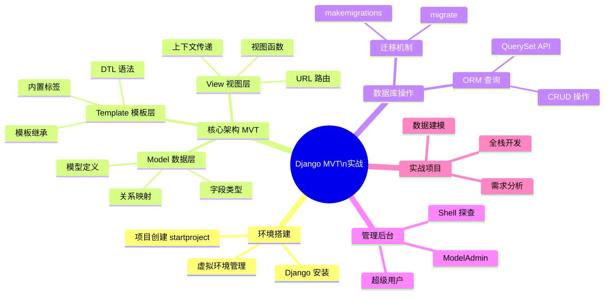
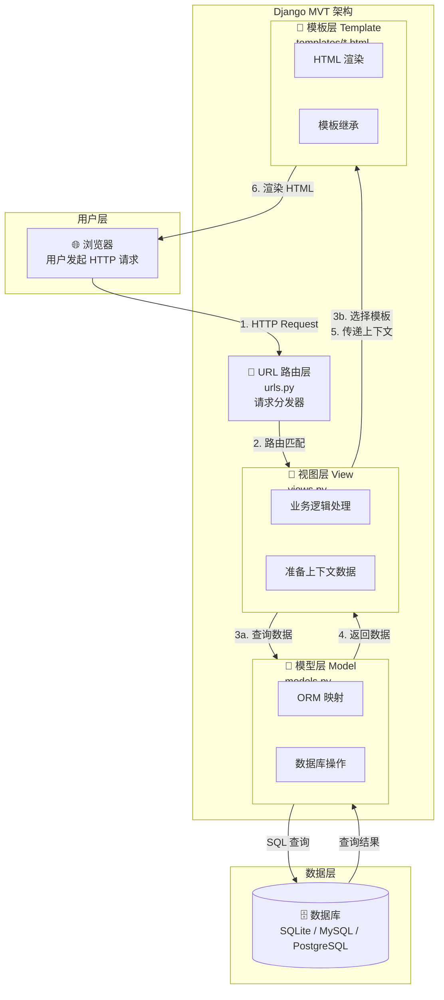
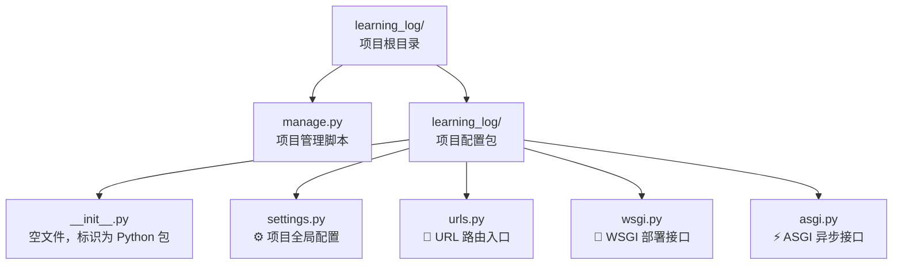
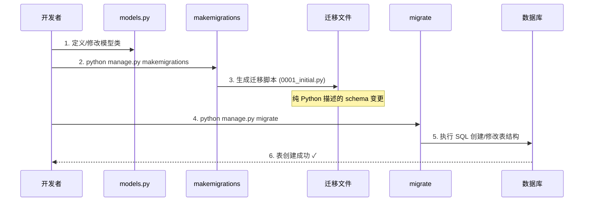
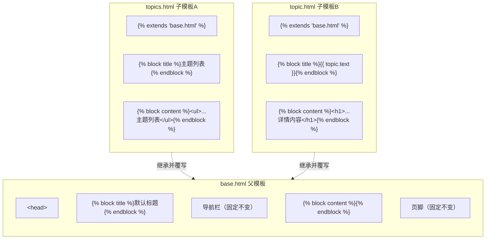
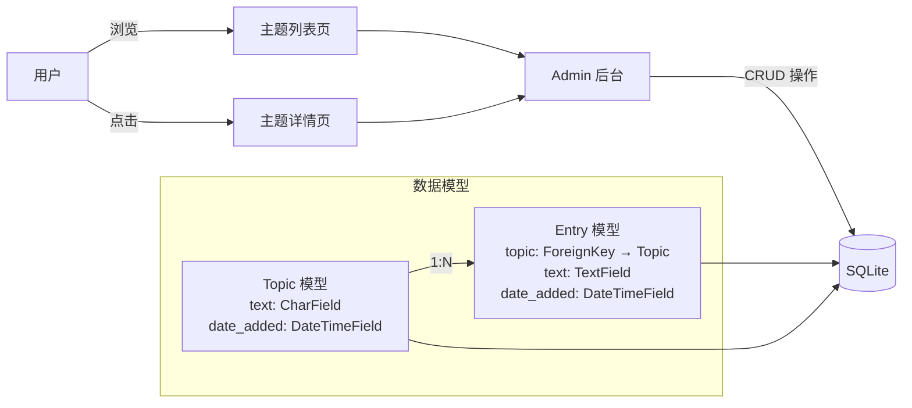
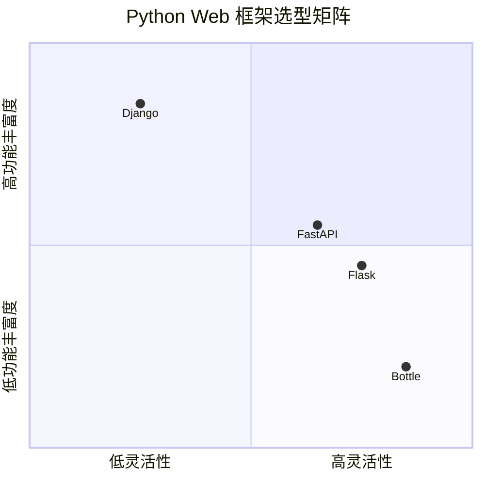

# Django 快速入门与 MVT 实战

Django 是 Python 生态中最成熟、功能最全的 Web 框架。本文通过构建一个**"学习笔记"在线日志系统**，系统讲解 Django 的 **MVT（Model-View-Template）** 架构模式，带你从零完成一个完整可运行的 Web 应用。

::: tip 学习目标

完成本文后，你将掌握：
- ✅ Django 项目初始化与应用创建的完整流程
- ✅ MVT 三层架构的设计思想与实现方式
- ✅ 模型定义、数据库迁移与 ORM 查询操作
- ✅ Django Admin 后台的配置与使用
- ✅ URL 路由、视图函数与模板系统的协同工作
- ✅ 模板继承机制与 DTL 模板语法

:::

## 开篇概述 + 知识体系思维导图



### 本文档实战项目：学习笔记系统

我们将构建一个**"学习笔记"**应用——一个用于记录学习主题和日志条目的在线日志系统：

| 功能模块 | 说明 | 对应技术点 |
|---------|------|-----------|
| 主题管理 | 创建、查看不同的学习主题（如"Python"、"机器学习"） | Model + Admin |
| 条目记录 | 在每个主题下添加具体的学习日志条目 | ForeignKey 关系 |
| 列表展示 | 展示所有主题及详情页 | View + Template |
| 后台管理 | 通过 Django Admin 管理数据 | 自动生成 CRUD |

## Django 在 Web 开发生态中的定位

Django 是 Python 世界中**"batteries included"（自带电池）**的全栈框架代表。了解它在生态中的位置，有助于你做出正确的技术选型。

### 主流 Python Web 框架对比

| 特性维度 | Django | Flask | FastAPI |
|---------|--------|-------|---------|
| **架构哲学** | 全栈框架，开箱即用 | 微框架，极简核心 | 现代 API 框架，异步优先 |
| **ORM 系统** | ✅ 强大的 Django ORM | ❌ 无（需 SQLAlchemy） | ❌ 无（需 SQLAlchemy/Tortoise） |
| **Admin 后台** | ✅ 自动生成 | ❌ 无 | ❌ 无 |
| **模板引擎** | ✅ DTL（Jinja2 风格） | ✅ Jinja2（默认） | ❌ 无（推荐前端分离） |
| **认证系统** | ✅ 完整的 auth 模块 | ❌ 需扩展（Flask-Login） | ❌ 需扩展 |
| **异步支持** | ⚠️ Django 3.1+ 部分 | ⚠️ 需额外配置 | ✅ 原生支持 |
| **学习曲线** | 中等（约定优于配置） | 低（灵活自由） | 中等（类型提示+异步） |
| **适用场景** | 内容管理系统、企业后台、快速原型 | 微服务、小型应用、API 服务 | 高性能 API、实时应用、ML 服务 |
| **社区生态** | 成熟稳定，插件丰富 | 轻量灵活，插件多 | 新兴活跃，增长快 |

::: info 选型建议

- **选 Django**：需要快速开发功能完整的 Web 应用，特别是内容驱动型系统（CMS、博客、电商后台）
- **选 Flask**：追求灵活性，或构建微服务架构，需要精细控制每个组件
- **选 FastAPI**：构建高性能 API 服务，特别是需要异步处理或与 ML 模型集成的场景

:::

## MVT 架构深入解析

Django 采用 **MVT（Model-View-Template）** 设计模式，这是对经典 MVC 模式的 Django 式演绎。

### MVT 架构图



### MVT 各层职责详解

| 层级 | 组件 | 核心文件 | 职责说明 | 类比理解 |
|------|------|---------|---------|---------|
| **M - Model** | 数据模型 | `models.py` | 定义数据结构、字段约束、表关系；通过 ORM 与数据库交互 | 数据库的蓝图 + 翻译官 |
| **V - View** | 视图逻辑 | `urls.py` + `views.py` | 接收请求 → 处理业务逻辑 → 调用 Model → 准备上下文 → 返回响应 | 大脑中枢，协调者 |
| **T - Template** | 页面模板 | `templates/*.html` | 接收 View 传来的上下文数据，渲染成 HTML 返回给浏览器 | 美工设计师 |

::: tip MVC vs MVT 的区别

传统 MVC 中：
- **Model** = 数据层（相同）
- **View** = 展示层（Django 的 Template）
- **Controller** = 业务逻辑层（Django 的 View）

Django 将 Controller 的职责融入了框架本身（URL 路由 + View），所以叫 **MVT** 而非 MVC。本质思想一致，只是命名不同。

:::

## 项目初始化与环境搭建

### 步骤 1：虚拟环境与依赖管理

::: warning 生产实践

永远不要在全局环境中安装项目依赖！使用虚拟环境隔离项目依赖，避免版本冲突。

:::

```bash
# 创建项目目录
mkdir learning_log && cd learning_log

# 创建虚拟环境（Python 3）
python3 -m venv ll_env

# 激活虚拟环境
# macOS/Linux:
source ll_env/bin/activate
# Windows:
# ll_env\Scripts\activate

# 升级 pip 并安装 Django（版本范围务必加引号，避免 shell 把 < > 当作重定向符）
pip install --upgrade pip
pip install "django>=5.2,<6.0"

# 验证安装
python -m django --version
# 输出示例: 5.2.x
```

### 步骤 2：创建 Django 项目

```bash
# ★ 关键：末尾的句点 . 让 Django 在当前目录创建项目，而不是新建子目录
django-admin startproject learning_log .

# 查看生成的项目结构
ls -la
```

::: danger 常见错误：忘记句点

❌ 错误写法：`django-admin startproject learning_log`
- 这会创建 `learning_log/learning_log/` 的嵌套目录结构

✅ 正确写法：`django-admin startproject learning_log .`
- 末尾的 `.` 表示"在当前目录创建"，结构更清晰

:::

### 步骤 3：项目目录结构解析



#### 核心文件详解

| 文件/目录 | 用途 | 重要程度 |
|----------|------|---------|
| `manage.py` | Django 项目的命令行工具，用于运行服务器、迁移数据库、创建超级用户等 | ⭐⭐⭐⭐⭐ |
| `__init__.py` | 空文件，告诉 Python 这是一个包 | ⭐⭐ |
| `settings.py` | **项目的配置中心**：数据库、已安装应用、中间件、静态文件等所有设置 | ⭐⭐⭐⭐⭐ |
| `urls.py` | **URL 路由入口**：定义 URL 与视图函数的映射关系 | ⭐⭐⭐⭐⭐ |
| `wsgi.py` | WSGI 兼容的 Web 服务器入口，用于生产部署（Gunicorn/uWSGI） | ⭐⭐⭐ |
| `asgi.py` | ASGI 兼容的异步服务器入口，支持 WebSocket、HTTP/2 | ⭐⭐⭐ |

### 步骤 4：初始化数据库

```bash
# 创建数据库并应用默认迁移（内置应用的表结构）
python manage.py migrate

# 输出示例：
# Operations to perform:
#   Apply all migrations: admin, auth, contenttypes, sessions
# Running migrations:
#   Applying contenttypes.0001_initial... OK
#   Applying auth.0001_initial... OK
#   Applying admin.0001_initial... OK
#   ...
```

执行后会在项目根目录生成 `db.sqlite3` 文件——这是 Django 默认使用的 SQLite 数据库文件。

::: info 关于 SQLite

SQLite 是轻量级的嵌入式数据库，无需安装独立的服务器进程。它非常适合：
- ✅ 开发环境快速原型验证
- ✅ 小型应用、低并发场景
- ✅ 学习和教学用途

生产环境建议迁移至 PostgreSQL 或 MySQL。

:::

### 步骤 5：验证开发服务器

```bash
# 启动 Django 开发服务器
python manage.py runserver

# 输出：
# Watching for file changes with StatReloader...
# Performing system checks...
#
# System check identified no issues (0 silenced).
# June 07, 2026 - 10:00:00
# Django version 5.2.x, using settings 'learning_log.settings'
# Starting development server at http://127.0.0.1:8000/
# Quit the server with CONTROL-C.
```

访问 `http://127.0.0.1:8000/`，如果看到 Django 的欢迎火箭页面 🚀，说明项目初始化成功！

## 数据层：模型设计与 ORM

### 步骤 1：创建应用程序

在 Django 中，**项目（Project）** 是整个应用的容器，而 **应用程序（App）** 是具体的功能模块。一个项目可以包含多个 App。

```bash
# 创建名为 learning_notes 的应用程序
python manage.py startapp learning_notes

# 生成的 app 目录结构：
# learning_notes/
# ├── __init__.py
# ├── admin.py       # Admin 后台注册
# ├── apps.py        # App 配置
# ├── models.py      # ★ 数据模型定义
# ├── tests.py       # 单元测试
# └── views.py       # ★ 视图函数
```

### 步骤 2：定义 Topic 模型

```python
# learning_notes/models.py
from django.db import models


class Topic(models.Model):
    """用户学习的主题"""
    text = models.CharField(max_length=200)          # 主题文本，最大长度200字符
    date_added = models.DateTimeField(auto_now_add=True)  # 自动记录创建时间

    class Meta:
        verbose_name = '主题'                          # 单数形式显示名
        verbose_name_plural = '主题'                   # 复数形式显示名（Admin后台使用）

    def __str__(self):
        """返回模型的字符串表示，用于 Admin 和 Shell 显示"""
        return self.text
```

### 模型字段类型速查表

| 字段类型 | 说明 | 示例 | 数据库映射 |
|---------|------|------|-----------|
| `CharField(max_length=N)` | 短文本字符串 | 用户名、标题 | `VARCHAR(N)` |
| `TextField` | 长文本（无长度限制） | 文章内容、备注 | `TEXT` |
| `IntegerField` | 整数 | 年龄、数量 | `INTEGER` |
| `FloatField` | 浮点数 | 价格、评分 | `REAL` |
| `DecimalField(max_digits, decimal_places)` | 精确小数 | 金额、坐标 | `DECIMAL` |
| `BooleanField` | 布尔值 | 是否激活 | `BOOLEAN` |
| `DateField` | 日期 | 出生日期 | `DATE` |
| `DateTimeField` | 日期时间 | 创建时间 | `DATETIME` |
| `EmailField` | 邮箱地址（带格式验证） | 用户邮箱 | `VARCHAR(254)` |
| `URLField` | URL 地址 | 个人主页 | `VARCHAR(200)` |
| `ImageField` | 图片路径 | 头像 | `VARCHAR(100)` |
| `FileField` | 文件路径 | 附件 | `VARCHAR(100)` |
| `ForeignKey(to, on_delete)` | 外键（多对一关系） | 所属分类 | `FOREIGN KEY` |
| `ManyToManyField(to)` | 多对多关系 | 标签、权限 | 中间关联表 |
| `OneToOneField(to)` | 一对一关系 | 用户资料扩展 | `UNIQUE FOREIGN KEY` |

### DateTimeField 常用参数

| 参数 | 行为 | 适用场景 |
|------|------|---------|
| `auto_now_add=True` | **仅在创建时**自动设置为当前时间 | 记录创建时间（不可手动修改） |
| `auto_now=True` | **每次保存时**自动更新为当前时间 | 记录最后修改时间 |
| 都不设置 | 需要手动提供值 | 自定义时间字段 |

### 步骤 3：激活模型（三步走）

::: warning 重要概念

定义模型后，必须经过**激活**才能在数据库中创建对应的表！这是一个容易遗漏的关键步骤。

:::



#### 第一步：注册应用到 INSTALLED_APPS

```python
# learning_log/settings.py

INSTALLED_APPS = [
    # Django 内置应用
    'django.contrib.admin',
    'django.contrib.auth',
    'django.contrib.contenttypes',
    'django.contrib.sessions',
    'django.contrib.messages',
    'django.contrib.staticfiles',

    # ★ 我的应用
    'learning_notes',   # 注册我们的学习笔记应用
]
```

#### 第二步：生成迁移文件

```bash
# 让 Django 检测模型变更并生成迁移文件
python manage.py makemigrations learning_notes

# 输出：
# Migrations for 'learning_notes':
#   learning_notes/migrations/0001_initial.py
#     - Create model Topic
```

#### 第三步：执行迁移

```bash
# 将迁移应用到数据库（实际创建表）
python manage.py migrate

# 输出：
# Applying learning_notes.0001_initial... OK
```

### 迁移工作流对照表

| 命令 | 作用 | 产物 | 执行时机 |
|------|------|------|---------|
| `makemigrations` | 分析模型变更 → 生成迁移脚本 | `migrations/000N_xxx.py` | 每次**修改 models.py** 后 |
| `migrate` | 执行未应用的迁移 → 更新数据库 | 数据库表结构的实际变更 | 每次**有新迁移文件**后 |
| `showmigrations` | 查看迁移状态 | 终端输出列表 | 调试迁移问题时 |
| `sqlmigrate` | 查看迁移对应的 SQL | 终端输出 SQL 语句 | 想看具体执行的 SQL 时 |

::: danger 常见陷阱：makemigrations vs migrate 混淆

❌ **只运行 migrate 不运行 makemigrations**
- 结果：数据库不会有任何变化，因为还没有生成迁移文件

❌ **忘记注册 INSTALLED_APPS 就运行 makemigrations**
- 结果：Django 不知道要检查哪个应用的模型

✅ **正确顺序**：修改 models.py → makemigrations → migrate

:::

### 步骤 4：定义 Entry 模型（关联模型）

在实际项目中，模型之间往往存在关联关系。"学习笔记"系统中，每个**主题（Topic）**下可以有多个**条目（Entry）**，这是一对多关系。

```python
# learning_notes/models.py
from django.db import models


class Topic(models.Model):
    """用户学习的主题"""
    text = models.CharField(max_length=200)
    date_added = models.DateTimeField(auto_now_add=True)

    class Meta:
        verbose_name_plural = '主题'

    def __str__(self):
        return self.text


class Entry(models.Model):
    """学到的有关某个主题的具体知识"""
    # ★ ForeignKey 定义多对一关系：多个 Entry 属于一个 Topic
    topic = models.ForeignKey(
        Topic,
        on_delete=models.CASCADE,  # 删除主题时，级联删除其所有条目
        related_name='entries',     # 反向查询名称：topic.entries.all()
    )
    text = models.TextField()                           # 长文本字段
    date_added = models.DateTimeField(auto_now_add=True)

    class Meta:
        verbose_name_plural = '条目'
        ordering = ['-date_added']                       # 默认按时间倒序排列

    def __str__(self):
        """返回前50个字符作为简短表示"""
        if len(self.text) > 50:
            return self.text[:50] + "..."
        return self.text
```

### ForeignKey 参数详解

| 参数 | 说明 | 必填 | 示例值 |
|------|------|------|--------|
| `to` | 关联的目标模型 | ✅ | `Topic` 或 `'app.Topic'` |
| `on_delete` | 关联对象删除时的行为 | ✅ | `models.CASCADE` |
| `related_name` | 反向查询的属性名 | ❌（默认为 `modelname_set`） | `'entries'` |
| `null` | 是否允许 NULL 值 | ❌（默认 False） | `True` |
| `blank` | 表单验证是否允许为空 | ❌（默认 False） | `True` |

### on_delete 可选策略

| 策略 | 行为 | 使用场景 |
|------|------|---------|
| `CASCADE` | **级联删除**：删除主对象时同时删除所有关联对象 | 订单→订单明细 |
| `PROTECT` | **保护模式**：如果有关联对象则禁止删除主对象 | 用户→关键数据 |
| `SET_NULL` | **置空**：删除主对象时将外键设为 NULL（需 null=True） | 可选的分类归属 |
| `SET_DEFAULT` | **设为默认值**：删除主对象时外键设为默认值 | 有合理默认值的场景 |
| `DO_NOTHING` | **不作为**：数据库层面的行为，需数据库支持 | 特殊业务需求 |
| `RESTRICT` | **限制**：类似 PROTECT，但更严格（Django 3.0+） | 强一致性要求 |

::: warning 安全提醒

`on_delete` 是 **必填参数**！Django 2.0+ 要求显式指定，否则会抛出 TypeError。选择时要仔细考虑业务逻辑——错误的级联删除可能导致数据丢失！

:::

再次执行迁移以创建 Entry 表：

```bash
python manage.py makemigrations learning_notes
python manage.py migrate
```

## Django 管理后台（Admin）

Django 最令人称道的特性之一就是**自动生成的管理后台**——无需编写任何 CRUD 代码，就能获得一个功能完善的数据管理界面。

### 步骤 1：创建超级用户

```bash
python manage.py createsuperuser

# 交互式输入：
# Username: admin
# Email address: admin@example.com
# Password: ********
# Password (again): ********
# Superuser created successfully.
```

### 步骤 2：注册模型到 Admin

```python
# learning_notes/admin.py
from django.contrib import admin
from .models import Topic, Entry


@admin.register(Topic)
class TopicAdmin(admin.ModelAdmin):
    """Topic 模型的 Admin 配置"""
    list_display = ('text', 'date_added')           # 列表页显示的字段
    search_fields = ('text',)                        # 搜索框搜索的字段
    list_filter = ('date_added',)                    # 右侧筛选栏


@admin.register(Entry)
class EntryAdmin(admin.ModelAdmin):
    """Entry 模型的 Admin 配置"""
    list_display = ('topic', 'date_added', 'text_preview')
    list_filter = ('topic', 'date_added')
    search_fields = ('text',)
    raw_id_fields = ('topic',)                       # 外键以 ID 输入框显示（数据量大时有用）

    @admin.display(description='内容预览')           # 自定义列的显示名称
    def text_preview(self, obj):
        return obj.text[:50] + '...' if len(obj.text) > 50 else obj.text
```

### 步骤 3：访问 Admin 后台

启动开发服务器后，访问 `http://127.0.0.1:8000/admin/`，使用刚创建的超级用户登录即可看到管理界面。

### Django Shell 数据探查

Django Shell 是一个强大的调试工具，让你在命令行中直接与数据库交互：

```bash
# 进入 Django Shell（相比普通 Python Shell，它预加载了 Django 环境）
python manage.py shell
```

```python
# ===== 在 Django Shell 中执行 =====

# 导入模型
from learning_notes.models import Topic, Entry

# 1. 查询所有主题
topics = Topic.objects.all()
for topic in topics:
    print(topic.id, topic.text, topic.date_added)
# 输出: 1 Python基础 2026-06-07 10:30:00
#       2 Django框架 2026-06-07 11:00:00

# 2. 获取单个对象（注意：get() 如果找不到会抛异常！）
try:
    topic = Topic.objects.get(id=1)
    print(topic)  # 输出: Python基础
except Topic.DoesNotExist:
    print("主题不存在")

# 3. 过滤查询（返回 QuerySet，即使结果为空也不会报错）
python_topics = Topic.objects.filter(text__icontains='python')
print(python_topics.count())  # 输出匹配数量

# 4. 通过外键反向查询（related_name 的威力）
topic = Topic.objects.get(id=1)
entries = topic.entries.all()         # 获取该主题下的所有条目
recent_entries = topic.entries.order_by('-date_added')[:5]  # 最新5条

# 5. 创建新条目
entry = Entry()
entry.topic = topic
entry.text = "今天学习了 Django 的 MVT 架构..."
entry.save()

# 6. 一行代码创建（create 方法）
Entry.objects.create(
    topic=topic,
    text="Django Admin 真的很强大！"
)

# 7. 删除条目
entry.delete()
```

### ORM 查询方法速查表

| 方法 | 返回类型 | 说明 | 示例 |
|------|---------|------|------|
| `.all()` | QuerySet | 查询所有记录 | `Topic.objects.all()` |
| `.get(**kwargs)` | Model 实例 | 获取单条记录（不唯一/不存在则异常） | `Topic.objects.get(id=1)` |
| `.filter(**kwargs)` | QuerySet | 过滤查询（AND 条件） | `Topic.objects.filter(text='Python')` |
| `.exclude(**kwargs)` | QuerySet | 排除查询 | `Topic.objects.exclude(id=1)` |
| `.order_by(field)` | QuerySet | 排序 | `Entry.objects.order_by('-date_added')` |
| `.values(*fields)` | QuerySet of dict | 返回字典而非实例 | `Topic.objects.values('id', 'text')` |
| `.count()` | int | 计数 | `Topic.objects.count()` |
| `.first() / .last()` | Model 实例 or None | 获取第一条/最后一条 | `Topic.objects.first()` |
| `.exists()` | bool | 判断是否存在 | `Topic.objects.filter(id=1).exists()` |
| `.create(**kwargs)` | Model 实例 | 创建并保存 | `Topic.objects.create(text='New')` |
| `.bulk_create(objects)` | list | 批量创建（高效） | `Topic.objects.bulk_create([...])` |
| `.delete()` | (deleted, {count}) | 删除查询集中的所有记录 | `Topic.objects.filter(id=1).delete()` |

### 常用查找条件（Field Lookups）

| 查找方式 | 含义 | SQL 等价 |
|---------|------|---------|
| `field__exact=value` | 精确匹配 | `WHERE field = value` |
| `field__iexact=value` | 忽略大小写的精确匹配 | `WHERE UPPER(field) = UPPER(value)` |
| `field__contains=value` | 包含（区分大小写） | `WHERE field LIKE '%value%'` |
| `field__icontains=value` | 包含（忽略大小写） | `WHERE field ILIKE '%value%'` |
| `field__in=[list]` | 在列表中 | `WHERE field IN (list)` |
| `field__gt / gte` | 大于 / 大于等于 | `WHERE field > / >= value` |
| `field__lt / lte` | 小于 / 小于等于 | `WHERE field < / <= value` |
| `field__startswith` | 以...开头 | `WHERE field LIKE 'value%'` |
| `field__endswith` | 以...结尾 | `WHERE field LIKE '%value'` |
| `field__range=(start, end)` | 范围查询 | `WHERE field BETWEEN start AND end` |
| `field__isnull=True/False` | 为空判断 | `WHERE field IS NULL / IS NOT NULL` |

## 视图层：URL路由与视图函数

视图层是 Django MVT 架构中的**大脑**——它接收请求、处理业务逻辑、调用模型获取数据、最终返回响应。

### URL 配置详解

#### path() 函数三要素

```python
path(route, view, kwargs=None, name=None)
```

| 参数 | 类型 | 必填 | 说明 |
|------|------|------|------|
| `route` | str | ✅ | URL 路径模式（路由字符串） |
| `view` | callable | ✅ | 对应的视图函数或 `include()` |
| `kwargs` | dict | ❌ | 传递给视图函数的额外关键字参数 |
| `name` | str | ❌ | URL 的名称，用于反向解析（强烈建议命名！） |

#### 三种路由方式对比

```python
# learning_log/urls.py（项目主路由）
from django.contrib import admin
from django.urls import path, include

urlpatterns = [
    path('admin/', admin.site.urls),

    # 方式一：直接导入视图函数（适合小型项目）
    # from learning_notes.views import index
    # path('', index, name='index'),

    # 方式二：使用 include 分发到子应用路由（★ 推荐）
    path('', include('learning_notes.urls')),
]
```

```python
# learning_notes/urls.py（应用子路由）
from django.urls import path
from . import views

app_name = 'learning_notes'  # 命名空间，避免不同 app 的 name 冲突

urlpatterns = [
    # 首页：显示所有主题
    path('', views.index, name='index'),

    # 主题列表页
    path('topics/', views.topics, name='topics'),

    # 主题详情页：<int:topic_id> 捕获 URL 中的整数参数
    path('topics/<int:topic_id>/', views.topic, name='topic'),
]
```

#### URL 参数捕获类型转换器

| 转换器 | 匹配规则 | 示例 URL | 视图接收值 |
|--------|---------|---------|-----------|
| `<str:param>` | 非空字符串（不含 `/`） | `/topics/python/` | `'python'` |
| `<int:param>` | 0 或正整数 | `/topics/1/` | `1` |
| `<slug:param>` | 字母、数字、下划线、连字符 | `/posts/my-first-post/` | `'my-first-post'` |
| `<uuid:param>` | 格式化的 UUID | `/items/a0eebc99-9c0b-4ef8-bb6d-6bb9bd380a11/` | UUID 对象 |
| `<path:param>` | 包含 `/` 的字符串 | `/files/docs/readme.txt/` | `'docs/readme.txt'` |

### 视图函数与 render()

视图函数是处理 HTTP 请求的核心单元，它接收 `request` 对象，返回 `HttpResponse`（通常通过 `render()` 快捷函数）。

```python
# learning_notes/views.py
from django.shortcuts import render, get_object_or_404
from .models import Topic, Entry


def index(request):
    """项目首页"""
    return render(request, 'learning_notes/index.html')


def topics(request):
    """显示所有主题"""
    topics = Topic.objects.order_by('date_added')  # 按创建时间排序
    context = {'topics': topics}                    # 构建上下文字典
    return render(request, 'learning_notes/topics.html', context)


def topic(request, topic_id):
    """
    显示单个主题及其所有条目

    Args:
        request: HTTP 请求对象
        topic_id: 从 URL 捕获的主题 ID（整数）
    """
    # get_object_or_404: 获取对象或返回 404 页面（比 try-except 更优雅）
    topic = get_object_or_404(Topic, id=topic_id)

    # 通过外键反向查询获取该主题的所有条目（按时间倒序）
    entries = topic.entries.order_by('-date_added')

    context = {
        'topic': topic,
        'entries': entries,
    }
    return render(request, 'learning_notes/topic.html', context)
```

### render() 函数参数说明

```python
render(request, template_name, context=None, content_type=None, status=None)
```

| 参数 | 说明 | 必填 |
|------|------|------|
| `request` | HTTP 请求对象 | ✅ |
| `template_name` | 模板文件的路径（相对于 templates 目录） | ✅ |
| `context` | 传递给模板的变量字典 | ❌ |
| `content_type` | 响应的 MIME 类型 | ❌（默认 `text/html`） |
| `status` | HTTP 状态码 | ❌（默认 200） |

### URL 名称空间与反向解析

::: tip 最佳实践

**始终为 URL 命名！** 这让你的代码更具可维护性——修改 URL 路径时不需要到处改硬编码的链接。

:::

```html
<!-- ❌ 硬编码 URL（脆弱，改动成本高） -->
<a href="/topics/1/">查看主题</a>

<!-- ✅ 使用  标签反向解析（健壮，自动跟随路由变化） -->
<a href="">查看主题</a>
```

```python
# 在视图中反向解析 URL
from django.urls import reverse
from django.http import HttpResponseRedirect

def some_view(request):
    # 重定向到指定命名的 URL
    return HttpResponseRedirect(reverse('learning_notes:topics'))
```

## 模板层：模板引擎与继承

Django 模板引擎（DTL, Django Template Language）是一种**受限的模板语言**——它故意限制了逻辑能力，强制将业务逻辑保留在视图中，让模板专注于展示。

### DTL 模板语法速查

| 语法类别 | 语法 | 说明 | 示例 |
|---------|------|------|------|
| **变量输出** | `{{ variable }}` | 输出变量的值（自动转义 HTML） | `{{ topic.text }}` |
| **过滤器** | `{{ var\|filter }}` | 对变量进行管道式处理 | `{{ text\|truncatewords:30 }}` |
| **标签** | `` | 控制模板逻辑（循环、判断、继承等） | `` |
| **注释** | `{# comment #}` | 模板注释（不会输出到 HTML） | `{# 这是注释 #}` |

### 常用内置过滤器

| 过滤器 | 说明 | 示例 | 输出 |
|--------|------|------|------|
| `lower` | 转小写 | `{{ "Hello"\|lower }}` | `hello` |
| `upper` | 转大写 | `{{ "hello"\|upper }}` | `HELLO` |
| `truncatechars:N` | 截断到 N 个字符（含省略号） | `{{ long_text\|truncatechars:50 }}` | 前47字符+`...` |
| `truncatewords:N` | 截断到 N 个单词 | `{{ text\|truncatewords:10 }}` | 前10词+`...` |
| `date:"FORMAT"` | 格式化日期 | `{{ date\|date:"Y-m-d H:i" }}` | `2026-06-07 10:30` |
| `length` | 获取长度 | `{{ items\|length }}` | `5` |
| `default:"VALUE"` | 为空时的默认值 | `{{ name\|default:"匿名" }}` | `匿名`（当 name 为空时） |
| `linebreaks` | 将换行转为 `<p>` 和 `<br>` | `{{ content\|linebreaks }}` | HTML 段落 |
| `safe` | **禁用转义**（谨慎使用！） | `{{ html\|safe }}` | 原始 HTML |
| `join:", "` | 列表拼接为字符串 | `{{ list\|join:", " }}` | `a, b, c` |

### 常用内置标签详解

```html
<!-- ===== 变量与注释 ===== -->
<p>{{ username }}</p>
{# 这是模板注释，不会出现在最终的 HTML 中 #}

<!-- ===== 条件判断 ===== -->

    <p>欢迎回来，{{ user.username }}！</p>

    <p>欢迎新用户！</p>

    <p><a href="">请登录</a></p>


<!-- ===== 循环迭代 ===== -->
<ul>

    <li>{{ forloop.counter }}. {{ topic.text }}</li>
    <!-- forloop.counter: 当前是第几次循环（从1开始） -->
    <!-- forloop.counter0: 从0开始 -->
    <!-- forloop.first / last: 是否是第一个/最后一个 -->

    <li>暂无主题，<a href="">立即创建</a></li>

</ul>

<!-- ===== URL 反向解析 ===== -->
<a href="">
    {{ topic.text }}
</a>

<!-- ===== 模板继承（稍后详述） ===== -->

主题详情
...

<!-- ===== 静态文件加载 ===== -->

<link rel="stylesheet" href="">

```

### 模板继承机制

模板继承是 DTL 最强大的特性之一——它允许你创建一个**父模板（base template）**定义通用的页面骨架，然后让**子模板（child template）**只覆写需要变化的部分块（block）。



#### base.html 父模板

```html
<!-- learning_notes/templates/learning_notes/base.html -->
<!DOCTYPE html>
<html lang="zh-CN">
<head>
    <meta charset="UTF-8">
    <meta name="viewport" content="width=device-width, initial-scale=1.0">
    <title>学习笔记</title>
</head>
<body>
    <!-- 导航栏 -->
    <nav>
        <a href="">首页</a>
        <a href="">主题</a>
    </nav>

    <!-- 主要内容区域：子模板将在这里注入内容 -->
    <main>
        
        <!-- 默认内容（子模板未覆写时显示） -->
        <p>欢迎来到学习笔记！</p>
        
    </main>

    <!-- 页脚 -->
    <footer>
        <p>&copy; 2026 学习笔记. All rights reserved.</p>
    </footer>
</body>
</html>
```

#### topics.html 子模板（列表页）

```html
<!-- learning_notes/templates/learning_notes/topics.html -->


主题列表 - 学习笔记


<h1>所有主题</h1>

<ul>

    <li>
        <a href="">
            {{ topic.text }}
        </a>
        <small>({{ topic.date_added|date:"Y-m-d H:i" }})</small>
    </li>

    <li>暂无主题。<a href="#">创建新主题</a></li>

</ul>

```

#### topic.html 子模板（详情页）

```html
<!-- learning_notes/templates/learning_notes/topic.html -->


{{ topic.text }} - 学习笔记


<h1>{{ topic.text }}</h1>
<p>创建于：{{ topic.date_added|date:"Y年m月d日 H:i" }}</p>

<h2>条目列表</h2>

    <article class="entry">
        <p class="entry-time">{{ entry.date_added|date:"m-d H:i" }}</p>
        <p class="entry-text">{{ entry.text|linebreaks }}</p>
    </article>

    <p>该主题下暂无条目。</p>


<p>
    <a href="">← 返回主题列表</a>
</p>

```

### 模板目录结构规范

```
learning_notes/
└── templates/                    # 模板根目录
    └── learning_notes/           # ★ 以应用名命名的子目录（避免冲突！）
        ├── base.html             # 父模板
        ├── index.html            # 首页
        ├── topics.html           # 主题列表页
        └── topic.html            # 主题详情页
```

::: warning 模板命名空间

**务必将模板放在以应用名命名的子目录中！**

原因：当多个 App 有同名模板（如 `index.html`）时，Django 会按照 `INSTALLED_APPS` 的顺序查找，可能加载到错误的模板。使用 `templates/app_name/` 结构可以完美避免此问题。

:::

## 完整实战：学习笔记项目全流程

### 需求分析与数据建模



### 从零到上线：完整代码清单

以下是"学习笔记"项目的**全部关键文件**完整代码：

#### 1️⃣ 项目配置：settings.py 关键部分

```python
# learning_log/settings.py

INSTALLED_APPS = [
    'django.contrib.admin',
    'django.contrib.auth',
    'django.contrib.contenttypes',
    'django.contrib.sessions',
    'django.contrib.messages',
    'django.contrib.staticfiles',
    'learning_notes',              # ★ 注册我们的应用
]

# 数据库配置（默认 SQLite，开发环境够用）
DATABASES = {
    'default': {
        'ENGINE': 'django.db.backends.sqlite3',
        'NAME': BASE_DIR / 'db.sqlite3',
    }
}

# 语言和时区设置
LANGUAGE_CODE = 'zh-hans'
TIME_ZONE = 'Asia/Shanghai'
USE_I18N = True
USE_TZ = True
```

#### 2️⃣ 模型定义：models.py

```python
# learning_notes/models.py
from django.db import models


class Topic(models.Model):
    """学习主题"""
    text = models.CharField(max_length=200)
    date_added = models.DateTimeField(auto_now_add=True)

    class Meta:
        verbose_name_plural = '主题'

    def __str__(self):
        return self.text


class Entry(models.Model):
    """主题下的具体条目"""
    topic = models.ForeignKey(
        Topic,
        on_delete=models.CASCADE,
        related_name='entries'
    )
    text = models.TextField()
    date_added = models.DateTimeField(auto_now_add=True)

    class Meta:
        verbose_name_plural = '条目'
        ordering = ['-date_added']

    def __str__(self):
        return self.text[:50] + '...' if len(self.text) > 50 else self.text
```

#### 3️⃣ Admin 注册：admin.py

```python
# learning_notes/admin.py
from django.contrib import admin
from .models import Topic, Entry


class EntryInline(admin.TabularInline):
    """在 Topic 编辑页面内联编辑 Entry"""
    model = Entry
    extra = 1  # 显示 1 个空白 Entry 表单供添加


@admin.register(Topic)
class TopicAdmin(admin.ModelAdmin):
    list_display = ('text', 'date_added')
    search_fields = ('text',)
    inlines = [EntryInline]  # 内联编辑关联的条目


@admin.register(Entry)
class EntryAdmin(admin.ModelAdmin):
    list_display = ('topic', 'text_preview', 'date_added')
    list_filter = ('topic', 'date_added')

    @admin.display(description='内容摘要')
    def text_preview(self, obj):
        return obj.text[:50] + '...' if len(obj.text) > 50 else obj.text
```

#### 4️⃣ URL 路由：两层 urls.py

```python
# learning_log/urls.py（项目主路由）
from django.contrib import admin
from django.urls import path, include

urlpatterns = [
    path('admin/', admin.site.urls),
    path('', include('learning_notes.urls')),  # 分发给应用的路由
]
```

```python
# learning_notes/urls.py（应用子路由）
from django.urls import path
from . import views

app_name = 'learning_notes'

urlpatterns = [
    path('', views.index, name='index'),
    path('topics/', views.topics, name='topics'),
    path('topics/<int:topic_id>/', views.topic, name='topic'),
]
```

#### 5️⃣ 视图函数：views.py

```python
# learning_notes/views.py
from django.shortcuts import render, get_object_or_404
from .models import Topic


def index(request):
    """首页"""
    return render(request, 'learning_notes/index.html')


def topics(request):
    """显示所有主题"""
    topics = Topic.objects.order_by('date_added')
    context = {'topics': topics}
    return render(request, 'learning_notes/topics.html', context)


def topic(request, topic_id):
    """显示单个主题及其条目"""
    topic = get_object_or_404(Topic, id=topic_id)
    entries = topic.entries.order_by('-date_added')
    context = {
        'topic': topic,
        'entries': entries,
    }
    return render(request, 'learning_notes/topic.html', context)
```

#### 6️⃣ 模板文件：base.html + 子模板

```html
<!-- learning_notes/templates/learning_notes/base.html -->
<!DOCTYPE html>
<html lang="zh-CN">
<head>
    <meta charset="UTF-8">
    <meta name="viewport" content="width=device-width, initial-scale=1.0">
    <title>学习笔记</title>
    <style>
        body { font-family: -apple-system, BlinkMacSystemFont, 'Segoe UI', sans-serif;
               max-width: 800px; margin: 0 auto; padding: 20px; line-height: 1.6; }
        nav { background: #f5f5f5; padding: 10px 20px; border-radius: 8px; margin-bottom: 20px; }
        nav a { margin-right: 15px; text-decoration: none; color: #333; }
        nav a:hover { color: #007bff; }
        h1 { color: #333; border-bottom: 2px solid #007bff; padding-bottom: 10px; }
        ul { list-style: none; padding: 0; }
        li { padding: 10px; border-bottom: 1px solid #eee; }
        li:hover { background: #f9f9f9; }
        article.entry { background: #fafafa; padding: 15px; border-radius: 8px; margin-bottom: 15px; }
        .entry-time { color: #888; font-size: 0.9em; }
        .entry-text { margin-top: 5px; }
    </style>
</head>
<body>
    <nav>
        <strong>📝 学习笔记</strong>
        <a href="">首页</a>
        <a href="">主题</a>
        <a href="/admin/">管理</a>
    </nav>

    
    
</body>
</html>
```

```html
<!-- learning_notes/templates/learning_notes/index.html -->


首页 - 学习笔记


<div style="text-align: center; padding: 60px 20px;">
    <h1 style="border: none;">📝 欢迎来到学习笔记</h1>
    <p style="font-size: 1.2em; color: #666;">
        记录你的学习旅程，整理知识体系
    </p>
    <br>
    <a href=""
       style="display: inline-block; padding: 12px 30px; background: #007bff;
              color: white; border-radius: 8px; text-decoration: none;">
        浏览所有主题 →
    </a>
</div>

```

```html
<!-- learning_notes/templates/learning_notes/topics.html -->


主题列表 - 学习笔记


<h1>所有主题</h1>


<ul>
    
    <li>
        <a href="">
            📚 {{ topic.text }}
        </a>
        <span style="color: #888; font-size: 0.9em;">
            ({{ topic.date_added|date:"Y-m-d" }})
        </span>
    </li>
    
</ul>

<p>暂无主题。</p>


```

```html
<!-- learning_notes/templates/learning_notes/topic.html -->


{{ topic.text }} - 学习笔记


<h1>📚 {{ topic.text }}</h1>
<p style="color: #666;">创建于：{{ topic.date_added|date:"Y年m月d日 H:i" }}</p>

<hr>

<h2>📝 学习条目 (共 {{ entries|length }} 条)</h2>


<article class="entry">
    <div class="entry-time">🕐 {{ entry.date_added|date:"Y-m-d H:i" }}</div>
    <div class="entry-text">{{ entry.text|linebreaks }}</div>
</article>

<p style="color: #888; padding: 20px; text-align: center;">
    该主题下暂无条目。
</p>


<br>
<p>
    <a href="" style="color: #007bff;">
        ← 返回主题列表
    </a>
</p>

```

### 启动与验证

```bash
# 1. 执行数据库迁移（首次或模型变更后）
python manage.py makemigrations
python manage.py migrate

# 2. 创建管理员账户（如果还没有）
python manage.py createsuperuser

# 3. 启动开发服务器
python manage.py runserver
```

访问以下地址验证各页面：

| URL | 页面 | 预期效果 |
|-----|------|---------|
| `http://127.0.0.1:8000/` | 首页 | 显示欢迎信息和"浏览主题"按钮 |
| `http://127.0.0.1:8000/topics/` | 主题列表 | 显示所有主题（初始为空） |
| `http://127.0.0.1:8000/admin/` | 管理后台 | 登录后可创建主题和条目 |
| `http://127.0.0.1:8000/topics/1/` | 主题详情 | 显示该主题的所有条目 |

## Django vs Flask 选型指南



| 选型维度 | 选 Django | 选 Flask | 选 FastAPI |
|---------|----------|---------|-----------|
| **团队经验** | 初学者/中级开发者 | 有经验的开发者 | 熟悉异步编程的开发者 |
| **项目规模** | 中大型项目 | 小型项目/Microservice | API 服务/高并发场景 |
| **交付速度** | 需要快速上线 MVP | 时间充裕，追求定制化 | 需要高性能 API |
| **数据模型** | 复杂的关系型数据 | 简单数据或 NoSQL | 结构化数据 + ML 集成 |
| **前后端模式** | 传统服务端渲染 | 灵活（SSR/SPA/API） | 前后端分离（API only） |
| **典型场景** | CMS、电商后台、企业管理系统 | 微服务、工具类网站、API 网关 | 实时应用、ML 服务、高并发 API |

## 常见陷阱

::: danger ⚠️ 陷阱清单

以下是初学者最常踩的坑，请务必牢记：

:::

### 1️⃣ 忘记 `startproject` 末尾的句点

```bash
# ❌ 错误：创建了嵌套目录 learning_log/learning_log/
django-admin startproject learning_log

# ✅ 正确：在当前目录创建项目
django-admin startproject learning_log .
```

**后果**：项目结构混乱，后续路径引用出错，`manage.py` 位置不对。

---

### 2️⃣ `makemigrations` 和 `migrate` 混淆或遗漏

| 错误行为 | 后果 |
|---------|------|
| 只运行 `migrate` 不运行 `makemigrations` | 数据库没有任何变化 |
| 修改模型后忘记两步都执行 | 代码与数据库结构不一致，报 `OperationalError` |
| 直接修改数据库而不更新迁移文件 | 下次 `migrate` 会覆盖你的手动修改 |

**正确流程**：修改 `models.py` → `makemigrations` → `migrate`（每次模型变更都要执行）

---

### 3️⃣ `ForeignKey` 忘记 `on_delete` 参数

```python
# ❌ Django 2.0+ 报错：TypeError: __init__() missing 1 required argument: 'on_delete'
topic = models.ForeignKey(Topic)

# ✅ 正确：必须指定删除策略
topic = models.ForeignKey(Topic, on_delete=models.CASCADE)
```

---

### 4️⃣ 模板放在错误的位置

```bash
# ❌ 错误：直接放在 templates 根目录（可能导致模板冲突）
templates/
├── base.html
├── topics.html

# ✅ 正确：放在以应用名为子目录下
templates/
└── learning_notes/
    ├── base.html
    ├── topics.html
```

---

### 5️⃣ 视图中使用 `get()` 但未处理异常

```python
# ❌ 危险：如果 id=999 不存在，会抛出 Topic.DoesNotExist 异常（500 错误）
topic = Topic.objects.get(id=999)

# ✅ 安全：使用 get_object_or_404，不存在时自动返回友好的 404 页面
from django.shortcuts import get_object_or_404
topic = get_object_or_404(Topic, id=999)
```

---

### 6️⃣ URL 未命名导致硬编码

```html
<!-- ❌ 脆弱：URL 路径改变后所有链接失效 -->
<a href="/topics/{{ topic.id }}/">

<!-- ✅ 健壮：使用 reverse 解析，URL 改变只需修改 urls.py 一处 -->
<a href="">
```

---

### 7️⃣ 忘记在 `INSTALLED_APPS` 注册应用

```python
# ❌ 错误：应用未注册，makemigrations 无法检测到模型
INSTALLED_APPS = [
    # ... 其他应用
    # 缺少 'learning_notes'
]

# ✅ 正确：注册应用
INSTALLED_APPS = [
    # ... 其他应用
    'learning_notes',
]
```

**后果**：`makemigrations` 不会检测该应用的模型变更，`migrate` 不会创建对应的数据表。

---

### 8️⃣ 在生产环境使用 `runserver`

::: warning 安全警告

`python manage.py runserver` 是**开发服务器**，仅用于本地开发和调试！

- ❌ 不安全（无 HTTPS、无防护）
- ❌ 性能差（单线程、同步阻塞）
- ❌ 不稳定（不适合长时间运行）

**生产部署方案**：Gunicorn/uWSGI + Nginx + PostgreSQL/MySQL

:::

---

### 9️⃣ 模板中修改了传入的变量

```html
<!-- ⚠️ 注意：Django 模板中的变量默认是不可变的 -->

    {{ new_var }}  <!-- 这里可以使用新变量 -->

<!-- old_var 仍然是原来的值 -->
```

---

### 🔟 迁移文件冲突（多人协作时）

```bash
# 当多人同时修改模型导致迁移冲突时：
python manage.py makemigrations --merge
# Django 会尝试自动合并迁移文件（有时需要手动解决）
```

## 术语表

| 术语 | 英文全称 | 定义 |
|------|---------|------|
| **MVT** | Model-View-Template | Django 的设计模式，分为数据层、视图层和模板层 |
| **Model** | 模型 | Django 中描述数据结构的 Python 类，通过 ORM 映射到数据库表 |
| **View** | 视图 | 处理 HTTP 请求的 Python 函数或类，负责业务逻辑 |
| **Template** | 模板 | 包含静态部分和动态占位符的 HTML 文件，用于渲染页面 |
| **ORM** | Object-Relational Mapping | 对象关系映射，允许用 Python 对象操作数据库而不用写 SQL |
| **Migration** | 迁移 | Django 的数据库版本控制机制，记录和应用 schema 变更 |
| **QuerySet** | 查询集 | Django ORM 返回的可链式调用的惰性查询对象集合 |
| **ForeignKey** | 外键 | 数据库关系字段，表示多对一的关联关系 |
| **Context** | 上下文 | 从视图传递给模板的变量字典 |
| **DTL** | Django Template Language | Django 的模板语言，包含变量、标签和过滤器语法 |
| **Block** | 块 | 模板继承中被子模板覆写的区域（``） |
| **Admin** | 管理后台 | Django 自动生成的基于 Web 的数据管理界面 |
| **Shell** | 交互式终端 | Django 提供的增强版 Python shell，可直接操作模型和数据 |
| **WSGI** | Web Server Gateway Interface | Python Web 服务器网关接口标准，用于同步 HTTP 服务 |
| **ASGI** | Asynchronous Server Gateway Interface | 异步服务器网关接口，支持 WebSocket 和 HTTP/2 |
| **App** | Application | Django 项目中的功能模块，可复用的组件单元 |
| **Project** | 项目 | Django 应用的顶层容器，包含配置和多个 App |
| **Middleware** | 中间件 | 在请求/响应过程中执行的钩子函数（如认证、CSRF 保护） |
| **Static Files** | 静态文件 | CSS、JavaScript、图片等不动态变化的资源文件 |
| **Reverse** | 反向解析 | 根据 URL 名称生成实际的 URL 路径（而非硬编码） |
| **Slug** | 友好URL | URL 中的短标签，通常由字母、数字、连字符组成 |
| **Cascade Delete** | 级联删除 | 删除主记录时自动删除所有关联的从记录 |
| **Lazy Evaluation** | 惰性求值 | QuerySet 只在真正需要数据时才执行 SQL 查询 |

## 延伸阅读

- [Django 量化监控平台](../../05-数据科学/07-量化金融/06-Django量化监控平台) — Django 在量化交易中的应用实践
- [Flask 入门指南](03-Flask/01-flask入门指南) — 轻量级 Web 框架的另一种选择
- [RESTful 与 Socket 交易执行](../../05-数据科学/07-量化金融/05-RESTful与Socket交易执行) — Web 开发进阶：API 与实时通信

## 参考资料

- 📖 [Django 官方文档](https://docs.djangoproject.com/) — 最权威的参考手册
- 📖 [Django Girls Tutorial](https://tutorial.djangogirls.org/zh/) — 优秀的中文入门教程
- 📖 [Django Two Scoops](https://www.feldroy.com/books/two-scoops-of-django-3-x) — Django 最佳实践宝典
- 🔧 [Django Debug Toolbar](https://django-debug-toolbar.readthedocs.io/) — 开发调试利器（查看 SQL 查询、模板渲染耗时等）

---

> 💡 **本文档持续维护中**。如果你发现任何问题或有改进建议，欢迎提出 Issue 或 Pull Request！

## 版本差异（Django → 5.2 LTS）

| 特性 | 本文编写时 | 当前（Django 5.2 LTS） |
|------|-----------|------------------------|
| 版本基线 | Django 2.x/3.x | 5.2 为当前 LTS（长期支持到 2028）；要求 Python 3.10+（5.x） |
| 异步支持 | 部分 | 5.x 全面支持异步 ORM（`aget`/`afirst` 等）与 ASGI |
| 时区 | 需配置 | 默认启用 `USE_TZ=True`；`zoneinfo` 取代 pytz |
| 表单/认证 | — | 5.x 强化密码哈希（PBKDF2→scrypt 默认，5.1 起） |
| 生产部署 | Heroku | 推荐 ASGI（Daphne/Uvicorn）+ 白名单；Heroku 已停止免费计划 |
| 数据库 | SQLite/MySQL | 5.x 支持 PostgreSQL 全特性；4.2 起支持 `STORAGES` 配置 |

> 本文讲解的 MVT 架构、Model/View/Template 核心模式在 Django 5.2 中完全成立；升级注意 Python 3.10+、异步 ORM、`USE_TZ` 与部署方式变化。
