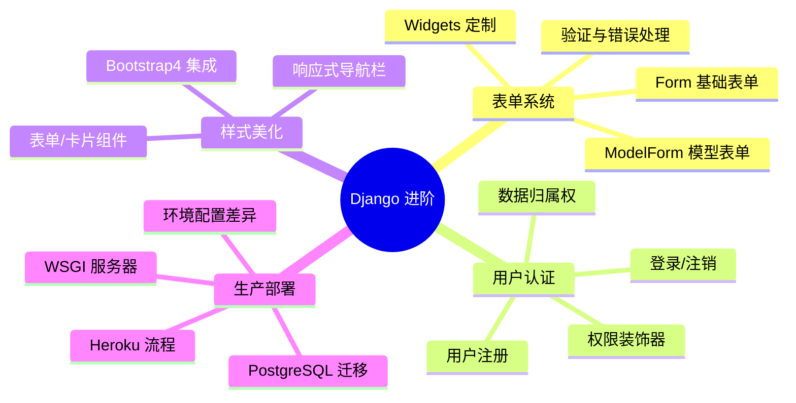
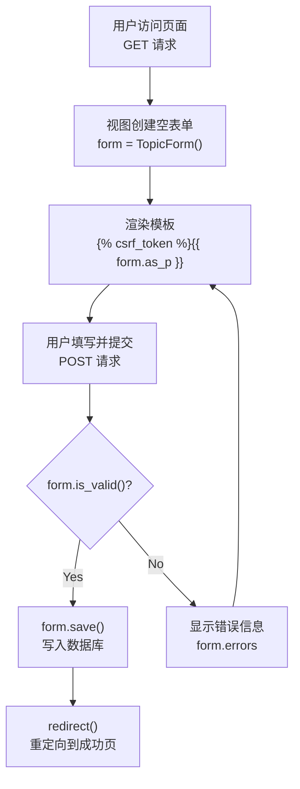
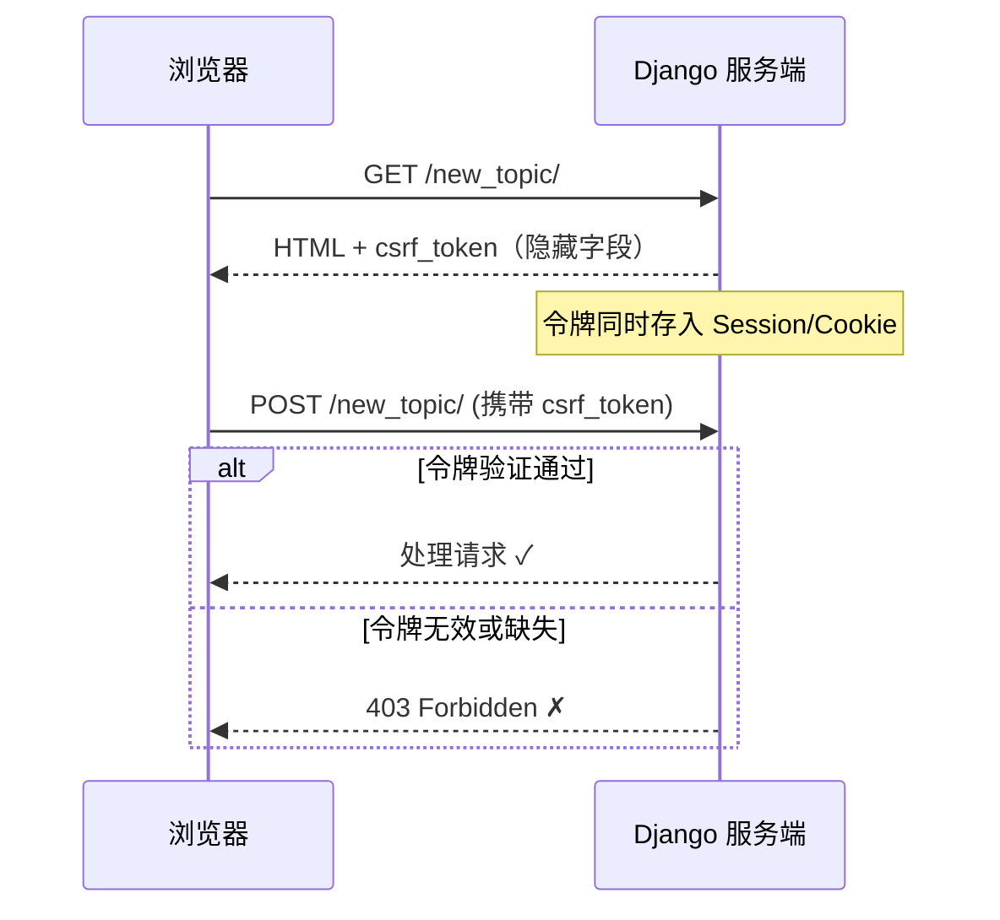
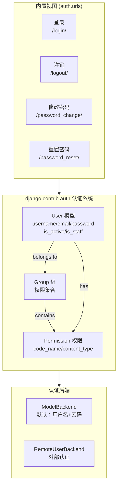
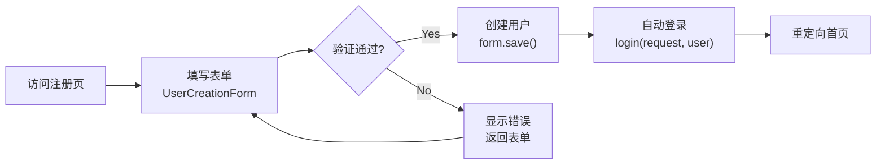
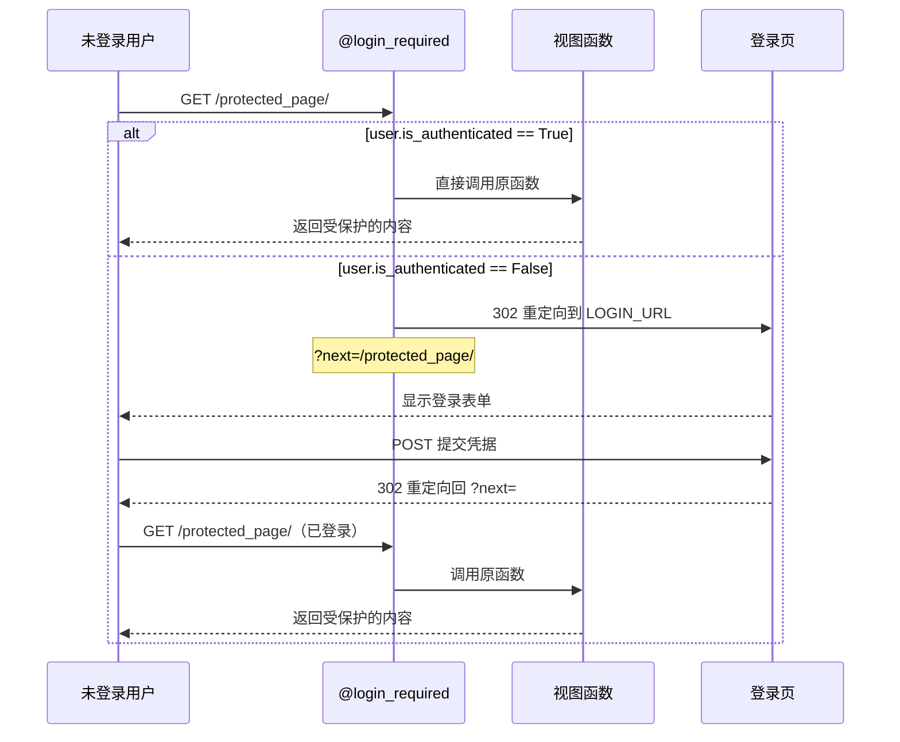
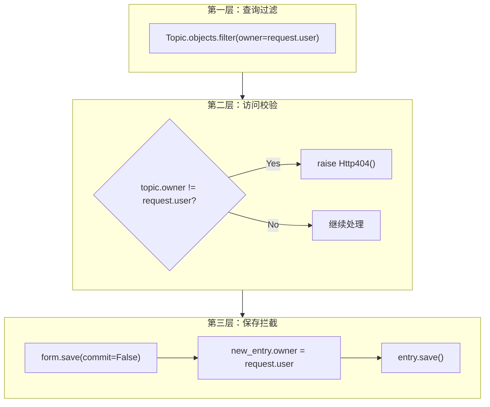
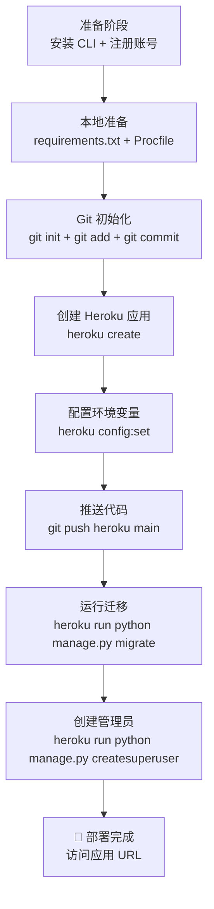
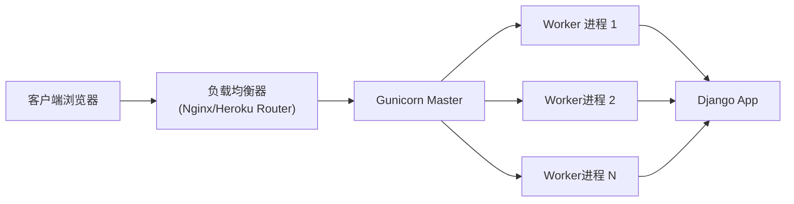

# Django 表单认证与生产部署

在 Django 基础之上，真正的 Web 应用需要解决三个核心问题：**如何安全地收集用户输入**、**如何管理用户身份与权限**、**如何将应用从开发环境推向生产环境**。本文将系统性地讲解 Django 的表单系统（ModelForm）、内置认证框架、Bootstrap4 样式集成，以及 Heroku 云平台部署的完整流程。

> 阅读提示
>
> - 如果你是 Django 初学者，建议先阅读 [Django 量化监控平台](../../05-数据科学/07-量化金融/06-Django量化监控平台) 了解基础架构
> - 本文代码基于 **Django 5.2 LTS / Python 3.10+**（旧版 Django 3.2/Python 3.8 如需对照见文末版本差异小节）
> - 部署部分需要 [Heroku 账户](https://www.heroku.com/)（注：Heroku 已于 2022 年停止免费计划，可用 Render/Railway 等替代平台）

## 开篇概述

### 知识体系全景



### 本文学习路径

| 阶段 | 核心目标 | 关键产出 |
|------|---------|---------|
| 表单深入 | 掌握 ModelForm 完整工作流 | 可复用的表单类、验证逻辑 |
| 认证系统 | 实现注册/登录/注销全流程 | users 应用、权限控制 |
| 样式集成 | Bootstrap4 美化所有页面 | 响应式 UI、统一视觉 |
| 生产部署 | 应用上线 Heroku | 可访问的生产 URL |

---

## 表单系统深入

### Form vs ModelForm 对比

Django 提供两种表单基类，选择取决于你的数据来源：

| 维度 | `forms.Form` | `forms.ModelForm` |
|------|-------------|-------------------|
| **数据来源** | 独立定义字段，不绑定模型 | 自动从 Model 生成字段 |
| **适用场景** | 联系表单、搜索框、非模型数据 | CRUD 操作、用户输入保存到数据库 |
| **手动定义字段** | ✅ 必须全部手动定义 | ❌ 自动生成，可覆盖 |
| **save() 方法** | ❌ 无需（不涉及数据库） | ✅ 可直接保存到数据库 |
| **验证逻辑** | 完全自定义 | 继承 Model 的约束 + 自定义 |
| **典型用例** | 登录表单、反馈表单 | 主题创建、文章编辑 |

::: tip 选择原则
**有数据库交互 → ModelForm**，**纯展示/搜索 → Form**。90% 的业务场景使用 ModelForm 就够了。
:::

### ModelForm 完整工作流



#### 定义 ModelForm

```python
# learning_logs/forms.py
from django import forms
from .models import Topic, Entry


class TopicForm(forms.ModelForm):
    """主题表单 - 绑定 Topic 模型"""
    class Meta:
        model = Topic          # 绑定的模型
        fields = ['text']      # 包含的字段（列表形式）
        labels = {'text': ''}  # 字段标签（空字符串隐藏默认标签）


class EntryForm(forms.ModelForm):
    """条目表单 - 绑定 Entry 模型，含 widgets 定制"""
    class Meta:
        model = Entry
        fields = ['text']
        labels = {'text': ''}
        # 定制 textarea 尺寸：40列宽
        widgets = {
            'text': forms.Textarea(attrs={'cols': 40}),
        }
```

#### 视图中处理 GET 和 POST

```python
# learning_logs/views.py
from django.shortcuts import render, redirect
from .models import Topic, Entry
from .forms import TopicForm, EntryForm


def new_topic(request):
    """添加新主题 - 处理 GET（显示表单）和 POST（验证+保存）"""
    if request.method != 'POST':
        # GET 请求：未提交数据，创建空表单
        form = TopicForm()
    else:
        # POST 请求：对提交的数据进行处理
        form = TopicForm(data=request.POST)
        if form.is_valid():
            # 验证通过：将表单数据写入数据库
            form.save()
            # 重定向到 topics 页面（避免用户刷新重复提交）
            return redirect('learning_logs:topics')

    # 渲染模板（GET 或验证失败时都会执行到这里）
    context = {'form': form}
    return render(request, 'learning_logs/new_topic.html', context)


def new_entry(request, topic_id):
    """在特定主题下添加新条目"""
    topic = Topic.objects.get(id=topic_id)

    if request.method != 'POST':
        form = EntryForm()
    else:
        form = EntryForm(data=request.POST)
        if form.is_valid():
            # 先不提交（commit=False），以便修改额外字段
            new_entry = form.save(commit=False)
            new_entry.topic = topic  # 关联到当前主题
            new_entry.save()         # 现在才真正写入数据库
            return redirect('learning_logs:topic', topic_id=topic_id)

    context = {'topic': topic, 'form': form}
    return render(request, 'learning_logs/new_entry.html', context)
```

#### 模板中渲染表单

```html
<!-- learning_logs/templates/learning_logs/new_topic.html -->




<p><a href="">主题</a></p>

<h1>添加新主题：</h1>

<!-- POST 表单必须包含 csrf_token -->
<form action="" method="post">
    
    {{ form.as_p }}   <!-- as_p: 用 <p> 标签包裹每个字段 -->
    <button name="submit">添加主题</button>
</form>


```

### CSRF 保护机制

::: warning 安全关键点
`` 是 Django 防 **跨站请求伪造（CSRF）** 攻击的核心机制。每次渲染表单时，Django 会向客户端写入一个加密令牌；提交表单时，服务端验证令牌是否匹配。
:::

**CSRF 工作原理**：



| 攻击场景 | 有 CSRF 保护 | 无 CSRF 保护 |
|---------|------------|------------|
| 恶意网站诱导用户点击 | ❌ 令牌不匹配，请求被拒绝 | ✅ 请求正常执行（盗用用户身份） |
| 正常表单提交 | ✅ 令牌匹配，正常处理 | ✅ 正常处理 |
| API 调用（非浏览器） | ⚠️ 需要手动传递令牌或禁用 | ✅ 正常处理 |

### 表单验证与错误处理

Django 的表单验证分为三层：

```python
# 验证层次示例
class TopicForm(forms.ModelForm):
    class Meta:
        model = Topic
        fields = ['text']

    # 第一层：字段级验证（单个字段的规则）
    def clean_text(self):
        text = self.cleaned_data['text']
        if len(text) < 2:
            raise forms.ValidationError('主题名称至少需要 2 个字符')
        if text.lower() == 'admin':
            raise forms.ValidationError('不能使用保留名称')
        return text

    # 第二层：跨字段验证（多个字段之间的逻辑关系）
    def clean(self):
        cleaned_data = super().clean()
        # 可以在这里检查字段间的依赖关系
        return cleaned_data

    # 第三层：Model 校验（unique、max_length 等）
    # 由 Django ORM 自动执行
```

**模板中显示错误信息**：

```html
<form method="post">
    
    
        <div class="form-group has-error">
            {{ field.label_tag }}
            {{ field }}
            <!-- 显示字段级错误 -->
            
                <span class="text-danger">{{ error }}</span>
            
        </div>
    

    <!-- 显示非字段级错误 -->
    
        <div class="alert alert-danger">
            
                {{ error }}
            
        </div>
    

    <button type="submit">提交</button>
</form>
```

### Widgets 高级定制

Widgets 控制 HTML 渲染方式，是连接 Python 与前端桥梁：

```python
from django import forms

class AdvancedEntryForm(forms.ModelForm):
    class Meta:
        model = Entry
        fields = ['text']
        widgets = {
            # Textarea: 多行文本框
            'text': forms.Textarea(
                attrs={
                    'cols': 80,
                    'rows': 10,
                    'class': 'form-control',       # Bootstrap 类
                    'placeholder': '请输入内容...',
                }
            ),
        }

# 其他常用 Widgets 对照表
WIDGET_MAPPING = {
    'CharField': forms.TextInput,           # 单行文本 <input type="text">
    'TextField': forms.Textarea,            # 多行文本 <textarea>
    'BooleanField': forms.CheckboxInput,    # 复选框 <input type="checkbox">
    'DateField': forms.DateInput,           # 日期 <input type="date">
    'EmailField': forms.EmailInput,         # 邮箱 <input type="email">
    'PasswordField': forms.PasswordInput,   # 密码 <input type="password">
    'ChoiceField': forms.Select,            # 下拉选择 <select>
    'MultipleChoiceField': forms.CheckboxSelectMultiple,  # 多选复选框
}
```

---

## 用户认证系统

### Django 内置认证组件架构

Django 的 `django.contrib.auth` 是一个开箱即用的认证系统，包含用户模型、权限组和完整的视图/URL 配置：



### 创建 Users 应用

```bash
# 1. 创建 users 应用
python manage.py startapp users

# 2. 在 settings.py 中注册
INSTALLED_APPS = [
    # ... 其他应用
    'django.contrib.auth',     # 认证系统（通常已默认注册）
    'users',                   # 我们的自定义应用
]
```

**Users 应用目录结构**：

```
users/
├── __init__.py
├── admin.py                  # Admin 后台配置
├── apps.py                   # 应用配置
├── models.py                 # 扩展 User 模型（如需要）
├── urls.py                   # 用户相关 URL 路由
└── views.py                  # 注册视图
templates/
    └── registration/         # 认证相关模板
        ├── logged_out.html   # 注销成功页
        ├── login.html        # 登录页
        └── register.html     # 注册页（自定义）
```

### 登录功能实现

#### 步骤 1：配置项目 URLs

```python
# learning_log/urls.py（项目主路由）
from django.contrib import admin
from django.urls import path, include

urlpatterns = [
    path('admin/', admin.site.urls),
    # 引入 Django 内置的认证 URL（提供 login/logout 等视图）
    path('users/', include('django.contrib.auth.urls')),
    # 引入我们自定义的 users 应用
    path('users/', include('users.urls')),
    # ... 其他应用路由
]
```

#### 步骤 2：设置登录重定向

```python
# learning_log/settings.py

LOGIN_URL = '/users/login/'          # 未登录时重定向到此 URL
LOGIN_REDIRECT_URL = '/'             # 登录后默认跳转首页
LOGOUT_REDIRECT_URL = '/'            # 注销后跳转首页
```

#### 步骤 3：创建登录模板

```html
<!-- templates/registration/login.html -->





<p>您的用户名和密码不匹配，请重试。</p>


<form method="post" action="">
    
    {{ form.as_p }}

    <button name="submit">登录</button>

    <!-- 隐藏字段：告诉 Django 登录后跳转到哪 -->
    <input type="hidden" name="next"
           value="">
</form>


```

::: info 模板查找顺序
Django 按 `DIRS` → 各应用 `templates` 目录的顺序查找模板。认证模板放在 `registration/` 子目录下是 Django 的约定，这样 `include('django.contrib.auth.urls')` 才能找到它们。
:::

### 注销功能实现

Django 内置的注销视图 **要求 POST 请求**（安全考虑），无需编写视图代码：

```html
<!-- templates/registration/logged_out.html -->



<h1>您已注销</h1>
<p>再次登录？<a href="">请点击这里</a></p>

```

**在导航栏中添加注销按钮**：

```html
<!-- base.html 导航栏片段 -->
<nav class="navbar navbar-expand-lg navbar-dark bg-dark">
    <!-- ... 导航栏品牌和其他链接 -->

    <div class="collapse navbar-collapse" id="navbarNav">
        <ul class="navbar-nav ml-auto">
            
                <!-- 已登录状态 -->
                <li class="nav-item">
                    <span class="navbar-text mr-3">
                        你好, {{ user.username }}
                    </span>
                </li>
                <li class="nav-item">
                    <!-- 注销必须使用 POST 方法 -->
                    <form action="" method="post">
                        
                        <button type="submit"
                                class="btn btn-outline-light btn-sm">
                            注销
                        </button>
                    </form>
                </li>
            
                <!-- 未登录状态 -->
                <li class="nav-item">
                    <a class="nav-link" href="">注册</a>
                </li>
                <li class="nav-item">
                    <a class="nav-link" href="">登录</a>
                </li>
            
        </ul>
    </div>
</nav>
```

### 用户注册流程



#### 注册视图

```python
# users/views.py
from django.shortcuts import render, redirect
from django.contrib.auth import login
from django.contrib.auth.forms import UserCreationForm


def register(request):
    """注册新用户"""
    if request.method != 'POST':
        # 显示空的注册表单
        form = UserCreationForm()
    else:
        # 处理填写好的表单
        form = UserCreationForm(data=request.POST)

        if form.is_valid():
            # 创建新用户（自动哈希密码）
            new_user = form.save()

            # 让用户自动登录（提升体验）
            login(request, new_user)

            # 重定向到首页
            return redirect('learning_logs:index')

    # 渲染注册页面
    context = {'form': form}
    return render(request, 'registration/register.html', context)
```

#### 注册 URL 配置

```python
# users/urls.py
from django.urls import path
from . import views

app_name = 'users'
urlpatterns = [
    path('register/', views.register, name='register'),
]
```

#### 注册模板

```html
<!-- templates/registration/register.html -->




<h1>注册</h1>

<p>请填写以下信息完成注册：</p>

<form method="post" action="">
    
    {{ form.as_p }}
    <button name="submit">注册</button>
</form>


```

### @login_required 权限装饰器深入原理

`@login_required` 是保护视图的第一道防线，其内部工作机制：



**基本用法**：

```python
from django.contrib.auth.decorators import login_required

@login_required                       # 装饰器：未登录则跳转
def topic(request, topic_id):
    """显示单个主题及其所有条目"""
    topic = Topic.objects.get(id=topic_id)
    entries = topic.entry_set.order_by('-date_added')
    context = {'topic': topic, 'entries': entries}
    return render(request, 'learning_logs/topic.html', context)


@login_required
def edit_entry(request, entry_id):
    """编辑既有条目"""
    entry = Entry.objects.get(id=entry_id)
    topic = entry.topic

    if request.method != 'POST':
        form = EntryForm(instance=entry)
    else:
        form = EntryForm(instance=entry, data=request.POST)
        if form.is_valid():
            form.save()
            return redirect('learning_logs:topic', topic_id=topic.id)

    context = {'entry': entry, 'topic': topic, 'form': form}
    return render(request, 'learning_logs/edit_entry.html', context)
```

**全面保护策略示例** —— 仅开放首页和注册页，其余全部需要登录：

```python
# learning_logs/views.py

# 不需要登录的页面
def index(request): ...
def topics(request): ...

# 需要登录的页面（全部加上 @login_required）
@login_required
def topic(request, topic_id): ...

@login_required
def new_topic(request): ...

@login_required
def new_entry(request, topic_id): ...

@login_required
def edit_entry(request, entry_id): ...
```

### 权限控制最佳实践矩阵

| 场景 | 推荐方案 | 代码示例 | 适用度 |
|------|---------|---------|--------|
| 页面级保护 | `@login_required` | `@login_required\ndef my_view():` | ⭐⭐⭐⭐⭐ |
| 类视图保护 | `LoginRequiredMixin` | `class MyView(LoginRequiredMixin, View):` | ⭐⭐⭐⭐⭐ |
| 细粒度权限 | `@permission_required` | `@permission_required('app.add_model')` | ⭐⭐⭐⭐ |
| API 接口 | DRF 权限类 | `permission_classes = [IsAuthenticated]` | ⭐⭐⭐⭐⭐ |
| 数据归属 | 手动检查 owner | `if obj.owner != request.user: raise Http404()` | ⭐⭐⭐⭐⭐ |

---

## 数据归属与安全

### ForeignKey 用户关联

当应用支持多用户时，每个数据记录必须关联到特定用户：

```python
# learning_logs/models.py（修改前）
class Topic(models.Model):
    """用户学习的主题"""
    text = models.CharField(max_length=200)
    date_added = models.DateTimeField(auto_now_add=True)

    def __str__(self):
        return self.text


# learning_logs/models.py（修改后 - 添加 owner 字段）
from django.conf import settings  # 推荐：引用 AUTH_USER_MODEL

class Topic(models.Model):
    """用户学习的主题"""
    # ForeignKey：多对一关系，一个用户可以有多个主题
    # on_delete=models.CASCADE：用户删除时，其主题也一并删除
    owner = models.ForeignKey(
        settings.AUTH_USER_MODEL,  # 动态引用用户模型（推荐做法）
        on_delete=models.CASCADE,
    )
    text = models.CharField(max_length=200)
    date_added = models.DateTimeField(auto_now_add=True)

    class Meta:
        verbose_name_plural = 'topics'  # Admin 中显示的复数名称

    def __str__(self):
        return self.text
```

::: tip 为什么用 settings.AUTH_USER_MODEL？
直接引用 `User` 模型会导致循环导入问题，且如果后续替换了自定义用户模型，所有硬编码的地方都需要修改。使用 `settings.AUTH_USER_MODEL` 是 Django 官方推荐的解耦方式。
:::

#### 数据库迁移交互

添加 `owner` 字段后，现有数据库中的 Topic 记录没有 owner 值，Django 会提示你选择默认值：

```bash
$ python manage.py makemigrations

You are trying to add a non-nullable field 'owner' to topic without a default;
we can't do that (the database needs something to populate existing rows).

1) Provide a one-off default now (will be set on all existing rows with a null value for this column)
2) Quit, and let me add a default in models.py

Please select a choice: 1
Please enter the default value now, as valid Python
# 输入: 1  （假设 ID 为 1 的用户是管理员/测试账户）
Migrations for 'learning_logs':
  learning_logs/migrations/0003_topic_owner.py
    - Add field owner to topic
```

### 数据隔离三层防护

在生产环境中，必须确保用户只能访问自己的数据。以下是**纵深防御**的三层防护策略：



**完整实现代码**：

```python
# learning_logs/views.py
from django.shortcuts import render, redirect, get_object_or_404
from django.http import Http404


@login_required
def topics(request):
    """【第一层防护】只查询当前用户的数据"""
    topics = Topic.objects.filter(owner=request.user).order_by('date_added')
    context = {'topics': topics}
    return render(request, 'learning_logs/topics.html', context)


@login_required
def topic(request, topic_id):
    """【第二层防护】验证数据归属权"""
    topic = get_object_or_404(Topic, id=topic_id)

    # 确认当前主题属于当前用户
    if topic.owner != request.user:
        raise Http404  # 返回 404 而非 403（避免信息泄露）

    entries = topic.entry_set.order_by('-date_added')
    context = {'topic': topic, 'entries': entries}
    return render(request, 'learning_logs/topic.html', context)


@login_required
def new_entry(request, topic_id):
    """【第三层防护】强制设置 owner"""
    topic = get_object_or_404(Topic, id=topic_id)

    # 先检查主题是否属于当前用户
    if topic.owner != request.user:
        raise Http404

    if request.method != 'POST':
        form = EntryForm()
    else:
        form = EntryForm(data=request.POST)
        if form.is_valid():
            # commit=False：创建对象但不立即保存
            new_entry = form.save(commit=False)
            new_entry.topic = topic  # 手动关联主题
            new_entry.save()         # 现在保存到数据库
            return redirect('learning_logs:topic', topic_id=topic_id)

    context = {'topic': topic, 'form': form}
    return render(request, 'learning_logs/new_entry.html', context)
```

::: danger 安全警示
- **永远不要只依赖前端隐藏**：URL 中的 ID 可被篡改，必须服务端验证
- **优先返回 404 而非 403**：403 会暴露"该资源存在但不属于你"，404 则完全否认资源存在
- **get_object_or_404 vs .get()**：前者在记录不存在时自动返回 404 页面，避免 try-except 样板代码
:::

---

## 前端样式：Bootstrap4 集成

::: warning 版本说明
Bootstrap 4 已于 2022 年 1 月停止官方支持，新项目建议使用 Bootstrap 5（Django 集成包为 `django-bootstrap5`，标签用法相近）。本文以 4 为例讲解集成方式，做法同样适用于 5。
:::

### django-bootstrap4 安装与配置

```bash
# 安装 Bootstrap4 的 Django 集成包
pip install django-bootstrap4
```

```python
# settings.py
INSTALLED_APPS = [
    # ... 其他应用
    'bootstrap4',  # 注册 bootstrap4 应用
]

# 可选：全局 Bootstrap 配置
BOOTSTRAP4 = {
    'include_jquery': True,        # 是否加载 jQuery
}
```

### 基础模板重构

```html
<!-- learning_logs/templates/learning_logs/base.html -->
  {# 加载 bootstrap4 标签库 #}

<!DOCTYPE html>
<html lang="zh-CN">
<head>
    <meta charset="utf-8">
    <meta name="viewport" content="width=device-width, initial-scale=1, shrink-to-fit=no">
    <title>Learning Log</title>

    {# Bootstrap CSS #}
    

    {# 可选：自定义样式覆盖 #}
    <style>
        .page-header {
            background-color: #eee;
            margin-top: 0;
            padding: 20px 20px 20px 40px;
        }
        .page-header h1, .page-header p {
            margin: 0;
        }
        /* 内容区域留白 */
        #content {
            padding: 20px 40px;
        }
    </style>
</head>
<body>
    <!-- 导航栏 -->
    <nav class="navbar navbar-expand-md navbar-dark bg-dark mb-4">
        <a class="navbar-brand" href="">
            Learning Log
        </a>

        <!-- 响应式折叠按钮（小屏时显示汉堡菜单） -->
        <button class="navbar-toggler" type="button"
                data-toggle="collapse"
                data-target="#navbarCollapse"
                aria-controls="navbarCollapse"
                aria-expanded="false"
                aria-label="Toggle navigation">
            <span class="navbar-toggler-icon"></span>
        </button>

        <!-- 折叠区域 -->
        <div class="collapse navbar-collapse" id="navbarCollapse">
            <ul class="navbar-nav mr-auto">
                <li class="nav-item">
                    <a class="nav-link" href="">
                        主题
                    </a>
                </li>
            </ul>

            <!-- 右侧：根据登录状态显示不同内容 -->
            <ul class="navbar-nav ml-auto">
                
                    <li class="nav-item">
                        <span class="navbar-text">
                            你好, {{ user.username }}
                        </span>
                    </li>
                    <li class="nav-item">
                        <form action=""
                              method="post" class="form-inline">
                            
                            <button type="submit"
                                    class="btn btn-outline-light btn-sm ml-2">
                                注销
                            </button>
                        </form>
                    </li>
                
                    <li class="nav-item">
                        <a class="nav-link" href="">注册</a>
                    </li>
                    <li class="nav-item">
                        <a class="nav-link" href="">登录</a>
                    </li>
                
            </ul>
        </div>
    </nav>

    <!-- 页面头部（可选的大屏区域） -->
    <header class="page-header">
        <div class="container">
            <h1>Learning Log</h1>
            <p></p>
        </div>
    </header>

    <!-- 主内容区 -->
    <main id="content" class="container">
        
    </main>

    {# Bootstrap JS（包含 jQuery 和 Popper.js）#}
    
</body>
</html>
```

### 首页 Jumbotron 大屏设计

```html
<!-- learning_logs/templates/learning_logs/index.html -->


{{ block.super }}
追踪你在学习任何主题上的进展。



<!-- Bootstrap Jumbotron 大屏组件 -->
<div class="jumbotron jumbotron-fluid">
    <div class="container">
        <h2 class="display-4">跟踪你的学习主题！</h2>
        <p class="lead">
            "Learning Log" 让你可以为学习的任何主题创建条目，
            并记录你对它们的了解。
        </p>
        <p>
            <a class="btn btn-lg btn-primary"
               href=""
               role="button">
                立即注册 &raquo;
            </a>
        </p>
    </div>
</div>

<!-- 双栏布局：已注册用户看到不同的引导信息 -->
<div class="row">
    <div class="col">
        <h3>已有账户？</h3>
        <p>请使用你的账户登录，开始记录学习笔记。</p>
        <a class="btn btn-secondary"
           href=""
           role="button">登录 &raquo;</a>
    </div>
    <div class="col">
        <h3>什么是"学习笔记"？</h3>
        <p>"Learning Log" 是一个让你可以为正在学习的
           任何主题做笔记的 Web 应用程序。你可以保存
           感兴趣的主题，并在学习过程中为它们添加日志条目。</p>
    </div>
</div>


```

### 表单与卡片美化

**使用 `` 替代 `{{ form.as_p }}`**：

```html
<!-- 使用 bootstrap_form 标签自动渲染带样式的表单 -->
<form method="post" action="">
    
      {# 自动生成 Bootstrap 样式的表单 #}
    
        <button type="submit" class="btn btn-primary">提交</button>
    
</form>
```

**Card 卡片组件展示列表**：

```html
<!-- learning_logs/templates/learning_logs/topics.html -->


主题



<ul class="list-group">
    
        <!-- Card 卡片样式 -->
        <li class="list-group-item list-group-item-action d-flex justify-content-between align-items-center">
            <a href="">
                {{ topic.text }}
            </a>
            <!-- Badge 徽章：显示条目数量 -->
            <span class="badge badge-primary badge-pill">
                {{ topic.entry_set.count }} 条笔记
            </span>
        </li>
    
        <li class="list-group-item text-muted text-center py-5">
            还没有主题。<a href="">添加一个吧！</a>
        </li>
    
</ul>

<!-- 新增主题按钮 -->
<a href=""
   class="btn btn-primary mt-3">
    添加新主题
</a>


```

### 模板结构优化：双 Block 模式

采用 `header` + `content` 双 block 结构，让子模板更灵活：

| Block 名称 | 用途 | 典型内容 |
|-----------|------|---------|
| `header` | 页面标题 | `<h1>` 或 `<h2>` 标题 |
| `description` | 页面副标题/描述 | `<p>` 说明文字 |
| `content` | 主内容区 | 表单、列表、详情等 |

```html
<!-- 子模板示例 -->


{# 覆盖 header block #}
我的主题

{# 可选：覆盖描述 #}
共 {{ topics|length }} 个主题

{# 必须实现 content block #}

    <!-- 页面主体内容 -->

```

---

## 生产部署

### 开发 vs 生产环境差异对照表

| 维度 | 开发环境 | 生产环境 |
|------|---------|---------|
| **DEBUG** | `True`（详细错误信息） | `False`（仅显示通用 500 页面） |
| **ALLOWED_HOSTS** | `[]`（任意主机） | `['your-app.herokuapp.com']` |
| **数据库** | SQLite（文件型） | PostgreSQL（服务型） |
| **静态文件** | Django 自动服务 | Nginx/CDN/WhiteNoise |
| **WSGI 服务器** | `runserver`（单线程） | Gunicorn/uWSGI（多进程） |
| **密钥管理** | 明文写在 settings.py | 环境变量 `.env` / Heroku Config Vars |
| **HTTPS** | HTTP 即可 | 强制 HTTPS（Heroku 自动提供） |
| **日志级别** | DEBUG | INFO/WARNING |
| **缓存** | 通常关闭 | Redis/Memcached |

### Heroku 部署全流程



#### 步骤 1：安装 Heroku CLI

```bash
# macOS 使用 Homebrew 安装
brew tap heroku/brew && brew install heroku

# 验证安装
heroku --version
# heroku/x.y.z ...

# 登录（会打开浏览器进行 OAuth 认证）
heroku login
```

::: tip 免费层限制
Heroku 免费层（Eco/Basic plan）有以下限制：
- **30 分钟无活动后休眠**：首次访问会有几秒延迟（冷启动）
- **每月有限免费 dyno 小时**：个人项目够用，商业应用需升级
- **数据库**：免费 PostgreSQL 最多 10,000 行记录
- **域名**：提供 `your-app.herokuapp.com` 子域名，不支持自定义 SSL（免费层）
:::

#### 步骤 2：准备依赖文件

```bash
# requirements.txt
# 生成方式：pip freeze > requirements.txt
# 但建议手动整理，去除不必要的包

Django>=5.2,<6.0
psycopg2-binary>=2.8,<3.0        # PostgreSQL 适配器
django-bootstrap4>=22.0,<24.0    # Bootstrap4 集成
gunicorn>=22.0,<24.0             # WSGI 生产服务器
# django-heroku 已停止维护（最后发布 0.3.1），新项目不建议使用，改用手动配置
whitenoise>=6.0,<7.0             # 静态文件服务（替代 Nginx）
```

```bash
# Pipfile（可选，如果你使用 pipenv）
[[source]]
url = "https://pypi.org/simple"
verify_ssl = true
name = "pypi"

[packages]
django = ">=5.2,<6.0"
psycopg2-binary = "*"
gunicorn = "*"
django-bootstrap4 = "*"
whitenoise = "*"

[dev-packages]
pytest = "*"

[requires]
python_version = "3.12"
```

#### 步骤 3：创建 Procfile

Procfile 声明应用的进程类型和启动命令：

```procfile
# Procfile（注意：没有扩展名，首字母大写 P）
web: gunicorn learning_log.wsgi --log-file -
```

**Procfile 格式说明**：

| 进程类型 | 用途 | 示例命令 |
|---------|------|---------|
| `web` | 接收 HTTP 流量的 Web 服务 | `web: gunicorn app.wsgi` |
| `worker` | 后台任务处理器 | `worker: python manage.py worker` |
| `release` | 部署时执行的一次性任务 | `release: python manage.py migrate` |

#### 步骤 4：修改 settings.py

```python
# settings.py（生产环境配置）

import os

# ============================================================
# 基础配置
# ============================================================

# 从环境变量读取 DEBUG，默认为 False（生产安全）
DEBUG = os.environ.get('DEBUG') == 'True'

# 允许的主机（Heroku 会自动设置这个变量）
ALLOWED_HOSTS = [
    'your-app-name.herokuapp.com',
    '.herokuapp.com',
    'localhost',
]

# ============================================================
# 数据库配置
# ============================================================

# 开发环境使用 SQLite
if DEBUG:
    DATABASES = {
        'default': {
            'ENGINE': 'django.db.backends.sqlite3',
            'NAME': os.path.join(BASE_DIR, 'db.sqlite3'),
        }
    }
else:
    # 生产环境使用 PostgreSQL（通过 dj-database-url 解析）
    import dj_database_url
    DATABASES = {
        'default': dj_database_url.config(
            default='postgres://localhost/your_db'
        )
    }

# ============================================================
# 静态文件配置
# ============================================================

STATIC_ROOT = os.path.join(BASE_DIR, 'staticfiles')
STATIC_URL = '/static/'

# 额外的静态文件查找目录
STATICFILES_DIRS = [
    os.path.join(BASE_DIR, 'static'),
]

# 添加 Whitenoise 中间件（必须在 SecurityMiddleware 之后）
MIDDLEWARE = [
    'django.middleware.security.SecurityMiddleware',
    'whitenoise.middleware.WhiteNoiseMiddleware',  # 新增
    # ... 其他中间件
]

# ============================================================
# Heroku 特定配置
# ============================================================

# 使用 django-heroku 自动化配置（注意：该项目已停止维护，仅适用于旧项目）
# import django_heroku
# django_heroku.settings(locals())

# 推荐手动配置：
if not DEBUG:
    # 强制 HTTPS
    SECURE_SSL_REDIRECT = True
    SECURE_PROXY_SSL_HEADER = ('HTTP_X_FORWARDED_PROTO', 'https')

    # Cookie 安全设置
    SESSION_COOKIE_SECURE = True
    CSRF_COOKIE_SECURE = True

    # HSTS（HTTP Strict Transport Security）
    SECURE_HSTS_SECONDS = 31536000  # 1 年
    SECURE_HSTS_INCLUDE_SUBDOMAINS = True
```

#### 步骤 5：wsgi.py 配置

```python
# learning_log/wsgi.py（通常无需修改，确认即可）
import os

from django.core.wsgi import get_wsgi_application

os.environ.setdefault('DJANGO_SETTINGS_MODULE', 'learning_log.settings')

application = get_wsgi_application()
```

#### 步骤 6：Git 初始化与部署

```bash
# 1. 初始化 Git 仓库
git init

# 2. 创建 .gitignore（排除不需要上传的文件）
cat > .gitignore << 'EOF'
__pycache__/
*.py[cod]
*.db
*.sqlite3
.env
.venv/
venv/
node_modules/
staticfiles/
media/
*.egg-info/
dist/
build/
EOF

# 3. 提交代码
git add .
git commit -m "Initial commit: Learning Log with auth and deployment"

# 4. 登录 Heroku（如果还没登录）
heroku login

# 5. 创建 Heroku 应用
heroku create your-learning-log-app
# 输出: https://your-learning-log-app.herokuapp.com/

# 6. 设置环境变量
heroku config:set DEBUG=False
heroku config:set SECRET_KEY='your-production-secret-key-here'

# 7. 推送到 Heroku
git push heroku main

# 8. 运行数据库迁移
heroku run python manage.py migrate

# 9. 创建超级用户（用于 Admin 后台）
heroku run python manage.py createsuperuser

# 10. 打开应用
heroku open
```

### WSGI 服务器 Gunicorn 配置详解

Gunicorn 是 Python 生产环境的标准 WSGI 服务器：



**常用启动参数**：

```bash
# 基本用法
gunicorn project.wsgi

# 推荐的生产配置（各参数含义如下）
gunicorn learning_log.wsgi \
    --bind 0.0.0.0:8000 \
    --workers 3 \
    --worker-class gthread \
    --threads 3 \
    --timeout 30 \
    --keep-alive 2 \
    --error-logfile - \
    --access-logfile - \
    --log-level info

# 参数说明：
#   learning_log.wsgi      WSGI 模块路径
#   --bind                 监听地址和端口
#   --workers              工作进程数（CPU核心数 × 2 + 1）
#   --worker-class         worker 类型（sync/gthread/gevent）
#   --threads              每个 worker 的线程数（gthread 模式）
#   --timeout              超时时间（秒）
#   --keep-alive           keep-alive 时间
#   --error-logfile -      错误日志输出到 stdout
#   --access-logfile -     访问日志输出到 stdout
#   --log-level info       日志级别

# 开发模式可加 --reload（代码变更自动重启，生产环境去掉）：
# gunicorn learning_log.wsgi --reload
```

**Worker 数量计算公式**：

$$ \text{workers} = (\text{CPU\_COUNT} \times 2) + 1 $$

| 服务器规格 | 推荐 Workers | 推荐 Worker Class |
|-----------|-------------|------------------|
| 1 核 / 512MB | 2-3 | sync |
| 2 核 / 2GB | 4-5 | gthread |
| 4 核+ / 4GB+ | 8-9 | gevent |

### PostgreSQL 迁移（从 SQLite 到生产数据库）

```bash
# 1. 从 SQLite 导出数据
python manage.py dumpdata > db_backup.json

# 2. 在 Heroku 上创建 PostgreSQL 数据库
heroku addons:create heroku-postgresql:essential-dev

# 3. 查看数据库 URL
heroku config:get DATABASE_URL

# 4. 运行迁移并导入数据
heroku run python manage.py migrate
heroku run python manage.py loaddata < db_backup.json
```

::: warning 数据迁移注意事项
- SQLite 和 PostgreSQL 的字段类型不完全兼容（尤其是 Date/DateTime 处理）
- 大数据量建议使用 `pg_dump` / `pg_restore` 或专业工具如 `django-db-backup`
- 迁移前务必在本地完整备份
:::

### 静态文件处理

生产环境中 Django 不再服务静态文件，需要专门的中间件或服务器：

**方案一：Whitenoise（推荐 Heroku 使用）**

```python
# settings.py
MIDDLEWARE = [
    'django.middleware.security.SecurityMiddleware',
    'whitenoise.middleware.WhiteNoiseMiddleware',  # 在 Security 之后
    # ...
]

# 收集所有静态文件到一个目录
# 运行: python manage.py collectstatic
```

```bash
# 部署前收集静态文件
python manage.py collectstatic --noinput
# 输出: 63 static files copied to '/app/staticfiles'
```

**方案二：Nginx 反向代理（传统部署）**

```11-Nginx基础概述
# 11-Nginx基础概述.conf 片段
location /static/ {
    alias /var/www/your_app/staticfiles/;
    expires 30d;  # 浏览器缓存 30 天
}

location /media/ {
    alias /var/www/your_app/media/;
    expires 7d;
}
```

### 环境变量管理

::: danger 绝对不要将密钥硬编码
`SECRET_KEY`、数据库密码、API Key 等敏感信息绝不能直接写在代码里并提交到 Git。使用环境变量或专用密钥管理服务。
:::

**方案一：os.environ（简单场景）**

```python
# settings.py
import os

SECRET_KEY = os.environ.get('SECRET_KEY', 'dev-insecure-key')
DEBUG = os.environ.get('DEBUG', 'True').lower() == 'true'

DATABASES = {
    'default': {
        'ENGINE': 'django.db.backends.postgresql',
        'NAME': os.environ.get('DB_NAME', 'db'),
        'USER': os.environ.get('DB_USER', 'user'),
        'PASSWORD': os.environ.get('DB_PASSWORD', ''),
        'HOST': os.environ.get('DB_HOST', 'localhost'),
        'PORT': os.environ.get('DB_PORT', '5432'),
    }
}
```

**方案二：python-decouple / django-environ（推荐）**

```bash
pip install django-environ
```

```python
# settings.py
import environ

# 读取 .env 文件
env = environ.Env(
    DEBUG=(bool, False),  # 类型转换 + 默认值
)

environ.Env.read_env(os.path.join(BASE_DIR, '.env'))

SECRET_KEY = env('SECRET_KEY')
DEBUG = env('DEBUG')
ALLOWED_HOSTS = env.list('ALLOWED_HOSTS', default=[])

# .env 文件（不要提交到 Git！）
# SECRET_KEY=your-super-secret-key-here
# DEBUG=False
# ALLOWED_HOSTS=yourapp.herokuapp.com,.herokuapp.com
```

**Heroku Config Vars 设置**：

```bash
# 命令行设置
heroku config:set SECRET_KEY='production-secret-key-12345'
heroku config:set DEBUG=False
heroku config:set ALLOWED_HOSTS='.herokuapp.com'

# 查看所有配置
heroku config

# 删除配置项
heroku config:unset DEBUG
```

---

## 常见陷阱

| 陷阱类别 | 错误表现 | 根因分析 | 正确做法 |
|---------|---------|---------|---------|
| **CSRF 遗漏** | POST 表单提交报 403 Forbidden | 忘记加 `` | 所有 POST 表单都必须包含该标签 |
| **commit=False 忘记 save** | 数据没有写入数据库 | `form.save(commit=False)` 后忘记调用 `.save()` | 显式调用 `obj.save()` |
| **DEBUG=True 上线** | 泄露详细堆栈、配置信息 | 部署时未切换 `DEBUG=False` | 生产环境始终 `DEBUG=False`，用日志记录错误 |
| **ALLOWED_HOSTS 为空** | 400 Bad Request | 默认值为空列表，不接受任何 Host 头 | 至少添加 `'your-domain.com'` |
| **SQLite 用于生产** | 并发写入锁死、性能差 | 直接将开发数据库用于生产 | 使用 PostgreSQL/MySQL |
| **runserver 用于生产** | 单线程、无安全措施、内存泄漏 | 将开发服务器当作生产服务器 | 使用 Gunicorn + Nginx |
| **密码明文存储** | 数据泄露风险 | 直接保存用户密码字符串 | 使用 Django 的 `make_password()` 或让 `UserCreationForm` 自动处理 |
| **缺少数据归属检查** | 用户 A 能访问/修改用户 B 的数据 | 只用了 `@login_required`，没检查 `owner` | 三层防护：filter + Http404 + commit=False |
| **静态文件 404** | CSS/JS/图片无法加载 | 忘记运行 `collectstatic` 或配置中间件 | 部署前执行 `collectstatic`，配置 Whitenoise/Nginx |
| **迁移冲突** | `makemigrations` 报错 | 多人并行修改 Model 导致 | 使用 `makemigrations --merge` 或协调迁移顺序 |
| **循环导入** | `ImportError` | 在 `models.py` 中直接 `from .views import xxx` | 使用 `get_user_model()` 或 `settings.AUTH_USER_MODEL` |
| **注销用 GET 请求** | CSRF 保护失效 | 写成了 `<a href="">注销</a>` | 必须使用 `<form method="post">` |

::: danger 最严重的 3 个陷阱
1. **DEBUG=True 上线** — 可能泄露源码、配置、密钥等敏感信息
2. **缺少数据归属检查** — 导致越权访问，属于严重安全漏洞
3. **密码明文存储** — 数据库被拖库后用户密码直接暴露
:::

---

## 术语表

| 术语 | 英文 | 定义 |
|------|------|------|
| **ModelForm** | Model Form | Django 表单类，自动从 Model 生成字段，可直接 save() 到数据库 |
| **CSRF** | Cross-Site Request Forgery | 跨站请求伪造攻击，通过伪造用户身份发送恶意请求 |
| **csrf_token** | CSRF Token | Django 生成的防 CSRF 加密令牌，每个表单唯一 |
| **Widget** | Widget | Django 表单字段对应的 HTML 渲染控件（TextInput、Textarea 等） |
| **@login_required** | Login Required Decorator | 视图装饰器，未登录用户将被重定向到登录页 |
| **ForeignKey** | Foreign Key | 外键，建立两个模型之间的多对一关系 |
| **on_delete=CASCADE** | Cascade Delete | 级联删除，关联对象被删除时，依赖它的对象也被删除 |
| **commit=False** | Commit False | ModelForm 保存参数，创建对象实例但不立即写入数据库 |
| **Http404** | HTTP 404 Not Found | Django 异常类，触发 404 页面响应 |
| **get_object_or_404** | Get Object or 404 | 快捷函数，获取对象或抛出 Http404 异常 |
| **WSGI** | Web Server Gateway Interface | Python Web 服务器网关接口规范，连接 Web 服务器与应用框架 |
| **Gunicorn** | Green Unicorn | 高性能 Python WSGI HTTP 服务器 |
| **Procfile** | Process File | Heroku 平台的进程声明文件，定义应用启动命令 |
| **Dyno** | Dyno | Heroku 的轻量 Linux 容器，运行应用的隔离进程 |
| **Static Files** | Static Files | 静态文件（CSS、JavaScript、图片等不动态生成的资源） |
| **Collectstatic** | Collect Static | Django 管理命令，将所有静态文件收集到单一目录供生产服务 |
| **Whitenoise** | WhiteNoise | Python 中间件，让 WSGI 应用直接服务静态文件 |
| **Environment Variables** | Environment Variables | 环境变量，操作系统级别的键值对配置，用于存储敏感信息 |
| **ALLOWED_HOSTS** | Allowed Hosts | Django 设置项，允许哪些 Host 头访问应用 |
| **UserCreationForm** | User Creation Form | Django 内置表单，用于创建新用户（含密码验证） |
| **AUTH_USER_MODEL** | Auth User Model | Django 设置项，指向当前使用的用户模型类 |
| **Bootstrap4** | Bootstrap 4 | 前端 UI 框架第 4 版，提供响应式组件和栅格系统 |
| **Jumbotron** | Jumbotron | Bootstrap 组件，用于突出展示关键内容的轻量级大屏区域 |
| **Navbar** | Navbar | Navigation Bar 缩写，导航栏组件 |
| **Responsive Design** | Responsive Design | 响应式设计，界面自适应不同屏幕尺寸 |
| **PostgreSQL** | PostgreSQL | 开源对象关系型数据库系统，适合生产环境 |
| **SQLite** | SQLite | 轻量级嵌入式数据库，适合开发和原型 |

---

## 延伸阅读

### 站内相关

- [Django 量化监控平台](../../05-数据科学/07-量化金融/06-Django量化监控平台) — Django 基础架构入门（MVC、ORM、Admin）
- [RESTful 与 Socket 交易执行](../../05-数据科学/07-量化金融/05-RESTful与Socket交易执行) — Django REST Framework 进阶

### 外部权威资源

- [Django 官方文档 - Forms](https://docs.djangoproject.com/en/stable/topics/forms/) — 表单系统权威指南
- [Django 官方文档 - Authentication](https://docs.djangoproject.com/en/stable/topics/auth/) — 认证系统完整文档
- [Django 官方文档 - Deployment Checklist](https://docs.djangoproject.com/en/stable/howto/deployment/checklist/) — 生产部署检查清单
- [Heroku Django 部署指南](https://devcenter.heroku.com/articles/django-app-configuration) — Heroku 官方 Django 配置教程
- [Bootstrap 4 文档](https://getbootstrap.com/docs/4.6/getting-started/introduction/) — Bootstrap4 组件参考
- [OWASP Top 10](https://owasp.org/www-project-top-ten/) — Web 安全十大风险（理解为什么需要 CSRF、权限控制）

## 版本差异（Django → 5.2 LTS）

| 特性 | 本文编写时 | 当前（Django 5.2 LTS） |
|------|-----------|------------------------|
| 版本基线 | Django 2.x/3.x | 5.2 为当前 LTS（长期支持到 2028）；要求 Python 3.10+（5.x） |
| 异步支持 | 部分 | 5.x 全面支持异步 ORM（`aget`/`afirst` 等）与 ASGI |
| 时区 | 需配置 | 默认启用 `USE_TZ=True`；`zoneinfo` 取代 pytz |
| 表单/认证 | — | 5.x 强化密码哈希（PBKDF2→scrypt 默认，5.1 起） |
| 生产部署 | Heroku | 推荐 ASGI（Daphne/Uvicorn）+ 白名单；Heroku 已停止免费计划 |
| 数据库 | SQLite/MySQL | 5.x 支持 PostgreSQL 全特性；4.2 起支持 `STORAGES` 配置 |

> 本文讲解的 MVT 架构、Model/View/Template 核心模式在 Django 5.2 中完全成立；升级注意 Python 3.10+、异步 ORM、`USE_TZ` 与部署方式变化。
