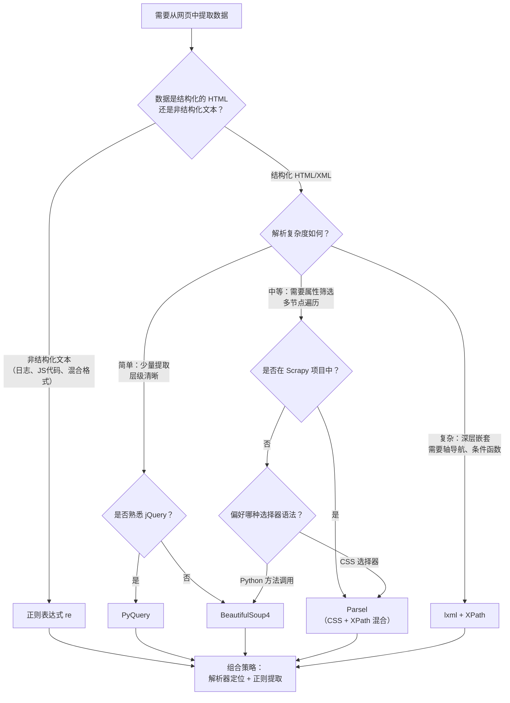
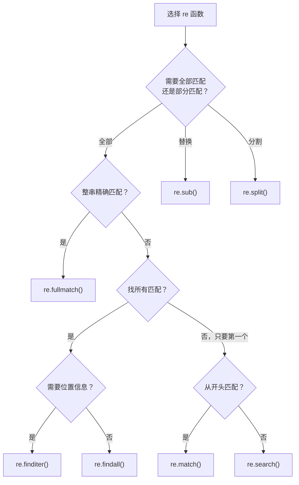

# 数据解析全攻略 — 从正则到 Parsel 的终极指南

## 概述

数据解析是爬虫开发的核心环节。当 `requests` 把网页的 HTML 源码拿到手之后，摆在你面前的是成百上千行的标签和文本。如何从中精确提取出标题、价格、链接、评分？这就是数据解析要解决的问题。

Python 生态提供了丰富的解析工具链：从最底层的正则表达式，到基于 C 语言实现的高性能 lxml，再到 API 友好的 BeautifulSoup、jQuery 风格的 PyQuery，以及 Scrapy 内置的 Parsel。每种工具各有擅长，选对工具能让你事半功倍。

**本文目标**：帮助 1-3 年经验的 Python 开发者建立完整的数据解析知识体系，理解每种工具的定位、优势和适用场景，掌握从简单到复杂的解析策略。

**前置知识**：熟悉 Python 基础语法，了解 HTML 基本结构，使用过 `requests` 库发送 HTTP 请求。

::: info 环境要求
本文所有代码示例基于 **Python 3.10+**，部分特性（如 `re` 模块的原子分组 `(?>...)` 与占有优先量词 `*+`）需要 Python 3.11+。
:::

## 数据解析技术全景

在开始深入每种工具之前，先建立全局视角。下面的决策树将帮助你在面对一个具体的解析任务时，快速选择最合适的工具。



**核心原则**：

- **非结构化文本**用正则 —— 它是唯一能处理混合格式文本的工具
- **简单结构化 HTML** 用 BeautifulSoup 或 PyQuery —— API 友好，上手快
- **复杂导航需求** 用 lxml + XPath —— 轴、函数、谓语组合能力最强
- **Scrapy 项目或需要多语法混用** 用 Parsel —— CSS + XPath + 正则三合一
- **实际项目中往往是组合使用**：先用解析器定位节点，再用正则从节点文本中提取精细信息

## 解析器性能全景对比

在选型时，性能、易用性和容错性是需要权衡的三个核心维度。

| 解析方案 | 速度 | 易用性 | 容错性 | 选择器语法 | 安装成本 | 推荐场景 |
|:---|:---|:---|:---|:---|:---|:---|
| **正则表达式 (re)** | 极快 | 低（语法晦涩） | 无 | 正则语法 | 内置 | 非结构化文本、日志解析 |
| **lxml + XPath** | 很快（C 底层） | 中 | 较好 | XPath 路径 | `pip install lxml` | 高性能爬虫、复杂导航 |
| **BeautifulSoup4 + lxml** | 中等 | 高（最 Pythonic） | 最强 | CSS / find 方法 | `pip install bs4 lxml` | 快速原型、畸形 HTML |
| **PyQuery** | 较快（基于 lxml） | 高（jQuery 风格） | 中等 | CSS 选择器 | `pip install pyquery` | 前端开发者、链式操作 |
| **Parsel** | 较快（基于 lxml） | 高 | 中等 | CSS + XPath + 正则 | `pip install parsel` | Scrapy 项目、混合语法 |

::: tip 选型建议
对于大多数日常爬虫任务，**优先使用 Parsel**。它提供了统一的 CSS + XPath + 正则接口，且与 Scrapy 完全兼容。当需要处理极度不规范的 HTML 时，切换到 BeautifulSoup；当需要极致性能时，直接用 lxml + XPath。
:::

---

## 1. 正则表达式 — 文本匹配的瑞士军刀

正则表达式（Regular Expression）是一种描述字符串模式的微型语言。Python 通过标准库 `re` 模块提供完整实现。在爬虫中，正则主要用于三类场景：

1. **辅助提取**：解析器定位到节点后，用正则从文本中提取结构化字段（日期、价格、ID 等）
2. **非结构化文本**：从 JavaScript 代码、内联脚本、混合格式文本中提取数据
3. **数据清洗**：去除 HTML 标签、空白字符、特殊符号

### 1.1 re 模块核心函数速查

`re` 模块提供了 7 个核心函数，按使用频率排列：

| 函数 | 用途 | 返回值 | 典型场景 |
|:---|:---|:---|:---|
| `re.search()` | 扫描全串，返回第一个匹配 | Match 或 None | 从页面中找第一个目标 |
| `re.findall()` | 返回所有匹配 | 列表 | 提取所有同类数据 |
| `re.sub()` | 替换匹配内容 | 字符串 | 清洗 HTML 标签、格式化 |
| `re.compile()` | 预编译正则 | Pattern 对象 | 同一模式多次复用 |
| `re.match()` | 从开头匹配 | Match 或 None | 行首校验、日志解析 |
| `re.finditer()` | 返回匹配迭代器 | 迭代器 | 大量结果、需要位置信息 |
| `re.fullmatch()` | 整串完全匹配 | Match 或 None | 表单验证、格式校验 |

**选择决策**：



### 1.2 基础语法速查

正则语法由**字符类、量词、锚点、分组**四大构件组成。

#### 字符类

| 模式 | 含义 | 示例 |
|:---|:---|:---|
| `[abc]` | a、b、c 中任一 | `[aeiou]` 匹配元音 |
| `[a-z]` | 小写字母范围 | `[a-zA-Z]` 所有字母 |
| `[^abc]` | 除 a、b、c 外 | `[^0-9]` 非数字 |
| `\d` | 数字 `[0-9]` | 提取数字 |
| `\D` | 非数字 | 去除数字 |
| `\w` | 字母数字下划线 | 匹配标识符 |
| `\W` | 非字母数字下划线 | 匹配标点 |
| `\s` | 空白字符 | 匹配空格/制表/换行 |
| `\S` | 非空白字符 | 匹配可见字符 |
| `.` | 除换行外任意字符 | `re.S` 下也匹配换行 |

#### 量词（贪婪 vs 非贪婪）

| 贪婪 | 非贪婪 | 含义 |
|:---|:---|:---|
| `*` | `*?` | 0 次或多次 |
| `+` | `+?` | 1 次或多次 |
| `?` | `??` | 0 次或 1 次 |
| `{n}` | — | 恰好 n 次 |
| `{n,m}` | `{n,m}?` | n 到 m 次 |

**贪婪与非贪婪的核心区别**：

```python
import re

html = '<div>content</div><p>text</p>'

# 贪婪 .* —— 尽可能多匹配，一整块吞掉
print(re.findall(r'<.*>', html))
# ['<div>content</div><p>text</p>']

# 非贪婪 .*? —— 尽可能少匹配，逐个标签
print(re.findall(r'<.*?>', html))
# ['<div>', '</div>', '<p>', '</p>']
```

::: danger 爬虫中的关键规则
在提取 HTML 中间内容时，**始终使用 `.*?` 非贪婪模式**，否则会跨越多个标签匹配到错误的内容。唯一的例外是匹配到字符串末尾时，应使用 `.*` 确保覆盖全部内容。
:::

#### 锚点与断言

| 符号 | 含义 | 示例 |
|:---|:---|:---|
| `^` | 字符串/行开头 | `^Hello` |
| `$` | 字符串/行结尾 | `world$` |
| `\b` | 单词边界 | `\bPython\b` |
| `\A` / `\Z` | 字符串绝对开头/结尾 | 不受 `re.M` 影响 |
| `(?=...)` | 正向先行断言 | `\w+(?=\d)` 后面是数字的单词 |
| `(?<=...)` | 正向后行断言 | `(?<=\$)\d+` 美元符号后的数字 |

### 1.3 爬虫实战：从 HTML 中提取数据

```python
import re

html = '''
<div id="songs-list">
  <h2 class="title">经典老歌</h2>
  <ul id="list" class="list-group">
    <li data-view="2">一路上有你</li>
    <li data-view="7">
      <a href="/2.mp3" singer="任贤齐">沧海一声笑</a>
    </li>
    <li data-view="4" class="active">
      <a href="/3.mp3" singer="齐秦">往事随风</a>
    </li>
    <li data-view="6"><a href="/4.mp3" singer="beyond">光辉岁月</a></li>
    <li data-view="5"><a href="/5.mp3" singer="陈慧琳">记事本</a></li>
  </ul>
</div>
'''

# 提取所有歌曲的链接、歌手、歌名
# re.S 让 . 匹配换行符，应对 HTML 中的跨行内容
pattern = re.compile(
    r'<li.*?href="(.*?)".*?singer="(.*?)">(.*?)</a>',
    re.S
)
results = pattern.findall(html)
for href, singer, song in results:
    print(f"链接: {href}, 歌手: {singer.strip()}, 歌名: {song.strip()}")
```

### 1.4 关键修饰符

| 修饰符 | 简写 | 作用 | 爬虫场景 |
|:---|:---|:---|:---|
| `re.DOTALL` | `re.S` | `.` 匹配换行符 | **必加**：HTML 含大量换行 |
| `re.IGNORECASE` | `re.I` | 忽略大小写 | 标签大小写不统一时 |
| `re.MULTILINE` | `re.M` | `^` `$` 匹配每行 | 逐行日志解析 |
| `re.VERBOSE` | `re.X` | 允许注释和空白 | 编写复杂可读模式 |

### 1.5 预编译与性能

当同一个正则模式需要多次使用时，`re.compile()` 预编译可以避免重复解析：

```python
import re

# 预编译：只解析一次
pattern = re.compile(r'\d{4}-\d{2}-\d{2}')

# 复用已编译的 Pattern 对象
dates = []
for text in large_text_list:
    match = pattern.search(text)
    if match:
        dates.append(match.group())
```

::: tip
Python `re` 模块内部有缓存机制（默认缓存 512 个 Pattern），对于偶尔使用的正则，直接调用 `re.search()` 等便捷函数即可。`compile()` 主要用于循环内大量复用或需要传入修饰符的场景。
:::

---

## 2. lxml + XPath — 高性能精准定位

lxml 是 Python 中性能最高的 HTML/XML 解析库，底层基于 C 语言库 libxml2 和 libxslt。它的核心武器是 **XPath** —— 一种专为 XML/HTML 文档设计的路径查询语言，内置超过 100 个函数，支持轴导航、条件过滤、字符串处理等高级能力。

### 2.1 快速开始

```python
from lxml import etree

html_text = '''
<div>
    <ul>
         <li class="item-0"><a href="link1.html">first item</a></li>
         <li class="item-1"><a href="link2.html">second item</a></li>
         <li class="item-inactive"><a href="link3.html">third item</a></li>
         <li class="item-1"><a href="link4.html">fourth item</a></li>
         <li class="item-0"><a href="link5.html">fifth item</a></li>
     </ul>
</div>
'''

# etree.HTML() 自动修复不规范 HTML（补全闭合标签等）
html = etree.HTML(html_text)

# 查看修复后的完整结构
print(etree.tostring(html, pretty_print=True).decode('utf-8'))
```

### 2.2 XPath 语法速查

#### 路径表达式

| 表达式 | 描述 | 示例 |
|:---|:---|:---|
| `nodename` | 选取所有该名称的节点 | `div` |
| `/` | 从根节点选取直接子节点 | `/html/body` |
| `//` | 选取所有后代节点（不限深度） | `//p` |
| `.` | 当前节点 | `./a` |
| `..` | 父节点 | `//a/..` |
| `@` | 选取属性 | `//@href` |

#### 谓语（条件过滤）

| 谓语 | 描述 |
|:---|:---|
| `[1]` | 第一个（序号从 1 开始） |
| `[last()]` | 最后一个 |
| `[position()<3]` | 位置小于 3 |
| `[@class='item']` | class 属性等于 item |
| `[contains(@class, 'item')]` | class 属性包含 item |
| `[@class='a' and @id='b']` | 多条件 AND |
| `[position() mod 2 = 0]` | 偶数位置 |

#### 常用函数

| 函数 | 描述 |
|:---|:---|
| `text()` | 获取直接文本节点 |
| `//text()` | 获取所有后代文本节点 |
| `string()` | 拼接所有后代文本为一个字符串 |
| `normalize-space()` | 去除首尾空白，压缩中间空白 |
| `contains()` | 判断是否包含子串 |
| `starts-with()` | 判断是否以某字符串开头 |
| `count()` | 统计节点数量 |

#### 轴（Axes）—— XPath 超越 CSS 选择器的核心能力

| 轴名称 | 描述 | 示例 |
|:---|:---|:---|
| `ancestor` | 所有祖先节点 | `//li[1]/ancestor::*` |
| `parent` | 父节点 | `//li[1]/parent::*` |
| `descendant` | 所有后代节点 | `//ul/descendant::a` |
| `following-sibling` | 之后的所有同级节点 | `//li[1]/following-sibling::li` |
| `preceding-sibling` | 之前的所有同级节点 | `//li[3]/preceding-sibling::li` |
| `following` | 之后的所有节点（不限层级） | `//li[1]/following::*` |
| `preceding` | 之前的所有节点（不限层级） | `//li[3]/preceding::*` |

### 2.3 实战示例

```python
from lxml import etree

html = etree.HTML(html_text)

# 1. 获取所有 li 节点
li_nodes = html.xpath('//li')
print(f"找到 {len(li_nodes)} 个 li 节点")  # 5

# 2. 获取 class 为 "item-1" 的 li 下的 a 标签文本
texts = html.xpath('//li[@class="item-1"]/a/text()')
print(texts)  # ['second item', 'fourth item']

# 3. 获取所有 a 标签的 href 属性
hrefs = html.xpath('//a/@href')
print(hrefs)  # ['link1.html', 'link2.html', ...]

# 4. 获取第一个 li 之后的所有同级 li
following = html.xpath('//li[1]/following-sibling::li')
print(f"后续同级节点数: {len(following)}")  # 4

# 5. 使用 normalize-space 清理空白（函数需作为表达式整体调用）
clean = html.xpath('normalize-space(//li[1]/a)')
print(clean)  # 'first item'

# 6. 安全的 class 多值匹配（避免 contains 误匹配）
safe = html.xpath(
    '//li[contains(concat(" ", normalize-space(@class), " "), " item-0 ")]/a/text()'
)
print(safe)  # ['first item', 'fifth item']
```

### 2.4 三种解析方式对比

| 方法 | 适用场景 | 自动修复 | 根节点要求 |
|:---|:---|:---|:---|
| `etree.HTML(text)` | 爬虫解析网页 | 是（补全标签和结构） | 无 |
| `etree.fromstring(text)` | 严格 XML / API 响应 | 否 | 必须有单一根节点 |
| `etree.parse('file.html')` | 解析本地 HTML 文件 | 需指定 HTMLParser | — |

---

## 3. BeautifulSoup4 — 最 Pythonic 的解析体验

BeautifulSoup4 提供了 Python 生态中最友好的 HTML 解析 API。它的设计哲学是"让简单的事情保持简单"：通过节点选择器、方法选择器和 CSS 选择器三层递进的查询体系，覆盖从入门到进阶的全部需求。

### 3.1 解析器选择

BeautifulSoup 本身不解析 HTML，它依赖底层的解析器。选择合适的解析器直接影响性能和容错能力：

| 解析器 | 用法 | 速度 | 容错 | 推荐度 |
|:---|:---|:---|:---|:---|
| **lxml** | `BeautifulSoup(markup, 'lxml')` | 最快 | 强 | 首选 |
| html.parser | `BeautifulSoup(markup, 'html.parser')` | 中等 | 一般 | 无需额外安装 |
| html5lib | `BeautifulSoup(markup, 'html5lib')` | 最慢 | 最强 | 极度畸形 HTML |

```python
from bs4 import BeautifulSoup

# 推荐组合：BeautifulSoup 的友好 API + lxml 的高性能
soup = BeautifulSoup(html_text, 'lxml')
```

### 3.2 四大核心对象

| 对象 | 说明 | 获取方式 |
|:---|:---|:---|
| **Tag** | HTML 标签节点 | `soup.title`, `soup.find('a')` |
| **NavigableString** | 标签内的文本 | `soup.title.string` |
| **BeautifulSoup** | 整个文档对象 | `soup` 本身 |
| **Comment** | HTML 注释 | `<!-- ... -->`，NavigableString 的子类 |

### 3.3 三层选择器体系

#### 第一层：节点选择器（最快，最简单）

直接通过属性访问标签，适合结构清晰、目标明确的场景：

```python
soup.title          # <title>...</title>
soup.title.string   # 标签内文本
soup.p              # 第一个 <p> 标签
soup.p['class']     # 获取 class 属性
soup.p.attrs        # 所有属性的字典
```

::: danger 注意
节点选择器只返回**第一个**匹配的标签。当页面有多个同名标签时，后续的会被忽略。需要获取全部匹配项时，请使用方法选择器或 CSS 选择器。
:::

#### 第二层：方法选择器（最灵活）

`find_all()` 和 `find()` 是 BeautifulSoup 的主力查询方法：

```python
# 按标签名
soup.find_all('a')

# 按属性
soup.find_all('a', attrs={'id': 'link2'})
soup.find_all('a', id='link2')           # 等价写法
soup.find_all('a', class_='sister')      # class 是 Python 关键字，加下划线

# 按文本（支持正则）
import re
soup.find_all(string=re.compile('link'))

# 限制数量
soup.find_all('a', limit=2)

# find() 只返回第一个匹配
soup.find('a')  # 等价于 soup.find_all('a', limit=1)[0]，但更安全
```

#### 第三层：CSS 选择器（最直观）

对于熟悉前端开发的工程师，`select()` 方法提供了原生的 CSS 选择器体验：

```python
# 标签选择器
soup.select('a')

# 类选择器
soup.select('.sister')

# ID 选择器
soup.select('#link1')

# 后代选择器
soup.select('div.content a')

# 子选择器
soup.select('ul#list-1 > li')

# 属性选择器
soup.select('a[href="https://example.com"]')

# 获取文本
for link in soup.select('a'):
    print(link.get_text(strip=True))
```

### 3.4 节点遍历

BeautifulSoup 提供了丰富的节点遍历能力，可以沿 DOM 树向任意方向移动：

| 方向 | 单数（单个） | 复数（迭代器） |
|:---|:---|:---|
| 向下（子节点） | — | `.children`, `.descendants` |
| 向上（父节点） | `.parent` | `.parents` |
| 横向（兄弟） | `.next_sibling`, `.previous_sibling` | `.next_siblings`, `.previous_siblings` |

### 3.5 string vs get_text()

这是 BeautifulSoup 中最容易混淆的两个方法：

| 特性 | `.string` | `.get_text()` |
|:---|:---|:---|
| 返回内容 | 仅直接文本节点 | 所有子孙节点文本拼接 |
| 嵌套标签 | 若子节点含标签则返回 None | 递归获取所有文本 |
| 空白处理 | 保留原始空白 | `strip=True` 去除首尾空白 |
| 适用场景 | 简单单层文本 | 多层嵌套文本提取 |

```python
html = '<p>Hello <b>World</b></p>'
soup = BeautifulSoup(html, 'lxml')

print(soup.p.string)                          # None（混合内容）
print(soup.p.get_text())                      # 'Hello World'
print(soup.p.get_text(strip=True, separator=' '))  # 'Hello World'
```

---

## 4. PyQuery — jQuery 风格的链式操作

如果你有前端开发经验，PyQuery 会让你感到宾至如归。它提供了与 jQuery 几乎一致的 API，支持 CSS 选择器和链式调用，代码风格简洁流畅。

### 4.1 初始化

```python
from pyquery import PyQuery as pq

# 方式 1：从 HTML 字符串（最常用）
doc = pq(html_text)

# 方式 2：从 URL（自动发起请求）
doc = pq(url='https://www.example.com')

# 方式 3：从本地文件
doc = pq(filename='page.html')
```

### 4.2 核心操作

```python
from pyquery import PyQuery as pq

doc = pq(html_text)

# CSS 选择器
items = doc('.item-0')          # class 选择器
container = doc('#container')   # ID 选择器
links = doc('.list li a')       # 后代选择器

# 链式调用 —— PyQuery 的核心优势
result = doc('.list-group').find('li').filter('.active').find('a')
print(result.text())            # 获取文本
print(result.attr('href'))      # 获取属性

# 遍历
for li in doc('li').items():
    print(li.text(), li.attr('class'))

# 节点操作
doc('li').addClass('highlight')     # 添加 class
doc('li').removeClass('item-0')     # 移除 class
doc('a').attr('href', 'new.html')   # 修改属性
doc('.title').text('New Title')     # 修改文本
```

### 4.3 伪类选择器

PyQuery 支持 jQuery 风格的伪类选择器：

```python
doc('li:first-child')       # 第一个子元素
doc('li:last-child')        # 最后一个子元素
doc('li:nth-child(2)')      # 第 2 个子元素
doc('li:gt(2)')             # 索引大于 2 的元素
doc('li:contains(second)')  # 包含指定文本的元素
```

### 4.4 完整实战

```python
import requests
from pyquery import PyQuery as pq
import re

def scrape_movies():
    """使用 PyQuery 爬取电影数据"""
    url = 'https://static1.scrape.center/'
    response = requests.get(url)
    response.encoding = 'utf-8'
    doc = pq(response.text)

    movies = []
    for item in doc('.el-card').items():
        movie = {
            'name': item.find('a > h2').text(),
            'categories': [
                span.text()
                for span in item.find('.categories button span').items()
            ],
            'score': item.find('p.score').text(),
            'cover': item.find('img').attr('src'),
        }
        # 用正则从文本中提取日期
        info_text = item.find('.info:contains(上映)').text()
        match = re.search(r'(\d{4}-\d{2}-\d{2})', info_text or '')
        movie['published_at'] = match.group(1) if match else None
        movies.append(movie)

    return movies
```

---

## 5. Parsel — Scrapy 内置的三合一解析器

Parsel 是 Scrapy 框架选择器的底层实现，可以独立安装使用。它的最大特点是**同时支持 CSS 选择器、XPath 和正则表达式**，并且支持三者之间的链式调用。

### 5.1 核心 API

```python
from parsel import Selector

selector = Selector(text=html_text)

# CSS 选择器
selector.css('.item-0')              # 选择元素
selector.css('.item-0 *::text')      # 提取文本（::text 伪元素）
selector.css('a::attr(href)')        # 提取属性（::attr 伪元素）

# XPath 选择器
selector.xpath('//li[contains(@class, "item-0")]')
selector.xpath('//li//text()')
selector.xpath('//a/@href')

# 正则提取
selector.css('.item-0').re('link.*')
selector.css('a::attr(href)').re_first(r'link(\d+)\.html')

# 结果提取
result = selector.css('h2::text').get()       # 第一个结果（字符串或 None）
results = selector.css('h2::text').getall()   # 所有结果（列表）
```

### 5.2 链式调用：CSS + XPath + 正则混合

这是 Parsel 最强大的特性 —— 你可以在一次链式调用中混合使用三种语法：

```python
from parsel import Selector

selector = Selector(text=html_text)

# CSS 定位 → XPath 细化 → 正则提取
result = (selector
    .css('.item-0')                 # CSS 选择器定位
    .xpath('.//a/@href')            # XPath 提取属性
    .re_first(r'link(\d+)\.html')   # 正则提取数字
)
print(result)  # '1'

# XPath 定位 → CSS 细化
result = (selector
    .xpath('//ul')                           # XPath 定位
    .css('li.item-0 a::attr(href)')          # CSS 细化
    .getall()
)
```

### 5.3 完整实战

```python
import requests
from parsel import Selector

def scrape_with_parsel(url):
    """使用 Parsel 解析网页 —— CSS + XPath + 正则混合使用"""
    response = requests.get(url)
    response.encoding = 'utf-8'
    selector = Selector(text=response.text)

    movies = []
    for item in selector.css('.el-card'):
        movie = {
            # CSS 方式提取名称
            'name': item.css('a > h2::text').get(),
            # XPath 方式提取类别
            'categories': item.xpath('.//button/span/text()').getall(),
            # CSS + 正则提取日期
            'published_at': item.css('.info::text').re_first(
                r'(\d{4}-\d{2}-\d{2})'
            ),
            # CSS 方式提取评分
            'score': item.css('p.score::text').get(),
            # XPath 方式提取封面
            'cover': item.xpath('.//img/@src').get(),
        }
        movies.append(movie)

    return movies
```

### 5.4 Parsel vs Scrapy Selector

| 对比项 | Parsel | Scrapy Selector |
|:---|:---|:---|
| 独立性 | 独立库，可单独使用 | Scrapy 框架内置 |
| 创建方式 | `Selector(text=html)` | `response.selector` 或 `response.css()` |
| API 方法 | `css()` / `xpath()` / `re()` / `get()` / `getall()` | 完全一致 |
| 适用场景 | 独立脚本、非 Scrapy 项目 | Scrapy 爬虫项目 |

---

## 6. 常见陷阱与解决方案

以下是在实际爬虫开发中最常遇到的解析陷阱：

| 陷阱 | 表现 | 原因 | 解决方案 |
|:---|:---|:---|:---|
| **编码问题** | 中文乱码 | 网页编码与解析编码不一致 | `response.encoding = response.apparent_encoding` |
| **动态内容缺失** | 选择器返回空列表 | 内容由 JavaScript 渲染 | 使用 Selenium/Playwright 或分析 API 接口 |
| **嵌套选择器失效** | 子元素选择器返回空 | 使用了 `//` 而非 `.//` | 遍历时使用 `.//` 从当前节点搜索 |
| **class 多值匹配失败** | `@class="item"` 返回空 | class 有多个值如 `"item active"` | 使用 `contains()` 或空格包围匹配 |
| **贪婪匹配跨标签** | 正则匹配到错误内容 | `.*` 贪婪匹配跨越多标签 | 使用 `.*?` 非贪婪模式 |
| **match() 返回 None** | 明明有匹配却返回 None | `match()` 只从开头匹配 | 改用 `search()` 扫描全串 |
| **findall() 返回元组列表** | 预期字符串列表却得到元组 | 模式中有多个捕获组 | 使用非捕获组 `(?:...)` 或调整提取逻辑 |
| **lxml 解析文件报错** | XMLSyntaxError | 默认 XML 解析器对不规范 HTML 报错 | 使用 `etree.HTMLParser()` 指定 HTML 解析器 |
| **string 返回 None** | 标签内有文本却返回 None | 标签内混合了文本和子标签 | 使用 `get_text()` 替代 `.string` |
| **select() 结果直接调方法报错** | AttributeError | `select()` 返回列表，不能直接调 Tag 方法 | 先取索引 `[0]` 或遍历 |

### 6.1 编码问题详解

```python
import requests
from bs4 import BeautifulSoup

response = requests.get('https://example.com')

# 让 requests 自动检测编码（推荐）
response.encoding = response.apparent_encoding

# 或手动指定（针对已知编码的网站）
# response.encoding = 'gbk'

soup = BeautifulSoup(response.text, 'lxml')
```

### 6.2 动态内容处理策略

| 方案 | 工具 | 适用场景 | 复杂度 |
|:---|:---|:---|:---|
| 分析 API 接口 | 浏览器开发者工具 | 数据通过 AJAX 加载 | 低 |
| 无头浏览器 | Selenium / Playwright | 需要完整 JS 渲染 | 中 |
| 预渲染服务 | requests-HTML | 轻量级 JS 渲染 | 低（注意：该项目已停止维护，新项目建议用 Playwright） |

### 6.3 XPath 中 `//` vs `.//` 的区别

```python
from lxml import etree

html = etree.HTML(html_text)

# 遍历时最容易犯的错误：
for item in html.xpath('//li'):
    # 错误：// 从文档根节点搜索，始终返回文档中所有 a
    all_links = item.xpath('//a/text()')

    # 正确：.// 从当前 item 节点搜索
    my_links = item.xpath('.//a/text()')
```

---

## 7. 最佳实践

### 7.1 解析器选择策略

| 场景 | 推荐方案 | 原因 |
|:---|:---|:---|
| **非结构化文本提取** | 正则表达式 | 唯一可靠方案 |
| **Scrapy 项目** | Parsel（内置） | 无需额外依赖，CSS + XPath 混合 |
| **独立脚本，简单页面** | Parsel | 统一接口，CSS + XPath 随意切换 |
| **独立脚本，复杂导航** | lxml + XPath | 轴导航、函数、谓语能力最强 |
| **快速原型，不规范 HTML** | BeautifulSoup4 + lxml | API 最友好，容错最强 |
| **前端开发者，链式操作** | PyQuery | jQuery 风格，零学习成本 |
| **大规模爬取，性能优先** | lxml + XPath | C 底层实现，速度最快 |

### 7.2 通用最佳实践

1. **优先用 Parsel（统一接口）**：CSS 选择器和 XPath 可以链式混用，一套 API 覆盖所有需求。如果项目可能迁移到 Scrapy，代码几乎不用改。

2. **复杂页面用 XPath**：当需要"获取包含特定文本的元素的父元素的兄弟元素"这类复杂导航时，XPath 的轴（ancestor、following-sibling 等）是唯一优雅的解决方案。

3. **简单页面用 CSS 选择器**：层级关系清晰、只需按 class/id 定位时，CSS 选择器语法更简洁，可读性更好。

4. **先定位容器，再局部搜索**：避免全局 `//` 搜索，缩小 XPath 查询范围可以显著提升性能。

   ```python
   # 不推荐：全局搜索
   all_links = html.xpath('//a')

   # 推荐：先定位容器
   container = html.xpath('//div[@id="content"]')[0]
   links = container.xpath('.//a')
   ```

5. **防御性编程**：XPath 和 CSS 选择器返回列表，取值前必须判断非空。

   ```python
   # 不推荐
   title = html.xpath('//h1/text()')[0]  # IndexError if empty

   # 推荐
   titles = html.xpath('//h1/text()')
   title = titles[0] if titles else ''
   # 或使用 Parsel 的 get() 方法
   title = selector.css('h1::text').get() or ''
   ```

6. **正则作为辅助而非主力**：不要用正则解析完整的 HTML 结构。正确做法是先用解析器定位节点，再用正则从节点文本中提取精细字段。

7. **善用 `normalize-space()` 和 `strip()`**：网页文本经常包含多余的空白和换行，提取后务必清理。

8. **使用 `re.S` 修饰符**：HTML 中大量换行，正则匹配时几乎总是需要 `re.S` 让 `.` 匹配换行符。

### 7.3 组合策略示例

实际项目中，最佳方案往往是组合使用多种工具：

```python
import requests
from lxml import etree
import re

def parse_product_page(url):
    """组合策略：lxml 定位 + 正则提取"""
    response = requests.get(url, headers={'User-Agent': 'Mozilla/5.0'})
    html = etree.HTML(response.text)

    # 1. lxml + XPath 定位到商品卡片
    cards = html.xpath('//div[@class="product-card"]')

    products = []
    for card in cards:
        # 2. XPath 提取结构化字段（normalize-space 作为表达式整体调用）
        name = card.xpath('normalize-space(.//h3/a)')
        name = name if name else ''

        price_text = card.xpath('.//span[@class="price"]/text()')
        price_text = price_text[0] if price_text else ''

        # 3. 正则从价格文本中提取数字
        price_match = re.search(r'[\d.]+', price_text)
        price = float(price_match.group()) if price_match else 0.0

        # 4. 正则从描述文本中提取日期
        desc = card.xpath('string(.//div[@class="desc"])')
        date_match = re.search(r'\d{4}-\d{2}-\d{2}', desc)
        pub_date = date_match.group() if date_match else ''

        products.append({
            'name': name,
            'price': price,
            'pub_date': pub_date,
        })

    return products
```

---

## 8. 术语表

| 术语 | 英文 | 定义 |
|:---|:---|:---|
| 正则表达式 | Regular Expression (regex) | 描述字符串模式的微型语言 |
| XPath | XML Path Language | 在 XML/HTML 中定位节点的路径查询语言 |
| CSS 选择器 | CSS Selector | 使用 CSS 语法定位 HTML 元素的模式 |
| DOM | Document Object Model | 文档对象模型，HTML 的树形结构表示 |
| 解析器 | Parser | 将 HTML/XML 文本转换为结构化对象的程序 |
| 节点 | Node | DOM 树中的基本单元（元素节点、文本节点、属性节点） |
| 轴 | Axis | XPath 中定义节点关系方向的机制 |
| 谓语 | Predicate | XPath 中写在 `[]` 中的筛选条件 |
| 贪婪匹配 | Greedy Matching | 量词默认行为，匹配尽可能多的字符 |
| 非贪婪匹配 | Lazy Matching | 量词后加 `?`，匹配尽可能少的字符 |
| 捕获组 | Capturing Group | 用 `()` 括起来的子模式，匹配内容可被提取 |
| 回溯 | Backtracking | 正则引擎匹配失败时退回上一状态重试的过程 |
| 灾难性回溯 | Catastrophic Backtracking | 嵌套量词导致回溯路径指数级增长 |
| 链式调用 | Method Chaining | 连续调用方法，前一个返回值作为后一个的调用者 |
| 容错性 | Fault Tolerance | 解析器处理不规范 HTML 的能力 |
| 序列化 | Serialization | 将 DOM 树转换回 HTML 字符串 |
| 命名空间 | Namespace | XML 中用 URI 标识的元素命名域 |

---

## 9. 延伸阅读

### 站内链接

- requests 库 — 爬虫请求发送的基础库
- Selenium 自动化 — 处理 JavaScript 动态渲染页面
- 数据存储 — 数据持久化方案

### 外部链接

- [Python re 模块官方文档](https://docs.python.org/zh-cn/3/library/re.html)
- [regex101.com](https://regex101.com/) — 在线正则测试与调试工具（支持 Python 风格）
- [lxml 官方文档](https://lxml.de/index.html)
- [XPath 语法速查表](https://devhints.io/xpath)
- [BeautifulSoup 中文文档](https://www.crummy.com/software/BeautifulSoup/bs4/doc.zh/)
- [CSS 选择器参考 (MDN)](https://developer.mozilla.org/zh-CN/docs/Web/CSS/CSS_Selectors)
- [PyQuery 官方文档](http://pyquery.readthedocs.io/)
- [Parsel 官方文档](https://parsel.readthedocs.io/)
- [Scrapy 官方文档](https://docs.scrapy.org/)
- [Mastering Regular Expressions (O'Reilly)](https://www.oreilly.com/library/view/mastering-regular-expressions/0596528124/) — 正则表达式经典书籍

## 版本差异（爬虫技术栈 → 当前版本）

| 库 | 本文编写时 | 当前稳定版 |
|----|-----------|-----------|
| `requests` | 2.28/2.31 | 2.32.x |
| `Scrapy` | 1.x/2.0 | 2.13.x（API 稳定，截至 2026-09） |
| `httpx` | 0.24 | 0.28.x |
| `Playwright` | 1.3x | 1.6x（Python 版） |
| `lxml`/`BeautifulSoup` | 旧版 | 保持稳定 |
| Python | 3.8-3.12 | 3.14（推荐） |

> 本文讲解的爬虫原理（HTTP、解析、反爬、存储）与核心 API 在最新版本中成立；注意 Python 3.9 及以下已 EOL，新项目使用 3.13/3.14。
