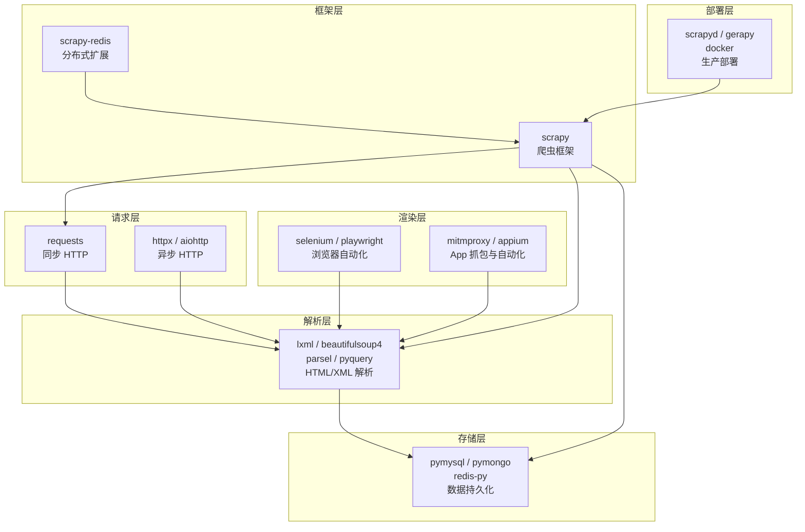

# 爬虫工具链安装

## 概述

一个完整的爬虫项目涉及的第三方库远不止 `pip install requests` 这么简单。从发起 HTTP 请求、解析 HTML、存储数据，到浏览器自动化、App 抓包、框架部署——每一环都有专门的工具。本文以**工具链全景**的视角，将散落在各处的安装指南整合为一篇系统参考，帮助中级开发者一次性配齐爬虫开发环境。

**阅读本文你将获得：**

- 爬虫工具链的六大分类及其关系
- 每类工具的推荐选型、版本号与一行用途说明
- 一条命令批量安装所有核心依赖
- Python 3.10/3.11/3.12 的版本兼容性矩阵
- 虚拟环境隔离的最佳实践
- 常见安装陷阱的排查路径

::: tip 前置知识
本文假定你已具备 Python 基础开发环境（Python 3.10+ 已安装，pip 可用）。如果尚未配置，请先参考站内 [开发环境与工具](/docs/python/基础与入门/02-开发环境与工具) 一文。
:::

## 工具链全景

在深入具体安装命令之前，先用一张图看清爬虫工具链的全貌。六大类别各司其职，组合起来构成完整的爬虫技术栈。



**数据流向**：请求层获取原始内容，渲染层处理动态页面，解析层提取结构化数据，存储层持久化结果。框架层将前三层封装为统一流水线，部署层则负责将框架分发到生产环境。

## 按类别组织的安装清单

以下按六大类别列出所有推荐库，包含截至 2026 年 6 月的稳定版本号和一行用途说明。

### 请求库

| 库名 | 推荐版本 | 用途 |
|------|---------|------|
| `requests` | >= 2.32 | 同步 HTTP 客户端，爬虫首选，API 简洁 |
| `httpx` | >= 0.27 | 新一代 HTTP 客户端，同步/异步双模，支持 HTTP/2 |
| `aiohttp` | >= 3.9 | 纯异步 HTTP 框架，高并发场景利器 |

### 解析库

| 库名 | 推荐版本 | 用途 |
|------|---------|------|
| `lxml` | >= 5.2 | C 语言实现的高性能 HTML/XML 解析器，支持 XPath |
| `beautifulsoup4` | >= 4.12 | 最友好的 HTML 解析库，自动修复破损标签 |
| `parsel` | >= 1.9 | Scrapy 内置解析库，同时支持 XPath 和 CSS 选择器 |
| `pyquery` | >= 2.0 | jQuery 风格选择器，前端开发者友好 |

### 浏览器自动化

| 库名 | 推荐版本 | 用途 |
|------|---------|------|
| `selenium` | >= 4.22 | 浏览器自动化标准方案，Selenium Manager 自动管理驱动 |
| `playwright` | >= 1.44 | 微软出品，内置自动等待和多浏览器支持 |
| `pyppeteer` | >= 2.0 | Puppeteer 的 Python 移植版（非官方） |

### 存储库

| 库名 | 推荐版本 | 用途 |
|------|---------|------|
| `pymysql` | >= 1.1 | 纯 Python 实现的 MySQL 客户端 |
| `pymongo` | >= 4.7 | MongoDB 官方 Python 驱动 |
| `redis` | >= 5.0 | Redis 官方推荐 Python 客户端（redis-py） |

### 爬虫框架

| 库名 | 推荐版本 | 用途 |
|------|---------|------|
| `scrapy` | >= 2.11 | Python 最强大的爬虫框架，基于 Twisted 异步引擎 |
| `pyspider` | 0.3.x | 带 WebUI 的爬虫框架（**已停止维护，不推荐新项目使用**） |

### 部署工具

| 库名 | 推荐版本 | 用途 |
|------|---------|------|
| `scrapyd` | >= 1.4 | Scrapy 远程部署和任务管理服务 |
| `gerapy` | >= 0.9 | Scrapy 分布式管理平台（WebUI） |

### App 抓包与自动化

| 库名 | 推荐版本 | 用途 |
|------|---------|------|
| `mitmproxy` | >= 10.3 | 命令行 HTTPS 代理，支持 Python 脚本实时拦截 |
| `appium-python-client` | >= 4.0 | Appium 的 Python 客户端，驱动移动端自动化 |

## 批量安装脚本

以下命令按类别分组，可直接复制到终端执行。**执行前请先创建并激活虚拟环境。**

```bash
# Python 3.10+ 一键安装爬虫全工具链
pip install \
  requests httpx aiohttp \
  lxml beautifulsoup4 parsel pyquery \
  selenium playwright \
  pymysql pymongo redis \
  scrapy \
  scrapyd gerapy \
  mitmproxy Appium-Python-Client
```

::: warning 注意
`playwright` 安装后还需执行 `playwright install` 下载浏览器二进制文件（约 300MB）。`mitmproxy` 在 Windows 上仅支持 `mitmdump` 和 `mitmweb`，不支持控制台界面。
:::

### 按需精简安装

并非所有项目都需要全工具链。以下提供三种常见场景的精简组合：

```bash
# 场景一：轻量静态爬虫（最常用）
pip install requests lxml beautifulsoup4 pymysql

# 场景二：异步高并发爬虫
pip install httpx aiohttp lxml parsel redis

# 场景三：Scrapy 全栈项目
pip install scrapy scrapy-redis pymongo scrapyd
```

## 版本兼容性说明

Python 爬虫生态对 Python 3.10/3.11/3.12 的支持情况如下：

| 库名 | Python 3.10 | Python 3.11 | Python 3.12 | 备注 |
|------|:-----------:|:-----------:|:-----------:|------|
| `requests` | 支持 | 支持 | 支持 | 全版本兼容 |
| `httpx` | 支持 | 支持 | 支持 | 全版本兼容 |
| `aiohttp` | 支持 | 支持 | 支持 | 3.9+ 完整支持 3.12 |
| `lxml` | 支持 | 支持 | 支持 | 需系统安装 libxml2-dev |
| `beautifulsoup4` | 支持 | 支持 | 支持 | 纯 Python，无兼容问题 |
| `selenium` | 支持 | 支持 | 支持 | 4.22+ 推荐 |
| `playwright` | 支持 | 支持 | 支持 | 全版本兼容 |
| `pymongo` | 支持 | 支持 | 支持 | 4.7+ 推荐 |
| `redis` | 支持 | 支持 | 支持 | 5.0+ 推荐 |
| `scrapy` | 支持 | 支持 | 支持 | 2.11+ 完整支持 3.12 |
| `mitmproxy` | 支持 | 支持 | 支持 | 10.3+ 完整支持 3.12 |
| `pyspider` | 部分支持 | 不推荐 | 不推荐 | 已停止维护，兼容性差 |

::: tip Python 版本选择建议
**推荐使用 Python 3.14**（当前最新稳定版）。截至 2026 年，爬虫主流库已全部完成 3.13/3.14 适配。如果团队中仍有旧项目，Python 3.10 是安全底线——3.9 及以下已停止安全更新。
:::

## 虚拟环境建议

**每个爬虫项目使用独立虚拟环境**，这是避免依赖冲突的铁律。

```bash
# 创建项目专用虚拟环境
python3 -m venv spider-project-env

# 激活（Linux / Mac）
source spider-project-env/bin/activate

# 激活（Windows PowerShell）
.\spider-project-env\Scripts\Activate.ps1

# 在激活的环境中安装依赖
pip install requests lxml beautifulsoup4 pymysql

# 锁定依赖版本
pip freeze > requirements.txt

# 其他开发者复现环境
pip install -r requirements.txt
```

### 多项目环境管理策略

| 策略 | 适用场景 | 工具 |
|------|---------|------|
| `venv` + `requirements.txt` | 单项目独立管理 | Python 内置 |
| `pyenv` + `venv` | 需要多 Python 版本 | pyenv |
| `conda env` | 需要科学计算包（NumPy 等） | Anaconda/Miniconda |
| `pipenv` / `poetry` | 需要锁文件和依赖解析 | 第三方工具 |

::: warning 不要做的事
- 不要在系统 Python 中直接 `sudo pip install`——会污染系统环境
- 不要把所有项目的依赖装进同一个虚拟环境——版本冲突迟早爆发
- 不要用 `pip freeze > requirements.txt` 而不先清理未使用的依赖——会带入大量间接依赖
:::

## 常见陷阱

| 陷阱 | 现象 | 原因 | 解决方案 |
|------|------|------|---------|
| **lxml 编译失败** | `fatal error: libxml/xmlversion.h` | 缺少系统 C 库 | `apt install libxml2-dev libxslt1-dev`（Linux）或 `brew install libxml2`（Mac） |
| **Scrapy 安装报错 twisted** | Windows 下 `pip install scrapy` 失败 | 旧版 pip 无法找到合适的 Twisted 预编译 wheel | 先升级 pip（`python -m pip install -U pip`）再安装；现代 pip 可直接安装 Twisted 预编译 wheel，仍失败则安装 Visual C++ Build Tools |
| **pip 下载速度极慢** | 几 KB/s 的速度 | 默认 PyPI 源在国外 | `pip config set global.index-url https://pypi.tuna.tsinghua.edu.cn/simple` |
| **mitmproxy 证书不被信任** | HTTPS 请求显示 CONNECT 错误 | 未安装 CA 证书 | 启动 `mitmdump` 后安装 `~/.mitmproxy/mitmproxy-ca-cert.pem` |
| **Selenium 版本不匹配** | `This version of ChromeDriver only supports Chrome version XX` | Chrome 浏览器与 ChromeDriver 版本不一致 | 升级 Selenium 到 4.6+，使用内置 Selenium Manager 自动匹配 |
| **playwright 浏览器未安装** | `Executable doesn't exist` | 只装了 Python 包，未装浏览器 | 执行 `playwright install` |
| **pymongo 连接超时** | `ServerSelectionTimeoutError` | MongoDB 服务未启动 | `brew services start mongodb-community`（Mac）或 `systemctl start mongod`（Linux） |
| **redis-py 返回 bytes** | `b'value'` 而非 `'value'` | 默认不解码 | 连接时设置 `decode_responses=True` |

### pip 镜像配置（国内用户必读）

```bash
# 永久配置清华镜像（推荐）
pip config set global.index-url https://pypi.tuna.tsinghua.edu.cn/simple
pip config set global.trusted-host pypi.tuna.tsinghua.edu.cn

# 其他可用镜像源
# 阿里云: https://mirrors.aliyun.com/pypi/simple
# 中科大: https://pypi.mirrors.ustc.edu.cn/simple
# 豆瓣:   https://pypi.doubanio.com/simple
```

## 最佳实践

### 安装顺序原则

1. **先装系统依赖，再装 Python 包**——lxml、Scrapy 等需要 C 编译的库，先确保 `python3-dev`、`libxml2-dev` 等系统包已安装
2. **先建虚拟环境，再装任何包**——避免污染全局环境
3. **先装重型库，再装轻型库**——Scrapy 等框架依赖较多，先装可提前暴露兼容性问题
4. **装完立即验证**——每个类别装完后写一个最小 import 测试

### 验证脚本

将以下脚本保存为 `verify_env.py`，安装完成后运行以验证环境完整性：

```python
"""爬虫工具链环境验证脚本 (Python 3.10+)"""
import sys

def check_import(module_name: str, package_name: str = "") -> bool:
    """尝试导入模块，返回是否成功"""
    try:
        __import__(module_name)
        print(f"  [OK] {package_name or module_name}")
        return True
    except ImportError as e:
        print(f"  [FAIL] {package_name or module_name}: {e}")
        return False

def main() -> None:
    print(f"Python {sys.version}")
    print(f"验证爬虫工具链安装状态...\n")

    results: dict[str, bool] = {}

    # 请求库
    print("--- 请求库 ---")
    results["requests"] = check_import("requests")
    results["httpx"] = check_import("httpx")
    results["aiohttp"] = check_import("aiohttp")

    # 解析库
    print("\n--- 解析库 ---")
    results["lxml"] = check_import("lxml")
    results["bs4"] = check_import("bs4", "beautifulsoup4")
    results["parsel"] = check_import("parsel")
    results["pyquery"] = check_import("pyquery")

    # 自动化
    print("\n--- 自动化 ---")
    results["selenium"] = check_import("selenium")
    results["playwright"] = check_import("playwright")

    # 存储库
    print("\n--- 存储库 ---")
    results["pymysql"] = check_import("pymysql")
    results["pymongo"] = check_import("pymongo")
    results["redis"] = check_import("redis")

    # 框架
    print("\n--- 框架 ---")
    results["scrapy"] = check_import("scrapy")

    # 部署
    print("\n--- 部署 ---")
    results["scrapyd"] = check_import("scrapyd")
    results["gerapy"] = check_import("gerapy")

    # App 抓包
    print("\n--- App 抓包 ---")
    results["mitmproxy"] = check_import("mitmproxy")
    results["appium"] = check_import("appium", "Appium-Python-Client")

    # 汇总
    passed = sum(results.values())
    total = len(results)
    print(f"\n{'='*40}")
    print(f"结果: {passed}/{total} 通过")
    if passed == total:
        print("爬虫工具链安装完整，可以开始开发！")
    else:
        failed = [k for k, v in results.items() if not v]
        print(f"未通过: {', '.join(failed)}")

if __name__ == "__main__":
    main()
```

## 术语表

| 术语 | 英文 | 解释 |
|------|------|------|
| 工具链 | Toolchain | 一组协同工作的开发工具的集合 |
| 爬虫工具链 | Crawler Toolchain | 爬虫开发所需的请求、解析、存储、框架等工具的完整组合 |
| 虚拟环境 | Virtual Environment | 独立的 Python 运行环境，与系统环境隔离 |
| 同步请求 | Synchronous Request | 发送请求后阻塞等待响应的模式 |
| 异步请求 | Asynchronous Request | 发送请求后不阻塞，通过事件循环处理响应的模式 |
| XPath | XML Path Language | 在 XML/HTML 中定位节点的查询语言 |
| CSS 选择器 | CSS Selector | 使用 CSS 语法选取 HTML 元素的模式 |
| 无头模式 | Headless Mode | 浏览器在后台运行，不显示 GUI 窗口 |
| 无头浏览器 | Headless Browser | 不提供图形界面、在后台运行的浏览器，常用于自动化与渲染 |
| WebDriver | WebDriver | W3C 标准的浏览器自动化协议 |
| 代理池 | Proxy Pool | 大量可用代理 IP 的集合，用于轮换 IP 避免封禁 |
| wheel包 | Wheel Package | Python 预编译二进制分发格式（.whl），无需本地编译即可安装 |
| 中间人代理 | Man-in-the-Middle Proxy | 拦截并分析客户端与服务器之间通信的代理工具 |
| Pipeline | Item Pipeline | Scrapy 中处理爬取结果的管道机制 |
| 分布式爬虫 | Distributed Crawler | 多台机器协同爬取的爬虫系统 |
| 容器化 | Containerization | 将应用及其依赖打包为独立容器的技术 |

## 延伸阅读

**站内链接：**

- [爬虫概览](/docs/python/Web与爬虫/爬虫/01-爬虫概览与HTTP基础) — 了解爬虫的整体工作流程与 HTTP 基础
- [数据解析全攻略](/docs/python/Web与爬虫/爬虫/02-数据解析全攻略) — 正则/lxml/BS4 解析实战
- [反爬对抗策略](/docs/python/Web与爬虫/爬虫/04-反爬对抗策略) — 反爬对抗策略实战
- [Cookie 管理与模拟登录](/docs/python/Web与爬虫/爬虫/05-Cookie管理与模拟登录) — Cookie 管理与模拟登录
- [移动端数据采集](/docs/python/Web与爬虫/爬虫/06-移动端数据采集) — App 数据采集实战
- [Scrapy 分布式与生产部署](/docs/python/Web与爬虫/爬虫/08-Scrapy分布式与生产部署) — Scrapy 生产级部署

**外部链接：**

- [Python 官方下载](https://www.python.org/downloads/)
- [PyPI - Python Package Index](https://pypi.org/)
- [Scrapy 官方文档](https://docs.scrapy.org/)
- [Playwright for Python](https://playwright.dev/python/)
- [mitmproxy 官方文档](https://docs.mitmproxy.org/)
- [Docker 官方文档](https://docs.docker.com/)

## 版本差异（爬虫技术栈 → 当前版本）

| 库 | 本文编写时 | 当前稳定版 |
|----|-----------|-----------|
| `requests` | 2.28/2.31 | 2.32.x |
| `Scrapy` | 1.x/2.0 | 2.13.x（API 稳定，截至 2026-09） |
| `httpx` | 0.24 | 0.28.x |
| `Playwright` | 1.3x | 1.6x（Python 版） |
| `lxml`/`BeautifulSoup` | 旧版 | 保持稳定 |
| Python | 3.8-3.12 | 3.14（推荐） |

> 本文讲解的爬虫原理（HTTP、解析、反爬、存储）与核心 API 在最新版本中成立；注意 Python 3.9 及以下已 EOL，新项目使用 3.13/3.14。
