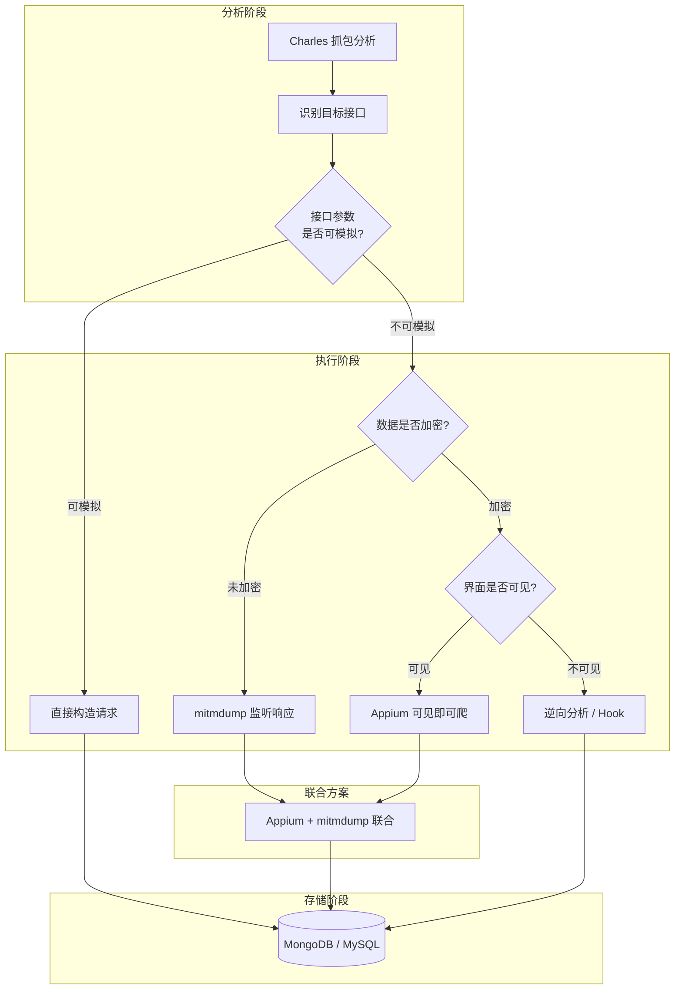
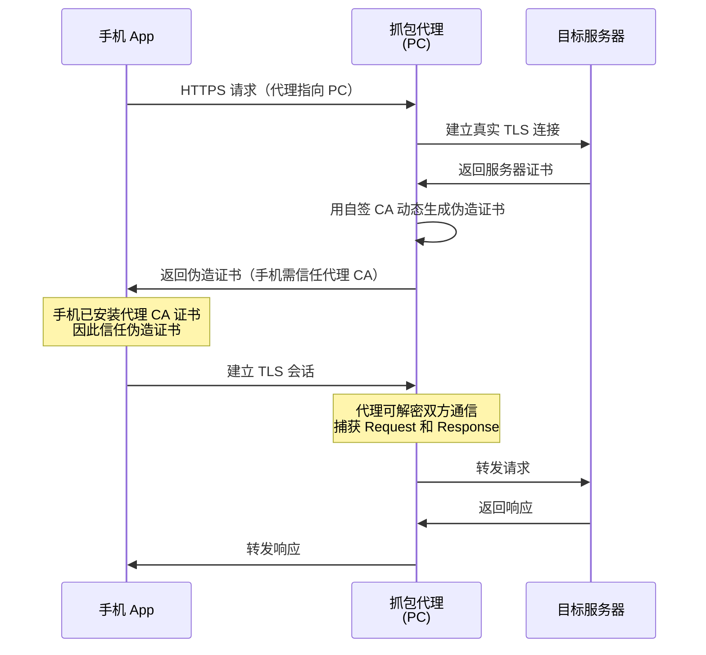
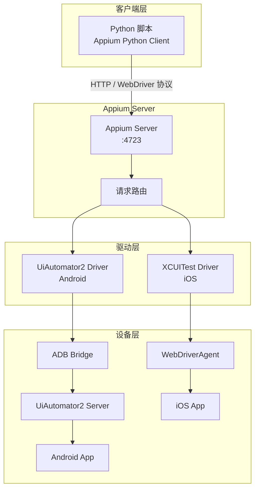
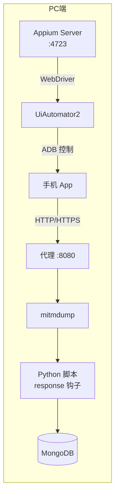

# 移动端数据采集：从抓包到自动化

## 概述

随着移动互联网的深度发展，大量企业将核心数据和服务迁移至 App 端，Web 端信息不完整甚至完全缺失——例如"得到"App 根本没有网页版，京东 App 的接口参数加密远比 Web 端复杂。**移动端数据采集**正是针对这一场景的技术方案，它通过抓包工具捕获 App 的网络流量，或借助自动化框架直接操作 App 界面，完成数据提取。

与 Web 爬虫不同，移动端爬虫面临三个核心挑战：

1. **HTTPS 证书固定（SSL Pinning）**：App 内置证书校验，拒绝非官方 CA 签发的证书，导致中间人代理无法解密流量。
2. **非标准协议与加密参数**：接口参数经过签名（sign）、加密或混淆处理，无法直接模拟请求。
3. **设备指纹与模拟器检测**：App 会检测运行环境（模拟器、Root、Hook 框架），拒绝在非真机环境运行。

本文将从抓包分析到自动化驱动，系统讲解移动端数据采集的完整技术栈。阅读本文需要你已掌握 Python 基础、HTTP 协议和基本的爬虫概念。

### 技术栈全景图



## 抓包工具：Charles vs mitmproxy

抓包是移动端爬虫的第一步。通过在 PC 上运行代理服务器，将手机流量导向 PC，即可捕获 App 的所有网络请求和响应。主流工具有 Charles、Fiddler、mitmproxy 和 Wireshark，其中最常用的是 Charles 和 mitmproxy。

### 工作原理：中间人代理

所有抓包工具的核心原理都是**中间人代理（Man-in-the-Middle Proxy）**。对于 HTTP 流量，代理直接转发即可查看明文；对于 HTTPS 流量，代理需要向客户端出示自己签发的证书，客户端信任该证书后，代理就能解密通信内容。



### 工具对比

| 特性 | Charles | mitmproxy |
|------|---------|-----------|
| **界面** | 原生 GUI，直观 | 终端 TUI + Web UI |
| **价格** | 付费（30 天试用） | 免费开源 |
| **平台** | Windows / macOS / Linux | 全平台 |
| **Python 脚本** | 不支持 | 原生支持（核心优势） |
| **批量处理** | 不方便 | 优秀（mitmdump） |
| **请求修改** | Compose / Rewrite / Breakpoints | Python 脚本灵活修改 |
| **学习曲线** | 低 | 中 |
| **适用场景** | 手动分析接口、快速调试 | 自动化爬取、批量数据处理 |

**选择建议**：如果只是分析 App 接口结构、验证参数规律，Charles 的图形界面最直观；如果需要自动化处理数据、对接 Python 脚本，mitmproxy 是唯一选择。

### Charles 快速上手

Charles 的典型使用流程：

1. **启动 Charles**，确认监听按钮打开（默认端口 8888）。
2. **手机设置代理**：将手机 WiFi 代理指向 PC 的局域网 IP，端口 8888。
3. **安装 CA 证书**：手机浏览器访问 `chls.pro/ssl`，下载并安装证书；iOS 还需在"设置 > 通用 > 关于本机 > 证书信任设置"中启用。
4. **开启 SSL Proxying**：`Proxy > SSL Proxying Settings`，添加 `*:443`。
5. **操作 App**，在 Charles 中观察捕获的请求，通过 Overview、Contents、Form 等选项卡分析请求和响应。

Charles 的实用功能包括：

- **Breakpoints**：拦截请求/响应，手动修改后放行，用于测试参数必要性。
- **Map Local / Map Remote**：将请求映射到本地文件或远程服务器，用于 Mock 数据。
- **Rewrite**：自动修改请求或响应的特定字段。
- **Throttle**：模拟慢速网络，测试弱网环境下的 App 行为。

::: tip 实战技巧
在 Charles 中分析接口时，先清空抓包记录（点击扫帚按钮），再操作 App 触发目标请求，这样可以快速定位目标接口。如果左侧列表中有某个域名在不停闪动，那很可能就是数据接口。
:::

## mitmproxy 实战

mitmproxy 是移动端爬虫的核心武器。它包含三个组件：

- **mitmproxy**：终端交互界面，适合实时查看和手动调试。
- **mitmweb**：Web 可视化界面，在浏览器中操作。
- **mitmdump**：命令行接口，可对接 Python 脚本实现自动化处理——这是爬虫最常用的组件。

### 安装与证书配置

::: code-group

```bash [pip 安装]
pip install mitmproxy
```

```bash [macOS Homebrew]
brew install mitmproxy
```

:::

安装完成后，启动 mitmdump 验证：

```bash
mitmdump --version
```

证书配置步骤：

1. 启动 mitmproxy（`mitmproxy` 或 `mitmdump`），默认监听 **8080** 端口。
2. 手机设置 WiFi 代理为 PC 局域网 IP，端口 8080。
3. 手机浏览器访问 `mitm.it`，下载对应平台的 CA 证书并安装。
4. Android 7.0+ 系统默认不信任用户安装的证书，需要将证书安装为系统证书（需 Root），或使用 VirtualXposed 等工具。

### 拦截与修改请求/响应

mitmdump 通过 **钩子函数（Hook）** 机制与 Python 脚本交互。最核心的两个钩子是 `request()` 和 `response()`。

**修改请求示例**——将所有请求的 User-Agent 替换，并重定向请求：

```python
# 要求 Python 3.10+
from mitmproxy import ctx

def request(flow):
    """请求钩子：每次收到请求时自动调用"""
    # 修改 User-Agent
    flow.request.headers['User-Agent'] = 'MitmProxy/1.0'
    # 打印请求信息
    ctx.log.info(f"[Request] {flow.request.method} {flow.request.url}")
```

**提取响应示例**——打印目标接口的响应数据：

```python
# 要求 Python 3.10+
import json
from mitmproxy import ctx

TARGET_DOMAIN = 'api.example.com'

def response(flow):
    """响应钩子：提取目标接口的数据"""
    if TARGET_DOMAIN not in flow.request.url:
        return
    try:
        data = json.loads(flow.response.text)
        ctx.log.info(f"[Data] {json.dumps(data, ensure_ascii=False, indent=2)}")
    except json.JSONDecodeError:
        ctx.log.warning("[Warning] 响应不是有效的 JSON")
```

运行脚本：

```bash
mitmdump -s script.py
```

### mitmdump 实战：爬取"得到"App 电子书

"得到"App 没有网页版，其电子书列表接口（`https://dedao.igetget.com/v3/discover/bookList`）带有动态 sign 参数，无法直接模拟请求。但 mitmdump 监听的是 App 发出的真实请求，sign 已由 App 自动生成，我们只需处理响应即可。

完整脚本如下：

```python
# 要求 Python 3.10+
"""
mitmdump 爬取"得到"App 电子书信息
用法：mitmdump -s script.py
"""
import json
import pymongo
from mitmproxy import ctx

# 连接 MongoDB
client = pymongo.MongoClient('localhost', 27017)
db = client['igetget']
collection = db['books']
# 创建唯一索引，防止重复插入
collection.create_index([('title', pymongo.ASCENDING)], unique=True)

TARGET_URL = 'https://dedao.igetget.com/v3/discover/bookList'

def response(flow):
    if not flow.request.url.startswith(TARGET_URL):
        return
    try:
        data = json.loads(flow.response.text)
        books = data.get('c', {}).get('list', [])
        for book in books:
            book_data = {
                'title': book.get('operating_title', ''),
                'cover': book.get('cover', ''),
                'summary': book.get('other_share_summary', ''),
                'price': book.get('price', 0),
            }
            ctx.log.info(str(book_data))
            # upsert：存在则更新，不存在则插入（pymongo 4.0+ 用 update_one）
            collection.update_one(
                {'title': book_data['title']},
                {'$set': book_data},
                upsert=True
            )
    except (json.JSONDecodeError, KeyError) as e:
        ctx.log.error(f"解析失败: {e}")
```

启动脚本后，手动在"得到"App 中滑动电子书列表，数据即自动存入 MongoDB。

::: warning 注意
mitmdump 脚本中的 `request()` 和 `response()` 函数名是 mitmproxy 的约定钩子名称，**不能改名**，否则钩子不会被触发。
:::

## Appium 自动化

当 App 的数据经过加密、无法通过抓包直接解析时，就需要用到 **Appium**——一个跨平台的移动端自动化测试框架。它的核心思想是**"可见即可爬"**：只要 App 界面上显示了内容，Appium 就能提取。

### 架构与原理

Appium 采用 C/S 架构，Appium Server 监听 4723 端口，接收客户端（Python 脚本）发来的 WebDriver 协议指令，再通过平台驱动（Android 用 UiAutomator2，iOS 用 XCUITest）操控设备。



### 环境搭建

Appium 的环境搭建相对复杂，需要以下组件：

1. **Node.js**：Appium Server 基于 Node.js 运行。
2. **Appium Server**：`npm install -g appium`，或下载桌面版 Appium Desktop。
3. **Android SDK**：包含 ADB、构建工具等，配置 `ANDROID_HOME` 环境变量。
4. **Python 客户端**：`pip install Appium-Python-Client`。
5. **JDK**：Android SDK 依赖 Java 环境。

验证环境：

```bash
# 检查 Appium 版本
appium --version

# 检查 ADB 连接
adb devices -l
```

### 定位元素与操作

Appium 的 API 继承自 Selenium WebDriver，使用方式与 Selenium 高度一致。元素定位优先级如下：

| 优先级 | 定位方式 | 示例 | 说明 |
|--------|---------|------|------|
| 1 | `By.ID` | `find_element(By.ID, 'com.xx:id/btn')` | 最推荐，速度快且稳定 |
| 2 | `AppiumBy.ACCESSIBILITY_ID` | `find_element(AppiumBy.ACCESSIBILITY_ID, '搜索')` | content-desc 属性 |
| 3 | `By.XPATH` | `find_element(By.XPATH, '//*[@text="登录"]')` | 通用但较慢 |
| 4 | UIAutomator | `find_element(AppiumBy.ANDROID_UIAUTOMATOR, 'new UiSelector().text("登录")')` | Android 专属 |

> 注：旧版 `find_element_by_accessibility_id()`、`find_element_by_android_uiautomator()` 等 `find_element_by_*` 系列方法已随 Selenium 4 与 appium-python-client 3.0 移除，统一使用 `find_element(By/AppiumBy, 选择器)`。

**启动 App 的完整示例**：

```python
# 要求 Python 3.10+
from appium import webdriver
from appium.options.android import UiAutomator2Options
from appium.webdriver.common.appiumby import AppiumBy
from selenium.webdriver.support.ui import WebDriverWait
from selenium.webdriver.support import expected_conditions as EC

# Appium Server 地址
SERVER = 'http://localhost:4723'

# Desired Capabilities 配置
desired_caps = {
    'platformName': 'Android',
    'deviceName': 'MI_NOTE_Pro',            # adb devices 获取
    'appPackage': 'com.tencent.mm',         # 微信包名
    'appActivity': '.ui.LauncherUI',        # 入口 Activity
    'noReset': True,                        # 不重置 App 数据
    # 注：unicodeKeyboard/resetKeyboard 仅旧版 Appium 支持，
    # Appium 2.x + UiAutomator2 已不支持这两个能力，中文输入请直接用 set_text/send_keys
    'unicodeKeyboard': True,                # 支持中文输入（仅 Appium 1.x）
    'resetKeyboard': True,
}

# appium-python-client 3.0+ 移除了 desired_capabilities 参数，须通过 Options 传入
driver = webdriver.Remote(SERVER, options=UiAutomator2Options().load_capabilities(desired_caps))
wait = WebDriverWait(driver, 30)

# 点击登录按钮
login_btn = wait.until(
    EC.presence_of_element_located((AppiumBy.ID, 'com.tencent.mm:id/cjk'))
)
login_btn.click()

# 输入手机号
phone_input = wait.until(
    EC.presence_of_element_located((AppiumBy.ID, 'com.tencent.mm:id/h2'))
)
phone_input.set_text('18888888888')
```

常用操作 API：

| 操作 | 方法 | 说明 |
|------|------|------|
| 点击 | `element.click()` | 点击元素 |
| 输入文本 | `element.set_text('text')` | 向输入框输入文本 |
| 滑动 | `driver.swipe(x1, y1, x2, y2, duration)` | 从 (x1,y1) 滑到 (x2,y2) |
| 快速滑动 | `driver.flick(x1, y1, x2, y2)` | 快速滑动，无持续时间 |
| 拖拽 | `driver.drag_and_drop(el1, el2)` | 将元素 el1 拖到 el2 |
| 获取文本 | `element.get_attribute('text')` | 获取元素的文本内容 |
| 动作链 | `TouchAction(driver).press(el).move_to(x,y).release().perform()` | 组合触摸操作（已废弃，新代码建议用 W3C Actions） |

### Appium 实战：爬取微信朋友圈

微信朋友圈的接口数据经过加密，Charles 和 mitmdump 都无法直接解析。但 Appium 可以绕过加密，直接提取界面上的文字内容。

核心思路：模拟登录 > 进入朋友圈 > 持续上滑 > 提取每条动态的昵称、正文、日期 > 存入 MongoDB。

关键代码片段：

```python
# 要求 Python 3.10+
def crawl(self):
    """持续滑动并提取朋友圈动态"""
    while True:
        # 上滑加载更多
        self.driver.swipe(300, 1000, 300, 300)
        # 获取当前页面所有动态元素
        items = self.wait.until(
            EC.presence_of_all_elements_located(
                (AppiumBy.XPATH,
                 '//*[@resource-id="com.tencent.mm:id/cve"]'
                 '//android.widget.FrameLayout')
            )
        )
        for item in items:
            try:
                nickname = item.find_element(AppiumBy.ID, 'com.tencent.mm:id/aig').get_attribute('text')
                content = item.find_element(AppiumBy.ID, 'com.tencent.mm:id/cwm').get_attribute('text')
                date_str = item.find_element(AppiumBy.ID, 'com.tencent.mm:id/crh').get_attribute('text')
                # 日期转换（"5分钟前" -> "2026-06-05"）
                date = self.processor.date(date_str)
                # 去重存储（pymongo 4.0+ 用 update_one）
                self.collection.update_one(
                    {'nickname': nickname, 'content': content},
                    {'$set': {'nickname': nickname, 'content': content, 'date': date}},
                    upsert=True
                )
            except NoSuchElementException:
                pass  # 部分动态可能缺少字段，跳过
```

## Appium + mitmdump 联合方案

单独使用 Appium 或 mitmdump 各有局限：Appium 提取界面数据速度慢且容易重复，mitmdump 无法自动化操作 App。**联合方案**将两者结合——Appium 负责"动"（自动操作 App），mitmdump 负责"取"（实时提取接口数据），各司其职，是移动端爬虫的最佳实践。

### 联合架构



### 实战：爬取京东商品评论

京东商品评论接口（`api.m.jd.com/client.action`）的 Form 参数包含加密字段，无法直接模拟。联合方案的策略是：

- **Appium**：自动搜索商品 > 进入详情 > 点击评论标签 > 持续滑动加载更多评论。
- **mitmdump**：监听评论接口的响应，解析 JSON 提取评论数据，同时从商品详情接口提取商品信息。

**Appium 自动化脚本**：

```python
# 要求 Python 3.10+
from appium import webdriver
from appium.options.android import UiAutomator2Options
from appium.webdriver.common.appiumby import AppiumBy
from selenium.webdriver.support.ui import WebDriverWait
from selenium.webdriver.support import expected_conditions as EC
from time import sleep

class JDAction:
    def __init__(self):
        desired_caps = {
            'platformName': 'Android',
            'deviceName': 'MI_NOTE_Pro',
            'appPackage': 'com.jingdong.app.mall',
            'appActivity': 'main.MainActivity',
            'noReset': True,
        }
        # appium-python-client 3.0+ 须通过 Options 传入能力字典
        self.driver = webdriver.Remote(
            'http://localhost:4723',
            options=UiAutomator2Options().load_capabilities(desired_caps),
        )
        self.wait = WebDriverWait(self.driver, 60)

    def navigate_to_comments(self, keyword='iPhone'):
        """导航到商品评论页面"""
        # 点击搜索框
        search = self.wait.until(
            EC.presence_of_element_located((AppiumBy.ID, 'com.jingdong.app.mall:id/mp'))
        )
        search.click()
        # 输入关键词
        box = self.wait.until(
            EC.presence_of_element_located((AppiumBy.ID, 'com.jd.lib.search:id/search_box_layout'))
        )
        box.set_text(keyword)
        # 点击搜索
        self.wait.until(
            EC.presence_of_element_located((AppiumBy.ID, 'com.jd.lib.search:id/search_btn'))
        ).click()
        # 进入商品详情
        self.wait.until(
            EC.presence_of_element_located((AppiumBy.ID, 'com.jd.lib.search:id/product_list_item'))
        ).click()
        # 点击评论标签
        self.wait.until(
            EC.presence_of_element_located((AppiumBy.ID, 'com.jd.lib.productdetail:id/pd_tab3'))
        ).click()

    def scroll_forever(self):
        """持续滑动加载评论"""
        while True:
            self.driver.swipe(300, 1000, 300, 300)
            sleep(2)  # 控制滑动频率

    def main(self):
        self.navigate_to_comments()
        self.scroll_forever()

if __name__ == '__main__':
    JDAction().main()
```

**mitmdump 数据处理脚本**：

```python
# 要求 Python 3.10+
"""
Appium + mitmdump 联合爬取京东 - mitmdump 脚本
用法：mitmdump -s jd_script.py
"""
import json
import re
from urllib.parse import unquote
from mitmproxy import ctx
import pymongo

client = pymongo.MongoClient('localhost', 27017)
db = client['jd']
products_col = db['products']
comments_col = db['comments']

def response(flow):
    # ---- 商品详情 ----
    if 'cdnware.m.jd.com' in flow.request.url:
        try:
            data = json.loads(flow.response.text)
            info = data.get('wareInfo', {}).get('basicInfo', {})
            if info:
                product = {
                    'id': info.get('wareId'),
                    'name': info.get('name'),
                    'images': info.get('wareImage'),
                }
                products_col.update_one({'id': product['id']}, {'$set': product}, upsert=True)
                ctx.log.info(f"[商品] {product['id']} - {product['name']}")
        except Exception as e:
            ctx.log.error(f"[商品] 解析失败: {e}")

    # ---- 评论数据 ----
    if 'api.m.jd.com/client.action' in flow.request.url:
        try:
            # 从请求参数中提取商品 ID
            body = unquote(flow.request.text)
            match = re.search(r'sku".*?"(\d+)"', body)
            product_id = match.group(1) if match else None

            data = json.loads(flow.response.text)
            for comment in data.get('commentInfoList', []):
                info = comment.get('commentInfo', {})
                if info.get('commentData'):
                    comment_data = {
                        'product_id': product_id,
                        'nickname': info.get('userNickName', ''),
                        'content': info.get('commentData', ''),
                        'date': info.get('commentDate', ''),
                        'pictures': info.get('pictureInfoList', []),
                    }
                    comments_col.update_one(
                        {'product_id': product_id, 'nickname': comment_data['nickname'],
                         'content': comment_data['content']},
                        {'$set': comment_data},
                        upsert=True
                    )
        except Exception as e:
            ctx.log.error(f"[评论] 解析失败: {e}")
```

**运行步骤**：

1. 先启动 mitmdump：`mitmdump -s jd_script.py`
2. 手机代理设置为 PC_IP:8080
3. 再启动 Appium 脚本：`python jd_appium.py`

两者独立运行，互不干扰——Appium 通过 ADB 控制 App，mitmdump 通过代理监听流量。

## 常见陷阱

| 陷阱 | 现象 | 原因 | 解决方案 |
|------|------|------|----------|
| **证书信任问题** | 抓不到 HTTPS 请求，或 App 无法联网 | 未安装 CA 证书；Android 7.0+ 不信任用户证书 | 安装系统证书（需 Root）；使用 VirtualXposed 等工具 |
| **SSL Pinning** | 代理设置正确但 App 仍无法联网 | App 内置证书校验，拒绝代理的伪造证书 | 使用 Frida/Xposed Hook 绕过；或使用 JustTrustMe 模块 |
| **模拟器被识别** | App 在模拟器上闪退或提示"不支持模拟器" | App 检测了模拟器特征（如 Build 属性、传感器缺失） | 使用真机；或修改模拟器指纹信息 |
| **Appium 元素定位失败** | NoSuchElementException | 元素未加载完成；resource-id 随版本变化 | 使用 WebDriverWait 显式等待；通过 Appium Inspector 重新获取 ID |
| **滑动过快导致数据丢失** | 部分评论/动态未被提取 | 滑动后页面未渲染完成就开始提取 | 在 swipe() 后添加 `sleep(1-2)` 或显式等待新元素出现 |
| **数据重复插入** | MongoDB 中出现大量重复记录 | 每次滑动都提取到相同数据 | 使用 `update_one()` + upsert=True 去重；创建唯一索引 |
| **Appium 长时间运行崩溃** | Session 超时或内存泄漏 | Appium Server 长时间运行不稳定 | 定期重启 Session；添加异常捕获和自动重连机制 |
| **接口频率限制** | 返回 403 或空数据 | 请求频率过高触发反爬 | 控制滑动速度；添加随机延迟 `sleep(random.uniform(1, 3))` |
| **mitmdump 脚本修改后不生效** | 脚本行为未变化 | mitmdump 不会热重载脚本 | 修改脚本后需要重启 mitmdump |
| **中文输入乱码** | set_text() 输入中文显示为乱码 | 默认输入法不支持 Unicode | 添加 `'unicodeKeyboard': True, 'resetKeyboard': True` |

## 最佳实践

### 技术选型决策

| 场景 | 推荐方案 | 理由 |
|------|---------|------|
| 仅需分析 App 接口结构 | Charles | 图形界面直观，上手快 |
| 接口参数未加密，可模拟 | 直接 requests 模拟 | 效率最高 |
| 接口有签名但响应未加密 | mitmdump | 绕过参数构造，直接处理响应 |
| 数据加密，界面可见 | Appium | 可见即可爬 |
| 需要大规模自动化采集 | Appium + mitmdump | 自动化操作 + 高效数据处理 |
| 高强度加密，界面也无法获取 | 逆向分析 + Frida Hook | 最彻底的方案 |

### 代码规范

1. **元素 ID 提取为常量**：App 版本更新时 resource-id 经常变化，集中管理便于维护。
2. **始终使用显式等待**：`WebDriverWait` 代替 `time.sleep()`，避免因网络延迟导致的 NoSuchElementException。
3. **异常处理覆盖所有关键路径**：`try-except` 包裹 JSON 解析、数据库操作、元素查找。
4. **使用 upsert 去重**：MongoDB 的 `update_one()` + `upsert=True` 是移动端爬虫去重的标准做法。
5. **控制操作频率**：滑动间隔建议 1-3 秒，并添加随机抖动，模拟真实用户行为。

### 环境配置建议

- **优先使用真机**：模拟器容易被检测，真机更稳定。
- **Android 7.0+ 证书问题**：使用 `adb root` + 将证书推送到系统证书目录，或使用 Magisk 模块（如 MoveCertificates）。
- **Appium 版本锁定**：Appium 2.x 与 1.x 的驱动管理方式不同，建议锁定版本避免兼容问题。

## 法律风险提示

::: danger 重要
移动端数据采集涉及多项法律法规，务必注意以下红线：
:::

1. **不得爬取个人隐私数据**：根据《个人信息保护法》，未经用户同意收集个人信息（如通讯录、聊天记录、位置信息等）属于违法行为。
2. **遵守用户协议**：绝大多数 App 的用户协议明确禁止自动化数据采集，违反协议可能面临民事索赔。
3. **不得对服务器造成过大压力**：高频请求可能构成《刑法》中的"破坏计算机信息系统罪"。
4. **仅用于学习研究**：本文所有示例仅供技术学习，请勿用于商业用途或大规模数据采集。
5. **微信朋友圈数据**：微信朋友圈属于个人隐私空间，爬取他人朋友圈数据存在法律风险，本文示例仅用于演示 Appium 技术原理。

## 术语表

| 术语 | 英文 | 解释 |
|------|------|------|
| 中间人代理 | Man-in-the-Middle Proxy | 代理服务器作为中间人转发请求和响应，从而捕获数据 |
| CA 证书 | Certificate Authority Certificate | 用于 HTTPS 解密的根证书，需安装到手机上 |
| 证书固定 | SSL Pinning / Certificate Pinning | App 内置证书校验，拒绝非官方证书的中间人代理 |
| mitmdump | — | mitmproxy 的命令行接口，可对接 Python 脚本自动处理流量 |
| 钩子函数 | Hook Function | mitmproxy 自动调用的回调函数，如 `request()`、`response()` |
| Appium | — | 跨平台移动端自动化测试工具，基于 WebDriver 协议 |
| Desired Capabilities | — | Appium 启动 App 时的配置参数字典 |
| ADB | Android Debug Bridge | Android 调试桥，PC 与 Android 设备通信工具 |
| UiAutomator2 | — | Android 原生 UI 自动化框架，Appium 的 Android 驱动 |
| XCUITest | — | iOS 原生 UI 测试框架，Appium 的 iOS 驱动 |
| 可见即可爬 | What You See Is What You Crawl | Appium 的核心思想：界面显示了就能抓取 |
| upsert | Update or Insert | MongoDB 操作：存在则更新，不存在则插入 |
| Frida | — | 动态插桩工具，可在运行时修改 App 行为 |
| 逆向分析 | Reverse Engineering | 通过反编译等手段分析 App 的内部逻辑和加密算法 |
| APK | Android Package | Android 应用安装包文件 |
| WebDriver | — | 浏览器/App 自动化测试协议 |

## 延伸阅读

### 站内链接

- 01-爬虫概览 — 爬虫基础概念与环境配置
- 07-Selenium自动化 — Web 端自动化，Appium 的前置知识
- 数据存储 — MongoDB、MySQL 等数据存储方案

### 外部链接

- [mitmproxy 官方文档](https://docs.mitmproxy.org/)
- [mitmproxy API 参考](https://docs.mitmproxy.org/stable/api/)
- [Appium 官方文档](https://appium.io/)
- [Appium Python Client](https://github.com/appium/python-client)
- [Charles 官网](https://www.charlesproxy.com/)
- [Frida 官方文档](https://frida.re/docs/home/)
- [Android ADB 文档](https://developer.android.com/studio/command-line/adb)

## 版本差异（爬虫技术栈 → 当前版本）

| 库 | 本文编写时 | 当前稳定版 |
|----|-----------|-----------|
| `requests` | 2.28/2.31 | 2.32.x |
| `Scrapy` | 1.x/2.0 | 2.13.x（API 稳定，截至 2026-09） |
| `httpx` | 0.24 | 0.28.x |
| `Playwright` | 1.3x | 1.6x（Python 版） |
| `lxml`/`BeautifulSoup` | 旧版 | 保持稳定 |
| Python | 3.8-3.12 | 3.14（推荐） |

> 本文讲解的爬虫原理（HTTP、解析、反爬、存储）与核心 API 在最新版本中成立；注意 Python 3.9 及以下已 EOL，新项目使用 3.13/3.14。
