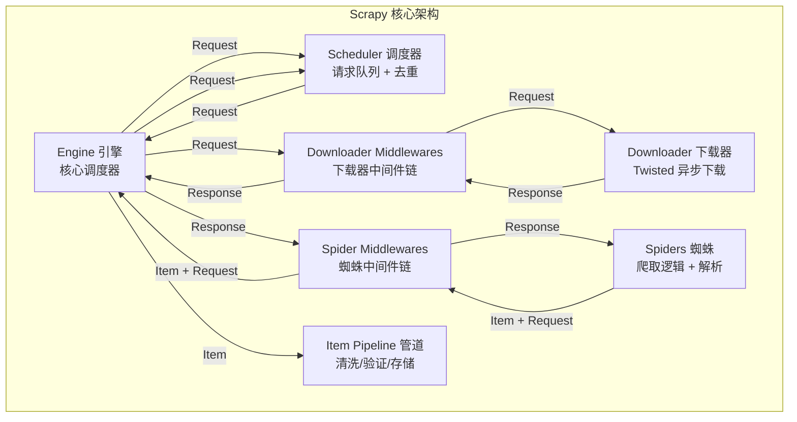
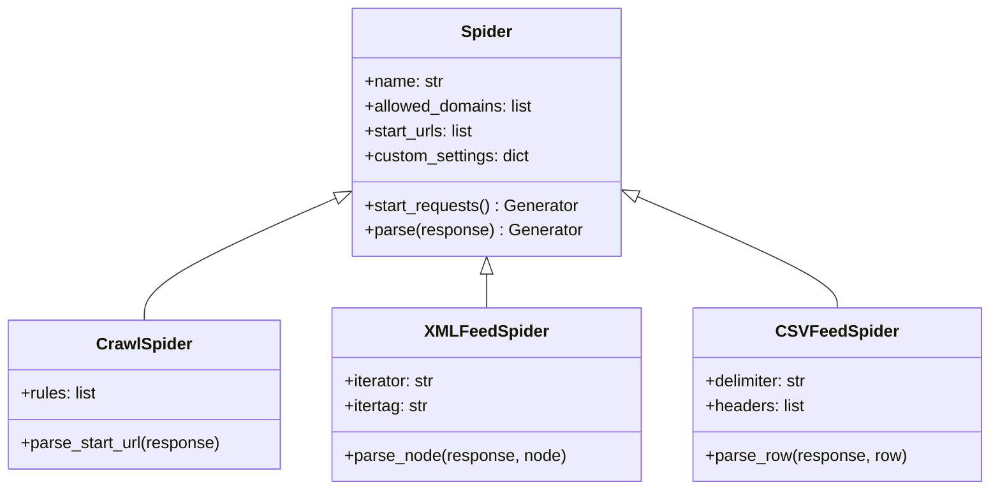
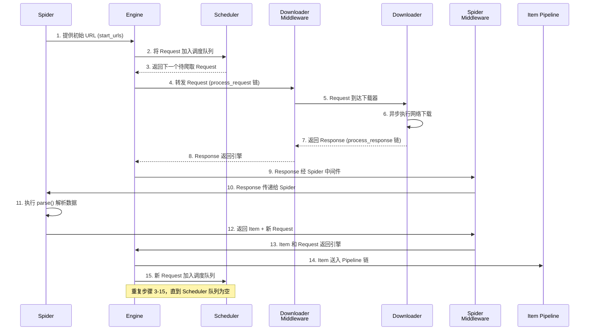
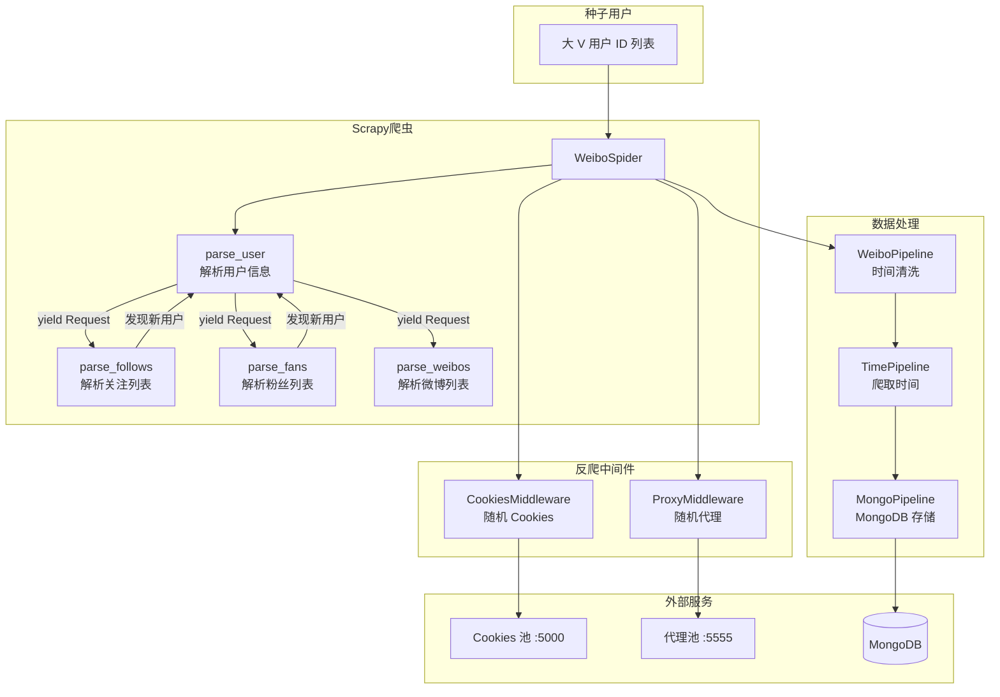

# Scrapy 框架全解

> 从架构原理到生产实战，一次彻底掌握 Scrapy 爬虫框架。

## 概述

Scrapy 是 Python 生态中使用最广泛的爬虫框架，基于 Twisted 异步引擎，采用纯 Python 实现。它的架构清晰、模块解耦、可扩展性极强，几乎可以应对所有反爬网站。本文整合了 Scrapy 从入门到部署的完整知识体系，适合有 1-3 年 Python 开发经验的工程师系统学习。

**阅读完本文，你将掌握：**

- Scrapy 五大核心组件的协作原理与数据流机制
- 从零创建项目、定义 Item、编写 Spider、运行爬虫的完整流程
- XPath/CSS 选择器与正则表达式的组合使用技巧
- Spider 家族（Spider / CrawlSpider / XMLFeedSpider）的选择与使用
- Downloader Middleware 与 Spider Middleware 的自定义开发
- Item Pipeline 的数据清洗、去重与多目标存储
- Selenium / Splash 集成处理动态页面
- Docker 容器化部署与 Scrapyrt HTTP API 调度

::: tip 前置知识
本文假设你已掌握 Python 基础语法与面向对象编程、HTTP 协议基础（请求/响应/状态码）、HTML/CSS 基础。如果你对 XPath 或 Twisted 异步模型还不够熟悉，不用担心——文中会在相关章节补充关键概念。
:::

---

## 1. Scrapy 架构全景

### 1.1 五大核心组件

Scrapy 的架构由以下五个核心组件构成，每个组件职责明确、互不干扰：



**组件职责速查表：**

| 组件 | 英文名 | 职责 | 类比 |
|------|--------|------|------|
| Engine | Engine | 处理整个系统的数据流，触发事务，是框架的核心 | 公司 CEO，统筹全局 |
| Scheduler | Scheduler | 接受引擎发来的请求并加入队列，按优先级调度 + 去重 | 任务调度中心 |
| Downloader | Downloader | 下载网页内容，基于 Twisted 异步执行 | 采购部门 |
| Spider | Spider | 定义爬取逻辑和网页解析规则 | 业务分析师 |
| Item Pipeline | Item Pipeline | 处理 Spider 提取的数据（清洗/验证/存储） | 质检部门 |
| Downloader Middleware | Downloader Middleware | 引擎与下载器之间的钩子，处理请求和响应 | 采购审批流程 |
| Spider Middleware | Spider Middleware | 引擎与 Spider 之间的钩子，处理输出和异常 | 分析前置审核 |

### 1.2 完整的项目目录结构

```text
scrapy.cfg                    # Scrapy 部署时的配置文件
project/                      # 项目的 Python 模块
    __init__.py               # 包初始化文件
    items.py                  # Item 数据结构定义
    pipelines.py              # Item Pipeline 实现
    settings.py               # 全局配置
    middlewares.py             # 中间件实现
    spiders/                  # Spider 实现目录
        __init__.py           # 包初始化文件
        spider1.py            # 具体 Spider 实现
```

各文件功能一览：

| 文件 | 功能 | 何时修改 |
|------|------|---------|
| `scrapy.cfg` | 项目配置文件，定义配置路径和部署信息 | 部署到 Scrapyd 时修改 |
| `items.py` | 定义 Item 数据结构 | 需要定义爬取字段时修改 |
| `pipelines.py` | 定义 Item Pipeline 实现 | 需要数据清洗/存储时修改 |
| `settings.py` | 项目全局配置 | 几乎每次项目都需要修改 |
| `middlewares.py` | 定义 Spider/Downloader Middleware | 需要反爬处理时修改 |
| `spiders/` | 存放各 Spider 实现 | 每个爬虫任务创建新文件 |

### 1.3 settings.py 核心配置速查

```python
# settings.py 核心配置项 (Python 3.10+)
BOT_NAME = 'myproject'

# Spider 模块路径
SPIDER_MODULES = ['myproject.spiders']
NEWSPIDER_MODULE = 'myproject.spiders'

# robots.txt 遵守（调试时可设为 False）
ROBOTSTXT_OBEY = True

# 并发控制
CONCURRENT_REQUESTS = 16          # 最大并发请求数
DOWNLOAD_DELAY = 1.0               # 下载延迟（秒），礼貌爬取的关键设置

# User-Agent
USER_AGENT = 'myproject (+http://www.yourdomain.com)'

# 中间件注册（数字越小优先级越高）
DOWNLOADER_MIDDLEWARES = {
    'myproject.middlewares.SomeDownloaderMiddleware': 543,
}
SPIDER_MIDDLEWARES = {
    'myproject.middlewares.SomeSpiderMiddleware': 543,
}

# Pipeline 注册
ITEM_PIPELINES = {
    'myproject.pipelines.SomePipeline': 300,
}

# HTTP 缓存（开发调试时启用）
HTTPCACHE_ENABLED = True
HTTPCACHE_EXPIRATION_SECS = 86400

# 日志
LOG_LEVEL = 'DEBUG'
```

**配置优先级**（从高到低）：

| 优先级 | 来源 | 适用场景 |
|--------|------|---------|
| 最高 | 命令行参数 `-s` | 临时调试：`scrapy crawl sp -s DOWNLOAD_DELAY=0` |
| 中 | Spider `custom_settings` | 单个 Spider 定制 |
| 低 | 项目 `settings.py` | 全局默认 |

---

## 2. 快速入门：第一个 Scrapy 项目

### 2.1 创建项目

```bash
# 创建项目（Python 3.10+ 环境）
python -m venv scrapy-env
source scrapy-env/bin/activate
pip install scrapy pymongo

# 创建项目
scrapy startproject tutorial
cd tutorial

# 创建 Spider
scrapy genspider quotes quotes.toscrape.com
```

### 2.2 定义 Item

```python
# items.py (Python 3.10+)
import scrapy

class QuoteItem(scrapy.Item):
    """名言 Item —— 数据模型定义"""
    text = scrapy.Field()    # 名言内容
    author = scrapy.Field()  # 作者
    tags = scrapy.Field()    # 标签列表
```

Item 相比普通字典的优势：字段拼写检查、序列化控制、类型提示支持、与 Pipeline 原生集成。

### 2.3 编写 Spider

```python
# spiders/quotes.py (Python 3.10+)
import scrapy
from tutorial.items import QuoteItem

class QuotesSpider(scrapy.Spider):
    """爬取 quotes.toscrape.com 的名言数据"""
    name = "quotes"
    allowed_domains = ["quotes.toscrape.com"]
    start_urls = ['http://quotes.toscrape.com/']

    def parse(self, response):
        """解析页面：提取数据 + 翻页"""
        quotes = response.css('.quote')
        for quote in quotes:
            item = QuoteItem()
            item['text'] = quote.css('.text::text').get()
            item['author'] = quote.css('.author::text').get()
            item['tags'] = quote.css('.tags .tag::text').getall()
            yield item  # 返回 Item 给 Pipeline

        # 翻页：获取下一页链接
        next_page = response.css('.pager .next a::attr(href)').get()
        if next_page:
            url = response.urljoin(next_page)
            yield scrapy.Request(url=url, callback=self.parse)
```

四个核心属性/方法：

| 属性/方法 | 说明 |
|-----------|------|
| `name` | Spider 唯一标识，运行时 `scrapy crawl <name>` 使用 |
| `allowed_domains` | 允许爬取的域名范围，超出范围的请求被自动过滤 |
| `start_urls` | 启动时爬取的 URL 列表，生成初始 Request |
| `parse()` | 默认回调函数，处理 Response 并返回 Item 或新的 Request |

::: warning 关键约定
- 始终使用 `yield` 而非 `return` 逐条返回 Item 和 Request
- 翻页链接必须检查 `if next_page:` 防止 None 构造 URL 报错
- `response.urljoin()` 将相对路径转为绝对 URL
:::

### 2.4 运行与导出

```bash
# 基本运行
scrapy crawl quotes

# 导出为 JSON Lines（推荐：流式写入，内存友好）
scrapy crawl quotes -o quotes.jsonlines

# 导出为 CSV
scrapy crawl quotes -o quotes.csv

# 调试模式
scrapy crawl quotes --loglevel=DEBUG
```

---

## 3. Selector 与数据提取

Scrapy 的 Selector 基于 lxml（C 语言底层实现），同时支持 XPath、CSS 选择器和正则表达式，解析速度极快。

### 3.1 CSS 选择器核心方法

```python
# CSS 选择器速查 (Python 3.10+)
# 提取文本 —— 使用 ::text 伪元素
text = response.css('.title::text').get()          # 第一个文本

# 提取属性 —— 使用 ::attr() 伪元素
href = response.css('a::attr(href)').get()         # 第一个 href

# 提取所有结果
all_texts = response.css('.item::text').getall()    # 所有文本列表

# 默认真值
text = response.css('.optional::text').get(default='默认值')
```

### 3.2 XPath 选择器

```python
# XPath 选择器速查 (Python 3.10+)
# 基本选择
response.xpath('//a')                               # 所有 a 节点
response.xpath('//a/text()')                        # 所有 a 节点的文本
response.xpath('//a/@href')                         # 所有 a 节点的 href 属性

# 条件过滤
response.xpath('//a[@href="image1.html"]/text()')   # 属性精确匹配
response.xpath('//span[contains(@class, "price")]/text()')  # class 包含

# 嵌套选择（注意用 ./ 而非 //）
product.xpath('.//div[contains(@class, "price")]//text()').get()
```

### 3.3 CSS 与 XPath 对比

| 对比维度 | CSS 选择器 | XPath |
|---------|-----------|-------|
| 语法简洁度 | 简洁直观 | 语法较复杂 |
| 文本提取 | `::text` 伪元素 | `/text()` 函数 |
| 属性提取 | `::attr(href)` 伪元素 | `/@href` 语法 |
| 父节点选择 | 不支持 | `..` 或 `parent::` |
| 条件过滤 | 有限（`:nth-child()` 等） | 强大（`[@attr='value']`、`contains`、`and`/`or`） |
| 性能 | 略慢（需转换为 XPath） | 直接执行，最快 |
| 推荐场景 | 简单结构、前端开发者 | 复杂结构、需要精确控制 |

### 3.4 正则表达式辅助匹配

```python
# 对选择结果进行正则二次过滤 (Python 3.10+)
# 提取单个分组
response.xpath('//a/text()').re(r'Name:\s(.*)')
# ['My image 1 ', 'My image 2 ', ...]

# 提取第一个匹配
response.xpath('//a/text()').re_first(r'Name:\s(.*)')
# 'My image 1 '

# 对全文正则匹配
response.xpath('.').re(r'Name:\s(.*)<br>')
```

### 3.5 选择器方法对比

| 方法 | 返回类型 | 无匹配时 | Scrapy 2.x 别名 | 推荐度 |
|------|---------|---------|----------------|--------|
| `extract()` | list | `[]` | `getall()` | 多个结果 |
| `extract_first()` | str/None | None | `get()` | **推荐** |
| `extract_first('default')` | str | 'default' | `get(default='default')` | 需要默认值时 |

::: tip 最佳实践
新项目推荐使用 `get()` / `getall()`，语义更清晰。`extract()` / `extract_first()` 是历史 API，仍可使用但不够简洁。
:::

### 3.6 混合嵌套选择

CSS 和 XPath 可以自由组合链式调用：

```python
# XPath → CSS → XPath 混合链式调用 (Python 3.10+)
response.xpath('//a').css('img').xpath('@src').getall()
# ['image1_thumb.jpg', 'image2_thumb.jpg', ...]
```

### 3.7 Selector 独立使用

Selector 可以脱离 Scrapy 框架单独使用：

```python
# 独立使用 Selector (Python 3.10+)
from scrapy import Selector

html = '<html><head><title>Example</title></head><body></body></html>'
selector = Selector(text=html)
title = selector.xpath('//title/text()').get()
print(title)  # Example
```

---

## 4. Spider 详解

### 4.1 Spider 类体系



### 4.2 Spider 选择决策

| 场景 | 推荐 Spider 类型 | 原因 |
|------|-----------------|------|
| 单页面/简单翻页 | `Spider` | 手动控制最灵活 |
| 整站爬取、URL 规则清晰 | `CrawlSpider` | Rule 声明式，代码量少 |
| URL 规则复杂，需要动态判断 | `Spider` | CrawlSpider 的正则规则难以表达 |
| XML/RSS 数据源 | `XMLFeedSpider` | 内置节点迭代解析 |
| CSV 数据源 | `CSVFeedSpider` | 内置行迭代解析 |
| 需要登录态 | `Spider` | 登录流程需要精细控制 |

### 4.3 核心方法详解

#### start_requests()

默认遍历 `start_urls` 生成 GET 请求。需要 POST 请求或自定义请求头时可重写：

```python
# POST 请求示例 (Python 3.10+)
import scrapy
from scrapy.http import FormRequest

class LoginSpider(scrapy.Spider):
    name = 'login'

    def start_requests(self):
        """发送 POST 登录请求"""
        yield FormRequest(
            url='http://example.com/login',
            formdata={'username': 'myuser', 'password': 'mypass'},
            callback=self.after_login
        )

    def after_login(self, response):
        if 'Login failed' in response.text:
            self.logger.error('Login failed')
            return
        yield scrapy.Request(url='http://example.com/protected', callback=self.parse)
```

#### parse(response)

默认回调方法，返回 Item 或 Request 的可迭代对象。

#### 运行时传参

```bash
scrapy crawl myspider -a category=electronics -a page=10
```

```python
class MySpider(scrapy.Spider):
    name = 'myspider'

    def __init__(self, category=None, page=None, *args, **kwargs):
        super().__init__(*args, **kwargs)
        self.category = category
        self.page = int(page) if page else 1
```

#### 错误处理

```python
yield scrapy.Request(
    url='http://example.com',
    callback=self.parse,
    errback=self.handle_error   # 失败时回调
)

def handle_error(self, failure):
    self.logger.error(repr(failure))
```

### 4.4 CrawlSpider 与 LinkExtractor

CrawlSpider 通过声明式 Rule 自动跟进链接，适合整站爬取：

```python
# CrawlSpider 示例 (Python 3.10+)
from scrapy.spiders import CrawlSpider, Rule
from scrapy.linkextractors import LinkExtractor

class ArticleSpider(CrawlSpider):
    name = 'articles'
    allowed_domains = ['example.com']
    start_urls = ['http://example.com/']

    rules = (
        # 规则 1：匹配所有 /article/ID 链接，调用 parse_article
        Rule(
            LinkExtractor(allow=r'/article/\d+\.html'),
            callback='parse_article',
            follow=True       # 继续跟踪此页面中的链接
        ),
        # 规则 2：匹配分类页面，只跟进不解析
        Rule(
            LinkExtractor(allow=r'/category/\w+\.html'),
            follow=True
        ),
    )

    def parse_article(self, response):
        item = {}
        item['title'] = response.css('h1.title::text').get()
        item['url'] = response.url
        yield item
```

**LinkExtractor 核心参数：**

| 参数 | 说明 |
|------|------|
| `allow` | 正则表达式，匹配的 URL 才会被提取 |
| `deny` | 正则表达式，匹配的 URL 会被排除 |
| `allow_domains` / `deny_domains` | 允许/排除的域名列表 |
| `restrict_xpaths` / `restrict_css` | 限制在指定区域内提取链接 |
| `tags` / `attrs` | 提取的 HTML 标签和属性（默认 `('a', 'area')` 和 `('href',)`） |

**Rule 核心参数：**

| 参数 | 说明 |
|------|------|
| `link_extractor` | LinkExtractor 实例 |
| `callback` | 回调方法名（**字符串形式**，如 `'parse_item'`） |
| `follow` | 是否跟进匹配页面中的链接（设了 callback 默认 False，否则默认 True） |
| `process_links` / `process_request` | 对提取的链接/生成的 Request 进行后处理 |

::: danger 常见错误
**永远不要在 CrawlSpider 中重写 `parse()` 方法！** CrawlSpider 内部通过 `parse()` 实现 Rule 匹配逻辑，重写它会导致所有 Rule 失效。应该使用 `parse_start_url()` 处理 `start_urls` 的响应，或在 Rule 中指定 callback。
:::

---

## 5. 完整数据流：从请求到存储

以下时序图展示了一次完整的 Scrapy 请求生命周期——从 Spider 发出初始 URL 到 Item 被写入数据库的全过程。



**逐步说明：**

1. Engine 打开网站，获取 Spider 的第一个待爬 URL
2. Engine 将 URL 包装为 Request 交 Scheduler 调度
3. Engine 向 Scheduler 请求下一个要下载的 URL
4. Scheduler 返回 URL，Engine 将 Request 通过 Downloader Middleware 转发
5. Downloader 执行网络下载，生成 Response
6. Response 经 Downloader Middleware 返回 Engine
7. Engine 通过 Spider Middleware 将 Response 交给 Spider
8. Spider 解析 Response，返回 Item 和新 Request
9. Engine 将 Item 送入 Pipeline 链，新 Request 加入 Scheduler
10. 循环重复直到 Scheduler 队列为空，爬取结束

---

## 6. Downloader Middleware 详解

Downloader Middleware 位于 Engine 与 Downloader 之间，是应对反爬策略的核心阵地。

### 6.1 三个核心方法

| 方法 | 调用时机 | 返回值规则 |
|------|---------|-----------|
| `process_request(request, spider)` | Request 交给 Downloader 前 | `None` 继续；`Response` 跳过下载；`Request` 重新入队 |
| `process_response(request, response, spider)` | Downloader 返回 Response 后 | `Response` 继续传递；`Request` 重新入队 |
| `process_exception(request, exception, spider)` | 下载异常或 IgnoreRequest 时 | `None` 继续传递异常；`Response`/`Request` 停止异常链 |

### 6.2 内置中间件一览

| 中间件 | 优先级 | 功能 |
|--------|--------|------|
| RobotsTxtMiddleware | 100 | 遵守 robots.txt |
| DefaultHeadersMiddleware | 400 | 设置默认请求头 |
| UserAgentMiddleware | 500 | 设置 User-Agent（常需替换） |
| RetryMiddleware | 550 | 请求失败重试 |
| RedirectMiddleware | 600 | 处理重定向 |
| CookiesMiddleware | 700 | Cookie 管理 |
| HttpProxyMiddleware | 750 | HTTP 代理 |
| HttpCacheMiddleware | 900 | HTTP 缓存 |

### 6.3 实战：随机 UA 中间件

```python
# middlewares.py (Python 3.10+)
import random

class RandomUserAgentMiddleware:
    """随机 User-Agent 中间件"""

    def __init__(self):
        self.user_agents = [
            'Mozilla/5.0 (Windows NT 10.0; Win64; x64) AppleWebKit/537.36 (KHTML, like Gecko) Chrome/120.0.0.0 Safari/537.36',
            'Mozilla/5.0 (Macintosh; Intel Mac OS X 10_15_7) AppleWebKit/537.36 (KHTML, like Gecko) Chrome/120.0.0.0 Safari/537.36',
            'Mozilla/5.0 (X11; Linux x86_64; rv:109.0) Gecko/20100101 Firefox/121.0',
            'Mozilla/5.0 (iPhone; CPU iPhone OS 17_0 like Mac OS X) AppleWebKit/605.1.15 (KHTML, like Gecko) Version/17.0 Mobile/15E148 Safari/604.1',
        ]

    def process_request(self, request, spider):
        request.headers['User-Agent'] = random.choice(self.user_agents)
        # 返回 None 表示继续执行后续中间件

    # process_response 可选：不需要处理响应时可省略
```

### 6.4 实战：代理 + 重试中间件

```python
# middlewares.py —— 代理 + 智能重试 (Python 3.10+)
import random
from scrapy.downloadermiddlewares.retry import RetryMiddleware
from scrapy.utils.response import response_status_message

class RetryWithProxyMiddleware(RetryMiddleware):
    """切换代理 + 重试：应对 IP 封禁"""

    def __init__(self, settings):
        super().__init__(settings)
        self.proxies = settings.getlist('PROXY_LIST', [])

    def process_request(self, request, spider):
        """为每个请求设置代理"""
        if self.proxies and 'proxy' not in request.meta:
            request.meta['proxy'] = random.choice(self.proxies)

    def process_response(self, request, response, spider):
        """遇到反爬状态码时切换代理重试"""
        if response.status in (403, 429, 503):
            if self.proxies:
                request.meta['proxy'] = random.choice(self.proxies)
            retryreq = self._retry(
                request,
                response_status_message(response.status),
                spider
            )
            if retryreq:
                return retryreq
        return response

    def process_exception(self, request, exception, spider):
        """连接异常时切换代理重试"""
        if isinstance(exception, self.EXCEPTIONS_TO_RETRY):
            if self.proxies:
                request.meta['proxy'] = random.choice(self.proxies)
            return self._retry(request, str(exception), spider)
```

### 6.5 中间件启用与禁用

```python
# settings.py
DOWNLOADER_MIDDLEWARES = {
    # 启用自定义中间件
    'myproject.middlewares.RandomUserAgentMiddleware': 543,
    'myproject.middlewares.RetryWithProxyMiddleware': 600,
    # 禁用内置 UA 中间件（设为 None）
    'scrapy.downloadermiddlewares.useragent.UserAgentMiddleware': None,
}

# 代理列表配置
PROXY_LIST = [
    'http://proxy1.example.com:8080',
    'http://proxy2.example.com:8080',
]
```

::: tip 优先级设计建议
- 0-100：全局预处理（如 robots.txt 检查）
- 100-500：请求修改（如 UA、请求头）
- 500-800：响应处理（如重试、重定向）
- 800-1000：统计、缓存
- 避免使用与内置中间件相同的优先级数字
:::

### 6.6 集成 Selenium 处理动态页面

当目标页面依赖 JavaScript 渲染时，可在 Downloader Middleware 中嵌入 Selenium：

```python
# middlewares.py —— Selenium 中间件 (Python 3.10+)
from selenium import webdriver
from selenium.webdriver.chrome.options import Options
from selenium.webdriver.support.ui import WebDriverWait
from scrapy.http import HtmlResponse

class SeleniumMiddleware:
    """Selenium 中间件：拦截请求，用 Chrome 渲染页面后返回 HtmlResponse"""

    def __init__(self, timeout: int = 10):
        options = Options()
        options.add_argument('--headless')
        options.add_argument('--disable-gpu')
        options.add_argument('--no-sandbox')
        options.add_argument('--disable-dev-shm-usage')

        self.browser = webdriver.Chrome(options=options)
        self.browser.set_page_load_timeout(timeout)
        self.wait = WebDriverWait(self.browser, timeout)

    def process_request(self, request, spider):
        """拦截请求，用 Selenium 渲染页面"""
        try:
            self.browser.get(request.url)
            # 等待关键元素加载（按需调整选择器）
            self.wait.until(
                lambda d: d.execute_script("return document.readyState") == "complete"
            )
            # 返回 HtmlResponse，跳过 Downloader 直接给 Spider
            return HtmlResponse(
                url=request.url,
                body=self.browser.page_source.encode('utf-8'),
                request=request,
                encoding='utf-8',
                status=200,
            )
        except Exception as e:
            spider.logger.error(f'Selenium error: {e}')
            return HtmlResponse(url=request.url, status=500, request=request)

    def __del__(self):
        self.browser.quit()

    @classmethod
    def from_crawler(cls, crawler):
        return cls(timeout=crawler.settings.getint('SELENIUM_TIMEOUT', 10))
```

::: warning Selenium 集成注意事项
Selenium 的页面渲染是同步阻塞操作，会严重降低并发能力。如果并发需求高，建议使用 Splash（基于 Docker 的异步渲染服务）或 Playwright 替代。Selenium 方案适合**小规模 + 复杂交互**场景。
:::

---

## 7. Spider Middleware 详解

Spider Middleware 位于 Engine 与 Spider 之间，用于过滤和修改 Spider 的输入（Response）和输出（Item/Request）。

### 7.1 四个核心方法

| 方法 | 调用时机 | 典型用途 |
|------|---------|---------|
| `process_spider_input(response, spider)` | Response 传给 Spider 前 | 过滤非目标状态码响应 |
| `process_spider_output(response, result, spider)` | Spider 返回结果后 | 过滤空 Item、限制深度 |
| `process_spider_exception(response, exception, spider)` | Spider 抛出异常时 | 全局异常兜底 |
| `process_start_requests(start_requests, spider)` | Spider 启动时 | 为初始请求添加统一 meta |

### 7.2 内置 Spider Middleware

| 中间件 | 优先级 | 功能 | 配置 |
|--------|--------|------|------|
| HttpErrorMiddleware | 50 | 过滤非 2xx 响应 | `HTTPERROR_ALLOWED_CODES` |
| OffsiteMiddleware | 500 | 过滤非目标域名请求 | Spider 的 `allowed_domains` |
| RefererMiddleware | 700 | 自动填充 Referer | `REFERER_POLICY` |
| UrlLengthMiddleware | 800 | 过滤过长 URL | `URLLENGTH_LIMIT`（默认 2083） |
| DepthMiddleware | 900 | 限制爬取深度 | `DEPTH_LIMIT` |

### 7.3 实战：过滤空 Item + 深度统计

```python
# middlewares.py —— 自定义 Spider Middleware (Python 3.10+)
from scrapy.http import Request

class FilterAndStatsMiddleware:
    """过滤无效 Item 并统计各深度的爬取数据"""

    def __init__(self):
        self.depth_stats: dict[int, dict[str, int]] = {}

    def process_spider_output(self, response, result, spider):
        """过滤无效 Item，统计各深度的 Item 和 Request"""
        depth = response.meta.get('depth', 0)

        if depth not in self.depth_stats:
            self.depth_stats[depth] = {'items': 0, 'requests': 0}

        for item_or_request in result:
            if isinstance(item_or_request, Request):
                self.depth_stats[depth]['requests'] += 1
                yield item_or_request
            else:
                # 过滤缺少必填字段的 Item
                if self._is_valid(item_or_request):
                    self.depth_stats[depth]['items'] += 1
                    yield item_or_request
                else:
                    spider.logger.debug(f'Filtered invalid item: {item_or_request}')

    def _is_valid(self, item) -> bool:
        return bool(item.get('title') and item.get('url'))

    def close_spider(self, spider):
        spider.logger.info(f'Depth stats: {self.depth_stats}')
```

### 7.4 Spider Middleware vs Downloader Middleware

| 对比维度 | Spider Middleware | Downloader Middleware |
|---------|-----------------|----------------------|
| 作用位置 | Engine 与 Spider 之间 | Engine 与 Downloader 之间 |
| 输入处理 | `process_spider_input` 处理 Response | `process_request` 处理 Request |
| 输出处理 | `process_spider_output` 处理 Item/Request | `process_response` 处理 Response |
| 主要用途 | 过滤/修改 Spider 的输入输出 | 修改请求/响应（反爬处理） |
| 使用频率 | 较低（大部分内置已覆盖） | 较高（反爬定制的核心） |

---

## 8. Item Pipeline 详解

Item Pipeline 负责处理 Spider 产出的 Item，是数据清洗、验证和持久化的标准化通道。

### 8.1 四个核心方法

| 方法 | 是否必须 | 调用时机 | 典型用途 |
|------|----------|----------|----------|
| `process_item(item, spider)` | **必须** | 每次 yield Item 时 | 数据清洗、验证、存储 |
| `open_spider(spider)` | 可选 | Spider 启动时 | 初始化数据库连接 |
| `close_spider(spider)` | 可选 | Spider 关闭时 | 关闭连接、释放资源 |
| `from_crawler(cls, crawler)` | 可选 | 实例化时 | 依赖注入，读取 settings |

::: danger process_item 返回值规则
- **返回 Item 对象**：Item 继续传递给下一个 Pipeline
- **抛出 `DropItem` 异常**：Item 被丢弃，不再向下传递
- **返回 None**：会导致静默丢弃且 Log 警告——务必避免
:::

### 8.2 实战：清洗 + 去重 + 多库存储

以下是一个完整的实战案例：爬取 360 摄影美图，同时存储到 MongoDB、MySQL，并下载图片到本地。

```python
# pipelines.py (Python 3.10+)
import pymongo
import pymysql
from scrapy import Request
from scrapy.exceptions import DropItem
from scrapy.pipelines.images import ImagesPipeline

# ===== 清洗 Pipeline：文本长度截断 =====
class TextPipeline:
    """截断过长的文本字段"""

    def __init__(self, limit: int = 50):
        self.limit = limit

    def process_item(self, item, spider):
        if item.get('text') and len(item['text']) > self.limit:
            item['text'] = item['text'][:self.limit].rstrip() + '...'
        return item

# ===== 存储 Pipeline：MongoDB =====
class MongoPipeline:
    """存储 Item 到 MongoDB"""

    def __init__(self, mongo_uri: str, mongo_db: str):
        self.mongo_uri = mongo_uri
        self.mongo_db = mongo_db

    @classmethod
    def from_crawler(cls, crawler):
        return cls(
            mongo_uri=crawler.settings.get('MONGO_URI'),
            mongo_db=crawler.settings.get('MONGO_DB'),
        )

    def open_spider(self, spider):
        self.client = pymongo.MongoClient(self.mongo_uri)
        self.db = self.client[self.mongo_db]

    def process_item(self, item, spider):
        # 使用 Item 类名作为集合名
        self.db[item.__class__.__name__].insert_one(dict(item))
        return item

    def close_spider(self, spider):
        self.client.close()

# ===== 存储 Pipeline：MySQL =====
class MysqlPipeline:
    """存储 Item 到 MySQL"""

    def __init__(self, host: str, database: str, user: str, password: str, port: int):
        self.host = host
        self.database = database
        self.user = user
        self.password = password
        self.port = port

    @classmethod
    def from_crawler(cls, crawler):
        return cls(
            host=crawler.settings.get('MYSQL_HOST'),
            database=crawler.settings.get('MYSQL_DATABASE'),
            user=crawler.settings.get('MYSQL_USER'),
            password=crawler.settings.get('MYSQL_PASSWORD'),
            port=crawler.settings.get('MYSQL_PORT'),
        )

    def open_spider(self, spider):
        self.db = pymysql.connect(
            host=self.host, user=self.user, password=self.password,
            database=self.database, charset='utf8', port=self.port
        )
        self.cursor = self.db.cursor()

    def process_item(self, item, spider):
        data = dict(item)
        keys = ', '.join(data.keys())
        values = ', '.join(['%s'] * len(data))
        sql = f'INSERT INTO {item.__class__.__name__} ({keys}) VALUES ({values})'
        self.cursor.execute(sql, tuple(data.values()))
        self.db.commit()
        return item

    def close_spider(self, spider):
        self.db.close()

# ===== 下载 Pipeline：图片 =====
class ImagePipeline(ImagesPipeline):
    """自定义图片下载 Pipeline"""

    def get_media_requests(self, item, info):
        """根据 Item 的 url 字段生成下载请求"""
        yield Request(item['url'])

    def file_path(self, request, response=None, info=None, *, item=None):
        """自定义文件名：使用 URL 最后一部分"""
        return request.url.split('/')[-1]

    def item_completed(self, results, item, info):
        """下载完成后：过滤下载失败的 Item"""
        image_paths = [x['path'] for ok, x in results if ok]
        if not image_paths:
            raise DropItem('Image download failed')
        return item
```

**在 settings.py 中注册（数字越小优先级越高）：**

```python
ITEM_PIPELINES = {
    'myproject.pipelines.TextPipeline': 100,     # 先清洗
    'myproject.pipelines.ImagePipeline': 200,    # 再下载图片（过滤失败项）
    'myproject.pipelines.MongoPipeline': 300,    # 再存 MongoDB
    'myproject.pipelines.MysqlPipeline': 400,    # 最后存 MySQL
}
```

::: tip Pipeline 优先级设计建议
- 100-200：数据清洗（strip、格式化、字段转换）
- 200-299：数据验证与去重（验证失败 raise DropItem）
- 300+：数据存储（数据库、文件、图片下载）
:::

---

## 9. 完整实战：递归爬取新浪微博

### 9.1 架构总览

本案例以微博大 V 为起点，递归爬取用户信息、关注/粉丝列表和微博内容，同时对接代理池和 Cookies 池应对反爬：



### 9.2 Item 定义

```python
# items.py (Python 3.10+)
from scrapy import Item, Field

class UserItem(Item):
    """用户信息"""
    collection = 'users'
    id = Field()
    name = Field()
    avatar = Field()
    gender = Field()
    description = Field()
    fans_count = Field()
    follows_count = Field()
    weibos_count = Field()
    verified = Field()
    crawled_at = Field()

class UserRelationItem(Item):
    """用户关系（关注/粉丝列表）"""
    collection = 'users'
    id = Field()
    follows = Field()    # 关注列表
    fans = Field()       # 粉丝列表

class WeiboItem(Item):
    """微博内容"""
    collection = 'weibos'
    id = Field()
    attitudes_count = Field()   # 点赞数
    comments_count = Field()    # 评论数
    reposts_count = Field()     # 转发数
    text = Field()              # 微博正文 HTML
    raw_text = Field()          # 微博正文纯文本
    user = Field()              # 发布者 ID
    created_at = Field()        # 发布时间
    crawled_at = Field()
```

### 9.3 Spider 实现

```python
# spiders/weibocn.py (Python 3.10+)
import json
from scrapy import Request, Spider
from weibo.items import UserItem, UserRelationItem, WeiboItem

class WeiboSpider(Spider):
    """新浪微博爬虫 —— 递归爬取用户信息、关系和微博"""
    name = 'weibocn'
    allowed_domains = ['m.weibo.cn']

    # API 模板
    user_url = 'https://m.weibo.cn/api/container/getIndex?uid={uid}&type=uid&value={uid}&containerid=100505{uid}'
    follow_url = 'https://m.weibo.cn/api/container/getIndex?containerid=231051_-_followers_-_{uid}&page={page}'
    fan_url = 'https://m.weibo.cn/api/container/getIndex?containerid=231051_-_fans_-_{uid}&page={page}'
    weibo_url = 'https://m.weibo.cn/api/container/getIndex?uid={uid}&type=uid&page={page}&containerid=107603{uid}'

    # 种子用户 ID
    start_users = ['3217179555', '1742566624', '2282991915']

    def start_requests(self):
        for uid in self.start_users:
            yield Request(self.user_url.format(uid=uid), callback=self.parse_user)

    def parse_user(self, response):
        """解析用户基本信息，同时发起关注/粉丝/微博的第一页请求"""
        result = json.loads(response.text)
        user_info = result.get('userInfo')
        if not user_info:
            return

        user_item = UserItem()
        field_map = {
            'id': 'id', 'name': 'screen_name', 'avatar': 'profile_image_url',
            'gender': 'gender', 'description': 'description',
            'fans_count': 'followers_count', 'follows_count': 'follow_count',
            'weibos_count': 'statuses_count', 'verified': 'verified',
        }
        for field, attr in field_map.items():
            user_item[field] = user_info.get(attr)
        yield user_item

        uid = user_info.get('id')
        yield Request(self.follow_url.format(uid=uid, page=1),
                      callback=self.parse_follows, meta={'page': 1, 'uid': uid})
        yield Request(self.fan_url.format(uid=uid, page=1),
                      callback=self.parse_fans, meta={'page': 1, 'uid': uid})
        yield Request(self.weibo_url.format(uid=uid, page=1),
                      callback=self.parse_weibos, meta={'page': 1, 'uid': uid})

    def parse_follows(self, response):
        """解析关注列表 —— 发现新用户递归爬取 + 关系存储 + 翻页"""
        result = json.loads(response.text)
        uid = response.meta['uid']

        if result.get('ok') and result.get('cards'):
            cards = result['cards']
            if cards and cards[-1].get('card_group'):
                follows = cards[-1]['card_group']

                # 发现新用户，递归爬取
                for follow in follows:
                    if follow.get('user'):
                        yield Request(
                            self.user_url.format(uid=follow['user']['id']),
                            callback=self.parse_user
                        )

                # 存储关系
                relation = UserRelationItem()
                relation['id'] = uid
                relation['follows'] = [
                    {'id': f['user']['id'], 'name': f['user']['screen_name']}
                    for f in follows
                ]
                relation['fans'] = []
                yield relation

        # 翻页
        page = response.meta['page'] + 1
        yield Request(self.follow_url.format(uid=uid, page=page),
                      callback=self.parse_follows, meta={'page': page, 'uid': uid})

    def parse_fans(self, response):
        """解析粉丝列表 —— 逻辑与 parse_follows 对称"""
        result = json.loads(response.text)
        uid = response.meta['uid']

        if result.get('ok') and result.get('cards'):
            cards = result['cards']
            if cards and cards[-1].get('card_group'):
                fans = cards[-1]['card_group']

                for fan in fans:
                    if fan.get('user'):
                        yield Request(
                            self.user_url.format(uid=fan['user']['id']),
                            callback=self.parse_user
                        )

                relation = UserRelationItem()
                relation['id'] = uid
                relation['follows'] = []
                relation['fans'] = [
                    {'id': f['user']['id'], 'name': f['user']['screen_name']}
                    for f in fans
                ]
                yield relation

        page = response.meta['page'] + 1
        yield Request(self.fan_url.format(uid=uid, page=page),
                      callback=self.parse_fans, meta={'page': page, 'uid': uid})

    def parse_weibos(self, response):
        """解析微博列表"""
        result = json.loads(response.text)
        if result.get('ok') and result.get('cards'):
            for weibo in result['cards']:
                mblog = weibo.get('mblog')
                if mblog:
                    item = WeiboItem()
                    field_map = {
                        'id': 'id', 'attitudes_count': 'attitudes_count',
                        'comments_count': 'comments_count', 'reposts_count': 'reposts_count',
                        'text': 'text', 'raw_text': 'raw_text', 'created_at': 'created_at',
                    }
                    for field, attr in field_map.items():
                        item[field] = mblog.get(attr)
                    item['user'] = response.meta.get('uid')
                    yield item

        page = response.meta['page'] + 1
        yield Request(self.weibo_url.format(uid=response.meta['uid'], page=page),
                      callback=self.parse_weibos,
                      meta={'uid': response.meta['uid'], 'page': page})
```

### 9.4 数据管道

```python
# pipelines.py (Python 3.10+)
import re, time
import pymongo
from weibo.items import UserItem, WeiboItem, UserRelationItem

class WeiboPipeline:
    """微博时间格式清洗：将"X分钟前"、"昨天"等转为标准时间"""

    def process_item(self, item, spider):
        if isinstance(item, WeiboItem) and item.get('created_at'):
            item['created_at'] = item['created_at'].strip()
            item['created_at'] = self._parse_time(item['created_at'])
        return item

    def _parse_time(self, date: str) -> str:
        now = time.time()
        if re.match('刚刚', date):
            return time.strftime('%Y-%m-%d %H:%M', time.localtime(now))
        if m := re.match(r'(\d+)分钟前', date):
            return time.strftime('%Y-%m-%d %H:%M',
                                 time.localtime(now - float(m.group(1)) * 60))
        if m := re.match(r'(\d+)小时前', date):
            return time.strftime('%Y-%m-%d %H:%M',
                                 time.localtime(now - float(m.group(1)) * 3600))
        if m := re.match('昨天(.*)', date):
            t = m.group(1).strip()
            return time.strftime('%Y-%m-%d', time.localtime(now - 86400)) + ' ' + t
        if re.match(r'\d{2}-\d{2}', date):
            return time.strftime('%Y-', time.localtime()) + date + ' 00:00'
        return date

class TimePipeline:
    """为 UserItem / WeiboItem 添加爬取时间戳"""

    def process_item(self, item, spider):
        if isinstance(item, (UserItem, WeiboItem)):
            item['crawled_at'] = time.strftime('%Y-%m-%d %H:%M', time.localtime())
        return item

class MongoPipeline:
    """MongoDB 存储：支持去重更新和列表追加"""

    def __init__(self, mongo_uri: str, mongo_db: str):
        self.mongo_uri = mongo_uri
        self.mongo_db = mongo_db

    @classmethod
    def from_crawler(cls, crawler):
        return cls(
            mongo_uri=crawler.settings.get('MONGO_URI'),
            mongo_db=crawler.settings.get('MONGO_DATABASE'),
        )

    def open_spider(self, spider):
        self.client = pymongo.MongoClient(self.mongo_uri)
        self.db = self.client[self.mongo_db]
        self.db[UserItem.collection].create_index([('id', pymongo.ASCENDING)])
        self.db[WeiboItem.collection].create_index([('id', pymongo.ASCENDING)])

    def close_spider(self, spider):
        self.client.close()

    def process_item(self, item, spider):
        if isinstance(item, (UserItem, WeiboItem)):
            # $set：存在即更新，不存在即插入
            self.db[item.collection].update_one(
                {'id': item.get('id')},
                {'$set': dict(item)},
                upsert=True
            )
        elif isinstance(item, UserRelationItem):
            # $addToSet + $each：追加列表元素并去重
            self.db[item.collection].update_one(
                {'id': item.get('id')},
                {'$addToSet': {
                    'follows': {'$each': item.get('follows', [])},
                    'fans': {'$each': item.get('fans', [])},
                }},
                upsert=True
            )
        return item
```

### 9.5 Cookies 与代理中间件

```python
# middlewares.py (Python 3.10+)
import json, logging, requests

class CookiesMiddleware:
    """从 Cookies 池获取随机 Cookies"""

    def __init__(self, cookies_url: str):
        self.logger = logging.getLogger(__name__)
        self.cookies_url = cookies_url

    def _get_random_cookies(self) -> dict | None:
        try:
            resp = requests.get(self.cookies_url, timeout=5)
            if resp.status_code == 200:
                return json.loads(resp.text)
        except requests.ConnectionError:
            return None

    def process_request(self, request, spider):
        cookies = self._get_random_cookies()
        if cookies:
            request.cookies = cookies

    @classmethod
    def from_crawler(cls, crawler):
        return cls(cookies_url=crawler.settings.get('COOKIES_URL'))


class ProxyMiddleware:
    """从代理池获取随机代理（仅在重试时启用，兼顾速度与稳定性）"""

    def __init__(self, proxy_url: str):
        self.logger = logging.getLogger(__name__)
        self.proxy_url = proxy_url

    def _get_random_proxy(self) -> str | None:
        try:
            resp = requests.get(self.proxy_url, timeout=5)
            if resp.status_code == 200:
                return resp.text.strip()
        except requests.ConnectionError:
            return None

    def process_request(self, request, spider):
        # 首次请求不用代理，保证速度；重试时才启用代理
        if request.meta.get('retry_times'):
            proxy = self._get_random_proxy()
            if proxy:
                request.meta['proxy'] = f'https://{proxy}'

    @classmethod
    def from_crawler(cls, crawler):
        return cls(proxy_url=crawler.settings.get('PROXY_URL'))
```

### 9.6 配置与运行

```python
# settings.py (Python 3.10+)
BOT_NAME = 'weibo'
ROBOTSTXT_OBEY = False

# 反爬配置
DOWNLOAD_DELAY = 3
CONCURRENT_REQUESTS = 8
RETRY_ENABLED = True
RETRY_TIMES = 5
DEPTH_LIMIT = 5          # 防止无限递归

# 外部服务
COOKIES_URL = 'http://localhost:5000/weibo/random'
PROXY_URL = 'http://localhost:5555/random'
MONGO_URI = 'mongodb://localhost:27017'
MONGO_DATABASE = 'weibo'

# 中间件注册
DOWNLOADER_MIDDLEWARES = {
    'weibo.middlewares.CookiesMiddleware': 554,
    'weibo.middlewares.ProxyMiddleware': 555,
}

# Pipeline 注册
ITEM_PIPELINES = {
    'weibo.pipelines.WeiboPipeline': 300,    # 时间清洗
    'weibo.pipelines.TimePipeline': 301,     # 添加爬取时间
    'weibo.pipelines.MongoPipeline': 302,    # 存储到 MongoDB
}
```

```bash
scrapy crawl weibocn
```

---

## 10. 部署：Docker 容器化

### 10.1 Dockerfile 编写

```dockerfile
# Dockerfile
FROM python:3.10-slim

ENV PYTHONUNBUFFERED=1
WORKDIR /code

# 先复制依赖文件（利用 Docker 缓存层）
COPY requirements.txt .
RUN pip install --no-cache-dir -r requirements.txt

# 再复制项目代码
COPY . .

CMD ["scrapy", "crawl", "quotes"]
```

### 10.2 构建与运行

```bash
# 构建镜像
docker build -t quotes:latest .

# 运行爬虫
docker run --rm quotes

# 使用 Docker Compose 编排多容器（含 MongoDB）
# docker-compose.yml
```

```yaml
# docker-compose.yml
services:
  scrapy:
    build: .
    depends_on:
      - mongo
    environment:
      - MONGO_URI=mongodb://mongo:27017

  mongo:
    image: mongo:5.0
    ports:
      - "27017:27017"
    volumes:
      - mongo_data:/data/db

volumes:
  mongo_data:
```

```bash
docker-compose up -d
```

### 10.3 Scrapyrt HTTP API 调度

```bash
# 安装
pip install scrapyrt

# 在项目目录下启动（默认 9080 端口）
scrapyrt

# GET 请求
curl "http://localhost:9080/crawl.json?spider_name=quotes&url=http://quotes.toscrape.com/"

# POST 请求（支持更多参数）
curl -X POST http://localhost:9080/crawl.json \
  -H "Content-Type: application/json" \
  -d '{
    "request": {"url": "http://quotes.toscrape.com/"},
    "spider_name": "quotes"
  }'
```

Python 客户端调用示例：

```python
# scrapyrt_client.py (Python 3.10+)
import requests

def crawl(spider_name: str, url: str, max_requests: int = 10) -> list[dict]:
    resp = requests.post(
        'http://localhost:9080/crawl.json',
        json={
            'spider_name': spider_name,
            'request': {'url': url, 'dont_filter': True},
            'max_requests': max_requests,
        },
        timeout=300
    )
    if resp.status_code == 200:
        result = resp.json()
        if result.get('status') == 'ok':
            return result.get('items', [])
    return []

# 使用
items = crawl('quotes', 'http://quotes.toscrape.com/')
for item in items:
    print(f"作者: {item['author']}, 内容: {item['text'][:50]}...")
```

---

## 11. 常见陷阱总览

| 陷阱 | 严重度 | 描述 | 正确做法 |
|------|--------|------|---------|
| CrawlSpider 中重写 `parse()` | **严重** | 覆盖了 Rule 匹配逻辑，所有 Rule 失效 | 使用 `parse_start_url()` 或 Rule callback |
| Pipeline 忘记 `return item` | **严重** | 后续 Pipeline 收不到数据 | 每个 `process_item()` 末尾显式 `return item` |
| Pipeline 中同步阻塞 IO | **严重** | 如 `time.sleep()` / `requests.get()` 阻塞 Twisted 事件循环 | 使用 `deferToThread()` 包装或异步 Pipeline |
| 选择器忘记 `.get()` | **高频** | 返回 Selector 对象而非字符串 | 始终链式调用 `.get()` 或 `.getall()` |
| XPath 嵌套用 `//` 而非 `./` | **高频** | `//` 从文档根节点搜索，范围远超预期 | 嵌套选择使用 `./` 开头 |
| `allowed_domains` 含协议前缀 | **中频** | 写成 `http://example.com` 导致域名匹配失败 | 只写域名：`example.com` |
| 中间件优先级与内置冲突 | **中频** | 相同优先级导致不确定行为 | 避免使用内置中间件的优先级数字 |
| 禁用中间件写成 `False` | **中频** | 不起作用，中间件仍被加载 | 禁用必须设为 `None` |
| `process_spider_output` 忘记 `yield` | **中频** | 直接 `return` 列表导致数据丢失 | 使用 `yield` 逐条返回 |
| Docker 容器内 `localhost` 无法访问宿主机服务 | **中频** | 容器内 `localhost` 指向容器自身 | macOS/Windows 用 `host.docker.internal`，Linux 用宿主机 IP |
| 翻页链接未检查 None | **低危** | `next` 为 None 时构造 URL 报错 | 加 `if next_page:` 判断 |

---

## 12. 最佳实践清单

1. **始终使用 `yield`**：`parse()` 中返回 Item 和 Request 务必用 `yield`，而非 `return`
2. **先定 Item 再写 Spider**：数据结构先行，避免解析逻辑中临时拼凑字典
3. **Pipeline 按职责拆分**：清洗、去重、存储各自独立为一个 Pipeline 类，便于复用
4. **settings.py 中配置外部连接参数**：使用 `from_crawler()` 依赖注入读取，不硬编码
5. **开启 HTTP 缓存**：开发调试时 `HTTPCACHE_ENABLED = True`，避免反复请求目标站
6. **下载延迟 + 自动限速**：`DOWNLOAD_DELAY` + `AUTOTHROTTLE_ENABLED = True`，做礼貌的爬虫
7. **日志分级**：生产环境使用 `LOG_LEVEL = 'INFO'`，调试时切换 `DEBUG`
8. **使用 `get()`/`getall()` 替代 `extract_first()`/`extract()`**：Scrapy 2.x 新 API，语义更清晰
9. **Spider 专属配置用 `custom_settings`**：避免全局 settings 污染
10. **数据存储用 upsert（存在即更新）**：便于断点续爬，避免重复插入

---

## 术语表

| 术语 | 英文 | 说明 |
|------|------|------|
| 引擎 | Engine | Scrapy 核心，负责控制数据流和触发事务 |
| 调度器 | Scheduler | 接收请求并加入队列，按优先级调度并去重 |
| 下载器 | Downloader | 负责下载网页内容，基于 Twisted 异步 |
| 爬虫/蜘蛛 | Spider | 定义爬取逻辑和解析规则的组件 |
| 项目管道 | Item Pipeline | 处理 Spider 提取的数据（清洗/验证/存储） |
| 下载器中间件 | Downloader Middleware | 引擎与下载器之间的钩子，处理请求和响应 |
| 蜘蛛中间件 | Spider Middleware | 引擎与 Spider 之间的钩子，处理输出和异常 |
| 项目 | Item | 定义爬取结果数据结构的容器 |
| 选择器 | Selector | 基于 lxml 的数据提取工具，支持 XPath/CSS/正则 |
| CrawlSpider | CrawlSpider | 支持自动跟进链接的 Spider 子类 |
| LinkExtractor | LinkExtractor | 链接提取器，配合 CrawlSpider 使用 |
| DropItem | DropItem | 丢弃 Item 的异常类，在 Pipeline 中抛出 |
| from_crawler | from_crawler | 类方法，Scrapy 依赖注入机制 |
| Scrapyrt | Scrapy Realtime | Scrapy 的实时 HTTP 调度服务 |
| Splash | Splash | 基于 QtWebKit 的异步 HTTP 渲染服务 |

---

## 延伸阅读

### 相关专题

- 数据提取专题 — BeautifulSoup、pyquery、正则表达式详解
- 反爬策略专题 — IP 代理、验证码、JS 逆向、指纹对抗
- 部署与运维专题 — Scrapyd、Docker、Kubernetes 生产部署

### 外部资源

- [Scrapy 官方文档](https://docs.scrapy.org/en/latest/) — 最权威的参考手册
- [Scrapy GitHub 仓库](https://github.com/scrapy/scrapy) — 源码与 Issue 追踪
- [Scrapy-Redis](https://github.com/rmax/scrapy-redis) — 分布式 Scrapy 扩展
- [scrapy-splash](https://github.com/scrapy-plugins/scrapy-splash) — JS 渲染支持
- [Splash 官方文档](https://splash.readthedocs.io/) — 异步渲染服务
- [Scrapy 教程 - Real Python](https://realpython.com/web-scraping-with-scrapy-and-python/) — 英文实战教程

## 版本差异（爬虫技术栈 → 当前版本）

| 库 | 本文编写时 | 当前稳定版 |
|----|-----------|-----------|
| `requests` | 2.28/2.31 | 2.32.x |
| `Scrapy` | 1.x/2.0 | 2.13.x（API 稳定，截至 2026-09） |
| `httpx` | 0.24 | 0.28.x |
| `Playwright` | 1.3x | 1.6x（Python 版） |
| `lxml`/`BeautifulSoup` | 旧版 | 保持稳定 |
| Python | 3.8-3.12 | 3.14（推荐） |

> 本文讲解的爬虫原理（HTTP、解析、反爬、存储）与核心 API 在最新版本中成立；注意 Python 3.9 及以下已 EOL，新项目使用 3.13/3.14。
