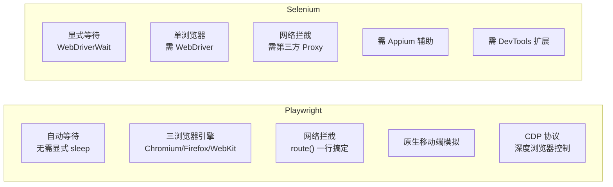
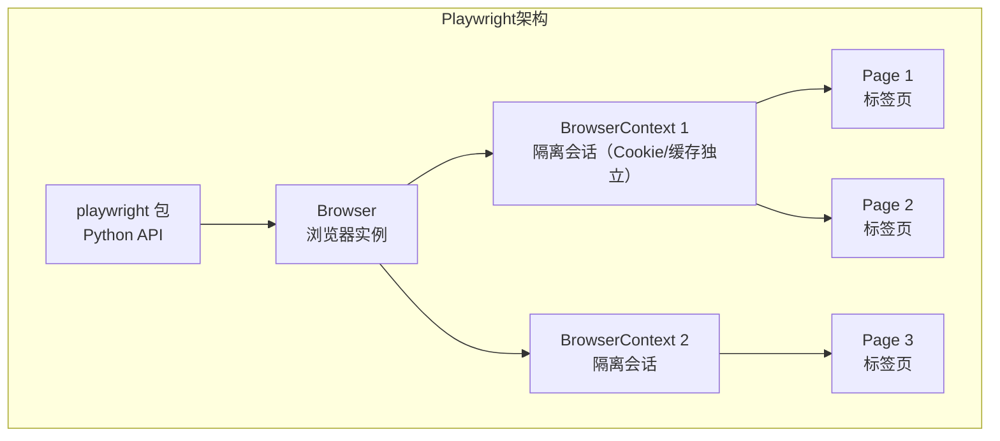
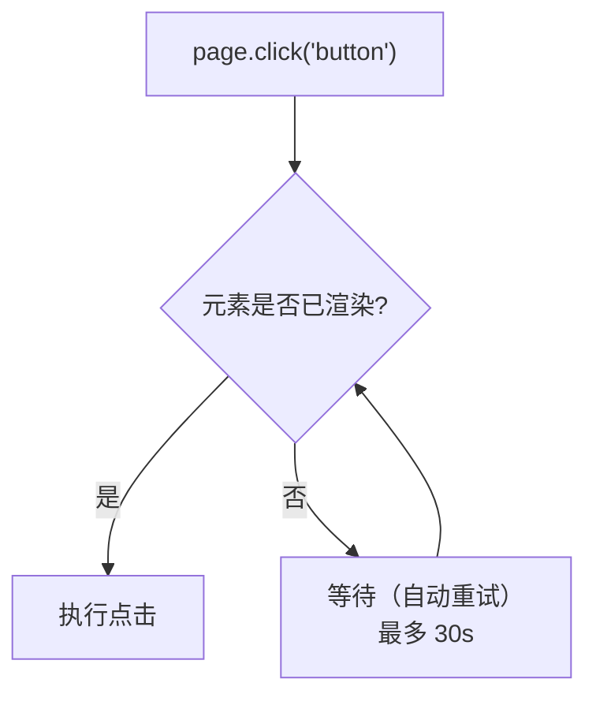
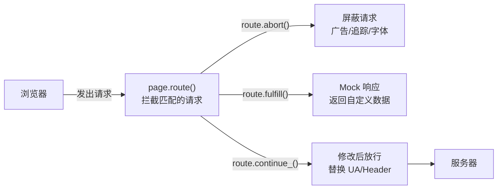

# Playwright 深度实战

> 从安装到生产，系统掌握微软出品的下一代浏览器自动化框架。

## 概述

Playwright 是微软于 2020 年开源的浏览器自动化框架，支持 Chromium、Firefox 和 WebKit 三大浏览器引擎。相比 Selenium，Playwright 原生支持自动等待、网络拦截、多标签页、移动端模拟等特性，API 设计更现代，是爬虫工程师处理动态渲染页面的首选工具。

**Playwright vs Selenium 对比**：



| 特性 | Playwright | Selenium |
|------|-----------|----------|
| 自动等待 | ✅ 内置 | ❌ 需手动 WebDriverWait |
| 多浏览器 | Chromium / Firefox / WebKit | Chrome / Firefox / Edge / Safari |
| 网络拦截 | ✅ 原生 `route()` | ❌ 需第三方代理 |
| 并行执行 | ✅ 内置 BrowserContext 隔离 | ❌ 需 Selenium Grid |
| Headless | ✅ 默认 | ✅ 支持 |
| 安装复杂度 | `pip install playwright` + `playwright install` | `pip install selenium` + ChromeDriver |
| JS 执行 | ✅ `evaluate()` | ✅ `execute_script()` |
| 截图/PDF | ✅ 原生 | ✅ 原生 |
| 移动端模拟 | ✅ 内置 | ❌ 需 Appium |
| 协议 | CDP + 双向 WebSocket | W3C WebDriver |

## 安装与环境配置

```bash
# 安装 Python 包
pip install playwright

# 安装浏览器二进制文件（约 300MB，只需一次）
playwright install

# 只安装 Chromium（最常用，体积最小）
playwright install chromium

# 安装系统依赖（Linux 服务器上需要）
playwright install-deps
```

::: tip 镜像加速
国内下载浏览器可能很慢，可以设置镜像：

```bash
# 使用淘宝镜像下载浏览器二进制文件（对 playwright install 生效）
PLAYWRIGHT_DOWNLOAD_HOST=https://npmmirror.com/mirrors/playwright playwright install chromium
```
:::

## 核心架构



**三层对象模型**：

| 层级 | 对象 | 作用 | 类比 |
|------|------|------|------|
| 1 | Browser | 浏览器进程 | 打开了一个浏览器 |
| 2 | BrowserContext | 隔离的浏览器会话 | 一个隐身窗口（Cookie/缓存独立） |
| 3 | Page | 一个标签页 | 浏览器中的一个 Tab |

BrowserContext 是 Playwright 的核心创新——它实现了**零成本会话隔离**。无需启动多个浏览器进程，一个 Browser 下可以创建多个 Context，每个 Context 有独立的 Cookie、localStorage 和缓存，完美模拟多用户并发。

## 同步与异步 API

Playwright 提供两套完全一致的 API，仅入口不同：

```python
# ========== 同步 API（适合脚本、简单爬虫） ==========
from playwright.sync_api import sync_playwright

with sync_playwright() as p:
    browser = p.chromium.launch(headless=True)
    page = browser.new_page()
    page.goto('https://example.com')
    title = page.title()
    print(title)
    browser.close()

# ========== 异步 API（适合高并发爬虫） ==========
import asyncio
from playwright.async_api import async_playwright

async def main():
    async with async_playwright() as p:
        browser = await p.chromium.launch(headless=True)
        page = await browser.new_page()
        await page.goto('https://example.com')
        title = await page.title()
        print(title)
        await browser.close()

asyncio.run(main())
```

::: tip 选择建议
- **脚本/小规模爬虫** → 同步 API，代码更简单
- **高并发/Scrapy集成** → 异步 API，不阻塞事件循环
- 两套 API 的方法名和参数完全一致，仅调用方式不同（有无 `await`）
:::

## 页面导航与等待

### 导航方式

```python
# 基本导航
page.goto('https://example.com')

# 带等待条件导航（等待网络空闲）
page.goto('https://example.com', wait_until='networkidle')

# 等待条件选项
# 'domcontentloaded' — DOM 解析完成（最快）
# 'load'             — 页面完全加载（默认）
# 'networkidle'      — 网络空闲（至少 500ms 无新请求，最安全但最慢）

# 前进/后退/刷新
page.go_back()
page.go_forward()
page.reload()
```

### 自动等待机制

Playwright 的核心优势——所有定位器操作都**自动等待**元素可见和可操作，无需手动 `sleep()`：

```python
# Playwright 自动等待元素出现后再点击
page.click('button.submit')  # 如果按钮还没渲染，自动等待最多 30s

# 显式等待特定条件
page.wait_for_selector('.result', state='visible')  # 等待元素可见
page.wait_for_selector('.loading', state='hidden')  # 等待元素消失
page.wait_for_load_state('networkidle')              # 等待网络空闲
page.wait_for_url('**/success')                      # 等待 URL 匹配
page.wait_for_timeout(5000)                          # 固定等待 5s（不推荐，仅调试用）
```



## 元素定位与操作

### 定位器（Locator）

Playwright 推荐使用 Locator 对象，它具有自动等待和自动重试的特性：

```python
# 推荐方式：Locator（自动等待+重试）
search = page.locator('input[name="q"]')
search.fill('Python爬虫')
search.press('Enter')

# 各种定位方式
page.locator('text=登录')                        # 文本匹配
page.locator('button:has-text("提交")')          # 包含文本
page.locator('input[type="email"]')              # CSS 选择器
page.locator('[data-testid="submit-btn"]')       # data-testid（最推荐）
page.get_by_role('button', name='登录')           # ARIA Role
page.get_by_text('联系我们')                       # 文本内容
page.get_by_placeholder('请输入关键词')            # placeholder
page.get_by_label('用户名')                        # label 关联
page.get_by_test_id('submit-btn')                 # data-testid
```

::: tip 定位器优先级
1. `get_by_test_id()` — 最稳定，专为测试设计
2. `get_by_role()` — 语义化，符合无障碍标准
3. `get_by_text()` / `get_by_label()` — 用户视角
4. CSS 选择器 — 通用
5. XPath — 最后手段（脆弱，维护成本高）
:::

### 常用操作

```python
# 点击
page.click('button.submit')
page.dblclick('img.thumbnail')  # 双击

# 输入文本
page.fill('input[name="username"]', 'admin')      # 清空后输入
page.locator('input[name="code"]').press_sequentially('1234', delay=100)  # 逐字输入（模拟人类；page.type 已废弃）

# 选择下拉框
page.select_option('select#country', 'China')

# 复选框
page.check('input[type="checkbox"]')
page.uncheck('input[type="checkbox"]')

# 文件上传
page.set_input_files('input[type="file"]', '/path/to/file.pdf')

# 键盘操作
page.press('input', 'Enter')
page.keyboard.press('Control+A')  # 全选
page.keyboard.type('Hello World', delay=50)  # 模拟打字

# 鼠标操作
page.mouse.click(100, 200)
page.mouse.dblclick(100, 200)
page.mouse.move(300, 400)

# 滚动
page.mouse.wheel(0, 1000)  # 向下滚动

# 截图
page.screenshot(path='screenshot.png')
element = page.locator('.chart')
element.screenshot(path='chart.png')  # 元素截图

# 生成 PDF（仅 Chromium）
page.pdf(path='page.pdf')
```

## 网络拦截与修改

Playwright 的网络拦截是爬虫中最强大的功能之一——无需第三方代理，即可拦截、修改、屏蔽任何网络请求：



### 屏蔽无关请求（加速页面加载）

```python
def block_resources(route):
    """屏蔽图片、字体、CSS 等无关资源，加速爬取"""
    if route.request.resource_type in ('image', 'font', 'stylesheet', 'media'):
        route.abort()
    else:
        route.continue_()

page.route('**/*', block_resources)

# 屏蔽后页面加载可显著提速（视页面资源构成而定）
page.goto('https://example.com')
```

### 拦截 API 请求并提取数据

```python
import json

captured_data = []

def capture_api(route):
    """拦截特定 API 请求，提取响应数据"""
    if 'api.example.com/data' in route.request.url:
        # 继续请求，但监听响应
        response = route.fetch()
        body = response.json()
        captured_data.append(body)
        # 将原始响应返回给页面
        route.fulfill(response=response)
    else:
        route.continue_()

page.route('**/*', capture_api)
page.goto('https://example.com')

print(f"捕获了 {len(captured_data)} 条 API 数据")
```

### 修改请求头

```python
def modify_headers(route):
    """为所有请求添加自定义 Header"""
    headers = {**route.request.headers, 'X-Custom-Header': 'value'}
    route.continue_(headers=headers)

page.route('**/*', modify_headers)
```

### Mock 响应数据

```python
def mock_api(route):
    """拦截 API 请求，返回自定义数据"""
    if 'api.example.com/user' in route.request.url:
        route.fulfill(
            status=200,
            content_type='application/json',
            body=json.dumps({'name': 'Mock User', 'id': 999}),
        )
    else:
        route.continue_()

page.route('**/*', mock_api)
```

## 多页面与多上下文

### 多标签页操作

```python
# 监听新标签页打开
with page.expect_popup() as popup_info:
    page.click('a[target="_blank"]')  # 点击会打开新标签的链接
popup = popup_info.value

# 在新标签页中操作
popup.wait_for_load_state()
print(popup.title())
popup.close()

# 获取所有页面
pages = browser.contexts[0].pages
for p in pages:
    print(p.url)
```

### 多用户隔离（多 Context）

```python
from playwright.sync_api import sync_playwright

with sync_playwright() as p:
    browser = p.chromium.launch()

    # 用户 A 的隔离会话
    context_a = browser.new_context()
    page_a = context_a.new_page()
    page_a.goto('https://example.com/login')
    page_a.fill('input[name="user"]', 'user_a')
    page_a.click('button[type="submit"]')

    # 用户 B 的隔离会话（Cookie/缓存完全独立）
    context_b = browser.new_context()
    page_b = context_b.new_page()
    page_b.goto('https://example.com/login')
    page_b.fill('input[name="user"]', 'user_b')
    page_b.click('button[type="submit"]')

    # 两个用户看到的页面内容不同
    print(page_a.locator('.username').text_content())  # user_a
    print(page_b.locator('.username').text_content())  # user_b

    browser.close()
```

## Cookie 管理与持久化

```python
# 获取所有 Cookie
cookies = context.cookies()

# 添加 Cookie
context.add_cookies([{
    'name': 'session_id',
    'value': 'abc123',
    'domain': 'example.com',
    'path': '/',
}])

# 清除 Cookie
context.clear_cookies()

# Cookie 持久化（保存登录状态）
import json

# 保存
storage = context.storage_state(path='auth.json')
# auth.json 包含 cookies 和 localStorage

# 恢复（下次启动时无需重新登录）
context = browser.new_context(storage_state='auth.json')
page = context.new_page()
page.goto('https://example.com/dashboard')  # 直接进入已登录页面
```

## 反爬对抗专用技巧

### 隐藏自动化特征

```python
# 需在 with sync_playwright() as p: 上下文中执行（p 为 Playwright 实例）
browser = p.chromium.launch(
    headless=True,
    args=[
        '--disable-blink-features=AutomationControlled',  # 隐藏 webdriver 标记
        '--disable-features=IsolateOrigins,site-per-process',
    ],
)

context = browser.new_context(
    user_agent='Mozilla/5.0 (Windows NT 10.0; Win64; x64) AppleWebKit/537.36 '
               '(KHTML, like Gecko) Chrome/125.0.0.0 Safari/537.36',
    viewport={'width': 1920, 'height': 1080},
    locale='zh-CN',
    timezone_id='Asia/Shanghai',
    geolocation={'latitude': 39.9042, 'longitude': 116.4074},
    permissions=['geolocation'],
)

page = context.new_page()

# 注入 stealth 脚本
page.add_init_script("""
    // 隐藏 webdriver
    Object.defineProperty(navigator, 'webdriver', { get: () => undefined });
    // 伪造 plugins
    Object.defineProperty(navigator, 'plugins', { get: () => [1, 2, 3, 4, 5] });
    // 伪造 languages
    Object.defineProperty(navigator, 'languages', { get: () => ['zh-CN', 'zh', 'en'] });
""")
```

### 指纹伪装

```python
context = browser.new_context(
    # 模拟真实设备
    user_agent='...',
    viewport={'width': 1920, 'height': 1080},
    device_scale_factor=1,
    is_mobile=False,
    has_touch=False,
    # Canvas 指纹混淆
    color_scheme='light',
    reduced_motion='no-preference',
)
```

## 完整实战：SPA 页面爬取

以单页应用（SPA）为实战场景，演示 Playwright 的完整爬虫流程：

```python
import json
from playwright.sync_api import sync_playwright

def scrape_spa_site(base_url: str, max_pages: int = 10) -> list[dict]:
    """
    爬取 SPA 单页应用 —— 无限滚动加载 + API 拦截
    """
    captured_data = []

    with sync_playwright() as p:
        browser = p.chromium.launch(headless=True)
        context = browser.new_context(
            user_agent='Mozilla/5.0 (Windows NT 10.0; Win64; x64) Chrome/125.0.0.0',
            viewport={'width': 1920, 'height': 1080},
        )
        page = context.new_page()

        # 拦截 API 请求，提取数据
        def capture_api(route):
            if 'api.example.com/items' in route.request.url:
                response = route.fetch()
                try:
                    data = response.json()
                    for item in data.get('items', []):
                        captured_data.append(item)
                except Exception:
                    pass
                route.fulfill(response=response)
            else:
                route.continue_()

        # 屏蔽无关资源加速加载
        def block_resources(route):
            if route.request.resource_type in ('image', 'font', 'stylesheet'):
                route.abort()
            else:
                route.continue_()

        page.route('**/api.example.com/**', capture_api)
        page.route('**/*', block_resources)

        # 访问页面
        page.goto(base_url, wait_until='networkidle')

        # 模拟无限滚动加载更多数据
        for i in range(max_pages):
            # 滚动到底部
            page.evaluate('window.scrollTo(0, document.body.scrollHeight)')
            # 等待新数据加载
            page.wait_for_timeout(2000)
            print(f"已滚动 {i+1} 次，累计捕获 {len(captured_data)} 条数据")

        browser.close()

    return captured_data

# 运行
data = scrape_spa_site('https://example.com/items')
print(f"总共捕获 {len(data)} 条数据")
with open('items.json', 'w', encoding='utf-8') as f:
    json.dump(data, f, ensure_ascii=False, indent=2)
```

## 与 Scrapy 集成

Playwright 可以作为 Scrapy 的 Downloader Middleware，处理动态渲染页面：

```python
# scrapy_playwright_middleware.py
import scrapy
from scrapy.http import HtmlResponse
from playwright.sync_api import sync_playwright


class PlaywrightMiddleware:
    """Playwright 中间件：用浏览器渲染页面后返回 HtmlResponse"""

    def __init__(self):
        self.pw = sync_playwright().start()
        self.browser = self.pw.chromium.launch(headless=True)

    def process_request(self, request, spider):
        # 只对标记了 playwright=True 的请求使用浏览器渲染
        if not request.meta.get('playwright'):
            return None

        context = self.browser.new_context(
            user_agent='Mozilla/5.0 ...',
        )
        page = context.new_page()

        try:
            page.goto(request.url, wait_until='networkidle', timeout=30000)

            # 可选：等待特定元素出现
            wait_selector = request.meta.get('playwright_wait_for')
            if wait_selector:
                page.wait_for_selector(wait_selector, timeout=15000)

            # 可选：滚动加载更多内容
            if request.meta.get('playwright_scroll'):
                for _ in range(request.meta.get('playwright_scroll_count', 3)):
                    page.evaluate('window.scrollTo(0, document.body.scrollHeight)')
                    page.wait_for_timeout(1000)

            body = page.content().encode('utf-8')
            return HtmlResponse(
                url=request.url,
                body=body,
                request=request,
                encoding='utf-8',
            )
        except Exception as e:
            spider.logger.error(f'Playwright error: {e}')
            return HtmlResponse(url=request.url, status=503, request=request)
        finally:
            context.close()

    def __del__(self):
        self.browser.close()
        self.pw.stop()
```

在 Scrapy Spider 中使用：

```python
class MySpider(scrapy.Spider):
    name = 'my_spider'

    def start_requests(self):
        yield scrapy.Request(
            url='https://spa-example.com/list',
            meta={
                'playwright': True,                    # 启用 Playwright
                'playwright_wait_for': '.item-card',   # 等待元素
                'playwright_scroll': True,              # 启用滚动
                'playwright_scroll_count': 5,           # 滚动 5 次
            },
        )

    def parse(self, response):
        for item in response.css('.item-card'):
            yield {
                'title': item.css('h2::text').get(),
                'price': item.css('.price::text').get(),
            }
```

::: warning 性能注意
Playwright 渲染是同步阻塞操作，会大幅降低 Scrapy 的并发能力。建议只对确实需要 JS 渲染的页面启用 `playwright=True`，其余页面继续使用普通 Downloader。
:::

## 常见陷阱

| 陷阱 | 现象 | 原因 | 解决方案 |
|------|------|------|---------|
| 元素定位超时 | `TimeoutError: waiting for selector` | 元素未加载完成或选择器错误 | 使用 `wait_for_selector()` 确认选择器正确；增加超时时间 |
| headless 和有头结果不同 | 有头模式正常，headless 失败 | 网站检测 headless 浏览器 | 添加 `--disable-blink-features=AutomationControlled`；注入 stealth 脚本 |
| 页面加载超时 | `TimeoutError: page.goto` | 页面加载慢或有阻塞资源 | 使用 `wait_until='domcontentloaded'`；屏蔽图片等资源 |
| Cookie 丢失 | 登录后刷新页面又回到登录页 | 使用了新的 BrowserContext | 使用 `storage_state` 持久化登录状态 |
| 多标签页切换失败 | `page.goto` 在错误标签执行 | 未正确获取新标签页引用 | 使用 `expect_popup()` 捕获新标签页 |
| 内存泄漏 | 长时间运行后内存持续增长 | 未关闭 Page 和 Context | 始终在 `try-finally` 中关闭资源；定期重启 Browser |
| 中文字符输入乱码 | `fill()` 输入中文显示为乱码 | Playwright 默认使用键盘事件输入 | 改用 `page.fill()` 而非 `page.type()` |

## 最佳实践

1. **优先使用 Locator**：`page.locator()` 自动等待+重试，比 `page.query_selector()` 更稳定
2. **屏蔽无关资源**：图片、字体、CSS 对爬虫无用，屏蔽后加载速度可显著提升
3. **使用 BrowserContext 隔离**：多账号并发时，一个 Browser + 多个 Context 比多个 Browser 更高效
4. **持久化登录状态**：`storage_state` 避免每次重新登录
5. **网络拦截提取数据**：比解析 DOM 更可靠——API 响应是结构化数据
6. **避免 `wait_for_timeout()`**：用 `wait_for_selector()` 或 `wait_for_load_state()` 代替固定等待
7. **headless + stealth**：生产环境用 headless 模式 + stealth 注入，兼顾速度和隐蔽性

## 术语表

| 术语 | 英文 | 定义 |
|------|------|------|
| Playwright | Playwright | 微软开源的浏览器自动化框架 |
| BrowserContext | BrowserContext | 浏览器会话隔离单元，拥有独立的 Cookie/缓存 |
| Locator | Locator | 自动等待+重试的元素定位器 |
| Headless | Headless Mode | 浏览器无界面运行模式 |
| CDP | Chrome DevTools Protocol | Chrome 开发者工具协议，深度控制浏览器 |
| route | route | Playwright 的网络拦截 API |
| storage_state | Storage State | 浏览器状态快照（Cookie + localStorage） |
| stealth | Stealth | 隐藏浏览器自动化特征的脚本/技术 |
| SPA | Single Page Application | 单页应用，页面内容由 JS 动态渲染 |
| Browser | Browser | Playwright 中的浏览器进程实例 |
| Page | Page | Playwright 中的标签页实例 |

## 延伸阅读

### 站内链接

- [01-爬虫概览与HTTP基础](01-爬虫概览与HTTP基础) — HTTP 协议基础
- [04-反爬对抗策略](04-反爬对抗策略) — JS 逆向与 WebDriver 检测绕过
- [05-Cookie管理与模拟登录](05-Cookie管理与模拟登录) — 登录态管理
- [06-移动端数据采集](06-移动端数据采集) — Appium 移动端自动化

### 外部链接

- [Playwright 官方文档](https://playwright.dev/python/) — 最权威的参考手册
- [Playwright GitHub](https://github.com/microsoft/playwright-python) — 源码与 Issue 追踪
- [playwright-stealth](https://github.com/berstend/puppeteer-extra/tree/master/packages/playwright-stealth) — stealth 插件
- [scrapy-playwright](https://github.com/scrapinghub/scrapy-playwright) — Scrapy + Playwright 集成库

## 版本差异（爬虫技术栈 → 当前版本）

| 库 | 本文编写时 | 当前稳定版 |
|----|-----------|-----------|
| `requests` | 2.28/2.31 | 2.32.x |
| `Scrapy` | 1.x/2.0 | 2.13.x（API 稳定，截至 2026-09） |
| `httpx` | 0.24 | 0.28.x |
| `Playwright` | 1.3x | 1.6x（Python 版） |
| `lxml`/`BeautifulSoup` | 旧版 | 保持稳定 |
| Python | 3.8-3.12 | 3.14（推荐） |

> 本文讲解的爬虫原理（HTTP、解析、反爬、存储）与核心 API 在最新版本中成立；注意 Python 3.9 及以下已 EOL，新项目使用 3.13/3.14。
