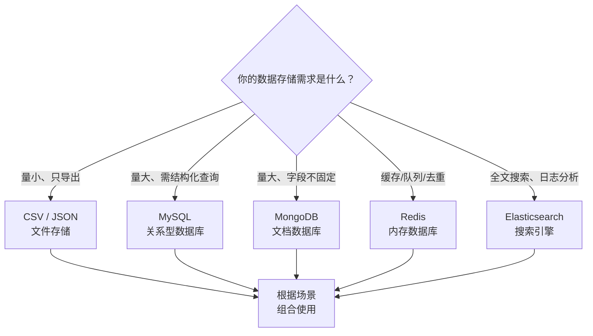
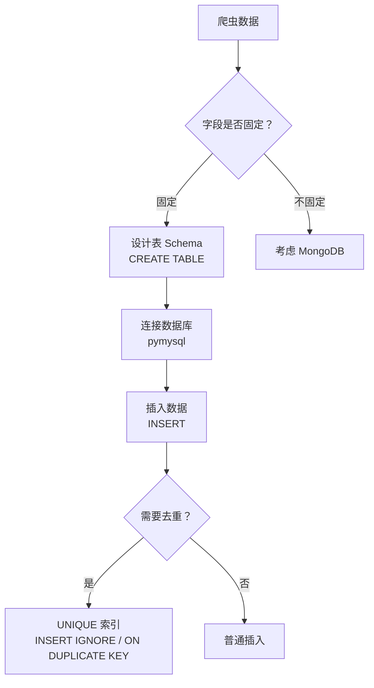
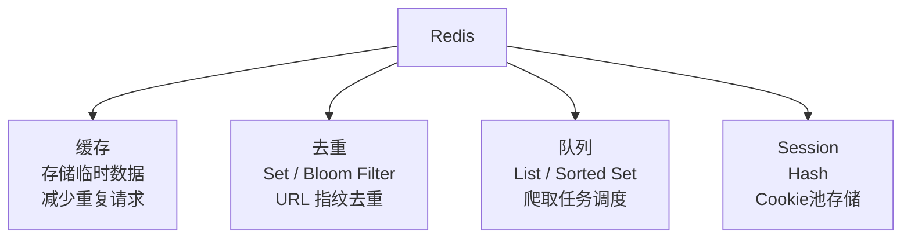
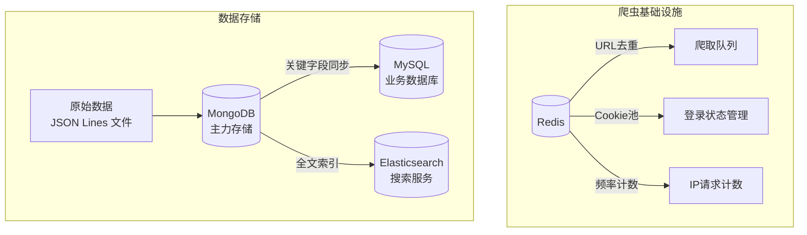

# 数据存储方案全解

> 从文件到数据库，从单机到分布式，系统掌握爬虫数据持久化的完整方案。

## 概述

爬虫采集的数据最终必须持久化存储，才能被后续的分析和应用所使用。选择合适的存储方案取决于三个核心因素：**数据量级、查询需求、运维成本**。

本章覆盖爬虫开发中最常用的 6 种存储方案，从最轻量的 CSV/JSON 文件到最专业的 Elasticsearch，逐一讲解原理、实操和选型。



## 存储方案全景对比

| 方案 | 数据量 | 查询能力 | 写入速度 | Schema | 运维成本 | 适用场景 |
|------|--------|---------|---------|--------|---------|---------|
| CSV | 万级 | 无（需全量读取） | 快 | 固定列 | 无 | 数据导出、简单报表 |
| JSON | 万级 | 无 | 快 | 无 | 无 | API 数据、嵌套结构 |
| MySQL | 亿级 | 强（SQL） | 中 | 严格 | 中 | 结构化数据、复杂查询 |
| MongoDB | 亿级 | 中（MongoDB Query） | 快 | 灵活 | 中 | 非结构化数据、字段多变 |
| Redis | 内存级 | 有限（Key-Value） | 极快 | 无 | 低 | 缓存、去重、队列、Session |
| Elasticsearch | 亿级 | 极强（全文搜索） | 中 | 动态 | 高 | 全文搜索、日志分析、数据可视化 |

## 1. CSV 文件存储

CSV 是最简单的数据存储格式，适合数据量小、结构固定的场景。

```python
import csv
from pathlib import Path

# ===== 写入 CSV =====
data = [
    {'name': 'iPhone 15', 'price': 7999, 'category': '手机'},
    {'name': 'MacBook Pro', 'price': 14999, 'category': '电脑'},
    {'name': 'AirPods Pro', 'price': 1899, 'category': '耳机'},
]

def write_csv(data: list[dict], filepath: str) -> None:
    """将数据列表写入 CSV 文件"""
    with open(filepath, 'w', newline='', encoding='utf-8-sig') as f:
        # utf-8-sig 解决 Excel 打开中文乱码问题
        writer = csv.DictWriter(f, fieldnames=data[0].keys())
        writer.writeheader()
        writer.writerows(data)

write_csv(data, 'products.csv')

# ===== 读取 CSV =====
def read_csv(filepath: str) -> list[dict]:
    """从 CSV 文件读取数据"""
    with open(filepath, 'r', encoding='utf-8-sig') as f:
        return list(csv.DictReader(f))

products = read_csv('products.csv')
for p in products:
    print(p['name'], p['price'])

# ===== 追加写入（增量爬取场景） =====
def append_csv(new_data: list[dict], filepath: str) -> None:
    """追加数据到已有 CSV 文件"""
    file_exists = Path(filepath).exists()
    with open(filepath, 'a', newline='', encoding='utf-8-sig') as f:
        writer = csv.DictWriter(f, fieldnames=new_data[0].keys())
        if not file_exists:
            writer.writeheader()
        writer.writerows(new_data)
```

::: tip CSV 的优缺点
- ✅ 通用性极强——任何工具都能读取 CSV（Excel、Pandas、数据库导入）
- ✅ 人类可读、易于调试
- ❌ 不支持嵌套结构（JSON 数据需要 flatten）
- ❌ 无索引，查询需要全量读取
- ❌ 数据量大时读写性能急剧下降
:::

## 2. JSON 文件存储

JSON 天然适合存储爬虫采集的 API 数据（本身就是 JSON 格式）和嵌套结构数据：

```python
import json
from pathlib import Path

# ===== 写入 JSON =====
data = [
    {
        'name': 'iPhone 15',
        'price': 7999,
        'specs': {'cpu': 'A16', 'ram': '6GB', 'storage': '256GB'},
        'reviews': [
            {'user': '张三', 'rating': 5, 'comment': '很好用'},
            {'user': '李四', 'rating': 4, 'comment': '有点贵'},
        ],
    },
]

def write_json(data: list[dict], filepath: str) -> None:
    """写入 JSON 文件"""
    with open(filepath, 'w', encoding='utf-8') as f:
        json.dump(data, f, ensure_ascii=False, indent=2)

write_json(data, 'products.json')

# ===== 读取 JSON =====
def read_json(filepath: str) -> list[dict]:
    """读取 JSON 文件"""
    with open(filepath, 'r', encoding='utf-8') as f:
        return json.load(f)

# ===== JSON Lines 格式（推荐用于增量写入） =====
# JSON Lines (.jsonl) 每行一个 JSON 对象，支持流式追加写入
def write_jsonl(item: dict, filepath: str) -> None:
    """追加写入单条数据到 JSON Lines 文件"""
    with open(filepath, 'a', encoding='utf-8') as f:
        f.write(json.dumps(item, ensure_ascii=False) + '\n')

def read_jsonl(filepath: str) -> list[dict]:
    """读取 JSON Lines 文件"""
    items = []
    with open(filepath, 'r', encoding='utf-8') as f:
        for line in f:
            if line.strip():
                items.append(json.loads(line))
    return items

# Scrapy 中可以直接导出为 JSON Lines
# scrapy crawl myspider -o items.jsonl
```

::: warning JSON vs JSON Lines
- **普通 JSON**：全量写入，追加时需要先读取整个文件、解析、追加、重新写入——数据量大时极其低效
- **JSON Lines**：每行一个 JSON 对象，追加只需 `f.write()`，无需读取已有数据——**增量爬取场景首选**
:::

## 3. MySQL 关系型数据库

MySQL 是最成熟的关系型数据库，适合需要复杂查询、事务支持和严格 Schema 的场景。



```python
import pymysql
from pymysql.cursors import DictCursor

# ===== 连接与建表 =====
connection = pymysql.connect(
    host='localhost',
    port=3306,
    user='root',
    password='your_password',
    database='crawler_db',
    charset='utf8mb4',
    cursorclass=DictCursor,
)

# 创建表（带唯一索引，支持去重）
with connection.cursor() as cursor:
    cursor.execute("""
        CREATE TABLE IF NOT EXISTS products (
            id INT AUTO_INCREMENT PRIMARY KEY,
            name VARCHAR(200) NOT NULL,
            price DECIMAL(10, 2),
            category VARCHAR(50),
            url VARCHAR(500),
            crawled_at TIMESTAMP DEFAULT CURRENT_TIMESTAMP,
            UNIQUE KEY idx_url (url)  -- URL 唯一索引，避免重复插入
        ) ENGINE=InnoDB DEFAULT CHARSET=utf8mb4
    """)
    connection.commit()

# ===== 插入数据（去重） =====
def insert_product(product: dict) -> None:
    """插入产品数据，URL 重复时自动跳过"""
    with connection.cursor() as cursor:
        # INSERT IGNORE：遇到 UNIQUE 冲突时静默跳过
        cursor.execute("""
            INSERT IGNORE INTO products (name, price, category, url)
            VALUES (%s, %s, %s, %s)
        """, (product['name'], product['price'], product['category'], product['url']))
        # ON DUPLICATE KEY UPDATE：遇到 UNIQUE 冲突时更新
        # cursor.execute("""
        #     INSERT INTO products (name, price, category, url)
        #     VALUES (%s, %s, %s, %s)
        #     ON DUPLICATE KEY UPDATE price=%s, name=%s
        # """, (product['name'], product['price'], product['category'],
        #       product['url'], product['price'], product['name']))
        connection.commit()

# ===== 批量插入（高效） =====
def batch_insert(products: list[dict]) -> None:
    """批量插入产品数据"""
    with connection.cursor() as cursor:
        sql = "INSERT IGNORE INTO products (name, price, category, url) VALUES (%s, %s, %s, %s)"
        data = [(p['name'], p['price'], p['category'], p['url']) for p in products]
        cursor.executemany(sql, data)
        connection.commit()

# ===== 查询数据 =====
with connection.cursor() as cursor:
    cursor.execute("SELECT * FROM products WHERE category = %s ORDER BY price DESC", ('手机',))
    results = cursor.fetchall()
    for row in results:
        print(row)

# 关闭连接
connection.close()
```

::: tip 去重策略对比
| 策略 | 语义 | 遇到重复时行为 | 适用场景 |
|------|------|---------------|---------|
| `INSERT IGNORE` | 静默跳过 | 不更新，不报错 | 历史数据不变，只入库新数据 |
| `ON DUPLICATE KEY UPDATE` | 更新已有行 | 更新指定字段 | 价格追踪，需更新最新价格 |
| `REPLACE INTO` | 先删再插 | 删除旧行，插入新行 | 需要完全替换旧数据 |
:::

## 4. MongoDB 文档数据库

MongoDB 是爬虫最常用的数据库，因为爬虫数据天然是文档型（字段多变、嵌套结构多），MongoDB 的灵活 Schema 完美匹配这一需求。

```python
import pymongo
from pymongo import MongoClient

# ===== 连接 =====
client = MongoClient('mongodb://localhost:27017/')
db = client['crawler_db']
collection = db['products']

# 创建索引（去重 + 加速查询）
collection.create_index([('url', pymongo.ASCENDING)], unique=True)

# ===== 插入单条数据（自动去重） =====
product = {
    'name': 'iPhone 15',
    'price': 7999,
    'category': '手机',
    'url': 'https://example.com/iphone15',
    'specs': {'cpu': 'A16', 'ram': '6GB'},  # 嵌套文档——MongoDB 天然支持
    'reviews': [  # 数组——MySQL 需要拆表，MongoDB 直接存储
        {'user': '张三', 'rating': 5},
        {'user': '李四', 'rating': 4},
    ],
    'crawled_at': '2026-06-06 12:00:00',
}

# upsert：存在则更新，不存在则插入
collection.update_one(
    {'url': product['url']},           # 查询条件
    {'$set': product},                  # 更新操作
    upsert=True,                        # 不存在时插入
)

# ===== 批量插入 =====
products = [
    {'name': 'MacBook Pro', 'price': 14999, 'url': '...'},
    {'name': 'AirPods Pro', 'price': 1899, 'url': '...'},
]
result = collection.insert_many(products)
print(f"插入 {len(result.inserted_ids)} 条文档")

# ===== 查询 =====
# 基本查询
results = collection.find({'category': '手机'}).sort('price', pymongo.DESCENDING)

# 嵌套字段查询
results = collection.find({'specs.cpu': 'A16'})

# 范围查询
results = collection.find({'price': {'$gte': 5000, '$lte': 10000}})

# 投影（只返回指定字段）
results = collection.find({'category': '手机'}, {'name': 1, 'price': 1, '_id': 0})

# 聚合查询（按类别统计平均价格）
pipeline = [
    {'$group': {'_id': '$category', 'avg_price': {'$avg': '$price'}, 'count': {'$sum': 1}}},
    {'$sort': {'count': pymongo.DESCENDING}},
]
for doc in collection.aggregate(pipeline):
    print(doc)
    # {'_id': '手机', 'avg_price': 7999.0, 'count': 5}
```

::: tip MongoDB vs MySQL 选型
| 需求 | 推荐 | 原因 |
|------|------|------|
| 字段固定、需要复杂关联查询 | MySQL | SQL JOIN 能力强大 |
| 字段多变、嵌套结构 | MongoDB | 无需定义 Schema，嵌套文档直接存储 |
| 需要事务支持 | MySQL | MongoDB 4.0+ 支持事务但性能损耗大 |
| 需要快速写入 | MongoDB | 无 Schema 校验，写入更快 |
| 爬虫+数据分析组合 | MongoDB + Pandas | MongoDB 的灵活 Schema 适配爬虫，Pandas 处理分析 |
:::

## 5. Redis 内存数据库

Redis 在爬虫中不是用来存储最终数据的，而是作为**基础设施**——缓存、去重、队列、Session 管理：



```python
import hashlib
import json
import random

import redis
import requests

r = redis.StrictRedis(host='localhost', port=6379, db=0, decode_responses=True)

# ===== 1. URL 去重（Set） =====
url = 'https://example.com/page/1'
fingerprint = hashlib.sha1(url.encode()).hexdigest()

added = r.sadd('crawler:dupefilter', fingerprint)
if added == 1:
    print('新 URL，需要爬取')
else:
    print('已爬取过，跳过')

# ===== 2. 爬取队列（List） =====
# 入队
r.lpush('crawler:queue', 'https://example.com/page/1')
# 出队
url = r.rpop('crawler:queue')

# 优先级队列（Sorted Set）
r.zadd('crawler:priority_queue', {'https://important.com': 10, 'https://normal.com': 1})
url = r.zpopmin('crawler:priority_queue')  # 低分数优先

# ===== 3. Cookie 池（Hash） =====
# 存储 Cookie
r.hset('cookies:github', 'user_a', json.dumps({'session_id': 'abc', 'token': 'xyz'}))
# 随机获取 Cookie
account = random.choice(r.hkeys('cookies:github'))
cookie_json = r.hget('cookies:github', account)
cookies = json.loads(cookie_json)

# ===== 4. 缓存（String + TTL） =====
# 缓存页面内容，1 小时过期
r.setex('cache:page:1', 3600, html_content)
# 读取缓存
cached = r.get('cache:page:1')
if cached:
    print('命中缓存，无需重新请求')
else:
    # 重新请求并缓存
    html = requests.get(url).text
    r.setex('cache:page:1', 3600, html)

# ===== 5. 计数器（Increment） =====
# 统计每个 IP 的请求次数（频率限制）
ip = '192.168.1.100'
count = r.incr(f'ratelimit:{ip}')
if count > 100:
    print('请求过多，封禁该 IP')
```

## 6. Elasticsearch 搜索引擎

Elasticsearch 是专业的全文搜索和分析引擎，适合需要搜索、聚合和可视化的场景：

```python
from elasticsearch import Elasticsearch, BadRequestError

es = Elasticsearch('http://localhost:9200')

# ===== 创建索引 =====
index_name = 'products'

# 定义索引映射（类似数据库 Schema，但更灵活）
mapping = {
    'mappings': {
        'properties': {
            'name': {'type': 'text', 'analyzer': 'ik_max_word'},  # 中文分词
            'price': {'type': 'float'},
            'category': {'type': 'keyword'},
            'url': {'type': 'keyword'},
            'description': {'type': 'text', 'analyzer': 'ik_max_word'},
            'crawled_at': {'type': 'date'},
        }
    },
    'settings': {
        'number_of_shards': 1,
        'number_of_replicas': 0,
    },
}

# ignore 参数已在 elasticsearch-py 8.x 移除，改用异常捕获：已存在时不报错
try:
    es.indices.create(index=index_name, body=mapping)
except BadRequestError:
    pass

# ===== 插入数据 =====
doc = {
    'name': 'iPhone 15 Pro Max',
    'price': 9999,
    'category': '手机',
    'description': '苹果最新旗舰手机，搭载 A17 Pro 芯片',
    'url': 'https://example.com/iphone15pro',
    'crawled_at': '2026-06-06T12:00:00',
}

# upsert：ID 重复时更新
es.index(index=index_name, id=doc['url'], body=doc)

# 批量插入（Bulk API，高效）
from elasticsearch.helpers import bulk

actions = [
    {
        '_index': index_name,
        '_id': p['url'],
        '_source': p,
    }
    for p in products
]
bulk(es, actions)

# ===== 搜索 =====
# 全文搜索（中文分词）
results = es.search(index=index_name, body={
    'query': {
        'match': {'description': '苹果手机'}  # 使用 ik 分词器
    },
    'size': 20,
})

# 范围搜索
results = es.search(index=index_name, body={
    'query': {
        'range': {'price': {'gte': 5000, 'lte': 10000}}
    },
})

# 聚合分析（按类别统计平均价格）
results = es.search(index=index_name, body={
    'size': 0,
    'aggs': {
        'by_category': {
            'terms': {'field': 'category'},
            'aggs': {
                'avg_price': {'avg': {'field': 'price'}}
            }
        }
    },
})
```

::: warning Elasticsearch 的门槛
Elasticsearch 运维成本最高——需要单独部署 Java 进程、配置分片和副本、安装 IK 中文分词插件。如果只是存储数据，不需要全文搜索，建议使用 MongoDB。只有当你的业务确实需要"搜索"能力时才引入 Elasticsearch。
:::

## 存储方案组合策略

实际项目中，很少只用一种存储方案。以下是常见组合：



| 组合方案 | 适用场景 | 说明 |
|---------|---------|------|
| **Redis + MongoDB** | 最常见的爬虫组合 | Redis 做去重/队列/Cookie池，MongoDB 存数据 |
| **Redis + MySQL** | 需要复杂查询 | Redis 基础设施不变，MySQL 存结构化数据 |
| **Redis + MongoDB + MySQL** | 爬虫+业务系统 | MongoDB 存爬虫原始数据，关键字段同步到 MySQL |
| **Redis + MongoDB + Elasticsearch** | 爬虫+搜索 | MongoDB 存全量数据，ES 提供搜索能力 |
| **JSON Lines + MongoDB** | 爬虫+数据分析 | JSON Lines 做原始备份，MongoDB 存处理后数据 |

## 常见陷阱

| 陷阱 | 现象 | 原因 | 解决方案 |
|------|------|------|---------|
| CSV 中文乱码 | Excel 打开 CSV 显示乱码 | Excel 默认用 ANSI 编码读 CSV | 使用 `utf-8-sig` 编码写入 |
| MongoDB 重复数据 | 同一条数据插入多次 | 未使用 upsert 或唯一索引 | `create_index(unique=True)` + `update_one(upsert=True)` |
| Redis 内存溢出 | Redis 占用内存持续增长 | 未设置 TTL，数据无限累积 | 对缓存类数据使用 `setex()` 设置过期时间 |
| MySQL 连接超时 | `OperationalError: Lost connection` | 长时间未活动导致连接断开 | 使用 DBUtils 的 `PooledDB` 连接池（pymysql 自身不带连接池），或定期 `connection.ping(reconnect=True)` |
| Elasticsearch 写入缓慢 | bulk 写入每秒仅几百条 | 刷新间隔过短 | 设置 `refresh_interval=-1`（暂停刷新），写入完成后恢复 |
| JSON 文件追加低效 | 每次追加需读取整个文件 | JSON 格式不支持流式追加 | 使用 JSON Lines (.jsonl) 格式 |
| pymysql 返回 bytes | 查询结果中文字符显示 `b'...'` | 连接未设置 `charset=utf8mb4` | 添加 `charset='utf8mb4'` 参数 |

## 最佳实践

1. **数据分层存储**：Redis（实时/缓存）→ MongoDB（全量/灵活）→ MySQL（业务/查询）→ Elasticsearch（搜索/分析）
2. **始终使用 upsert 去重**：爬虫天然会产生重复数据，MongoDB `update_one(upsert=True)` 和 MySQL `ON DUPLICATE KEY UPDATE` 是标配
3. **索引先行**：写入大量数据前先创建索引，否则后建索引会锁表/耗时极长
4. **JSON Lines 增量写入**：避免全量 JSON 文件追加，使用 .jsonl 格式流式写入
5. **Redis TTL 必设**：缓存和频率计数类数据必须设置过期时间，避免内存无限增长
6. **连接池代替单连接**：大规模写入时使用连接池，避免频繁创建/销毁连接
7. **原始数据备份**：存储到数据库前，先用 JSON Lines 文件备份原始数据——数据库可能出错，文件不会

## 术语表

| 术语 | 英文 | 定义 |
|------|------|------|
| CSV | Comma-Separated Values | 逗号分隔值文件格式 |
| JSON Lines | JSON Lines (.jsonl) | 每行一个 JSON 对象的文件格式，支持流式追加 |
| upsert | Update or Insert | 存在则更新，不存在则插入 |
| Schema | Schema | 数据库表/文档的结构定义 |
| 索引 | Index | 数据库中加速查询的数据结构 |
| 唯一索引 | Unique Index | 确保字段值不重复的索引，天然支持去重 |
| 分词器 | Analyzer | Elasticsearch 中将文本拆分为词的组件 |
| Bulk API | Bulk API | Elasticsearch 批量操作接口，高效写入 |
| TTL | Time To Live | 数据过期时间，Redis 中自动删除过期 key |
| 连接池 | Connection Pool | 预创建的数据库连接集合，避免频繁创建销毁 |
| BSON | Binary JSON | MongoDB 的二进制 JSON 存储格式 |

## 延伸阅读

### 站内链接

- [01-爬虫概览与HTTP基础](01-爬虫概览与HTTP基础) — 爬虫基础与 HTTP 协议
- [07-Scrapy框架全解](07-Scrapy框架全解) — Scrapy Pipeline 数据存储
- [08-Scrapy分布式与生产部署](08-Scrapy分布式与生产部署) — Redis 分布式队列

### 外部链接

- [MySQL 官方文档](https://dev.mysql.com/doc/)
- [MongoDB 官方文档](https://docs.mongodb.com/)
- [Redis 官方文档](https://redis.io/documentation)
- [Elasticsearch 官方文档](https://www.elastic.co/guide/en/elasticsearch/reference/current/index.html)
- [IK Analysis Plugin](https://github.com/medcl/elasticsearch-analysis-ik) — Elasticsearch 中文分词插件
- [pymongo 文档](https://pymongo.readthedocs.io/)
- [redis-py 文档](https://redis-py.readthedocs.io/)

## 版本差异（爬虫技术栈 → 当前版本）

| 库 | 本文编写时 | 当前稳定版 |
|----|-----------|-----------|
| `requests` | 2.28/2.31 | 2.32.x |
| `Scrapy` | 1.x/2.0 | 2.13.x（API 稳定，截至 2026-09） |
| `httpx` | 0.24 | 0.28.x |
| `Playwright` | 1.3x | 1.6x（Python 版） |
| `lxml`/`BeautifulSoup` | 旧版 | 保持稳定 |
| Python | 3.8-3.12 | 3.14（推荐） |

> 本文讲解的爬虫原理（HTTP、解析、反爬、存储）与核心 API 在最新版本中成立；注意 Python 3.9 及以下已 EOL，新项目使用 3.13/3.14。
