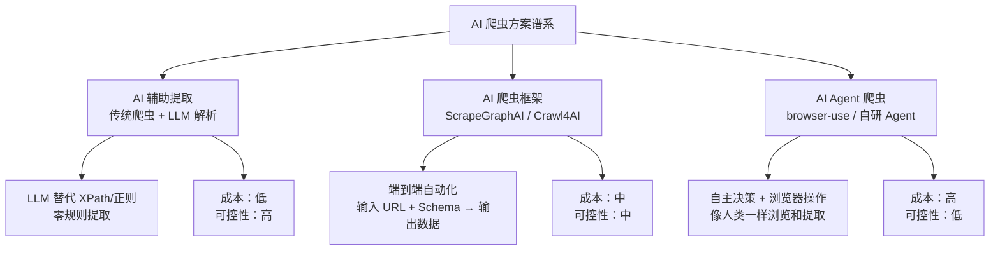
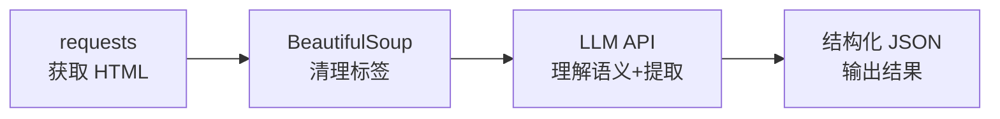
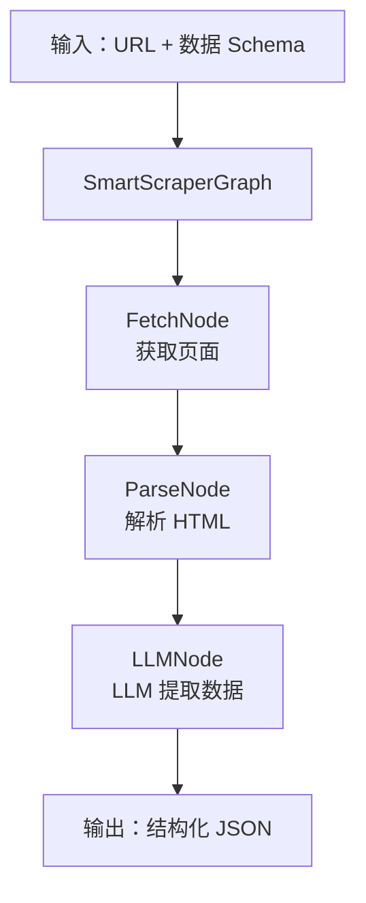
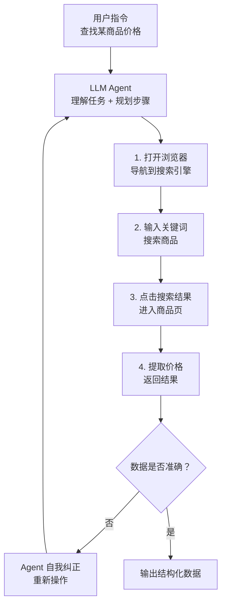
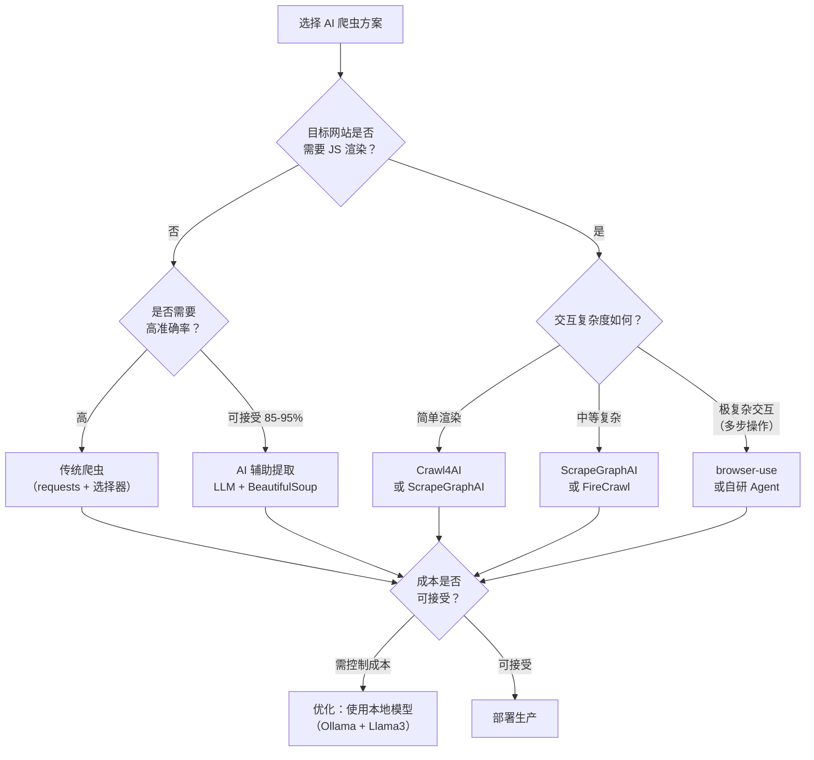
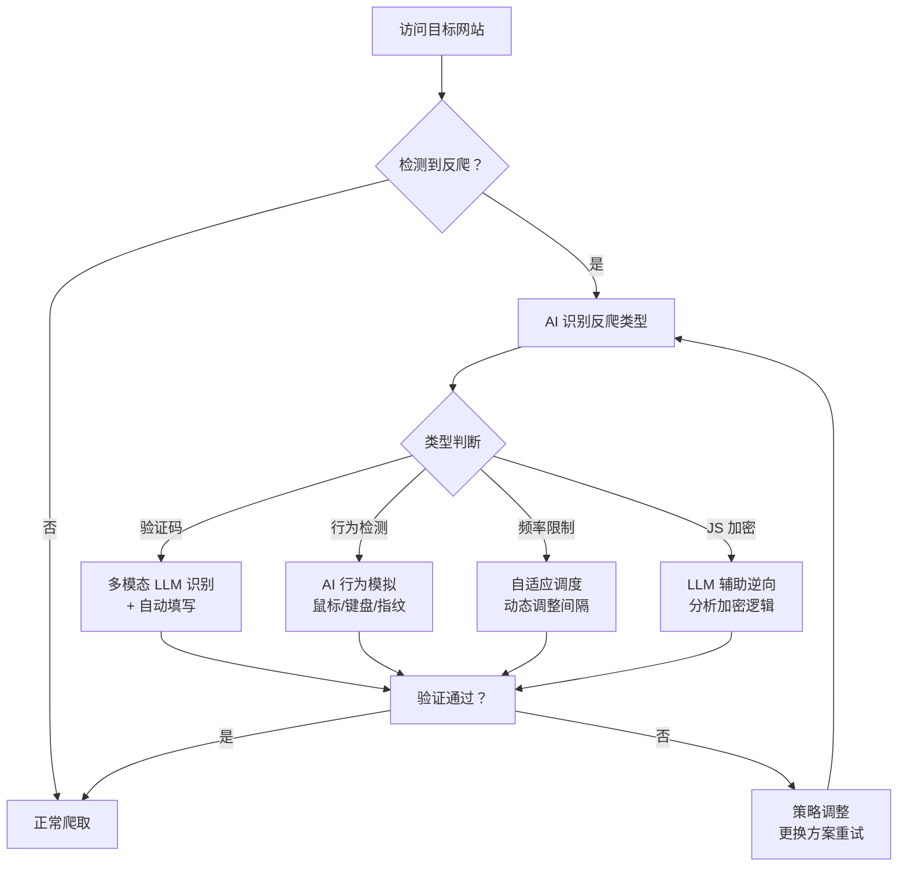
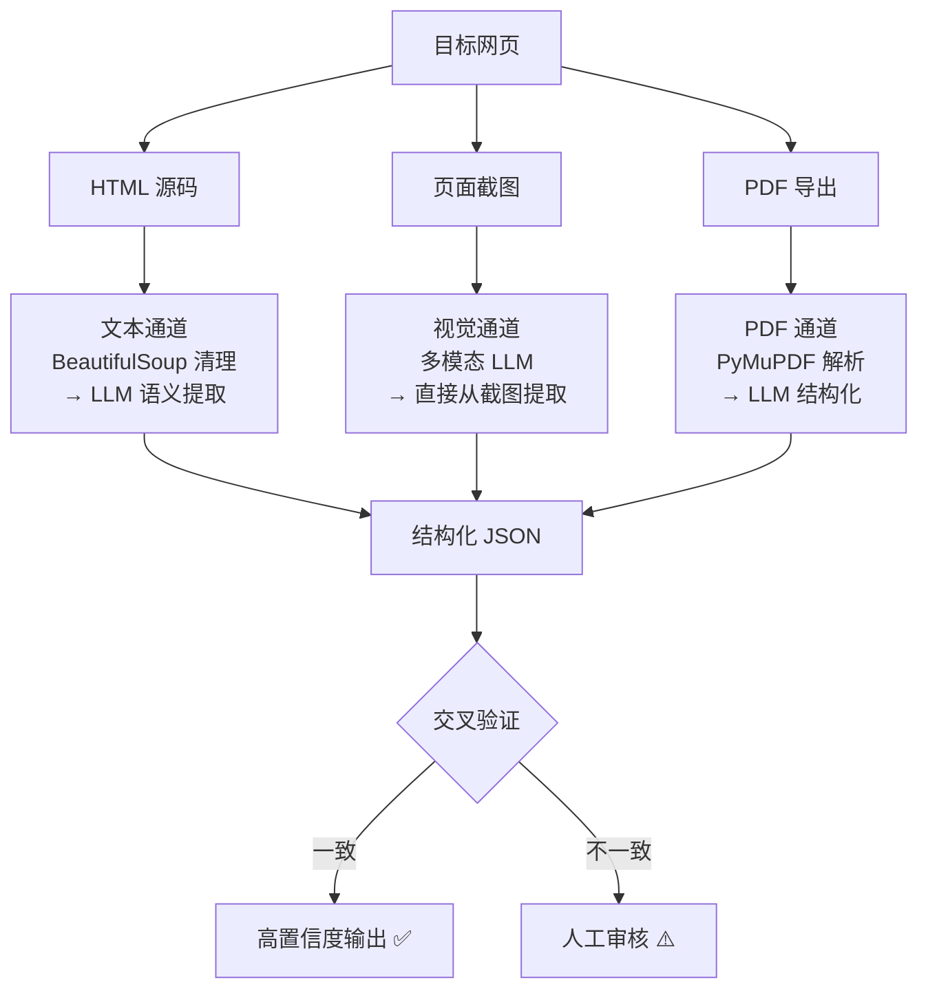
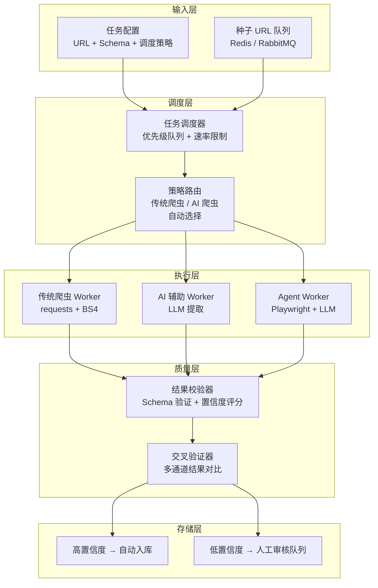

# AI 爬虫方案全解

> 当 LLM 遇上爬虫：从 AI 辅助提取到自主 Agent 爬取，探索下一代数据采集范式。

## 概述

2024 年以来，大语言模型（LLM）的爆发深刻改变了数据采集的方式。传统爬虫需要为每个网站编写定位规则（CSS 选择器、XPath），而 AI 爬虫让模型自动理解页面结构和语义，直接提取目标数据——甚至自主规划爬取路径、处理反爬、生成结构化输出。

本章系统梳理当前主流的 AI 爬虫方案，从轻量级的 AI 辅助提取到完全自主的 Agent 爬虫，帮助你根据场景选择合适的方案。



## 方案全景对比

| 方案 | 代表工具 | 原理 | 学习成本 | API 成本 | 准确率 | 适用场景 |
|------|---------|------|---------|---------|--------|---------|
| **AI 辅助提取** | LLM API + BeautifulSoup | 传统爬虫获取 HTML，LLM 解析提取 | 低 | 低 | 85-95% | 结构化页面、字段提取 |
| **ScrapeGraphAI** | scrapegraphai | 图结构管道，LLM 编排全流程 | 中 | 中 | 80-90% | 快速原型、多网站通用 |
| **Crawl4AI** | crawl4ai | 专注智能抓取+Markdown转换 | 低 | 低 | 85-95% | 内容采集、RAG 数据准备 |
| **FireCrawl** | firecrawl (SaaS) | 云端爬取+结构化输出 | 极低 | 中-高 | 85-90% | 无需编码、SaaS 开箱即用 |
| **browser-use** | browser-use | LLM Agent 操控浏览器 | 中 | 高 | 70-85% | 复杂交互、多步操作 |
| **自研 Agent** | Claude/GPT + Playwright | 自主规划+执行+纠错 | 高 | 高 | 60-80% | 极复杂场景、需要推理 |

## 1. AI 辅助提取：LLM 替代选择器

最轻量的 AI 爬虫方案——传统爬虫负责请求和获取 HTML，LLM 负责理解和提取数据。**无需编写任何 CSS 选择器或 XPath**。



### 实战：用 LLM 提取商品信息

```python
import requests
import json
from bs4 import BeautifulSoup
from anthropic import Anthropic

# 步骤1：获取页面 HTML
response = requests.get(
    'https://example.com/product/123',
    headers={'User-Agent': 'Mozilla/5.0 ...'},
)
soup = BeautifulSoup(response.text, 'lxml')

# 步骤2：提取页面主要文本内容（去除导航/页脚等噪声）
# 关键：给 LLM 过多的 HTML 会让它分心和浪费 token
main_content = soup.get_text(separator='\n', strip=True)

# 如果内容太长，截取关键部分
if len(main_content) > 8000:
    main_content = main_content[:8000]

# 步骤3：调用 LLM 提取结构化数据
client = Anthropic()

message = client.messages.create(
    model='claude-sonnet-4-20250514',
    max_tokens=1024,
    messages=[{
        'role': 'user',
        'content': f"""从以下网页文本中提取商品信息，返回 JSON 格式。

要求：
- name: 商品名称
- price: 价格（数字）
- original_price: 原价（如有，否则 null）
- rating: 评分（数字，如 4.5）
- reviews_count: 评论数
- availability: 是否有货（true/false）
- specs: 规格参数字典

网页内容：
{main_content}

请只返回 JSON，不要其他文字。"""
    }],
)

# 步骤4：解析 LLM 返回的 JSON
result_text = message.content[0].text
# 尝试提取 JSON（LLM 可能返回带 ```json 标记的内容）
if '```json' in result_text:
    result_text = result_text.split('```json')[1].split('```')[0].strip()

product = json.loads(result_text)
print(json.dumps(product, ensure_ascii=False, indent=2))
# {"name": "iPhone 15 Pro Max", "price": 9999, "original_price": 10999, ...}
```

::: tip 核心优势
- **零选择器**：不需要为每个网站写 CSS/XPath，LLM 直接理解语义
- **抗改版**：网站改版后选择器会失效，但 LLM 基于语义理解不受影响
- **一次提取多字段**：一个 prompt 提取所有字段，比多个选择器更高效
:::

::: warning 注意事项
- **Token 成本**：每个页面都要发送完整 HTML 给 LLM，成本远高于传统选择器
- **延迟**：LLM API 调用需要 1-5 秒，不适合高吞吐量场景
- **准确率**：约 85-95%，关键业务需要人工校验
- **最佳实践**：先用 BeautifulSoup 清理 HTML，只发送页面主要文本区域给 LLM，减少 token 消耗
:::

## 2. ScrapeGraphAI：端到端 AI 爬虫框架

ScrapeGraphAI 是第一个专为 LLM 驱动爬虫设计的 Python 框架。它将爬虫流程建模为**图（Graph）**结构，每个节点是一个处理步骤（抓取、解析、LLM 提取），LLM 负责编排整个流程。



### 安装与配置

```bash
pip install scrapegraphai

# 需要 LLM API Key（支持 OpenAI / Anthropic / 本地模型）
export OPENAI_API_KEY=sk-...
# 或使用本地模型（免费，但需要 Ollama）
# pip install scrapegraphai[ollama]
```

### 实战：一行代码爬取结构化数据

```python
import json
from scrapegraphai.graphs import SmartScraperGraph

# 定义数据 Schema（告诉 LLM 你要提取什么）
graph_config = {
    "llm": {
        "model": "openai/gpt-4o-mini",  # 或 "ollama/llama3"
        "api_key": "sk-...",             # 或不设，使用本地模型
    },
}

# 创建爬虫图
scraper = SmartScraperGraph(
    prompt="提取所有商品信息：名称、价格、评分、链接",
    source="https://example.com/products",
    config=graph_config,
)

# 执行爬取
result = scraper.run()
print(json.dumps(result, ensure_ascii=False, indent=2))
# {
#   "products": [
#     {"name": "Product A", "price": "$29.99", "rating": "4.5", "link": "..."},
#     {"name": "Product B", "price": "$49.99", "rating": "4.8", "link": "..."},
#   ]
# }
```

### 高级用法：自定义图结构

```python
from pydantic import BaseModel
from scrapegraphai.graphs import SmartScraperGraph

# 爬取+搜索组合
graph_config = {
    "llm": {"model": "openai/gpt-4o-mini", "api_key": "sk-..."},
    "verbose": True,
}

# 自定义输出 Schema：scrapegraphai 的 schema 参数需传入 pydantic BaseModel 类
class Article(BaseModel):
    title: str
    summary: str
    date: str
    author: str

class ArticleList(BaseModel):
    articles: list[Article]

scraper = SmartScraperGraph(
    prompt="从页面中提取所有博客文章的标题、摘要、发布日期和作者",
    source="https://blog.example.com",
    config=graph_config,
    schema=ArticleList,  # 可选：提供 Schema 约束输出格式（需为 pydantic BaseModel 类）
)

result = scraper.run()
```

## 3. Crawl4AI：智能爬取 + Markdown 转换

Crawl4AI 专注于**智能抓取和内容转换**——将网页转换为结构化的 Markdown 文本，为 RAG（检索增强生成）和 AI 应用提供高质量数据。

```bash
pip install crawl4ai
crawl4ai-setup   # 安装 Playwright 浏览器依赖
```

### 核心特性

> 以下示例基于 crawl4ai 0.6+ 当前 API（通过 `CrawlerRunConfig` 传参）。0.4.x 旧版直接向 `arun()` 传 `output_format`、`extraction_strategy` 等参数的写法已废弃。

```python
import asyncio
from crawl4ai import AsyncWebCrawler, CrawlerRunConfig, CacheMode

async def crawl_example():
    async with AsyncWebCrawler() as crawler:
        # 示例1：抓取并转换为 Markdown
        config = CrawlerRunConfig(
            # 自动去除导航、广告、页脚等噪声（过滤短文本）
            word_count_threshold=10,
            # 提取主要内容（类似浏览器阅读模式）
            css_selector='article',
            cache_mode=CacheMode.BYPASS,
        )
        result = await crawler.arun(
            url='https://example.com/article',
            config=config,
        )
        print(result.markdown)       # 干净的 Markdown 文本
        print(result.cleaned_html)   # 清理后的 HTML

        # 示例2：LLM 辅助提取结构化数据
        from crawl4ai import LLMConfig
        from crawl4ai.extraction_strategy import LLMExtractionStrategy

        llm_strategy = LLMExtractionStrategy(
            llm_config=LLMConfig(
                provider='openai/gpt-4o-mini',   # 需设置 OPENAI_API_KEY
                api_token=None,                   # None 时自动读取环境变量
            ),
            instruction='提取所有商品的名称和价格',
        )
        result = await crawler.arun(
            url='https://example.com/products',
            config=CrawlerRunConfig(
                extraction_strategy=llm_strategy,
                cache_mode=CacheMode.BYPASS,
            ),
        )
        print(result.extracted_content)

asyncio.run(crawl_example())
```

### 批量爬取与缓存

```python
import asyncio

from crawl4ai import AsyncWebCrawler, CrawlerRunConfig, CacheMode

async def batch_crawl(urls: list[str]) -> list[dict]:
    """批量爬取多个 URL"""
    results = []
    async with AsyncWebCrawler() as crawler:
        config = CrawlerRunConfig(
            word_count_threshold=10,
            cache_mode=CacheMode.BYPASS,
        )
        for url in urls:
            result = await crawler.arun(url=url, config=config)
            results.append({
                'url': url,
                'title': result.metadata.get('title', ''),
                'content': str(result.markdown),
            })
    return results
```

::: tip Crawl4AI 的定位
Crawl4AI 不适合传统爬虫场景（如价格监控、数据采集入库），但在以下场景中无可替代：
- **RAG 数据准备**：将网页转为 Markdown 供 LLM 检索
- **内容聚合**：采集文章/新闻，转换为统一格式
- **知识库构建**：批量爬取+清洗+格式化为 AI 可读内容
:::

## 4. FireCrawl：SaaS 开箱即用

FireCrawl 是一个云端 AI 爬虫服务，无需编写代码，通过 API 调用即可获取结构化数据：

```python
# pip install firecrawl-py
from firecrawl import FirecrawlApp

app = FirecrawlApp(api_key='fc-...')

# 爬取单个页面
result = app.scrape_url(
    'https://example.com/product/123',
    params={
        'formats': ['extract'],
        'extract': {
            'schema': {
                'type': 'object',
                'properties': {
                    'name': {'type': 'string'},
                    'price': {'type': 'number'},
                    'description': {'type': 'string'},
                }
            }
        }
    }
)
print(result['extract'])  # 结构化 JSON

# 爬取整个网站
result = app.crawl_url(
    'https://example.com',
    params={
        'limit': 100,
        'scrapeOptions': {
            'formats': ['markdown'],
        }
    }
)
```

| 特性 | 说明 |
|------|------|
| 优点 | 无需编码、自动处理 JS 渲染、自动处理反爬、结构化输出 |
| 缺点 | 付费（500 页/月免费，之后按页计费）、数据经过第三方、不可定制 |
| 适用场景 | 快速验证、非敏感数据、小规模采集 |

## 5. browser-use：LLM Agent 操控浏览器

browser-use 是最前沿的 AI 爬虫方案——LLM Agent 自主操控浏览器，像人类一样浏览、点击、填写表单、提取数据：



### 安装与基础用法

```bash
pip install browser-use
playwright install chromium
```

```python
import asyncio

from browser_use import Agent
from langchain_openai import ChatOpenAI

# 创建 Agent
agent = Agent(
    task="打开京东，搜索'iPhone 15 Pro'，获取前3个商品的价格和名称",
    llm=ChatOpenAI(model="gpt-4o"),
)

# 执行任务（agent.run() 为协程，须在事件循环中 await）
async def main():
    result = await agent.run()
    print(result)

asyncio.run(main())
```

### 自定义 Action

```python
import asyncio

from browser_use import Agent, Controller
from pydantic import BaseModel

class ProductInfo(BaseModel):
    name: str
    price: float
    url: str

controller = Controller(output_model=ProductInfo)

# 定义自定义操作
@controller.action("将商品信息保存到数据库")
def save_product(product: ProductInfo):
    # 这里可以对接 MongoDB / MySQL
    db.products.insert_one(product.model_dump())
    return f"已保存: {product.name}"

agent = Agent(
    task="爬取某电商网站的手机商品信息",
    llm=ChatOpenAI(model="gpt-4o"),
    controller=controller,
)

async def main():
    result = await agent.run()
    print(result)

asyncio.run(main())
```

::: warning browser-use 的局限
- **成本极高**：每步操作都调用 LLM API，一个任务可能消耗 10-50 次 API 调用
- **速度慢**：Agent 需要观察、思考、操作，每个步骤 3-10 秒
- **不稳定**：LLM 可能点错按钮、输入错误内容、陷入循环
- **适用场景有限**：仅适合传统爬虫完全无法处理的极复杂交互场景
:::

## 6. 自研 AI Agent 爬虫

对于复杂场景，可以使用 Claude/GPT + Playwright 自研 Agent 爬虫。核心思路：**LLM 负责决策，Playwright 负责执行**。

```python
import json
from anthropic import Anthropic
from playwright.sync_api import sync_playwright

class AICrawler:
    """AI Agent 爬虫 —— LLM 决策 + Playwright 执行"""

    def __init__(self):
        self.client = Anthropic()
        self.pw = sync_playwright().start()
        self.browser = self.pw.chromium.launch(headless=True)
        self.context = self.browser.new_context(
            user_agent='Mozilla/5.0 ...',
        )
        self.page = self.context.new_page()

    def crawl(self, url: str, goal: str) -> dict:
        """
        爬取目标 URL，根据 goal 提取数据。

        Args:
            url: 目标 URL
            goal: 提取目标描述（自然语言）
        """
        # 步骤1：访问页面
        self.page.goto(url, wait_until='networkidle')

        # 步骤2：获取页面内容
        html = self.page.content()

        # 步骤3：清理 HTML（只保留文本，减少 token 消耗）
        text_content = self.page.evaluate("""
            () => {
                // 去除 script、style 标签
                document.querySelectorAll('script, style, nav, footer, header').forEach(e => e.remove());
                return document.body.innerText;
            }
        """)

        # 步骤4：LLM 提取数据
        response = self.client.messages.create(
            model='claude-sonnet-4-20250514',
            max_tokens=2048,
            messages=[{
                'role': 'user',
                'content': f"""从以下网页内容中提取数据。

目标：{goal}

页面内容（截取前 6000 字符）：
{text_content[:6000]}

请返回 JSON 格式的数据，不要包含其他文字。"""
            }],
        )

        result_text = response.content[0].text
        if '```json' in result_text:
            result_text = result_text.split('```json')[1].split('```')[0].strip()

        return json.loads(result_text)

    def close(self):
        self.context.close()
        self.browser.close()
        self.pw.stop()


# 使用
crawler = AICrawler()
data = crawler.crawl(
    url='https://example.com/products',
    goal='提取所有商品的名称、价格、评分和库存状态',
)
print(json.dumps(data, ensure_ascii=False, indent=2))
crawler.close()
```

## AI 爬虫选型决策



| 场景 | 推荐方案 | 理由 |
|------|---------|------|
| 简单页面、字段固定 | 传统爬虫（requests + XPath） | 成本为零，准确率 100% |
| 多网站通用提取 | AI 辅助提取 | 零选择器，抗改版 |
| 快速原型、MVP | ScrapeGraphAI | 一行代码完成爬取+提取 |
| RAG 数据准备 | Crawl4AI | Markdown 输出、内容清洗 |
| 无编码能力 | FireCrawl | SaaS 开箱即用 |
| 极复杂交互 | browser-use | Agent 自主决策和操作 |
| 成本敏感 | AI 辅助 + 本地模型 | Ollama 免费，准确率略低 |

## 7. AI 反反爬虫：智能对抗升级

传统反反爬虫依赖固定规则（UA 轮换、代理池），而 AI 反反爬虫利用大模型和计算机视觉实现**自适应对抗**——系统能识别验证码类型、模拟真实用户行为、动态调整策略。

### 7.1 AI 反反爬虫架构



### 7.2 智能验证码破解

#### 图像验证码：多模态 LLM 直接识别

```python
import base64
from anthropic import Anthropic
from playwright.sync_api import sync_playwright

def solve_image_captcha(page, captcha_selector: str) -> str:
    """使用 Claude Vision 识别图像验证码"""

    # 步骤1：截取验证码图片
    captcha_element = page.locator(captcha_selector)
    screenshot_bytes = captcha_element.screenshot()

    # 步骤2：编码为 base64
    img_b64 = base64.b64encode(screenshot_bytes).decode('utf-8')

    # 步骤3：调用多模态 LLM 识别
    client = Anthropic()
    response = client.messages.create(
        model='claude-sonnet-4-20250514',
        max_tokens=100,
        messages=[{
            'role': 'user',
            'content': [
                {
                    'type': 'image',
                    'source': {
                        'type': 'base64',
                        'media_type': 'image/png',
                        'data': img_b64,
                    }
                },
                {
                    'type': 'text',
                    'text': '这是一个验证码图片，请识别其中的字符，只返回字符本身，不要其他文字。'
                }
            ]
        }]
    )

    captcha_text = response.content[0].text.strip()

    # 步骤4：填入验证码
    page.fill('input[name="captcha"]', captcha_text)
    page.click('button[type="submit"]')

    return captcha_text

# 使用
with sync_playwright() as pw:
    browser = pw.chromium.launch(headless=False)
    page = browser.new_page()
    page.goto('https://example.com/login')
    code = solve_image_captcha(page, '#captcha-img')
    print(f"识别结果: {code}")
```

#### 滑块验证码：CV 模型 + 模拟拖拽

```python
import random
import math
from playwright.sync_api import sync_playwright

def generate_human_like_drag(distance: int) -> list[dict]:
    """
    生成仿人类的鼠标拖拽轨迹。

    使用贝塞尔曲线 + 随机抖动，避免被行为检测识别为机器人。

    Args:
        distance: 需要拖拽的像素距离

    Returns:
        鼠标移动步骤列表 [{x, y, delay}, ...]
    """
    steps = []
    # 人类拖拽特征：起步慢 → 中间快 → 末尾减速
    total_steps = random.randint(30, 50)

    for i in range(total_steps):
        # 使用缓动函数模拟加速-减速
        progress = i / total_steps
        # ease-out cubic：快速起步，缓慢结束
        eased = 1 - (1 - progress) ** 3

        x = distance * eased
        # 添加纵向随机抖动（人类拖拽不是完全水平的）
        y = random.gauss(0, 1.5)
        # 每步间隔 8-15ms（人类反应速度）
        delay = random.uniform(8, 15)

        steps.append({'x': x, 'y': y, 'delay': delay})

    # 末尾微调（人类通常不会精确到位，需要修正）
    steps.append({'x': distance, 'y': 0, 'delay': random.uniform(50, 100)})

    return steps


def solve_slider_captcha(page, slider_selector: str, distance: int) -> None:
    """使用仿人类轨迹拖拽滑块验证码"""

    slider = page.locator(slider_selector)
    box = slider.bounding_box()

    if not box:
        raise ValueError("滑块元素未找到")

    # 移动到滑块中心
    start_x = box['x'] + box['width'] / 2
    start_y = box['y'] + box['height'] / 2

    page.mouse.move(start_x, start_y)
    page.mouse.down()

    # 按照仿人类轨迹拖拽
    trajectory = generate_human_like_drag(distance)
    for step in trajectory:
        page.mouse.move(
            start_x + step['x'],
            start_y + step['y'],
        )
        page.wait_for_timeout(int(step['delay']))

    page.mouse.up()
```

#### 点选验证码：目标检测 + 坐标映射

```python
import base64
import json
import random

from anthropic import Anthropic
from playwright.sync_api import sync_playwright

def solve_click_captcha(page, captcha_img_selector: str, prompt: str) -> list[dict]:
    """
    使用 LLM 视觉能力解决点选验证码。

    Args:
        page: Playwright 页面对象
        captcha_img_selector: 验证码图片选择器
        prompt: 点击提示（如"请依次点击：猫、狗、鸟"）

    Returns:
        点击坐标列表 [{x, y}, ...]
    """
    # 截取验证码图片
    element = page.locator(captcha_img_selector)
    img_bytes = element.screenshot()
    img_b64 = base64.b64encode(img_bytes).decode('utf-8')

    # 获取图片在页面中的位置
    box = element.bounding_box()

    # LLM 识别并返回坐标
    client = Anthropic()
    response = client.messages.create(
        model='claude-sonnet-4-20250514',
        max_tokens=1024,
        messages=[{
            'role': 'user',
            'content': [
                {
                    'type': 'image',
                    'source': {
                        'type': 'base64',
                        'media_type': 'image/png',
                        'data': img_b64,
                    }
                },
                {
                    'type': 'text',
                    'text': f"""这张图片的验证码提示是：{prompt}

请找出需要点击的目标，返回它们的坐标（相对于图片左上角的像素偏移）。

返回 JSON 格式：
{{"clicks": [{{"x": 100, "y": 80, "label": "猫"}}, ...]}}

只返回 JSON，不要其他文字。"""
                }
            ]
        }]
    )

    result_text = response.content[0].text.strip()
    if '```json' in result_text:
        result_text = result_text.split('```json')[1].split('```')[0].strip()

    data = json.loads(result_text)

    # 将相对坐标转为页面绝对坐标并点击
    clicks = []
    for click in data['clicks']:
        abs_x = box['x'] + click['x']
        abs_y = box['y'] + click['y']
        clicks.append({'x': abs_x, 'y': abs_y, 'label': click['label']})

        # 模拟人类点击（添加随机延迟）
        page.mouse.click(abs_x, abs_y, delay=random.randint(50, 150))
        page.wait_for_timeout(random.randint(300, 600))

    return clicks
```

### 7.3 AI 模拟人类行为

#### 浏览器指纹伪装

```python
from playwright.sync_api import sync_playwright

def create_stealth_browser(pw):
    """创建带反检测能力的浏览器实例"""

    browser = pw.chromium.launch(
        headless=True,
        args=[
            '--disable-blink-features=AutomationControlled',  # 隐藏自动化标志
            '--no-sandbox',
        ]
    )

    context = browser.new_context(
        user_agent='Mozilla/5.0 (Macintosh; Intel Mac OS X 10_15_7) '
                   'AppleWebKit/537.36 (KHTML, like Gecko) '
                   'Chrome/125.0.0.0 Safari/537.36',
        viewport={'width': 1920, 'height': 1080},
        locale='zh-CN',
        timezone_id='Asia/Shanghai',
    )

    # 注入反检测脚本
    context.add_init_script("""
        // 1. 隐藏 webdriver 标志
        Object.defineProperty(navigator, 'webdriver', { get: () => undefined });

        // 2. 伪装 Chrome 特征
        window.chrome = { runtime: {}, csi: function(){}, loadTimes: function(){} };

        // 3. 伪装 permissions API
        const originalQuery = window.navigator.permissions.query;
        window.navigator.permissions.query = (parameters) =>
            parameters.name === 'notifications'
                ? Promise.resolve({ state: Notification.permission })
                : originalQuery(parameters);

        // 4. 随机化 Canvas 指纹
        const originalToDataURL = HTMLCanvasElement.prototype.toDataURL;
        HTMLCanvasElement.prototype.toDataURL = function(type) {
            // 在像素数据中添加微小的随机噪声
            const context = this.getContext('2d');
            if (context) {
                const imageData = context.getImageData(0, 0, 1, 1);
                imageData.data[3] = imageData.data[3] ^ (Math.random() * 2 | 0); // 最低位随机
                context.putImageData(imageData, 0, 0);
            }
            return originalToDataURL.apply(this, arguments);
        };

        // 5. 伪装 WebGL 渲染器信息
        const getParameter = WebGLRenderingContext.prototype.getParameter;
        WebGLRenderingContext.prototype.getParameter = function(parameter) {
            if (parameter === 37445) return 'Intel Inc.';         // UNMASKED_VENDOR
            if (parameter === 37446) return 'Intel Iris OpenGL';  // UNMASKED_RENDERER
            return getParameter.call(this, parameter);
        };

        // 6. 随机化 AudioContext 指纹
        const audioCtx = window.AudioContext || window.webkitAudioContext;
        if (audioCtx) {
            const originalGetFloatFreqData = AnalyserNode.prototype.getFloatFrequencyData;
            AnalyserNode.prototype.getFloatFrequencyData = function(array) {
                originalGetFloatFreqData.call(this, array);
                // 添加微量随机噪声
                for (let i = 0; i < array.length; i++) {
                    array[i] += (Math.random() - 0.5) * 0.001;
                }
            };
        }
    """)

    return browser, context

# 使用
with sync_playwright() as pw:
    browser, context = create_stealth_browser(pw)
    page = context.new_page()
    page.goto('https://example.com')
    # ... 执行爬取操作
```

#### 打字节奏模拟

```python
import random
import time

def human_type(page, selector: str, text: str) -> None:
    """模拟人类打字节奏：随机延迟 + 偶尔退格修正"""

    element = page.locator(selector)
    element.click()

    for i, char in enumerate(text):
        # 基础打字延迟：50-150ms（正常人打字速度）
        delay = random.gauss(100, 30)
        delay = max(40, min(250, delay))  # 钳制到合理范围

        # 模拟偶尔的"打错字 → 退格修正"
        if random.random() < 0.05 and len(text) > 3:  # 5% 概率打错
            # 打一个错误的字符
            wrong_chars = 'abcdefghijklmnopqrstuvwxyz'
            wrong_char = random.choice(wrong_chars)
            page.keyboard.type(wrong_char, delay=0)
            time.sleep(random.uniform(0.1, 0.3))  # 发现错误的延迟
            page.keyboard.press('Backspace')
            time.sleep(random.uniform(0.05, 0.15))

        page.keyboard.type(char, delay=0)
        time.sleep(delay / 1000)

        # 偶尔在标点符号后停顿更长
        if char in '，。！？；：':
            time.sleep(random.uniform(0.2, 0.5))
```

### 7.4 AI 驱动的请求调度

```python
import time
import random
import logging
from dataclasses import dataclass, field

logger = logging.getLogger(__name__)

@dataclass
class AdaptiveScheduler:
    """
    自适应请求调度器。

    根据服务器响应时间动态调整请求间隔，
    遇到反爬时自动增加延迟，恢复正常后逐步缩短。
    """

    base_delay: float = 1.0          # 基础延迟（秒）
    current_delay: float = 1.0       # 当前延迟
    min_delay: float = 0.5           # 最小延迟
    max_delay: float = 30.0          # 最大延迟
    backoff_factor: float = 1.5      # 退避因子
    recovery_factor: float = 0.9     # 恢复因子
    consecutive_success: int = 0     # 连续成功次数
    consecutive_failure: int = 0     # 连续失败次数

    def on_success(self, response_time: float) -> None:
        """请求成功回调：逐步缩短延迟"""
        self.consecutive_success += 1
        self.consecutive_failure = 0

        # 连续 5 次成功，缩短延迟
        if self.consecutive_success >= 5:
            self.current_delay = max(
                self.min_delay,
                self.current_delay * self.recovery_factor
            )
            self.consecutive_success = 0
            logger.info(f"恢复正常，延迟缩短至 {self.current_delay:.1f}s")

    def on_failure(self, status_code: int) -> float:
        """请求失败回调：指数退避"""
        self.consecutive_failure += 1
        self.consecutive_success = 0

        if status_code == 429:
            # 429 Too Many Requests：大幅增加延迟
            self.current_delay = min(
                self.max_delay,
                self.current_delay * self.backoff_factor * 2
            )
        elif status_code in (403, 503):
            # 403 Forbidden / 503 Service Unavailable
            self.current_delay = min(
                self.max_delay,
                self.current_delay * self.backoff_factor
            )

        logger.warning(f"请求失败({status_code})，延迟增加至 {self.current_delay:.1f}s")
        return self.current_delay

    def wait(self) -> None:
        """等待当前延迟时间（添加随机抖动）"""
        actual_delay = self.current_delay + random.uniform(-0.1, 0.3)
        time.sleep(max(0, actual_delay))
```

---

## 8. AI 智能解析：超越选择器

传统爬虫依赖 CSS 选择器/XPath 定位数据，一旦页面改版就全部失效。AI 智能解析利用多模态大模型，从**视觉**和**语义**两个维度理解页面，实现"像人类一样看网页提取数据"。

### 8.1 多模态爬虫架构



### 8.2 视觉模型提取表格/图表

#### 截图 → LLM 提取表格数据

```python
import base64
import json
from anthropic import Anthropic
from playwright.sync_api import sync_playwright

def extract_table_from_screenshot(
    url: str,
    table_selector: str = 'table',
) -> list[dict]:
    """
    使用多模态 LLM 从页面截图中提取表格数据。

    适用于：
    - 表格渲染在 Canvas/SVG 中，无法从 HTML 提取
    - 表格结构复杂（合并单元格、嵌套表头）
    - 表格数据来自动态 JS 渲染
    """
    with sync_playwright() as pw:
        browser = pw.chromium.launch(headless=True)
        page = browser.new_page(viewport={'width': 1920, 'height': 1080})
        page.goto(url, wait_until='networkidle')

        # 截取表格区域
        table = page.locator(table_selector)
        screenshot_bytes = table.screenshot()
        browser.close()

    # 发送给多模态 LLM 识别
    img_b64 = base64.b64encode(screenshot_bytes).decode('utf-8')

    client = Anthropic()
    response = client.messages.create(
        model='claude-sonnet-4-20250514',
        max_tokens=4096,
        messages=[{
            'role': 'user',
            'content': [
                {
                    'type': 'image',
                    'source': {
                        'type': 'base64',
                        'media_type': 'image/png',
                        'data': img_b64,
                    }
                },
                {
                    'type': 'text',
                    'text': """请识别这张截图中的表格数据，转换为 JSON 格式。

要求：
1. 表头作为 JSON 的键名
2. 每行数据为一个对象
3. 数字类型保持数值（不要转为字符串）
4. 合并单元格的值填充到所有对应的行

返回格式：
{"headers": ["列1", "列2", ...], "rows": [{...}, ...]}

只返回 JSON，不要其他文字。"""
                }
            ]
        }]
    )

    result_text = response.content[0].text.strip()
    if '```json' in result_text:
        result_text = result_text.split('```json')[1].split('```')[0].strip()

    return json.loads(result_text)

# 使用
data = extract_table_from_screenshot('https://example.com/data-table')
print(json.dumps(data, ensure_ascii=False, indent=2))
```

#### 图表数据提取

```python
import base64
import json
from anthropic import Anthropic

def extract_chart_data(image_path: str, chart_type: str = 'bar') -> dict:
    """
    使用多模态 LLM 从图表截图中估算数据。

    注意：LLM 提取图表数据是**估算**，精度有限。
    对于精确数据，应优先寻找图表的原始数据源（API 接口）。
    """
    with open(image_path, 'rb') as f:
        img_b64 = base64.b64encode(f.read()).decode('utf-8')

    client = Anthropic()
    response = client.messages.create(
        model='claude-sonnet-4-20250514',
        max_tokens=2048,
        messages=[{
            'role': 'user',
            'content': [
                {
                    'type': 'image',
                    'source': {
                        'type': 'base64',
                        'media_type': 'image/png',
                        'data': img_b64,
                    }
                },
                {
                    'type': 'text',
                    'text': f"""这是一个{chart_type}图（柱状图），请估算每个柱子对应的数据值。

返回 JSON 格式：
{{"title": "图表标题", "x_axis_label": "...", "y_axis_label": "...", "data": [{{"label": "...", "value": 123}}, ...]}}

只返回 JSON。"""
                }
            ]
        }]
    )

    result_text = response.content[0].text.strip()
    if '```json' in result_text:
        result_text = result_text.split('```json')[1].split('```')[0].strip()

    return json.loads(result_text)
```

### 8.3 PDF 智能解析

```python
import json
import logging

from anthropic import Anthropic

logger = logging.getLogger(__name__)

def extract_pdf_tables(pdf_path: str, api_key: str = None) -> list[dict]:
    """
    使用 PyMuPDF + LLM 联合方案解析 PDF 中的表格。

    流程：
    1. PyMuPDF 提取 PDF 页面文本
    2. LLM 理解上下文并结构化提取
    """
    import fitz  # PyMuPDF

    doc = fitz.open(pdf_path)
    results = []

    for page_num in range(len(doc)):
        page = doc[page_num]

        # 提取文本（保留格式信息）
        text = page.get_text("text")

        if not text.strip():
            continue

        # 如果文本过长，只发送前 8000 字符
        truncated = text[:8000]

        # 调用 LLM 结构化提取
        client = Anthropic() if api_key is None else Anthropic(api_key=api_key)
        response = client.messages.create(
            model='claude-sonnet-4-20250514',
            max_tokens=4096,
            messages=[{
                'role': 'user',
                'content': f"""以下是从 PDF 第 {page_num + 1} 页提取的文本内容。

请识别其中的表格数据，转换为结构化 JSON 格式。
如果没有表格，返回 {{"has_table": false}}。

PDF 内容：
{truncated}

返回格式：
{{"has_table": true, "tables": [{{"headers": [...], "rows": [...]}}]}}"""
            }]
        )

        result_text = response.content[0].text.strip()
        if '```json' in result_text:
            result_text = result_text.split('```json')[1].split('```')[0].strip()

        try:
            page_data = json.loads(result_text)
            page_data['page'] = page_num + 1
            results.append(page_data)
        except json.JSONDecodeError:
            logger.warning(f"第 {page_num + 1} 页 LLM 输出无法解析为 JSON")

    doc.close()
    return results
```

::: tip 多模态爬虫的适用场景
| 场景 | 推荐通道 | 原因 |
|:-----|:---------|:-----|
| 普通 HTML 表格 | 文本通道 | 精确、成本低 |
| Canvas/SVG 渲染的图表 | 视觉通道 | HTML 中无文本数据 |
| 复杂排版的 PDF | PDF 通道 | 保留页面布局信息 |
| 扫描件/图片 PDF | 视觉通道 | 文本通道无法提取 |
| 关键业务数据 | 多通道交叉验证 | 提高准确率 |
:::

---

## 9. 更多 AI 爬虫框架

### 9.1 Stagehand：Playwright 官方 AI 扩展

[Stagehand](https://github.com/browserbase/stagehand) 是由 Browserbase 开发的 AI 浏览器自动化框架，建立在 Playwright 之上，提供三个核心 AI 原语：`act`、`extract`、`observe`。

```bash
npm install @browserbasehq/stagehand
# 或 Python 版本
pip install stagehand
```

> 注：下例基于早期 stagehand-py（0.x，含 `StagehandConfig`）API；截至 2026-09，最新 4.x 已改用 `await Stagehand.create(...)` 初始化（不再有 `StagehandConfig`），详见官方文档 [docs.stagehand.dev](https://docs.stagehand.dev)。

```python
from stagehand import Stagehand, StagehandConfig

async def stagehand_example():
    config = StagehandConfig(
        env="LOCAL",  # 本地浏览器
        api_key="your-api-key",
        model_name="gpt-4o",
    )

    stagehand = Stagehand(config)
    await stagehand.init()

    page = stagehand.page
    await page.goto("https://example.com/login")

    # act：AI 执行操作（用自然语言描述）
    await page.act("在用户名输入框中输入 admin")
    await page.act("在密码输入框中输入 password123")
    await page.act("点击登录按钮")

    # extract：AI 提取结构化数据
    data = await page.extract({
        "prompt": "提取页面上所有商品信息",
        "schema": {
            "type": "object",
            "properties": {
                "products": {
                    "type": "array",
                    "items": {
                        "type": "object",
                        "properties": {
                            "name": {"type": "string"},
                            "price": {"type": "number"},
                        }
                    }
                }
            }
        }
    })

    # observe：AI 观察页面，返回可执行的操作列表
    actions = await page.observe("如何找到商品详情页？")

    await stagehand.close()
    return data
```

**与 browser-use 对比**：

| 维度 | Stagehand | browser-use |
|:-----|:----------|:------------|
| 底层框架 | Playwright | Playwright |
| 核心理念 | AI 原语（act/extract/observe） | 完全自主 Agent |
| 可控性 | 高（每次操作有明确意图） | 低（Agent 自主决策） |
| 成本 | 中等（按操作调用 LLM） | 高（Agent 每步都调用 LLM） |
| 稳定性 | 较高（操作明确） | 较低（可能陷入循环） |
| 适用场景 | 半自动化爬虫、表单填写 | 完全自主探索型任务 |

### 9.2 Skyvern：开源 AI Agent 浏览器自动化

[Skyvern](https://github.com/Skyvern-AI/skyvern) 是一个开源的 AI Agent 浏览器自动化平台，专注于企业级工作流自动化。

```python
# Skyvern 通过 API 调用
import requests

response = requests.post(
    "http://localhost:8000/api/v1/tasks",
    json={
        "url": "https://example.com/form",
        "navigation_goal": "填写注册表单并提交",
        "data_extraction_goal": "提取注册成功后的确认信息",
        "extracted_information_schema": {
            "type": "object",
            "properties": {
                "confirmation_id": {"type": "string"},
                "status": {"type": "string"},
            }
        }
    }
)

task_id = response.json()["id"]
# 轮询任务状态...
```

### 9.3 Camoufox：AI 反检测浏览器

[Camoufox](https://github.com/daijro/camoufox) 是一个基于 Firefox 的反检测浏览器，专为爬虫设计。与 Playwright stealth 插件不同，Camoufox 从浏览器内核层面进行指纹伪装。

```python
from camoufox.sync_api import Camoufox

def camoufox_example():
    with Camoufox(headless=True) as browser:
        page = browser.new_page()
        page.goto("https://browserleaks.com/canvas")

        # Camoufox 自动处理：
        # - Canvas 指纹随机化
        # - WebGL 渲染器伪装
        # - AudioContext 指纹伪装
        # - Navigator 属性伪装
        # - 屏幕分辨率和色深随机化

        content = page.content()
        print("指纹检测结果:", content[:200])

# 对比
```

| 特性 | Playwright + stealth | Camoufox |
|:-----|:---------------------|:---------|
| 底层浏览器 | Chromium | Firefox |
| 伪装层级 | JS 注入（可被检测） | 浏览器内核（更难检测） |
| Canvas 指纹 | 通过 JS 添加噪声 | 内核级随机化 |
| WebDriver 检测 | 删除 navigator.webdriver | 从编译层面移除 |
| 安装复杂度 | 低（npm/pip） | 中（需下载专用 Firefox） |
| 社区活跃度 | 高 | 中 |

### 9.4 其他新兴工具速览

| 工具 | 类型 | 特点 | 适用场景 |
|:-----|:-----|:-----|:---------|
| [Jina Reader](https://jina.ai/reader/) | SaaS API | URL → Markdown，免费，无需 API Key | 快速将网页转为 AI 可读文本 |
| [Apify AI Actor](https://apify.com/) | SaaS 平台 | 预构建 AI 爬虫模板，一键部署 | 非技术用户快速上手 |
| [Spider](https://spider.cloud/) | SaaS API | 高性能爬取 + AI 提取，Rust 驱动 | 大规模爬取 |
| [Crawl4AI](https://github.com/unclecode/crawl4ai) | 开源库 | Markdown 转换 + LLM 提取，本地运行 | RAG 数据准备 |
| [NoWorker AI](https://www.noworker.ai/) | SaaS | 可视化 AI 爬虫工作流编辑器 | 无代码 AI 爬虫 |

---

## 10. AI 爬虫生产化部署

### 10.1 生产架构设计



### 10.2 混合策略：传统 + AI 协同

```python
import json
import logging
from dataclasses import dataclass
from typing import Any

logger = logging.getLogger(__name__)

@dataclass
class HybridCrawler:
    """
    混合爬虫：自动在传统爬虫和 AI 爬虫之间选择。

    策略：
    1. 优先尝试传统选择器提取（成本为零）
    2. 选择器提取失败时，回退到 AI 辅助提取
    3. AI 提取结果与传统结果交叉验证
    """

    selectors: dict[str, str]   # CSS 选择器映射
    llm_client: Any = None      # LLM 客户端（延迟初始化）
    confidence_threshold: float = 0.8

    def extract(self, html: str, url: str) -> dict:
        """混合提取策略"""

        # 阶段1：尝试传统选择器提取（成本 ≈ 0）
        traditional_result = self._extract_with_selectors(html)
        if traditional_result and self._validate(traditional_result):
            logger.info(f"[传统提取成功] {url}")
            return {**traditional_result, '_method': 'selector', '_confidence': 1.0}

        # 阶段2：回退到 AI 辅助提取（有 API 成本）
        logger.info(f"[选择器失败，回退 AI] {url}")
        ai_result = self._extract_with_llm(html, url)
        if ai_result:
            return {**ai_result, '_method': 'llm', '_confidence': ai_result.get('_confidence', 0.85)}

        # 阶段3：两种方法都失败
        logger.warning(f"[提取失败] {url}")
        return {'_method': 'failed', '_confidence': 0.0}

    def _extract_with_selectors(self, html: str) -> dict | None:
        """使用 CSS 选择器提取"""
        from bs4 import BeautifulSoup
        soup = BeautifulSoup(html, 'lxml')

        result = {}
        for field, selector in self.selectors.items():
            element = soup.select_one(selector)
            if element:
                result[field] = element.get_text(strip=True)
            else:
                return None  # 任一字段提取失败，回退到 AI

        return result if result else None

    def _extract_with_llm(self, html: str, url: str) -> dict | None:
        """使用 LLM 辅助提取"""
        if not self.llm_client:
            return None

        from bs4 import BeautifulSoup
        soup = BeautifulSoup(html, 'lxml')
        text = soup.get_text(separator='\n', strip=True)[:6000]

        # ... 调用 LLM API 提取 ...
        # 详见第1节"AI 辅助提取"
        return None  # 简化示例

    def _validate(self, result: dict) -> bool:
        """验证提取结果是否合理"""
        if not result:
            return False
        # 检查关键字段是否为空
        for key, value in result.items():
            if not value or (isinstance(value, str) and len(value.strip()) == 0):
                return False
        return True
```

### 10.3 成本控制策略

| 策略 | 实现方式 | 效果 |
|:-----|:---------|:-----|
| **Token 预算** | 每任务设置 Token 上限，超限停止 | 防止单任务成本失控 |
| **混合策略** | 简单页面用传统爬虫，复杂页面用 AI | 减少 80%+ LLM 调用 |
| **本地模型** | Ollama + Llama3/Mistral 替代云端 API | API 成本降为零 |
| **结果缓存** | Redis 缓存 URL → 提取结果，TTL 1 小时 | 相同 URL 不重复调用 |
| **HTML 预清理** | BeautifulSoup 删除 `<script>/<style>/<nav>` | 减少 50-70% Token |
| **批量合并** | 多个小页面合并为一次 LLM 调用 | 减少请求次数 |

```python
# 本地模型部署方案
# 使用 Ollama 部署本地 LLM（零 API 成本）

# 1. 安装 Ollama
# curl -fsSL https://ollama.com/install.sh | sh

# 2. 拉取模型
# ollama pull llama3        # 8B 参数，~4.7GB
# ollama pull mistral       # 7B 参数，~4.1GB
# ollama pull qwen2:7b      # 中文优化，~4.4GB

# 3. Python 调用
import requests

def extract_with_local_llm(text: str, goal: str) -> dict:
    """使用 Ollama 本地模型提取数据（零 API 成本）"""

    response = requests.post(
        'http://localhost:11434/api/generate',
        json={
            'model': 'qwen2:7b',  # 中文场景推荐
            'prompt': f"""从以下网页内容中提取数据。

目标：{goal}

内容：
{text[:4000]}

请返回 JSON 格式。""",
            'stream': False,
            'options': {
                'temperature': 0,  # 确定性输出
                'num_predict': 1024,
            }
        },
        timeout=60,
    )

    result = response.json()
    return result['response']
```

### 10.4 质量保障

```python
import json
from dataclasses import dataclass

@dataclass
class ExtractionValidator:
    """AI 爬虫提取结果校验器"""

    schema: dict       # JSON Schema 定义
    required_fields: list[str]

    def validate(self, result: dict) -> tuple[bool, float, list[str]]:
        """
        校验提取结果。

        Returns:
            (是否通过, 置信度 0-1, 问题列表)
        """
        issues = []

        # 1. 检查必需字段
        for field in self.required_fields:
            if field not in result or result[field] is None:
                issues.append(f"缺少必需字段: {field}")

        # 2. 检查类型一致性
        for field, expected_type in self.schema.items():
            if field in result and result[field] is not None:
                actual_type = type(result[field]).__name__
                if actual_type != expected_type:
                    issues.append(f"字段 {field} 类型错误: 期望 {expected_type}, 实际 {actual_type}")

        # 3. 检查值合理性（基于业务规则）
        if 'price' in result and isinstance(result['price'], (int, float)):
            if result['price'] < 0 or result['price'] > 1_000_000:
                issues.append(f"价格不合理: {result['price']}")

        # 4. 计算置信度
        total_checks = len(self.required_fields) + len(self.schema)
        passed_checks = total_checks - len(issues)
        confidence = passed_checks / total_checks if total_checks > 0 else 0.0

        passed = len(issues) == 0 and confidence >= 0.8

        return passed, confidence, issues

    def cross_validate(
        self,
        text_result: dict,
        vision_result: dict,
    ) -> tuple[dict, float]:
        """
        多通道交叉验证：文本通道 vs 视觉通道。

        两个通道提取的结果互相验证，一致的字段置信度更高。
        """
        merged = {}
        total_confidence = 0.0
        field_count = 0

        all_keys = set(text_result.keys()) | set(vision_result.keys())

        for key in all_keys:
            text_val = text_result.get(key)
            vision_val = vision_result.get(key)

            if text_val == vision_val and text_val is not None:
                # 两通道一致：高置信度
                merged[key] = text_val
                total_confidence += 1.0
            elif text_val is not None and vision_val is None:
                # 仅文本通道有值
                merged[key] = text_val
                total_confidence += 0.7
            elif vision_val is not None and text_val is None:
                # 仅视觉通道有值
                merged[key] = vision_val
                total_confidence += 0.7
            else:
                # 两通道不一致：取文本通道（通常更精确）
                merged[key] = text_val
                total_confidence += 0.5

            field_count += 1

        avg_confidence = total_confidence / field_count if field_count else 0
        return merged, avg_confidence
```

### 10.5 监控与告警

| 监控指标 | 告警阈值 | 说明 |
|:---------|:---------|:-----|
| Token 消耗速率 | > 100K tokens/min | 防止成本失控 |
| 提取成功率 | < 80% | 检查页面是否改版 |
| 平均置信度 | < 0.7 | LLM 提取质量下降 |
| 幻觉率 | > 5% | LLM 编造数据增多 |
| Agent 步骤数 | > 50 步/任务 | Agent 陷入循环 |
| 传统/AI 比率 | AI > 50% | 选择器大面积失效 |

```python
import time
from collections import defaultdict
from dataclasses import dataclass, field

@dataclass
class CrawlMonitor:
    """AI 爬虫监控器"""

    start_time: float = field(default_factory=time.time)
    total_tasks: int = 0
    success_tasks: int = 0
    total_tokens: int = 0
    llm_calls: int = 0
    confidence_scores: list[float] = field(default_factory=list)
    method_counts: dict[str, int] = field(default_factory=lambda: defaultdict(int))

    def record_task(
        self,
        method: str,       # 'selector' / 'llm' / 'agent'
        success: bool,
        confidence: float,
        tokens_used: int = 0,
    ) -> None:
        """记录一次任务结果"""
        self.total_tasks += 1
        if success:
            self.success_tasks += 1
        self.method_counts[method] += 1
        self.confidence_scores.append(confidence)
        self.total_tokens += tokens_used
        if tokens_used > 0:
            self.llm_calls += 1

        # 检查告警条件
        if self.total_tasks >= 10:
            success_rate = self.success_tasks / self.total_tasks
            if success_rate < 0.8:
                self._alert(f"提取成功率过低: {success_rate:.1%}")

            avg_confidence = sum(self.confidence_scores) / len(self.confidence_scores)
            if avg_confidence < 0.7:
                self._alert(f"平均置信度过低: {avg_confidence:.2f}")

            ai_ratio = (self.method_counts.get('llm', 0) + self.method_counts.get('agent', 0)) / self.total_tasks
            if ai_ratio > 0.5:
                self._alert(f"AI 调用占比过高: {ai_ratio:.1%}，选择器可能大面积失效")

    def report(self) -> dict:
        """生成监控报告"""
        elapsed = time.time() - self.start_time
        return {
            'elapsed_minutes': round(elapsed / 60, 1),
            'total_tasks': self.total_tasks,
            'success_rate': f"{self.success_tasks / self.total_tasks:.1%}" if self.total_tasks else 'N/A',
            'total_tokens': self.total_tokens,
            'llm_calls': self.llm_calls,
            'avg_confidence': f"{sum(self.confidence_scores) / len(self.confidence_scores):.2f}" if self.confidence_scores else 'N/A',
            'method_distribution': dict(self.method_counts),
        }

    def _alert(self, message: str) -> None:
        """发送告警（实际项目中对接钉钉/企业微信/Slack）"""
        import logging
        logging.getLogger(__name__).warning(f"[AI爬虫告警] {message}")
```

---

## AI 爬虫成本优化

| 策略 | 效果 | 实现方式 |
|------|------|---------|
| **HTML 预清理** | 减少 50-70% token | BeautifulSoup 删除 `<script>/<style>/<nav>` 等 |
| **本地模型替代** | API 成本降为零 | Ollama + Llama3/Mistral |
| **批量处理** | 减少请求次数 | 合并多个页面到一次 LLM 调用 |
| **缓存 LLM 结果** | 避免重复调用 | Redis 缓存 URL → 提取结果 |
| **混合策略** | 降低 LLM 依赖 | 简单字段用选择器，复杂字段用 LLM |
| **Structured Output** | 减少 prompt 长度 | 使用 JSON Schema 约束输出格式 |

## 常见陷阱

| 陷阱 | 现象 | 原因 | 解决方案 |
|------|------|------|---------|
| Token 成本爆炸 | 几百个页面花费数十美元 | 发送完整 HTML 给 LLM | 预清理 HTML，只发送关键文本区域 |
| LLM 幻觉 | 提取出不存在的数据 | LLM 倾向于"编造"答案 | 使用 Structured Output 约束；交叉验证 |
| 提取不稳定 | 同一页面两次提取结果不同 | LLM 输出具有随机性 | 设置 `temperature=0`；提供 Schema 约束 |
| 网站改版后失效 | AI 提取结果突然为空 | 页面结构大改，LLM 无法理解 | 增加页面有效性检查；回退到传统选择器 |
| Agent 陷入循环 | browser-use 反复点击同一按钮 | LLM 没有记忆已执行的操作 | 设置最大步骤限制；添加操作历史记录 |
| 本地模型效果差 | Ollama 提取准确率仅 60% | 小模型理解能力不足 | 使用 7B+ 参数模型；优化 prompt；微调 |

## 法律与伦理补充

AI 爬虫带来了新的法律和伦理问题：

::: danger AI 爬虫的额外风险
1. **数据发送到第三方**：使用 OpenAI/Anthropic API 时，页面内容会发送到云端——可能违反网站 ToS 或数据隐私法规
2. **自动化程度更高**：AI Agent 可以像人类一样操作，但也可能更难被检测——这并不意味着更合法
3. **大规模数据采集**：AI 爬虫降低了技术门槛，可能导致更多人进行大规模无节制爬取
4. **个人数据风险**：LLM 可能无意中提取并传输个人隐私数据（姓名、电话、地址）
:::

**最佳实践**：
- 使用本地模型（Ollama）处理敏感数据，避免发送到第三方
- AI 爬虫同样需要遵守 robots.txt 和频率限制
- 提取个人数据前必须评估合规性
- 永远不要用 AI 爬虫绕过付费墙或认证系统

## 术语表

| 术语 | 英文 | 定义 |
|------|------|------|
| AI 爬虫 | AI Crawler | 使用大语言模型辅助或驱动的网络爬虫 |
| LLM | Large Language Model | 大语言模型，如 GPT-4、Claude、Llama |
| 多模态 LLM | Multimodal LLM | 能同时处理文本和图像的大语言模型（如 GPT-4V、Claude Vision） |
| RAG | Retrieval-Augmented Generation | 检索增强生成，LLM 结合外部知识库的技术 |
| Agent | AI Agent | 能够自主规划、执行和纠错的 AI 系统 |
| Structured Output | Structured Output | 约束 LLM 输出为特定 JSON Schema 的技术 |
| Ollama | Ollama | 本地运行 LLM 的开源工具 |
| browser-use | browser-use | LLM Agent 操控浏览器的 Python 框架 |
| ScrapeGraphAI | ScrapeGraphAI | 图结构 LLM 驱动的爬虫框架 |
| Crawl4AI | Crawl4AI | 智能爬取+Markdown 转换的 Python 库 |
| FireCrawl | FireCrawl | 云端 AI 爬虫 SaaS 服务 |
| Stagehand | Stagehand | Playwright 上的 AI 原语扩展（act/extract/observe） |
| Skyvern | Skyvern | 开源 AI Agent 浏览器自动化平台 |
| Camoufox | Camoufox | 基于 Firefox 的反检测浏览器 |
| Token | Token | LLM 处理文本的最小单位（约 4 字符） |
| 幻觉 | Hallucination | LLM 生成不真实或不存在内容的现象 |
| Prompt | Prompt | 发送给 LLM 的指令文本 |
| 指纹伪装 | Fingerprint Spoofing | 修改浏览器指纹特征以避免被识别为自动化程序 |
| 交叉验证 | Cross Validation | 多种提取方法的结果互相验证以提高准确率 |
| 混合策略 | Hybrid Strategy | 传统爬虫与 AI 爬虫结合，按需自动切换 |
| 置信度 | Confidence Score | AI 提取结果的可信程度评分（0-1） |
| 贝塞尔曲线 | Bézier Curve | 用于生成平滑鼠标轨迹的数学曲线 |

## 延伸阅读

### 站内链接

- [01-爬虫概览与HTTP基础](01-爬虫概览与HTTP基础) — 传统爬虫基础
- [04-反爬对抗策略](04-反爬对抗策略) — JS 逆向与反爬
- [05-Cookie管理与模拟登录](05-Cookie管理与模拟登录) — 模拟登录
- [09-Playwright深度实战](09-Playwright深度实战) — 浏览器自动化

### 外部链接

- [ScrapeGraphAI GitHub](https://github.com/ScrapeGraphAI/Scrapegraph-ai) — AI 爬虫框架
- [Crawl4AI GitHub](https://github.com/unclecode/crawl4ai) — 智能爬取库
- [browser-use GitHub](https://github.com/browser-use/browser-use) — LLM Agent 浏览器操控
- [Stagehand GitHub](https://github.com/browserbase/stagehand) — AI 浏览器原语
- [Skyvern GitHub](https://github.com/Skyvern-AI/skyvern) — AI Agent 自动化平台
- [Camoufox GitHub](https://github.com/daijro/camoufox) — 反检测浏览器
- [FireCrawl 官网](https://firecrawl.dev/) — SaaS AI 爬虫
- [Jina Reader](https://jina.ai/reader/) — URL 转 Markdown
- [Ollama 官网](https://ollama.com/) — 本地 LLM 运行工具
- [Anthropic API 文档](https://docs.anthropic.com/) — Claude API
- [OpenAI API 文档](https://platform.openai.com/docs) — GPT API

## 版本差异（爬虫技术栈 → 当前版本）

| 库 | 本文编写时 | 当前稳定版 |
|----|-----------|-----------|
| `requests` | 2.28/2.31 | 2.32.x |
| `Scrapy` | 1.x/2.0 | 2.13.x（API 稳定，截至 2026-09） |
| `httpx` | 0.24 | 0.28.x |
| `Playwright` | 1.3x | 1.6x（Python 版） |
| `lxml`/`BeautifulSoup` | 旧版 | 保持稳定 |
| Python | 3.8-3.12 | 3.14（推荐） |

> 本文讲解的爬虫原理（HTTP、解析、反爬、存储）与核心 API 在最新版本中成立；注意 Python 3.9 及以下已 EOL，新项目使用 3.13/3.14。
