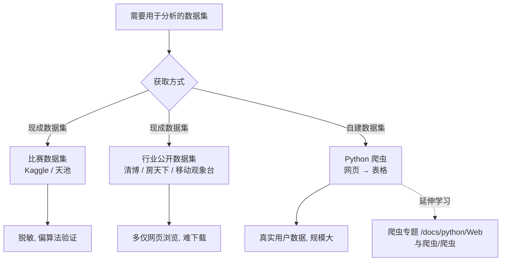

# 获取数据：公开数据集与 DIY 数据集

完成第一部分的学习后，已基本掌握 Python 的基础，并能够使用 Python 完成一些相对完整的功能开发。在此基础上，开始进入数据分析部分的学习。

本章围绕数据分析的第一步——数据获取展开。数据获取之所以是数据分析的第一步，原因显而易见：数据分析的前提是先有数据，而后才能分析。

在大厂的数据部门，获取数据相对容易，公司自身通常已沉淀大量数据。而作为普通个体，要获取适合练习分析技巧的数据并非易事，因为数据需具备一定规模，且来源于真实场景，满足这些条件才具有分析价值。

个人获取用于分析的数据集，主要通过两种途径：获取现成的数据集，或从互联网中自行构建数据集。

## 获取现成的数据集

获取数据集的第一种方式是使用行业内已整理好的数据集。目前大数据行业持续发展，数据本身已成为一种产业，自然也包括数据集。这些已整理好的数据集统称为现成数据集。

现成数据集大致分为两种：比赛数据集和行业数据集。

### 比赛数据集

高水平的数据分析大赛是大数据行业发展的有力佐证。目前数据分析比赛已不局限于数据分析师、数据科学家之间的切磋，而是逐渐演变为各公司将其业务中遇到的数据难题发布出来、由参赛者求解的平台，题目来自现实世界。

主流数据分析大赛的比赛题目通常为赞助商公司面临的实际问题，数据集也往往来自赞助商公司的真实数据，经脱敏后开放给所有参赛者。比赛中取得最好结果的团队可获得不菲奖金，其解决方案可以帮助公司确定后续业务方向，而比赛过程中公司贡献的数据集又为数据分析爱好者与初学者提供了学习材料。

初学者可以到数据分析大赛上寻找现成的数据集用于练习。目前数据分析比赛发展迅速，认可度较高的两个平台分别是国际上的 Kaggle 和国内的天池。

- Kaggle 是数据分析大赛的开创者，也是目前世界范围内规模最大的数据分析比赛，但存在两个问题：一是全英文网站，二是国内访问速度较慢，对新手不够友好。
- 天池是国内目前影响力最大的比赛平台，平台配置、数据集的丰富度都有保障，并设有系列新手赛帮助入门。

以天池平台为例，示范如何获得比赛的数据集。

（1）访问天池官网：[https://tianchi.aliyun.com/](https://tianchi.aliyun.com/)，并使用淘宝账户注册、登录。

（2）选择天池大赛 - 学习赛，进入学习赛题列表。

（3）下滑列表，选择二手车交易价格预测比赛，标题为："零基础入门数据挖掘 - 二手车交易价格预测"。

（4）进入比赛详情页后，点击报名参赛。

（5）点击左侧的赛题与数据，进入数据集页面，页面上方是数据集的下载链接，下方是数据集的描述。

分析比赛的数据集通常分为训练集和测试集，此阶段无需关注测试集，直接查看训练集(train.csv) 即可。

### 行业数据集

除比赛数据集外，还可以从一些行业公开网站上获得用于分析的数据。以下列举三个较常用的网站作为参考。

（1）清博智能：[http://www.gsdata.cn/](http://www.gsdata.cn/)

清博智能是聚焦新媒体行业的大数据服务网站，提供了大量新媒体渠道的榜单，如微信、头条、抖音等。登录后即可查看，并支持下载为 Excel 格式。

（2）房天下房价指数：[https://fdc.fang.com/index/](https://fdc.fang.com/index/)

该网站提供房价相关的数据集，但数据以表格形式提供，不提供 Excel 格式。

（3）移动观象台：[http://mi.talkingdata.com/app-rank.html](http://mi.talkingdata.com/app-rank.html)

移动观象台提供热门手机 App 的排行数据，手机 App 排行是数据分析的热点，很多公司希望通过分析榜单来把握用户的最新兴趣并调整业务方向。与房天下类似，移动观象台仅提供网页访问，不支持下载 Excel 或 CSV 格式文件。

### 存在的问题

无论是比赛数据集，还是行业公开数据集，都存在较明显的短板。

- 比赛数据集：数据均为脱敏数据，往往只能发现数据背后的隐藏关系，适合测试数据挖掘算法，对初级数据分析帮助不大。
- 行业公开数据集：绝大多数行业公开数据集只能提供网页浏览或 PDF，基本没有 Excel 可下载，难以在此基础上做自己的分析，且免费用户可访问的内容有限。

虽然可以通过数据分析比赛和部分行业数据网站访问数据，但这两个渠道都存在一定问题，不能完全满足数据分析的需求。因此需要寻找其他获取数据的途径。数据最多的地方无疑是互联网本身。

## 从广袤的互联网中构建数据集

互联网包含成千上万个网站，每个网站又包含大量帖子、评论、影评等内容，拥有取之不尽的数据。直接从互联网按需获取数据进行分析，是一种可行的途径。

一方面，来自互联网的分析数据均为真实用户产生，分析结论天然具备较高可信度。另一方面，互联网数据大多具备一定规模，非常适合用于实践各种数据分析技巧，是学习数据分析的良好素材。

互联网数据基本以一个个网页的形式呈现。主流数据分析通常基于表格，如 Excel 或 CSV 文件。需要解决的问题是：如何将互联网上的一个个网页转换为可分析的表格。

通过 Python 爬虫技术可以实现这一目标。下面介绍爬虫的基础，爬虫的具体实现会在后续章节逐一展开。

## 数据获取路径总览

> 爬虫部分详见 [Python 文档导航总览·爬虫](/docs/python/Web与爬虫/爬虫/01-爬虫概览与HTTP基础)。

### 什么是爬虫

爬虫是一类程序的名称，也称网络爬虫。爬虫程序的功能是下载网页并按照一定规则提取网页中的信息，而 Python 是当前最适合用来开发爬虫程序的语言。

通过一个例子说明爬虫的功能。

以某电视剧网站为例，页面呈现如下图所示。

该网站能够整理出一个电视剧的表格，例如下图所示：

一种方法是人工查看网页，将电视剧和主演逐条抄录到 Excel 中，但这种方式效率低，且电视剧有几十页，难以全部抄完。

另一种方式是通过 Python 爬虫，将网页中所需的内容（电视剧名、演员名）提取出来存放在 Python 列表中。由于整个过程由代码实现，无论最终有多少页，通过一个循环即可获得所有电视剧的信息，最后再将保存结果的列表存为 Excel 或 CSV 格式。相比人工抄写，效率提升显著。

爬虫虽然功能强大，其背后的原理和流程仍需要理解。

### 爬虫的主要流程

爬虫的原理与浏览器类似，如 Chrome、Edge 等。先说明浏览器的工作原理，以 Chrome 为例：

浏览器的流程大致分为四个步骤：

- 用户输入网址，指定想要访问的网页；
- 浏览器根据网址，向对应的服务器请求网页内容；
- 服务器将网页内容返回给浏览器；
- 浏览器将收到的网页内容在窗口中展示给用户。

了解了浏览器的工作流程后，来看爬虫的工作流程：

可以看到，爬虫的工作流程与浏览器非常相似，其中第二步和第三步与浏览器完全相同。爬虫的工作主要包括以下步骤：

- 在代码中指定要抓取的网页网址；
- 请求网址对应的服务器；
- 服务器返回网页内容；
- 根据指定规则提取感兴趣的内容（例如仅提取电视剧名字和演员名）。

从上面的例子可以看出，实现一个爬虫程序，主要实现三大模块：

- 数据请求：像浏览器一样，根据一个网址下载对应的网页内容。
- 网页分析：根据规则，从网页繁多的文字、图片中筛选出感兴趣的内容。
- 数据保存：将抓取到的感兴趣内容保存到 CSV、Excel 文件中，为后续分析环节做好准备。

接下来的三讲将逐一介绍这三个模块的实现，随后通过一个实战案例将所学知识串联起来，逐步从互联网中构建一个完整的数据集。

### 爬虫的注意事项

爬虫的功能十分强大，能力越强越需要正确使用，滥用往往会导致不良后果。

一方面，可以通过爬虫直接抓取互联网上的网页信息来构建数据集；另一方面，网站数据的所有权归属于网站自身。虽然爬虫在本质上与浏览器扮演的角色相同，但爬虫可以短时间内爬取大量网页和数据，因此在开发与使用爬虫技术时，需要注意以下两点：

- 适当降低抓取网页的频率，以免给网站服务器带来负担；
- 抓取到的数据仅作分析使用，切忌传播或销售，否则可能有违法风险。

## 小结

本章对个人获取数据集的方式做了概要介绍，主要分为两大类。

（1）获取现成的数据集

现成数据集又分为比赛数据集以及行业公开数据集。比赛数据集通常以 CSV 形式提供，适合做程序化分析，缺点是数据往往经过脱敏和清洗，比较适合测试数据挖掘算法，常规分析可能无法得出有价值的结论。行业数据集虽然更贴近真实世界，但往往不提供 CSV/Excel，只能通过网页访问，难以用于分析。

（2）通过爬虫技术自行构建数据集

现成数据集虽然方便，但各有各的限制。当现成数据集不能满足分析需要时，终极解决方案是通过爬虫技术，从互联网中构建数据集。

爬虫的工作原理类似浏览器，通过下载网页内容并根据规则提取其中的部分内容，最后保存到 CSV/Excel 文件中，即可将无限网页转换为可分析的数据集。

实现爬虫的关键是三个步骤，也是接下来的几讲会展开的内容：

- 下载网页；
- 分析提取网页里的内容；
- 将提取到的内容保存到文件。

## 版本差异（爬虫技术栈 → 当前版本）

| 库 | 本文编写时 | 当前稳定版 |
|----|-----------|-----------|
| `requests` | 2.28/2.31 | 2.32.x |
| `Scrapy` | 1.x/2.0 | 2.13.x（API 稳定，截至 2026-09） |
| `httpx` | 0.24 | 0.28.x |
| `Playwright` | 1.3x | 1.6x（Python 版） |
| `lxml`/`BeautifulSoup` | 旧版 | 保持稳定 |
| Python | 3.8-3.12 | 3.14（推荐） |

> 本文讲解的爬虫原理（HTTP、解析、反爬、存储）与核心 API 在最新版本中成立；注意 Python 3.9 及以下已 EOL，新项目使用 3.13/3.14。
