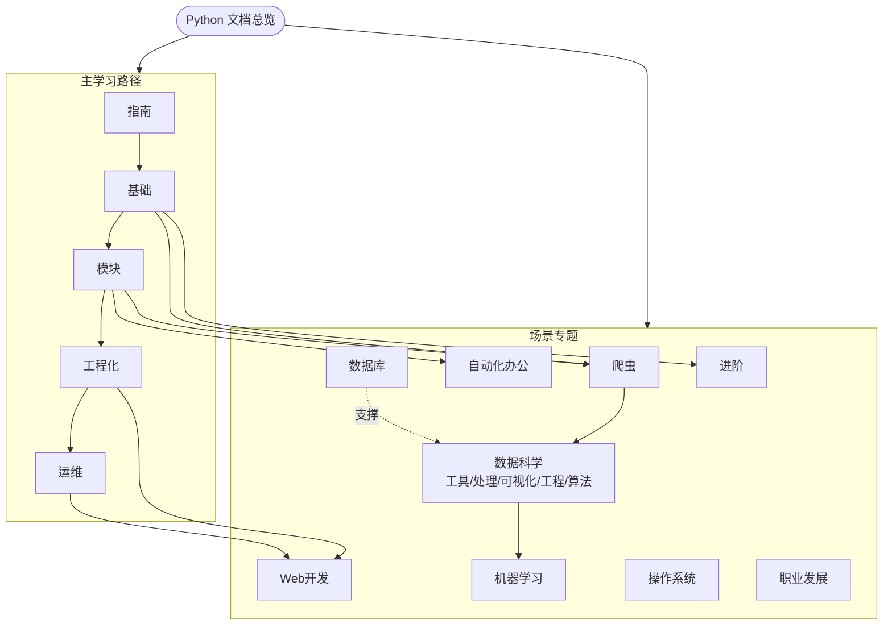

# Python 文档导航总览

> 本页是 `docs/Python` 的**唯一权威入口**。所有"基础知识索引 / 模块与库索引 / 工程化索引"等旧引用，均已统一指向本页与各分类目录。
> 主学习路径：指南 → 基础 → 模块 → 工程化 → 运维；场景专题横向展开。

## 一、主学习路径（循序渐进）

| 阶段 | 入口 | 内容 |
|------|------|------|
| 0 入门准备 | [入门指南与学习路线](/docs/python/基础与入门/01-入门指南与学习路线) · [开发环境与工具](/docs/python/基础与入门/02-开发环境与工具) | 环境搭建、路线规划、工具链 |
| 1 基础 | [基础](/docs/python/基础与入门/00-导航总览) | 语法、数据类型、流程控制、函数、面向对象 |
| 2 模块与库 | [模块](/docs/python/模块/01-Python模块)（[内置](/docs/python/模块/内置模块/01-os模块) · [第三方](/docs/python/模块/第三方模块/01-chardet)） | 标准库与常用第三方库 |
| 3 工程化 | [工程化](/docs/python/工程化与运维/工程化/01-代码规范) | 类型注解、测试、依赖管理、打包发布、CI/CD、项目结构 |
| 4 运维部署 | [工程化与运维](/docs/python/工程化与运维/工程化/01-代码规范) | 日志监控、性能优化、部署运维 |

## 二、场景专题（按方向深入）

| 专题 | 入口 | 适合方向 |
|------|------|----------|
| 爬虫 | [爬虫](/docs/python/Web与爬虫/爬虫/01-爬虫概览与HTTP基础) | 数据采集、逆向、分布式 |
| 数据科学 | [数据科学](/docs/python/数据科学/index) | 工具基础、数据处理、可视化、数据工程、算法建模（含量化金融） |
| Web 开发 | [Web开发](/docs/python/数据科学/07-量化金融/05-RESTful与Socket交易执行) | 后端、API |
| 自动化办公 | [自动化办公](/docs/python/自动化办公/01-文本文件操作) | 文件/报表/OCR |
| 数据库 | [数据库](/docs/python/进阶核心/数据库/01-关系型数据库) | 存储、SQL/NoSQL |
| 机器学习 | [机器学习](/docs/python/机器学习/01-人工智能概述) | ML/DL |
| 进阶 | [进阶](/docs/python/进阶核心/进阶/01-迭代器与生成器) | 并发、元编程、性能、内存 |
| 操作系统 | [操作系统](/docs/操作系统/01-计算机组成与程序执行) | 系统编程 |
| 职业发展 | [职业发展](/docs/python/归档/职业发展/01-硅谷技术公司工作体验) | 软技能、规划 |

## 三、信息架构图

## 四、使用建议

1. 零基础：按「主学习路径」顺序通读，每个阶段完成至少一个实战项目。
2. 有基础找方向：直接进「场景专题」对应入口。
3. 查具体 API：用站点搜索，或从本页进入对应分类目录。
