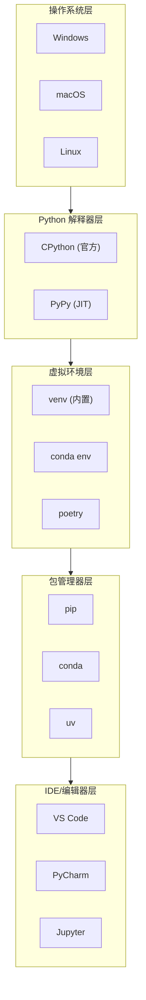
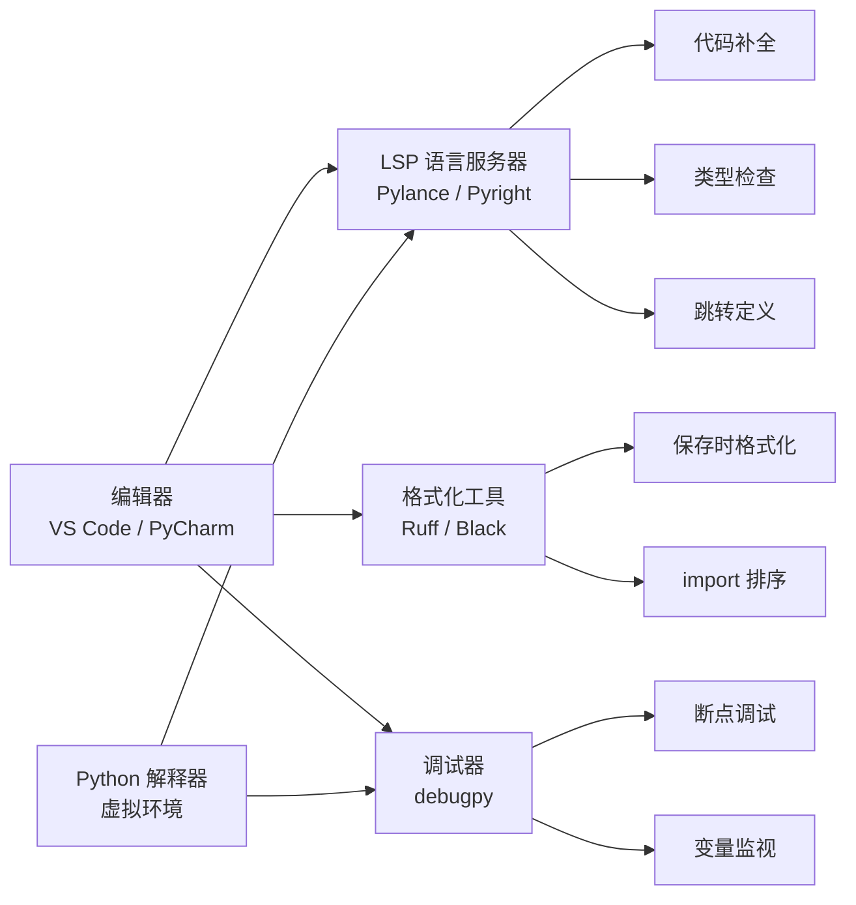
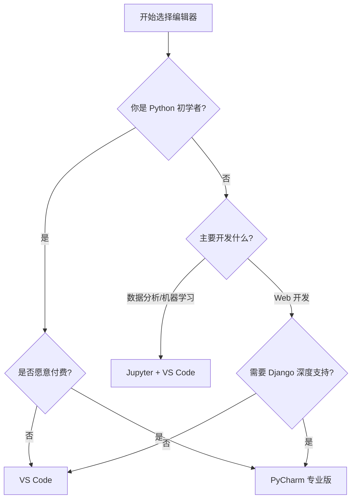
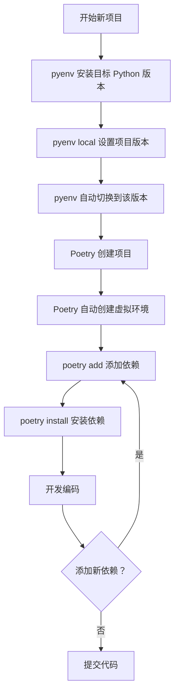

# Python 开发环境与工具

本页系统讲解 Python 开发环境的两大支柱：**编辑器配置**（VS Code、PyCharm、Jupyter）与**项目环境管理**（venv、pyenv、Poetry）。一个精心配置的开发环境能让你从"手写代码 + 手动运行"升级为"智能补全 + 实时检查 + 一键调试"，同时让依赖隔离、项目可复现。

## 前置阅读

- [入门指南与学习路线](/docs/python/基础与入门/01-入门指南与学习路线)：确保已安装 Python 并理解基本命令行操作
- [类型注解](/docs/python/工程化与运维/工程化/02-类型注解)：了解类型注解如何与编辑器类型检查器协作

---

## 开发环境概览与解释器

### 什么是 Python 开发环境？

**开发环境**（Development Environment）是指编写、运行、调试 Python 代码所需的软件工具集合。一个完整的 Python 开发环境包含以下核心组件：

| 组件 | 是什么 | 为什么需要 |
|------|--------|-----------|
| **Python 解释器** | 执行 Python 代码的程序 | 将源代码翻译成机器可执行的指令 |
| **包管理器** | 安装和管理第三方库的工具 | 复用社区代码，避免重复造轮子 |
| **虚拟环境** | 项目级别的依赖隔离机制 | 防止不同项目的依赖冲突 |
| **编辑器/IDE** | 编写代码的工具 | 提供语法高亮、自动补全、调试等功能 |

#### 开发环境架构层次



### Python 解释器详解

**解释器**（Interpreter）是一种将源代码逐行翻译成机器指令并执行的程序。Python 是解释型语言，需要解释器才能运行代码。

#### 主流 Python 解释器对比

| 解释器 | 实现语言 | 特点 | 适用场景 |
|--------|----------|------|----------|
| **CPython** | C | 官方实现，最稳定，生态最完善 | 生产环境、日常开发 |
| **PyPy** | RPython | **JIT**（即时编译），运行速度快 5-10 倍 | CPU 密集型任务 |
| **Jython** | Java | 运行在 **JVM** 上，可调用 Java 库 | Java 生态集成 |
| **IronPython** | C# | 运行在 .NET 上，可调用 .NET 库 | Windows/.NET 生态 |
| **IPython** | Python | 交互式增强，支持**魔法命令** | 数据分析、探索性编程 |

> 💡 日常开发默认选择 **CPython** 即可；需要极致性能且依赖较少时可评估 PyPy。IPython 的详细用法见 [03-IPython使用](/docs/python/基础与入门/03-IPython使用)。

#### 交互式解释器（REPL）

**REPL**（Read-Eval-Print Loop，读取-求值-打印循环）是 Python 的交互式环境，适合快速测试和学习：

```python
# 在终端输入 python3 启动交互式解释器
>>> 2 + 3              # 简单数学运算
5                      # 解释器立即输出结果
>>> import math
>>> math.sqrt(16)      # 调用 sqrt 函数
4.0
>>> def greet(name):
...     return f"Hello, {name}!"
>>> greet("Python")
'Hello, Python!'
>>> exit()             # 退出解释器（或 Ctrl+D）
```

---

## 第一部分：编辑器配置

> 如果你只想知道该选哪个编辑器，直接跳到[编辑器选择建议](#编辑器选择建议)。

### 为什么需要专业编辑器配置

:::: tip 核心收益
一个完整配置的 Python 编辑器环境，能让你在**写代码的同时**就获得编译级语言的反馈体验，而不是等运行报错才知道哪里出了问题。
::::

#### 代码补全与智能提示

专业编辑器通过 **LSP（Language Server Protocol，语言服务器协议）** 与 Python 语言服务器通信，实时分析你的代码：

- **自动补全**：输入变量名、函数名、模块名时，编辑器自动列出候选项，减少记忆负担和拼写错误
- **参数提示**：调用函数时自动显示参数名、类型和默认值，无需频繁查阅文档
- **跳转定义**：按住 Ctrl/Cmd 点击任意符号，直接跳转到其定义处
- **查找引用**：查看某个函数或变量在项目中的所有使用位置

```python
# 示例：编辑器在你输入时实时提供帮助
import json

data = {"name": "Alice", "age": 30}
# 输入 json. 时，编辑器自动列出所有可用方法
# 输入 json.dumps( 时，显示参数提示：dumps(obj, *, skipkeys=False, ...)
result = json.dumps(data, indent=2)
```

#### 类型检查

以 Pyright/Pylance 为代表的类型检查器，在你不运行代码的前提下就能发现潜在错误：

```python
# 类型检查器会在此处报错，因为试图把字符串传给期望整数的函数
def greet(name: str, times: int) -> str:
    return f"Hello {name}! " * times

greet("Alice", "five")  # 报错：Argument of type "str" cannot be assigned...
```

:::: info 类型检查 vs 运行时检查
类型检查器在**编码阶段**就发现问题，而 Python 的动态类型可能导致 bug 在运行时才暴露。类型注解不会影响运行时性能，但能显著提升代码质量。
::::

#### 调试

专业的调试器让你可以**暂停程序执行、查看变量值、单步执行代码**，而不需要到处插 `print()` 语句：

```python
def calculate_total(items):
    total = 0
    for item in items:
        # 在这里设置断点，可以查看每次循环时 item 和 total 的值
        total += item["price"] * item["quantity"]
    return total
```

#### 格式化自动化

:::: warning 不配置自动格式化的代价
手动调整缩进、换行、空格不仅浪费时间，还容易引入不一致的风格。团队成员的不同风格混在一起，会导致 Git diff 充满无意义的格式变更。
::::

配置格式化工具后，每次保存文件时自动执行：

- **Ruff**：自动修复格式问题（行长度、空格、引号风格等）并检测代码异味
- **Black**（备选）：零配置的代码格式化工具，确保团队风格统一
- **isort**：自动排序 import 语句

### 工具链全景



### VS Code 最佳配置（推荐）

VS Code 是目前 Python 开发最流行的编辑器，其轻量、免费、插件生态丰富。以下配置适用于 VS Code 1.85+ 版本。

#### 必装插件

| 插件名称 | 标识符 | 作用 | 优先级 |
|---|---|---|---|
| **Python** | `ms-python.python` | Python 语言基础支持：运行、调试、环境切换 | 必须 |
| **Pylance** | `ms-python.vscode-pylance` | 高性能语言服务器：类型检查、自动补全 | 必须 |
| **Ruff** | `charliermarsh.ruff` | 极速代码格式化和风格检查 | 强烈推荐 |
| **Even Better TOML** | `tamerbleck.better-toml` | `.toml` 文件语法高亮和校验 | 推荐 |

:::: tip 为什么推荐 Ruff 而不是分别配置 Flake8 + Black + isort？
Ruff 由 Rust 实现，速度比传统 Python 工具快 10-100 倍，且一个工具覆盖了格式化、代码风格检查、import 排序三类功能，配置更简洁。
::::

#### settings.json 推荐配置

在 VS Code 中按 `Ctrl+Shift+P`（macOS: `Cmd+Shift+P`），选择 "Preferences: Open Workspace Settings (JSON)"，粘贴以下配置：

```json
{
  "python.languageServer": "Pylance",
  "python.analysis.typeCheckingMode": "basic",
  "python.analysis.autoImportCompletions": true,
  "[python]": {
    "editor.defaultFormatter": "charliermarsh.ruff",
    "editor.formatOnSave": true,
    "editor.codeActionsOnSave": {
      "source.fixAll.ruff": "explicit",
      "source.organizeImports.ruff": "explicit"
    }
  },
  "editor.rulers": [88],
  "editor.tabSize": 4,
  "editor.insertSpaces": true,
  "files.trimTrailingWhitespace": true,
  "python.defaultInterpreterPath": "${workspaceFolder}/.venv/bin/python"
}
```

#### launch.json 调试配置示例

在项目根目录的 `.vscode/launch.json` 中配置调试启动项：

```json
{
  "version": "0.2.0",
  "configurations": [
    {
      "name": "Python: 当前文件",
      "type": "debugpy",
      "request": "launch",
      "program": "${file}",
      "console": "integratedTerminal",
      "justMyCode": false
    },
    {
      "name": "Python: Pytest 当前文件",
      "type": "debugpy",
      "request": "launch",
      "module": "pytest",
      "args": ["${file}", "-v", "-s"],
      "console": "integratedTerminal",
      "justMyCode": false
    }
  ]
}
```

:::: warning 调试器名称变更
从 VS Code 2024 年 4 月版本开始，Python 调试器从 `"python"` 更名为 `"debugpy"`。旧版 VS Code 请将 `"type"` 字段改为 `"python"`。
::::

#### 多 Python 环境切换

按 `Ctrl+Shift+P`（macOS: `Cmd+Shift+P`），输入 "Python: Select Interpreter"，从列表中选择目标环境（`.venv/bin/python`、系统 Python、Conda 环境）。VS Code 状态栏左侧会显示当前 Python 版本和环境名称。

### PyCharm 配置要点

PyCharm 是 JetBrains 出品的 Python IDE。对于纯 Python 开发，社区版已足够；专业版额外提供 Web 开发（Django/Flask）、数据库工具等高级功能。

#### 专业版 vs 社区版

| 功能 | 社区版（免费） | 专业版（付费） |
|---|---|---|
| Python 代码补全与重构 | 完整支持 | 完整支持 |
| 调试器 | 完整支持 | 完整支持 |
| Web 框架支持（Django/Flask） | 不支持 | 完整支持 |
| 数据库工具 | 不支持 | 内置 DataGrip |
| 远程开发 | 不支持 | 支持 |

#### 项目解释器设置

1. 打开 **File > Settings**（macOS: **PyCharm > Preferences**）
2. 导航到 **Project > Python Interpreter**
3. 点击齿轮图标，选择 **Add...** > "Virtualenv Environment" > "New environment"
4. PyCharm 会自动在项目目录下创建 `venv/` 文件夹

#### 代码风格配置

- **Settings > Editor > Code Style > Python**：将 "Hard wrap at" 设置为 88 列（与 Black 一致）
- **Settings > Tools > External Tools**：添加 Ruff 作为外部工具（Program: `ruff`，Arguments: `check --fix $FilePath$`）

#### Black 格式化工具集成

```bash
pip install black
black main.py       # 格式化单个文件
black mypackage/    # 格式化整个目录
```

### Jupyter Notebook / Lab 定位

Jupyter 不是传统意义上的"编辑器"，而是一个**交互式计算环境**，以"单元格"为单位组织代码。

| 场景 | 适合 Jupyter | 适合传统编辑器 |
|---|---|---|
| 数据探索与清洗 | 非常适合 | 一般 |
| 机器学习实验 | 非常适合 | 一般 |
| 大型项目开发 | 不适合 | 非常适合 |
| 版本控制 | 困难 | 简单 |

:::: tip 正确使用姿势
把 Jupyter 当作**探索式编程的草稿纸**，而不是**工程化开发的主战场**。在 Jupyter 中快速验证想法、探索数据，确认可行后，将核心逻辑迁移到 `.py` 文件并纳入版本控制。
::::

### 常见编辑器陷阱

| 陷阱 | 现象 | 解决方案 |
|---|---|---|
| **Pylance 与 Jedi 冲突** | 代码补全混乱 | 确认 `python.languageServer` 为 `"Pylance"`，不要设置为 `"Jedi"` |
| **解释器指向错误环境** | `import` 报"模块未找到"但 pip 已装 | 在状态栏点击 Python 版本号，选择正确的虚拟环境 |
| **Ruff 与 Black 同时格式化** | 保存时格式反复变化 | 只保留 Ruff 作为 `defaultFormatter` |

### 编辑器选择建议



**推荐总结**：
- **新手入门**：VS Code + Python 插件 + Pylance + Ruff
- **专业开发（Web 方向）**：PyCharm 专业版
- **数据分析/机器学习**：Jupyter + VS Code 组合

---

## 第二部分：项目环境管理

> 本部分帮助你从"全局 pip install"的混乱中解脱出来，建立可复现、可隔离、可协作的开发环境。

### 为什么需要环境管理

#### 问题一：依赖冲突

假设你同时维护两个项目：项目 A 需要 `requests==2.28.0`，项目 B 需要 `requests==2.31.0`。如果所有包都装在全局环境中，只能保留一个版本，另一个项目必然出问题。这就是经典的"依赖地狱"（Dependency Hell）。

#### 问题二：版本隔离

Python 本身也在快速迭代。Python 3.8、3.10、3.12 之间存在语法和标准库差异。本地用 3.12 开发的代码，部署到 3.10 生产服务器可能崩溃。

#### 问题三：项目可复现

"在我电脑上能跑"是最令人沮丧的反馈。可复现意味着：**任何人在任何时间，拿到你的项目代码，都能通过固定的命令重建出完全相同的运行环境**。

### 方案对比

| 方案 | 核心功能 | 适用场景 | 推荐度 |
|---|---|---|---|
| **venv** | 虚拟环境隔离 | 初学者、小型项目 | 推荐 |
| **virtualenv** | 虚拟环境（venv 增强版） | 需要更快创建速度 | 一般 |
| **conda / miniconda** | 环境 + 包管理 + 非 Python 依赖 | 数据科学、机器学习 | 推荐 |
| **pyenv** | Python 版本管理 | 需要管理多个 Python 版本 | 强烈推荐 |
| **Poetry** | 依赖管理 + 打包 + 发布 | 正式项目、团队协作 | 强烈推荐 |
| **pipenv** | 依赖管理 + 虚拟环境 | 曾主流，现被 Poetry 取代 | 不推荐 |

### pip 包管理详解

**pip**（Pip Installs Packages）是 Python 的官方包管理器，随 Python 3.4+ 自动安装。

#### 基本命令

```bash
# 安装包
pip install requests                # 安装最新版本
pip install requests==2.28.0        # 安装指定版本
pip install "requests>=2.28.0,<3.0.0"  # 安装版本范围

# 升级/卸载
pip install -U requests             # 升级到最新版本
pip uninstall requests -y           # 卸载包（-y 跳过确认）

# 查看已安装
pip list                            # 列出所有已安装包
pip show requests                   # 显示某包详细信息
pip list --outdated                 # 列出有新版本的包

# 导出/导入依赖
pip freeze > requirements.txt       # 导出"包名==版本"到文件
pip install -r requirements.txt     # 从文件批量安装
```

#### requirements.txt 详解

```text
# 基本格式：包名==版本号（精确锁定版本）
requests==2.28.0
numpy==1.24.0

# 使用比较运算符（灵活指定版本范围）
flask>=2.0.0           # 大于等于 2.0.0
scipy>=1.9.0,<2.0.0    # 版本范围

# 包含其他 requirements 文件
-r requirements-dev.txt
```

#### 包管理器对比

| 特性 | pip | conda | poetry | uv |
|------|-----|-------|--------|-----|
| **是什么** | Python 官方包管理器 | Anaconda 包管理器 | 现代依赖管理工具 | Rust 实现的高速工具 |
| **适用场景** | 日常开发 | 数据科学、机器学习 | 项目依赖管理 | CI/CD、大型项目 |
| **依赖解析** | 顺序解析，可能冲突 | SAT 求解器，更可靠 | 完整依赖锁定 | 快速解析 |
| **安装速度** | 中等 | 较慢 | 中等 | 极快（10-100x） |

#### 国内 pip 源配置

```bash
# 临时使用镜像（单次生效）
pip install -i https://pypi.tuna.tsinghua.edu.cn/simple numpy

# 永久配置镜像
mkdir -p ~/.pip
cat > ~/.pip/pip.conf << EOF
[global]
index-url = https://pypi.tuna.tsinghua.edu.cn/simple
trusted-host = pypi.tuna.tsinghua.edu.cn
EOF
```

### conda 环境管理

conda 是 Anaconda 生态的核心工具，不仅能管理 Python 包，还能管理非 Python 的二进制依赖（如 C 库、CUDA）。数据科学和机器学习领域几乎标配 conda。

#### 常用命令

```bash
# 创建环境（指定 Python 版本，当前最新稳定版为 3.14）
conda create --name myenv python=3.14

# 查看所有环境
conda env list

# 激活/退出环境
conda activate myenv
conda deactivate

# 在环境中安装包
conda install numpy
# conda 仓库没有的包，用 pip 安装
pip install some-pip-only-package

# 导出/复现环境
conda env export > environment.yml
conda env create -f environment.yml

# 删除/克隆环境
conda env remove --name myenv
conda create --name myenv-copy --clone myenv
```

#### environment.yml 文件格式

```yaml
# environment.yml - conda 环境配置文件
name: datascience
channels:
  - conda-forge
  - defaults
dependencies:
  - python=3.14
  - numpy=2.3
  - pandas=3.0
  - pip
  - pip:
    - requests==2.32.4
```

### venv 完整操作指南

#### 创建虚拟环境

```bash
cd my-project
python3 -m venv .venv
```

:::: tip 命名约定
推荐使用 `.venv` 作为虚拟环境目录名，以 `.` 开头自动隐藏，且大多数工具（VS Code、Poetry 等）默认识别该名称。
::::

#### 激活虚拟环境

```bash
# macOS / Linux (bash/zsh)
source .venv/bin/activate

# Windows (命令提示符)
.venv\Scripts\activate.bat
```

激活成功后，终端提示符前会出现 `(.venv)` 标识，所有 `pip install` 和 `python` 命令都指向虚拟环境内的解释器。

#### 安装依赖与退出

```bash
# 安装依赖
pip install requests
pip freeze > requirements.txt   # 导出依赖

# 退出虚拟环境
deactivate

# 删除虚拟环境（本质就是删除目录）
rm -rf .venv
```

:::: warning 注意
虚拟环境目录**不可移动**。复制到另一个路径后，其中的脚本路径会失效。换个位置就重新创建。
::::

### pyenv 安装与切换 Python 版本

```bash
# macOS（推荐 Homebrew）
brew install pyenv

# 常用命令
pyenv install 3.12.4        # 安装指定版本
pyenv versions              # 查看已安装版本
pyenv global 3.12.4         # 设置全局默认版本
pyenv local 3.10.14         # 为当前项目设置版本（生成 .python-version 文件）
```

:::: tip .python-version 文件
执行 `pyenv local 3.10.14` 后，当前目录会生成 `.python-version` 文件。将此文件提交到 Git，团队成员安装 pyenv 后进入项目目录会自动切换到正确版本。
::::

### Poetry 项目初始化与依赖管理

Poetry 是现代 Python 项目的推荐工具，使用 `pyproject.toml` 作为唯一配置文件。

#### 安装与创建项目

```bash
# 安装 Poetry（推荐 pipx）
pipx install poetry

# 创建新项目
poetry new my-awesome-project

# 在已有项目中初始化
cd existing-project && poetry init
```

#### 添加依赖与安装

```bash
# 添加运行依赖
poetry add requests

# 添加开发依赖
poetry add --group dev pytest black ruff

# 安装所有依赖（读取 poetry.lock 精确安装）
poetry install

# 运行命令
poetry run python main.py
```

#### pyproject.toml 示例

```toml
[tool.poetry]
name = "my-awesome-project"
version = "0.1.0"
description = "一个示例项目"
python = "^3.10"

[tool.poetry.dependencies]
python = "^3.10"
requests = "^2.31.0"

[tool.poetry.group.dev.dependencies]
pytest = "^8.0"
ruff = "^0.3.0"

[build-system]
requires = ["poetry-core"]
build-backend = "poetry.core.masonry.api"
```

### pyenv + Poetry 组合工作流

将 pyenv（管理 Python 版本）和 Poetry（管理项目依赖）组合使用，是当前最推荐的环境管理方案：



工作流说明：
1. **pyenv** 负责"用哪个 Python 解释器"——通过 `.python-version` 文件固化版本号
2. **Poetry** 负责"用哪些包、什么版本"——通过 `pyproject.toml` 声明依赖，`poetry.lock` 锁定精确版本

### requirements.txt vs pyproject.toml

| 维度 | `requirements.txt` | `pyproject.toml` |
|---|---|---|
| **角色** | 安装清单（扁平列表） | 项目配置中心（结构化声明） |
| **依赖锁定** | 不支持（需配合 `pip freeze`） | 配合 `poetry.lock` 精确锁定 |
| **开发依赖** | 需手动拆分文件 | 原生支持 `dev` 分组 |
| **推荐场景** | 遗留项目、简单脚本 | 新项目默认选择 |

:::: tip 何时用 requirements.txt
`requirements.txt` 并未被淘汰，在简单脚本、遗留项目维护、Docker 构建中仍然有效。但**新项目**应优先使用 `pyproject.toml`。
::::

### 常见环境管理陷阱

| 陷阱 | 后果 | 正确做法 |
|---|---|---|
| 全局 `pip install` | 依赖冲突，环境越来越乱 | 每个项目都用虚拟环境 |
| 忘记激活环境就运行 | 使用了全局 Python 或错误版本 | 终端提示符看到 `(.venv)` 再运行 |
| 把 `.venv/` 提交到 Git | 仓库体积暴增 | 在 `.gitignore` 中添加 `.venv/` |
| 虚拟环境目录移动位置 | 脚本路径失效 | 创建后不要移动，换位置就重建 |
| 不锁版本号 | 每次安装得到不同版本 | 用 `poetry.lock` 精确锁定 |

#### 陷阱详解

**陷阱 1：pip install 权限错误**

```bash
# 现象：OSError: [Errno 13] Permission denied
# 原因：尝试安装到系统级目录，当前用户无写权限
# 方案一（推荐）：使用虚拟环境
python3 -m venv myenv && source myenv/bin/activate
pip install requests
# 方案二（次选）：使用 --user 参数
pip install --user requests
# 方案三（不推荐）：sudo pip install，可能导致系统环境冲突
```

**陷阱 2：多版本 Python 共存**

```bash
# 现象：python 指向 Python 2，python3 指向 Python 3
# 最佳实践：明确使用 python3 命令；用虚拟环境；或用 pyenv 管理多版本
pyenv install 3.9.0
pyenv install 3.11.0
pyenv global 3.11.0    # 设置全局默认
pyenv local 3.9.0      # 为当前项目设置
```

**陷阱 3：虚拟环境激活后仍使用系统 Python**

```bash
# 现象：激活后 which python 仍指向系统 Python
# 排查：检查 PATH（虚拟环境 bin 应在最前）；检查 VIRTUAL_ENV 变量
echo $PATH
cat myenv/bin/activate | grep VIRTUAL_ENV
# 最可靠修复：删除重建虚拟环境
deactivate && rm -rf myenv
python3 -m venv myenv && source myenv/bin/activate
```

**陷阱 4：python vs python3 路径不一致**

```bash
# 现象：python 指向 3.9，python3 指向 3.11，版本不一致
# 最佳实践：始终使用 python3 -m pip 安装，确保装到正确环境
python3 -m pip install requests   # -m 确保装到 python3 对应环境
```

### 最佳实践

1. **每个项目一个虚拟环境**：无论项目多小，都创建独立虚拟环境。
2. **用 `.python-version` 统一 Python 版本**：配合 pyenv 自动切换。
3. **锁文件必须提交到 Git**：`poetry.lock` 纳入版本控制，`.venv/` 加入 `.gitignore`。
4. **区分运行依赖和开发依赖**：生产部署只装运行依赖，镜像更小。
5. **依赖版本使用语义化约束**：`requests = "^2.31.0"`，不要写死版本。
6. **定期更新和安全审计**：`poetry update`、`pip-audit`。
7. **使用 pipx 安装全局工具**：`poetry`、`ruff`、`black` 等命令行工具用 pipx 隔离安装。

#### 新项目初始化清单

```bash
# 1. 创建项目目录并进入
mkdir myproject && cd myproject

# 2. 创建虚拟环境（.venv 是推荐命名）
python3 -m venv .venv

# 3. 激活虚拟环境
source .venv/bin/activate    # macOS/Linux
# .venv\Scripts\activate     # Windows

# 4. 升级 pip 并安装开发工具
pip install --upgrade pip
pip install black ruff pytest

# 5. 创建 .gitignore（排除虚拟环境、缓存）
cat > .gitignore << 'EOF'
.venv/
__pycache__/
*.pyc
EOF
```

### 术语表

| 术语 | 英文 | 定义 |
|---|---|---|
| 虚拟环境 | Virtual Environment | 含独立 Python 解释器和 site-packages 的目录，实现依赖隔离 |
| 依赖锁定 | Dependency Locking | 将依赖解析结果固定为精确版本号 |
| 锁文件 | Lock File | 记录完整依赖树精确版本的文件（如 `poetry.lock`） |
| LSP | Language Server Protocol | 语言服务器协议，编辑器与语言分析工具的通信标准 |
| Pylance | — | 微软开发的 Python 语言服务器，基于 Pyright |
| Ruff | — | 基于 Rust 的 Python 代码格式化和风格检查工具 |
| debugpy | — | VS Code 的 Python 调试适配器 |

### 延伸阅读

- [类型注解](/docs/python/工程化与运维/工程化/02-类型注解) —— 类型注解与编辑器类型检查器协作
- [测试](/docs/python/工程化与运维/工程化/03-测试) —— 在编辑器中配置和运行测试
- [工程化：依赖管理](/docs/python/工程化与运维/工程化/04-依赖管理) —— `pyproject.toml` 的依赖声明策略
- [VS Code Python 官方文档](https://code.visualstudio.com/docs/python/python-tutorial)
- [Poetry 官方文档](https://python-poetry.org/docs/)
- [pyenv 官方仓库](https://github.com/pyenv/pyenv)

### 版本差异（Python 3.8-3.12 → 3.14）

| 特性 | 本文编写时 | Python 3.14 |
|------|-----------|-------------|
| 类型注解求值 | 运行时立即求值 | PEP 649/749 延迟求值：注解不再在定义时执行，解决前向引用，提升启动性能 |
| 字符串模板 | 普通 f-string / `str.format` | PEP 750 模板字符串 `t"..."`：可插值且能被安全处理（3.14 新特性） |
| 标准库多解释器 | 无官方支持 | PEP 734：`concurrent.interpreters` 模块支持在同一进程创建多个子解释器 |
| 调试 | 仅 Python 内建 pdb / IDE 调试 | PEP 768：安全的 CPython 外部调试器接口（custom debugger protocol） |
| 字节码与运行时 | 3.12 前无 JIT | 3.13 引入实验性 JIT（PEP 744）；3.14 进一步改进 free-threaded（无 GIL）构建 |
| `datetime` API | `utcnow()` 常用 | 3.12 起弃用，官方要求改用 `datetime.now(tz=datetime.UTC)`（aware 对象） |
| 压缩算法 | zlib / gzip / bz2 / lzma | 3.14 新增标准库 Zstandard 支持（PEP 784） |

> 本文讲解的语法与数据结构原理在 3.14 中依然成立；新项目建议基于 Python 3.13/3.14，并优先使用 aware datetime、PEP 649 注解与最新类型语法。
