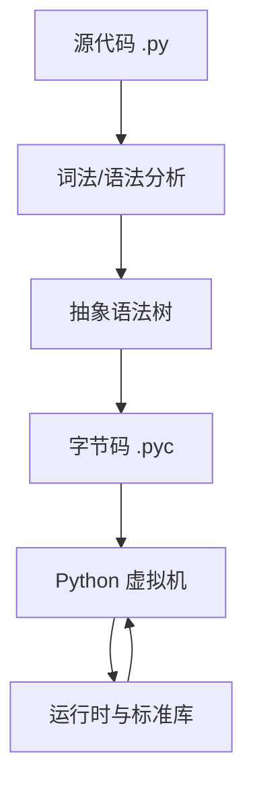
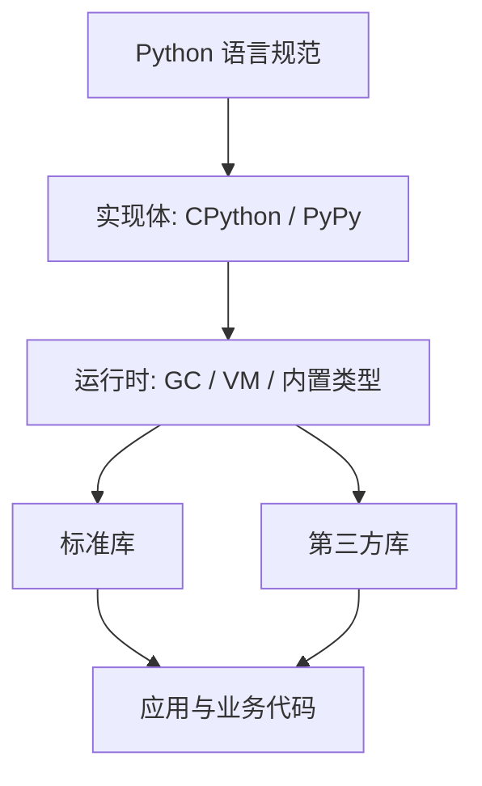
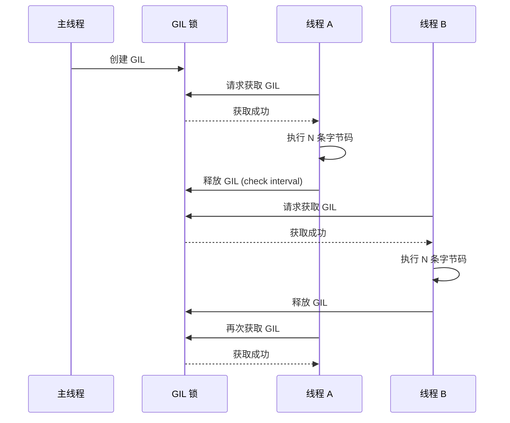

# Python 简介

## 概述

Python 是一种解释型高级编程语言，具备动态类型与自动内存管理能力。它支持多范式编程（过程式、面向对象、函数式），强调代码可读性与简洁语法，并以缩进作为代码块的结构标识。本文以 CPython 为主要参考实现，面向初学者与工程实践者提供结构化概览。

**核心能力概览：**

- 易读语法与开发效率
- 完整标准库与成熟生态
- 跨平台运行与良好可移植性
- 丰富的工程实践与社区支持

## 术语与约定

| 术语           | 含义                       | 说明                           |
| -------------- | -------------------------- | ------------------------------ |
| Python         | 语言规范与生态总称         | 指语言语法、标准库与第三方生态 |
| 实现（实现体） | Python 语言的具体实现      | CPython、PyPy、MicroPython 等  |
| 解释器         | 执行 Python 代码的运行程序 | 常见为 CPython 解释器          |
| 标准库         | 随 Python 一同发布的库     | 例如 `pathlib`、`json`         |
| 第三方库       | 通过包管理器安装的库       | 例如 `requests`、`numpy`       |
| 虚拟环境       | 项目级依赖隔离的运行环境   | 例如 `venv`、`conda`           |
| 包管理器       | 安装与管理依赖的工具       | 例如 `pip`、`poetry`           |

## 系统架构与执行流程

以 CPython 为例，代码从源码到执行的大致流程如下图所示：



## 核心功能模块与标准库

Python 的核心能力主要由运行时与标准库提供，常用模块可按场景分类：

| 场景           | 说明                 | 常用模块                                       |
| -------------- | -------------------- | ---------------------------------------------- |
| 数据结构与算法 | 高效组织与遍历数据   | `collections`、`itertools`、`heapq`            |
| 并发与异步     | 多线程、多进程与协程 | `threading`、`multiprocessing`、`asyncio`      |
| IO 与文件      | 文件与路径处理       | `pathlib`、`io`、`os`、`shutil`                |
| 网络与协议     | 基础网络与数据交换   | `socket`、`http`、`urllib`、`json`             |
| 数据持久化     | 本地存储与交换格式   | `sqlite3`、`csv`、`pickle`                     |
| 工具与调试     | 日志、命令行与类型   | `logging`、`argparse`、`typing`、`dataclasses` |

## 内置 API 接口说明

Python 的 API 主要分为内置函数与标准库接口两层：

| API 类型 | 主要范围       | 典型接口                     | 说明               |
| -------- | -------------- | ---------------------------- | ------------------ |
| 内置函数 | 解释器全局可用 | `print`、`len`、`sum`、`zip` | 无需导入，直接使用 |
| 标准库   | 随解释器发布   | `pathlib.Path`、`json`       | 需显式导入         |
| 第三方库 | 通过安装获得   | `requests`、`numpy`          | 需安装后导入       |

**使用示例：**

```python
numbers = [1, 2, 3, 4]
# 计算列表总和
total = sum(numbers)
# 将两个序列组合为键值对字典
mapping = dict(zip(["a", "b"], [1, 2]))
print(total, mapping)
```

```python
from pathlib import Path
import json

# 读取文本文件并解析 JSON
data = json.loads(Path("config.json").read_text(encoding="utf-8"))
# 安全获取配置项并设置默认值
timeout = data.get("timeout", 10)
print(timeout)
```

**接口使用约定：**

- 内置函数适合基础操作与快速验证
- 标准库适合生产级通用能力
- 第三方库适合高阶能力与特定领域需求

::: tip Python 的命名由来
Python 由 `Guido van Rossum`（吉多·范罗苏姆）在 1989 年开始设计，并于 1991 年发布首个版本。Python 的命名与蟒蛇无关，而是来源于 Guido 喜欢的英国喜剧团体 Monty Python（巨蟒剧团）。这也解释了为什么社区中常出现与 Monty Python 相关的彩蛋和引用。

:::

## Python 的特点

### 简洁易读

Python 语法简单明了，接近自然语言，使得代码易于阅读和编写。相比其他语言，Python 通常可用更少的代码完成同样的任务。

### 丰富的库

Python 提供完善的标准库，覆盖网络、文件、GUI、数据库、文本等常用能力。除标准库外，还有大量成熟的第三方库可直接使用。

### 跨平台

Python 可以在多种操作系统上运行，包括 Windows、Linux、macOS 等，使得程序具备良好的可移植性。

### 开源

Python 是开源的，任何人都可以免费使用和分发。这促进了社区的快速发展，使生态系统不断丰富。

## 缺点

### 运行速度慢

Python 通常比 C/C++ 慢，主要原因在于解释执行与动态类型带来的运行时开销。对于性能敏感的部分，常见优化方式包括使用高性能库、改进算法、引入并行或 JIT 解释器。

> 例如开发一个下载 MP3 的网络应用程序，C 程序的运行时间需要 0.001 秒，而 Python 程序的运行时间需要 0.1 秒，慢了 100 倍，但由于网络更慢，需要等待 1 秒。用户是不能感觉到 1.001 秒和 1.1 秒的区别。

### 代码不能加密

发布 Python 程序通常会包含可读的源码或字节码。生产环境更推荐通过服务端部署、权限控制与依赖隔离来降低代码暴露风险，而不是依赖“加密源码”作为主要安全手段。

该限制主要影响以“分发软件授权”为主的商业模式。在当前互联网时代，服务型模式更常见，此时通常不需要向外部交付源码。

::: danger

互联网上有无数非常优秀的像 `Linux` 一样的开源代码，千万不要高估自己写的代码真的有非常大的“商业价值”。

那些大公司的代码不愿意开放的更重要的原因是代码写得太烂了，一旦开源就没人敢用他们的产品

:::

## 应用领域

Python 在许多领域都有广泛应用：

### Web 开发

许多大型网站就是用 Python 开发的，例如 `YouTube`、`Instagram`，还有国内的豆瓣。很多大公司包括 `Google`、`Yahoo` 等也在广泛使用 Python

### 数据科学与人工智能

Python 是数据分析和机器学习的首选语言，拥有强大的数据分析和可视化库，如 NumPy、Pandas、Matplotlib、TensorFlow 等

### 自动化脚本

Python 非常适合编写系统管理、自动化测试、网络管理等脚本，可以大大提高工作效率。Python 的简洁语法使得编写自动化脚本变得非常高效。

### 游戏开发

Python 有 Pygame 等库可以用于游戏开发，虽然不是主流选择，但对于一些小游戏和原型开发非常合适。一些知名游戏如《文明 IV》的部分功能就是用 Python 开发的。

### 桌面应用

Python 有 Tkinter、PyQt、wxPython 等库可以开发桌面应用程序。虽然性能不如原生应用，但对于中小型应用来说已经足够。

### 网络爬虫

Python 拥有强大的网络爬虫库，如 Scrapy、BeautifulSoup、Requests 等，使得数据采集变得简单高效。

### 科学计算

Python 在科学计算领域也有广泛应用，SciPy、SymPy 等库为科学计算提供了强大的支持。

## 学习资源

### 官方资源

- Python 官方网站: https://www.python.org/
- Python 官方文档: https://docs.python.org/zh-cn/3/
- Python 社区: https://www.python.org/community/

### 开发工具

- **PyCharm**: https://www.jetbrains.com/pycharm/ - 专业的 Python IDE，提供强大的代码补全、调试和项目管理功能
- **Visual Studio Code**: https://code.visualstudio.com/ - 轻量级编辑器，配合 Python 插件可以成为强大的开发环境
- **Jupyter Notebook**: https://jupyter.org/ - 交互式计算环境，特别适合数据科学和教学
- **Sublime Text**: https://www.sublimetext.com/ - 轻量级文本编辑器，支持 Python 语法高亮
- **Vim/Neovim**: 命令行编辑器，配合 Python 插件可以成为高效的开发工具
- **pip**: https://pip.pypa.io/en/stable/installation/ - Python 包管理器，用于安装和管理第三方库

### 在线教程

- Python 基础教程: https://www.liaoxuefeng.com/wiki/1016959663602400
- 菜鸟教程: https://www.runoob.com/python3/python3-tutorial.html
- Real Python: https://realpython.com/ - 英文教程网站
- Python Crash Course: https://nostarch.com/pythoncrashcourse2e - 著名入门书籍

## 配置参数详解

以下为常用运行时环境变量与行为配置，适用于多数解释器实现（以 CPython 为主）：

| 参数名                    | 作用                | 典型场景               | 示例                        |
| ------------------------- | ------------------- | ---------------------- | --------------------------- |
| `PYTHONPATH`              | 扩展模块搜索路径    | 临时加入自定义包目录   | `PYTHONPATH=./src`          |
| `PYTHONUTF8`              | 强制 UTF-8 文本模式 | 统一编码行为           | `PYTHONUTF8=1`              |
| `PYTHONDONTWRITEBYTECODE` | 禁止生成 `.pyc`     | 只读环境或减少磁盘写入 | `PYTHONDONTWRITEBYTECODE=1` |
| `PYTHONHASHSEED`          | 设置哈希随机种子    | 可重复性实验           | `PYTHONHASHSEED=0`          |
| `PYTHONWARNINGS`          | 控制警告级别与过滤  | CI/测试环境            | `PYTHONWARNINGS=default`    |
| `PYTHONIOENCODING`        | 设置标准 IO 编码    | 输出编码统一           | `PYTHONIOENCODING=utf-8`    |

**使用示例：**

```bash
# 指定模块搜索路径并开启 UTF-8 模式
export PYTHONPATH=./src
export PYTHONUTF8=1
python -m myapp
```

**说明：**

- 以上参数均为进程级配置，只影响当前 Python 进程及其子进程
- 若使用虚拟环境，建议将长期配置写入项目级脚本或启动命令

## 系统架构补充视图

Python 运行时与生态的层次结构可简化理解为如下结构：



## GIL 机制与多线程限制

CPython 中的 **GIL（Global Interpreter Lock，全局解释器锁）** 是一个互斥锁，它确保同一时刻只有一个线程执行 Python 字节码。这是 Python 运行速度慢的根本原因之一，也是多线程无法真正并行的原因。

### GIL 的工作机制



**关键参数**：`sys.getswitchinterval()` 默认为 0.005 秒（5ms），即每隔 5ms 线程会主动释放 GIL 让其他线程执行。

```python
import sys
print(sys.getswitchinterval())  # 输出: 0.005 (5ms)
```

### GIL 的影响范围

| 场景 | GIL 影响 | 解决方案 |
|------|---------|---------|
| CPU 密集型任务 | ❌ 多线程无法加速 | 使用 `multiprocessing` 或 C 扩展释放 GIL |
| IO 密集型任务 | ✅ 影响较小 | 使用 `threading` 或 `asyncio` |
| 混合型任务 | ⚠️ 部分受限 | IO 用线程/协程，CPU 用进程池 |
| NumPy/Pandas 运算 | ✅ 不受 GIL 限制 | 底层 C 代码在运算时释放 GIL |

::: tip 为什么 CPython 需要 GIL？
CPython 的内存管理（引用计数）不是线程安全的。如果没有 GIL，多个线程同时修改对象的引用计数会导致内存泄漏或提前释放。GIL 是以简单粗暴的方式保证线程安全的折中方案。
:::

## Python 版本对比

Python 主要有两个版本：Python 2 和 Python 3。Python 3 在 2008 年发布，不兼容 Python 2。Python 2 已于 2020 年 1 月 1 日停止官方支持。

### Python 2 vs Python 3 核心差异

| 维度 | Python 2.7 | Python 3.x |
|------|-----------|-----------|
| 维护状态 | ❌ 2020 年已停止维护 | ✅ 活跃开发中 |
| print 语法 | `print "hello"` (语句) | `print("hello")` (函数) |
| 整数除法 | `3/2 = 1` (截断) | `3/2 = 1.5` (真除法) |
| 字符串类型 | ASCII `str` + `unicode` | `str`(Unicode) + `bytes` |
| 默认编码 | ASCII | UTF-8 |
| 迭代器 | `range()` 返回列表 | `range()` 返回惰性迭代器 |
| 异常语法 | `except Exception, e:` | `except Exception as e:` |
| 推荐度 | ❌ 不推荐新项目使用 | ✅ 强烈推荐 |

### Python 3 版本选择建议


| 版本 | 关键特性 | 推荐场景 |
|------|---------|---------|
| **Python 3.8+** | 海象运算符 `:=`、仅位置参数 `/` | 最低兼容性要求 |
| **Python 3.9+** | 字典合并 `\|`、内置泛型 `list[int]` | 旧项目兼容基线 |
| **Python 3.10+** | 结构模式匹配 `match/case`、参数规格 | 需要模式匹配的项目 |
| **Python 3.11+** | 性能提升 10-60%、`Self` 类型、`ExceptionGroup` | 追求性能的项目 |
| **Python 3.12+** | 类型语句 `type`、f-string 支持更多表达式 | 最新特性与性能 |
| **Python 3.13+** | 实验性 free-threaded 模式（PEP 703）、JIT 编译器（PEP 744） | 前沿性能探索 |
| **Python 3.14（当前最新）** | PEP 649/749 延迟注解求值、PEP 750 模板字符串 `t"..."`、PEP 734 多解释器、PEP 768 外部调试器、`bytearray.resize()` | 新项目推荐（**推荐**） |

::: info
`Python 3.0` 版本在 2008 年发布，它并不完全兼容之前的 `Python` 代码，但因为目前还有不少公司在项目和运维中使用 `Python 2.x` 版本，所以 `Python 3.x` 的很多新特性后来也被移植到 `Python 2.6/2.7` 版本中。

**注意**：Python 2 已于 2020 年停止维护，强烈建议所有新项目使用 Python 3
:::

### 检查 Python 版本

```bash
# 检查 Python 版本
python --version
# 或
python3 --version

# 在 Python 解释器中查看版本
python
>>> import sys
>>> print(sys.version)
```

## Python 之禅

`Python` 社区的理念都包含在 `Tim Peters` 撰写的“Python 之禅”中。要获悉这些有关编写优秀 `Python` 代码的指导原则，只需在解释器中执行命令 `import this`

```python
>>> import this
The Zen of Python, by Tim Peters

Beautiful is better than ugly. # 优美胜于丑陋（Python 以编写优美的代码为目标）
Explicit is better than implicit. # 明了胜于晦涩（优美的代码应当是明了的，命名规范，风格相似）
Simple is better than complex. # 简洁胜于复杂（优美的代码应当是简洁的，不要有复杂的内部实现）
Complex is better than complicated. # 复杂胜于凌乱（如果复杂不可避免，那代码间也不能有难懂的关系，要保持接口简洁）
Flat is better than nested. # 扁平胜于嵌套（优美的代码应当是扁平的，不能有太多的嵌套）
Sparse is better than dense. # 间隔胜于紧凑（优美的代码有适当的间隔，不要奢望一行代码解决问题）
Readability counts. # 可读性很重要（优美的代码是可读的）
Special cases aren't special enough to break the rules. # 特例不足以违背这些规则（这些规则至高无上）
Although practicality beats purity. # 不过实用胜过纯粹
Errors should never pass silently. # 错误不应被悄悄忽略
Unless explicitly silenced. # 除非明确地静默（精准捕获异常，不写 except:pass 风格的代码）
In the face of ambiguity, refuse the temptation to guess. # 当存在多种可能，不要尝试去猜测
There should be one-- and preferably only one --obvious way to do it. # 应当有一种，最好是唯一一种显而易见的解决方案
Although that way may not be obvious at first unless you're Dutch. # 虽然这并不容易，因为你不是 Python 之父（这里的 Dutch 是指 Guido ）
Now is better than never. # 做也许好过不做（动手之前要细思量）
Although never is often better than *right* now. # 但不假思索就动手还不如不做
If the implementation is hard to explain, it's a bad idea. # 如果你无法向人描述你的方案，那肯定不是一个好方案；反之亦然（方案测评标准）
If the implementation is easy to explain, it may be a good idea.
Namespaces are one honking great idea -- let's do more of those! # 命名空间是一种绝妙的理念，我们应当多加利用（倡导与号召）
Python 之禅 by Tim Peters
```

## 常见问题解答

### Q: Python 2 和 Python 3 有什么区别？

A: Python 3 是 Python 的未来，主要区别包括：

- `print` 从语句变为函数
- 字符串默认使用 Unicode
- 整数除法返回浮点数（使用 `//` 进行整数除法）
- 许多内置函数返回迭代器而非列表

### Q: Python 真的比 C/C++ 慢吗？

A: 是的，Python 作为解释型语言，执行速度通常比编译型语言慢。但对于大多数应用场景，Python 的速度已经足够，而且开发效率更高。对于性能关键的部分，可以使用 C 扩展或 Cython

### Q: 如何提高 Python 代码性能？

A:

- 使用适当的数据结构
- 利用 NumPy 等高性能库
- 使用生成器而非列表
- 对关键部分使用 Cython 或 C 扩展
- 使用 PyPy 解释器（JIT 编译）

### Q: Python 适合大型项目吗？

A: 是的，许多大型项目都使用 Python，如 Instagram、YouTube、Dropbox 等。Python 的模块化设计和丰富的生态系统使其非常适合大型项目开发。

### Q: 如何学习 Python？

A:

1. 从基础语法开始
2. 多写代码，多练习
3. 阅读优秀的开源代码
4. 参与开源项目
5. 解决实际问题
6. 加入 Python 社区

### Q: 应该选择哪种解释器？

A: 默认选择 `CPython` 即可。需要兼容 C 扩展与生态时使用 CPython；关注极致性能且依赖较少时可评估 `PyPy`。

### Q: 安装依赖时出现网络或版本问题怎么办？

A: 优先检查 Python 版本与平台是否匹配，然后确认网络与镜像源可用，必要时指定镜像或升级 `pip`。

### Q: 为什么导入模块报错 `ModuleNotFoundError`？

A: 常见原因包括：

- 依赖未安装或安装在其他虚拟环境
- `PYTHONPATH` 未包含模块路径
- 使用了错误的解释器（如系统 Python 与虚拟环境混用）

### Q: `.pyc` 文件是什么，是否可以删除？

A: `.pyc` 是字节码缓存文件，可加快启动速度。删除不会影响源码运行，解释器会在必要时重新生成。

### Q: 如何统一团队的 Python 版本？

A: 建议使用 `pyenv`、`asdf` 或 CI 统一版本，结合项目说明文件（如 `.python-version`）进行约束。

## 学习路线指引

本站推荐的学习路径（从基础语法到实战专题）已在 **[入门指南与学习路线](/docs/python/基础与入门/01-入门指南与学习路线)** 与 **[Python 文档导航总览](/docs/python/基础与入门/00-导航总览)** 中给出权威版本，建议以这两页为准。本文仅给出「基础」分类内的本地延伸阅读顺序。

## 延伸阅读

本章节是 Python 学习的起点，完成阅读后建议按以下顺序继续：

- → [开发环境与工具](02-开发环境与工具) — 搭建完整的 Python 开发环境
- → [变量和关键字](06-变量和关键字) — 掌握变量绑定机制与作用域
- → [数据类型](07-数据类型) — 熟悉 Python 的内置数据类型体系
- → [流程控制](12-流程控制) — 学习条件判断与循环
- → [函数](13-函数) — 掌握函数定义、参数与装饰器

完成「基础」分类后，可前往 [Python 文档导航总览](/docs/python/基础与入门/00-导航总览) 选择方向：爬虫、数据分析、Web 开发、自动化办公等场景专题。

## 术语表

| 术语 | 英文 | 定义 |
|------|------|------|
| 解释型语言 | Interpreted Language | 代码由解释器逐行执行而非预先编译为机器码 |
| 动态类型 | Dynamic Typing | 变量类型在运行时推断，无需预先声明 |
| GIL | Global Interpreter Lock | CPython 的全局解释器锁，保证同一时刻只有一个线程执行字节码 |
| CPython | CPython | 用 C 语言实现的 Python 解释器（官方默认实现） |
| 字节码 | Bytecode | Python 源码编译后的中间指令，由 PVM 执行 |
| PVM | Python Virtual Machine | Python 虚拟机，负责执行字节码 |
| 引用计数 | Reference Counting | CPython 的主要内存管理机制，追踪对象被引用的次数 |
| 垃圾回收 | Garbage Collection | 自动回收不再被引用的对象占用的内存 |

## 版本差异（Python 3.8-3.12 → 3.14）

| 特性 | 本文编写时 | Python 3.14 |
|------|-----------|-------------|
| 类型注解求值 | 运行时立即求值 | PEP 649/749 延迟求值：注解不再在定义时执行，解决前向引用，提升启动性能 |
| 字符串模板 | 普通 f-string / `str.format` | PEP 750 模板字符串 `t"..."`：可插值且能被安全处理（3.14 新特性） |
| 标准库多解释器 | 无官方支持 | PEP 734：`concurrent.interpreters` 模块支持在同一进程创建多个子解释器 |
| 调试 | 仅 Python 内建 pdb / IDE 调试 | PEP 768：安全的 CPython 外部调试器接口（custom debugger protocol） |
| 字节码与运行时 | 3.12 前无 JIT | 3.13 引入实验性 JIT（PEP 744）；3.14 进一步改进 free-threaded（无 GIL）构建 |
| `datetime` API | `utcnow()` 常用 | 3.12 起弃用，官方要求改用 `datetime.now(tz=datetime.UTC)`（aware 对象） |
| 压缩算法 | zlib / gzip / bz2 / lzma | 3.14 新增标准库 Zstandard 支持（PEP 784） |

> 本文讲解的语法与数据结构原理在 3.14 中依然成立；新项目建议基于 Python 3.13/3.14，并优先使用 aware datetime、PEP 649 注解与最新类型语法。
