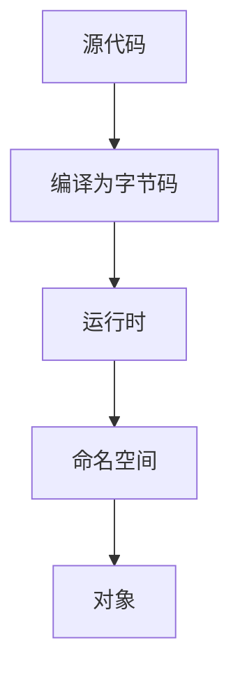
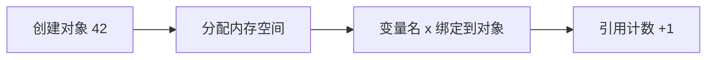
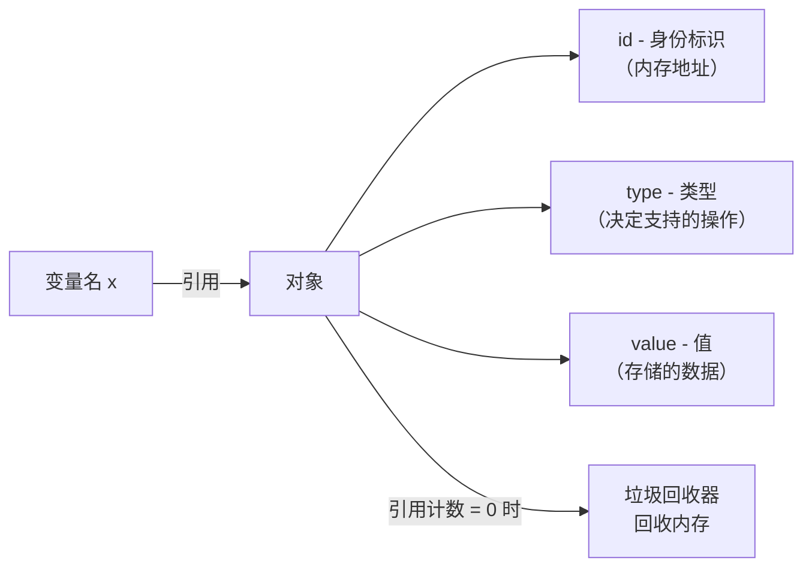

# 变量和关键字

## 变量概念

在 Python 中**变量**（Variables）是用来绑定对象的名称。通过变量名，可以访问和操作这些对象。

### 为什么说 Python 变量是"标签"而非"容器"？

这是理解 Python 变量机制最关键的一点。在 C/Java 等语言中，变量是一个**容器**——你声明 `int x = 42`，内存中会分配一个"盒子"把 42 装进去，`x` 就是这个盒子的名字。赋值 `x = 99` 是把盒子里的东西换成 99。

但在 Python 中，变量是一个**标签**（或称"名字贴纸"）。`x = 42` 的含义是：先在内存中创建整数对象 `42`，然后把标签 `x` 贴到这个对象上。赋值 `x = 99` 不是修改原来的对象，而是把标签 `x` 撕下来贴到另一个对象 `99` 上。

```python
# Python 变量是"标签"的直观证明
x = 42       # 创建整数对象 42，把标签 x 贴上去
y = x        # 把标签 y 也贴到同一个对象 42 上
print(id(x) == id(y))  # True —— x 和 y 指向同一个对象

x = 99       # 把标签 x 撕下来，贴到新对象 99 上
print(y)     # 42 —— y 仍然指向原来的对象，不受影响
```

这种"标签"模型意味着：**Python 中没有值传递 vs 引用传递的区分**，一切赋值都是"让变量名指向某个对象"。

## 系统架构与命名绑定流程

变量名与对象的关系不是"容器式存储"，而是"名称绑定"。执行流程可简化如下：



## 核心功能模块

| 模块       | 作用           | 典型接口                              |
| ---------- | -------------- | ------------------------------------- |
| `builtins` | 内置命名空间   | `len`、`print`、`type`                |
| `keyword`  | 关键字查询     | `keyword.kwlist`、`keyword.iskeyword` |
| `types`    | 类型与对象分类 | `SimpleNamespace`、`MappingProxyType` |
| `typing`   | 类型注解与提示 | `List`、`Optional`、`Literal`         |

### 变量命名规则

Python 社区遵循 PEP 8 编码规范，变量名必须遵循以下规则：

- **字母、数字和下划线**：变量名可以包含字母（A-Z, a-z）、数字（0-9）和下划线 `_`，但不能以数字开头
- **区分大小写**：`age` 和 `Age` 是两个不同的变量
- **保留字限制**：变量名不能是 Python 的关键字（如 `if`、`else`、`while` 等）
- **建议使用有意义的名称**：为了提高代码的可读性，变量名应具有描述性，能够反映其存储的数据内容

#### 命名风格建议

| 场景             | 推荐风格      | 示例              | 说明                     |
| ---------------- | ------------- | ----------------- | ------------------------ |
| 普通变量/函数    | `snake_case`  | `total_amount`    | Python 官方推荐风格      |
| 常量             | `UPPER_SNAKE` | `MAX_RETRY`       | 约定俗成，提醒不要修改   |
| 类名             | `CapWords`    | `UserProfile`     | 也叫 `PascalCase`        |
| 私有属性（约定） | `_prefix`     | `_cache`          | 单下划线提示"内部使用"   |
| 特殊方法         | `__dunder__`  | `__init__`        | 为解释器保留，避免自定义 |
| 模块             | snake_case    | `user_manager.py` | 小写加下划线            |
| 包               | snake_case    | `my_package`      | 短小写名称，避免连字符  |

#### 命名风格对比

| 风格 | 格式 | 典型语言 | Python 适用场景 | 示例 |
| ---- | ---- | -------- | --------------- | ---- |
| `snake_case` | 单词间用下划线 | Python, Ruby, C | **变量、函数、模块**（Python 主力风格） | `user_name` |
| `camelCase` | 首单词小写，后续首字母大写 | Java, JavaScript, C# | Python 中**不推荐**用于变量/函数 | `userName` |
| `PascalCase` | 每个单词首字母大写 | C#, Java, TypeScript | Python 中用于**类名** | `UserName` |
| `UPPER_SNAKE` | 全大写加下划线 | 通用 | Python 中用于**常量** | `MAX_SIZE` |

::: warning 命名一致性
在同一个项目中应保持命名风格统一。不要在一个模块中混用 `snake_case` 和 `camelCase`。如果接手已有项目，遵循项目现有风格比"纠正"更重要。
:::

示例：

```python
#!/usr/bin/env python3
# -*- coding: utf-8 -*-

print("=== 基本变量赋值 ===")
# 合法的变量名
name = "Alice"
age = 30
user_id = 12345
total_amount = 100.50
is_student = True

# 以下代码会引发错误，所以已注释
# 1st_name = "Bob"        # 以数字开头
# if = 10                # 关键字
# user@name = "Charlie"   # 包含特殊字符

print(f"name: {name}, age: {age}, user_id: {user_id}")
print(f"total_amount: {total_amount}, is_student: {is_student}")
```

::: info PEP 8

PEP 8 是 Python 官方的编码规范文档，建议所有 Python 开发者遵循。可以使用工具如 `flake8`、`pylint` 来检查代码是否符合 PEP 8 规范

:::

### 变量的赋值

在 Python 中，使用等号 `=` 为变量赋值。赋值操作非常灵活，支持多种高级用法。

```python
# 1. 基本赋值
name = "Alice"
age = 30

# 2. 链式赋值：将同一个值赋给多个变量
x = y = z = 100
print(f"链式赋值: x={x}, y={y}, z={z}")

# 3. 多重赋值（解包赋值）：同时为多个变量赋不同的值
a, b, c = 1, "hello", True
print(f"多重赋值: a={a}, b='{b}', c={c}")

# 4. 增强赋值：在原值基础上进行运算
count = 5
count += 2  # 等价于 count = count + 2
print(f"增强赋值后: count={count}")

# 5. 星号解包：用于处理不定数量的元素
numbers = [1, 2, 3, 4, 5]
first, *middle, last = numbers
print(f"星号解包: first={first}, middle={middle}, last={last}")
```

#### 变量赋值内部机制

当你写下 `x = 42` 时，Python 解释器内部经历了以下步骤：



1. **创建对象**：Python 在内存中创建一个整数对象 `42`（如果该值已存在则可能复用，见下方小整数池）
2. **分配内存**：为对象分配内存，并记录其 `id`（内存地址标识）、`type`（类型）、`value`（值）
3. **名称绑定**：在当前命名空间中建立映射：变量名 `x` → 对象 `42`
4. **引用计数**：对象的引用计数加 1，用于后续垃圾回收判断

#### 变量赋值方式对比

| 赋值方式 | 语法 | 特点 | 适用场景 |
| -------- | ---- | ---- | -------- |
| 基本赋值 | `x = 42` | 最常用，一个变量一个值 | 日常使用 |
| 链式赋值 | `x = y = z = 0` | 多个变量绑定同一对象 | 初始化多个相同值 |
| 多重赋值 | `a, b, c = 1, 2, 3` | 同时赋不同值，本质是元组解包 | 交换变量、函数返回多值 |
| 增强赋值 | `x += 1` | 就地运算（可变类型可能原地修改） | 计数器、累加 |
| 星号解包 | `first, *rest = [1,2,3]` | 收集剩余元素到列表 | 处理不定长序列 |
| 海象赋值 | `if (n := len(data)) > 0:` | 赋值+表达式，Python 3.8+ | 在条件/循环中赋值 |

::: tip 链式赋值的陷阱
`x = y = []` 会让 `x` 和 `y` 指向**同一个**空列表对象，修改其中一个会影响另一个。如果需要两个独立的列表，应使用 `x, y = [], []`。
:::

### Python 对象模型

Python 中一切皆对象。每个对象都有三个核心属性：



- **id**：对象的唯一标识，可以通过 `id()` 函数获取，本质上是对象在内存中的地址
- **type**：对象的类型，决定了对象支持哪些操作，可以通过 `type()` 函数获取
- **value**：对象存储的数据

```python
# 查看对象的三个核心属性
x = 42
print(f"id: {id(x)}")         # 例如 4306174848
print(f"type: {type(x)}")     # <class 'int'>
print(f"value: {x}")          # 42
```

#### 小整数池与字符串驻留

Python 为了性能优化，对常用的整数和字符串做了缓存：

**小整数池**：Python 在启动时，会预先创建 -5 到 256 的所有整数对象。这个范围内的整数赋值不会创建新对象，而是直接引用缓存中的对象。

```python
# 小整数池演示
a = 256
b = 256
print(a is b)  # True —— 都指向缓存中的同一个对象

# 直接写字面量时，同一脚本中的常量会被编译器合并（is 也会是 True）；
# 用 int() 在运行时分别创建，才能看到小整数池边界的效果
c = int("257")
d = int("257")
print(c is d)  # False —— 超出小整数池范围，运行时各自创建新对象
```

**字符串驻留（String Interning）**：Python 会将某些字符串（如标识符规则的字符串、长度较短的字符串）缓存在一个内部字典中，相同内容的字符串只保留一份。

```python
# 字符串驻留演示
s1 = "hello"
s2 = "hello"
print(s1 is s2)  # True —— 短字符串被驻留，指向同一对象

# 含空格等特殊字符的字符串不在标识符驻留范围内；
# 但同一脚本中的字面量常量会被编译器合并，逐行在交互式环境中执行才可能得到 False
s3 = "hello world!"
s4 = "hello world!"
print(s3 is s4)  # True（同一脚本） —— 是否驻留是实现细节，不应依赖
```

::: warning 实现细节
小整数池的范围 [-5, 256] 和字符串驻留的具体规则是 CPython 的**实现细节**，不属于语言规范。不同 Python 实现（如 PyPy、Jython）可能行为不同，不应在业务逻辑中依赖这些行为。
:::

### `is` vs `==` 深度比较

| 操作符 | 含义 | 比较内容 | 性能 |
| ------ | ---- | -------- | ---- |
| `is` | 是否同一对象 | 比较两个变量是否指向内存中的**同一个对象**（即 `id()` 相同） | O(1) |
| `==` | 值是否相等 | 比较两个对象的**值**是否相等（调用 `__eq__` 方法） | 取决于类型 |

```python
#!/usr/bin/env python3
# -*- coding: utf-8 -*-

"""
is vs == 深度比较 —— 结合内存模型理解
"""

# --- 情况1：小整数池内的比较 ---
a = 256
b = 256
print(f"小整数池内: a is b = {a is b}")  # True —— 同一对象
print(f"小整数池内: a == b = {a == b}")  # True —— 值相等

# --- 情况2：超出小整数池 ---
c = int("257")
d = int("257")
print(f"超出小整数池: c is d = {c is d}")  # False —— 不同对象（运行时各创建一份）
print(f"超出小整数池: c == d = {c == d}")  # True —— 值相等

# --- 情况3：列表比较（可变类型） ---
list1 = [1, 2, 3]
list2 = [1, 2, 3]
print(f"列表: list1 is list2 = {list1 is list2}")  # False —— 不同对象
print(f"列表: list1 == list2 = {list1 == list2}")  # True —— 值相等

# --- 情况4：None 的判断（is 的正确用法） ---
x = None
print(f"x is None = {x is None}")    # True —— 推荐写法
print(f"x == None = {x == None}")    # True —— 不推荐，某些自定义 __eq__ 可能出问题
```

**为什么 `is None` 比 `== None` 更好？** 因为 `None` 是单例对象，`is` 检查的是身份，不会被自定义 `__eq__` 方法干扰。PEP 8 明确规定：与 `None` 的比较应始终使用 `is` 或 `is not`。

### 可变 vs 不可变类型的赋值行为

理解可变与不可变类型对赋值行为的影响，是避免 bug 的关键：

| 类型分类 | 常见类型 | 赋值行为 | 修改行为 |
| -------- | -------- | -------- | -------- |
| 不可变 | `int`, `float`, `str`, `tuple`, `frozenset`, `bool` | 重新赋值会创建新对象，原对象不变 | 不支持原地修改 |
| 可变 | `list`, `dict`, `set`, `bytearray` | 赋值是引用传递，多个变量共享同一对象 | 原地修改会影响所有引用 |

```python
#!/usr/bin/env python3
# -*- coding: utf-8 -*-

"""
可变 vs 不可变类型的赋值行为差异
"""

# --- 不可变类型：赋值后互不影响 ---
a = 100
b = a        # b 和 a 指向同一个对象 100
a = 200      # a 指向新对象 200，b 不受影响
print(f"不可变类型: a={a}, b={b}")  # a=200, b=100

# --- 可变类型：通过引用共享修改 ---
list_a = [1, 2, 3]
list_b = list_a       # list_b 和 list_a 指向同一个列表对象
list_a.append(4)      # 原地修改列表
print(f"可变类型: list_a={list_a}, list_b={list_b}")
# list_a=[1, 2, 3, 4], list_b=[1, 2, 3, 4] —— 两个变量都看到了修改

# --- 如何避免共享修改？使用拷贝 ---
list_c = list_a.copy()   # 浅拷贝，创建新列表对象
list_a.append(5)
print(f"拷贝后: list_a={list_a}, list_c={list_c}")
# list_c 不受 list_a 后续修改的影响
```

### 变量交换的三种方式

```python
#!/usr/bin/env python3
# -*- coding: utf-8 -*-

"""
三种变量交换方式对比
"""

a, b = 10, 20

# ---- 方式1：临时变量（经典方法，所有语言通用） ----
temp = a    # 把 a 的值暂存到 temp
a = b       # 把 b 的值赋给 a
b = temp    # 把 temp 中保存的原 a 值赋给 b
print(f"临时变量交换后: a={a}, b={b}")  # a=20, b=10

# 恢复
a, b = 10, 20

# ---- 方式2：元组解包（Pythonic，推荐） ----
a, b = b, a   # 右边先打包成元组 (20, 10)，再解包赋值给 a, b
print(f"元组解包交换后: a={a}, b={b}")  # a=20, b=10

# 恢复
a, b = 10, 20

# ---- 方式3：异或交换（仅限整数，展示原理） ----
a = a ^ b    # 异或运算：a 变成 a⊕b
b = a ^ b    # b 变成 (a⊕b)⊕b = a
a = a ^ b    # a 变成 (a⊕b)⊕a = b
print(f"异或交换后: a={a}, b={b}")      # a=20, b=10
```

| 方式 | 优点 | 缺点 | 推荐度 |
| ---- | ---- | ---- | ------ |
| 临时变量 | 通用、可读性好 | 多一个变量 | 中 |
| 元组解包 | Pythonic、简洁 | 仅 Python 支持 | **强烈推荐** |
| 异或交换 | 不需要额外变量 | 仅限整数、可读性差 | 不推荐（仅面试用） |

### 动态类型

Python 是**动态类型**的语言，这意味着变量的类型是在运行时确定的，不需要事先声明变量类型。同一个变量可以在不同的时间存储不同类型的数据。

**注意**：虽然动态类型提供灵活性，但在大型项目中，明确变量的类型有助于代码的可读性和维护性。可以使用类型注解（Type Annotations）来提示变量类型，尤其是在使用类型检查工具（如 `mypy`）时。

```python
name: str = "Alice"
age: int = 30
height: float = 5.5
is_student: bool = False
```

类型注解不会在运行期强制校验，但可以配合 IDE 或静态检查工具（如 `mypy`、`pyright`）提前发现类型错误。

示例：

```python
#!/usr/bin/env python3
# -*- coding: utf-8 -*-

# 动态类型演示
dynamic_var = 10         # 整数
print(f"dynamic_var is {type(dynamic_var)}: {dynamic_var}")
# dynamic_var is <class 'int'>: 10

dynamic_var = "Hello"    # 字符串
print(f"dynamic_var is {type(dynamic_var)}: {dynamic_var}")
# dynamic_var is <class 'str'>: Hello

dynamic_var = 3.14       # 浮点数
print(f"dynamic_var is {type(dynamic_var)}: {dynamic_var}")
# dynamic_var is <class 'float'>: 3.14

# 类型注解示例
name: str = "Alice"
age: int = 30
height: float = 5.5
is_student: bool = False

print(f"\n带类型注解的变量:")
print(f"name: {name} (类型: {type(name).__name__})") # name: Alice (类型: str)
print(f"age: {age} (类型: {type(age).__name__})") # age: 30 (类型: int)
print(f"height: {height} (类型: {type(height).__name__})") # height: 5.5 (类型: float)
print(f"is_student: {is_student} (类型: {type(is_student).__name__})") # is_student: False (类型: bool)
```

## 变量的作用域

> 变量的**作用域**（Scope）决定了变量在程序中的可见性和生命周期。Python 中变量的作用域遵循 **LEGB**（Local - Enclosing - Global - Built-in）查找顺序，并通过 `global` / `nonlocal` 关键字在函数内修改外层变量。

> 完整教程见 [13-函数](13-函数) —— 函数的作用域、LEGB 规则详解、global/nonlocal 用法等完整内容。

**核心概念速览**：

- **局部变量（Local）**：在函数或方法内部定义，仅在该函数内可见。
- **全局变量（Global）**：在函数外部定义，整个模块可见。函数内修改需用 `global` 声明。
- **非局部变量（Nonlocal）**：用于在嵌套函数中引用外部函数的变量，需用 `nonlocal` 声明。
- **LEGB 查找顺序**：Local - Enclosing - Global - Built-in，Python 按此顺序解析变量。

```python
count = 0

def increment():
    global count
    count += 1

def outer():
    x = "local"
    def inner():
        nonlocal x
        x = "nonlocal"
    inner()
```

## 变量的内存管理

Python 使用**垃圾回收机制**自动管理内存，当变量不再被引用时，Python 会自动回收其占用的内存。这意味着你不需要手动释放变量所占用的内存。

```python
#!/usr/bin/env python3
# -*- coding: utf-8 -*-

x = [1, 2, 3]  # 创建一个列表对象，并由变量 x 引用
x = None       # 变量 x 不再引用该列表，Python 将在适当的时候回收内存
```

Python 主要依赖引用计数来判断对象是否仍被使用，并在必要时由垃圾回收器处理循环引用。常见调试技巧：

- 使用 `sys.getrefcount(obj)` 观察对象的引用数量（需 `import sys`）
- 使用 `del 变量名` 删除变量到对象之间的引用
- 避免在长生命周期的全局列表或缓存中意外持有大型对象，导致内存泄漏

### 使用 del 删除变量

`del` 关键字用于删除一个变量名与对象之间的引用关系。如果被删除的引用是对象的最后一个引用，那么该对象就会被垃圾回收。

```python
#!/usr/bin/env python3
# -*- coding: utf-8 -*-

"""
del 语句行为详解
"""

import sys

# --- del 删除变量引用 ---
my_list = [10, 20, 30]
print(f"my_list 存在: {'my_list' in locals()}")  # True
print(f"引用计数: {sys.getrefcount(my_list) - 1}")  # 1（减去 getrefcount 自身的临时引用）

another_ref = my_list  # 再添加一个引用
print(f"添加引用后: {sys.getrefcount(my_list) - 1}")  # 2

del my_list  # 删除变量 my_list，引用计数减 1
print(f"del 后 my_list 存在: {'my_list' in locals()}")  # False

# 对象本身仍然存在，因为 another_ref 还在引用它
print(f"another_ref = {another_ref}")  # [10, 20, 30]

# --- del 删除列表元素（注意：这是删除元素，不是删除变量） ---
nums = [1, 2, 3, 4, 5]
del nums[2]   # 删除索引 2 的元素（值为 3）
print(f"删除元素后: {nums}")  # [1, 2, 4, 5]

# --- del 删除字典键 ---
info = {"name": "Alice", "age": 30, "temp": "delete me"}
del info["temp"]
print(f"删除键后: {info}")  # {'name': 'Alice', 'age': 30}
```

**注意**：`del` 只是删除了变量名（或元素/键），而不是对象本身。只有当对象的所有引用都被删除后，内存才会被回收。

## 变量的输入与输出

使用 `input()` 函数可以从用户获取输入，返回值为字符串类型。通常需要将其转换为其他类型以便后续处理。

```python
#!/usr/bin/env python3
# -*- coding: utf-8 -*-

name = input("请输入你的名字: ")
age = int(input("请输入你的年龄: "))  # 将输入的字符串转换为整数
print(f"你好, {name}! 你今年 {age} 岁。")
```

## API 接口说明

变量与关键字相关的常用接口如下：

| 接口                      | 作用             | 示例                      |
| ------------------------- | ---------------- | ------------------------- |
| `type(obj)`               | 获取对象类型     | `type(123)`               |
| `id(obj)`                 | 获取对象标识     | `id(obj)`                 |
| `isinstance(obj, cls)`    | 类型检查         | `isinstance(1, int)`      |
| `locals()`                | 获取局部命名空间 | `locals()`                |
| `globals()`               | 获取全局命名空间 | `globals()`               |
| `vars(obj)`               | 获取对象属性字典 | `vars(user)`              |
| `keyword.kwlist`          | 关键字列表       | `keyword.kwlist`          |
| `keyword.iskeyword(name)` | 判断关键字       | `keyword.iskeyword("if")` |

```python
import keyword

name = "count"
print(type(name))
print(keyword.iskeyword(name))
```

## 配置参数详解

变量与关键字相关的配置主要影响解析与警告行为：

| 参数             | 作用           | 典型场景      | 示例                     |
| ---------------- | -------------- | ------------- | ------------------------ |
| `PYTHONHASHSEED` | 哈希随机种子   | 结果可复现    | `PYTHONHASHSEED=0`       |
| `PYTHONWARNINGS` | 警告级别控制   | CI 中显式警告 | `PYTHONWARNINGS=default` |
| `PYTHONUTF8`     | UTF-8 文本模式 | 统一编码行为  | `PYTHONUTF8=1`           |

```bash
PYTHONHASHSEED=0 PYTHONWARNINGS=default python demo.py
```

## 变量的高级用法

1. 交换变量值：Python 允许在不使用临时变量的情况下交换两个变量的值

```python
a = 5
b = 10
a, b = b, a
print(a)  # 输出: 10
print(b)  # 输出: 5
```

2. 链式赋值与表达式：可以在一个表达式中同时进行多个赋值操作

```python
x = y = z = 0
a, b = 1, 2
```

3. 使用解包赋值处理复杂数据结构

```python
# 列表解包
numbers = [1, 2, 3]
first, second, third = numbers

# 字典解包（Python 3.5+）
person = {'name': 'Alice', 'age': 30}
name, age = person.values()
```

4. 使用占位符 `_` 忽略不需要的值

```python
x, _, z = (10, 20, 30)
first, *_, last = range(10)
```

## 常量

虽然 Python 没有内置的常量类型，但按照惯例，常量名通常使用全大写字母来命名，以提示开发者不要修改其值。

```python
PI = 3.14159
GRAVITY = 9.81
```

**注意**：这种方式只是约定俗成，并不能真正阻止变量被修改。如果需要真正的常量，可以使用模块级别的变量或使用类属性等方式进行封装。

## 关键字

`Python` 的关键字是具有特殊意义和用途的保留字。这些关键字在语法中有特定的功能，不能用作变量名、函数名或其他标识符。截至 Python 3.12，Python 共有 **35** 个关键字

关键字是 Python 的保留字，不能用作变量名、函数名或其他标识符。例如，以下代码将导致语法错误：

```python
class = "Math"
```

**版本差异：** 不同版本的 Python 可能会有不同的关键字。例如：`Python 3.8` 引入 `:=`（海象运算符），而早期版本则没有。因此在编写代码时，需注意所使用的 `Python` 版本。

**可读性：** 合理使用关键字可以提高代码的可读性和维护性，避免复杂嵌套和滥用控制流关键字。

可以使用 `keyword` 模块来查看当前 `Python` 版本中的所有关键字。以下是一个示例：

```python
#!/usr/bin/env python3
# -*- coding: utf-8 -*-

# Python关键字演示

import keyword

print("Python的所有关键字:")
print(keyword.kwlist)
print(f"总共有 {len(keyword.kwlist)} 个关键字") # 总共有 35 个关键字

# 检查一个词是否是关键字
test_words = ["if", "else", "while", "for", "def", "class", "variable", "name"]
for word in test_words:
    is_keyword = keyword.iskeyword(word)
    print(f"'{word}': {'是关键字' if is_keyword else '不是关键字'}")

# 输出
# 'if': 是关键字
# 'else': 是关键字
# 'while': 是关键字
# 'for': 是关键字
# 'def': 是关键字
# 'class': 是关键字
# 'variable': 不是关键字
# 'name': 不是关键字
```

### 关键字分类速记

| 分类           | 关键词                                        | 说明                                |
| -------------- | --------------------------------------------- | ----------------------------------- |
| **值**         | `True`, `False`, `None`                       | 布尔值和空值                        |
| **逻辑运算**   | `and`, `or`, `not`, `is`, `in`                | 用于布尔和成员测试                  |
| **控制流**     | `if`, `elif`, `else`, `match`, `case`         | 条件分支（`match`/`case` 在 3.10+） |
| **循环**       | `for`, `while`, `break`, `continue`           | 迭代与循环控制                      |
| **函数/类**    | `def`, `class`, `lambda`, `return`, `yield`   | 定义与返回值                        |
| **异步**       | `async`, `await`                              | 定义和等待协程（3.5+）              |
| **作用域**     | `global`, `nonlocal`                          | 修改变量作用域                      |
| **异常处理**   | `try`, `except`, `finally`, `raise`, `assert` | 错误处理与断言                      |
| **模块导入**   | `import`, `from`, `as`                        | 引入代码模块                        |
| **上下文管理** | `with`                                        | 自动资源管理                        |
| **变量操作**   | `del`, `pass`                                 | 删除引用和空操作                    |

> `match`/`case` 在 Python 3.10 引入，旧版本无法使用，需要留意

### 常见问题

- **语法高亮异常**：说明变量名与关键字冲突，应及时改名
- **不可作为标识符**：如 `class = "Math"` 会直接报错
- **与内置名称冲突**：`list = []` 虽然合法，但会覆盖内置类型，建议保留关键功能名称

## 调试与检查技巧

- 使用 `type()` 或 `isinstance()` 确定变量类型
- 使用 `id()` 判断两个变量是否引用同一对象
- 借助 `pprint`、`rich` 等库美化复杂结构，便于排查

```python
from pprint import pprint

data = {"users": [{"name": "Alice"}, {"name": "Bob"}]}
pprint(data, width=40)
```

## 常见陷阱与 FAQ

### 陷阱1：可变默认参数

这是 Python 最经典的陷阱之一。函数的默认参数在函数**定义时**求值（只求值一次），而不是每次调用时求值。

```python
#!/usr/bin/env python3
# -*- coding: utf-8 -*-

"""
可变默认参数陷阱
"""

# ---- 错误写法 ----
def append_item(item, lst=[]):  # 默认列表在函数定义时创建，所有调用共享同一个列表！
    lst.append(item)
    return lst

print(append_item(1))   # [1]
print(append_item(2))   # [1, 2] —— 意料之外！前一次调用的结果被保留了
print(append_item(3))   # [1, 2, 3] —— 越来越长！

# ---- 正确写法：用 None 作为默认值 ----
def append_item_fixed(item, lst=None):
    if lst is None:
        lst = []         # 每次调用都创建新的列表
    lst.append(item)
    return lst

print(append_item_fixed(1))  # [1]
print(append_item_fixed(2))  # [2] —— 符合预期
```

**原因**：函数定义时，默认参数的值被计算并存储在函数对象的 `__defaults__` 属性中，所有调用共享这个对象。不可变类型（如 `int`、`str`）不会出问题，但可变类型（`list`、`dict`、`set`）会导致状态在调用之间泄漏。

### 陷阱2：for 循环变量泄漏

在 Python 中，`for` 循环不会创建新的作用域。循环结束后，循环变量仍然存在。

```python
#!/usr/bin/env python3
# -*- coding: utf-8 -*-

"""
for 循环变量泄漏
"""

# 循环结束后，变量 i 仍然存在
for i in range(5):
    pass

print(f"循环结束后 i = {i}")  # i = 4 —— 循环变量的最后一个值

# 如果之前有同名变量，会被覆盖
i = "我是原来的值"
for i in range(3):
    pass
print(f"i 被覆盖了: {i}")  # i = 2，原来的字符串值丢了

# 常见陷阱：在列表推导式中意外引用循环变量
funcs = [lambda: i for i in range(3)]
print([f() for f in funcs])  # [2, 2, 2] —— 都是 2！不是 [0, 1, 2]

# 修复：使用默认参数捕获当前值
funcs = [lambda i=i: i for i in range(3)]
print([f() for f in funcs])  # [0, 1, 2] —— 符合预期
```

### 陷阱3：`is` vs `==` 混淆

```python
#!/usr/bin/env python3
# -*- coding: utf-8 -*-

"""
is vs == 混淆的常见错误
"""

# 错误：用 is 比较值的相等性
a = [1, 2, 3]
b = [1, 2, 3]
if a is b:           # False —— 两个不同的列表对象
    print("相同对象")
else:
    print("不同对象，但值相等")  # 这行会被执行

# 错误：用 == 判断 None
x = 0
if x == None:        # 不好！0 == None 是 False，但语义不清晰
    pass
if x is None:        # 正确！PEP 8 推荐
    pass

# 误以为 is 比较值
# 在交互式环境中，小整数和短字符串的 is 比较可能"碰巧"正确
# 但这依赖实现细节，不应依赖
a = 256
b = 256
print(f"256: a is b = {a is b}")  # True（小整数池）

a = int("257")
b = int("257")
print(f"257: a is b = {a is b}")  # False（运行时创建，超出小整数池）
```

**经验法则**：
- 判断是否为 `None`、`True`、`False`：用 `is`
- 判断两个对象的值是否相等：用 `==`
- 判断是否为同一个对象（极少数场景）：用 `is`

### 陷阱4：UnboundLocalError

当函数内部有对变量的赋值操作时，Python 会在编译时将该变量标记为局部变量。如果在赋值前读取它，就会触发 `UnboundLocalError`。

```python
#!/usr/bin/env python3
# -*- coding: utf-8 -*-

"""
UnboundLocalError 陷阱
"""

x = 10  # 全局变量

def trouble():
    # Python 编译器看到 x += 1 中的赋值，将 x 标记为局部变量
    # 但执行到 print 时，局部变量 x 还未被赋值
    # print(x)       # UnboundLocalError: cannot access local variable 'x' ...
    x += 1           # 这行赋值导致 x 被视为局部变量
    return x

# 修复方法：使用 global 声明
def fixed():
    global x
    x += 1
    return x

print(f"修复后: {fixed()}")  # 11

# 类似问题：+= 等增强赋值也会触发
items = []

def add_item():
    # items += ["new"]  # UnboundLocalError! += 对列表隐含赋值
    items.append("new")  # 正确：append 不赋值，只做方法调用

add_item()
print(f"items: {items}")  # ['new']
```

**为什么？** Python 编译器在函数定义时（而非运行时）分析变量是局部还是全局。只要函数体中有 `x = ...`、`x += ...` 等赋值语句，`x` 就被标记为局部变量，整个函数中所有对 `x` 的引用都指向这个局部变量。

## 常见问题解答

### Q: 为什么会出现 `UnboundLocalError`？

A: 通常是在函数内部对同名变量赋值，导致该名称被视为局部变量，但在赋值前被读取。详见上方"陷阱4"。

### Q: 变量名能使用中文吗？

A: 可以，但不建议在生产代码中使用。建议保持英文命名以便跨团队协作与工具兼容。

### Q: 关键字数量为什么会变化？

A: 关键字集合随 Python 版本演进而变化，应以 `keyword.kwlist` 输出为准。

### Q: 为什么小整数比较 `is` 有时正确有时不正确？

A: CPython 对 [-5, 256] 范围内的整数做了缓存（小整数池），此范围内的 `is` 比较恒为 `True`。超出范围则每次创建新对象，`is` 比较为 `False`。但这属于实现细节，不应在代码中依赖。

## 术语表

| 术语 | 英文 | 定义 |
| ---- | ---- | ---- |
| 标识符 | Identifier | 程序中用来命名变量、函数、类等的名称。必须以字母或下划线开头，不能是关键字 |
| 变量 | Variable | 绑定到对象的名称。Python 中的变量是"标签"而非"容器" |
| 关键字 | Keyword | Python 语言保留的具有特殊含义的单词，不能用作标识符。如 `if`、`def`、`class` |
| 引用 | Reference | 变量名与对象之间的关联关系。赋值操作本质上是创建或修改引用 |
| 对象 | Object | Python 中一切皆对象。每个对象有 id（身份）、type（类型）、value（值）三个核心属性 |
| 可变类型 | Mutable Type | 创建后其值可以被原地修改的类型。如 `list`、`dict`、`set` |
| 不可变类型 | Immutable Type | 创建后其值不能被原地修改的类型。如 `int`、`str`、`tuple` |
| 引用计数 | Reference Count | 记录有多少个引用指向某个对象的计数器。归零时对象被垃圾回收 |
| LEGB | LEGB Rule | Python 变量查找顺序规则：Local → Enclosing → Global → Built-in |

## 延伸阅读

- → [Python简介](05-Python简介) —— 了解 Python 的历史与设计哲学
- → [数据类型](07-数据类型) —— 深入学习可变/不可变类型的细节
- → [函数](13-函数) —— 理解作用域、闭包与参数传递机制

## 版本差异（Python 3.8-3.12 → 3.14）

| 特性 | 本文编写时 | Python 3.14 |
|------|-----------|-------------|
| 类型注解求值 | 运行时立即求值 | PEP 649/749 延迟求值：注解不再在定义时执行，解决前向引用，提升启动性能 |
| 字符串模板 | 普通 f-string / `str.format` | PEP 750 模板字符串 `t"..."`：可插值且能被安全处理（3.14 新特性） |
| 标准库多解释器 | 无官方支持 | PEP 734：`concurrent.interpreters` 模块支持在同一进程创建多个子解释器 |
| 调试 | 仅 Python 内建 pdb / IDE 调试 | PEP 768：安全的 CPython 外部调试器接口（custom debugger protocol） |
| 字节码与运行时 | 3.12 前无 JIT | 3.13 引入实验性 JIT（PEP 744）；3.14 进一步改进 free-threaded（无 GIL）构建 |
| `datetime` API | `utcnow()` 常用 | 3.12 起弃用，官方要求改用 `datetime.now(tz=datetime.UTC)`（aware 对象） |
| 压缩算法 | zlib / gzip / bz2 / lzma | 3.14 新增标准库 Zstandard 支持（PEP 784） |

> 本文讲解的语法与数据结构原理在 3.14 中依然成立；新项目建议基于 Python 3.13/3.14，并优先使用 aware datetime、PEP 649 注解与最新类型语法。
