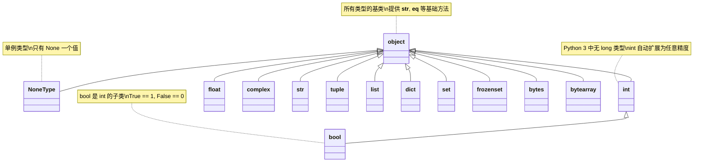
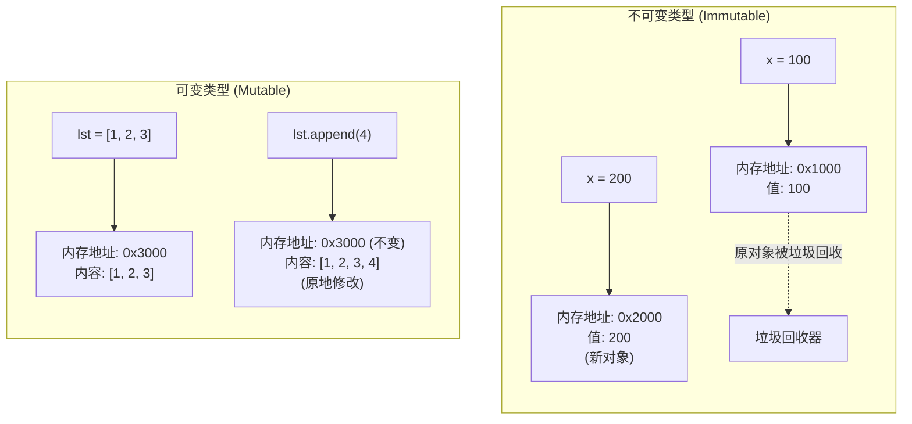
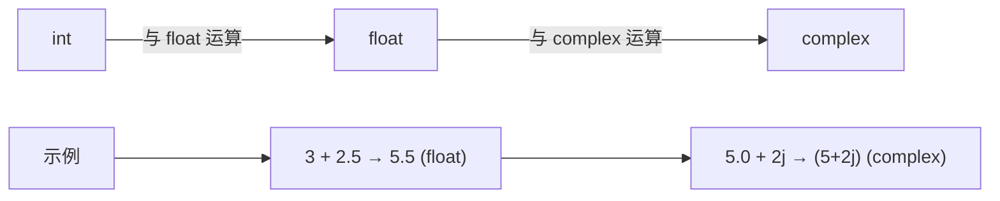
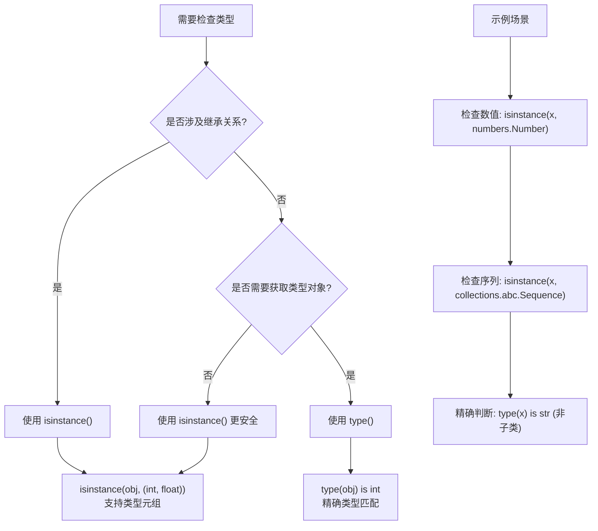

# 数据类型

Python 是动态类型语言，变量的数据类型在运行时自动推断，无需事先声明。掌握核心数据类型有助于写出更安全、可读性更好的代码。常见类型大致可分为：

- 数字：`int`、`float`、`complex`
- 文本：`str`
- 序列：`list`、`tuple`、`range`
- 映射：`dict`
- 集合：`set`、`frozenset`
- 布尔：`bool`
- 二进制：`bytes`、`bytearray`、`memoryview`
- 特殊：`NoneType`

此外 Python 允许定义自定义类，以及通过迭代器、生成器实现惰性计算。

## Python 数据类型体系

Python 中所有数据类型都继承自 `object`，形成统一的类型体系：



::: tip 为什么 Python 的类型体系如此设计？
Python 采用"一切皆对象"的设计哲学，所有类型都继承自 `object`，这带来以下好处：
1. **统一的方法接口**：所有对象都有 `__str__`、`__eq__`、`__hash__` 等方法
2. **多态支持**：函数可以接受任意类型参数，通过鸭子类型实现灵活的多态
3. **类型检查简化**：`isinstance(obj, object)` 对任意对象都返回 `True`
:::

## 可变与不可变类型

- 不可变：`int`、`float`、`bool`、`str`、`tuple`、`frozenset`、`bytes`、`NoneType`
- 可变：`list`、`dict`、`set`、`bytearray`（以及指向可变对象的 `memoryview`）

### 内存模型对比



::: danger 设计建议
避免在函数参数中使用可变类型作为默认值，例如 `def f(a=[]): ...`。如需默认空列表，使用 `None` 再在函数体中初始化：`def f(a=None): a = [] if a is None else a`

**错误示例：**

```python
def add_item(item, my_list=[]):
    """错误：默认参数在函数定义时求值，所有调用共享同一列表"""
    my_list.append(item)
    return my_list

print(add_item(1))  # 输出: [1]
print(add_item(2))  # 输出: [1, 2] (列表被共享和修改)
```

**正确示例：**

```python
def add_item_correct(item, my_list=None):
    """正确：使用 None 作为哨兵值，每次调用创建新列表"""
    if my_list is None:
        my_list = []
    my_list.append(item)
    return my_list

print(add_item_correct(1))  # 输出: [1]
print(add_item_correct(2))  # 输出: [2] (每次调用都创建新列表)
```

:::

## 数字类型

### 数值类型自动转换规则

Python 在混合运算时会自动进行类型提升：



### 整数 int

表示整数值，没有小数部分。`int` 无固定长度限制，理论上只受系统内存约束。

::: info 为什么 Python 3 没有 long 类型？
在 Python 2 中，`int` 是固定精度的（通常 32 位），超出范围会自动转换为 `long` 类型。Python 3 统一了这两种类型：
- **Python 2**：`int` (32位) → `long` (任意精度)
- **Python 3**：`int` 直接支持任意精度，无需 `long`

这种设计简化了语言，程序员无需关心整数溢出问题。底层实现使用"变长数组"存储大整数，自动扩展内存。
:::

```python
a = 10
b = -5
```

计算机由于使用二进制，有时用十六进制表示整数比较方便，十六进制用 `0x` 前缀和 0-9、a-f 表示，例如：`0xff00`，`0xa5b4c3d2`，等等。书写很大的数时，可使用下划线将其中的数字分组，使其更清晰易读。当打印这种使用下划线定义的数时，`Python` 不会打印其中的下划线：

```python
universe_age = 14_000_000_000

print(universe_age) # 14000000000
```

::: danger

这是因为存储这种数时，`Python` 会忽略其中的下划线。将数字分组时，即便不是将每三位分成一组，也不会影响最终的值。在 Python 看来 `1000` 与 `1_000` 没什么不同，`1_000` 与`10_00` 也没什么不同。这种表示法适用于整数和浮点数，但只有 `Python 3.6` 和更高的版本支持

:::

#### Python int 永不溢出

```python
# Python int 可以表示任意大的整数，不会溢出
# 计算 2 的 100 次方
big_num = 2 ** 100
print(f"2^100 = {big_num}")  # 1267650600228229401496703205376

# 计算更大的数
huge_num = 10 ** 1000  # 远超古戈尔（Googol = 10^100）
print(f"10^1000 有 {len(str(huge_num))} 位数字")  # 1001 位

# 对比其他语言的溢出行为
# C/Java 中 int 最大值约为 2.1 * 10^9
# Python 无此限制，只受内存约束
import sys
print(f"当前整数占用字节数: {sys.getsizeof(big_num)}")  # 40 字节（64 位 CPython 3.14）
print(f"更大整数占用字节数: {sys.getsizeof(huge_num)}")  # 468 字节（64 位 CPython 3.14）
```

### 浮点数 float

表示带有小数部分的实数。使用双精度浮点数表示，可能存在精度误差。

::: info 为什么 Python 同时有 int 和 float，而不像 JavaScript 那样只有 Number？
JavaScript 采用 IEEE 754 双精度浮点数统一表示所有数字，这导致：
- **整数精度限制**：安全整数范围只有 ±2^53
- **运算性能**：整数运算也要走浮点运算单元

Python 保留 `int` 和 `float` 分离的设计：
- `int`：任意精度，精确计算，适合计数、索引、大数运算
- `float`：IEEE 754 双精度，硬件加速，适合科学计算

这种设计在精确性和性能之间取得平衡。
:::

```python
c = 3.14
d = -0.001
```

从很大程度上说，使用浮点数时无须考虑其行为。只需输入要使用的数，`Python` 通常会按期望的方式处理它们。但需要注意的是，结果包含的小数位数可能是不确定的：

```python
0.2 + 0.1  # 0.30000000000000004

3 * 0.1 # 0.30000000000000004
```

所有语言都存在这种问题。**就现在而言，暂时忽略多余的小数位数即可**。如果业务必须保留精确小数，可使用 `decimal.Decimal` 或 `fractions.Fraction` 获得更高精度

将任意两个数相除时，结果总是浮点数，即便这两个数都是整数且能整除：

```python
4/2  # 2.0
```

在其他任何运算中，如果一个操作数是整数，另一个操作数是浮点数，结果也总是浮点数：

```python
1 + 2.0 # 3.0

2 * 3.0 # 6.0

3.0 ** 2 # 9.0
```

> 整数和浮点数在计算机内部存储的方式是不同的，整数运算永远是精确的，而浮点数运算则可能会有四舍五入的误差

**使用 `Decimal` 进行精确计算：**

```python
from decimal import Decimal, getcontext

# 设置精度（可选，默认 28 位）
getcontext().prec = 50

# 浮点数计算的精度问题
print("浮点数计算:")
print(f"  0.1 + 0.2 = {0.1 + 0.2}")  # 0.30000000000000004
print(f"  0.1 + 0.2 == 0.3: {0.1 + 0.2 == 0.3}")  # False

# 使用 Decimal 进行精确计算
print("\nDecimal 精确计算:")
print(f"  Decimal('0.1') + Decimal('0.2') = {Decimal('0.1') + Decimal('0.2')}")  # 0.3
print(f"  结果 == Decimal('0.3'): {Decimal('0.1') + Decimal('0.2') == Decimal('0.3')}")  # True

# 注意 - 必须用字符串构造 Decimal
# 错误方式：Decimal(0.1) 会先创建浮点数，再转换，精度已丢失
print(f"\n错误方式 Decimal(0.1): {Decimal(0.1)}")  # 0.1000000000000000055511151231257827021181583404541015625
print(f"正确方式 Decimal('0.1'): {Decimal('0.1')}")  # 0.1
```

### 复数 complex

表示复数，包含实部和虚部。虚部用 `j` 或 `J` 表示

```python
e = 2 + 3j
f = -1.5 - 4J
```

## 文本类型

### 字符串 str

`str` 表示文本数据，由一系列字符组成，支持单/双/三引号定义、索引切片、常用方法、格式化及编解码。

> 📚 **详细教程见 [08-字符串](08-字符串)** —— 字符串的索引切片、常用方法、格式化（f-string）、str/bytes 编解码等完整内容。

```python
s = 'Hello'
greeting = f"{s}, World!"   # f-string 格式化
print(s[0], s[-1])          # H o（索引）
print(s[::-1])              # olleH（切片反转）
```

## 序列类型

### 列表 list

有序且可变的集合，可包含不同类型元素，支持索引、切片、增删、排序、列表推导式。

> 📚 **详细教程见 [09-列表与元组](09-列表与元组)** —— 列表的完整操作、元组、浅深拷贝等。

```python
fruits = ['苹果', '香蕉', '橙子']
fruits.append('梨')
squares = [i*i for i in range(5)]   # 列表推导式
```

### 元组 tuple

有序且不可变的集合，一旦创建内容不可更改，常用于不可变配置或函数一次返回多值。

```python
coordinates = (10, 20)
a, b = (1, 2)      # 打包与解包
t = (1,)           # 单元素元组需要逗号
```

### 范围 range

不可变的数字序列，惰性求值、占用常量空间，常用于 `for` 循环：

```python
numbers = range(0, 10, 2)   # 生成 0, 2, 4, 6, 8
print(list(numbers))
```

## 映射类型

### 字典 dict

无序的键值对集合，键必须是不可变类型，支持快速查找、添加、删除、字典推导式。

> 📚 **详细教程见 [10-字典](10-字典)** —— 字典的 CRUD、视图遍历、collections 特殊字典等。

```python
person = {'name': '张三', 'age': 25}
person.get('country', '中国')    # 安全访问，带默认值
person.update({'age': 26})
square_map = {i: i*i for i in range(5)}   # 字典推导式
```

## 集合类型

### 集合 set

无序且不重复的元素集合，支持并集、交集、差集等数学运算，常用于去重。

> 📚 **详细教程见 [11-集合](11-集合)** —— 集合的完整操作、集合运算、推导式、frozenset 等。

```python
A = {1, 2, 3}
B = {3, 4}
print(A | B)   # 并集 {1,2,3,4}
print(list(set([1, 1, 2, 3])))   # 去重 [1, 2, 3]
```

### 冻结集合 frozenset

不可变的集合，创建后内容不可更改，可作为字典键或其他集合的元素：

```python
fixed_set = frozenset([1, 2, 3])
```

## 布尔类型

表示真 (`True`) 或假 (`False`) 的逻辑值。布尔值只有 `True`、`False` 两种值，在 `Python` 中可以直接用 `True`、`False` 表示布尔值（请注意大小写），也可以通过布尔运算计算出来：

```python
is_valid = True
is_empty = False
```

::: info 为什么 bool 是 int 的子类？
Python 的 `bool` 类型继承自 `int`，这是历史原因和实用主义的结合：
1. **历史兼容**：Python 早期没有 `bool` 类型，用 `0` 和 `1` 表示真假
2. **平滑迁移**：`bool` 作为 `int` 子类，旧代码无需修改
3. **实用便利**：`True + True == 2`，可以用于计数

```python
# bool 继承自 int 的证据
print(isinstance(True, int))  # True
print(True + True)            # 2
print(True * 10)              # 10
print(int(True))              # 1
print(int(False))             # 0
```
:::

布尔值可以用 `and`、`or` 和 `not` 运算：

- `and` 运算是与运算，只有所有都为 `True`，`and` 运算结果才是`True`
- `or` 运算是或运算，只要其中有一个为 `True`，`or` 运算结果就是 `True`
- `not` 运算是非运算，它是一个单目运算符，把 `True` 变成 `False`，`False` 变成 `True`

布尔值经常用在条件判断中，比如：

```python
age = 20
if age >= 18:
    print('adult')
else:
    print('teenager')
```

短路与返回值行为：

```python
print([] or 'fallback')   # 'fallback'
print('x' and 123)        # 123（返回操作数本身）
```

## 二进制类型

### 字节 bytes

表示固定长度的字节序列

- 使用前缀 `b` 定义，如 `b'hello'`
- 常用于处理文件、网络数据等二进制信息
- 每个元素都是 0~255 的整数

```python
data = b'Hello World'
```

```python
# 从整数序列构造
print(bytes([65, 66, 67]))   # b'ABC'

# 与字符串互转需显式编解码
text = '你好'
buf = text.encode('utf-8')
print(buf.decode('utf-8'))
```

### 字节数组 bytearray

可变的字节序列，类似于 `bytes`，但可以修改。使用 `bytearray()` 函数创建，适合需要原地修改二进制数据的场景

```python
mutable_data = bytearray(b'Hello')
mutable_data[0] = 72  # 修改字节
```

```python
# 追加、切片
mutable_data.append(33)     # 添加 '!'
print(mutable_data[:2])     # bytearray(b'He')
```

### 内存视图 memoryview

提供对其他二进制数据的内存访问视图，无需复制数据。支持高效的数据访问和操作

```python
data = bytearray(b'Hello')
view = memoryview(data)
```

```python
print(view[0])   # 72（查看但不复制）
view[0] = 104    # 修改原数据为 'hello'
```

## None 类型

### NoneType

表示空值或缺失值，只有一个值 `None`。常用于变量初始化或函数返回值表示无结果。`None` 不能理解为 `0`，因为 `0` 是有意义的，而 `None` 是一个特殊的空值。判断是否为 `None` 应使用 `is`/`is not`

```python
result = None
```

::: info 为什么 NoneType 是一个单独的类型？
Python 设计 `NoneType` 作为单独类型而非用 `void` 或 `null` 关键字，有以下原因：
1. **类型安全**：`None` 有明确类型，可以进行类型检查
2. **单例模式**：全局只有一个 `None` 对象，节省内存
3. **语义清晰**：`None` 表示"无值"，与 `0`、`False`、`""` 等有意义的值区分
4. **函数返回值**：无显式返回的函数自动返回 `None`，便于判断

```python
# None 是单例
a = None
b = None
print(a is b)  # True，指向同一对象
print(id(a) == id(b))  # True
```
:::

判断是否为 `None`：

```python
if result is None:
    print('空值')
```

## 自定义类型

### 类 class

用户自定义的数据类型，通过类可以创建具有特定属性和方法的对象。支持面向对象编程，包括继承、封装、多态等特性

```python
class Person:
    def __init__(self, name, age):
        self.name = name
        self.age = age

    def greet(self):
        print(f"你好，我是{self.name}，今年{self.age}岁。")

person = Person('李四', 30)
person.greet()
```

可结合 `dataclasses` 简化数据类定义：

```python
from dataclasses import dataclass

@dataclass
class User:
    name: str
    age: int
```

## 其他常用类型

### 迭代器 iterator

实现迭代协议的对象，可以通过 `next()` 函数逐个返回元素。常用于遍历集合中的元素，只需实现 `__iter__()` 与 `__next__()` 方法即可自定义

```python
my_list = [1, 2, 3]
iterator = iter(my_list)
print(next(iterator))  # 输出 1
```

生成器表达式：

```python
gen = (i*i for i in range(3))
print(next(gen))  # 0
```

### 生成器 generator

一种特殊的迭代器，通过函数中的 `yield` 语句创建，支持惰性计算。节省内存，适合处理大数据集。生成器在 `yield` 处暂停执行，下一次调用 `next()` 时从断点继续

```python
def simple_generator():
    yield 1
    yield 2
    yield 3

gen = simple_generator()
print(next(gen))  # 输出 1
```

## 类型转换与类型检查

类型转换让不同类型之间的数据互操作更顺畅。Python 提供大量内置构造函数来执行**显式转换**，推荐在输入校验、序列加工等场景主动使用，避免隐式转换带来的歧义。

### 快速参考表

| 目标类型         | 常用函数         | 典型输入                | 说明                                   |
| ---------------- | ---------------- | ----------------------- | -------------------------------------- |
| `int`            | `int(x)`         | `"123"`, `45.6`, `True` | 仅保留整数部分，可传入 `base` 指定进制 |
| `float`          | `float(x)`       | `"3.14"`, `1`           | 支持科学计数法字符串                   |
| `str`            | `str(x)`         | 任意对象                | 调用对象的 `__str__` 方法              |
| `bool`           | `bool(x)`        | 任意对象                | 非零/非空为 `True`                     |
| `list/tuple/set` | `list(x)` 等     | 可迭代对象              | 集合去重，序列保序                     |
| `dict`           | `dict(iterable)` | 形如 `[(k, v)]`         | 元素需是二元序列                       |

> 📌 **提示**：布尔表达式中会发生少量隐式转换，如 `if 3:` 会被视为 `True`。为了可读性，仍建议显式调用转换函数。

### 转换为整数 `int()`

`int()` 会尝试将输入转换为整数，字符串可通过 `base` 参数指定进制，浮点数会被截断而非四舍五入。

```python
print(int("123"))          # 123
print(int(45.67))          # 45（仅截断）
print(int(True))           # 1
print(int("1101", base=2)) # 13

# 非数字字符串会抛出 ValueError
# int("abc")
```

### 转换为浮点数 `float()`

`float()` 能接受整数、布尔以及表示数字的字符串（含科学计数法）。若字符串含非法字符同样会抛出 `ValueError`。

```python
print(float("123.45"))  # 123.45
print(float(45))        # 45.0
print(float(True))      # 1.0
print(float("1e-3"))    # 0.001
```

### 转换为字符串 `str()`

`str()` 返回对象的可读描述，常用于日志或 UI 展示。

```python
print(str(123))        # "123"
print(str(3.14))       # "3.14"
print(str([1, 2, 3]))  # "[1, 2, 3]"
print(str(True))       # "True"
```

### 转换为布尔值 `bool()`

`bool()` 根据"真值表"判断真假：`False`、`None`、任意数值 `0`、空序列/映射均为 `False`，其他情况为 `True`。

```python
print(bool(0), bool(42))          # False True
print(bool(""), bool("hello"))    # False True
print(bool([]), bool([1, 2, 3]))  # False True
```

### 容器之间的转换

序列和集合之间转换主要依赖可迭代协议。集合会自动去重，字典构造要求元素是可迭代的键值对。

```python
nums = [1, 2, 2, 3]
print(set(nums))            # {1, 2, 3}
print(list({1, 2, 3}))      # [1, 2, 3]

t = (1, 2, 3)
print(list(t), tuple(nums)) # [1, 2, 3] (1, 2, 2, 3)

dict_data = {"a": 1, "b": 2}
print(list(dict_data.keys()))   # ['a', 'b']
print(list(dict_data.items()))  # [('a', 1), ('b', 2)]

pairs = [("id", 1), ("name", "Alice")]
print(dict(pairs))               # {'id': 1, 'name': 'Alice'}
print(dict.fromkeys(["a", "b"], 0))  # {'a': 0, 'b': 0}
```

### 其他常见转换

```python
print(complex(1, 2))     # (1+2j)
print(chr(65), ord("A")) # 'A' 65

text = "你好"
buf = text.encode("utf-8")
print(buf)               # b'\xe4\xbd\xa0\xe5\xa5\xbd'
print(buf.decode("utf-8"))  # 你好

import ast
print(ast.literal_eval("[1, 2, 3]"))  # [1, 2, 3]
```

### 类型转换完整示例

```python
# 整数转换
print("=== 整数转换 ===")
print(f"int('123') = {int('123')}")           # 123
print(f"int(45.67) = {int(45.67)}")           # 45（截断，非四舍五入）
print(f"int(True) = {int(True)}")             # 1
print(f"int('ff', 16) = {int('ff', 16)}")     # 255（十六进制）

# 浮点数转换
print("\n=== 浮点数转换 ===")
print(f"float('3.14') = {float('3.14')}")     # 3.14
print(f"float(42) = {float(42)}")             # 42.0
print(f"float('1e-3') = {float('1e-3')}")     # 0.001

# 字符串转换
print("\n=== 字符串转换 ===")
print(f"str(123) = '{str(123)}'")             # '123'
print(f"str([1,2,3]) = '{str([1,2,3])}'")     # '[1, 2, 3]'

# 容器转换
print("\n=== 容器转换 ===")
lst = [1, 2, 2, 3]
print(f"set([1,2,2,3]) = {set(lst)}")         # {1, 2, 3}（去重）
print(f"list((1,2,3)) = {list((1,2,3))}")     # [1, 2, 3]
print(f"tuple([1,2,3]) = {tuple([1,2,3])}")   # (1, 2, 3)

# 字典转换
print("\n=== 字典转换 ===")
pairs = [('a', 1), ('b', 2)]
print(f"dict([('a',1), ('b',2)]) = {dict(pairs)}")  # {'a': 1, 'b': 2}
```

### 最佳实践

- **优先显式转换**：对外部输入进行 `int()`、`float()` 等处理，避免隐式真值转换造成逻辑漏洞。
- **配合异常处理**：对用户输入做转换时使用 `try...except ValueError`，确保程序稳健。
- **关注精度**：涉及货币或高精度运算时采用 `decimal.Decimal` 或 `fractions.Fraction`。
- **认知浅拷贝**：`list()`、`tuple()` 等只会复制最外层引用，嵌套结构仍指向同一对象。
- **集合去重后排序**：`set()` 会打乱顺序，必要时再用 `sorted()`。
- **安全解析字符串**：仅在可信环境下使用 `eval()`，一般推荐 `ast.literal_eval()`。

## 类型检查方法详解

### type() vs isinstance() 决策树



### 类型检查方法对比

| 方法 | 返回值 | 继承支持 | 推荐场景 | 性能 |
|------|--------|----------|----------|------|
| `type(obj)` | 类型对象 | 否 | 获取确切类型、元编程 | 最快 |
| `isinstance(obj, type)` | `bool` | 是 | 类型检查、API 验证 | 快 |
| `obj.__class__` | 类型对象 | 否 | 访问类属性、动态创建 | 快 |
| `type(obj) is Type` | `bool` | 否 | 精确匹配（排除子类） | 最快 |

### type() vs isinstance() 完整示例

```python
# type() 返回对象的精确类型
print("=== type() 示例 ===")
x = 42
print(f"type(42) = {type(x)}")              # <class 'int'>
print(f"type(42) == int: {type(x) == int}") # True
print(f"type(42) is int: {type(x) is int}") # True（推荐用 is）

# isinstance() 支持继承检查
print("\n=== isinstance() 示例 ===")
print(f"isinstance(42, int): {isinstance(x, int)}")           # True
print(f"isinstance(42, object): {isinstance(x, object)}")     # True（所有类型都继承 object）
print(f"isinstance(42, (int, float)): {isinstance(x, (int, float))}")  # True（支持类型元组）

# bool 是 int 子类的特殊情况
print("\n=== bool 是 int 子类 ===")
b = True
print(f"type(True) == int: {type(b) == int}")           # False（精确类型不同）
print(f"isinstance(True, int): {isinstance(b, int)}")   # True（bool 继承自 int）
print(f"True + True = {True + True}")                   # 2（bool 可参与整数运算）

# 自定义类示例
print("\n=== 自定义类继承 ===")
class Animal: pass
class Dog(Animal): pass

dog = Dog()
print(f"type(dog) is Dog: {type(dog) is Dog}")           # True
print(f"type(dog) is Animal: {type(dog) is Animal}")     # False
print(f"isinstance(dog, Dog): {isinstance(dog, Dog)}")   # True
print(f"isinstance(dog, Animal): {isinstance(dog, Animal)}")  # True

# 何时使用 type() vs isinstance()
print("\n=== 使用场景建议 ===")
print("type(obj) is SomeClass  → 精确匹配，排除子类")
print("isinstance(obj, Type)   → 类型检查，支持继承")
print("isinstance(obj, (A, B)) → 多类型检查")
```

### 类型检查与类型提示

- `type(obj)` 返回对象的具体类型，但在继承体系中推荐 `isinstance(obj, SomeType)`
- `typing` 模块可为函数和变量添加类型提示，配合静态检查工具提升可维护性

```python
from typing import Iterable

def consume(xs: Iterable[int]) -> int:
    return sum(xs)

import numbers
print(isinstance(3, numbers.Integral))  # True
```

## 内存使用分析

使用 `sys.getsizeof()` 查看对象的内存占用：

```python
import sys

# 基本类型内存占用（64 位 CPython 3.14，版本间可能略有差异）
print("=== 基本类型内存占用 ===")
print(f"int(0): {sys.getsizeof(0)} 字节")           # 28 字节
print(f"int(1): {sys.getsizeof(1)} 字节")           # 28 字节
print(f"int(2**30): {sys.getsizeof(2**30)} 字节")   # 32 字节
print(f"float(1.0): {sys.getsizeof(1.0)} 字节")     # 24 字节
print(f"bool(True): {sys.getsizeof(True)} 字节")    # 28 字节（继承 int）
print(f"None: {sys.getsizeof(None)} 字节")          # 16 字节

# 字符串内存占用
print("\n=== 字符串内存占用 ===")
print(f"空字符串 '': {sys.getsizeof('')} 字节")      # 41 字节
print(f"'a': {sys.getsizeof('a')} 字节")            # 42 字节
print(f"'abc': {sys.getsizeof('abc')} 字节")        # 44 字节
print(f"'你好': {sys.getsizeof('你好')} 字节")      # 62 字节

# 容器内存占用（不含元素）
print("\n=== 容器内存占用（不含元素） ===")
print(f"空列表 []: {sys.getsizeof([])} 字节")       # 56 字节
print(f"[1,2,3]: {sys.getsizeof([1,2,3])} 字节")    # 88 字节
print(f"空元组 (): {sys.getsizeof(())} 字节")       # 48 字节
print(f"(1,2,3): {sys.getsizeof((1,2,3))} 字节")    # 72 字节
print(f"空集合 set(): {sys.getsizeof(set())} 字节") # 216 字节
print(f"空字典 {{}}: {sys.getsizeof({})} 字节")     # 64 字节

# 注意 - getsizeof 只计算对象本身
print("\n=== 注意事项 ===")
print("getsizeof() 只计算对象本身的内存")
print("对于容器，不包含元素占用的内存")
print("计算总内存需要递归统计所有元素")
```

## 数值类型选择指南

| 类型 | 精度 | 范围 | 适用场景 | 性能 |
|------|------|------|----------|------|
| `int` | 任意精度 | 仅受内存限制 | 计数、索引、大数运算 | 快 |
| `float` | 53 位有效数字 | ±1.8e308 | 科学计算、近似值 | 最快（硬件加速） |
| `Decimal` | 可配置（默认 28 位） | 可配置 | 金融、精确计算 | 慢 |
| `Fraction` | 任意精度 | 仅受内存限制 | 分数运算、精确有理数 | 慢 |

```python
from decimal import Decimal
from fractions import Fraction

# int - 任意精度整数
big_int = 10 ** 100  # 古戈尔，无溢出

# float - IEEE 754 双精度
approx_pi = 3.14159265358979

# Decimal - 精确十进制
exact_price = Decimal('19.99')

# Fraction - 精确分数
one_third = Fraction(1, 3)  # 精确的 1/3
print(f"1/3 = {one_third}")  # 1/3
print(f"float(1/3) = {float(one_third):.10f}")  # 0.3333333333
```

## 类型转换安全性对比

| 转换方式 | 安全性 | 可预测性 | 推荐度 |
|----------|--------|----------|--------|
| 显式转换 `int(x)` | 高 | 高 | 推荐 |
| 隐式真值转换 `if x:` | 中 | 中 | 谨慎使用 |
| 隐式数值提升 `int + float` | 高 | 高 | 安全 |
| 字符串隐式转换 | 低 | 低 | 避免 |

## 常见陷阱与 FAQ

### 陷阱 1：浮点数精度问题

```python
# 经典的浮点数精度问题
print("=== 浮点数精度陷阱 ===")
print(f"0.1 + 0.2 = {0.1 + 0.2}")              # 0.30000000000000004
print(f"0.1 + 0.2 == 0.3: {0.1 + 0.2 == 0.3}") # False！

# 原因分析
print("\n原因：二进制无法精确表示某些十进制小数")
print(f"0.1 的二进制表示: {0.1:.20f}")         # 0.10000000000000000555
print(f"0.2 的二进制表示: {0.2:.20f}")         # 0.20000000000000001110

# 解决方案
print("\n=== 解决方案 ===")
from decimal import Decimal
print(f"Decimal('0.1') + Decimal('0.2') = {Decimal('0.1') + Decimal('0.2')}")  # 0.3

# 比较浮点数的正确方法
print("\n=== 比较浮点数的正确方法 ===")
a, b = 0.1 + 0.2, 0.3
epsilon = 1e-10  # 容差
print(f"abs(a - b) < epsilon: {abs(a - b) < epsilon}")  # True

# 使用 math.isclose（Python 3.5+）
import math
print(f"math.isclose(0.1 + 0.2, 0.3): {math.isclose(0.1 + 0.2, 0.3)}")  # True
```

### 陷阱 2：小整数池与 is 比较

```python
# Python 缓存小整数 [-5, 256]
print("=== 小整数池陷阱 ===")
a = 256
b = 256
print(f"a = 256, b = 256")
print(f"a is b: {a is b}")  # True（同一对象）

# 超出缓存范围
c = 257
d = 257
print(f"\nc = 257, d = 257")
print(f"c is d: {c is d}")  # True（同一脚本中字面量常量被编译器合并；运行时分别创建才为 False）

# 字符串也有类似优化
print("\n=== 字符串驻留 ===")
s1 = "hello"
s2 = "hello"
print(f"'hello' is 'hello': {s1 is s2}")  # True（字符串驻留）

# 包含特殊字符的字符串不在标识符驻留范围内（实现细节）
s3 = "hello!"
s4 = "hello!"
print(f"'hello!' is 'hello!': {s3 is s4}")  # True（同一脚本中字面量被合并；交互式逐行执行可能 False）

# 最佳实践
print("\n=== 最佳实践 ===")
print("比较值用 ==，比较身份用 is")
print("is 仅用于 None、True、False、单例对象")
print("不要用 is 比较整数、字符串等基本类型")
```

### 陷阱 3：bool 是 int 子类

```python
# bool 继承自 int 的陷阱
print("=== bool 是 int 子类的陷阱 ===")
print(f"True + True = {True + True}")           # 2
print(f"True * 10 = {True * 10}")               # 10
print(f"False * 100 = {False * 100}")           # 0
print(f"sum([True, True, False]) = {sum([True, True, False])}")  # 2

# 可能导致意外行为的场景
print("\n=== 潜在问题 ===")
values = [1, 2, 3, True, False]
print(f"sum([1, 2, 3, True, False]) = {sum(values)}")  # 7（True=1, False=0）

# 类型检查的陷阱
print("\n=== 类型检查陷阱 ===")
x = True
print(f"isinstance(True, int): {isinstance(x, int)}")  # True
print(f"type(True) == int: {type(x) == int}")          # False

# 精确检查 bool
print("\n=== 精确检查 bool 的方法 ===")
def is_bool(value):
    """精确检查是否为 bool 类型（排除 int）"""
    return type(value) is bool

print(f"is_bool(True): {is_bool(True)}")    # True
print(f"is_bool(1): {is_bool(1)}")          # False
```

### 陷阱 4：None 的判断方式

```python
# None 的正确判断方式
print("=== None 判断的正确方式 ===")
x = None

# 推荐方式
print(f"x is None: {x is None}")        # True（推荐）
print(f"x is not None: {x is not None}")  # False（推荐）

# 不推荐方式
print(f"x == None: {x == None}")        # True（不推荐）
print(f"not x: {not x}")                 # True（不推荐，可能误判其他假值）

# 为什么用 is 而非 ==
print("\n=== 为什么用 is 而非 == ===")
class MyClass:
    def __eq__(self, other):
        return True  # 重写 __eq__，与任何值比较都返回 True

obj = MyClass()
print(f"obj == None: {obj == None}")     # True（被 __eq__ 影响）
print(f"obj is None: {obj is None}")     # False（精确判断）

# None 与其他假值的区别
print("\n=== None vs 其他假值 ===")
false_values = [None, False, 0, 0.0, "", [], {}, set()]
for val in false_values:
    print(f"{repr(val):10} is None: {val is None:5} bool: {bool(val)}")
```

### 陷阱 5：可变默认参数

```python
# 可变默认参数陷阱（前面已提，这里补充更多细节）
print("=== 可变默认参数陷阱 ===")

# 问题代码
def add_item(item, my_list=[]):
    """错误：默认列表在函数定义时创建，所有调用共享"""
    my_list.append(item)
    return my_list

print(f"第一次调用: {add_item(1)}")      # [1]
print(f"第二次调用: {add_item(2)}")      # [1, 2]（共享了同一个列表）
print(f"第三次调用: {add_item(3)}")      # [1, 2, 3]

# 查看默认参数
print(f"\n函数的默认参数: {add_item.__defaults__}")  # ([1, 2, 3],)

# 正确写法
def add_item_correct(item, my_list=None):
    """正确：使用 None 作为哨兵值"""
    if my_list is None:
        my_list = []
    my_list.append(item)
    return my_list

print(f"\n正确方式第一次: {add_item_correct(1)}")  # [1]
print(f"正确方式第二次: {add_item_correct(2)}")  # [2]
```

## 常见问题解答

### Q: 什么是可变类型和不可变类型？为什么重要？

A:
- **不可变类型**：创建后值不可改变（int、str、tuple、frozenset）
- **可变类型**：创建后可以修改值（list、dict、set）

重要性：
- 不可变类型可以作为字典键或集合元素
- 可变类型作为函数默认参数时需特别注意（避免共享状态）

### Q: 为什么 `0.1 + 0.2 != 0.3`？

A: 这是浮点数精度问题，由二进制表示法引起。如需精确计算，使用 `decimal.Decimal`：
```python
from decimal import Decimal
Decimal('0.1') + Decimal('0.2')  # 精确结果
```

### Q: `is` 和 `==` 有什么区别？

A:
- `==` 比较值是否相等
- `is` 比较是否是同一个对象（内存地址相同）
```python
a = [1, 2]
b = [1, 2]
a == b  # True，值相等
a is b  # False，不是同一个对象
```

### Q: 如何判断一个对象的类型？

A:
```python
# 使用 type()
type(123) == int  # True

# 使用 isinstance()（推荐，支持继承）
isinstance(123, int)  # True
isinstance(123, (int, float))  # True，支持类型元组
```

### Q: 如何在整数和浮点数之间转换？

A:
```python
int(3.7)      # 3，截断小数部分
int(3.7 // 1) # 3，向下取整
float(3)      # 3.0
round(3.5)    # 4（Python 采用银行家舍入，.5 向偶数取整）
```

### Q: None 和空值有什么区别？

A: `None` 是 Python 的特殊常量，表示"无值"或"缺失"。判断是否为 None 应使用 `is None` 而非 `== None`。

## 术语表

| 术语 | 英文 | 定义 |
|------|------|------|
| **强类型** | Strong Typing | 类型之间不会发生隐式转换（如 Python 不会自动将字符串转为数字） |
| **动态类型** | Dynamic Typing | 变量类型在运行时确定，无需预先声明（Python 是动态类型语言） |
| **静态类型** | Static Typing | 变量类型在编译时确定，需要预先声明（如 Java、C++） |
| **可变类型** | Mutable Type | 对象创建后可以修改其内容（如 list、dict、set） |
| **不可变类型** | Immutable Type | 对象创建后内容不可改变（如 int、str、tuple） |
| **鸭子类型** | Duck Typing | "如果它走起来像鸭子，叫起来像鸭子，那它就是鸭子"——关注对象的行为而非类型 |
| **类型推导** | Type Inference | 编译器或解释器自动推断表达式的类型 |
| **类型提示** | Type Hints | 为函数参数和返回值添加类型注解，供静态检查工具使用 |
| **真值测试** | Truthiness | 在布尔上下文中，非零、非空值为 True，反之为 False |
| **单例模式** | Singleton Pattern | 确保一个类只有一个实例（如 None、True、False） |

### 鸭子类型示例

```python
# 鸭子类型示例
print("=== 鸭子类型 ===")

class Duck:
    def quack(self):
        print("嘎嘎嘎")

class Person:
    def quack(self):
        print("我在学鸭子叫")

def make_it_quack(duck_like):
    """不关心参数类型，只关心是否有 quack 方法"""
    duck_like.quack()

# 两种不同类型都可以工作
duck = Duck()
person = Person()

make_it_quack(duck)     # 输出: 嘎嘎嘎
make_it_quack(person)   # 输出: 我在学鸭子叫

# 类型检查 vs 鸭子类型
print("\n传统类型检查需要：")
print("if isinstance(obj, Duck): obj.quack()")
print("\n鸭子类型只需：")
print("obj.quack()  # 只要有 quack 方法即可")
```

## 延伸阅读

- → [变量和关键字](06-变量和关键字) - 了解 Python 变量命名规则和关键字
- → [字符串](08-字符串) - 深入学习字符串操作和格式化
- → [列表与元组](09-列表与元组) - 掌握序列类型的高级用法
- → [字典](10-字典) - 探索映射类型的强大功能
- → [集合](11-集合) - 学习集合运算和去重技巧

## 版本差异（Python 3.8-3.12 → 3.14）

| 特性 | 本文编写时 | Python 3.14 |
|------|-----------|-------------|
| 类型注解求值 | 运行时立即求值 | PEP 649/749 延迟求值：注解不再在定义时执行，解决前向引用，提升启动性能 |
| 字符串模板 | 普通 f-string / `str.format` | PEP 750 模板字符串 `t"..."`：可插值且能被安全处理（3.14 新特性） |
| 标准库多解释器 | 无官方支持 | PEP 734：`concurrent.interpreters` 模块支持在同一进程创建多个子解释器 |
| 调试 | 仅 Python 内建 pdb / IDE 调试 | PEP 768：安全的 CPython 外部调试器接口（custom debugger protocol） |
| 字节码与运行时 | 3.12 前无 JIT | 3.13 引入实验性 JIT（PEP 744）；3.14 进一步改进 free-threaded（无 GIL）构建 |
| `datetime` API | `utcnow()` 常用 | 3.12 起弃用，官方要求改用 `datetime.now(tz=datetime.UTC)`（aware 对象） |
| 压缩算法 | zlib / gzip / bz2 / lzma | 3.14 新增标准库 Zstandard 支持（PEP 784） |

> 本文讲解的语法与数据结构原理在 3.14 中依然成立；新项目建议基于 Python 3.13/3.14，并优先使用 aware datetime、PEP 649 注解与最新类型语法。
