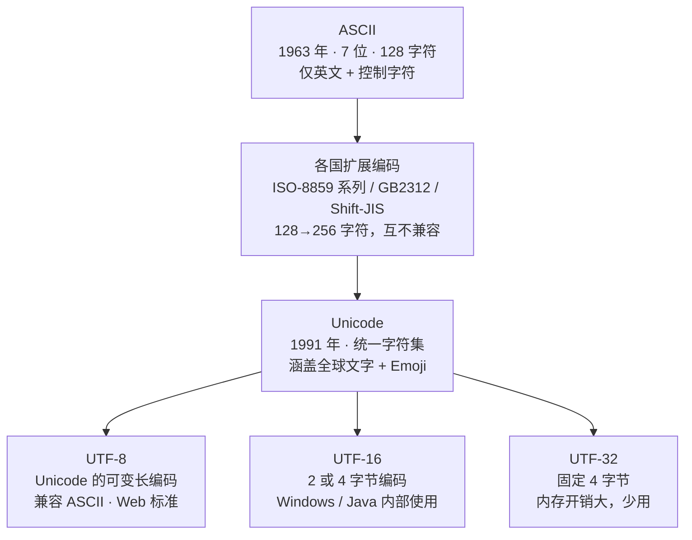
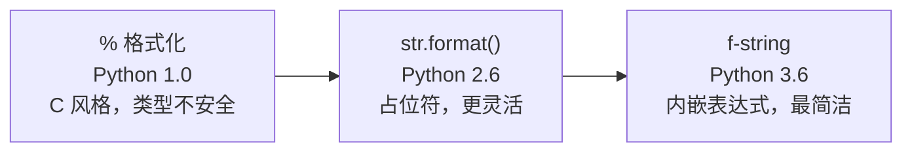
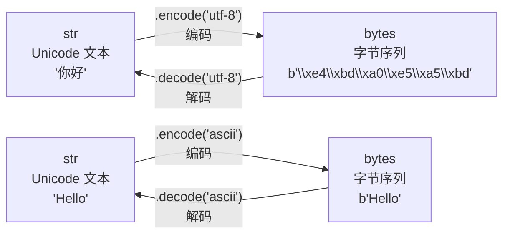

# 字符串

字符串是 Python 中最常用的数据类型之一。Python 3 中字符串默认使用 Unicode 编码，这意味着你可以直接在代码中使用中文、日文、Emoji 等任何字符，而无需额外的编码声明。

理解字符串的三个层次：

- **是什么**：字符串是不可变的 Unicode 字符序列
- **为什么**：不可变性保证安全性、可哈希性和字符串驻留优化；Unicode 默认编码让 Python 3 真正成为国际化语言
- **怎么做**：掌握创建、切片、方法、格式化、编码解码等核心操作

## 字符串编码演进

在深入字符串之前，理解编码的历史演进至关重要——这是理解 `str` 与 `bytes` 区别的基础。



**关键里程碑**：
- ASCII 只能表示 128 个字符（英文足够，中文不行）
- 各国自创编码（GB2312/GBK、Shift-JIS 等），互相不兼容——"乱码"的根源
- Unicode 统一了全球所有字符，每个字符分配唯一码点（如 `U+4F60` = "你"）
- UTF-8 是 Unicode 的一种编码方式，用 1-4 字节表示字符，兼容 ASCII，是当今最流行的编码

## Python 字符串内存模型

理解 Python 字符串在内存中的表示，有助于解释不可变性、驻留等行为。


Python 3 的 `str` 对象内部使用灵活的编码策略：
- 纯 ASCII 字符串：每个字符 1 字节（Latin-1）
- 包含 BMP 字符（U+0000 ~ U+FFFF）：每个字符 2 字节（UCS-2）
- 包含补充字符（如 Emoji）：每个字符 4 字节（UCS-4）

这意味着 Python 会根据字符串内容自动选择最省内存的存储方式。

## 字符串的创建

```python
# ============ 1. 引号创建 ============
# 单引号和双引号完全等价，可互相嵌套
s1 = 'Hello World'               # 单引号
s2 = "Hello World"               # 双引号
s3 = 'He said "hello"'           # 单引号内嵌双引号
s4 = "It's a test"               # 双引号内嵌单引号

# ============ 2. 三引号创建多行字符串 ============
s5 = """这是一个
多行字符串
保留换行和缩进"""

s6 = '''也是多行
字符串'''

# ============ 3. 原始字符串（raw string） ============
# 以 r 或 R 开头，反斜杠不作为转义符
s7 = r"C:\Users\Documents"       # 输出: C:\Users\Documents
s8 = r"\n\t不是转义"              # 输出: \n\t不是转义

# 对比：普通字符串中 \U 会被解释为转义序列
# s9 = "C:\Users\Documents"      # SyntaxError！\U 触发 Unicode 转义，需 8 位十六进制或改用原始字符串

# ============ 4. str() 构造函数 ============
s10 = str(123)                   # 整数转字符串: "123"
s11 = str(3.14)                  # 浮点数转字符串: "3.14"
s12 = str(True)                  # 布尔值转字符串: "True"
s13 = str([1, 2, 3])             # 列表转字符串: "[1, 2, 3]"

# ============ 5. 字节解码 ============
s14 = b'\xe4\xbd\xa0\xe5\xa5\xbd'.decode('utf-8')  # bytes → str: "你好"

# ============ 6. 重复与拼接 ============
s15 = "Ha" * 3                   # 重复: "HaHaHa"
s16 = "Hello" + " " + "World"    # 拼接: "Hello World"
```

## 字符串的不可变性

### 为什么字符串不可变？

```python
s = "Hello"
# s[0] = "h"  # TypeError: 'str' object does not support item assignment
```

字符串不可变（immutable）不是限制，而是设计选择，带来三大核心优势：

| 优势 | 说明 |
|------|------|
| **安全性** | 字符串作为参数传递时，不会被意外修改；网络协议、文件路径等关键数据得以保护 |
| **可哈希性** | 不可变对象才能计算稳定的哈希值，因此字符串可以作为字典的键和集合的元素 |
| **字符串驻留** | 相同内容的字符串可以共享同一内存地址，大幅节省内存 |

### 字符串驻留（String Interning）

```python
# Python 会自动驻留短字符串和标识符风格的字符串
a = "hello"
b = "hello"
print(a is b)        # True —— 指向同一对象（驻留）

# 含特殊字符的字符串不在自动驻留范围（但同一脚本中的字面量会被编译器合并）
c = "hello!"
d = "hello!"
print(c is d)        # True（同一脚本）；交互式逐行执行可能 False —— 实现细节，不应依赖

# 可以手动驻留
import sys
e = sys.intern("hello!")
f = sys.intern("hello!")
print(e is f)        # True —— 手动驻留后共享内存
```

### 不可变 ≠ 不能操作

```python
s = "Hello"
s_upper = s.upper()    # 返回新字符串 "HELLO"，s 不变
print(s)               # 输出: Hello
print(s_upper)         # 输出: HELLO

# 需要修改？重新赋值即可
s = s.upper()
print(s)               # 输出: HELLO
```

## 字符串索引与切片

```python
s = "Hello World"

# ============ 索引 ============
#    索引:  H    e    l    l    o         W    o    r    l    d
#    正向:  0    1    2    3    4    5    6    7    8    9   10
#    反向: -11  -10   -9   -8   -7   -6   -5   -4   -3   -2   -1

print(s[0])           # 输出: H    （正向索引）
print(s[-1])          # 输出: d    （反向索引）
# print(s[100])       # IndexError: string index out of range

# ============ 切片 [start:end:step] ============
# start: 起始索引（包含，默认 0）
# end:   结束索引（不包含，默认末尾）
# step:  步长（默认 1）

# --- 基本切片 ---
print(s[0:5])         # 输出: Hello      （索引 0~4）
print(s[:5])          # 输出: Hello      （省略 start，默认 0）
print(s[6:])          # 输出: World      （省略 end，到末尾）
print(s[6:11])        # 输出: World      （索引 6~10）
print(s[:])           # 输出: Hello World （完整拷贝）

# --- 步长切片 ---
print(s[::2])         # 输出: HloWrd     （每隔 1 个取 1 个）
print(s[1::2])        # 输出: el ol      （从索引 1 开始，每隔 1 个取 1 个）
print(s[::3])         # 输出: HlWl       （每隔 2 个取 1 个）

# --- 反向切片 ---
print(s[::-1])        # 输出: dlroW olleH （反转字符串）
print(s[::-2])        # 输出: drWolH      （反向每隔 1 个取 1 个）
print(s[5:1:-1])      # 输出:  olle       （反向切片：从索引 5 到 2）

# --- 负数索引切片 ---
print(s[-5:])         # 输出: World      （最后 5 个字符）
print(s[-6:-1])       # 输出:  Worl      （倒数第 6 到倒数第 2）
print(s[-1:-6:-1])    # 输出: dlroW      （反向：倒数第 1 到倒数第 5）
```

### 切片速查图

```
字符串:  H   e   l   l   o       W   o   r   l   d
索引:    0   1   2   3   4   5   6   7   8   9  10
反向:  -11 -10  -9  -8  -7  -6  -5  -4  -3  -2  -1

s[0:5]   →  H e l l o
s[6:]    →  W o r l d
s[::2]   →  H l o W r d
s[::-1]  →  d l r o W   o l l e H
```

## 字符串方法分类

### 方法速查表

| 功能分类 | 方法列表 | 常用场景 |
|---------|---------|---------|
| **查找** | `find()`, `rfind()`, `index()`, `rindex()`, `count()` | 搜索子串位置 |
| **替换** | `replace()` | 文本替换、数据清洗 |
| **分割** | `split()`, `rsplit()`, `splitlines()`, `partition()`, `rpartition()` | 解析 CSV、日志 |
| **连接** | `join()` | 列表转字符串 |
| **判断** | `startswith()`, `endswith()`, `isalpha()`, `isdigit()`, `isalnum()`, `isspace()`, `isnumeric()`, `isdecimal()` | 输入验证 |
| **对齐** | `center()`, `ljust()`, `rjust()`, `zfill()` | 格式化输出 |
| **大小写** | `upper()`, `lower()`, `capitalize()`, `title()`, `swapcase()` | 标准化、比较 |
| **去除** | `strip()`, `lstrip()`, `rstrip()` | 清理用户输入 |
| **转换** | `encode()`, `maketrans()`, `translate()`, `expandtabs()` | 编码、字符替换 |

### 查找与替换

```python
s = "Hello World, Hello Python"

# --- find / rfind：查找子串位置，找不到返回 -1 ---
print(s.find('World'))          # 输出: 6   （第一次出现的位置）
print(s.find('Java'))           # 输出: -1  （找不到）
print(s.find('Hello', 5))       # 输出: 13  （从索引 5 开始查找）
print(s.rfind('Hello'))         # 输出: 13  （最后一次出现的位置）

# --- index / rindex：查找子串位置，找不到抛 ValueError ---
print(s.index('World'))         # 输出: 6
# print(s.index('Java'))        # ValueError: substring not found

# --- count：统计子串出现次数 ---
print(s.count('Hello'))         # 输出: 2
print(s.count('l'))             # 输出: 5
print(s.count('l', 0, 5))       # 输出: 2   （只在索引 0~4 范围内统计）

# --- replace：替换子串 ---
print(s.replace('Hello', 'Hi'))            # 输出: Hi World, Hi Python
print(s.replace('Hello', 'Hi', 1))         # 输出: Hi World, Hello Python（只替换 1 次）
```

### 分割与连接

```python
# --- split：按分隔符分割，返回列表 ---
csv = "apple,banana,cherry"
print(csv.split(','))           # 输出: ['apple', 'banana', 'cherry']
print(csv.split(',', 1))        # 输出: ['apple', 'banana,cherry']（最多分割 1 次）

# --- splitlines：按行分割 ---
text = "第一行\n第二行\r\n第三行"
print(text.splitlines())        # 输出: ['第一行', '第二行', '第三行']

# --- partition：分成三部分（前、分隔符、后） ---
print(csv.partition(','))       # 输出: ('apple', ',', 'banana,cherry')

# --- join：将列表连接成字符串 ---
fruits = ['apple', 'banana', 'cherry']
print(','.join(fruits))         # 输出: apple,banana,cherry
print(' | '.join(fruits))       # 输出: apple | banana | cherry
print(''.join(fruits))          # 输出: applebananacherry
```

### 判断方法

```python
# --- startswith / endswith：前缀/后缀检查 ---
print("hello.py".endswith('.py'))      # 输出: True  （判断文件扩展名）
print("https://example.com".startswith('https'))  # 输出: True

# --- 字符类型检查 ---
print("abc".isalpha())         # 输出: True  （是否全为字母）
print("123".isdigit())         # 输出: True  （是否全为数字）
print("abc123".isalnum())      # 输出: True  （是否全为字母或数字）
print("   ".isspace())         # 输出: True  （是否全为空白字符）
print("hello".islower())       # 输出: True  （是否全为小写）
print("HELLO".isupper())       # 输出: True  （是否全为大写）
print("Hello World".istitle()) # 输出: True  （是否为标题格式）

# --- isdigit / isnumeric / isdecimal 的区别 ---
print("123".isdecimal())       # 输出: True  （十进制数字字符）
print("²".isdigit())           # 输出: True  （上标数字，isdecimal 为 False）
print("Ⅲ".isnumeric())         # 输出: True  （罗马数字，前两者为 False）
```

### 对齐与填充

```python
s = "Hi"

# --- center：居中对齐 ---
print(s.center(10, '*'))       # 输出: ****Hi****

# --- ljust / rjust：左/右对齐 ---
print(s.ljust(10, '-'))        # 输出: Hi--------
print(s.rjust(10, '-'))        # 输出: --------Hi

# --- zfill：左侧补零 ---
print("42".zfill(5))           # 输出: 00042
print("-42".zfill(5))          # 输出: -0042  （负号保留在左侧）

# --- f-string 对齐（推荐） ---
print(f"'{s:>10}'")            # 输出: '        Hi' （右对齐）
print(f"'{s:<10}'")            # 输出: 'Hi        ' （左对齐）
print(f"'{s:^10}'")            # 输出: '    Hi    ' （居中）
print(f"'{s:*^10}'")           # 输出: '****Hi****' （居中 + 填充）
```

### 大小写转换

```python
s = "hELLo wORLd"
print(s.upper())               # 输出: HELLO WORLD
print(s.lower())               # 输出: hello world
print(s.capitalize())          # 输出: Hello world（首字母大写，其余小写）
print(s.title())               # 输出: Hello World（每个单词首字母大写）
print(s.swapcase())            # 输出: HellO WorlD（大小写互换）

# 实用：不区分大小写比较
s1, s2 = "Hello", "hello"
print(s1.lower() == s2.lower())  # 输出: True
```

### 去除空白

```python
s = "   Hello World   "
print(s.strip())               # 输出: 'Hello World' （去除两端空白）
print(s.lstrip())              # 输出: 'Hello World   ' （去除左侧）
print(s.rstrip())              # 输出: '   Hello World' （去除右侧）

# strip 可指定去除的字符
print("***Hello***".strip('*')) # 输出: 'Hello'
print(",,Hello,,".strip(','))   # 输出: 'Hello'

# 去除所有空白字符
s_all = "  Hel \t lo \n World  "
import re
print(re.sub(r'\s+', '', s_all))  # 输出: HelloWorld
```

## 字符串格式化

### 格式化方法演进



### 格式化方法对比

| 特性 | `%` 格式化 | `str.format()` | f-string |
|------|-----------|----------------|----------|
| Python 版本 | 所有版本 | 2.6+ | 3.6+ |
| 可读性 | 差（类型占位符与值分离） | 中（占位符需对应） | 好（变量直接内嵌） |
| 性能 | 最慢 | 中等 | 最快 |
| 表达式支持 | 不支持 | 有限 | 完整支持 |
| 调试支持 | 无 | 无 | `=` 语法（3.8+） |
| 国际化 | 常用 | 常用 | 不适用 |
| 推荐场景 | 旧代码兼容 | 模板/国际化 | 日常格式化 |

### % 格式化（旧式，了解即可）

```python
name = "Alice"
age = 30
price = 99.999

# 基本用法：类型占位符
print("Name: %s, Age: %d" % (name, age))   # 输出: Name: Alice, Age: 30
print("Price: %.2f" % price)               # 输出: Price: 100.00
print("Hex: %x" % 255)                     # 输出: Hex: ff

# 常用占位符：
# %s  字符串    %d  整数    %f  浮点数
# %x  十六进制  %o  八进制   %e  科学计数法
```

### str.format()

```python
name = "Alice"
age = 30
price = 99.999

# 位置参数
print("Name: {}, Age: {}".format(name, age))        # 输出: Name: Alice, Age: 30
print("Name: {0}, Age: {1}, Again: {0}".format(name, age))  # 可重复使用

# 关键字参数
print("Name: {name}, Age: {age}".format(name="Bob", age=25))

# 格式化数字
print("Price: {:.2f}".format(price))                # 输出: Price: 100.00
print("Number: {:05d}".format(42))                   # 输出: Number: 00042
print("Percent: {:.1%}".format(0.856))               # 输出: Percent: 85.6%
```

### f-string（推荐，Python 3.6+）

```python
name = "Alice"
age = 30
price = 99.999

# ============ 基本用法 ============
print(f"Name: {name}, Age: {age}")       # 输出: Name: Alice, Age: 30

# ============ 内嵌表达式 ============
print(f"10 + 20 = {10 + 20}")            # 输出: 10 + 20 = 30
print(f"{'hello'.upper()}")              # 输出: HELLO
print(f"列表长度: {len([1, 2, 3])}")      # 输出: 列表长度: 3

# ============ 调试语法（Python 3.8+） ============
x = 42
print(f"{x = }")                         # 输出: x = 42
print(f"{x * 2 = }")                     # 输出: x * 2 = 84
print(f"{name = }, {age = }")            # 输出: name = 'Alice', age = 30

# ============ 格式化数字 ============
print(f"Price: {price:.2f}")              # 输出: Price: 100.00
print(f"整数补零: {42:05d}")              # 输出: 整数补零: 00042
print(f"百分比: {0.856:.1%}")             # 输出: 百分比: 85.6%
print(f"千位分隔: {1234567:,}")           # 输出: 千位分隔: 1,234,567
print(f"科学计数: {1234.5:.2e}")          # 输出: 科学计数: 1.23e+03

# ============ 格式化日期 ============
from datetime import datetime
now = datetime(2026, 6, 4, 14, 30, 0)
print(f"日期: {now:%Y-%m-%d}")            # 输出: 日期: 2026-06-04
print(f"时间: {now:%H:%M:%S}")            # 输出: 时间: 14:30:00
print(f"完整: {now:%Y年%m月%d日 %H:%M}")   # 输出: 完整: 2026年06月04日 14:30

# ============ 对齐 ============
text = "Hello"
print(f"'{text:>10}'")                    # 输出: '     Hello' （右对齐）
print(f"'{text:<10}'")                    # 输出: 'Hello     ' （左对齐）
print(f"'{text:^10}'")                    # 输出: '  Hello   ' （居中）
print(f"'{text:*^10}'")                   # 输出: '**Hello***' （居中 + 填充）

# ============ 进制转换 ============
num = 255
print(f"二进制: {num:b}")                 # 输出: 二进制: 11111111
print(f"八进制: {num:o}")                 # 输出: 八进制: 377
print(f"十六进制: {num:x}")               # 输出: 十六进制: ff
print(f"十六进制(大写): {num:X}")          # 输出: 十六进制(大写): FF
```

## str 与 bytes

### 为什么需要区分？

在 Python 2 中，`str` 和 `bytes` 是同一个类型，这导致了大量的编码混乱。Python 3 严格区分：

| 类型 | 本质 | 用途 | 示例 |
|------|------|------|------|
| `str` | Unicode 文本 | 文本处理 | `"你好"` |
| `bytes` | 二进制数据（0-255 的字节序列） | 网络传输、文件 I/O | `b'\xe4\xbd\xa0'` |

**核心原则**：在程序内部始终使用 `str` 处理文本；在 I/O 边界（网络、磁盘）使用 `bytes`。

### str 与 bytes 的转换关系



### 编码解码完整示例

```python
# ============ str → bytes（编码） ============
text = "你好，世界！"

# UTF-8 编码（推荐，Web 标准）
utf8_bytes = text.encode('utf-8')          # b'\xe4\xbd\xa0\xe5\xa5\xbd...'
print(f"UTF-8 字节数: {len(utf8_bytes)}")   # 输出: 18（6 个字符，每个 3 字节）

# GBK 编码（中文 Windows 常用）
gbk_bytes = text.encode('gbk')             # b'\xc4\xe3\xba\xc3...'
print(f"GBK 字节数: {len(gbk_bytes)}")      # 输出: 12（每个字符 2 字节）

# ASCII 编码（无法编码中文，会报错）
# text.encode('ascii')                     # UnicodeEncodeError!
text.encode('ascii', errors='ignore')      # 丢弃无法编码的字符
text.encode('ascii', errors='replace')     # 用 ? 替换

# ============ bytes → str（解码） ============
# 必须使用正确的编码方式解码，否则乱码或报错
decoded = utf8_bytes.decode('utf-8')       # 输出: 你好，世界！
# utf8_bytes.decode('gbk')                 # 用错误编码解码 → 乱码或 UnicodeDecodeError

# 处理解码错误
bad_bytes = b'\xe4\xbd\xa0\xe5'           # 不完整的 UTF-8 序列
# bad_bytes.decode('utf-8')               # UnicodeDecodeError!
print(bad_bytes.decode('utf-8', errors='ignore'))   # 输出: 你（忽略错误部分）
print(bad_bytes.decode('utf-8', errors='replace'))  # 输出: 你�（用替换标记代替）

# ============ 文件读写编码 ============
# 写入文件时指定编码
with open('example.txt', 'w', encoding='utf-8') as f:
    f.write("你好，世界！")

# 读取文件时指定编码
with open('example.txt', 'r', encoding='utf-8') as f:
    content = f.read()
    print(content)                         # 输出: 你好，世界！

# 以二进制模式读取
with open('example.txt', 'rb') as f:
    raw = f.read()                         # 返回 bytes
    print(type(raw))                       # 输出: <class 'bytes'>
    print(raw.decode('utf-8'))             # 手动解码
```

### 编码选择对比

| 编码 | 每个中文字符 | 兼容 ASCII | 适用场景 |
|------|------------|-----------|---------|
| UTF-8 | 3 字节 | 完全兼容 | Web、跨平台、推荐默认 |
| GBK | 2 字节 | 部分兼容 | 中文 Windows 遗留系统 |
| ASCII | 不支持中文 | 本身就是 ASCII | 纯英文环境 |

## 正则表达式基础

```python
import re

# ============ 基本匹配 ============
text = "我的电话是 138-1234-5678，邮箱是 test@example.com"

# search：搜索第一个匹配
phone = re.search(r'\d{3}-\d{4}-\d{4}', text)
if phone:
    print(phone.group())                   # 输出: 138-1234-5678

# ============ 常用方法 ============
# findall：找出所有匹配，返回列表
emails = re.findall(r'\w+@\w+\.\w+', text)
print(emails)                              # 输出: ['test@example.com']

# sub：替换匹配项
hidden = re.sub(r'\d{4}', '****', text)
print(hidden)                              # 输出: 我的电话是 138-****-****，邮箱是...

# split：按模式分割
result = re.split(r'[,，]', "a,b，c,d")
print(result)                              # 输出: ['a', 'b', 'c', 'd']

# match：从字符串开头匹配
m = re.match(r'Hello', 'Hello World')
print(m.group() if m else "不匹配")        # 输出: Hello

# fullmatch：完全匹配
print(re.fullmatch(r'\d{3}', '123') is not None)   # 输出: True
print(re.fullmatch(r'\d{3}', '1234') is not None)  # 输出: False

# ============ 预编译正则（推荐用于重复匹配） ============
phone_pattern = re.compile(r'\d{3}-\d{4}-\d{4}')
print(phone_pattern.search(text).group())  # 输出: 138-1234-5678

# ============ 分组 ============
m = re.search(r'(\d{3})-(\d{4})-(\d{4})', text)
if m:
    print(m.group(0))                      # 输出: 138-1234-5678（完整匹配）
    print(m.group(1))                      # 输出: 138（第 1 组）
    print(m.group(2))                      # 输出: 1234（第 2 组）
    print(m.groups())                      # 输出: ('138', '1234', '5678')

# 命名分组
m = re.search(r'(?P<area>\d{3})-(?P<prefix>\d{4})-(?P<line>\d{4})', text)
if m:
    print(m.group('area'))                 # 输出: 138

# ============ 常用正则模式速查 ============
# \d  数字    \D  非数字
# \w  字母数字下划线  \W  非\w
# \s  空白字符  \S  非空白
# .   任意字符（除换行）  ^  开头  $  结尾
# *   0次或多次  +  1次或多次  ?  0次或1次
# {n} 恰好n次   {n,} 至少n次   {n,m} n到m次
```

## 字符串拼接方法对比

| 方法 | 性能 | 可读性 | 适用场景 |
|------|------|--------|---------|
| `+` 拼接 | 差（每次创建新对象） | 好 | 少量拼接（2-3 个） |
| `join()` | 优（一次分配内存） | 中 | 列表/迭代器拼接 |
| f-string | 优 | 最佳 | 变量嵌入拼接 |
| `%` 格式化 | 差 | 差 | 旧代码兼容 |
| `io.StringIO` | 优 | 中 | 大量追加式拼接 |

```python
# ============ 性能对比 ============
import time

# 方法 1：+ 拼接（不推荐循环中使用）
start = time.perf_counter()
result = ""
for i in range(10000):
    result += str(i)
time_plus = time.perf_counter() - start

# 方法 2：join（推荐）
start = time.perf_counter()
result = "".join(str(i) for i in range(10000))
time_join = time.perf_counter() - start

# 方法 3：列表 + join（推荐）
start = time.perf_counter()
parts = [str(i) for i in range(10000)]
result = "".join(parts)
time_list_join = time.perf_counter() - start

print(f"+ 拼接: {time_plus:.4f}s")
print(f"join(生成器): {time_join:.4f}s")
print(f"列表+join: {time_list_join:.4f}s")
# 典型输出：+ 拼接最慢，join 最快
```

## 常见陷阱与 FAQ

### 陷阱 1：循环中 += 拼接的性能问题

```python
# 陷阱：每次 += 都创建新字符串对象（O(n²) 时间复杂度）
result = ""
for i in range(10000):
    result += str(i)           # 每次都分配新内存，复制旧内容

# 正确做法：使用 join（O(n) 时间复杂度）
result = "".join(str(i) for i in range(10000))
```

**原因**：字符串不可变，`+=` 每次都要创建新对象并复制所有旧内容。虽然 CPython 对此有优化（引用计数为 1 时原地修改），但不应依赖此优化。

### 陷阱 2：UnicodeDecodeError 排查

```python
# 常见场景：读取文件时编码不匹配
# with open('data.txt', 'r') as f:     # 默认用系统编码，可能报错
#     content = f.read()

# 排查步骤：
# 1. 明确指定编码
with open('data.txt', 'r', encoding='utf-8') as f:
    content = f.read()

# 2. 如果仍然报错，用 errors 参数处理
with open('data.txt', 'r', encoding='utf-8', errors='replace') as f:
    content = f.read()          # 无法解码的字节替换为 �

# 3. 探测文件编码（第三方库）
# pip install chardet
# import chardet
# with open('data.txt', 'rb') as f:
#     result = chardet.detect(f.read())
#     print(result)  # {'encoding': 'GBK', 'confidence': 0.99}
```

**常见编码错误原因**：
- 文件实际是 GBK 编码，但用 UTF-8 解码
- 文件中混用了多种编码
- 文件传输过程中字节被截断

### 陷阱 3：f-string 中引号嵌套

```python
# Python 3.11 之前：f-string 内不能使用与外部相同的引号
# name = "Alice"
# print(f"Hello, {name.replace("Alice", "Bob")}")    # SyntaxError!

# 解决方案 1：使用不同的引号
name = "Alice"
print(f"Hello, {name.replace('Alice', 'Bob')}")       # 输出: Hello, Bob

# 解决方案 2：使用转义（Python 3.12+ 支持）
# print(f"Hello, {name.replace(\"Alice\", \"Bob\")}")  # Python 3.12+

# 解决方案 3：先计算，再嵌入
new_name = name.replace("Alice", "Bob")
print(f"Hello, {new_name}")                            # 输出: Hello, Bob
```

### 陷阱 4：raw string 末尾反斜杠

```python
# raw string 中反斜杠不转义，但末尾不能是奇数个反斜杠
# print(r"Hello\")               # SyntaxError: EOL while scanning string literal

# 原因：raw string 的设计是让正则表达式更易读，
# 但 Python 词法分析器仍需识别字符串边界（引号），
# 末尾的反斜杠会转义掉闭合引号

# 解决方案：拼接
path = r"C:\Users\Documents" + "\\"   # 末尾反斜杠用普通字符串补充
print(path)                            # 输出: C:\Users\Documents\
```

### 陷阱 5：字符串比较的陷阱

```python
# 大小写敏感
print("Apple" < "apple")              # 输出: True（大写 ASCII 值更小）
print("apple" == "APPLE".lower())     # 输出: True（先统一大小写再比较）

# is vs ==：比较内容用 ==，比较身份用 is
a = "hello"
b = "hello"
print(a == b)                          # 输出: True（内容相等）
print(a is b)                          # 输出: True（驻留，同一对象）

c = "hello!"
d = "hello!"
print(c == d)                          # 输出: True（内容相等）
print(c is d)                          # True（同一脚本中字面量被合并；是否驻留是实现细节，不应依赖）
```

### FAQ：如何判断字符串是否包含中文？

```python
def contains_chinese(text: str) -> bool:
    """判断字符串是否包含中文字符"""
    for char in text:
        if '一' <= char <= '鿿':
            return True
    return False

# 更通用的方法：判断是否包含非 ASCII 字符
def contains_non_ascii(text: str) -> bool:
    return any(ord(char) > 127 for char in text)

print(contains_chinese("Hello 世界"))     # 输出: True
print(contains_chinese("Hello World"))    # 输出: False
print(contains_non_ascii("Hello 世界"))   # 输出: True
```

### FAQ：单引号、双引号、三引号有什么区别？

- **单引号 / 双引号**：功能完全等价，可互相嵌套
- **三引号**：用于多行字符串，保留换行和缩进，也常用作文档字符串（docstring）
- 选择建议：项目内保持一致即可；Python 官方风格指南 PEP 8 未强制要求

### FAQ：f-string 和 format() 哪个更好？

| 场景 | 推荐 | 原因 |
|------|------|------|
| 日常格式化 | f-string | 简洁、可读、快速 |
| 模板字符串 | format() | 模板可存储、复用 |
| 国际化（i18n） | format() / % | 需要翻译时占位符顺序可变 |
| 日志格式化 | % | logging 模块延迟格式化，性能更好 |

```python
# 模板场景：format() 更灵活
template = "Dear {name}, your order {order_id} has been shipped."
msg = template.format(name="Alice", order_id="ORD-001")

# logging 场景：% 延迟格式化
import logging
logging.info("User %s logged in from %s", username, ip)
# 不会在日志级别低于 INFO 时浪费格式化时间
```

## 字符串转义字符

```python
# 常用转义字符
print("Hello\nWorld")    # \n - 换行
print("Hello\tWorld")    # \t - 制表符
print("Hello\\World")    # \\ - 反斜杠
print("Hello\'World")    # \' - 单引号
print("Hello\"World")    # \" - 双引号
print("Hello\rWorld")    # \r - 回车
print("Hello\bWorld")    # \b - 退格

# 原始字符串（不转义）
print(r"Hello\nWorld")   # 输出: Hello\nWorld（不转义）

# 完整转义字符表：
# \\  反斜杠    \'  单引号    \"  双引号
# \a  响铃      \b  退格      \f  换页
# \n  换行      \r  回车      \t  水平制表符
# \v  垂直制表符  \ooo 八进制值  \xhh 十六进制值
# \N{name} Unicode 字符名   \uxxxx 16位 Unicode   \Uxxxxxxxx 32位 Unicode
```

## 字符串迭代与枚举

```python
# ============ 遍历字符 ============
s = "Hello"
for char in s:
    print(char, end=" ")                  # 输出: H e l l o

# ============ enumerate：带索引遍历 ============
for index, char in enumerate(s):
    print(f"Index {index}: {char}")
# 输出:
# Index 0: H
# Index 1: e
# Index 2: l
# Index 3: l
# Index 4: o

# 指定起始索引
for pos, char in enumerate(s, start=1):
    print(f"Position {pos}: {char}")

# ============ zip：并行遍历 ============
s1, s2 = "abc", "123"
for a, b in zip(s1, s2):
    print(f"{a} -> {b}")
# 输出:
# a -> 1
# b -> 2
# c -> 3

# 组合多个字符串
result = list(zip("abc", "def"))
print(result)                              # 输出: [('a', 'd'), ('b', 'e'), ('c', 'f')]
```

## 术语表

| 术语 | 英文 | 定义 |
|------|------|------|
| Unicode | Unicode | 统一字符编码标准，为全球每种文字的每个字符分配唯一码点（如 `U+4F60`），解决不同编码不兼容的问题 |
| UTF-8 | Unicode Transformation Format - 8-bit | Unicode 的一种可变长编码方式，用 1~4 字节表示字符，兼容 ASCII，是 Web 上最流行的编码 |
| ASCII | American Standard Code for Information Interchange | 美国信息交换标准代码，7 位编码共 128 个字符，仅覆盖英文字母、数字和常用符号 |
| 编码 | Encoding | 将 Unicode 字符串转换为字节序列的过程（`str` → `bytes`），如 `"你好".encode('utf-8')` |
| 解码 | Decoding | 将字节序列还原为 Unicode 字符串的过程（`bytes` → `str`），如 `b'\xe4\xbd\xa0'.decode('utf-8')` |
| 字符串驻留 | String Interning | Python 的内存优化机制，让相同内容的字符串共享同一内存地址，可通过 `sys.intern()` 手动触发 |
| 不可变序列 | Immutable Sequence | 创建后内容不可修改的序列类型，字符串、元组属于此类；列表、字节数组属于可变序列 |
| raw string | Raw String Literal | 以 `r` 或 `R` 前缀的字符串，反斜杠不作为转义符，常用于正则表达式和 Windows 路径 |

## 延伸阅读

- [数据类型](07-数据类型) —— 字符串在 Python 类型系统中的位置
- [文件操作](16-文件操作) —— 文件读写中的编码处理
- [异常处理](15-异常处理) —— UnicodeDecodeError 等编码异常的捕获与处理

## 版本差异（Python 3.8-3.12 → 3.14）

| 特性 | 本文编写时 | Python 3.14 |
|------|-----------|-------------|
| 类型注解求值 | 运行时立即求值 | PEP 649/749 延迟求值：注解不再在定义时执行，解决前向引用，提升启动性能 |
| 字符串模板 | 普通 f-string / `str.format` | PEP 750 模板字符串 `t"..."`：可插值且能被安全处理（3.14 新特性） |
| 标准库多解释器 | 无官方支持 | PEP 734：`concurrent.interpreters` 模块支持在同一进程创建多个子解释器 |
| 调试 | 仅 Python 内建 pdb / IDE 调试 | PEP 768：安全的 CPython 外部调试器接口（custom debugger protocol） |
| 字节码与运行时 | 3.12 前无 JIT | 3.13 引入实验性 JIT（PEP 744）；3.14 进一步改进 free-threaded（无 GIL）构建 |
| `datetime` API | `utcnow()` 常用 | 3.12 起弃用，官方要求改用 `datetime.now(tz=datetime.UTC)`（aware 对象） |
| 压缩算法 | zlib / gzip / bz2 / lzma | 3.14 新增标准库 Zstandard 支持（PEP 784） |

> 本文讲解的语法与数据结构原理在 3.14 中依然成立；新项目建议基于 Python 3.13/3.14，并优先使用 aware datetime、PEP 649 注解与最新类型语法。
