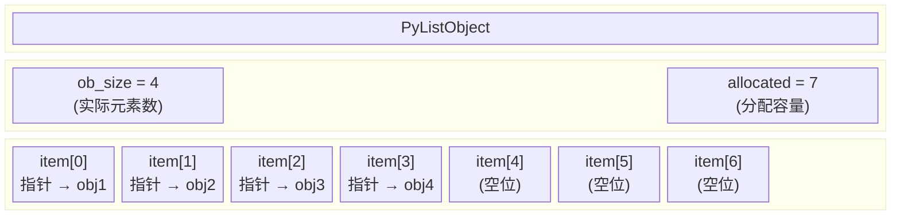
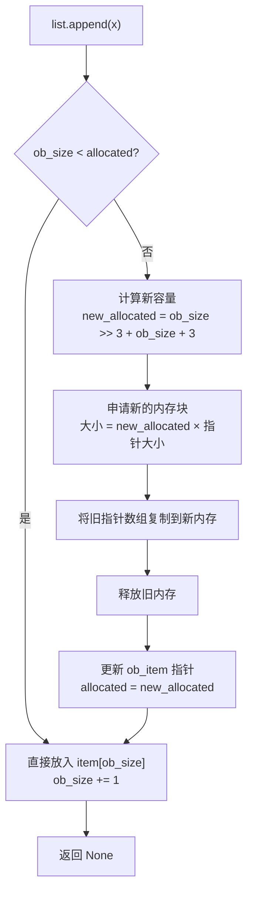
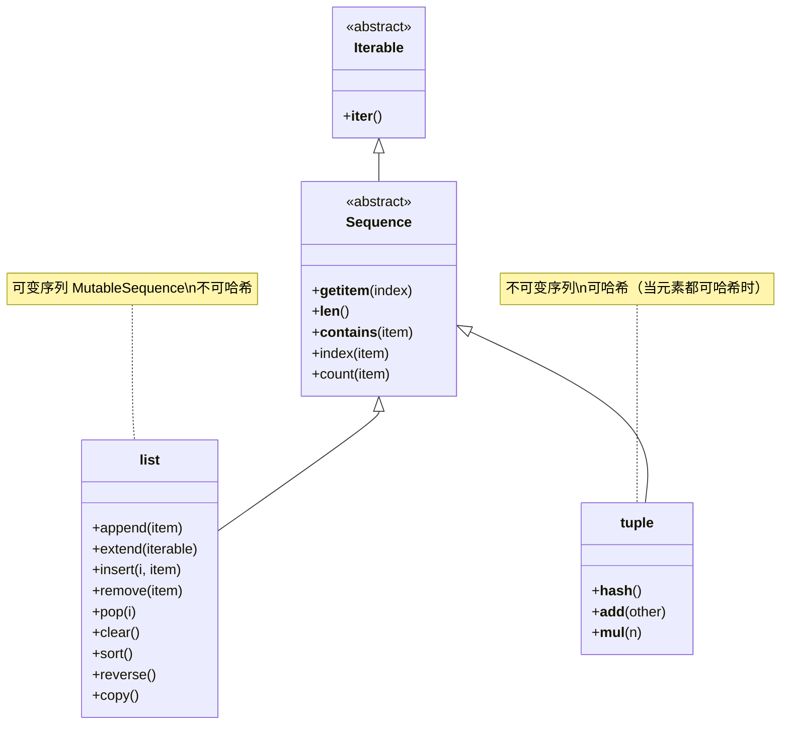
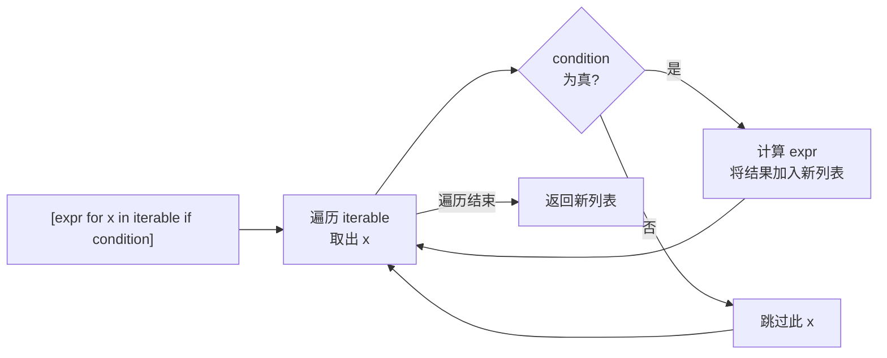

# 列表与元组

Python 中的列表（`list`）和元组（`tuple`）是最常用的两种**有序序列**。它们都能存储任意类型的元素、支持索引和切片，但一个核心差异决定了它们的分工——**可变性**。

理解这个差异，不能只停留在"列表能改、元组不能改"的表面，而要深入到**为什么**这样设计、**底层**如何实现、以及**何时**该选谁。

## 核心概念：是什么 → 为什么 → 怎么做

### 列表是什么？

列表是一种**可变的有序序列**，用方括号 `[]` 表示，元素之间用逗号分隔。

- **可变性**：创建后可以添加、删除、修改元素
- **有序性**：元素有固定位置，通过索引访问
- **允许重复**：可以包含重复元素
- **动态大小**：长度可动态调整，无需预定义

### 元组是什么？

元组是一种**不可变的有序序列**，用圆括号 `()` 表示，元素之间用逗号分隔。

- **不可变性**：创建后不能添加、删除、修改元素
- **有序性**：元素有固定位置，通过索引访问
- **允许重复**：可以包含重复元素
- **可哈希性**：当所有元素都可哈希时，元组本身也可哈希

### 为什么列表可变而元组不可变？

这并非随意的设计选择，而是两种不同的**语义承诺**：

1. **列表的可变性 = 灵活性**：列表承诺"我可以随时改变"，因此 Python 必须为它预留增长空间（过度分配），也意味着它的内容随时可能变化，不能作为字典的键。

2. **元组的不可变性 = 安全性**：元组承诺"我永远不会变"，因此 Python 可以对它做更多优化——不需要预留空间、不需要维护扩容逻辑、内容固定后可以计算哈希值、可以作为字典的键。

### 为什么有了列表还需要元组？

| 原因 | 说明 |
|------|------|
| **可哈希** | 元组（当元素都可哈希时）可以作为字典的键或放入集合，列表不行 |
| **安全性** | 不可变意味着不会被意外修改，适合作为常量或函数返回值 |
| **性能** | 元组创建更快、内存更省、遍历更快 |
| **语义清晰** | 用元组表达"这组数据是一个整体、不应被拆改"的意图 |

### 列表底层：动态数组如何工作

Python 的列表在 CPython 中由 `PyListObject` 实现，其核心是一个**指针数组**（动态数组）。理解它的内部结构，才能理解列表操作的性能特征。



关键点：

- **ob_size**：列表中实际存储的元素个数（即 `len()` 返回的值）
- **allocated**：底层数组分配的总容量（总是 >= ob_size）
- **过度分配（over-allocation）**：当列表需要扩容时，Python 不会只多分配 1 个位置，而是按公式多分配一些，以减少频繁的内存重分配

### 列表扩容机制流程

当 `append()` 添加元素时，如果容量不足，CPython 会触发扩容：



扩容公式（CPython 源码简化）：

```
new_allocated = (ob_size >> 3) + ob_size + 3
```

这意味着：列表长度每增长约 9/8 倍时，容量才增长一次。这种策略使得 `append()` 的**均摊时间复杂度**为 O(1)。

### 为什么元组比列表快？

元组不需要维护扩容逻辑，CPython 对元组做了多项优化：

1. **无过度分配**：元组长度固定，分配的内存恰好等于元素所需，没有空位
2. **更小的对象头**：元组的 C 结构体比列表少了一个 `allocated` 字段
3. **缓存复用**：CPython 会通过空闲列表缓存长度 0~20 的元组（含空元组）供创建时直接复用
4. **编译期常量折叠**：代码中出现的元组字面量，编译器可能直接折叠为常量，避免运行时创建

```python
import sys

# 同样内容的列表和元组，元组更省内存
lst = [1, 2, 3, 4, 5]
tpl = (1, 2, 3, 4, 5)

print(f"列表内存: {sys.getsizeof(lst)} 字节")  # 104 字节（64 位 CPython）
print(f"元组内存: {sys.getsizeof(tpl)} 字节")  #  88 字节（64 位 CPython）
```

### list vs tuple 继承关系与共享接口



两者共享 `Sequence` 接口（索引、切片、`len`、`count`、`index`、`in`），但 list 额外实现了 `MutableSequence` 的增删改方法，tuple 则额外支持 `__hash__`。

## 列表详解

### 创建列表的所有方式

```python
# ---- 方式 1：字面量 ----
empty = []                                    # 空列表
fruits = ['苹果', '香蕉', '橙子']              # 多元素
mixed = [1, 'Hello', 3.14, True]              # 混合类型
nested = [[1, 2], [3, 4]]                     # 嵌套列表

# ---- 方式 2：list() 构造器 ----
from_range = list(range(1, 6))                # [1, 2, 3, 4, 5]
from_string = list('Python')                  # ['P', 'y', 't', 'h', 'o', 'n']
from_tuple = list((10, 20, 30))               # [10, 20, 30]
from_set = list({3, 1, 2})                    # [1, 2, 3]（顺序不确定）

# ---- 方式 3：列表推导式 ----
squares = [x**2 for x in range(1, 11)]        # [1, 4, 9, 16, 25, 36, 49, 64, 81, 100]
evens = [x for x in range(20) if x % 2 == 0]  # [0, 2, 4, 6, 8, 10, 12, 14, 16, 18]

# ---- 方式 4：range() 直接转列表 ----
step_list = list(range(0, 20, 3))             # [0, 3, 6, 9, 12, 15, 18]

# ---- 方式 5：* 运算符重复 ----
zeros = [0] * 5                                # [0, 0, 0, 0, 0]

print(f"字面量: {fruits}")
print(f"list(range): {from_range}")
print(f"list(string): {from_string}")
print(f"推导式: {squares}")
print(f"重复: {zeros}")
```

### CRUD 操作完整示例

```python
fruits = ['苹果', '香蕉', '橙子']

# ==================== Create（创建/添加）====================
# append: 末尾追加单个元素
fruits.append('葡萄')                          # ['苹果', '香蕉', '橙子', '葡萄']

# insert: 指定位置插入
fruits.insert(1, '梨')                         # ['苹果', '梨', '香蕉', '橙子', '葡萄']

# extend: 追加可迭代对象的所有元素
fruits.extend(['樱桃', '芒果'])                 # [..., '樱桃', '芒果']

# + 拼接（创建新列表，不修改原列表）
more = fruits + ['西瓜']                        # 新列表，fruits 不变

# ==================== Read（读取）====================
print(fruits[0])                               # '苹果' — 正向索引
print(fruits[-1])                              # '芒果' — 反向索引
print('梨' in fruits)                          # True  — 成员检测
print(fruits.index('橙子'))                     # 3     — 查找索引
print(fruits.count('苹果'))                     # 1     — 计数

# ==================== Update（修改）====================
fruits[1] = '蓝莓'                             # 修改单个元素
fruits[2:4] = ['猕猴桃', '柠檬']                # 切片赋值（替换一段）

# ==================== Delete（删除）====================
fruits.remove('蓝莓')                          # 按值删除（只删第一个匹配）
popped = fruits.pop()                          # 弹出末尾元素，返回被弹出的值
popped_at = fruits.pop(0)                      # 弹出指定索引
del fruits[1]                                  # 按索引删除（不返回值）
fruits[1:3] = []                               # 切片赋空列表 = 删除一段
fruits.clear()                                 # 清空整个列表

print(f"清空后: {fruits}")                       # []
```

### 切片高级用法

切片语法：`list[start:stop:step]`，**左闭右开**（包含 start，不包含 stop）。

```python
nums = [0, 1, 2, 3, 4, 5, 6, 7, 8, 9]

# ---- 基础切片 ----
print(nums[2:7])       # [2, 3, 4, 5, 6]   — 索引 2 到 6
print(nums[:5])        # [0, 1, 2, 3, 4]   — 从头到索引 4
print(nums[5:])        # [5, 6, 7, 8, 9]   — 从索引 5 到末尾
print(nums[:])         # [0, 1, 2, ..., 9] — 完整复制

# ---- 步长 ----
print(nums[::2])       # [0, 2, 4, 6, 8]   — 每隔一个取
print(nums[1::3])      # [1, 4, 7]         — 从索引 1 开始，步长 3
print(nums[::-1])      # [9, 8, 7, ..., 0] — 反转
print(nums[::-2])      # [9, 7, 5, 3, 1]   — 反向步长 2

# ---- 切片赋值（修改）----
nums[2:5] = [20, 30]   # 长度可以不同！[0, 1, 20, 30, 5, 6, 7, 8, 9]
print(f"切片赋值: {nums}")

# ---- 切片删除 ----
nums[1:3] = []          # 删除索引 1-2 的元素
print(f"切片删除: {nums}")

# ---- 切片插入 ----
nums[1:1] = [100, 200]  # 在索引 1 处插入（不删除任何元素）
print(f"切片插入: {nums}")
```

### 列表推导式

列表推导式（List Comprehension）是用简洁语法从可迭代对象创建列表的方式。

#### 执行流程



#### 基本推导式

```python
# 基本形式：[表达式 for 变量 in 可迭代对象]
squares = [x**2 for x in range(1, 11)]
print(squares)  # [1, 4, 9, 16, 25, 36, 49, 64, 81, 100]

# 带条件过滤：[表达式 for 变量 in 可迭代对象 if 条件]
evens = [x for x in range(1, 21) if x % 2 == 0]
print(evens)  # [2, 4, 6, 8, 10, 12, 14, 16, 18, 20]

# 表达式中使用条件：[值1 if 条件 else 值2 for 变量 in 可迭代对象]
labels = ['偶' if x % 2 == 0 else '奇' for x in range(5)]
print(labels)  # ['偶', '奇', '偶', '奇', '偶']
```

#### 嵌套推导式

```python
# 嵌套推导式：相当于嵌套 for 循环
# [expr for x in iter1 for y in iter2]
pairs = [(x, y) for x in range(3) for y in range(3)]
print(pairs)
# [(0,0), (0,1), (0,2), (1,0), (1,1), (1,2), (2,0), (2,1), (2,2)]

# 等价的 for 循环写法（对比理解）
pairs_for = []
for x in range(3):
    for y in range(3):
        pairs_for.append((x, y))
# 结果相同

# 实际应用：展平二维列表
matrix = [[1, 2, 3], [4, 5, 6], [7, 8, 9]]
flat = [num for row in matrix for num in row]
print(flat)  # [1, 2, 3, 4, 5, 6, 7, 8, 9]
```

#### 生成器表达式

当不需要立即得到完整列表，只需逐个迭代时，用生成器表达式更省内存：

```python
# 列表推导式：立即创建完整列表，占用内存
list_comp = [x**2 for x in range(1000000)]

# 生成器表达式：惰性求值，几乎不占内存
gen_expr = (x**2 for x in range(1000000))

print(type(list_comp))  # <class 'list'>
print(type(gen_expr))   # <class 'generator'>

# 生成器可以传给 sum/max/min 等函数，无需先创建列表
total = sum(x**2 for x in range(100))  # 省内存
print(total)  # 328350
```

### 排序方法对比

```python
# ---- list.sort()：原地排序，返回 None ----
nums = [3, 1, 4, 1, 5, 9, 2, 6]
result = nums.sort()                # 原地修改
print(f"sort() 返回值: {result}")    # None
print(f"排序后列表: {nums}")          # [1, 1, 2, 3, 4, 5, 6, 9]

# ---- sorted()：返回新列表，不修改原序列 ----
nums = [3, 1, 4, 1, 5, 9, 2, 6]
new_nums = sorted(nums)
print(f"sorted() 返回值: {new_nums}")  # [1, 1, 2, 3, 4, 5, 6, 9]
print(f"原列表不变: {nums}")            # [3, 1, 4, 1, 5, 9, 2, 6]

# ---- 降序 ----
nums.sort(reverse=True)
print(f"降序: {nums}")  # [9, 6, 5, 4, 3, 2, 1, 1]

# ---- 自定义排序键 ----
words = ['banana', 'pie', 'Washington', 'book']
words.sort(key=len)                  # 按长度排序
print(f"按长度: {words}")              # ['pie', 'book', 'banana', 'Washington']

words.sort(key=str.lower)            # 忽略大小写
print(f"忽略大小写: {words}")          # ['banana', 'book', 'pie', 'Washington']

# ---- sorted() 可用于任何可迭代对象 ----
print(sorted('python'))              # ['h', 'n', 'o', 'p', 't', 'y']
print(sorted({3, 1, 2}))             # [1, 2, 3]
print(sorted((9, 5, 2)))             # [2, 5, 9]
```

## 元组详解

### 创建元组

```python
# ---- 空元组 ----
empty = ()

# ---- 多元素元组 ----
colors = ('红色', '绿色', '蓝色')

# ---- 单元素元组（注意末尾逗号！）----
single = (1,)          # 元组
not_tuple = (1)        # 整数！括号被当作数学运算符

print(type(single))    # <class 'tuple'>
print(type(not_tuple)) # <class 'int'>

# ---- tuple() 构造器 ----
from_list = tuple([1, 2, 3])       # (1, 2, 3)
from_string = tuple('ABC')         # ('A', 'B', 'C')
from_range = tuple(range(3))       # (0, 1, 2)

# ---- 省略括号（元组打包）----
coordinates = 120.15, 30.28        # 等价于 (120.15, 30.28)
print(type(coordinates))           # <class 'tuple'>
```

### 元组解包

```python
# ---- 基本解包 ----
point = (3, 5)
x, y = point
print(f"x={x}, y={y}")  # x=3, y=5

# ---- 交换变量（Pythonic！）----
a, b = 10, 20
a, b = b, a
print(f"a={a}, b={b}")  # a=20, b=10

# ---- 扩展解包（* 运算符）----
first, *rest = (1, 2, 3, 4, 5)
print(f"first={first}, rest={rest}")  # first=1, rest=[2, 3, 4, 5]

*init, last = (1, 2, 3, 4, 5)
print(f"init={init}, last={last}")    # init=[1, 2, 3, 4], last=5

head, *middle, tail = (1, 2, 3, 4, 5)
print(f"head={head}, middle={middle}, tail={tail}")
# head=1, middle=[2, 3, 4], tail=5

# ---- 嵌套解包 ----
record = ('Alice', 25, (120.15, 30.28))
name, age, (lon, lat) = record
print(f"{name}, {age}岁, 经度{lon}纬度{lat}")
```

### 命名元组

当元组的元素有明确含义时，用 `collections.namedtuple` 可以通过名字而非索引访问：

```python
from collections import namedtuple

# 定义命名元组类型
Point = namedtuple('Point', ['x', 'y'])
Color = namedtuple('Color', 'red green blue')

# 创建实例
p = Point(3, 5)
c = Color(255, 128, 0)

# 通过名字访问（比索引更清晰）
print(f"x={p.x}, y={p.y}")           # x=3, y=5
print(f"红={c.red}, 绿={c.green}")    # 红=255, 绿=128

# 仍然支持索引访问
print(p[0])  # 3
print(p[1])  # 5

# 解包
x, y = p
print(f"解包: x={x}, y={y}")

# _asdict() 转为字典
print(p._asdict())  # {'x': 3, 'y': 5}

# _replace() 创建新实例（元组不可变，只能创建新的）
p2 = p._replace(x=10)
print(p2)  # Point(x=10, y=5)
```

### 元组作为字典键

```python
# 元组可哈希 → 可作字典键
locations = {
    ('北京', 39.90, 116.40): "中国首都",
    ('东京', 35.68, 139.69): "日本首都",
}
print(locations[('北京', 39.90, 116.40)])  # 中国首都

# 列表不可哈希 → 不能作字典键
try:
    bad = {[1, 2]: "value"}
except TypeError as e:
    print(f"错误: {e}")  # unhashable type: 'list'

# 注意：元组内含可变元素时也不可哈希
try:
    bad = {([1, 2],): "value"}
except TypeError as e:
    print(f"错误: {e}")  # unhashable type: 'list'
```

## 列表拷贝：浅拷贝 vs 深拷贝

```python
import copy

# ==================== 赋值（不是拷贝！）====================
original = [1, 2, 3]
ref = original              # 只是多了一个引用，指向同一个对象
ref.append(4)
print(f"原列表被修改: {original}")  # [1, 2, 3, 4] — 两个变量指向同一列表

# ==================== 浅拷贝 ====================
original = [1, 2, 3]
shallow1 = original.copy()          # 方法 1：list.copy()
shallow2 = original[:]              # 方法 2：切片
shallow3 = list(original)           # 方法 3：list() 构造器
shallow4 = copy.copy(original)      # 方法 4：copy.copy()

shallow1.append(99)
print(f"浅拷贝互不影响: {original}")  # [1, 2, 3] — 原列表不变

# 但！浅拷贝只复制最外层，内部的可变对象仍然是共享的
nested = [[1, 2], [3, 4]]
shallow_nested = nested.copy()
shallow_nested[0].append(5)
print(f"浅拷贝内部被修改: {nested}")  # [[1, 2, 5], [3, 4]] — 原列表也被改了！

# ==================== 深拷贝 ====================
nested = [[1, 2], [3, 4]]
deep = copy.deepcopy(nested)
deep[0].append(5)
print(f"深拷贝互不影响: {nested}")    # [[1, 2], [3, 4]] — 原列表不变
```

## 最佳实践对比表

### list vs tuple 选择决策

| 考虑因素 | 选 `list` | 选 `tuple` |
|----------|-----------|------------|
| 数据是否需要修改？ | 需要增删改 | 创建后不变 |
| 是否需要作为字典键/放入集合？ | 不需要 | 需要 |
| 语义是否表达"固定结构"？ | 集合（同类元素序列） | 记录（异类元素组合） |
| 是否关注内存/性能？ | 一般 | 敏感场景优先 |
| 函数返回多个值？ | — | 优先用元组 |
| 数据量是否动态变化？ | 是 | 否 |

### 排序方法对比：sort vs sorted

| 特性 | `list.sort()` | `sorted()` |
|------|---------------|------------|
| 返回值 | `None`（原地修改） | 新列表 |
| 适用对象 | 仅 `list` | 任何可迭代对象 |
| 是否修改原数据 | 是 | 否 |
| 链式调用 | 不支持 | 支持 |
| 性能 | 略快（无需创建新对象） | 略慢（需创建新列表） |
| 使用建议 | 不需要保留原序时 | 需要保留原序或排序非列表时 |

### 拷贝方法对比

| 方式 | 代码 | 效果 | 嵌套对象是否独立 |
|------|------|------|------------------|
| 赋值 | `b = a` | 共享引用 | 否（完全共享） |
| 浅拷贝 | `b = a.copy()` / `a[:]` | 新外层对象 | 否（内部共享） |
| 深拷贝 | `b = copy.deepcopy(a)` | 完全独立 | 是（递归复制） |

### 推导式 vs for 循环选择

| 场景 | 推荐方式 | 原因 |
|------|----------|------|
| 简单映射/过滤 | 列表推导式 | 简洁、更快（C 层优化） |
| 需要副作用（打印、写文件） | for 循环 | 推导式不应有副作用 |
| 逻辑超过 2 行 | for 循环 | 推导式过长会降低可读性 |
| 需要异常处理 | for 循环 | 推导式不便 try/except |
| 只需迭代不需列表 | 生成器表达式 | 省内存 |

## 常见陷阱与 FAQ

### 陷阱 1：列表乘法创建二维数组

```python
# ---- 错误写法 ----
matrix = [[0] * 3] * 3       # 看似 3×3 矩阵
matrix[0][0] = 1
print(matrix)                 # [[1, 0, 0], [1, 0, 0], [1, 0, 0]]
# 三行都变了！因为 * 3 复制的是引用，三个内层列表是同一个对象

# ---- 正确写法 ----
matrix = [[0] * 3 for _ in range(3)]  # 每行独立创建
matrix[0][0] = 1
print(matrix)                 # [[1, 0, 0], [0, 0, 0], [0, 0, 0]]

# 验证：错误写法中三行是同一个对象
bad = [[0] * 3] * 3
print(bad[0] is bad[1])       # True — 同一个对象！

good = [[0] * 3 for _ in range(3)]
print(good[0] is good[1])     # False — 不同对象
```

**原因**：`[0] * 3` 创建了一个新列表 `[0, 0, 0]`（因为整数不可变，所以没问题），但 `[[0]*3] * 3` 复制的是外层列表的引用，三个元素指向同一个内层列表。

### 陷阱 2：循环中删除元素

```python
# ---- 错误写法 ----
nums = [1, 2, 2, 3, 4]
for num in nums:
    if num == 2:
        nums.remove(num)
print(nums)  # [1, 2, 3, 4] — 漏删了一个！

# 原因：删除第 1 个 2 后，列表变为 [1, 2, 3, 4]
# 迭代器已经前进到索引 1，此时索引 1 是第二个 2
# 但第二个 2 已经"滑"到了第一个 2 的位置，迭代器跳过了它

# ---- 正确写法 1：列表推导式（推荐）----
nums = [1, 2, 2, 3, 4]
nums = [num for num in nums if num != 2]
print(nums)  # [1, 3, 4]

# ---- 正确写法 2：反向遍历 ----
nums = [1, 2, 2, 3, 4]
for i in range(len(nums) - 1, -1, -1):
    if nums[i] == 2:
        nums.pop(i)
print(nums)  # [1, 3, 4]

# ---- 正确写法 3：while 循环 ----
nums = [1, 2, 2, 3, 4]
while 2 in nums:
    nums.remove(2)
print(nums)  # [1, 3, 4]
```

### 陷阱 3：浅拷贝 vs 深拷贝

```python
import copy

# 浅拷贝只复制最外层
data = [[1, 2], [3, 4], {'a': 5}]
shallow = data.copy()

# 修改内层列表 → 原数据也被修改
shallow[0].append(99)
print(data[0])    # [1, 2, 99] — 被影响了！

# 修改内层字典 → 原数据也被修改
shallow[2]['b'] = 6
print(data[2])    # {'a': 5, 'b': 6} — 被影响了！

# 修改外层（替换元素）→ 原数据不受影响
shallow[1] = [30, 40]
print(data[1])    # [3, 4] — 没变

# 深拷贝递归复制所有层级
data = [[1, 2], [3, 4], {'a': 5}]
deep = copy.deepcopy(data)
deep[0].append(99)
deep[2]['b'] = 6
print(data[0])    # [1, 2] — 没变
print(data[2])    # {'a': 5} — 没变
```

### 陷阱 4：列表作为默认参数

```python
# ---- 错误写法 ----
def append_to(item, target=[]):   # 默认值在函数定义时创建，只创建一次！
    target.append(item)
    return target

print(append_to(1))  # [1]
print(append_to(2))  # [1, 2] — 不是 [2]！默认列表被复用了

# ---- 正确写法 ----
def append_to(item, target=None):  # 用 None 作为哨兵值
    if target is None:
        target = []                # 每次调用都创建新列表
    target.append(item)
    return target

print(append_to(1))  # [1]
print(append_to(2))  # [2] — 正确
```

**原因**：Python 函数的默认参数值在函数**定义时**求值（只一次），而非每次调用时重新创建。可变对象作为默认值会在多次调用间共享。

### 陷阱 5：+= 与 extend 的区别

```python
# ---- 对列表：+= 等价于 extend（原地修改）----
a = [1, 2, 3]
b = a
a += [4]              # 原地修改，a 和 b 仍指向同一对象
print(a is b)          # True
print(a)               # [1, 2, 3, 4]

# ---- 对比：+ 创建新对象 ----
a = [1, 2, 3]
b = a
a = a + [4]            # 创建新列表，a 指向新对象
print(a is b)          # False
print(a)               # [1, 2, 3, 4]
print(b)               # [1, 2, 3] — b 不受影响

# ---- 对元组：+= 创建新对象（因为元组不可变）----
t = (1, 2, 3)
t2 = t
t += (4,)              # 元组不可变，+= 只能创建新对象
print(t is t2)         # False
print(t)               # (1, 2, 3, 4)
```

### FAQ

**Q: 什么时候用列表，什么时候用元组？**

A: 简单判断——**需要修改用列表，不需要修改用元组**。更细致的判断：
- 数据是"同类元素的集合"（如一组分数） → 列表
- 数据是"异类元素的记录"（如坐标 x,y） → 元组
- 需要作为字典键 → 元组
- 函数返回多个值 → 元组

**Q: 为什么 `list.append()` 返回 None？**

A: `append()` 是**原地修改**操作，直接修改原列表而非返回新列表。这是 Python 的设计惯例——原地修改方法返回 `None`，创建新对象的方法返回新对象。这样你可以一眼区分两种操作，避免混淆。

**Q: 列表推导式和 for 循环哪个更快？**

A: 列表推导式通常更快，因为它的迭代逻辑在 C 层实现，避免了 Python 层的函数调用开销。但可读性优先——逻辑复杂时用 for 循环更清晰。

**Q: 如何高效移除列表中的重复元素？**

A:
```python
original = [3, 1, 2, 3, 2, 4]

# 保持顺序（推荐）
unique = list(dict.fromkeys(original))  # [3, 1, 2, 4]

# 不需要顺序
unique = list(set(original))             # 顺序不确定
```

**Q: 元组包含可变元素时，元组还是不可变的吗？**

A: 元组本身的不可变性是指**不能增删替换元素**（即元组持有的引用不变），但元组内的可变元素（如列表）自身的内容可以被修改：
```python
t = (1, [2, 3])
t[1].append(4)   # 合法 — 修改的是列表的内容，不是元组的引用
# t[0] = 5       # 非法 — 试图替换元组的元素
# t[1] = [5]     # 非法 — 试图替换元组的元素
```
注意：含可变元素的元组**不可哈希**，不能作为字典键。

**Q: `list.sort()` 和 `sorted()` 怎么选？**

A: 不需要保留原列表时用 `sort()`（省内存、略快），需要保留原列表或排序非列表对象时用 `sorted()`。

## 术语表

| 术语 | 英文 | 定义 |
|------|------|------|
| 动态数组 | Dynamic Array | 底层使用连续内存存储元素引用的数组，当容量不足时自动重新分配更大的内存块并复制原有数据 |
| 过度分配 | Over-allocation | 列表扩容时分配比当前需要更多的容量，以减少频繁的内存重分配，使 append 的均摊时间复杂度为 O(1) |
| 浅拷贝 | Shallow Copy | 创建新的外层容器，但内部元素仍然是原对象中对应元素的引用（共享子对象） |
| 深拷贝 | Deep Copy | 递归地复制所有层级的对象，新对象与原对象完全独立，互不影响 |
| 推导式 | Comprehension | 用简洁的声明式语法从可迭代对象创建新序列的方式，包括列表推导式 `[]`、集合推导式 `{}`、字典推导式 `{k:v}` 和生成器表达式 `()` |
| 解包 | Unpacking | 将序列（元组/列表）中的元素分别赋值给多个变量的操作，如 `a, b = (1, 2)` |
| 可哈希 | Hashable | 对象的哈希值在其生命周期内不变，且可与其他对象比较。不可变类型（int, str, tuple）通常可哈希，可变类型（list, dict）不可哈希 |

## 延伸阅读

- [数据类型](07-数据类型) — Python 内置类型的完整分类
- [字典](10-字典) — 键值对映射，常与元组配合使用
- [集合](11-集合) — 无序不重复集合，元素必须可哈希
- [函数](13-函数) — 函数默认参数陷阱、多返回值与元组解包

## 版本差异（Python 3.8-3.12 → 3.14）

| 特性 | 本文编写时 | Python 3.14 |
|------|-----------|-------------|
| 类型注解求值 | 运行时立即求值 | PEP 649/749 延迟求值：注解不再在定义时执行，解决前向引用，提升启动性能 |
| 字符串模板 | 普通 f-string / `str.format` | PEP 750 模板字符串 `t"..."`：可插值且能被安全处理（3.14 新特性） |
| 标准库多解释器 | 无官方支持 | PEP 734：`concurrent.interpreters` 模块支持在同一进程创建多个子解释器 |
| 调试 | 仅 Python 内建 pdb / IDE 调试 | PEP 768：安全的 CPython 外部调试器接口（custom debugger protocol） |
| 字节码与运行时 | 3.12 前无 JIT | 3.13 引入实验性 JIT（PEP 744）；3.14 进一步改进 free-threaded（无 GIL）构建 |
| `datetime` API | `utcnow()` 常用 | 3.12 起弃用，官方要求改用 `datetime.now(tz=datetime.UTC)`（aware 对象） |
| 压缩算法 | zlib / gzip / bz2 / lzma | 3.14 新增标准库 Zstandard 支持（PEP 784） |

> 本文讲解的语法与数据结构原理在 3.14 中依然成立；新项目建议基于 Python 3.13/3.14，并优先使用 aware datetime、PEP 649 注解与最新类型语法。
