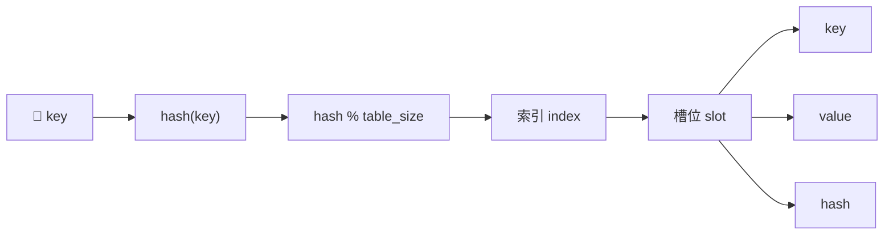
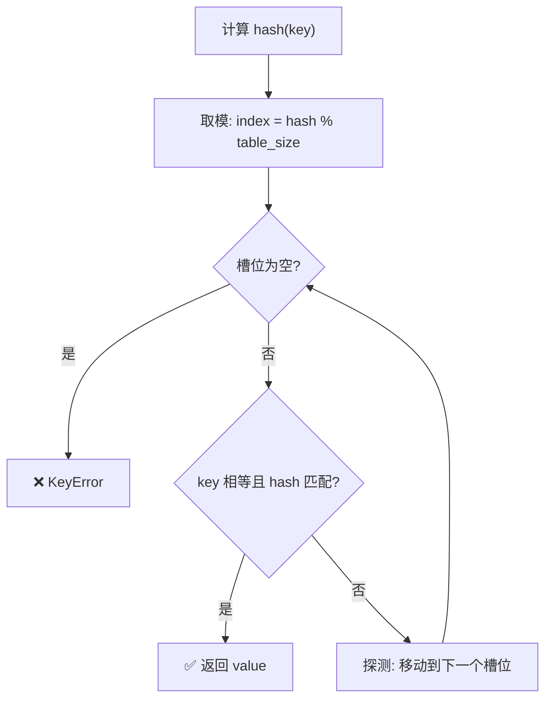
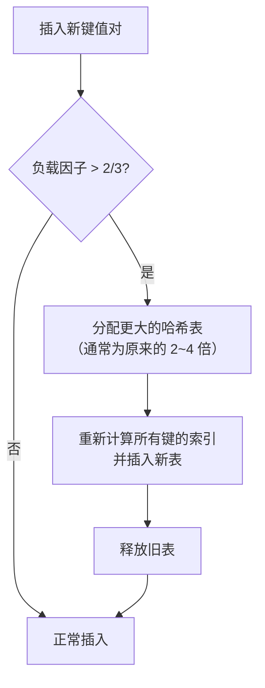
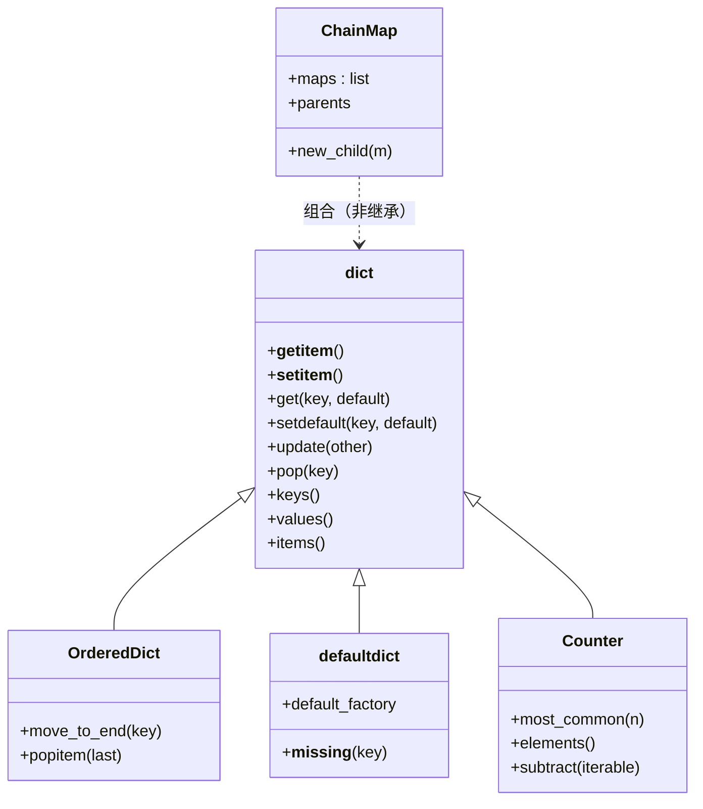

# 字典

`Python` 中的字典 `Dictionary` 是一种用于存储键值对（key-value pairs）的核心数据结构。它具有**可变**、**键唯一**的特点，自 Python 3.7 起保证**插入顺序**。

- **键 (Key)**: 必须是**不可变且可哈希**的数据类型，如字符串、数字或元组。
- **值 (Value)**: 可以是任何数据类型。

## 内部原理：字典是如何工作的？

理解字典的内部实现，有助于写出更高效的代码、避开常见陷阱。

### 哈希表内部结构

Python 字典本质上是一个**哈希表**（hash table）。每个键值对存储在哈希表的一个"槽位"（slot）中，槽位的索引由键的哈希值决定。



每个槽位实际存储三个字段：

| 字段 | 说明 |
|:-----|:-----|
| `hash` | 键的哈希值缓存，避免重复计算 |
| `key` | 原始键对象 |
| `value` | 对应的值对象 |

### 查找流程

当你执行 `d[key]` 时，Python 内部经历以下步骤：



这个过程称为**开放寻址法**（open addressing）。当发生哈希冲突（两个键映射到同一索引）时，Python 使用**探测序列**逐个检查后续槽位，直到找到匹配的键或空槽位。

### 为什么 dict 查找是 O(1)？

在平均情况下，哈希函数将键均匀分布到表中，冲突很少，查找只需常数时间。最坏情况（所有键冲突）为 O(n)，但 Python 的哈希函数和扩容机制使这种情况极其罕见。

### 为什么键必须是可哈希的？

查找键时，Python 需要两步验证：
1. **哈希值**快速定位候选槽位
2. **相等比较** (`==`) 确认是否是同一个键

如果键是可变对象（如列表），修改后哈希值会变化，导致永远找不到原来的槽位。因此 Python 要求键的哈希值在其生命周期内不变——即键必须是**可哈希的**（hashable）。

### 扩容机制

随着键值对增多，冲突概率上升。Python 会在**负载因子**超过 2/3 时自动扩容：



扩容时所有现有键值对必须**重新插入**（rehash），这是 O(n) 操作，但分摊到每次插入后，平均仍为 O(1)。

### 为什么 Python 3.7+ 保证插入顺序？

Python 3.6 作为实现细节率先引入了紧凑字典（compact dict），3.7 将其提升为语言规范。核心改动：

- 哈希表中只存**索引**，指向一个紧凑的**插入数组**
- 插入数组按插入顺序排列键值对
- 遍历时直接遍历插入数组，天然有序

这种设计还带来了**内存节省约 20%~25%** 的额外好处。

---

## 核心操作：创建、访问、修改、删除 (CRUD)

掌握字典的增删改查是学习 Python 的基础。下面通过一个管理用户信息的例子，展示这些核心操作。

```python
# ------------------- 1. 创建 (Create) -------------------
# 方式一：使用大括号 {} 字面量创建（最常用）
user_profile = {
    "username": "Alice",       # 键: "username"，值: "Alice"
    "email": "alice@example.com",
    "followers": 150
}
print(f"新用户创建: {user_profile}")

# 方式二：使用 dict() 构造函数，关键字参数风格
user_settings = dict(theme="dark", notifications_enabled=True)
print(f"用户设置: {user_settings}")

# 方式三：使用 dict() 传入键值对列表（适合动态生成）
pairs = [("name", "Bob"), ("age", 25)]
user_from_pairs = dict(pairs)
print(f"从列表创建: {user_from_pairs}")

# 方式四：使用 dict.fromkeys() 批量创建同值字典
keys = ["a", "b", "c"]
same_val_dict = dict.fromkeys(keys, 0)   # 所有键初始值为 0
print(f"fromkeys 创建: {same_val_dict}")


# ------------------- 2. 访问 (Read) -------------------
# 方式一：方括号 []，键不存在时抛出 KeyError
print(f"用户名: {user_profile['username']}")

# 方式二：get() 方法，键不存在时返回默认值（更安全）
print(f"邮箱: {user_profile.get('email')}")
print(f"地理位置: {user_profile.get('location', '未设置')}")  # 键不存在 → 返回 '未设置'

# 判断键是否存在（推荐用 in，不用 has_key，Python 3 已移除）
if 'followers' in user_profile:
    print(f"粉丝数: {user_profile['followers']}")


# ------------------- 3. 修改与添加 (Update) -------------------
# 修改现有键的值
user_profile['followers'] = 175
print(f"更新粉丝数: {user_profile}")

# 添加新的键值对
user_profile['location'] = 'New York'
print(f"添加地理位置: {user_profile}")

# 使用 update() 批量更新或添加，也可用于合并字典
user_profile.update({
    "email": "new.alice@example.com",   # 已有键 → 覆盖
    "is_active": True                    # 新键 → 添加
})
print(f"批量更新后: {user_profile}")


# ------------------- 4. 删除 (Delete) -------------------
# 使用 del 关键字删除指定键值对
del user_profile['is_active']
print(f"删除 is_active 后: {user_profile}")

# 使用 pop() 删除并返回该键的值，可设置默认值以防 KeyError
location = user_profile.pop('location', 'N/A')
print(f"移除的地理位置: {location}")
print(f"移除 location 后: {user_profile}")

# popitem() 移除并返回最后插入的键值对（LIFO），3.7+ 中非常有用
last_item = user_profile.popitem()
print(f"最后插入的项: {last_item}")
print(f"最终字典: {user_profile}")
```

## 字典视图与遍历

字典提供了三种动态视图：`keys()`、`values()` 和 `items()`。这些视图会**实时反映**字典的变化——不需要重新创建。

```python
user_profile = {
    "username": "Alice",
    "email": "alice@example.com",
    "followers": 175
}

# 1. 遍历键 (Keys) —— 直接 for 循环默认遍历键
print("--- 遍历键 ---")
for key in user_profile:                # 等价于 user_profile.keys()
    print(key)

# 2. 遍历值 (Values)
print("--- 遍历值 ---")
for value in user_profile.values():
    print(value)

# 3. 遍历键值对 (Items) —— 最常用
print("--- 遍历键值对 ---")
for key, value in user_profile.items():
    print(f"{key}: {value}")

# 4. 按键排序遍历（字典本身按插入顺序，如需其他排序需手动处理）
print("--- 按键排序遍历 ---")
for key in sorted(user_profile.keys()):
    print(f"{key}: {user_profile[key]}")

# 5. 视图是动态的 —— 修改字典后视图自动更新
keys_view = user_profile.keys()
print(f"修改前: {list(keys_view)}")
user_profile["bio"] = "Hello"
print(f"修改后: {list(keys_view)}")    # 视图中自动多了 'bio'
```

## 高级用法与技巧

### 字典推导式 (Dictionary Comprehension)

字典推导式提供了一种从可迭代对象中快速创建字典的简洁语法。

```python
# 示例 1: 创建一个数字及其平方的字典
squares = {x: x**2 for x in range(1, 6)}
print(squares)  # 输出: {1: 1, 2: 4, 3: 9, 4: 16, 5: 25}

# 示例 2: 从现有字典筛选和转换
user_data = {"Alice": 25, "Bob": 20, "Charlie": 30}
# 创建一个只包含年龄大于 22 岁用户的新字典
adults = {name: age for name, age in user_data.items() if age > 22}
print(adults)  # 输出: {'Alice': 25, 'Charlie': 30}

# 示例 3: 键值翻转
inverted = {v: k for k, v in user_data.items()}
print(inverted)  # 输出: {25: 'Alice', 20: 'Bob', 30: 'Charlie'}
# ⚠️ 注意：如果值有重复，后出现的键会覆盖前面的
```

### setdefault / get / defaultdict —— 处理缺失键的三种方式

当键可能不存在时，有多种处理策略：

```python
# ---------- 方式一：get() —— 只读不写 ----------
# 键不存在时返回默认值，但不修改字典
d = {"a": 1}
val = d.get("b", 0)       # 返回 0，字典不变
print(d)                   # {'a': 1}

# ---------- 方式二：setdefault() —— 读写合一 ----------
# 键不存在时插入默认值并返回，键存在则返回已有值
d = {"a": 1}
val = d.setdefault("b", 0)   # 插入 "b": 0，返回 0
print(d)                      # {'a': 1, 'b': 0}
val = d.setdefault("a", 99)  # "a" 已存在，返回 1，不修改
print(d)                      # {'a': 1, 'b': 0}

# 典型用法：一键多值分组
groups = {}
for name, dept in [("Alice", "工程"), ("Bob", "市场"), ("Carol", "工程")]:
    groups.setdefault(dept, []).append(name)
print(groups)  # {'工程': ['Alice', 'Carol'], '市场': ['Bob']}

# ---------- 方式三：defaultdict —— 全局默认工厂 ----------
from collections import defaultdict

# defaultdict(list) 在访问不存在的键时自动创建空列表
groups_dd = defaultdict(list)
for name, dept in [("Alice", "工程"), ("Bob", "市场"), ("Carol", "工程")]:
    groups_dd[dept].append(name)          # 无需 setdefault，直接 append
print(dict(groups_dd))  # {'工程': ['Alice', 'Carol'], '市场': ['Bob']}

# defaultdict(int) 常用于计数
counter = defaultdict(int)
for ch in "hello":
    counter[ch] += 1                       # 不存在时默认为 0
print(dict(counter))  # {'h': 1, 'e': 1, 'l': 2, 'o': 1}
```

### 合并字典

Python 提供了多种合并字典的方式，各有适用场景。

```python
dict1 = {'a': 1, 'b': 2}
dict2 = {'b': 3, 'c': 4}

# ---------- 方式一：| 运算符（Python 3.9+） ----------
merged = dict1 | dict2            # 创建新字典，重复键取右侧
print(merged)                     # {'a': 1, 'b': 3, 'c': 4}

# ---------- 方式二：|= 原地合并（Python 3.9+） ----------
d = {'a': 1, 'b': 2}
d |= dict2                        # 就地修改，不创建新字典
print(d)                          # {'a': 1, 'b': 3, 'c': 4}

# ---------- 方式三：解包 {**d1, **d2}（Python 3.5+） ----------
merged = {**dict1, **dict2}       # 创建新字典
print(merged)                     # {'a': 1, 'b': 3, 'c': 4}

# ---------- 方式四：update() ----------
merged = dict1.copy()             # 先拷贝，避免修改原字典
merged.update(dict2)              # 就地更新
print(merged)                     # {'a': 1, 'b': 3, 'c': 4}

# ---------- 方式五：ChainMap（不复制，逻辑合并） ----------
from collections import ChainMap
chain = ChainMap(dict2, dict1)    # 查找时先查 dict2，再查 dict1
print(chain['a'])                 # 1（来自 dict1）
print(chain['b'])                 # 3（dict2 优先）
# ChainMap 不创建新字典，适合大量字典的"虚拟合并"
```

### 嵌套字典

字典的值可以是另一个字典，形成嵌套结构，非常适合表示复杂的数据对象。

```python
users = {
    "user1": {
        "name": "Alice",
        "email": "alice@example.com"
    },
    "user2": {
        "name": "Bob",
        "email": "bob@example.com"
    }
}

# 访问嵌套字典
print(users["user1"]["name"])  # 输出: Alice

# 安全访问多层嵌套（避免 KeyError）
email = users.get("user3", {}).get("email", "未知")
print(email)  # 输出: 未知
```

## `collections` 模块中的特殊字典

Python 的 `collections` 模块提供了一些特殊的字典类，以满足更具体的需求。

### `defaultdict`：带默认值的字典

当你需要一个在访问不存在的键时能自动提供默认值的字典时，`defaultdict` 非常有用。这在计数或分组时特别方便。

```python
from collections import defaultdict

# 示例：统计单词频率
text = "python is powerful and python is easy"

# 使用普通字典 —— 需要 get() 处理缺失键
word_count = {}
for word in text.split():
    word_count[word] = word_count.get(word, 0) + 1

# 使用 defaultdict(int)，默认值为 0 —— 更简洁
word_count_default = defaultdict(int)
for word in text.split():
    word_count_default[word] += 1

print(dict(word_count_default))  # {'python': 2, 'is': 2, 'powerful': 1, 'and': 1, 'easy': 1}

# 常用工厂函数
dd_list = defaultdict(list)    # 默认值 []，用于一键多值
dd_set = defaultdict(set)      # 默认值 set()，用于去重分组
dd_int = defaultdict(int)      # 默认值 0，用于计数
dd_str = defaultdict(str)      # 默认值 ""，用于字符串拼接
```

### `OrderedDict`：有序字典

在 Python 3.7 之前，标准字典是无序的。`OrderedDict` 被用来保证字典的键值对按插入顺序排列。尽管现在内置字典已有此特性，但在以下情况 `OrderedDict` 仍然有用：

- **兼容性**: 需要在 Python 3.6 或更早版本中保持顺序。
- **明确性**: 当代码的逻辑严重依赖于顺序时，使用 `OrderedDict` 可以更清晰地表达意图。
- **额外功能**: `OrderedDict` 拥有 `move_to_end()` 和 `popitem(last=False)` 等专用于重新排序的方法。
- **相等判断**: `OrderedDict` 比较时考虑顺序，普通 dict 不考虑。

```python
from collections import OrderedDict

# 创建一个 OrderedDict
od = OrderedDict()
od['first'] = 1
od['second'] = 2
od['third'] = 3

print(od)  # OrderedDict([('first', 1), ('second', 2), ('third', 3)])

# 将 'second' 移动到末尾（LRU 缓存的经典操作）
od.move_to_end('second')
print(od)  # OrderedDict([('first', 1), ('third', 3), ('second', 2)])

# 将 'first' 移动到开头
od.move_to_end('first', last=False)
print(od)  # OrderedDict([('first', 1), ('third', 3), ('second', 2)])

# 弹出最早插入的项（FIFO）
oldest = od.popitem(last=False)
print(oldest)  # ('first', 1)

# 顺序敏感的相等判断
from collections import OrderedDict
a = OrderedDict([('x', 1), ('y', 2)])
b = OrderedDict([('y', 2), ('x', 1)])
print(a == b)  # False —— 顺序不同则不等
print(dict(a) == dict(b))  # True —— 普通 dict 不比较顺序
```

### `Counter`：计数器字典

`Counter` 是 `dict` 的子类，专门用于计数，提供多种便捷方法。

```python
from collections import Counter

# 创建 Counter
text = "python is powerful and python is easy"
c = Counter(text.split())
print(c)  # Counter({'python': 2, 'is': 2, 'powerful': 1, 'and': 1, 'easy': 1})

# most_common(n) —— 取出现次数最多的 n 个
print(c.most_common(2))  # [('python', 2), ('is', 2)]

# Counter 支持算术运算
c1 = Counter(a=3, b=1)
c2 = Counter(a=1, b=2)
print(c1 + c2)   # Counter({'a': 4, 'b': 3})  —— 对应键相加
print(c1 - c2)   # Counter({'a': 2})           —— 对应键相减，≤0 的键被移除
print(c1 | c2)   # Counter({'a': 3, 'b': 2})   —— 取每键最大值
print(c1 & c2)   # Counter({'a': 1, 'b': 1})   —— 取每键最小值

# elements() —— 返回所有元素的迭代器（按计数重复）
print(list(Counter(a=2, b=3).elements()))  # ['a', 'a', 'b', 'b', 'b']
```

### `ChainMap`：逻辑合并多个字典

`ChainMap` 将多个字典逻辑上合并为一个视图，不进行数据复制。

```python
from collections import ChainMap

defaults = {"theme": "light", "font": "Arial", "lang": "zh"}
user_config = {"theme": "dark"}          # 用户自定义覆盖默认值

config = ChainMap(user_config, defaults)  # 查找顺序：user_config → defaults
print(config["theme"])  # "dark"（来自 user_config）
print(config["font"])   # "Arial"（来自 defaults）
print(config["lang"])   # "zh"（来自 defaults）

# 修改只影响第一个映射
config["font"] = "Helvetica"
print(user_config)  # {'theme': 'dark', 'font': 'Helvetica'} —— 写入了 user_config
print(defaults)     # {'theme': 'light', 'font': 'Arial', 'lang': 'zh'} —— 未变
```

### 特殊字典的继承关系



> 注意：`ChainMap` 并非 `dict` 的子类，而是内部持有多个字典的代理对象，但实现了字典接口。

---

## 最佳实践对比

### dict vs OrderedDict vs defaultdict vs Counter 适用场景

| 类型 | 适用场景 | 键不存在时 | 顺序保证 | 典型用途 |
|:-----|:---------|:----------|:---------|:---------|
| `dict` | 通用键值存储 | `KeyError` | ✅ 插入顺序 (3.7+) | 配置、映射、缓存 |
| `OrderedDict` | 顺序敏感逻辑 | `KeyError` | ✅ 插入顺序 + 重排 | LRU 缓存、有序序列 |
| `defaultdict` | 需要默认值 | 自动创建默认值 | ✅ 插入顺序 (3.7+) | 分组、计数、一键多值 |
| `Counter` | 计数统计 | 返回 0 | ✅ 插入顺序 (3.7+) | 词频统计、TOP N |

### 字典合并方法对比

| 方法 | Python 版本 | 创建新字典 | 重复键处理 | 适用场景 |
|:-----|:-----------|:----------|:----------|:---------|
| `d1 \| d2` | 3.9+ | ✅ | 右侧优先 | 简洁合并 |
| `d1 \|= d2` | 3.9+ | ❌ 原地修改 | 右侧优先 | 原地更新 |
| `{**d1, **d2}` | 3.5+ | ✅ | 右侧优先 | 3.9 以下的合并 |
| `d1.update(d2)` | 全版本 | ❌ 原地修改 | 右侧优先 | 批量更新 |
| `ChainMap(d2, d1)` | 3.3+ | ❌ 逻辑视图 | 查找顺序优先 | 大量字典、避免复制 |

### 键访问方法对比

| 方法 | 键存在时 | 键不存在时 | 是否修改字典 | 适用场景 |
|:-----|:--------|:----------|:-----------|:---------|
| `d[key]` | 返回值 | `KeyError` | 否 | 确定键存在时 |
| `d.get(key, default)` | 返回值 | 返回 `default`（默认 `None`） | 否 | 安全读取 |
| `d.setdefault(key, default)` | 返回值 | 插入 `default` 并返回 | ✅ 是 | 初始化 + 读取 |

---

## 常用方法速查

| 方法 | 描述 |
|:-----|:-----|
| `d.keys()` | 返回一个包含字典所有键的视图对象。 |
| `d.values()` | 返回一个包含字典所有值的视图对象。 |
| `d.items()` | 返回一个包含字典所有 (键, 值) 元组的视图对象。 |
| `d.get(key, default)` | 返回键 `key` 的值。如果键不存在，则返回 `default`，默认为 `None`。 |
| `d.setdefault(key, default)` | 如果键存在，返回值；如果不存在，插入 `default` 并返回 `default`。 |
| `d.pop(key, default)` | 删除键 `key` 并返回其值。如果键不存在且未提供 `default`，则引发 `KeyError`。 |
| `d.popitem()` | 移除并返回一个 (键, 值) 对。在 3.7+ 版本中，按 LIFO (后进先出) 顺序。 |
| `d.update(other)` | 使用 `other` 中的键值对更新字典 `d`，会覆盖现有键。 |
| `d.clear()` | 移除字典中的所有项。 |
| `dict.fromkeys(seq, value)` | 创建一个新字典，以 `seq` 中的元素为键，`value` 为所有键的初始值。 |
| `d \| other` | 合并字典（3.9+），返回新字典。 |
| `d \|= other` | 原地合并字典（3.9+）。 |

---

## 实战示例：统计单词频率

字典经常用来做统计汇总，下例演示三种方式统计文本中每个单词出现的次数。

```python
text = "python makes dictionaries easy to use python"

# 方式一：普通字典 + get()
word_count = {}
for word in text.split():
    word_count[word] = word_count.get(word, 0) + 1
print(word_count)

# 方式二：defaultdict(int)
from collections import defaultdict
word_count_dd = defaultdict(int)
for word in text.split():
    word_count_dd[word] += 1
print(dict(word_count_dd))

# 方式三：Counter（最简洁）
from collections import Counter
word_count_c = Counter(text.split())
print(word_count_c)
print(f"出现最多的词: {word_count_c.most_common(1)}")
```

可以根据需要对结果进行排序或取出出现次数最多的单词，从而快速得到分析结果。

---

## 常见陷阱与 FAQ

### 陷阱 1：循环中修改字典大小 → RuntimeError

```python
# ❌ 错误：遍历时删除键会抛出 RuntimeError
d = {"a": 1, "b": 2, "c": 3}
for key in d:
    if key == "b":
        pass  # del d[key]  # 取消注释将抛出: RuntimeError: dictionary changed size during iteration

# ✅ 方法一：遍历键的副本
for key in list(d.keys()):
    if key == "b":
        del d[key]

# ✅ 方法二：使用字典推导式创建新字典
d = {k: v for k, v in d.items() if k != "b"}

# ✅ 方法三：先收集要删除的键，再统一删除
to_delete = [k for k, v in d.items() if v == 2]
for key in to_delete:
    del d[key]
```

### 陷阱 2：可变对象不能作为 key

```python
# ❌ 列表不可哈希，不能作为 key
d = {}
# d[[1, 2]] = "value"  # TypeError: unhashable type: 'list'

# ✅ 使用元组代替列表
d[(1, 2)] = "value"  # OK

# ⚠️ 元组内也不能包含可变对象
# d[(1, [2, 3])] = "value"  # TypeError: unhashable type: 'list'
d[(1, (2, 3))] = "value"  # OK
```

### 陷阱 3：字典的浅拷贝问题

```python
original = {"user": {"name": "Alice"}}
shallow = original.copy()         # 浅拷贝：嵌套对象仍然共享引用

shallow["user"]["name"] = "Bob"   # 修改了嵌套字典
print(original["user"]["name"])   # "Bob" —— 原字典也被改了！

# ✅ 使用 deepcopy 进行深拷贝
from copy import deepcopy
original = {"user": {"name": "Alice"}}
deep = deepcopy(original)
deep["user"]["name"] = "Bob"
print(original["user"]["name"])   # "Alice" —— 原字典不受影响
```

### 陷阱 4：Python 3.6 vs 3.7+ 字典有序性差异

| 版本 | 行为 | 说明 |
|:-----|:-----|:-----|
| Python ≤ 3.5 | 无序 | 字典遍历顺序不可预测 |
| Python 3.6 | 实现细节有序 | CPython 实现有序，但语言规范不保证 |
| Python 3.7+ | 语言规范有序 | 插入顺序被正式保证 |

```python
# 在 Python 3.7+ 中，以下行为是可靠的
d = {}
d["z"] = 1
d["a"] = 2
d["m"] = 3
print(list(d.keys()))  # ['z', 'a', 'm'] —— 按插入顺序

# 但不要依赖此特性做跨版本兼容的代码
# 如果需要顺序保证且需兼容 3.6-，请使用 OrderedDict
```

### 常见问题解答

#### Q: 字典的键可以是哪些类型？

A: 键必须是**不可变且可哈希**的类型，如：
- 数字（int、float）
- 字符串
- 元组（元组内的元素也必须是不可变的）
- frozenset
- 布尔值（注意 `True == 1`，`False == 0`，与整数键冲突）

列表、字典、集合等可变类型不能作为键。

#### Q: 如何安全地访问可能不存在的键？

A: 推荐使用 `get()` 方法并设置默认值：
```python
value = my_dict.get('key', 'default_value')
```
或者使用 `setdefault()` 在键不存在时自动设置：
```python
value = my_dict.setdefault('key', 'default_value')
```

#### Q: 如何按值或按键排序字典？

A: Python 3.7+ 字典保持插入顺序。排序方法：
```python
# 按键排序
sorted_by_key = dict(sorted(my_dict.items()))

# 按值排序
sorted_by_value = dict(sorted(my_dict.items(), key=lambda x: x[1], reverse=True))
```

#### Q: `dict` 和 `defaultdict` 有什么区别？

A: `defaultdict` 在访问不存在的键时自动创建默认值：
```python
from collections import defaultdict
dd = defaultdict(list)
dd['new_key'].append('value')  # 自动创建空列表
```

#### Q: 如何合并两个字典？

A: Python 3.9+ 使用 `|` 运算符：
```python
merged = dict1 | dict2
# 或原地合并
dict1 |= dict2
```
Python 3.5+ 使用解包：
```python
merged = {**dict1, **dict2}
```

#### Q: 为什么遍历字典时不能修改它？

A: 遍历时修改字典会引发 `RuntimeError`。如需修改，应先收集要修改的键，遍历结束后再操作，或遍历字典的副本 `list(d.keys())`。

---

## 术语表

| 术语 | 英文 | 定义 |
|:-----|:-----|:-----|
| 哈希表 | Hash Table | 一种通过哈希函数将键映射到数组索引的数据结构，Python dict 的底层实现 |
| 哈希函数 | Hash Function | 将任意数据映射为固定长度整数的函数，Python 中通过 `hash()` 调用 |
| 开放寻址 | Open Addressing | 哈希冲突解决策略：当目标槽位被占用时，按探测序列寻找下一个空槽位 |
| 探测序列 | Probe Sequence | 开放寻址中，冲突后依次检查的槽位序列，Python 使用伪随机探测 |
| 负载因子 | Load Factor | 已使用槽位数 / 总槽位数，超过阈值（2/3）时触发扩容 |
| 可哈希 | Hashable | 对象的哈希值在其生命周期内不变且可与其他对象比较相等，是作为 dict key 的前提 |
| 键视图 | Key View | `dict.keys()` 返回的动态视图对象，反映字典的实时状态，支持集合运算 |

---

## 延伸阅读

- → [列表与元组](09-列表与元组) —— 另一种核心序列类型
- → [集合](11-集合) —— 基于哈希表的无序唯一元素集
- → [数据类型](07-数据类型) —— Python 数据类型全景概览

## 版本差异（Python 3.8-3.12 → 3.14）

| 特性 | 本文编写时 | Python 3.14 |
|------|-----------|-------------|
| 类型注解求值 | 运行时立即求值 | PEP 649/749 延迟求值：注解不再在定义时执行，解决前向引用，提升启动性能 |
| 字符串模板 | 普通 f-string / `str.format` | PEP 750 模板字符串 `t"..."`：可插值且能被安全处理（3.14 新特性） |
| 标准库多解释器 | 无官方支持 | PEP 734：`concurrent.interpreters` 模块支持在同一进程创建多个子解释器 |
| 调试 | 仅 Python 内建 pdb / IDE 调试 | PEP 768：安全的 CPython 外部调试器接口（custom debugger protocol） |
| 字节码与运行时 | 3.12 前无 JIT | 3.13 引入实验性 JIT（PEP 744）；3.14 进一步改进 free-threaded（无 GIL）构建 |
| `datetime` API | `utcnow()` 常用 | 3.12 起弃用，官方要求改用 `datetime.now(tz=datetime.UTC)`（aware 对象） |
| 压缩算法 | zlib / gzip / bz2 / lzma | 3.14 新增标准库 Zstandard 支持（PEP 784） |

> 本文讲解的语法与数据结构原理在 3.14 中依然成立；新项目建议基于 Python 3.13/3.14，并优先使用 aware datetime、PEP 649 注解与最新类型语法。
