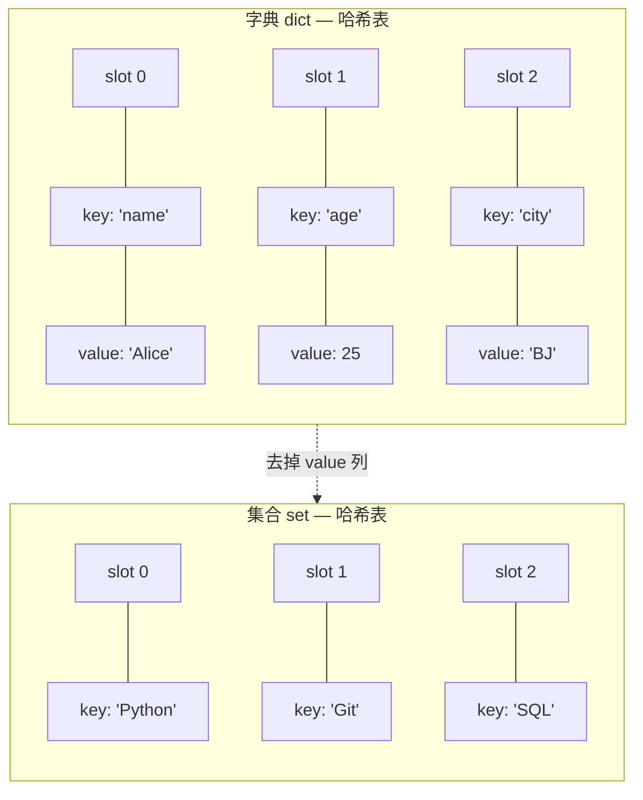
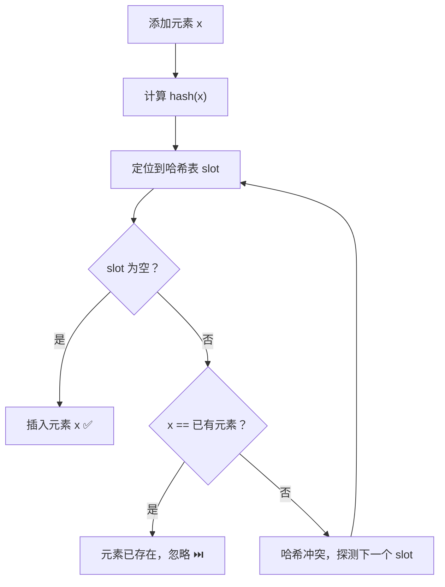
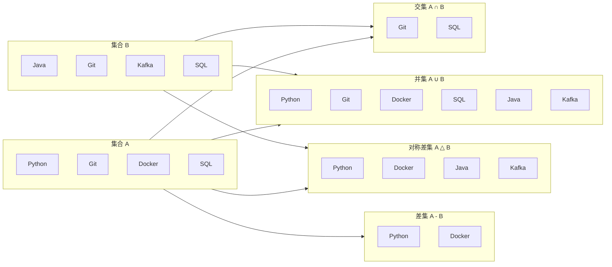

# 集合 (Set)

`set` 是 Python 中一种用于存储**不重复**元素的**无序**集合。它基于哈希表实现，提供了 O(1) 平均时间复杂度的成员资格测试，是去重和集合运算的首选数据结构。

## 是什么：集合的本质

集合在 Python 中的底层实现与字典高度相似——本质上是一张**只有 key 没有 value 的哈希表**。字典存储键值对 `{key: value}`，而集合只存储键 `{key}`，value 的位置被省略。这意味着集合继承了字典在哈希表上的所有性能优势。



### 核心特性一览

| 特性 | 说明 |
|------|------|
| **唯一性** | 重复元素自动忽略，集合中不会出现两份相同值 |
| **无序性** | 元素没有固定顺序，不能通过索引访问 |
| **可变性** | `set` 可增删元素；`frozenset` 不可变 |
| **元素要求** | 元素必须是**可哈希 (hashable)** 的不可变类型 |

## 为什么：设计动机与原理

### 为什么集合元素必须可哈希？

集合依赖哈希表定位元素。当你执行 `x in my_set` 时，Python 的执行过程是：

1. 计算 `hash(x)` 得到哈希值
2. 用哈希值定位到哈希表中的 slot
3. 在该 slot 处比较 `x` 与已有元素是否相等

如果元素是可变的（如列表），修改内容后哈希值会改变，元素就会"迷路"——原来存储的位置找不到了，集合的一致性被破坏。因此 Python 强制要求集合元素必须是不可变类型。

```python
# 可哈希类型 — 可以加入集合
s = {42, "hello", (1, 2), 3.14}  # int, str, tuple, float 均可

# 不可哈希类型 — 加入集合会报 TypeError
try:
    bad_set = {[1, 2, 3]}  # list 不可哈希
except TypeError as e:
    print(f"错误: {e}")  # unhashable type: 'list'

try:
    bad_set2 = {{'a': 1}}  # dict 不可哈希
except TypeError as e:
    print(f"错误: {e}")  # unhashable type: 'dict'
```

### 为什么 frozenset 存在？

`frozenset` 是 `set` 的不可变版本。因为不可变，所以**可哈希**，因此可以：

- 作为字典的键
- 作为另一个集合的元素
- 在多个地方安全共享而不担心被意外修改

这和"元组之于列表"的关系完全一致——元组是列表的不可变版本，`frozenset` 是集合的不可变版本。

### 集合去重原理



### 集合运算 vs 列表操作性能对比

| 操作 | 集合 set | 列表 list | 说明 |
|------|---------|----------|------|
| `x in container` | **O(1)** | O(n) | 集合用哈希定位，列表需逐个比较 |
| 去重 | **O(n)** | O(n²) 或 O(n log n) | 集合天然去重，列表需额外逻辑 |
| 添加元素 | **O(1)** | O(1) 追加 / O(n) 插入 | 两者追加都快，但集合自动去重 |
| 删除元素 | **O(1)** | O(n) | 集合按值删除，列表需先查找再移动 |

```python
import time

# 集合 vs 列表：成员测试性能对比
data = range(100_000)
test_values = range(50_000, 150_000)  # 一半命中，一半未命中

# 列表测试
lst = list(data)
start = time.perf_counter()
for v in test_values:
    _ = v in lst  # O(n) 每次遍历
list_time = time.perf_counter() - start

# 集合测试
st = set(data)
start = time.perf_counter()
for v in test_values:
    _ = v in st  # O(1) 哈希定位
set_time = time.perf_counter() - start

print(f"列表成员测试耗时: {list_time:.4f}s")
print(f"集合成员测试耗时: {set_time:.4f}s")
print(f"集合比列表快 {list_time / set_time:.0f} 倍")
```

## 怎么做：完整操作指南

### 集合创建方式

```python
# ====== 1. 使用大括号 {} 创建（推荐用于非空集合）======
skills = {"Python", "Git", "SQL"}           # 直接字面量创建
print(f"技能集合: {skills}")                  # 无序输出

# ====== 2. 使用 set() 构造函数 ======
# 从列表创建，自动去重
tags = set(["data", "backend", "data"])      # 重复的 "data" 只保留一个
print(f"去重后标签: {tags}")

# 从字符串创建 — 每个字符成为一个元素
chars = set("hello")                         # {'h', 'e', 'l', 'o'} — 'l' 只出现一次
print(f"字符集合: {chars}")

# 从 range 创建
nums = set(range(5))                         # {0, 1, 2, 3, 4}
print(f"数字集合: {nums}")

# ====== 3. 创建空集合必须用 set() ======
empty = set()                                # ✅ 空集合
not_a_set = {}                               # ❌ 这是空字典 dict，不是集合！
print(f"空集合类型: {type(empty)}")            # <class 'set'>
print(f"大括号类型: {type(not_a_set)}")        # <class 'dict'>

# ====== 4. 集合推导式 (Set Comprehension) ======
squares = {x**2 for x in range(-3, 4)}       # {0, 1, 4, 9} — 负数平方后去重
print(f"平方集合: {squares}")

# 带条件的集合推导式
even_squares = {x**2 for x in range(10) if x % 2 == 0}
print(f"偶数平方: {even_squares}")             # {0, 64, 4, 36, 16}
```

### CRUD 操作

```python
# 初始集合
todos = {"写代码", "开会", "喝咖啡"}
print(f"初始待办: {todos}")

# ====== Create — 添加元素 ======
todos.add("写文档")                           # 添加单个元素
print(f"添加 '写文档' 后: {todos}")

todos.update(["回复邮件", "代码审查"])          # 批量添加（传入任何可迭代对象）
print(f"批量添加后: {todos}")

todos.add("写代码")                           # 重复添加 — 静默忽略，不报错
print(f"重复添加 '写代码' 后: {todos}")         # 集合不变

# ====== Read — 查询元素 ======
all_skills = {"Python", "Java", "Go", "Rust"}
print(f"我会 Python 吗? {'Python' in all_skills}")    # True — O(1) 哈希查找
print(f"我会 C++ 吗? {'C++' in all_skills}")          # False
print(f"技能总数: {len(all_skills)}")                   # 4

# ====== Update — 修改元素 ======
# 集合没有"修改"操作，因为元素不可变。做法是：先删后加
todos.discard("开会")                         # 先删除旧值
todos.add("开周会")                           # 再添加新值
print(f"替换 '开会' → '开周会': {todos}")

# ====== Delete — 删除元素 ======
# remove(): 元素不存在时抛出 KeyError
todos.remove("写文档")
print(f"remove '写文档' 后: {todos}")

# discard(): 元素不存在时静默忽略（更安全）
todos.discard("健身")                         # '健身' 不存在，不报错
print(f"discard '健身' 后: {todos}")

# pop(): 随机移除并返回一个元素（集合无序，无法指定哪个）
completed = todos.pop()
print(f"随机完成: {completed}")
print(f"剩余: {todos}")

# clear(): 清空集合
todos.clear()
print(f"清空后: {todos}")                      # set()
```

### 集合运算

集合运算是 `set` 的核心功能，常用于处理成员关系。所有运算都支持**运算符**和**方法**两种形式。



```python
# 场景：比较两个开发团队的技能栈
team_a = {"Python", "Git", "Docker", "SQL"}
team_b = {"Java", "Git", "Kafka", "SQL"}

# ====== 1. 并集 (Union): 两队掌握的所有技能 ======
# 运算符: |        方法: .union()
all_skills = team_a | team_b
print(f"并集 (运算符): {all_skills}")
# 等价写法
all_skills2 = team_a.union(team_b)
print(f"并集 (方法):   {all_skills2}")

# ====== 2. 交集 (Intersection): 两队都掌握的技能 ======
# 运算符: &        方法: .intersection()
common = team_a & team_b
print(f"交集 (运算符): {common}")              # {'Git', 'SQL'}

# ====== 3. 差集 (Difference): A 有而 B 没有的技能 ======
# 运算符: -        方法: .difference()
unique_a = team_a - team_b
print(f"差集 A-B (运算符): {unique_a}")         # {'Python', 'Docker'}

unique_b = team_b - team_a
print(f"差集 B-A (运算符): {unique_b}")         # {'Java', 'Kafka'}

# ====== 4. 对称差集 (Symmetric Difference): 各自独有的技能 ======
# 运算符: ^        方法: .symmetric_difference()
exclusive = team_a ^ team_b
print(f"对称差集 (运算符): {exclusive}")        # {'Python', 'Docker', 'Java', 'Kafka'}

# ====== 5. 就地运算符 (修改原集合) ======
skills = {"Python"}
skills |= {"Git", "SQL"}                      # 就地并集，等价于 skills.update(...)
print(f"就地并集: {skills}")

skills &= {"Python", "Git"}                   # 就地交集，只保留共同部分
print(f"就地交集: {skills}")

skills -= {"Git"}                              # 就地差集，移除指定元素
print(f"就地差集: {skills}")

skills ^= {"Python", "Go"}                    # 就地对称差集
print(f"就地对称差集: {skills}")
```

### 关系判断

```python
base = {"Git", "SQL"}
frontend = {"Git", "SQL", "JavaScript", "React"}
backend = {"Git", "SQL", "Python", "Docker"}
devops = {"Terraform", "Ansible"}

# 子集判断: base 是否是 frontend 的子集？
print(f"base ⊆ frontend? {base.issubset(frontend)}")     # True
print(f"base <= frontend?  {base <= frontend}")           # True（运算符写法）

# 超集判断: backend 是否是 base 的超集？
print(f"backend ⊇ base? {backend.issuperset(base)}")     # True
print(f"backend >= base?  {backend >= base}")             # True（运算符写法）

# 真子集/真超集: 严格包含（不允许相等）
print(f"base < frontend?  {base < frontend}")             # True（真子集）
print(f"base < base?      {base < base}")                 # False（不是真子集）

# 无交集判断: 两个集合是否完全没有共同元素
print(f"base 与 devops 无交集? {base.isdisjoint(devops)}")  # True
print(f"base 与 frontend 无交集? {base.isdisjoint(frontend)}")  # False
```

### 集合推导式

```python
# 基本推导式：生成不重复的平方数
squares = {x**2 for x in range(-3, 4)}
print(f"平方数: {squares}")                    # {0, 1, 4, 9}

# 带过滤条件：只保留偶数的平方
even_sq = {x**2 for x in range(10) if x % 2 == 0}
print(f"偶数平方: {even_sq}")                  # {0, 64, 4, 36, 16}

# 嵌套推导式：从嵌套结构中提取唯一值
matrix = [[1, 2, 3], [2, 3, 4], [3, 4, 5]]
unique_vals = {x for row in matrix for x in row}
print(f"矩阵唯一值: {unique_vals}")            # {1, 2, 3, 4, 5}

# 字符串去重 + 过滤
text = "Hello World"
vowels = {c for c in text.lower() if c in "aeiou"}
print(f"文本中的元音: {vowels}")               # {'o', 'e'}
```

### frozenset 用法

```python
# ====== 创建 frozenset ======
fs = frozenset([1, 2, 3, 2])                  # 重复元素自动去重
print(f"frozenset: {fs}")                      # frozenset({1, 2, 3})

# ====== frozenset 可哈希 → 可作为字典键 ======
feature_a = frozenset(["fast-shipping", "on-sale"])
feature_b = frozenset(["new-arrival", "on-sale"])

cache = {
    feature_a: [{"id": 1, "name": "Product A"}],
    feature_b: [{"id": 2, "name": "Product B"}],
}
print(f"查询结果: {cache[feature_a]}")

# ====== frozenset 可作为集合元素 ======
group = {frozenset([1, 2]), frozenset([3, 4])}
print(f"集合的集合: {group}")

# ====== frozenset 不可修改 ======
try:
    fs.add(4)  # AttributeError: 'frozenset' object has no attribute 'add'
except AttributeError as e:
    print(f"不可修改: {e}")

# ====== frozenset 支持所有只读集合运算 ======
fs1 = frozenset([1, 2, 3])
fs2 = frozenset([2, 3, 4])
print(f"交集: {fs1 & fs2}")                    # frozenset({2, 3})
print(f"并集: {fs1 | fs2}")                    # frozenset({1, 2, 3, 4})
print(f"差集: {fs1 - fs2}")                    # frozenset({1})
```

### 集合 vs 列表 去重性能对比

```python
import time
import random

# 生成含大量重复的数据
random.seed(42)
data = [random.randint(0, 1000) for _ in range(1_000_000)]

# ====== 方法 1: set 去重（推荐）======
start = time.perf_counter()
unique_set = set(data)                        # O(n) 一次遍历
set_time = time.perf_counter() - start
print(f"set 去重: {set_time:.4f}s, 唯一值: {len(unique_set)}")

# ====== 方法 2: dict.fromkeys 去重（保持顺序）======
start = time.perf_counter()
unique_dict = list(dict.fromkeys(data))       # O(n)，Python 3.7+ 保持插入顺序
dict_time = time.perf_counter() - start
print(f"dict 去重: {dict_time:.4f}s, 唯一值: {len(unique_dict)}")

# ====== 方法 3: 列表手动去重（不推荐）======
start = time.perf_counter()
unique_list = []
for item in data:
    if item not in unique_list:               # O(n) × O(n) = O(n²)
        unique_list.append(item)
list_time = time.perf_counter() - start
print(f"列表去重: {list_time:.4f}s, 唯一值: {len(unique_list)}")

print(f"\nset 比列表去重快 {list_time / set_time:.0f} 倍")
```

## 最佳实践对比表

### set vs frozenset vs list 去重

| 维度 | `set` | `frozenset` | `list` |
|------|-------|-------------|--------|
| 可变性 | 可增删 | 不可变 | 可增删 |
| 可哈希 | 否 | **是** | 否 |
| 去重能力 | 天然去重 | 天然去重 | 需手动实现 |
| 去重复杂度 | O(n) | O(n) | O(n²) |
| 成员测试 | O(1) | O(1) | O(n) |
| 保持顺序 | 否 | 否 | 是 |
| 可做字典键 | 否 | **是** | 否 |
| 适用场景 | 去重、集合运算 | 字典键、不可变配置 | 有序序列、索引访问 |

### 集合运算：方法 vs 运算符

| 运算 | 运算符 | 方法 | 区别 |
|------|--------|------|------|
| 并集 | `A \| B` | `A.union(B)` | 方法可接受任意可迭代对象，运算符要求两边都是 set |
| 交集 | `A & B` | `A.intersection(B)` | 同上 |
| 差集 | `A - B` | `A.difference(B)` | 同上 |
| 对称差集 | `A ^ B` | `A.symmetric_difference(B)` | 同上 |

```python
# 运算符要求两边都是 set/frozenset
a = {1, 2, 3}

# 方法可以接受任意可迭代对象
result = a.union([4, 5, 6])                   # ✅ 方法接受列表
print(f"union 接受列表: {result}")              # {1, 2, 3, 4, 5, 6}

# 运算符不行
try:
    result = a | [4, 5, 6]                    # ❌ TypeError
except TypeError as e:
    print(f"运算符不接受列表: {e}")
```

## 常见陷阱与 FAQ

### 陷阱 1：集合无序，不能索引

```python
s = {"a", "b", "c"}

# ❌ 集合不支持索引
try:
    print(s[0])  # TypeError: 'set' object is not subscriptable
except TypeError as e:
    print(f"不能索引: {e}")

# ✅ 如需按序访问，先转为有序结构
for item in sorted(s):
    print(item, end=" ")                       # a b c（字母序）
print()

# ✅ 如需索引访问，转为列表
lst = sorted(s)
print(f"第一个: {lst[0]}")                      # 'a'
```

### 陷阱 2：可变元素不能加入集合

```python
# ❌ 列表不可哈希
try:
    s = {[1, 2]}  # TypeError
except TypeError as e:
    print(f"列表不可哈希: {e}")

# ✅ 用元组替代列表
s = {(1, 2)}  # 元组是不可变的，可哈希
print(f"元组集合: {s}")

# ❌ 字典不可哈希
try:
    s = {{"a": 1}}  # TypeError
except TypeError as e:
    print(f"字典不可哈希: {e}")

# ✅ 用 frozenset 替代集合作为元素
s = {frozenset([1, 2]), frozenset([3, 4])}
print(f"frozenset 集合: {s}")
```

### 陷阱 3：集合运算的返回类型

```python
# 两个 set 运算 → 返回 set
a = {1, 2, 3}
b = {2, 3, 4}
print(type(a & b))                             # <class 'set'>

# set 与 frozenset 运算 → 返回左侧操作数的类型
fs = frozenset([2, 3, 4])
print(type(a & fs))                            # <class 'set'>（左侧是 set）
print(type(fs & a))                            # <class 'frozenset'>（左侧是 frozenset）

# 方法形式也遵循此规则
print(type(a.intersection(fs)))                # <class 'set'>
print(type(fs.intersection(a)))                # <class 'frozenset'>
```

### 陷阱 4：空集合的创建

```python
# ❌ {} 创建的是空字典，不是空集合
empty_dict = {}
print(type(empty_dict))                        # <class 'dict'>

# ✅ 必须用 set() 创建空集合
empty_set = set()
print(type(empty_set))                         # <class 'set'>
```

### 陷阱 5：遍历集合时修改集合

```python
s = {1, 2, 3, 4, 5}

# ❌ 遍历时修改集合会引发 RuntimeError
try:
    for item in s:
        s.remove(item)  # RuntimeError: Set changed size during iteration
except RuntimeError as e:
    print(f"遍历时修改: {e}")

# ✅ 先复制再遍历
for item in s.copy():
    s.discard(item)
print(f"清空后: {s}")                           # set()
```

### FAQ

**Q: 集合和列表有什么区别？什么时候用哪个？**

A: 核心区别在于唯一性和性能。集合元素唯一、无序、O(1) 成员测试，适合去重和集合运算；列表允许重复、有序、支持索引，适合需要顺序或索引访问的场景。当你只关心"某元素是否存在"而不关心顺序时，优先用集合。

**Q: 为什么集合不能包含列表或字典？**

A: 集合元素必须是可哈希（hashable）的不可变类型。列表和字典是可变的，修改后哈希值会改变，导致元素在哈希表中"迷路"。如需存储类似结构，可用元组替代列表，用 `frozenset` 替代集合。

**Q: 如何从集合中随机获取一个元素？**

A: 使用 `pop()` 会随机移除并返回一个元素（会修改原集合）。如需保留原集合，可先转为列表再用 `random.choice()`：`random.choice(list(my_set))`。

**Q: 集合的遍历顺序是固定的吗？**

A: 不是。集合是无序的，遍历顺序依赖哈希值和内部实现，可能每次不同。如需有序遍历，使用 `sorted(my_set)`。

**Q: `frozenset` 有什么实际用途？**

A: 主要用途：作为字典的键（如缓存系统）、作为另一个集合的元素、创建不可变的配置集合以安全共享。

**Q: 集合运算用运算符还是方法？**

A: 如果两个操作数都是集合，运算符更简洁；如果其中一个不是集合（如列表），只能用方法形式。方法更灵活，运算符更直观，按场景选择即可。

## 术语表

| 术语 | 英文 | 定义 |
|------|------|------|
| 哈希集合 | Hash Set | 基于哈希表实现的集合数据结构，通过哈希函数定位元素，提供 O(1) 平均时间复杂度的查找、插入和删除 |
| 可哈希 | Hashable | 对象的哈希值在其生命周期内不变，且可与其他对象比较相等。不可变类型（int, str, tuple, frozenset）是可哈希的，可变类型（list, dict, set）不可哈希 |
| 冻结集合 | frozenset | `set` 的不可变版本，创建后不能增删元素。因不可变而可哈希，可作为字典键或集合元素 |
| 集合运算 | Set Operations | 对集合进行的数学运算，包括交集（∩）、并集（∪）、差集（-）、对称差集（△），Python 对应运算符为 `&`、`|`、`-`、`^` |
| 哈希冲突 | Hash Collision | 两个不同元素计算出相同哈希值，导致它们映射到哈希表的同一个 slot。Python 通过开放寻址法解决冲突 |
| 子集 | Subset | 集合 A 的所有元素都存在于集合 B 中，记作 A ⊆ B，Python 中用 `A.issubset(B)` 或 `A <= B` 判断 |

## 延伸阅读

- [字典](10-字典) — 集合的"亲兄弟"，同样基于哈希表，但存储键值对
- [列表与元组](09-列表与元组) — 有序序列，与集合互补；元组是列表的不可变版本，正如 frozenset 是 set 的不可变版本

## 版本差异（Python 3.8-3.12 → 3.14）

| 特性 | 本文编写时 | Python 3.14 |
|------|-----------|-------------|
| 类型注解求值 | 运行时立即求值 | PEP 649/749 延迟求值：注解不再在定义时执行，解决前向引用，提升启动性能 |
| 字符串模板 | 普通 f-string / `str.format` | PEP 750 模板字符串 `t"..."`：可插值且能被安全处理（3.14 新特性） |
| 标准库多解释器 | 无官方支持 | PEP 734：`concurrent.interpreters` 模块支持在同一进程创建多个子解释器 |
| 调试 | 仅 Python 内建 pdb / IDE 调试 | PEP 768：安全的 CPython 外部调试器接口（custom debugger protocol） |
| 字节码与运行时 | 3.12 前无 JIT | 3.13 引入实验性 JIT（PEP 744）；3.14 进一步改进 free-threaded（无 GIL）构建 |
| `datetime` API | `utcnow()` 常用 | 3.12 起弃用，官方要求改用 `datetime.now(tz=datetime.UTC)`（aware 对象） |
| 压缩算法 | zlib / gzip / bz2 / lzma | 3.14 新增标准库 Zstandard 支持（PEP 784） |

> 本文讲解的语法与数据结构原理在 3.14 中依然成立；新项目建议基于 Python 3.13/3.14，并优先使用 aware datetime、PEP 649 注解与最新类型语法。
