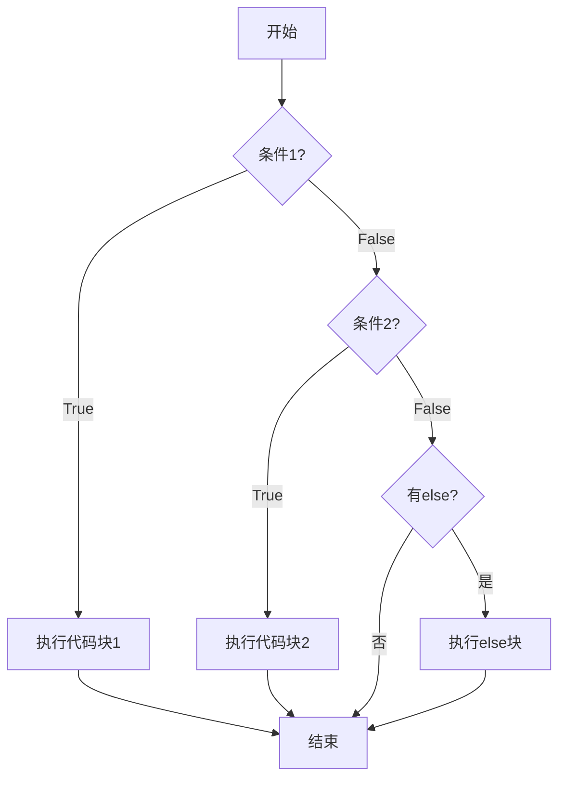
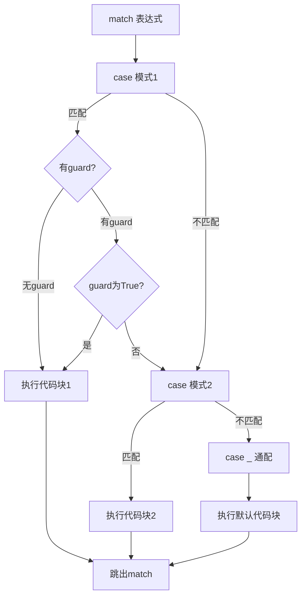
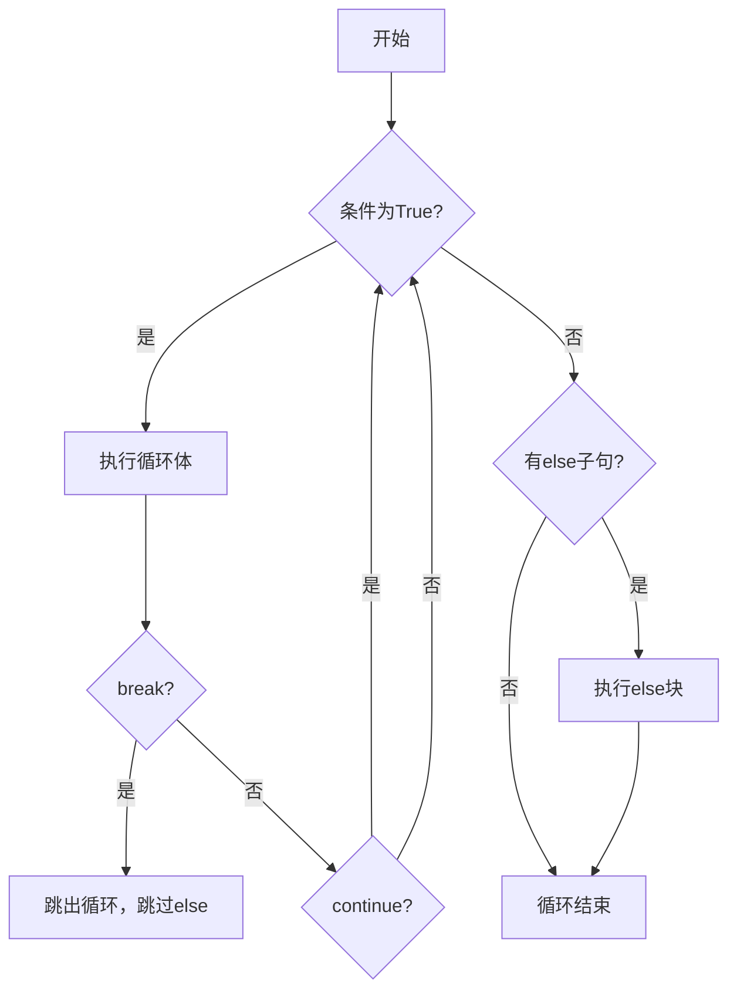
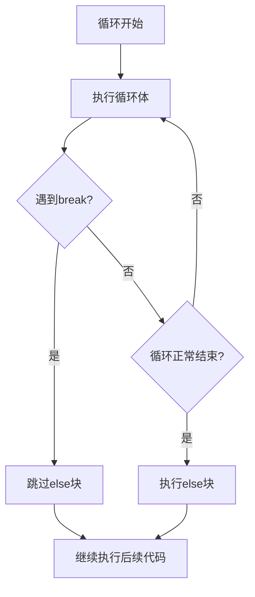

# 流程控制

Python 的流程控制决定了代码的执行顺序，主要由条件语句、循环语句以及相关的控制指令构成。

## 为什么 Python 用缩进而非花括号？

Python 使用缩进（indentation）来标识代码块，而非 C/Java 风格的花括号 `{}`。这并非随意的决定，而是根植于 Python 的设计哲学——**可读性至上**（PEP 8, *The Zen of Python*："Readability counts"）。

在其他语言中，缩进只是个人风格，花括号才是语法边界，这导致了一个经典问题：代码的视觉结构可能与实际逻辑不一致。Python 强制缩进等于语法，消除了这种歧义。你可以把它理解为：**Python 不允许你写出"看起来对但逻辑错"的代码块**。

::: tip 小知识
Python 之父 Guido van Rossum 曾说："使用缩进的一个好处是，你永远不会因为忘记写花括号而产生 bug。"
:::

## 条件语句 (Conditional Statements)

条件语句用于根据特定条件是否满足来执行不同的代码块。

### if-elif-else 条件分支流程



### `if` 语句

如果条件为真，则执行 `if` 下方的代码块。

```python
# 示例：检查年龄
age = 20
if age >= 18:
    print("您已成年，可以访问此内容。")
```

### `if-else` 语句

提供两种选择：条件为真时执行 `if` 块，否则执行 `else` 块。

```python
# 示例：根据登录状态显示消息
is_logged_in = False
if is_logged_in:
    print("欢迎回来！")
else:
    print("请先登录。")
```

### `if-elif-else` 语句

用于处理多个互斥的条件，程序会从上到下检查，执行第一个为真的条件所对应的代码块。

```python
# 示例：根据分数评定等级
score = 85
if score >= 90:
    grade = 'A'
elif score >= 80:
    grade = 'B'
elif score >= 70:
    grade = 'C'
else:
    grade = 'D'

print(f"您的成绩等级是：{grade}") # 输出: 您的成绩等级是：B
```

### if-elif-else 完整示例（逐行注释）

```python
# 模拟一个交通信号灯系统
light = input("请输入信号灯颜色（红/黄/绿）: ").strip()  # 获取用户输入并去除首尾空格

if light == "红":                    # 第一个条件：红灯
    print("停车等待")                 # 条件为真时执行
elif light == "黄":                  # 第二个条件：黄灯（仅在前面的条件都为假时才检查）
    print("减速准备停车")             # 条件为真时执行
elif light == "绿":                  # 第三个条件：绿灯
    print("通行")                     # 条件为真时执行
else:                                # 所有条件都不满足时的兜底分支
    print("无效的信号灯颜色")         # 兜底执行

# 重要：elif 是"互斥"的，一旦某个条件为真，后面的条件不再检查
# 这比写多个独立的 if 更高效，也更符合业务逻辑
```

### 嵌套 `if` 语句

在 `if` 语句内部可以嵌套其他 `if` 语句，用于更复杂的逻辑判断。

```python
# 示例：检查驾驶资格
age = 20
has_license = True

if age >= 18:
    print("年龄符合要求。")
    if has_license:
        print("您可以合法驾驶。")
    else:
        print("您需要先考取驾照。")
else:
    print("您还未成年，不能驾驶。")
```

::: warning 避免过深嵌套
嵌套超过 3 层会严重影响可读性。推荐使用"卫语句"（guard clause）提前返回来减少嵌套：

```python
# 不推荐：深层嵌套
if user:
    if user.is_active:
        if user.has_permission:
            do_something()

# 推荐：卫语句提前返回/跳过
if not user:
    return
if not user.is_active:
    return
if not user.has_permission:
    return
do_something()
```
:::

## 构建复杂条件

为了编写更强大的逻辑，我们可以使用逻辑运算符 `and`、`or` 和 `not`，以及成员资格测试运算符 `in` 和 `not in`。

### 逻辑运算符：`and`, `or`

- `and`: 当所有条件都为真时，整个表达式才为真。
- `or`: 只要有一个条件为真，整个表达式就为真。

```python
# 示例：检查入学资格
age = 22
has_diploma = True

# and: 必须同时满足年龄和学历要求
if age >= 18 and has_diploma:
    print("资格审查通过。")

# or: 满足 VIP 或高分条件之一即可
is_vip = False
score = 95
if is_vip or score > 90:
    print("恭喜，您获得优先录取资格。")
```

### 成员资格测试：`in`, `not in`

用于判断一个元素是否存在于序列（如列表、元组、字符串）中。

```python
# 示例：检查用户权限和披萨配料
banned_users = ['andrew', 'carolina', 'david']
user = 'marie'

if user not in banned_users:
    print(f"{user.title()}, 欢迎您发布内容。")

requested_toppings = ['mushrooms', 'onions', 'pineapple']
if 'mushrooms' in requested_toppings:
    print("正在添加蘑菇。")
```

### 检查集合的布尔值

在条件判断中，空的集合（如列表、字典、元组、字符串）会被视为 `False`，非空的集合则为 `True`。这提供了一种简洁的方式来检查集合是否为空。

```python
requested_toppings = []

if requested_toppings: # 因为列表为空，所以条件为 False
    print("列表不为空，开始制作披萨！")
else:
    print("您确定要一个不加任何配料的披萨吗？")
```

## 三元运算符 (Ternary Operator)

三元运算符是 `if-else` 语句的简洁形式，适用于简单的条件赋值。

**语法**: `value_if_true if condition else value_if_false`

```python
# 示例 1：根据用户角色设置权限
is_admin = True
access_level = "完全访问" if is_admin else "受限访问"
print(f"您的访问级别: {access_level}") # 输出: 您的访问级别: 完全访问

# 示例 2：计算两数的差的绝对值
a = 10
b = 6
difference = a - b if a > b else b - a
print(f"差的绝对值为: {difference}") # 输出: 差的绝对值为: 4

# 示例 3：三元运算符完整示例（逐行注释）
score = 72                                               # 定义分数
result = "及格" if score >= 60 else "不及格"              # 如果分数>=60则"及格"，否则"不及格"
print(f"考试结果: {result}")                              # 输出: 考试结果: 及格

# 示例 4：三元运算符嵌套（不推荐，可读性差）
# 能用但难读——建议改用 if-elif-else
status = "优秀" if score >= 90 else "良好" if score >= 75 else "及格" if score >= 60 else "不及格"
# 更好的写法：
if score >= 90:
    status = "优秀"
elif score >= 75:
    status = "良好"
elif score >= 60:
    status = "及格"
else:
    status = "不及格"
```

## 结构化模式匹配：`match-case` (Python 3.10+)

### 为什么 Python 直到 3.10 才有 match-case？

长久以来，Python 社区对是否引入 `switch-case` 争论不休。Guido 多次拒绝简单的 `switch` 提案，原因在于：一个仅做值匹配的 `switch` 并不比 `if-elif` 好多少，不值得为此增加语言关键字。直到 PEP 634 提出了**结构化模式匹配**——它不仅仅是值的比较，而是对数据结构的形状（shape）进行解构匹配，这才有了足够的理由引入新语法。`match-case` 的设计灵感来自 Haskell、Rust、Erlang 等语言的模式匹配，远超传统 `switch-case` 的能力。

### match-case 模式匹配流程



### match-case 基础用法

```python
# 示例：处理不同的 HTTP 状态码
status_code = 404

match status_code:
    case 200:
        print("请求成功")
    case 404:
        print("未找到资源")
    case 500:
        print("服务器内部错误")
    case _:
        print("未知的状态码")
```

### match-case 完整示例（逐行注释）：守卫、解包、类模式

```python
# ========== 1. 守卫（Guard）：用 if 添加额外条件 ==========
point = (3, 4)

match point:
    case (x, y) if x == y:               # 匹配元组，且 x 等于 y
        print(f"在对角线上: ({x}, {y})")
    case (x, y) if x > 0 and y > 0:      # 匹配元组，且 x、y 均为正
        print(f"第一象限: ({x}, {y})")
    case (0, 0):
        print("原点")
    case _:                               # 通配符，兜底匹配
        print("其他位置")

# ========== 2. 解包匹配：解构列表/元组 ==========
command = "goto 42 87"

match command.split():                    # 按空格分割为列表
    case ["quit"]:                        # 匹配只有一个元素的列表
        print("退出程序")
    case ["goto", x, y]:                 # 匹配三个元素，后两个绑定到变量
        print(f"移动到坐标 ({x}, {y})")
    case ["pick", obj, *rest]:           # *rest 捕获剩余元素（类似 *args）
        print(f"拾取 {obj}，其余: {rest}")
    case _:
        print("未知命令")

# ========== 3. 类模式匹配：解构对象属性 ==========
class Point:
    __match_args__ = ("x", "y")          # 告诉 match 按什么顺序解构属性
    def __init__(self, x, y):
        self.x = x
        self.y = y

shape = Point(3, 4)

match shape:
    case Point(x=0, y=0):                # 匹配原点
        print("原点")
    case Point(x=x, y=y) if x > 0 and y > 0:  # 匹配第一象限
        print(f"第一象限: ({x}, {y})")
    case Point(x=x, y=y):               # 匹配任意点
        print(f"坐标: ({x}, {y})")

# ========== 4. OR 模式：用 | 合并多个匹配 ==========
status = 403

match status:
    case 200 | 201 | 204:                # 用 | 表示"或"关系
        print("成功响应")
    case 400 | 401 | 403 | 404:          # 多个值共享同一处理逻辑
        print("客户端错误")
    case 500 | 502 | 503:
        print("服务端错误")
```

`match-case` 还支持更复杂的模式，如匹配数据结构、使用守卫（`if` 条件）等，非常适合处理结构化的数据。

## 循环语句 (Looping Statements)

循环用于重复执行一段代码，Python 主要提供 `for` 循环和 `while` 循环。

### for 循环执行流程：迭代器协议

```mermaid
flowchart TD
    A[for item in iterable] --> B[调用 iter&#40;iterable&#41;]
    B --> C[获取迭代器 iterator]
    C --> D[调用 next&#40;iterator&#41;]
    D --> E{抛出StopIteration?}
    E -- 否 --> F[item = 返回值]
    F --> G[执行循环体]
    G --> H{break?}
    H -- 是 --> I[跳出循环]
    H -- 否 --> J{continue?}
    J -- 是 --> D
    J -- 否 --> D
    E -- 是 --> K{有else子句?}
    K -- 是 --> L[执行else块]
    K -- 否 --> M[循环结束]
    L --> M
    I --> N[跳过else块]
```



### 为什么 Python 的 for 循环不同于 C？

在 C 语言中，`for` 循环是 `init; condition; increment` 三段式结构，本质是 while 的语法糖。Python 的 `for` 则完全不同——它基于**迭代器协议**（Iterator Protocol）：

1. 对可迭代对象调用 `iter()` 获取迭代器
2. 反复调用迭代器的 `__next__()` 获取下一个元素
3. 当 `__next__()` 抛出 `StopIteration` 异常时循环结束

这意味着 Python 的 `for` 不需要索引计数器，它可以遍历任何实现了迭代器协议的对象——列表、字典、文件、生成器、甚至自定义类。这是一种更高层次的抽象。

### `for` 循环

`for` 循环用于遍历任何**可迭代对象**（如列表、元组、字符串、字典、集合等）中的元素。

```python
# 示例 1: 遍历列表
fruits = ['苹果', '香蕉', '橙子']
for fruit in fruits:
    print(f"我喜欢吃 {fruit}")

# 示例 2: 遍历字符串
for char in "Python":
    print(char, end=' ') # P y t h o n
print()

# 示例 3: 使用 range() 生成数字序列
# range(5) -> 0, 1, 2, 3, 4
# range(1, 6) -> 1, 2, 3, 4, 5
# range(0, 10, 2) -> 0, 2, 4, 6, 8
for i in range(1, 6):
    print(f"当前数字: {i}")
```

### for 循环完整示例（逐行注释）：range + enumerate + zip

```python
# ========== range：生成整数序列 ==========
# range(start, stop, step) —— 左闭右开，不包含 stop
for i in range(5):                       # 0, 1, 2, 3, 4
    print(i, end=' ')
print()                                  # 换行

for i in range(2, 10, 3):                # 2, 5, 8（从2开始，步长3）
    print(i, end=' ')
print()

# ========== enumerate：同时获取索引和值 ==========
fruits = ['苹果', '香蕉', '橙子']
for index, fruit in enumerate(fruits):   # 默认索引从 0 开始
    print(f"第{index}个水果是{fruit}")

for index, fruit in enumerate(fruits, start=1):  # 索引从 1 开始
    print(f"第{index}个水果是{fruit}")

# ========== zip：并行遍历多个序列 ==========
names = ['Alice', 'Bob', 'Charlie']
scores = [95, 87, 72]
for name, score in zip(names, scores):   # 按最短序列对齐
    print(f"{name}: {score}分")

# zip 与 enumerate 结合
for i, (name, score) in enumerate(zip(names, scores), start=1):
    print(f"{i}. {name} — {score}分")

# ========== 遍历字典 ==========
person = {'name': '张三', 'age': 25, 'city': '北京'}
for key in person:                        # 默认遍历键
    print(f"{key}: {person[key]}")

for key, value in person.items():         # 同时遍历键和值（更常用）
    print(f"{key} = {value}")
```

### 推导式 (Comprehensions)

推导式是 Python 最优雅的特性之一，用一行代码即可从可迭代对象创建新的数据结构。

```python
# ========== 列表推导式 ==========
# 基本语法：[表达式 for 变量 in 可迭代对象 if 条件]
squares = [x ** 2 for x in range(10)]               # [0, 1, 4, 9, 16, 25, 36, 49, 64, 81]
even_squares = [x ** 2 for x in range(10) if x % 2 == 0]  # 只保留偶数的平方: [0, 4, 16, 36, 64]

# 带嵌套的列表推导式
matrix = [[1, 2, 3], [4, 5, 6], [7, 8, 9]]
flat = [num for row in matrix for num in row]        # 展平: [1, 2, 3, 4, 5, 6, 7, 8, 9]

# ========== 字典推导式 ==========
# 基本语法：{键表达式: 值表达式 for 变量 in 可迭代对象 if 条件}
words = ['hello', 'world', 'python']
word_lengths = {word: len(word) for word in words}   # {'hello': 5, 'world': 5, 'python': 6}

# 翻转字典的键和值
original = {'a': 1, 'b': 2, 'c': 3}
flipped = {v: k for k, v in original.items()}        # {1: 'a', 2: 'b', 3: 'c'}

# ========== 集合推导式 ==========
# 基本语法：{表达式 for 变量 in 可迭代对象 if 条件}
nums = [1, 2, 2, 3, 3, 3, 4]
unique_squares = {x ** 2 for x in nums}              # {1, 4, 9, 16}（自动去重）

# ========== 生成器表达式（惰性求值） ==========
# 用圆括号而非方括号，不立即创建列表，而是按需生成
total = sum(x ** 2 for x in range(1000000))          # 不会一次性创建百万元素的列表
print(f"0到999999的平方和: {total}")
```

::: tip 何时用推导式，何时用 for 循环？
- 推导式适合**简单的映射/过滤**，一行能写完就用推导式
- 如果逻辑复杂（需要 try-except、多步操作、副作用），请用普通 for 循环
- 推导式的核心价值是**声明式**——告诉 Python "我要什么"，而非"怎么做"
:::

### `while` 循环

`while` 循环会在给定条件为真时持续执行代码块。

```python
# 示例：倒计时
count = 5
while count > 0:
    print(f"倒计时: {count}")
    count -= 1
print("发射！")
```

### while 循环执行流程（含 else 分支）



### while 循环完整示例（逐行注释）

```python
# ========== 基本用法：条件驱动循环 ==========
password = ""                             # 初始化密码变量
while password != "secret":               # 只要密码不对就继续循环
    password = input("请输入密码: ")       # 提示用户输入
print("密码正确，欢迎进入！")              # 循环正常结束后执行

# ========== while-else：查找素数 ==========
n = 17                                    # 要检查的数字
i = 2                                     # 从 2 开始试除
while i < n:                              # 只要 i 还没到 n 就继续
    if n % i == 0:                        # 如果 n 能被 i 整除
        print(f"{n} 不是素数，能被 {i} 整除")
        break                             # 找到因子就跳出
    i += 1                                # 否则试下一个数
else:
    # while 的 else：只有循环正常结束（没被 break）才执行
    print(f"{n} 是素数")                  # 17 是素数

# ========== 无限循环 + break：等待特定条件 ==========
while True:                               # 无限循环
    response = input("输入 'exit' 退出: ")
    if response == 'exit':
        break                             # 满足条件时跳出
    print(f"你输入了: {response}")
```

## 循环控制

循环控制语句可以改变循环的正常执行流程。

- `break`: 立即终止整个循环。
- `continue`: 跳过当前迭代的剩余部分，直接开始下一次迭代。
- `else` 子句: 当循环**正常结束**（即没有被 `break` 中断）时，执行 `else` 块中的代码。

### for-else / while-else 的执行逻辑



### for-else / while-else：最容易误解的特性

`else` 这个关键字在这里极具误导性。在英语中，"else" 通常意味着"如果不满足条件"，但在循环中，`else` 的含义是**"没有 break 时执行"**——即循环**正常完成**时执行。

更好的理解方式：把 `else` 读作 **"no break"**。

```python
# 经典场景：在列表中查找元素
def find_first_even(numbers):
    """查找列表中的第一个偶数，返回它；如果没有偶数，返回 None"""
    for num in numbers:
        if num % 2 == 0:
            print(f"找到偶数: {num}")
            break                         # 找到了就跳出
    else:
        # 没有 break → 意味着"没找到"
        print("没有偶数")
        return None
    return num                            # break 后执行这里

# 测试 1：列表中有偶数
find_first_even([1, 3, 5, 8, 9])          # 输出: 找到偶数: 8

# 测试 2：列表中没有偶数
find_first_even([1, 3, 5, 7, 9])          # 输出: 没有偶数

# while-else 同理
def is_prime(n):
    """判断 n 是否为素数"""
    if n < 2:
        return False
    i = 2
    while i * i <= n:                     # 只需检查到 sqrt(n)
        if n % i == 0:
            break                         # 找到因子，不是素数
        i += 1
    else:
        return True                       # 没被 break → 是素数
    return False                          # 被 break → 不是素数

print(is_prime(17))                        # True
print(is_prime(18))                        # False
```

### break/continue 完整示例（逐行注释）

```python
# ========== break：找到即停 ==========
numbers = [1, 3, 5, 7, 8, 9, 11]
for num in numbers:                       # 遍历列表
    if num % 2 == 0:                      # 发现偶数
        print(f"找到第一个偶数: {num}")    # 输出它
        break                             # 立即跳出整个循环，不再检查后面的元素
else:
    print("列表中没有偶数。")              # 如果从未 break，执行这里

# ========== continue：跳过特定元素 ==========
for i in range(1, 10):                    # 1 到 9
    if i % 2 == 0:                        # 如果是偶数
        continue                          # 跳过本次迭代的剩余代码，直接进入下一次迭代
    print(i, end=' ')                     # 只打印奇数: 1 3 5 7 9
print()

# ========== 嵌套循环中跳出外层循环 ==========
# 方法：使用标志变量
found = False                             # 标志变量，初始为 False
matrix = [[1, 2, 3], [4, 5, 6], [7, 8, 9]]
target = 5

for row in matrix:
    for val in row:
        if val == target:
            print(f"找到 {target}")
            found = True                  # 设置标志
            break                         # 跳出内层循环
    if found:                             # 检查标志
        break                             # 跳出外层循环
```

## 迭代器协议 (Iterator Protocol)

Python 的 `for` 循环背后是迭代器协议。任何对象只要实现了 `__iter__` 和 `__next__` 两个方法，就可以被 `for` 遍历。

```python
# ========== 手动实现一个倒计时迭代器 ==========
class Countdown:
    """倒计时迭代器：从 n 倒数到 1"""
    
    def __init__(self, n):
        self.n = n                         # 起始数字
        self.current = n                   # 当前数字，从 n 开始
    
    def __iter__(self):
        """返回迭代器对象本身（self 就是迭代器）"""
        return self
    
    def __next__(self):
        """返回下一个值，没有更多值时抛出 StopIteration"""
        if self.current <= 0:              # 已经倒数到 0 以下
            raise StopIteration            # 告诉 for 循环：结束了
        self.current -= 1                  # 先减 1
        return self.current + 1            # 返回减之前的值（即当前值）

# 使用自定义迭代器
for num in Countdown(5):                   # for 会自动调用 __iter__ 和 __next__
    print(num, end=' ')                    # 5 4 3 2 1
print()

# 等价的手动调用过程
cd = Countdown(3)                          # 创建迭代器
it = iter(cd)                              # 调用 __iter__，获取迭代器
print(next(it))                            # 调用 __next__，输出 3
print(next(it))                            # 输出 2
print(next(it))                            # 输出 1
# print(next(it))                          # 会抛出 StopIteration 异常

# ========== 可迭代对象 vs 迭代器 ==========
# 可迭代对象（Iterable）：实现了 __iter__ 方法，返回一个迭代器
# 迭代器（Iterator）：同时实现了 __iter__ 和 __next__，自身就是迭代器

my_list = [1, 2, 3]                        # 列表是可迭代对象，但不是迭代器
# next(my_list)                            # TypeError: list 不是迭代器！

it = iter(my_list)                         # 调用 iter() 获取迭代器
print(next(it))                            # 1
print(next(it))                            # 2
print(next(it))                            # 3
# print(next(it))                          # StopIteration

# 迭代器是一次性的：耗尽后不能重用
print(list(it))                            # []（已经耗尽了）
it2 = iter(my_list)                        # 重新获取新的迭代器
print(list(it2))                           # [1, 2, 3]
```

::: tip 可迭代对象 vs 迭代器
- **可迭代对象**（Iterable）：有 `__iter__` 方法，可以返回一个迭代器。如 `list`、`str`、`dict`。
- **迭代器**（Iterator）：同时有 `__iter__` 和 `__next__` 方法。迭代器是**一次性**的，耗尽后不能重用。
- `for` 循环自动处理了 `iter()` 和 `StopIteration`，你通常不需要手动调用。
:::

## 在循环中安全地修改集合

在遍历一个列表的同时修改它，通常是不安全的，尤其是在 `for` 循环中。这可能导致跳过元素或出现意外行为。正确的做法是使用 `while` 循环或创建一个副本进行遍历。

::: danger 注意
永远不要在 `for` 循环中直接修改你正在遍历的列表。如果你需要这样做，请使用 `while` 循环或遍历列表的副本。
:::

### 示例：移除所有偶数

```python
# 错误的方式：使用 for 循环
numbers = [1, 2, 3, 4, 5, 6]
# for num in numbers:
#     if num % 2 == 0:
#         numbers.remove(num) # 边遍历边删会跳过元素（本例因奇数间隔恰好删干净；
#                             # 换成连续偶数 [2, 4, 6, 8] 会漏删，结果为 [4, 8]）

# 正确的方式 1：使用 while 循环
numbers_while = [1, 2, 3, 4, 5, 6]
i = 0
while i < len(numbers_while):
    if numbers_while[i] % 2 == 0:
        numbers_while.pop(i)
    else:
        i += 1
print(f"使用 while 循环移除偶数后: {numbers_while}")

# 正确的方式 2：遍历副本
numbers_copy = [1, 2, 3, 4, 5, 6]
for num in numbers_copy[:]: # [:] 创建了一个完整的列表副本
    if num % 2 == 0:
        numbers_copy.remove(num)
print(f"遍历副本移除偶数后: {numbers_copy}")

# 正确的方式 3：使用列表推导式 (更 Pythonic)
numbers_comp = [1, 2, 3, 4, 5, 6]
odd_numbers = [num for num in numbers_comp if num % 2 != 0]
print(f"使用列表推导式筛选奇数: {odd_numbers}")
```

## 最佳实践对比

### 循环选择：for vs while

| 特性 | `for` 循环 | `while` 循环 |
|------|-----------|-------------|
| 适用场景 | 已知迭代次数、遍历集合 | 不确定迭代次数、依赖条件 |
| 迭代方式 | 自动通过迭代器协议 | 手动管理条件/计数器 |
| 典型用途 | 遍历列表/字典/文件行 | 等待用户输入、轮询状态、游戏循环 |
| 无限循环风险 | 低（天然有终止条件） | 高（忘记更新条件会死循环） |
| 可读性 | 高（声明式） | 中（命令式） |

### 多条件分支选择：if-elif vs match-case vs dict dispatch

| 特性 | `if-elif-else` | `match-case` (3.10+) | 字典分发 |
|------|---------------|----------------------|---------|
| Python 版本 | 全版本 | 3.10+ | 全版本 |
| 值匹配 | 适合 | 适合 | 适合 |
| 结构解构 | 不支持 | 支持 | 不支持 |
| 守卫条件 | 每个分支独立 | 内置 `if` 守卫 | 需额外逻辑 |
| 可读性 | 分支少时好 | 模式多时好 | 映射关系清晰时好 |
| 性能 | O(n) 逐条判断 | O(n) 逐条匹配 | O(1) 哈希查找 |
| 副作用 | 可包含任意逻辑 | 可包含任意逻辑 | 仅调用函数 |

```python
# 字典分发示例：用字典替代 if-elif
def handle_start(): print("启动")
def handle_stop():  print("停止")
def handle_pause(): print("暂停")

commands = {
    "start": handle_start,
    "stop":  handle_stop,
    "pause": handle_pause,
}

action = "start"
commands.get(action, lambda: print("未知命令"))()  # 输出: 启动
```

### range vs enumerate vs zip

| 特性 | `range()` | `enumerate()` | `zip()` |
|------|----------|--------------|---------|
| 用途 | 生成整数序列 | 获取索引+值 | 并行遍历多个序列 |
| 返回类型 | range 对象（惰性） | enumerate 对象（惰性） | zip 对象（惰性） |
| 典型场景 | 执行固定次数 | 需要索引编号 | 多列表对齐 |
| 内存占用 | 极小（只存参数） | 极小 | 极小 |
| 截断行为 | N/A | 跟随原序列 | 以最短序列为准 |

```python
# 何时用哪个？看需求：
data = ['a', 'b', 'c']

# 只需要值 → 直接遍历
for item in data:
    print(item)

# 需要索引 → enumerate
for i, item in enumerate(data):
    print(f"{i}: {item}")

# 需要固定次数 → range
for _ in range(3):
    print("执行3次")

# 需要并行遍历 → zip
names = ['Alice', 'Bob']
scores = [95, 87]
for name, score in zip(names, scores):
    print(f"{name}: {score}")
```

## 实战案例

### 猜数字游戏

这是一个经典的 `while` 循环应用，结合了用户输入、条件判断和循环控制。

```python
import random

secret_number = random.randint(1, 100)
attempts = 0

print("欢迎来到猜数字游戏！我已经想好了一个 1 到 100 之间的数字。")

while True:
    try:
        guess_str = input("请输入你的猜测 (输入 'quit' 退出): ")
        if guess_str.lower() == 'quit':
            print("游戏结束。")
            break

        guess = int(guess_str)
        attempts += 1

        if guess < secret_number:
            print("太小了，再大一点！")
        elif guess > secret_number:
            print("太大了，再小一点！")
        else:
            print(f"恭喜你，猜对了！数字就是 {secret_number}。")
            print(f"你一共尝试了 {attempts} 次。")
            break
    except ValueError:
        print("无效输入，请输入一个整数或 'quit'。")
```

### 简易计算器

这个例子展示了如何结合 `while` 循环和 `if-elif-else` 来创建一个持续运行的菜单驱动程序。

```python
def print_menu():
    print("\n--- 简易计算器 ---")
    print("1. 加法")
    print("2. 减法")
    print("3. 乘法")
    print("4. 除法")
    print("5. 打印九九乘法表")
    print("6. 退出")

while True:
    print_menu()
    choice = input("请输入你的选择 (1-6): ")

    if choice == '6':
        print("感谢使用，再见！")
        break

    if choice == '5':
        for i in range(1, 10):
            for j in range(1, i + 1):
                print(f"{j} * {i} = {i*j}", end='\t')
            print() # 换行
        continue

    if choice in ['1', '2', '3', '4']:
        try:
            num1_str, num2_str = input("请输入两个数字，用空格隔开: ").split()
            num1 = float(num1_str)
            num2 = float(num2_str)
        except ValueError:
            print("输入无效，请输入两个数字。")
            continue

        if choice == '1':
            print(f"结果: {num1} + {num2} = {num1 + num2}")
        elif choice == '2':
            print(f"结果: {num1} - {num2} = {num1 - num2}")
        elif choice == '3':
            print(f"结果: {num1} * {num2} = {num1 * num2}")
        elif choice == '4':
            if num2 == 0:
                print("错误：除数不能为零。")
            else:
                print(f"结果: {num1} / {num2} = {num1 / num2}")
    else:
        print("无效选择，请输入 1 到 6 之间的数字。")
```

## 常见陷阱与 FAQ

### 陷阱 1：for-else 的 else 何时执行？

这是 Python 中被误解最深的特性之一。`else` 在循环**正常结束**（未被 `break`）时执行，**不是**在循环条件为假时执行，更**不是**在循环"失败"时执行。

```python
# 误解：以为 else 是"循环没执行"时运行
for i in range(3):                        # 循环会正常执行 3 次
    print(i)
else:
    print("else 执行了！")                 # 这行会执行！因为循环没被 break

# 正确理解：else = "没有 break"
for i in range(3):
    if i == 1:
        break                             # 被 break 了
else:
    print("这行不会执行")                   # 因为被 break 了，所以跳过
```

### 陷阱 2：循环变量的作用域

Python 的 `for` 循环变量在循环结束后**仍然存在**，不会像 C/Java 那样被销毁。

```python
for x in range(5):
    pass                                   # 什么都不做

print(x)                                   # 输出 4！x 仍然存在，值为最后一次迭代

# 更危险的场景：
x = 100                                    # 外部变量
for x in [1, 2, 3]:                        # 同名变量会覆盖外部变量！
    pass
print(x)                                   # 3（被覆盖了，不再是 100）

# 如果列表为空，则不会覆盖
x = 100
for x in []:                               # 空列表，循环体不执行
    pass
print(x)                                   # 100（没被覆盖，因为循环体没执行过）
```

### 陷阱 3：修改迭代中的列表

```python
# 经典 bug：边遍历边删除，导致跳过元素
nums = [1, 2, 2, 3, 4, 2, 5]
# 意图：删除所有 2
for n in nums:
    if n == 2:
        nums.remove(n)
print(nums)                                # [1, 2, 3, 4, 5] —— 还剩一个 2！

# 原因：删除第一个 2 后，后面的元素前移，但迭代器已经跳过了那个位置
# 解决方案 1：遍历副本
nums = [1, 2, 2, 3, 4, 2, 5]
for n in nums[:]:                          # nums[:] 创建副本
    if n == 2:
        nums.remove(n)
print(nums)                                # [1, 3, 4, 5] ✓

# 解决方案 2：列表推导式（推荐）
nums = [1, 2, 2, 3, 4, 2, 5]
nums = [n for n in nums if n != 2]
print(nums)                                # [1, 3, 4, 5] ✓
```

### 陷阱 4：无限循环的调试

```python
# 常见原因 1：忘记更新条件变量
count = 0
# while count < 5:                         # 死循环！count 永远是 0
#     print(count)

# 正确写法
count = 0
while count < 5:
    print(count)
    count += 1                             # 别忘了更新！

# 常见原因 2：浮点数精度问题
x = 0.0
# while x != 1.0:                          # 死循环！浮点数累加有精度误差
#     x += 0.1

# 正确写法：用 > 或 < 而非 !=
x = 0.0
while x < 1.0:                             # 用 < 而非 !=
    x += 0.1
    print(round(x, 1))                     # 用 round 控制显示精度

# 调试技巧：添加最大迭代次数
max_iterations = 1000
iteration = 0
while some_condition():
    iteration += 1
    if iteration > max_iterations:
        print(f"警告：超过 {max_iterations} 次迭代，可能死循环！")
        break
    # ... 正常逻辑 ...
```

### 陷阱 5：match-case 与 switch-case 的区别

```python
# C/Java 的 switch-case：
# - 只做值匹配，不做结构匹配
# - 需要手动 break，否则会 fall-through
# - 匹配值必须是常量

# Python 的 match-case：
# 1. 自动终止，不会 fall-through（不需要 break）
match 2:
    case 1:
        print("一")
    case 2:
        print("二")                        # 匹配后自动跳出，不会继续到 case _
    case _:
        print("其他")

# 2. 可以做结构解构，不仅仅是值比较
match [1, 2, 3]:
    case [1, _, 3]:                        # 匹配"首尾是 1 和 3 的三元素列表"
        print("匹配成功")                   # _ 是通配符，匹配任意值

# 3. 可以绑定变量
match (10, 20):
    case (x, y):                           # x=10, y=20
        print(f"坐标: {x}, {y}")

# 4. 可以用守卫（if 条件）进一步过滤
match 15:
    case n if n > 10:                      # 先匹配值，再检查守卫
        print(f"大于10的数: {n}")
    case _:
        print("其他")
```

## 术语表

| 术语 | 英文 | 定义 |
|------|------|------|
| 条件分支 | Conditional Branch | 根据条件表达式的真假，选择不同代码路径执行的控制结构 |
| 循环 | Loop | 重复执行一段代码的控制结构，分为确定次数循环（for）和条件循环（while） |
| 迭代器 | Iterator | 实现了 `__iter__` 和 `__next__` 方法的对象，用于逐个返回元素，耗尽后抛出 `StopIteration` |
| 可迭代对象 | Iterable | 实现了 `__iter__` 方法的对象，可以返回一个迭代器，如列表、字符串、字典 |
| 模式匹配 | Pattern Matching | 根据数据的结构和内容进行匹配与解构的机制（Python 3.10+ 的 `match-case`） |
| 卫语句 | Guard Clause | 在函数/代码块开头用 `if + return/break` 提前退出，减少嵌套层数的编程技巧 |
| 推导式 | Comprehension | 用简洁语法从可迭代对象创建新数据结构的表达式，包括列表推导式、字典推导式、集合推导式 |
| 迭代器协议 | Iterator Protocol | Python 的 `for` 循环底层机制：`iter()` 获取迭代器，`next()` 逐个获取元素，`StopIteration` 表示结束 |

## 延伸阅读

- → [函数](13-函数) —— 函数是将流程控制封装为可复用单元的基础
- → [异常处理](15-异常处理) —— `try-except` 是另一种流程控制机制，用于处理运行时错误
- → [数据类型](07-数据类型) —— 理解可迭代对象与迭代器需要先掌握基础数据类型

## 版本差异（Python 3.8-3.12 → 3.14）

| 特性 | 本文编写时 | Python 3.14 |
|------|-----------|-------------|
| 类型注解求值 | 运行时立即求值 | PEP 649/749 延迟求值：注解不再在定义时执行，解决前向引用，提升启动性能 |
| 字符串模板 | 普通 f-string / `str.format` | PEP 750 模板字符串 `t"..."`：可插值且能被安全处理（3.14 新特性） |
| 标准库多解释器 | 无官方支持 | PEP 734：`concurrent.interpreters` 模块支持在同一进程创建多个子解释器 |
| 调试 | 仅 Python 内建 pdb / IDE 调试 | PEP 768：安全的 CPython 外部调试器接口（custom debugger protocol） |
| 字节码与运行时 | 3.12 前无 JIT | 3.13 引入实验性 JIT（PEP 744）；3.14 进一步改进 free-threaded（无 GIL）构建 |
| `datetime` API | `utcnow()` 常用 | 3.12 起弃用，官方要求改用 `datetime.now(tz=datetime.UTC)`（aware 对象） |
| 压缩算法 | zlib / gzip / bz2 / lzma | 3.14 新增标准库 Zstandard 支持（PEP 784） |

> 本文讲解的语法与数据结构原理在 3.14 中依然成立；新项目建议基于 Python 3.13/3.14，并优先使用 aware datetime、PEP 649 注解与最新类型语法。
