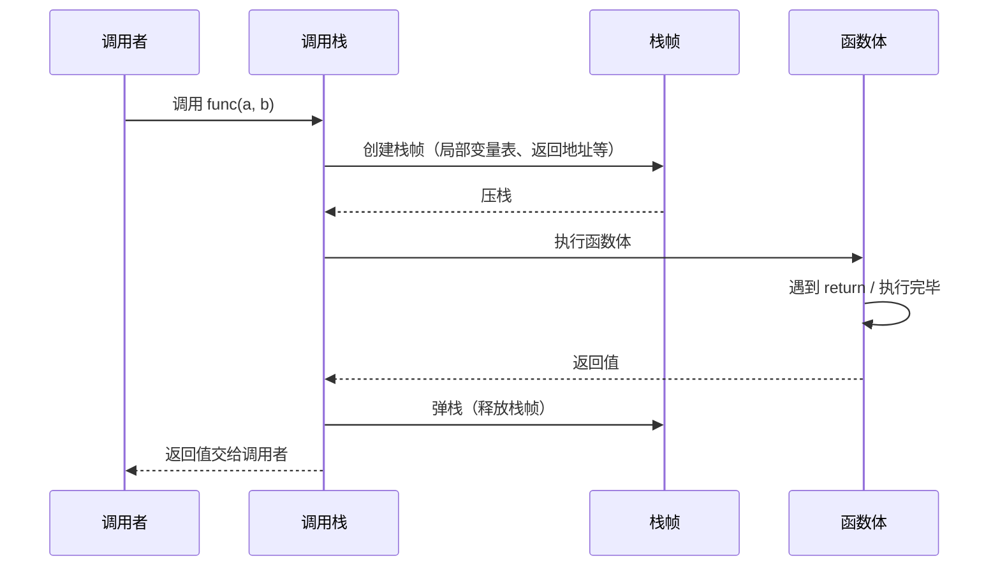
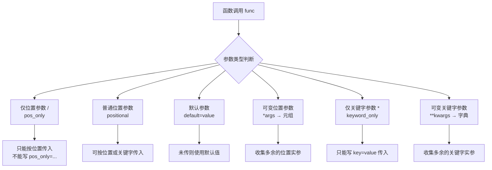
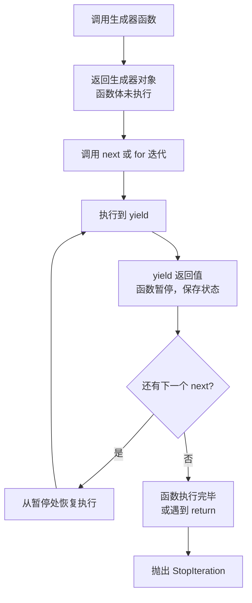
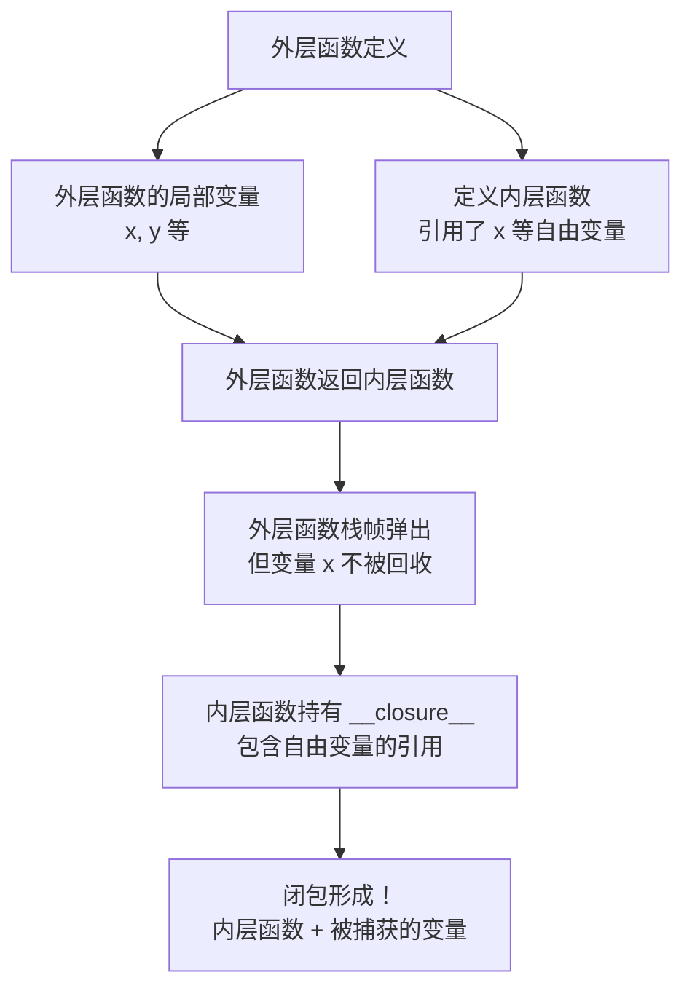
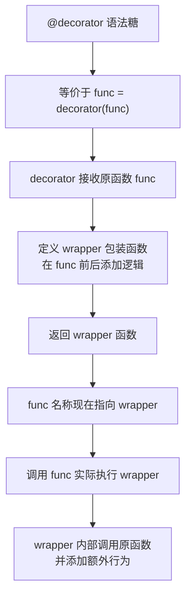

# 函数

`Python` 中的函数是一段组织好的、可重复使用的代码块，用于执行特定的任务。函数可以提高代码的可读性、可维护性和复用性。

> 阅读提示

- 先掌握「定义、参数、返回值」的基础，再逐步了解作用域、闭包、装饰器等进阶内容
- 本文所有示例都可直接复制到交互式解释器中运行，建议在阅读时同步实验
- 章节相互独立，可按需跳转；若想系统复习，可按顺序阅读并完成练习

## 函数的定义

使用 `def` 关键字定义函数，语法如下：

- **函数名**：函数的名称，命名应遵循标识符命名规则
- **参数列表**：函数的输入参数，可以有零个或多个参数，多个参数之间用逗号分隔
- **文档字符串**（Docstring）：可选，用于描述函数的功能和使用方法
- **函数体**：实现函数功能的代码块
- **return 语句**：可选，用于返回函数的结果。如果不返回任何值，默认返回 `None`

```python
def 函数名(参数列表):
    """文档字符串"""
    函数体
    [return 返回值]
```

示例：定义函数后，可以通过函数名加括号的方式调用函数

```python
def greet(name):
    """打印问候语"""
    print(f"Hello, {name}!")

greet("Alice")
```

## 函数调用的内部机制

当我们调用一个函数时，Python 虚拟机在背后做了哪些事情？理解这一点，对于后续理解闭包、递归、生成器至关重要。

### 调用栈与栈帧

Python 使用**调用栈**（Call Stack）来管理函数调用。每次函数被调用时，解释器会创建一个**栈帧**（Frame Object），压入调用栈；函数返回时，栈帧弹出。



每个栈帧包含：

| 组成部分 | 说明 |
|---------|------|
| 局部变量表 | 函数参数 + 函数内定义的变量 |
| 返回地址 | 函数执行完毕后，回到调用者的哪一行继续执行 |
| 帧引用 | 指向外层栈帧的指针，形成调用链 |

你可以用 `sys._getframe()` 或 `inspect` 模块观察栈帧：

```python
import inspect

def inner():
    # 获取当前栈帧
    frame = inspect.currentframe()
    print(f"函数名: {frame.f_code.co_name}")       # inner
    print(f"局部变量: {frame.f_locals}")            # {'frame': ...}
    print(f"所在行号: {frame.f_lineno}")             # 当前行号

def outer():
    x = 42
    inner()

outer()
```

### 为什么这很重要？

- **递归过深** = 栈帧过多 = 栈溢出（`RecursionError`）
- **闭包** = 内层函数的栈帧已经弹出，但通过 `__closure__` 仍持有外层变量的引用
- **生成器** = 函数栈帧不销毁，而是"冻结"在 `yield` 处，下次 `next()` 时恢复

## 函数是第一类对象

- 函数可以像普通数据一样被赋值、作为参数传递、作为返回值或存放在容器中
- 任何实现了 `__call__` 方法的对象都可以被调用，可用内置函数 `callable()` 快速检查

```python
def shout(text):
    return text.upper()

action = shout            # 赋值
callbacks = [shout, len]  # 放入容器

def run(func, value):     # 作为参数
    if not callable(func):
        raise TypeError("必须传入可调用对象")
    return func(value)

print(action("hello"))         # 输出: HELLO
print(run(len, "python"))      # 输出: 6
```

这意味着我们可以轻松实现策略模式、回调、插件系统等灵活功能。

## 函数的参数

`Python` 函数支持多种类型的参数，包括位置参数、默认参数、可变参数和关键字参数。

### 参数传递机制全景



### 位置参数

按照参数的位置顺序传递参数

```python
def add(a, b):
    return a + b

result = add(3, 5)
print(result)  # 输出: 8
```

### 默认参数

为参数指定默认值，调用时可以不传递该参数。

```python
def greet(name, message="Hello"):
    print(f"{message}, {name}!")

greet("Bob")          # 输出: Hello, Bob!
greet("Charlie", "Hi") # 输出: Hi, Charlie!
```

### 可变位置参数 (`*args`)

允许函数接收任意数量的位置参数，参数会被收集到一个元组中

```python
def sum_all(*args):
    total = 0
    for num in args:
        total += num
    return total

print(sum_all(1, 2, 3))      # 输出: 6
print(sum_all(1, 2, 3, 4))   # 输出: 10
```

### 关键字参数

通过参数名指定参数值，调用时可以不按顺序传递

```python
def describe_pet(animal_type, pet_name):
    print(f"I have a {animal_type} named {pet_name}.")

describe_pet(pet_name="Whiskers", animal_type="cat")

# 输出：I have a cat named Whiskers.
```

### 可变关键字参数 (`**kwargs`)

允许函数接收任意数量的关键字参数，参数会被收集到一个字典中

```python
def display_info(**kwargs):
    for key, value in kwargs.items():
        print(f"{key}: {value}")

display_info(name="Alice", age=30, city="New York")
```

**输出：**

```text
name: Alice
age: 30
city: New York
```

### 参数组合

参数可以组合使用，但有一定的顺序：

1. 位置参数
2. 默认参数
3. 可变位置参数 (`*args`)
4. 关键字参数
5. 可变关键字参数 (`**kwargs`)

| 顺序 | 参数类别       | 语法示例             | 作用                                      |
| ---- | -------------- | -------------------- | ----------------------------------------- |
| 1    | 仅限位置参数   | `def func(a, b, /)`  | 只能用位置传值，提高性能                  |
| 2    | 普通位置参数   | `def func(a, b)`     | 最常见，按顺序传入                        |
| 3    | 默认参数       | `def func(a, b=0)`   | 提供可选值，必须跟在位置参数后            |
| 4    | 可变位置参数   | `def func(*args)`    | 收集多余的位置参数为元组                  |
| 5    | 仅限关键字参数 | `def func(*, c)`     | 只能 `c=...` 形式传值，常用来避免参数歧义 |
| 6    | 可变关键字参数 | `def func(**kwargs)` | 收集额外的命名参数为字典                  |

### 仅限位置参数与仅限关键字参数

Python 3.8 起可以显式声明哪些参数只能通过位置或关键字传入：

```python
def demo(pos_only, /, standard, *, keyword_only):
    print(pos_only, standard, keyword_only)

demo(1, 2, keyword_only=3)   # ✅
demo(pos_only=1, standard=2, keyword_only=3)  # ❌ pos_only 只能位置传递
```

- `/` 左侧为仅限位置参数，常用于高性能内置函数或保持兼容性的 API
- `*` 右侧为仅限关键字参数，常用于可读性较差的布尔开关、配置项

#### 为什么需要仅位置参数和仅关键字参数？

**仅位置参数**（`/` 左侧）的设计动机：

1. **参数名无关性**：内置函数（如 `len(obj)`）的参数名是实现细节，不应被外部依赖。用 `/` 标记后，未来重命名参数不会破坏调用代码
2. **性能优化**：CPython 对仅位置参数有专门的快速调用路径，跳过关键字匹配
3. **API 兼容性**：公开 API 中，避免用户依赖参数名，保持重构自由度

**仅关键字参数**（`*` 右侧）的设计动机：

1. **可读性**：布尔开关写成 `send_mail(notify=True)` 比记住第三个参数是开关更清晰
2. **避免歧义**：当函数有多个默认参数时，仅关键字参数防止用户错误地按位置传入
3. **扩展性**：新增参数时不会影响已有按位置传参的调用

```python
# 仅关键字参数的典型应用：布尔开关
def connect(host, port=3306, *, ssl=False, timeout=30):
    """连接数据库 —— ssl 和 timeout 必须用关键字传入，避免混淆"""
    print(f"连接 {host}:{port}, ssl={ssl}, timeout={timeout}")

connect("localhost")                    # ✅ 使用默认值
connect("localhost", 5432, ssl=True)    # ✅ ssl 必须写关键字
connect("localhost", 5432, True)        # ❌ TypeError: 位置参数过多
```

### 参数类型的所有形式 —— 完整示例

以下示例展示了 Python 函数参数的所有形式，包含逐行注释：

```python
def full_params_demo(
    a, b,           # 1. 普通位置参数：必须传入，可按位置或关键字传
    /,              # 2. / 分隔符：左侧参数只能按位置传
    c, d=10,        # 3. 位置或关键字参数；d 有默认值
    *args,          # 4. 可变位置参数：收集多余位置实参为元组
    e, f=20,        # 5. 仅关键字参数；f 有默认值
    **kwargs        # 6. 可变关键字参数：收集多余关键字实参为字典
):
    """演示 Python 函数参数的所有形式"""
    print(f"a={a}, b={b}")      # 仅位置参数
    print(f"c={c}, d={d}")      # 位置或关键字参数
    print(f"args={args}")       # 多余位置参数 → 元组
    print(f"e={e}, f={f}")      # 仅关键字参数
    print(f"kwargs={kwargs}")   # 多余关键字参数 → 字典

# 调用示例
full_params_demo(
    1, 2,           # a, b —— 只能按位置传
    3,              # c 按位置传，d 使用默认值 10
    4, 5,           # 多余位置参数 → args=(4, 5)
    e=6,            # e 必须按关键字传
    g=7, h=8        # 多余关键字参数 → kwargs={'g': 7, 'h': 8}
)
```

**输出：**

```text
a=1, b=2
c=3, d=10
args=(4, 5)
e=6, f=20
kwargs={'g': 7, 'h': 8}
```

### 参数解包

除了在函数定义中使用 `*args` 和 `**kwargs` 收集参数，还可以在函数调用时使用 `*` 和 `**` 对序列和字典进行解包，将其元素作为独立的参数传递。

```python
def process_data(a, b, c):
    print(f"a: {a}, b: {b}, c: {c}")

# 使用 * 解包列表或元组
data_list = [1, 2, 3]
process_data(*data_list)  # 等价于 process_data(1, 2, 3)

# 使用 ** 解包字典
data_dict = {'a': 10, 'b': 20, 'c': 30}
process_data(**data_dict) # 等价于 process_data(a=10, b=20, c=30)
```

参数解包在调用需要多个参数的函数时非常有用，可以避免手动索引和传递。

### 参数传递与可变对象

- Python 采用"对象引用传递"（call by object reference）：参数是引用的拷贝
- 对于不可变对象（数字、字符串、元组），在函数内重新赋值不会影响外部变量
- 对于可变对象（列表、字典、集合），原地修改会反映到外部变量

```python
def mutate(seq, value):
    seq.append(value)

numbers = [1, 2]
mutate(numbers, 3)
print(numbers)  # [1, 2, 3]

def reassign(x):
    x = 99

n = 10
reassign(n)
print(n)        # 10，外部变量未改变
```

因此，在函数中操作可变数据结构时要格外留意是否需要复制（`seq.copy()` / `copy.deepcopy()`）。

## 函数的返回值

函数可以通过 `return` 语句返回一个或多个值。如果不指定 `return`，函数默认返回 `None`

1. 返回单个值

```python
def square(x):
    return x * x

result = square(4)
print(result)  # 输出: 16
```

2. 返回多个值：返回多个值时，实际返回的是一个元组

```python
def get_coordinates():
    x = 10
    y = 20
    return x, y  # 等同于 return (x, y)

coords = get_coordinates()
print(coords)      # 输出: (10, 20)
print(type(coords)) # 输出: <class 'tuple'>
```

3. 提前终止函数：`return` 语句还可以用于提前终止函数的执行

```python
def check_even(n):
    if n % 2 == 0:
        return True
    else:
        return False

# 或者更简洁的写法
def check_even(n):
    return n % 2 == 0

print(check_even(4))  # 输出: True
print(check_even(5))  # 输出: False
```

## 函数的作用域

作用域决定变量的可见性和生命周期。`Python` 使用 **LEGB 规则**来解析变量名。

### LEGB 规则详解

当 Python 遇到一个变量名时，按以下顺序查找：

1. **L — Local（局部作用域）**：当前函数内部定义的变量
2. **E — Enclosing（嵌套作用域）**：外层函数的变量（闭包场景）
3. **G — Global（全局作用域）**：模块级别定义的变量
4. **B — Built-in（内置作用域）**：Python 内置的名字（如 `print`、`len`、`True`）

```python
# 演示 LEGB 四层作用域
x = "global x"            # G —— 全局作用域

def outer():
    x = "enclosing x"     # E —— 嵌套作用域（外层函数）
    def inner():
        x = "local x"     # L —— 局部作用域（当前函数）
        print(x)          # 找到 L 层，输出 "local x"
    inner()

outer()
```

如果删掉某一层，Python 会向外层查找：

```python
x = "global x"

def outer():
    x = "enclosing x"
    def inner():
        # 没有 L 层的 x，向外查找
        print(x)          # 找到 E 层，输出 "enclosing x"
    inner()

outer()
```

如果连 E 层也没有：

```python
x = "global x"

def outer():
    # 没有 E 层的 x
    def inner():
        # 没有 L 层的 x
        print(x)          # 找到 G 层，输出 "global x"
    inner()

outer()
```

甚至 B 层：

```python
# 故意覆盖内置函数名，观察 B 层查找
len = "我覆盖了内置 len"    # G 层覆盖了 B 层
print(len)                   # 输出: 我覆盖了内置 len
print(__builtins__.len([1,2,3]))  # 仍然可以通过 __builtins__ 访问 B 层

del len  # 删除 G 层的覆盖
print(len([1,2,3]))          # 恢复为 B 层，输出: 3
```

### 全局变量与局部变量

```python
total = 0  # 全局变量

def increment():
    total += 1  # 尝试修改全局变量，会报错
    print(total)

increment()
```

**错误信息：**

```text
UnboundLocalError: cannot access local variable 'total' where it is not associated with a value
```

**解决方法：** 使用 `global` 声明变量为全局变量

```python
total = 0

def increment():
    global total
    total += 1
    print(total)

increment()  # 输出: 1
increment()  # 输出: 2
```

### 非局部变量 (`nonlocal`)

用于在嵌套函数中修改外层函数的变量

```python
def outer():
    count = 0
    def inner():
        nonlocal count
        count += 1
        print(count)
    return inner

counter = outer()
counter()  # 输出: 1
counter()  # 输出: 2
```

### LEGB 规则完整示例

```python
# LEGB 规则：完整演示
BUILTIN_VAR = len            # B 层：内置作用域（保存内置函数的引用）
global_var = "我是全局变量"    # G 层：全局/模块作用域

def outer_func():
    enclosing_var = "我是嵌套变量"  # E 层：嵌套作用域

    def inner_func():
        local_var = "我是局部变量"  # L 层：局部作用域

        print(local_var)       # 1. L 层：找到
        print(enclosing_var)   # 2. E 层：找到
        print(global_var)      # 3. G 层：找到
        print(BUILTIN_VAR([1, 2, 3]))  # 4. B 层：找到，输出 3

    inner_func()

outer_func()
```

**输出：**

```text
我是局部变量
我是嵌套变量
我是全局变量
3
```

## 匿名函数（Lambda 函数）

`Lambda` 函数是一种简洁的定义单行函数的方式，通常用于需要一个简单函数但不想使用 `def` 定义的场景

```python
lambda 参数列表: 表达式
```

示例：

```python
# 普通函数
def add(a, b):
    return a + b

# Lambda 函数
add_lambda = lambda a, b: a + b

print(add(3, 5))        # 输出: 8
print(add_lambda(3, 5)) # 输出: 8
```

常用于排序、过滤等操作

```python
students = [
    {"name": "Alice", "age": 20},
    {"name": "Bob", "age": 18},
    {"name": "Charlie", "age": 22}
]

# 按年龄排序
students_sorted = sorted(students, key=lambda x: x["age"])
print(students_sorted)
```

**输出：**

```text
[{'name': 'Bob', 'age': 18}, {'name': 'Alice', 'age': 20}, {'name': 'Charlie', 'age': 22}]
```

### Lambda vs def：何时用哪个？

| 对比维度 | `lambda` | `def` |
|---------|---------|-------|
| 表达式 vs 语句 | 表达式（可嵌入更大表达式） | 语句（独立一行） |
| 函数体 | 单个表达式，不能包含语句 | 任意复杂代码块 |
| 文档字符串 | 无法添加 | 可添加 docstring |
| 可读性 | 简短时好，复杂时差 | 通常更清晰 |
| 调试 | 栈追踪显示 `<lambda>` | 显示函数名 |

**原则**：

- **用 lambda**：作为 `sorted()`、`map()`、`filter()` 等高阶函数的简短回调（一行能写完）
- **用 def**：逻辑超过一行、需要文档、需要复用、需要调试时

```python
# ✅ 适合 lambda：简短的回调
names = ["Alice", "Bob", "Charlie"]
names.sort(key=lambda n: n.lower())   # 一行搞定

# ❌ 不适合 lambda：逻辑复杂，难以阅读
# 反面教材 —— 虽然语法合法，但可读性极差
# result = filter(lambda x: x.startswith('A') and len(x) > 3 and x.isalpha(), names)

# ✅ 改用 def
def is_valid_name(name):
    """筛选以 A 开头、长度大于 3 且全为字母的名字"""
    return name.startswith('A') and len(name) > 3 and name.isalpha()

result = list(filter(is_valid_name, names))
```

## 递归函数

递归函数是指在函数体内调用自身的函数。递归常用于解决分治问题，如计算阶乘、斐波那契数列等。

示例 1：计算阶乘

```python
def factorial(n):
    if n == 0 or n == 1:
        return 1
    else:
        return n * factorial(n - 1)

print(factorial(5))  # 输出: 120
```

示例 2：斐波那契数列

```python
def fibonacci(n):
    if n <= 0:
        return []
    elif n == 1:
        return [0]
    elif n == 2:
        return [0, 1]
    else:
        fib_seq = fibonacci(n - 1)
        fib_seq.append(fib_seq[-1] + fib_seq[-2])
        return fib_seq

print(fibonacci(10))  # 输出: [0, 1, 1, 2, 3, 5, 8, 13, 21, 34]
```

注意事项：

- 递归函数需要有终止条件，否则会导致无限递归，最终导致栈溢出
- 对于大规模问题，递归可能会导致性能问题，可以考虑使用迭代或其他优化方法

### 递归深度限制

Python 默认最大递归深度为 1000，超过会抛出 `RecursionError`：

```python
import sys
print(sys.getrecursionlimit())  # 输出: 1000

# 可以调整限制（但不要随意调大，可能导致解释器崩溃）
# sys.setrecursionlimit(5000)
```

### 尾递归与 Python 的态度

**尾递归**（Tail Recursion）是指递归调用是函数的最后一步操作，且返回值直接来自递归调用的结果（不再做额外运算）。理论上，尾递归可以被编译器优化为迭代，从而避免栈溢出。

```python
# 普通递归 —— 不是尾递归（返回后还要乘 n）
def factorial(n):
    if n <= 1:
        return 1
    return n * factorial(n - 1)   # 递归返回后还要做乘法

# 尾递归形式 —— 递归调用是最后一步
def factorial_tail(n, acc=1):
    """尾递归阶乘：acc 累积结果"""
    if n <= 1:
        return acc
    return factorial_tail(n - 1, n * acc)  # 直接返回递归结果

print(factorial_tail(5))  # 输出: 120
```

**重要**：Python 解释器**不会**做尾递归优化（TCO）。即使写成尾递归形式，栈帧仍然会累积。这是因为 Python 的设计哲学认为隐式的 TCO 会使调试变得困难。对于深度递归，应改用迭代：

```python
def factorial_iterative(n):
    """迭代实现阶乘 —— 无栈溢出风险"""
    result = 1
    for i in range(2, n + 1):
        result *= i
    return result

print(factorial_iterative(1000))  # ✅ 正常工作
```

### 递归与迭代的比较

虽然递归在某些情况下非常有用，但在 `Python` 中，迭代通常更高效，尤其是对于大规模问题。这是因为 `Python` 对递归深度有限制（默认最大递归深度为 1000），并且递归调用会带来额外的内存开销。

示例：计算斐波那契数列

- **递归**：代码简洁，易于理解，但不适合处理大规模数据
- **迭代**：效率更高，适用于大规模数据
- **生成器**：节省内存，适合处理大数据集或需要逐步处理数据的场景

::: code-group

```python [使用递归]
def fibonacci_recursive(n):
    if n <= 0:
        return []
    elif n == 1:
        return [0]
    elif n == 2:
        return [0, 1]
    else:
        seq = fibonacci_recursive(n-1)
        seq.append(seq[-1] + seq[-2])
        return seq

print(fibonacci_recursive(10))  # 输出: [0, 1, 1, 2, 3, 5, 8, 13, 21, 34]
```

```python [使用迭代]
def fibonacci_iterative(n):
    if n <= 0:
        return []
    elif n == 1:
        return [0]
    seq = [0, 1]
    for i in range(2, n):
        seq.append(seq[-1] + seq[-2])
    return seq

print(fibonacci_iterative(10))  # 输出: [0, 1, 1, 2, 3, 5, 8, 13, 21, 34]
```

```python [使用生成器]
def fibonacci_generator(n):
    a, b = 0, 1
    count = 0
    while count < n:
        yield a
        a, b = b, a + b
        count += 1

# 转换为列表以打印
print(list(fibonacci_generator(10)))  # 输出: [0, 1, 1, 2, 3, 5, 8, 13, 21, 34]
```

:::

## 生成器函数 (yield)

生成器函数是一种特殊的函数，它使用 `yield` 关键字返回值。与普通函数一次性返回所有结果不同，生成器函数会"暂停"执行，并在下次调用时从暂停处继续。这使得它在处理大数据流或无限序列时极为高效，因为它不需要将所有结果一次性加载到内存中。

### 生成器函数执行流程



- **工作原理**：当调用生成器函数时，它返回一个生成器对象（一种迭代器），但函数体内的代码并不会立即执行。只有当 `next()` 函数被调用或在 `for` 循环中迭代时，函数才会开始执行，直到遇到第一个 `yield` 语句。`yield` 会返回一个值，并在此处暂停执行，函数的所有状态（包括局部变量）都会被保留。
- **与 `return` 的区别**：`return` 会彻底终止函数，而 `yield` 只是暂时挂起。

**示例：读取大型文件**

假设有一个非常大的日志文件，一次性读入内存可能会导致程序崩溃。使用生成器可以逐行读取和处理，内存占用极低。

```python
def read_large_file(file_path):
    """逐行读取文件，返回一个生成器"""
    with open(file_path, 'r', encoding='utf-8') as f:
        for line in f:
            yield line.strip()

# 假设存在一个名为 large.log 的大文件
# for line in read_large_file('large.log'):
#     if 'ERROR' in line:
#         print(line)

# 创建一个斐波那契数列生成器
def fibonacci_generator(n):
    a, b = 0, 1
    count = 0
    while count < n:
        yield a
        a, b = b, a + b
        count += 1

# 迭代生成器对象
fib_gen = fibonacci_generator(10)
for num in fib_gen:
    print(num, end=' ') # 输出: 0 1 1 2 3 5 8 13 21 34
```

### 生成器函数 vs 普通函数

| 对比维度 | 普通函数 | 生成器函数 |
|---------|---------|-----------|
| 返回关键字 | `return` | `yield` |
| 返回时机 | 一次性返回 | 每次遇到 `yield` 返回一个值 |
| 状态保持 | 函数返回后栈帧销毁 | `yield` 暂停时栈帧冻结保存 |
| 内存占用 | 可能很大（如返回整个列表） | 极小（惰性计算，按需生成） |
| 多次调用 | 每次从头执行 | 从上次暂停处继续 |
| 返回类型 | 任意类型 | 生成器对象（迭代器） |

### 生成器函数完整示例

```python
# === 生成器函数：逐步生成数据，节省内存 ===

def countdown(n):
    """倒计时生成器 —— 每次返回一个倒计时数字"""
    print(f"开始倒计时: {n}")    # 第一次 next() 时执行
    while n > 0:
        yield n                  # 暂停，返回当前值
        n -= 1                   # 恢复后执行
    print("倒计时结束!")          # 最后一次 next() 时执行

# 创建生成器对象 —— 函数体尚未执行
gen = countdown(3)
print(type(gen))                 # <class 'generator'>

# 第一次 next()：从头执行到第一个 yield
print(next(gen))                 # 输出: 开始倒计时: 3 \n 3

# 第二次 next()：从上次暂停处恢复
print(next(gen))                 # 输出: 2

# 第三次 next()：继续
print(next(gen))                 # 输出: 1

# 第四次 next()：没有更多 yield，抛出 StopIteration
# print(next(gen))              # StopIteration

# 更常用的方式：用 for 循环自动处理 StopIteration
print("--- for 循环方式 ---")
for num in countdown(3):
    print(num, end=" ")          # 输出: 3 2 1
print()
```

### yield from：委托给子生成器

`yield from` 让一个生成器将其部分产出委托给另一个生成器：

```python
def sub_gen():
    """子生成器"""
    yield 1
    yield 2

def main_gen():
    """主生成器：委托给子生成器"""
    yield "start"
    yield from sub_gen()        # 等价于: for v in sub_gen(): yield v
    yield "end"

print(list(main_gen()))          # 输出: ['start', 1, 2, 'end']
```

生成器是 Python 异步编程和高效数据管道的基础，理解它对于编写高性能代码至关重要。

## 闭包（Closure）

闭包是指在一个内部函数中引用外部函数的变量，即使外部函数已经执行完毕，内部函数仍然可以访问这些变量。

### 闭包变量捕获机制



```python
def outer_function(x):
    def inner_function(y):
        return x + y
    return inner_function

closure = outer_function(10)
print(closure(5))  # 输出: 15
```

解释：

- `outer_function` 接受参数 `x`，并定义了一个内部函数 `inner_function`
- `inner_function` 引用了外部函数的变量 `x`（称为**自由变量**）
- `outer_function` 返回 `inner_function`，赋值给 `closure`
- 调用 `closure(5)` 时，`x` 的值仍为 `10`，因此返回 `15`

### 闭包的内部：__closure__ 属性

闭包之所以能记住外层变量，是因为内层函数的 `__closure__` 属性保存了自由变量的引用：

```python
def outer(x):
    def inner(y):
        return x + y
    return inner

fn = outer(42)
print(fn.__closure__)          # (<cell at 0x...: int object at 0x...>,)
print(fn.__closure__[0].cell_contents)  # 42
```

每个 `cell` 对象对应一个被捕获的自由变量，通过 `.cell_contents` 可读取其值。

### 闭包完整示例

#### 计数器

```python
def make_counter(start=0, step=1):
    """
    创建一个计数器闭包

    参数:
        start: 起始值，默认 0
        step: 每次递增的步长，默认 1
    返回:
        一个可调用的计数器函数
    """
    count = start                    # 外层局部变量，被内层捕获

    def counter():
        nonlocal count               # 声明修改外层变量
        count += step
        return count

    return counter                   # 返回内层函数，形成闭包

# 创建两个独立的计数器，互不干扰
c1 = make_counter()                  # start=0, step=1
c2 = make_counter(start=100, step=10)

print(c1())  # 1
print(c1())  # 2
print(c2())  # 110
print(c2())  # 120
print(c1())  # 3 —— c1 和 c2 完全独立
```

#### 配置工厂

```python
def config_factory(host, port):
    """
    创建数据库配置闭包 —— 固定 host 和 port，动态指定数据库名

    参数:
        host: 数据库主机地址
        port: 数据库端口
    返回:
        一个接受 db_name 参数的配置生成函数
    """
    def make_dsn(db_name, user="root"):
        # 内层函数捕获了 host 和 port 这两个自由变量
        return f"mysql://{user}@{host}:{port}/{db_name}"

    return make_dsn

# 创建生产环境和测试环境的配置工厂
prod_config = config_factory("db.prod.com", 3306)
test_config = config_factory("db.test.com", 3307)

print(prod_config("users", user="admin"))    # mysql://admin@db.prod.com:3306/users
print(test_config("orders"))                  # mysql://root@db.test.com:3307/orders
```

### 闭包的 Late Binding 问题

闭包捕获的是变量的**引用**，而非变量的**值**。当内层函数被调用时，它会查找自由变量的**当前值**，而不是定义时的值。这被称为 **late binding**（迟绑定）。

```python
# 陷阱：late binding 导致意外结果
def create_multipliers():
    multipliers = []
    for i in range(4):
        multipliers.append(lambda x: x * i)   # i 是自由变量，引用而非值
    return multipliers

funcs = create_multipliers()
print(funcs[0](10))   # 30 —— 期望 0，实际是 3 * 10
print(funcs[1](10))   # 30 —— 期望 10，实际是 3 * 10
print(funcs[2](10))   # 30
print(funcs[3](10))   # 30 —— 所有 lambda 都引用同一个 i

# 原因：循环结束后 i = 3，所有 lambda 调用时才查找 i 的值
```

**解决方法：使用默认参数立即绑定值**

```python
def create_multipliers_fixed():
    multipliers = []
    for i in range(4):
        # 默认参数在定义时求值，实现了 early binding（早绑定）
        multipliers.append(lambda x, i=i: x * i)
    return multipliers

funcs = create_multipliers_fixed()
print(funcs[0](10))   # 0  ✅
print(funcs[1](10))   # 10 ✅
print(funcs[2](10))   # 20 ✅
print(funcs[3](10))   # 30 ✅
```

## 装饰器

装饰器是一种用于修改或扩展函数行为的高阶函数。它允许在不修改原函数代码的情况下，增加额外的功能。

### 装饰器执行流程



示例：

```python
def my_decorator(func):
    def wrapper(*args, **kwargs):
        print("Before the function is called.")
        result = func(*args, **kwargs)
        print("After the function is called.")
        return result
    return wrapper

@my_decorator
def say_hello(name):
    print(f"Hello, {name}!")

say_hello("Alice")
```

**输出：**

```text
Before the function is called.
Hello, Alice!
After the function is called.
```

解释：

- `my_decorator` 是一个装饰器函数，接受一个函数 `func` 作为参数
- `wrapper` 函数在调用 `func` 前后添加了额外的打印语句
- 使用 `@my_decorator` 语法将 `say_hello` 函数装饰起来，等价于 `say_hello = my_decorator(say_hello)`

### 装饰器的工作原理：函数包装模式

装饰器的本质就是**高阶函数 + 函数替换**。`@decorator` 只是一个语法糖：

```python
# 这两种写法完全等价：

# 写法一：使用 @ 语法糖
@my_decorator
def say_hello(name):
    print(f"Hello, {name}!")

# 写法二：手动包装
def say_hello(name):
    print(f"Hello, {name}!")

say_hello = my_decorator(say_hello)
```

装饰器的关键步骤：
1. 定义一个接收函数作为参数的高阶函数
2. 在高阶函数内部定义一个包装函数（wrapper），在原函数调用前后添加逻辑
3. 返回包装函数
4. 用 `@` 语法或手动赋值，将原函数名绑定到包装函数

### 保留原函数的元数据

装饰器容易丢失被装饰函数的 `__name__`、`__doc__` 等信息，使用 `functools.wraps` 可以自动拷贝这些属性：

```python
from functools import wraps
import time

def timing(func):
    @wraps(func)
    def wrapper(*args, **kwargs):
        start = time.perf_counter()
        result = func(*args, **kwargs)
        duration = time.perf_counter() - start
        print(f"{func.__name__} took {duration:.3f}s")
        return result
    return wrapper
```

此时 `help()`、`inspect.signature()` 等工具仍然可以正确识别被装饰函数。

### 装饰器完整示例

#### 基础装饰器

```python
from functools import wraps

def log_calls(func):
    """基础装饰器：记录函数调用信息"""
    @wraps(func)                       # 保留原函数元信息
    def wrapper(*args, **kwargs):
        print(f"[调用] {func.__name__}()")
        print(f"  位置参数: {args}")
        print(f"  关键字参数: {kwargs}")
        result = func(*args, **kwargs)  # 调用原函数
        print(f"[返回] {func.__name__}() -> {result}")
        return result
    return wrapper

@log_calls
def add(a, b):
    """两数相加"""
    return a + b

add(3, 5)
# [调用] add()
#   位置参数: (3, 5)
#   关键字参数: {}
# [返回] add() -> 8
```

#### 带参数的装饰器

```python
from functools import wraps

def retry(max_attempts=3, delay=1):
    """
    带参数的装饰器：失败时自动重试

    参数:
        max_attempts: 最大重试次数
        delay: 每次重试间隔（秒）
    """
    def decorator(func):               # 外层接收装饰器参数
        @wraps(func)
        def wrapper(*args, **kwargs):   # 内层接收被装饰函数的参数
            for attempt in range(1, max_attempts + 1):
                try:
                    return func(*args, **kwargs)
                except Exception as e:
                    print(f"第 {attempt} 次尝试失败: {e}")
                    if attempt == max_attempts:
                        raise           # 最后一次仍失败，抛出异常
                    import time
                    time.sleep(delay)   # 等待后重试
        return wrapper
    return decorator

@retry(max_attempts=3, delay=0.5)      # 带参数使用
def fetch_data(url):
    """模拟网络请求（可能失败）"""
    import random
    if random.random() < 0.7:           # 70% 概率失败
        raise ConnectionError("连接超时")
    return f"数据来自 {url}"

# fetch_data("https://example.com")    # 可能重试多次后成功或抛出异常
```

#### 类装饰器

```python
class CountCalls:
    """
    类装饰器：统计函数被调用的次数
    类实现 __call__ 方法即可作为装饰器
    """
    def __init__(self, func):
        self.func = func               # 保存原函数
        self.count = 0                  # 调用计数器
        self.__name__ = func.__name__   # 保留函数名
        self.__doc__ = func.__doc__     # 保留文档字符串

    def __call__(self, *args, **kwargs):
        self.count += 1
        print(f"{self.func.__name__} 已被调用 {self.count} 次")
        return self.func(*args, **kwargs)

@CountCalls
def say_hi(name):
    """打招呼"""
    print(f"Hi, {name}!")

say_hi("Alice")   # say_hi 已被调用 1 次 → Hi, Alice!
say_hi("Bob")     # say_hi 已被调用 2 次 → Hi, Bob!
print(say_hi.count)  # 2
```

### 装饰器的实际应用：权限校验

装饰器非常适合实现横切关注点（cross-cutting concerns），如日志记录、性能监控和权限校验。下面是一个权限校验的例子：

```python
from functools import wraps

# 假设有一个简单的用户系统
CURRENT_USER = {"name": "Alice", "role": "admin"}

def require_role(role):
    """检查用户是否具有特定角色的装饰器"""
    def decorator(func):
        @wraps(func)
        def wrapper(*args, **kwargs):
            if CURRENT_USER.get("role") == role:
                print(f"用户 {CURRENT_USER['name']} 权限校验通过。")
                return func(*args, **kwargs)
            else:
                print(f"权限不足！需要 '{role}' 角色。")
                return None
        return wrapper
    return decorator

@require_role("admin")
def delete_user(user_id):
    """删除用户的敏感操作"""
    print(f"正在删除用户 {user_id}... 操作完成。")

@require_role("editor")
def edit_article(article_id):
    """编辑文章"""
    print(f"正在编辑文章 {article_id}...")

delete_user(101) # 权限足够，会执行
edit_article(202)  # 权限不足，被阻止
```

### 使用 `@lru_cache` 缓存函数结果

`functools` 模块还提供了一个非常有用的装饰器：`@lru_cache` (Least Recently Used Cache)。它能自动缓存函数的计算结果。当函数以相同的参数再次被调用时，它会直接返回缓存的结果，而不是重新计算，从而极大地提升性能。

这对于计算成本高昂的函数（如斐波那契数列、网络请求、磁盘 I/O）尤其有效。

```python
from functools import lru_cache
import time

@lru_cache(maxsize=128) # maxsize 定义了缓存的大小
def fibonacci(n):
    """计算斐波那契数（计算密集型）"""
    if n < 2:
        return n
    return fibonacci(n-1) + fibonacci(n-2)

# 第一次调用，会进行计算
start_time = time.perf_counter()
fibonacci(35)
end_time = time.perf_counter()
print(f"第一次计算耗时: {end_time - start_time:.4f} 秒")

# 第二次调用，几乎瞬间完成，因为结果已在缓存中
start_time = time.perf_counter()
fibonacci(35)
end_time = time.perf_counter()
print(f"第二次计算耗时: {end_time - start_time:.4f} 秒")
```

`@lru_cache` 是一个典型的用空间换时间的优化策略，只需一行代码就能显著改善应用性能。

有时需要为装饰器传递参数，这时需要定义一个返回装饰器的函数

```python
def repeat(num_times):
    def decorator(func):
        def wrapper(*args, **kwargs):
            for _ in range(num_times):
                result = func(*args, **kwargs)
            return result
        return wrapper
    return decorator

@repeat(num_times=3)
def greet(name):
    print(f"Hello, {name}!")

greet("Bob")
```

**输出：**

```text
Hello, Bob!
Hello, Bob!
Hello, Bob!
```

### 多个装饰器的叠加顺序

当多个装饰器叠加时，从下到上（从靠近函数定义的开始）依次包装：

```python
@decorator_a      # 等价于 func = decorator_a(decorator_b(func))
@decorator_b      # 先包装
def func():
    pass

# 执行顺序：decorator_a 的 wrapper → decorator_b 的 wrapper → 原函数
```

## 类型注解函数

Python 3.0 引入函数注解，允许为函数的参数和返回值添加元数据。Python 3.5+ 进一步增强了类型提示（Type Hints）的支持。

### 基础类型注解

```python
def 函数名(参数: 注解, ...) -> 返回值注解:
    ...
```

```python
def greet(name: str, age: int) -> str:
    return f"Hello {name}, you are {age} years old."

print(greet("Alice", 30))
# 输出：Hello Alice, you are 30 years old.
```

访问注解信息：

```python
print(greet.__annotations__)
# 输出: {'name': <class 'str'>, 'age': <class 'int'>, 'return': <class 'str'>}
```

**注意：** 函数注解只是元数据，`Python` 解释器不会强制执行类型检查。如果需要进行类型检查，可以使用第三方库如 `mypy`

### 类型注解完整示例

```python
from typing import Optional, Union, List, Dict, Callable, Any

# 1. 基本类型注解
def add(a: int, b: int) -> int:
    """两整数相加，返回整数"""
    return a + b

# 2. 可选参数：Optional[T] 等价于 Union[T, None]
def find_user(user_id: int) -> Optional[dict]:
    """查找用户，可能返回 None"""
    users = {1: {"name": "Alice"}, 2: {"name": "Bob"}}
    return users.get(user_id)          # 找不到返回 None

# 3. 联合类型：Union[A, B] 表示可能是 A 或 B
def process(value: Union[int, str]) -> str:
    """接受整数或字符串，统一返回字符串"""
    return str(value)

# 4. 容器类型注解
def analyze(scores: List[float]) -> Dict[str, float]:
    """分析分数列表，返回统计字典"""
    return {
        "avg": sum(scores) / len(scores),
        "max": max(scores),
        "min": min(scores),
    }

# 5. 回调函数类型注解
def apply_transform(
    data: List[int],
    transform: Callable[[int], int]    # 接受 int 参数，返回 int 的函数
) -> List[int]:
    """对列表中每个元素应用变换函数"""
    return [transform(x) for x in data]

# 6. Any 类型：任意类型（尽量少用，会削弱类型检查的作用）
def echo(value: Any) -> Any:
    """原样返回任意值"""
    return value

# 使用示例
print(add(1, 2))                            # 3
print(find_user(1))                          # {'name': 'Alice'}
print(find_user(99))                         # None
print(process(42))                           # '42'
print(analyze([85.5, 90.0, 78.5]))           # {'avg': 84.666..., 'max': 90.0, 'min': 78.5}
print(apply_transform([1, 2, 3], lambda x: x * 2))  # [2, 4, 6]
```

### 函数对象的常见属性

函数本身就是对象，常用属性如下：

```python
import inspect

def add(a: int, b: int = 0) -> int:
    return a + b

print(add.__name__)        # 函数名: add
print(add.__defaults__)    # 位置参数默认值: (0,)
print(add.__kwdefaults__)  # 关键字参数默认值: None
print(add.__annotations__) # 注解字典
print(inspect.signature(add))  # (a: int, b: int = 0) -> int
```

- `inspect.signature()` 可获取带注解的完整签名，常用于装饰器、动态调用
- `functools.wraps` 可以在装饰器中保留这些属性，避免调试困难

## 文档字符串（Docstring）

文档字符串是描述函数用途、参数和返回值的第一手资料，位于函数体的第一行，用三引号包裹。编写规范的 `docstring` 能让 `help()`、IDE、自动化文档工具正确展示信息。

```python
def fetch_user(user_id: int) -> dict:
    """
    根据用户 ID 获取用户信息。

    参数:
        user_id (int): 用户的唯一标识。
    返回:
        dict: 包含用户名和邮箱的字典。
    """
    ...

print(fetch_user.__doc__)
help(fetch_user)
```

编写 docstring 的建议：

- 第一行用一句话概括，不超过 72 个字符
- 可选的详细描述段落之间空一行
- 用 `Args/Returns/Raises`（英文）或「参数/返回/异常」等标题分段，保持一致性
- 对协程、生成器等特殊函数说明返回值的使用方式

## 高阶函数：map、filter 与 reduce

高阶函数是指那些可以接受函数作为参数，或者返回一个函数的函数。`map()`、`filter()` 和 `reduce()` 是函数式编程中非常核心的工具，它们能以一种声明式且简洁的方式处理序列数据。

- `map(function, iterable)`: 对可迭代对象的每个元素应用 `function`，返回一个包含所有结果的迭代器。
- `filter(function, iterable)`: 使用 `function` 过滤可迭代对象，返回一个仅包含 `function` 返回 `True` 的元素的迭代器。
- `reduce(function, iterable[, initializer])`: 对可迭代对象中的元素进行累积计算，将上一次调用的结果与下一个元素一同传入 `function`。它位于 `functools` 模块中。

**场景：处理销售数据**

假设我们有一组销售记录，现在需要计算所有高价值订单（金额大于 100）的总销售额。

```python
from functools import reduce

# 销售数据记录
sales = [
    {"product": "A", "amount": 120, "quantity": 2},
    {"product": "B", "amount": 80, "quantity": 5},
    {"product": "C", "amount": 200, "quantity": 1},
    {"product": "D", "amount": 150, "quantity": 3},
]

# 1. 过滤高价值订单 (amount > 100)
high_value_sales = filter(lambda sale: sale["amount"] > 100, sales)

# 2. 提取这些订单的金额
amounts = map(lambda sale: sale["amount"], high_value_sales)

# 3. 计算总销售额
total_revenue = reduce(lambda x, y: x + y, amounts, 0) # 初始值设为 0

print(f"高价值订单的总销售额为: {total_revenue}") # 输出: 470
```

这个例子清晰地展示了如何将这些函数链接起来，形成一个优雅的数据处理管道。虽然列表推导式在许多情况下也能实现类似功能（且可读性可能更高），但理解 `map`/`filter` 对于掌握函数式编程思想至关重要。

**列表推导式等效实现：**

```python
total_revenue_lc = sum([sale["amount"] for sale in sales if sale["amount"] > 100])
print(f"使用列表推导式的总销售额: {total_revenue_lc}") # 输出: 470
```

## 函数式编程的其他工具

除了前面提到的高阶函数和装饰器，`Python` 还提供一些其他工具，有助于实现函数式编程范式

### functools.partial

`functools.partial` 用于部分应用一个函数，即固定函数的部分参数，生成一个新的函数。这在需要重复调用具有部分相同参数的函数时非常有用

```python
from functools import partial

def greet(greeting, name):
    return f"{greeting}, {name}!"

# 创建一个固定问候语的新函数
say_hello = partial(greet, "Hello")

print(say_hello("Alice"))  # 输出: Hello, Alice!
print(say_hello("Bob"))    # 输出: Hello, Bob!
```

### functools.lru_cache

`functools.lru_cache` 是一个装饰器，用于为函数添加缓存机制，存储函数的返回结果，避免重复计算，提高性能。适用于输入参数确定且计算开销较大的函数

```python
from functools import lru_cache

@lru_cache(maxsize=None)  # maxsize=None 表示缓存大小无限制
def fibonacci(n):
    if n <= 1:
        return n
    return fibonacci(n-1) + fibonacci(n-2)

print(fibonacci(10))  # 输出: 55
print(fibonacci(20))  # 输出: 6765
```

**注意：** 使用 `lru_cache` 装饰器时，函数必须是纯函数（即相同的输入总是返回相同的输出，且没有副作用）

### `map` 和 `filter` 的替代：列表推导式和生成器表达式

虽然 `map` 和 `filter` 是常用的高阶函数，但在 `Python` 中，列表推导式和生成器表达式通常更简洁和更具可读性

#### 列表推导式示例

```python
# 使用 map 和 lambda
numbers = [1, 2, 3, 4]
squared_map = list(map(lambda x: x ** 2, numbers))
print(squared_map)  # 输出: [1, 4, 9, 16]

# 使用列表推导式
squared_lc = [x ** 2 for x in numbers]
print(squared_lc)   # 输出: [1, 4, 9, 16]
```

#### 生成器表达式示例

```python
# 使用 filter 和 lambda
evens_filter = list(filter(lambda x: x % 2 == 0, numbers))
print(evens_filter)  # 输出: [2, 4]

# 使用生成器表达式
evens_gen = (x for x in numbers if x % 2 == 0)
print(list(evens_gen))  # 输出: [2, 4]
```

## 函数式编程与面向对象编程

`Python` 是一种多范式编程语言，支持函数式编程（Functional Programming, FP）和面向对象编程（Object-Oriented Programming, OOP）

函数式编程特点：

- **纯函数**：相同的输入总是返回相同的输出，没有副作用
- **不可变性**：数据一旦创建，不可更改，避免状态变化带来的复杂性
- **高阶函数**：函数可以作为参数传递或返回值，增强代码的灵活性和复用性

面向对象编程特点：

- **封装**：将数据和操作数据的方法封装在对象中，隐藏内部实现细节
- **继承**：允许新类继承现有类的属性和方法，促进代码复用
- **多态**：不同类的对象可以对同一消息做出不同的响应，提高代码的灵活性和扩展性

示例：实现计数器的案例

- **函数式编程**：通过闭包实现状态管理，适合简单的状态需求，但在复杂场景下可能不够直观
- **面向对象编程**：通过类和对象封装状态和行为，更适合复杂的状态管理和需要扩展的场景

::: code-group

```python [函数式编程]
from functools import partial

def counter(increment=1):
    count = [0]  # 使用列表以在闭包中修改值

    def increment_counter():
        count[0] += increment
        return count[0]

    return increment_counter

# 创建两个独立的计数器
counter_a = counter()
counter_b = counter(5)

print(counter_a())  # 输出: 1
print(counter_a())  # 输出: 2
print(counter_b())  # 输出: 5
print(counter_b())  # 输出: 10
```

```python [面向对象编程]
class Counter:
    def __init__(self, increment=1):
        self.count = 0
        self.increment = increment

    def increment_counter(self):
        self.count += self.increment
        return self.count

# 创建两个独立的计数器对象
counter_a = Counter()
counter_b = Counter(5)

print(counter_a.increment_counter())  # 输出: 1
print(counter_a.increment_counter())  # 输出: 2
print(counter_b.increment_counter())  # 输出: 5
print(counter_b.increment_counter())  # 输出: 10
```

:::

## 函数设计最佳实践

编写高质量的函数是构建健壮、可维护软件的核心。以下是一些关键的最佳实践：

1.  **单一职责原则 (SRP)**

    - 一个函数只做一件事，并把它做好。如果一个函数包含了过多的逻辑（如"获取数据、处理数据并保存数据"），应将其拆分为多个更小的、专注的函数。

2.  **描述性命名**

    - 函数名应清晰地反映其功能，通常是动词或动词短语，如 `calculate_total_price()` 或 `fetch_user_profile()`。

3.  **合理的参数数量**

    - 函数的参数不宜过多（通常建议不超过 3-4 个）。如果参数过多，可以考虑将它们封装到一个数据类或字典中。

4.  **明确的文档字符串 (Docstrings)**

    - 为所有非平凡的公共函数编写清晰的文档字符串，说明其用途、参数、返回值和可能引发的异常。

5.  **避免副作用**

    - 理想情况下，函数应该是"纯"的：对于相同的输入，总是返回相同的输出，并且不修改任何外部状态（如全局变量或传入的可变参数）。如果必须产生副作用，应在文档中明确说明。

6.  **善用函数注解**

    - 为参数和返回值添加类型提示，这不仅能提高代码的可读性，还能让静态分析工具（如 `mypy`）帮你发现潜在的类型错误。

7.  **编写可测试的函数**
    - 遵循单一职责和避免副作用的原则，可以使函数更容易进行单元测试，从而保证代码质量。

遵循这些原则，你将能编写出更优雅、更可靠的 Python 代码。

## 最佳实践对比表

### 参数设计选择

| 场景 | 推荐方式 | 示例 | 原因 |
|------|---------|------|------|
| 必需参数 | 位置参数 | `def connect(host, port)` | 最直观，调用简洁 |
| 可选配置 | 默认参数 | `def read(path, encoding="utf-8")` | 常见情况省略参数 |
| 不定数量输入 | `*args` | `def sum_all(*numbers)` | 调用者不必包装成列表 |
| 命名配置项 | `**kwargs` | `def configure(**options)` | 灵活传递配置 |
| 布尔开关 | 仅关键字参数 | `def send(*, urgent=False)` | 避免位置歧义 |
| API 稳定性 | 仅位置参数 | `def get(obj, key, /)` | 参数名可安全重命名 |

### 装饰器 vs 上下文管理器

| 对比维度 | 装饰器 | 上下文管理器（with 语句） |
|---------|--------|--------------------------|
| 适用场景 | 每次调用都需要的前后处理 | 需要显式控制进入/退出的资源 |
| 典型用途 | 日志、权限、缓存、重试 | 文件操作、数据库事务、锁 |
| 作用范围 | 绑定在函数上，每次调用自动生效 | 仅在 `with` 块内生效 |
| 灵活性 | 自动包裹，调用者无需关心 | 调用者显式选择使用 |
| 实现方式 | 函数或类（`__call__`） | 类（`__enter__`/`__exit__`）或 `@contextmanager` |
| 举例 | `@lru_cache`, `@retry` | `with open(...)`, `with lock:` |

```python
# 装饰器方式：自动包裹每次调用
import time
from functools import wraps

def timing(func):
    @wraps(func)
    def wrapper(*args, **kwargs):
        start = time.perf_counter()
        result = func(*args, **kwargs)
        print(f"{func.__name__} 耗时: {time.perf_counter() - start:.3f}s")
        return result
    return wrapper

@timing  # 每次调用自动计时
def slow_func():
    time.sleep(0.1)

# 上下文管理器方式：显式控制作用范围
from contextlib import contextmanager

@contextmanager
def timer(label=""):
    start = time.perf_counter()
    yield                                # with 块内的代码在此执行
    print(f"{label} 耗时: {time.perf_counter() - start:.3f}s")

with timer("数据处理"):                   # 只在 with 块内计时
    time.sleep(0.1)
```

### 生成器 vs 列表推导式

| 对比维度 | 生成器（yield / 生成器表达式） | 列表推导式 |
|---------|-------------------------------|-----------|
| 内存占用 | 极小（惰性计算，按需生成） | 全部加载到内存 |
| 返回类型 | 生成器对象（迭代器） | 列表 |
| 多次迭代 | 只能迭代一次 | 可反复迭代 |
| 适用场景 | 大数据集、无限序列、管道处理 | 小数据集、需要索引/切片/多次访问 |
| 语法 | `(x for x in range(n))` | `[x for x in range(n)]` |

```python
import sys

# 列表推导式：一次性生成所有元素
nums_list = [x * x for x in range(1000000)]
print(f"列表占用内存: {sys.getsizeof(nums_list) / 1024 / 1024:.1f} MB")

# 生成器表达式：按需生成，内存极小
nums_gen = (x * x for x in range(1000000))
print(f"生成器占用内存: {sys.getsizeof(nums_gen)} bytes")
```

### 递归 vs 迭代

| 对比维度 | 递归 | 迭代 |
|---------|------|------|
| 代码可读性 | 通常更直观（树/分治问题） | 可能需要手动管理状态 |
| 内存开销 | 每次调用创建栈帧，可能栈溢出 | 常数级额外空间 |
| 性能 | 函数调用开销较大 | 循环开销小 |
| Python 限制 | 默认最大深度 1000 | 无限制 |
| 适用场景 | 树遍历、分治算法、数学定义 | 大规模数据、深度未知的问题 |
| 调试 | 栈追踪清晰 | 状态可能不够直观 |

## 高级函数技巧

### 1. 柯里化

柯里化是将一个多参数函数转换为一系列单参数函数的过程。虽然 Python 不原生支持柯里化，但可以通过嵌套函数或 `functools.partial` 实现

```python
from functools import partial

def multiply(a, b):
    return a * b

double = partial(multiply, b=2)
triple = partial(multiply, b=3)

print(double(5))  # 输出: 10
print(triple(5))  # 输出: 15
```

### 2. 函数组合（Function Composition）

将多个函数组合成一个新的函数，新的函数依次调用这些函数

```python
def compose(*functions):
    def composed(arg):
        result = arg
        for func in reversed(functions):
            result = func(result)
        return result
    return composed

def add_one(x):
    return x + 1

def double(x):
    return x * 2

composed_func = compose(double, add_one)
print(composed_func(5))  # 输出: 12  ( (5 + 1) * 2 )
```

### 3. 记忆化（Memoization）

记忆化是一种优化技术，通过缓存函数的结果，避免重复计算。`functools.lru_cache` 是实现记忆化的一种方式，也可以手动实现

手动实现记忆化示例：

```python
def memoize(func):
    cache = {}

    def wrapper(*args):
        if args in cache:
            return cache[args]
        result = func(*args)
        cache[args] = result
        return result
    return wrapper

@memoize
def fibonacci(n):
    if n <= 1:
        return n
    return fibonacci(n-1) + fibonacci(n-2)

print(fibonacci(10))  # 输出: 55
```

**注意：** Python 的 `functools.lru_cache` 更加高效和健壮，推荐使用

## 常见错误与调试

在编写和使用函数时，可能会遇到一些常见错误。了解这些错误有助于更快地调试和修复问题。

### 1. `TypeError`: 参数类型不匹配

```python
def add(a: int, b: int) -> int:
    return a + b

print(add("1", 2))  # TypeError: can only concatenate str (not "int") to str
```

**解决方法：** 确保传递给函数的参数类型正确。

```python
print(add(int("1"), 2))  # 输出: 3
```

### 2. `NameError`: 使用未定义的变量

```python
def greet():
    print(message)  # NameError: name 'message' is not defined

greet()
```

**解决方法：** 确保所有使用的变量都已正确定义

```python
def greet():
    message = "Hello!"
    print(message)

greet()  # 输出: Hello!
```

或者将变量作为参数传递：

```python
def greet(message):
    print(message)

greet("Hello!")  # 输出: Hello!
```

### 3. `IndentationError`: 缩进错误

Python 对缩进非常敏感，错误的缩进会导致语法错误

```python
def greet():
print("Hello!")  # IndentationError: expected an indented block

greet()
```

**解决方法：** 确保函数体内的代码正确缩进

```python
def greet():
    print("Hello!")

greet()  # 输出: Hello!
```

### 4. 无限递归

如果递归函数没有正确的终止条件，会导致无限递归，最终导致 `RecursionError`

```python
def infinite_recursion():
    return infinite_recursion()

infinite_recursion()  # RecursionError: maximum recursion depth exceeded
```

**解决方法：** 确保递归函数有明确的终止条件。

```python
def countdown(n):
    if n <= 0:
        print("Done!")
    else:
        print(n)
        countdown(n-1)

countdown(5)
```

**输出：**

```text
5
4
3
2
1
Done!
```

## 常见陷阱与 FAQ

### 陷阱 1：可变默认参数

这是 Python 最经典的陷阱之一。默认参数的值在函数**定义时**计算一次，而不是每次调用时重新创建。

```python
# ❌ 陷阱：可变默认参数在函数定义时只创建一次
def append_to(element, target=[]):
    target.append(element)
    return target

print(append_to(1))   # [1]
print(append_to(2))   # [1, 2] —— 期望 [2]，实际共享了同一个列表！
print(append_to(3))   # [1, 2, 3] —— 越来越长！

# ✅ 正确做法：用 None 作为哨兵值
def append_to_fixed(element, target=None):
    if target is None:
        target = []                # 每次调用都创建新列表
    target.append(element)
    return target

print(append_to_fixed(1))   # [1]
print(append_to_fixed(2))   # [2] ✅
```

**原因**：`def` 语句执行时，默认参数的值就被计算并存储在函数的 `__defaults__` 元组中。可变对象（列表、字典、集合）被所有调用共享。

### 陷阱 2：闭包的 late binding 问题

详见[闭包章节的 Late Binding 部分](#闭包的-late-binding-问题)。核心要点：闭包捕获的是变量的**引用**，在调用时才查找当前值。

### 陷阱 3：装饰器丢失函数元信息

```python
# ❌ 不用 functools.wraps，元信息丢失
def decorator_bad(func):
    def wrapper(*args, **kwargs):
        return func(*args, **kwargs)
    return wrapper

@decorator_bad
def my_function():
    """这是一个重要的函数"""
    pass

print(my_function.__name__)  # "wrapper" —— 不是 "my_function"！
print(my_function.__doc__)   # None —— docstring 丢了！

# ✅ 使用 functools.wraps 保留元信息
from functools import wraps

def decorator_good(func):
    @wraps(func)                              # 自动复制 __name__, __doc__ 等
    def wrapper(*args, **kwargs):
        return func(*args, **kwargs)
    return wrapper

@decorator_good
def my_function():
    """这是一个重要的函数"""
    pass

print(my_function.__name__)  # "my_function" ✅
print(my_function.__doc__)   # "这是一个重要的函数" ✅
```

### 陷阱 4：递归深度限制

Python 默认递归深度限制为 1000。超过会抛出 `RecursionError`。

```python
import sys
print(sys.getrecursionlimit())  # 1000

# ❌ 深度递归可能崩溃
def deep_recursion(n):
    if n <= 0:
        return 0
    return 1 + deep_recursion(n - 1)

# deep_recursion(2000)  # RecursionError

# ✅ 改用迭代
def deep_iterative(n):
    result = 0
    for _ in range(n):
        result += 1
    return result

print(deep_iterative(2000))  # 正常工作
```

### 陷阱 5：*args 和 **kwargs 的误用

```python
# ❌ 误用 1：用 *args 接收本应命名的参数，降低可读性
def create_user(*args):
    # 调用者不知道 args[0] 是名字还是年龄
    name = args[0]
    age = args[1]
    ...

# ✅ 使用命名参数
def create_user(name, age, email):
    ...

# ❌ 误用 2：过度使用 **kwargs 代替合理的参数设计
def process(**kwargs):
    # 调用者不知道该传什么参数
    # IDE 也无法提示
    ...

# ✅ 显式声明参数，仅在真正需要灵活接口时使用 **kwargs
def process(host, port, *, timeout=30, **extra_config):
    ...

# ❌ 误用 3：在 *args 上依赖索引顺序
def calculate(*args):
    return args[0] * args[1] + args[2]  # 神秘数字

# ✅ 使用命名参数，语义清晰
def calculate(price, quantity, discount):
    return price * quantity + discount
```

### 陷阱 6：全局变量在函数中修改

```python
count = 0

def increment():
    count += 1   # ❌ UnboundLocalError: 函数内赋值会创建局部变量

# ✅ 解决方法 1：用 global 声明
def increment_fixed():
    global count
    count += 1

# ✅ 解决方法 2（更好）：将状态封装在类中
class Counter:
    def __init__(self):
        self.count = 0
    def increment(self):
        self.count += 1

# ✅ 解决方法 3（函数式）：使用闭包
def make_counter():
    count = 0
    def increment():
        nonlocal count
        count += 1
        return count
    return increment
```

**原则**：尽量减少 `global` 的使用。全局可变状态是 bug 的温床，应优先使用参数传递、类封装或闭包。

## 内置函数

`Python` 提供丰富的内置函数，可以直接在程序中使用，无需导入模块

### 数学相关

- `abs(x)`：返回 x 的绝对值
- `divmod(a, b)`：返回一个包含商和余数的元组 `(a // b, a % b)`
- `pow(base, exp[, mod])`：返回 `base` 的 `exp` 次幂，如果提供 `mod`，则返回 `(base ** exp) % mod`
- `round(number[, ndigits])`：返回四舍五入后的数

```python
print(abs(-5))        # 输出: 5
print(divmod(10, 3))  # 输出: (3, 1)
print(pow(2, 3))      # 输出: 8
print(round(3.14159, 2))  # 输出: 3.14
```

### 类型转换

- `int(x)`：将 x 转换为整数
- `float(x)`：将 x 转换为浮点数
- `str(x)`：将 x 转换为字符串
- `list(iterable)`：将可迭代对象转换为列表
- `tuple(iterable)`：将可迭代对象转换为元组
- `set(iterable)`：将可迭代对象转换为集合

```python
print(int("10"))      # 输出: 10
print(float("3.14"))  # 输出: 3.14
print(str(100))       # 输出: "100"
print(list((1, 2, 3))) # 输出: [1, 2, 3]
```

### 序列相关

- `len(sequence)`：返回序列的长度
- `max(iterable)` / `min(iterable)`：返回可迭代对象中的最大值/最小值
- `sum(iterable[, start])`：返回可迭代对象中所有元素的和

```python
numbers = [1, 2, 3, 4, 5]
print(len(numbers))    # 输出: 5
print(max(numbers))    # 输出: 5
print(min(numbers))    # 输出: 1
print(sum(numbers))    # 输出: 15
```

### 迭代和生成器

- `range(stop)` / `range(start, stop[, step])`：生成一个整数序列
- `next(iterator[, default])`：从迭代器中获取下一个元素
- `iter(object[, sentinel])`：获取对象的迭代器

```python
for i in range(5):
    print(i)  # 输出: 0 1 2 3 4

gen = (x * x for x in range(5))
print(next(gen))  # 输出: 0
print(next(gen))  # 输出: 1
```

### 其他常用函数

- `all(iterable)`：如果所有元素为真，返回 `True`
- `any(iterable)`：如果任意元素为真，返回 `True`
- `enumerate(iterable[, start])`：返回一个枚举对象，生成 `(index, value)` 对
- `zip(*iterables)`：将多个可迭代对象"压缩"在一起

```python
values = [True, False, True]
print(all(values))  # 输出: False
print(any(values))  # 输出: True

fruits = ['apple', 'banana', 'cherry']
for index, fruit in enumerate(fruits):
    print(f"{index}: {fruit}")
# 输出:
# 0: apple
# 1: banana
# 2: cherry

names = ['Alice', 'Bob', 'Charlie']
ages = [25, 30, 35]
for name, age in zip(names, ages):
    print(f"{name} is {age} years old.")
# 输出:
# Alice is 25 years old.
# Bob is 30 years old.
# Charlie is 35 years old.
```

## 函数式编程库

除了 `Python` 内置的功能，还有一些第三方库可以增强函数式编程的能力，如 `toolz`、`pipe` 等。这些库提供了更多的高阶函数和工具，简化函数式编程的实现

示例：使用 `toolz` 库

```python
from toolz import compose, pipe

def add_one(x):
    return x + 1

def double(x):
    return x * 2

# 使用 compose
composed = compose(double, add_one)
print(composed(5))  # 输出: 12

# 使用 pipe（第一个参数是数据，按顺序流过各函数）
piped = pipe(5, add_one, double)
print(piped)  # 输出: 12
```

**注意：** 使用第三方库前，请确保已安装：

```bash
pip install toolz
```

## 术语表

| 术语 | 英文 | 定义 |
|------|------|------|
| **栈帧** | Stack Frame | 函数调用时创建的数据结构，包含局部变量表、返回地址等信息。函数返回时栈帧被销毁 |
| **闭包** | Closure | 内层函数 + 被捕获的外层变量。即使外层函数已返回，内层函数仍能访问这些变量 |
| **自由变量** | Free Variable | 在函数体内使用但未在函数体内定义的变量。闭包通过 `__closure__` 持有自由变量的引用 |
| **装饰器** | Decorator | 接收一个函数并返回一个新函数的高阶函数。`@decorator` 是语法糖，等价于 `func = decorator(func)` |
| **生成器** | Generator | 使用 `yield` 的函数，返回生成器对象。惰性求值，按需产出值，适合处理大数据流 |
| **协程** | Coroutine | 使用 `async def` 定义或通过生成器实现的协作式并发单元。通过 `await` 暂停和恢复执行 |
| **LEGB** | LEGB Rule | Python 变量名解析顺序：Local → Enclosing → Global → Built-in |
| **可调用对象** | Callable | 实现了 `__call__` 方法的对象，可用 `callable()` 检测。函数、类、带 `__call__` 的实例都是可调用对象 |
| **高阶函数** | Higher-Order Function | 接收函数作为参数或返回函数的函数。如 `map()`、`sorted(key=...)`、装饰器 |

## 延伸阅读

- → [流程控制](12-流程控制) —— 函数内部的流程控制：条件、循环与异常
- → [面向对象](14-面向对象) —— 用类封装状态与行为，对比闭包和装饰器的函数式方案
- → [异常处理](15-异常处理) —— 函数中如何正确地抛出和捕获异常
- → [类型注解](../03-工程化与运维/01-工程化/02-类型注解) —— 深入 Python 类型系统，让静态分析工具帮你写出更安全的代码

## 版本差异（Python 3.8-3.12 → 3.14）

| 特性 | 本文编写时 | Python 3.14 |
|------|-----------|-------------|
| 类型注解求值 | 运行时立即求值 | PEP 649/749 延迟求值：注解不再在定义时执行，解决前向引用，提升启动性能 |
| 字符串模板 | 普通 f-string / `str.format` | PEP 750 模板字符串 `t"..."`：可插值且能被安全处理（3.14 新特性） |
| 标准库多解释器 | 无官方支持 | PEP 734：`concurrent.interpreters` 模块支持在同一进程创建多个子解释器 |
| 调试 | 仅 Python 内建 pdb / IDE 调试 | PEP 768：安全的 CPython 外部调试器接口（custom debugger protocol） |
| 字节码与运行时 | 3.12 前无 JIT | 3.13 引入实验性 JIT（PEP 744）；3.14 进一步改进 free-threaded（无 GIL）构建 |
| `datetime` API | `utcnow()` 常用 | 3.12 起弃用，官方要求改用 `datetime.now(tz=datetime.UTC)`（aware 对象） |
| 压缩算法 | zlib / gzip / bz2 / lzma | 3.14 新增标准库 Zstandard 支持（PEP 784） |

> 本文讲解的语法与数据结构原理在 3.14 中依然成立；新项目建议基于 Python 3.13/3.14，并优先使用 aware datetime、PEP 649 注解与最新类型语法。
