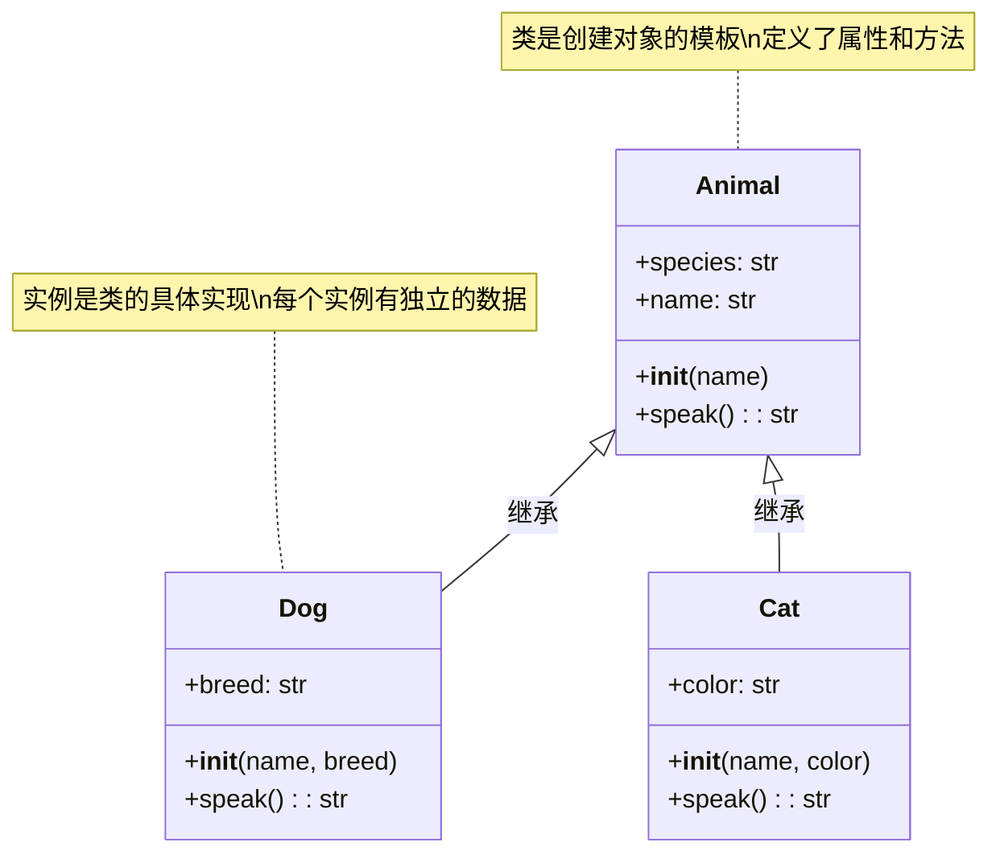
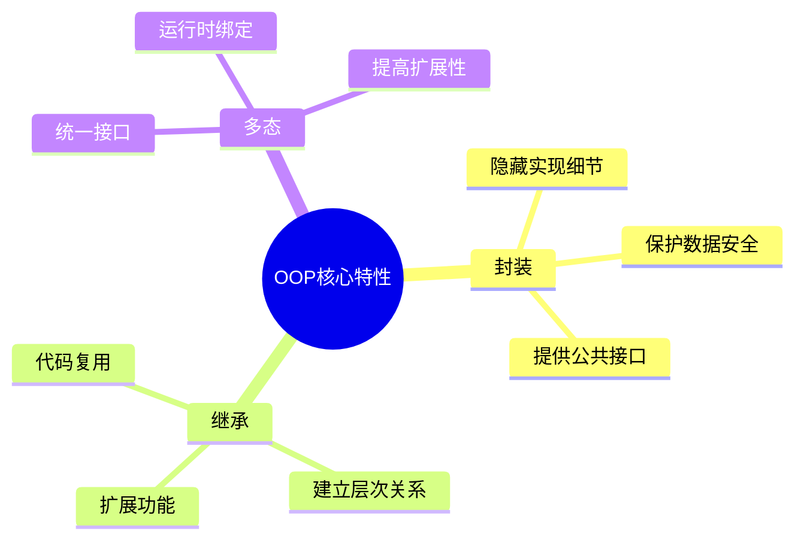
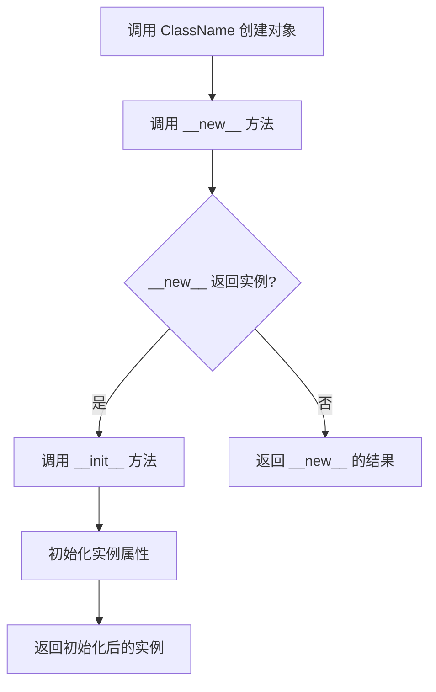
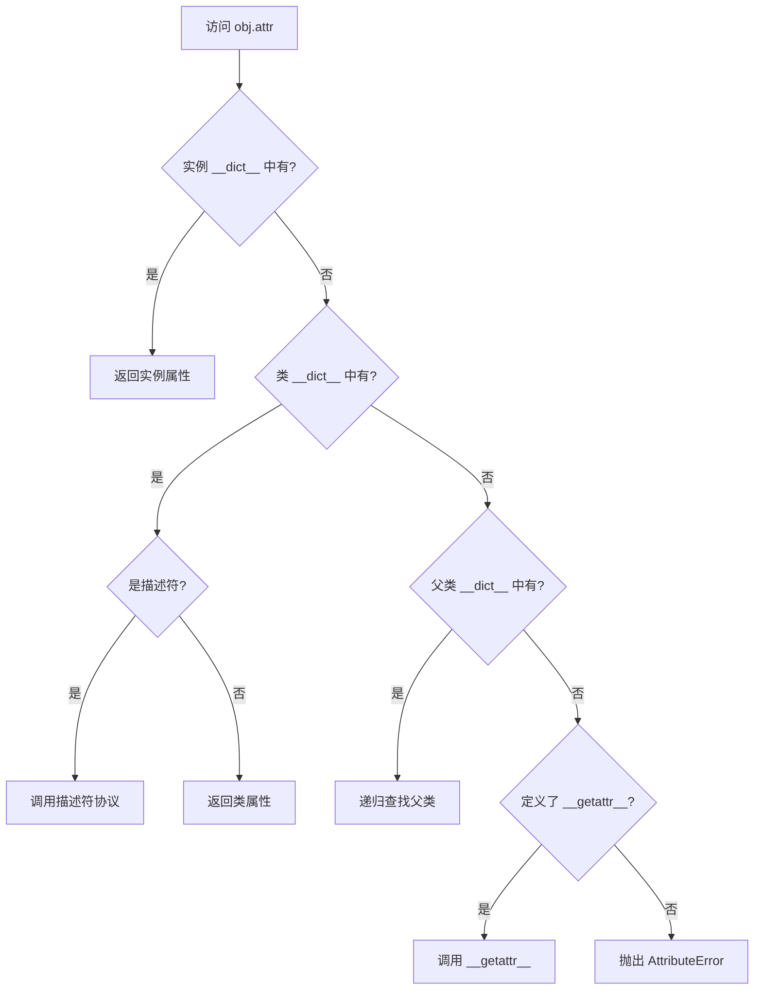
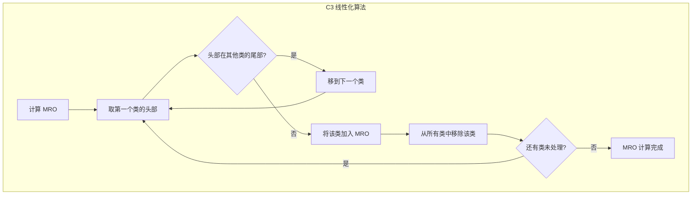
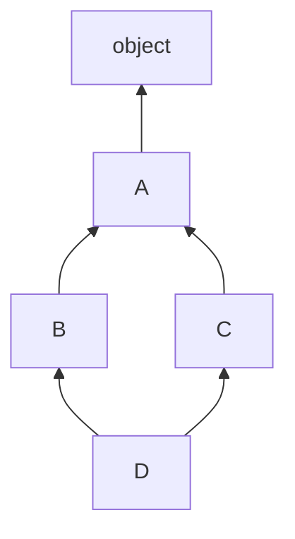
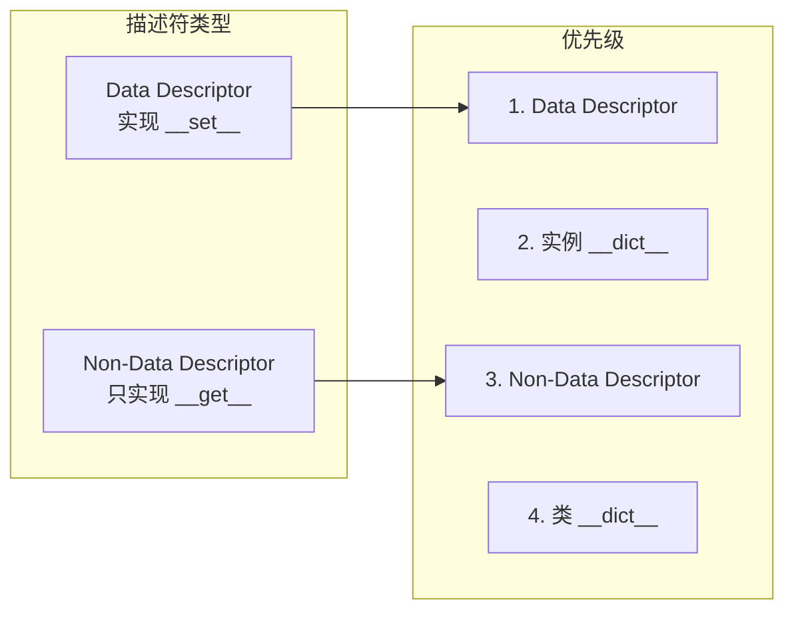
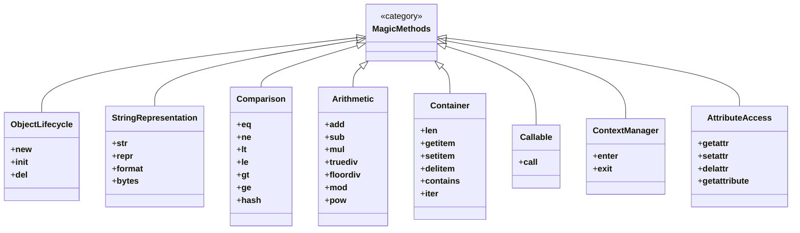

# 面向对象

Python 是一种支持面向对象编程（Object-Oriented Programming，简称 OOP）的高级编程语言。面向对象编程是一种编程范式，它使用"对象"来设计软件。Python 的面向对象编程具有封装、继承、多态等特性，使得代码更加模块化、可重用和易于维护。

::: tip 核心思想
面向对象编程的本质是**将数据与操作数据的方法绑定在一起**，通过封装隐藏实现细节，通过继承实现代码复用，通过多态实现接口统一。
:::

> 阅读提示
>
> - 建议按照"类与对象 → 核心特性 → 高级话题 → 案例演练"的顺序通读，快速建立知识体系
> - 文中的所有示例代码都可以直接复制运行，边读边实践能迅速巩固概念
> - 只想查阅某个概念时，可配合下方目录或使用搜索定位对应小节


## 快速导读

- **学习顺序建议**：类与对象 → 属性/方法 → 封装/继承/多态 → 特殊方法 → 高级话题（抽象类、描述符、元类等） → 案例演练
- **适用情景**：准备面试、温习基础、编写大型项目或阅读框架源码
- **记忆口诀**：`对象 = 数据 + 行为`、`封装保护数据`、`继承促复用`、`多态保扩展`
- **速查表**：

| 目标               | 快速定位                                       |
| ------------------ | ---------------------------------------------- |
| 写一个高质量类     | 参考 `属性和方法` + `封装`                     |
| 统一接口却保留差异 | 查看 `多态`、`abstractmethod`、`Protocol`      |
| 优化性能或内存     | 阅读 `__slots__`、`dataclasses`                |
| 调试/打印对象      | 查 `特殊方法` 一节，重点 `__repr__`、`__str__` |

---

## 第一部分：是什么 —— Python 的对象模型

### 一切皆对象

Python 的设计哲学之一是"一切皆对象"。这意味着：

- **数字、字符串、列表等基本数据类型都是对象**
- **函数是对象**
- **类本身也是对象**
- **模块也是对象**

```python
# 证明一切皆对象
def greet():
    """一个简单的函数"""
    return "Hello!"

# 函数是对象，可以赋值给变量
say_hello = greet
print(say_hello())  # 输出: Hello!

# 函数有属性
print(greet.__name__)    # 输出: greet
print(greet.__doc__)     # 输出: 一个简单的函数

# 类也是对象
class Person:
    pass

print(type(Person))      # 输出: <class 'type'>
print(isinstance(Person, type))  # 输出: True

# 甚至数字也是对象
print((10).bit_length())  # 输出: 4
print(type(10))           # 输出: <class 'int'>
```

### 类与实例的关系



**类（Class）** 是创建对象的蓝图或模板，定义了对象应该包含的属性和方法。

**实例（Instance）** 是根据类创建的具体对象，每个实例都有自己独立的数据副本。

```python
class Animal:
    """动物类 - 所有动物的基类"""
    species = "Animalia"  # 类属性：所有实例共享
    
    def __init__(self, name: str):
        """初始化方法：创建实例时自动调用"""
        self.name = name  # 实例属性：每个实例独有
    
    def speak(self) -> str:
        """实例方法：定义对象的行为"""
        return f"{self.name} makes a sound"

# 创建实例
dog = Animal("Buddy")
cat = Animal("Whiskers")

# 访问属性
print(dog.name)           # 输出: Buddy（实例属性）
print(dog.species)        # 输出: Animalia（类属性）
print(Animal.species)     # 输出: Animalia（通过类访问）

# 每个实例有独立的实例属性
print(dog.name)           # 输出: Buddy
print(cat.name)           # 输出: Whiskers
```

---

## 第二部分：为什么 —— 面向对象的优势

### 三大核心特性



#### 1. 封装（Encapsulation）

**是什么**：将数据（属性）和操作数据的方法绑定在一起，隐藏内部实现细节，只暴露必要的接口。

**为什么需要**：
- 保护数据不被意外修改
- 隐藏复杂的实现细节
- 提供清晰的使用接口
- 便于维护和重构

**怎么做**：使用私有属性和 `@property` 装饰器。

```python
class BankAccount:
    """银行账户类 - 演示封装"""
    
    def __init__(self, owner: str, initial_balance: float = 0):
        self.owner = owner
        self.__balance = initial_balance  # 私有属性：外部无法直接访问
    
    @property
    def balance(self) -> float:
        """只读属性：查询余额"""
        return self.__balance
    
    def deposit(self, amount: float) -> None:
        """存款：提供受控的修改接口"""
        if amount <= 0:
            raise ValueError("存款金额必须为正数")
        self.__balance += amount
        print(f"存入 {amount:.2f} 元，当前余额：{self.__balance:.2f} 元")
    
    def withdraw(self, amount: float) -> bool:
        """取款：提供受控的修改接口"""
        if amount <= 0:
            raise ValueError("取款金额必须为正数")
        if amount > self.__balance:
            print(f"余额不足！当前余额：{self.__balance:.2f} 元")
            return False
        self.__balance -= amount
        print(f"取出 {amount:.2f} 元，当前余额：{self.__balance:.2f} 元")
        return True

# 使用示例
account = BankAccount("张三", 1000)
print(account.balance)    # 输出: 1000.0（通过属性访问）
account.deposit(500)      # 存入 500.00 元，当前余额：1500.00 元
account.withdraw(200)     # 取出 200.00 元，当前余额：1300.00 元

# 无法直接修改余额
# account.__balance = 9999  # 这实际上创建了一个新属性，不影响私有属性
# account.balance = 9999    # AttributeError: can't set attribute
```

#### 2. 继承（Inheritance）

**是什么**：允许一个类（子类）继承另一个类（父类）的属性和方法，实现代码复用。

**为什么需要**：
- 避免代码重复
- 建立类之间的层次关系
- 便于扩展新功能
- 实现多态的基础

**怎么做**：在类定义时指定父类。

```python
class Animal:
    """动物基类"""
    
    def __init__(self, name: str):
        self.name = name
    
    def speak(self) -> str:
        return f"{self.name} makes a sound"
    
    def move(self) -> str:
        return f"{self.name} moves"

class Dog(Animal):
    """狗类 - 继承自 Animal"""
    
    def __init__(self, name: str, breed: str):
        super().__init__(name)  # 调用父类的初始化方法
        self.breed = breed
    
    def speak(self) -> str:
        """重写父类方法"""
        return f"{self.name} says Woof!"
    
    def fetch(self) -> str:
        """新增方法"""
        return f"{self.name} fetches the ball"

class Cat(Animal):
    """猫类 - 继承自 Animal"""
    
    def speak(self) -> str:
        return f"{self.name} says Meow!"

# 使用示例
dog = Dog("Buddy", "Golden Retriever")
cat = Cat("Whiskers")

print(dog.speak())   # 输出: Buddy says Woof!（调用重写的方法）
print(cat.speak())   # 输出: Whiskers says Meow!
print(dog.move())    # 输出: Buddy moves（继承自父类）
print(dog.fetch())   # 输出: Buddy fetches the ball（新增方法）
```

#### 3. 多态（Polymorphism）

**是什么**：不同的对象对同一消息（方法调用）作出不同的响应。

**为什么需要**：
- 提供统一的接口
- 增强代码的灵活性
- 便于扩展新类型
- 降低代码耦合度

**怎么做**：通过方法重写和鸭子类型实现。

```python
import math

class Shape:
    """形状基类"""
    
    def area(self) -> float:
        raise NotImplementedError("子类必须实现 area 方法")
    
    def perimeter(self) -> float:
        raise NotImplementedError("子类必须实现 perimeter 方法")

class Circle(Shape):
    """圆形"""
    
    def __init__(self, radius: float):
        self.radius = radius
    
    def area(self) -> float:
        return math.pi * self.radius ** 2
    
    def perimeter(self) -> float:
        return 2 * math.pi * self.radius

class Rectangle(Shape):
    """矩形"""
    
    def __init__(self, width: float, height: float):
        self.width = width
        self.height = height
    
    def area(self) -> float:
        return self.width * self.height
    
    def perimeter(self) -> float:
        return 2 * (self.width + self.height)

# 多态：统一接口处理不同类型的对象
def print_shape_info(shape: Shape) -> None:
    """打印形状信息 - 不关心具体是什么形状"""
    print(f"面积: {shape.area():.2f}")
    print(f"周长: {shape.perimeter():.2f}")

# 创建不同形状
shapes = [Circle(5), Rectangle(4, 6), Circle(3)]

for shape in shapes:
    print(f"\n{shape.__class__.__name__}:")
    print_shape_info(shape)

# 输出:
# Circle:
# 面积: 78.54
# 周长: 31.42
#
# Rectangle:
# 面积: 24.00
# 周长: 20.00
#
# Circle:
# 面积: 28.27
# 周长: 18.85
```

---

## 第三部分：怎么做 —— 深入实现细节

### 对象创建流程：`__new__` 与 `__init__`



**`__new__`**：类方法，负责**创建**实例对象（分配内存）。

**`__init__`**：实例方法，负责**初始化**实例对象（设置属性）。

```python
class Person:
    """演示 __new__ 和 __init__ 的区别"""
    
    def __new__(cls, name: str, age: int):
        """创建实例：分配内存空间"""
        print(f"1. __new__ 被调用，创建 {cls.__name__} 的实例")
        instance = super().__new__(cls)  # 调用父类的 __new__ 创建实例
        print(f"2. 实例已创建: {instance}")
        return instance  # 必须返回实例，否则 __init__ 不会被调用
    
    def __init__(self, name: str, age: int):
        """初始化实例：设置属性"""
        print(f"3. __init__ 被调用，初始化实例")
        self.name = name
        self.age = age
        print(f"4. 实例已初始化: name={self.name}, age={self.age}")

# 创建实例
person = Person("张三", 25)

# 输出:
# 1. __new__ 被调用，创建 Person 的实例
# 2. 实例已创建: <__main__.Person object at 0x...>
# 3. __init__ 被调用，初始化实例
# 4. 实例已初始化: name=张三, age=25
```

**实际应用：单例模式**

```python
class Singleton:
    """单例模式：确保一个类只有一个实例"""
    _instance = None
    
    def __new__(cls, *args, **kwargs):
        if cls._instance is None:
            print("创建新实例")
            cls._instance = super().__new__(cls)
        else:
            print("返回已有实例")
        return cls._instance

# 测试
s1 = Singleton()
s2 = Singleton()
print(s1 is s2)  # 输出: True（同一个实例）
```

### 属性查找链



```python
class Demo:
    """演示属性查找过程"""
    class_attr = "类属性"
    
    def __init__(self):
        self.instance_attr = "实例属性"
    
    def __getattr__(self, name):
        """当属性不存在时调用"""
        return f"属性 '{name}' 不存在"

obj = Demo()

# 1. 查找实例属性
print(obj.instance_attr)  # 输出: 实例属性

# 2. 查找类属性
print(obj.class_attr)     # 输出: 类属性

# 3. 属性不存在，调用 __getattr__
print(obj.unknown)        # 输出: 属性 'unknown' 不存在

# 查看属性存储位置
print(obj.__dict__)       # {'instance_attr': '实例属性'}
print(Demo.__dict__.keys())  # 包含 class_attr, __init__, __getattr__ 等
```

### MRO（方法解析顺序）

当使用多继承时，Python 需要确定方法调用的顺序，这就是 **MRO（Method Resolution Order）**。



**菱形继承问题**



```python
class A:
    def method(self):
        print("A.method")

class B(A):
    def method(self):
        print("B.method")
        super().method()

class C(A):
    def method(self):
        print("C.method")
        super().method()

class D(B, C):
    def method(self):
        print("D.method")
        super().method()

# 查看 MRO
print(D.mro())
# 输出: [<class 'D'>, <class 'B'>, <class 'C'>, <class 'A'>, <class 'object'>]

# 调用方法
d = D()
d.method()

# 输出:
# D.method
# B.method
# C.method
# A.method
```

**MRO 规则**：
1. 子类总是排在父类前面
2. 多个父类按定义顺序排列
3. 任何类在 MRO 中只出现一次
4. 使用 C3 线性化算法保证一致性

### 描述符协议

描述符是实现了 `__get__`、`__set__` 或 `__delete__` 方法的类，用于控制属性访问。



```python
class ValidatedAttribute:
    """验证描述符：确保属性值满足条件"""
    
    def __init__(self, name: str, validator: callable):
        self.name = name
        self.validator = validator
        self.private_name = f"_{name}"
    
    def __get__(self, instance, owner):
        """获取属性值"""
        if instance is None:
            return self  # 通过类访问时返回描述符本身
        return getattr(instance, self.private_name, None)
    
    def __set__(self, instance, value):
        """设置属性值：先验证再存储"""
        if not self.validator(value):
            raise ValueError(f"无效的 {self.name}: {value}")
        setattr(instance, self.private_name, value)
    
    def __delete__(self, instance):
        """删除属性"""
        delattr(instance, self.private_name)

class Person:
    """使用描述符验证属性"""
    
    # 定义描述符
    age = ValidatedAttribute("age", lambda x: isinstance(x, int) and x >= 0)
    name = ValidatedAttribute("name", lambda x: isinstance(x, str) and len(x) > 0)
    
    def __init__(self, name: str, age: int):
        self.name = name
        self.age = age

# 使用示例
person = Person("张三", 25)
print(person.name)  # 输出: 张三
print(person.age)   # 输出: 25

# 无效值会抛出异常
# person.age = -5  # ValueError: 无效的 age: -5
# person.name = ""  # ValueError: 无效的 name: 
```

**描述符的应用**：`@property`、`@classmethod`、`@staticmethod` 都是基于描述符实现的。

```python
# @property 的等价实现
class Property:
    """简化版的 property 描述符"""
    
    def __init__(self, getter):
        self.getter = getter
        self.setter = None
    
    def __get__(self, instance, owner):
        if instance is None:
            return self
        return self.getter(instance)
    
    def __set__(self, instance, value):
        if self.setter is None:
            raise AttributeError("can't set attribute")
        self.setter(instance, value)
    
    def setter(self, setter):
        """装饰器：设置 setter 方法"""
        self.setter = setter
        return self

class Circle:
    """使用自定义 Property"""
    
    def __init__(self, radius: float):
        self._radius = radius
    
    @Property
    def radius(self):
        return self._radius
    
    @radius.setter
    def radius(self, value: float):
        if value <= 0:
            raise ValueError("半径必须为正数")
        self._radius = value

# 使用
circle = Circle(5)
print(circle.radius)  # 输出: 5
circle.radius = 10
print(circle.radius)  # 输出: 10
```

---

## 第四部分：属性和方法详解

### 实例属性 vs 类属性

```python
class Counter:
    """演示实例属性和类属性的区别"""
    
    total_count = 0  # 类属性：所有实例共享
    
    def __init__(self, name: str):
        self.name = name  # 实例属性：每个实例独有
        self.count = 0    # 实例属性
        Counter.total_count += 1  # 修改类属性
    
    def increment(self):
        self.count += 1

# 创建实例
c1 = Counter("计数器1")
c2 = Counter("计数器2")

# 实例属性独立
c1.increment()
c1.increment()
c2.increment()

print(c1.count)  # 输出: 2
print(c2.count)  # 输出: 1

# 类属性共享
print(Counter.total_count)  # 输出: 2（创建了2个实例）
```

::: danger 常见陷阱：可变类属性
类属性如果是可变对象（列表、字典等），所有实例会共享同一个对象！

```python
class BadExample:
    items = []  # 危险：所有实例共享同一个列表！

a = BadExample()
b = BadExample()

a.items.append(1)
print(b.items)  # 输出: [1]  # b 的 items 也被修改了！

# 正确做法：在 __init__ 中创建实例属性
class GoodExample:
    def __init__(self):
        self.items = []  # 每个实例有独立的列表

a = GoodExample()
b = GoodExample()
a.items.append(1)
print(b.items)  # 输出: []  # b 的 items 不受影响
```
:::

### 三种方法类型

```python
class MethodDemo:
    """演示三种方法类型"""
    
    class_attr = "类属性"
    
    def __init__(self, value: str):
        self.instance_attr = value
    
    def instance_method(self):
        """实例方法：可以访问实例和类"""
        print(f"实例属性: {self.instance_attr}")
        print(f"类属性: {self.class_attr}")
        return "实例方法被调用"
    
    @classmethod
    def class_method(cls):
        """类方法：只能访问类，不能访问实例"""
        print(f"类属性: {cls.class_attr}")
        # print(cls.instance_attr)  # AttributeError: 类方法无法访问实例属性
        return "类方法被调用"
    
    @staticmethod
    def static_method():
        """静态方法：既不能访问实例，也不能访问类"""
        # print(self.instance_attr)  # NameError
        # print(cls.class_attr)      # NameError
        return "静态方法被调用"

# 使用示例
obj = MethodDemo("实例值")

# 实例方法：通过实例调用，self 自动绑定
print(obj.instance_method())

# 类方法：可以通过类或实例调用，cls 自动绑定
print(MethodDemo.class_method())
print(obj.class_method())

# 静态方法：可以通过类或实例调用，无自动绑定
print(MethodDemo.static_method())
print(obj.static_method())
```

**方法类型对比表**：

| 特性 | 实例方法 | 类方法 | 静态方法 |
|------|----------|--------|----------|
| 第一个参数 | `self`（实例） | `cls`（类） | 无特殊参数 |
| 访问实例属性 | 是 | 否 | 否 |
| 访问类属性 | 是 | 是 | 否 |
| 通过类调用 | 否（需传实例） | 是 | 是 |
| 通过实例调用 | 是 | 是 | 是 |
| 典型用途 | 操作实例数据 | 工厂方法、修改类状态 | 工具函数 |

**类方法的典型应用：工厂方法**

```python
class Employee:
    """员工类：演示工厂方法"""
    
    def __init__(self, name: str, department: str, salary: float):
        self.name = name
        self.department = department
        self.salary = salary
    
    @classmethod
    def from_string(cls, emp_str: str):
        """从字符串创建员工"""
        name, department, salary = emp_str.split(',')
        return cls(name, department, float(salary))
    
    @classmethod
    def create_manager(cls, name: str):
        """创建经理"""
        return cls(name, "Management", 50000)

# 使用工厂方法
emp1 = Employee("张三", "Engineering", 30000)
emp2 = Employee.from_string("李四,Marketing,35000")
emp3 = Employee.create_manager("王五")

print(emp1.name, emp1.department)  # 输出: 张三 Engineering
print(emp2.name, emp2.department)  # 输出: 李四 Marketing
print(emp3.name, emp3.department)  # 输出: 王五 Management
```

---

## 第五部分：魔术方法大全

### 魔术方法分类体系



### 对象表示：`__str__` 和 `__repr__`

```python
class Point:
    """二维点：演示 __str__ 和 __repr__"""
    
    def __init__(self, x: float, y: float):
        self.x = x
        self.y = y
    
    def __str__(self):
        """用户友好的字符串表示"""
        return f"({self.x}, {self.y})"
    
    def __repr__(self):
        """开发者友好的字符串表示，可用于 eval() 重建对象"""
        return f"Point({self.x}, {self.y})"

p = Point(3, 4)

print(str(p))   # 输出: (3, 4)        # 用户友好
print(repr(p))  # 输出: Point(3, 4)   # 开发者友好

# __repr__ 可用于重建对象
p2 = eval(repr(p))
print(p2)       # 输出: (3, 4)
```

::: tip 最佳实践
- `__str__`：面向用户的描述，简洁易读
- `__repr__`：面向开发者的描述，应包含足够信息重建对象
- 如果只实现一个，优先实现 `__repr__`（`str()` 会回退到 `repr()`）
:::

### 比较运算：`__eq__`、`__lt__` 等

```python
from functools import total_ordering

@total_ordering  # 只需实现 __eq__ 和一个比较方法，自动生成其他
class Money:
    """货币类：演示比较运算"""
    
    def __init__(self, amount: float, currency: str = "CNY"):
        self.amount = amount
        self.currency = currency
    
    def __eq__(self, other):
        """等于比较"""
        if not isinstance(other, Money):
            return NotImplemented
        return self.amount == other.amount and self.currency == other.currency
    
    def __lt__(self, other):
        """小于比较"""
        if not isinstance(other, Money):
            return NotImplemented
        if self.currency != other.currency:
            raise ValueError("无法比较不同货币")
        return self.amount < other.amount
    
    def __hash__(self):
        """使对象可哈希，可用于集合和字典键"""
        return hash((self.amount, self.currency))
    
    def __repr__(self):
        return f"Money({self.amount}, '{self.currency}')"

# 使用示例
m1 = Money(100)
m2 = Money(100)
m3 = Money(200)

print(m1 == m2)  # 输出: True
print(m1 < m3)   # 输出: True
print(m1 <= m3)  # 输出: True（由 @total_ordering 自动生成）
print(m3 > m1)   # 输出: True

# 可哈希，可用于集合
money_set = {m1, m2, m3}
print(len(money_set))  # 输出: 2（m1 和 m2 相等）
```

### 算术运算：`__add__`、`__mul__` 等

```python
class Vector:
    """向量类：演示算术运算"""
    
    def __init__(self, *components):
        self.components = components
    
    def __add__(self, other):
        """向量加法"""
        if len(self.components) != len(other.components):
            raise ValueError("向量维度不匹配")
        return Vector(*[a + b for a, b in zip(self.components, other.components)])
    
    def __sub__(self, other):
        """向量减法"""
        if len(self.components) != len(other.components):
            raise ValueError("向量维度不匹配")
        return Vector(*[a - b for a, b in zip(self.components, other.components)])
    
    def __mul__(self, scalar):
        """向量与标量相乘"""
        if isinstance(scalar, (int, float)):
            return Vector(*[c * scalar for c in self.components])
        return NotImplemented
    
    def __rmul__(self, scalar):
        """标量与向量相乘（反向乘法）"""
        return self.__mul__(scalar)
    
    def __abs__(self):
        """向量长度"""
        return sum(c ** 2 for c in self.components) ** 0.5
    
    def __repr__(self):
        return f"Vector{self.components}"

# 使用示例
v1 = Vector(1, 2, 3)
v2 = Vector(4, 5, 6)

print(v1 + v2)      # 输出: Vector(5, 7, 9)
print(v2 - v1)      # 输出: Vector(3, 3, 3)
print(v1 * 2)       # 输出: Vector(2, 4, 6)
print(3 * v1)       # 输出: Vector(3, 6, 9)（使用 __rmul__）
print(abs(v1))      # 输出: 3.7416573867739413
```

### 容器协议：`__len__`、`__getitem__` 等

```python
class Deck:
    """扑克牌组：演示容器协议"""
    
    def __init__(self):
        suits = 'SHCD'
        ranks = 'A23456789TJQK'
        self.cards = [s + r for s in suits for r in ranks]
    
    def __len__(self):
        """返回牌组数量"""
        return len(self.cards)
    
    def __getitem__(self, index):
        """支持索引和切片"""
        return self.cards[index]
    
    def __contains__(self, card):
        """支持 in 运算符"""
        return card in self.cards
    
    def __iter__(self):
        """支持迭代"""
        return iter(self.cards)

# 使用示例
deck = Deck()

print(len(deck))           # 输出: 52
print(deck[0])             # 输出: SA
print(deck[-1])            # 输出: DK
print(deck[:5])            # 输出: ['SA', 'S2', 'S3', 'S4', 'S5']
print('SA' in deck)        # 输出: True

# 迭代
for card in deck[:5]:
    print(card, end=' ')   # 输出: SA S2 S3 S4 S5
```

### 可调用对象：`__call__`

```python
class Multiplier:
    """乘法器：演示 __call__"""
    
    def __init__(self, factor: float):
        self.factor = factor
    
    def __call__(self, value: float) -> float:
        """使对象可以像函数一样调用"""
        return value * self.factor

# 使用示例
double = Multiplier(2)
triple = Multiplier(3)

print(double(5))   # 输出: 10
print(triple(5))   # 输出: 15

# 对象是可调用的
print(callable(double))  # 输出: True
```

### 上下文管理器：`__enter__` 和 `__exit__`

```python
class Timer:
    """计时器：演示上下文管理器"""
    
    import time
    
    def __enter__(self):
        """进入上下文时调用"""
        self.start = self.time.time()
        return self  # 返回值绑定到 as 变量
    
    def __exit__(self, exc_type, exc_val, exc_tb):
        """退出上下文时调用，即使发生异常也会执行"""
        self.end = self.time.time()
        self.elapsed = self.end - self.start
        print(f"耗时: {self.elapsed:.4f} 秒")
        # 返回 False 会传播异常，返回 True 会抑制异常
        return False
    
    @property
    def time(self):
        import time
        return time

# 使用示例
with Timer() as timer:
    # 模拟耗时操作
    sum(range(1000000))

# 输出: 耗时: 0.0xxx 秒
```

**使用 `contextlib` 简化**

```python
from contextlib import contextmanager

@contextmanager
def timer():
    """简化的上下文管理器"""
    import time
    start = time.time()
    yield  # yield 之前是 __enter__，之后是 __exit__
    end = time.time()
    print(f"耗时: {end - start:.4f} 秒")

# 使用
with timer():
    sum(range(1000000))
```

### 迭代器协议：`__iter__` 和 `__next__`

```python
class Fibonacci:
    """斐波那契数列迭代器"""
    
    def __init__(self, max_count: int):
        self.max_count = max_count
        self.count = 0
        self.a, self.b = 0, 1
    
    def __iter__(self):
        """返回迭代器对象"""
        return self
    
    def __next__(self):
        """返回下一个值"""
        if self.count >= self.max_count:
            raise StopIteration  # 迭代结束
        self.count += 1
        value = self.a
        self.a, self.b = self.b, self.a + self.b
        return value

# 使用示例
for num in Fibonacci(10):
    print(num, end=' ')  # 输出: 0 1 1 2 3 5 8 13 21 34

# 手动迭代
fib = Fibonacci(5)
print(next(fib))  # 输出: 0
print(next(fib))  # 输出: 1
print(next(fib))  # 输出: 1
print(next(fib))  # 输出: 2
print(next(fib))  # 输出: 3
# print(next(fib))  # StopIteration
```

---

## 第六部分：高级特性

### `__slots__` 内存优化

```python
import sys
from dataclasses import dataclass

# 普通类
class PointNormal:
    def __init__(self, x: float, y: float):
        self.x = x
        self.y = y

# 使用 __slots__
class PointSlots:
    __slots__ = ('x', 'y')  # 固定属性列表
    
    def __init__(self, x: float, y: float):
        self.x = x
        self.y = y

# 内存对比
p1 = PointNormal(1, 2)
p2 = PointSlots(1, 2)

print(f"普通类实例大小: {sys.getsizeof(p1) + sys.getsizeof(p1.__dict__)} 字节")
print(f"__slots__ 实例大小: {sys.getsizeof(p2)} 字节")

# 典型输出:
# 普通类实例大小: 152 字节
# __slots__ 实例大小: 48 字节
```

::: warning `__slots__` 的限制
1. **无法动态添加新属性**（除非在 `__slots__` 中声明）
2. **子类需要重新定义 `__slots__`** 才能继承优化效果
3. **影响某些特殊方法**（如 `__weakref__` 需要显式添加）
:::

```python
class Base:
    __slots__ = ('x',)

class Derived(Base):
    # 如果不定义 __slots__，子类会有 __dict__
    __slots__ = ('y',)  # 继承父类的 x，添加 y
    
    def __init__(self, x, y):
        self.x = x
        self.y = y

d = Derived(1, 2)
# d.z = 3  # AttributeError: 'Derived' object has no attribute 'z'
```

### 数据类 `dataclass`

```python
from dataclasses import dataclass, field, asdict, astuple
from typing import List
from datetime import datetime

@dataclass
class Product:
    """产品数据类"""
    
    name: str                           # 必填字段
    price: float                        # 必填字段
    quantity: int = 1                   # 默认值
    tags: List[str] = field(default_factory=list)  # 可变默认值
    created_at: datetime = field(default_factory=datetime.now)  # 工厂函数
    
    def total_price(self) -> float:
        """计算总价"""
        return self.price * self.quantity

# 创建实例
p1 = Product("笔记本电脑", 5999.0)
p2 = Product("鼠标", 99.0, quantity=5, tags=["电子", "外设"])

print(p1)  # 自动生成 __repr__
# 输出: Product(name='笔记本电脑', price=5999.0, quantity=1, tags=[], created_at=...)

print(p1 == Product("笔记本电脑", 5999.0))  # 自动生成 __eq__，输出: True

# 转换为字典或元组
print(asdict(p2))  # {'name': '鼠标', 'price': 99.0, ...}
print(astuple(p2))  # ('鼠标', 99.0, 5, ['电子', '外设'], ...)
```

**`dataclass` 参数详解**

```python
@dataclass(
    init=True,       # 自动生成 __init__
    repr=True,       # 自动生成 __repr__
    eq=True,         # 自动生成 __eq__
    order=False,     # 自动生成 __lt__, __le__, __gt__, __ge__
    unsafe_hash=False,  # 自动生成 __hash__
    frozen=False,    # 实例不可变
    slots=False,     # 使用 __slots__（Python 3.10+）
    kw_only=False,   # 强制使用关键字参数（Python 3.10+）
)
class Config:
    value: int

# 不可变数据类
@dataclass(frozen=True)
class Point:
    x: float
    y: float

p = Point(1, 2)
# p.x = 3  # FrozenInstanceError: cannot assign to field 'x'

# 可排序数据类
@dataclass(order=True)
class Student:
    grade: int
    name: str

students = [Student(85, "张三"), Student(90, "李四"), Student(85, "王五")]
print(sorted(students))  # 按成绩排序
```

### 抽象基类（ABC）

```python
from abc import ABC, abstractmethod
from typing import List

class DataSource(ABC):
    """数据源抽象基类"""
    
    @abstractmethod
    def connect(self) -> bool:
        """连接数据源"""
        pass
    
    @abstractmethod
    def fetch(self, query: str) -> List[dict]:
        """获取数据"""
        pass
    
    @abstractmethod
    def close(self) -> None:
        """关闭连接"""
        pass
    
    # 非抽象方法：子类继承
    def execute(self, query: str) -> List[dict]:
        """执行查询的模板方法"""
        if not self.connect():
            raise ConnectionError("连接失败")
        try:
            return self.fetch(query)
        finally:
            self.close()

class MySQLSource(DataSource):
    """MySQL 数据源实现"""
    
    def connect(self) -> bool:
        print("连接 MySQL...")
        return True
    
    def fetch(self, query: str) -> List[dict]:
        print(f"执行查询: {query}")
        return [{"id": 1, "name": "张三"}]
    
    def close(self) -> None:
        print("关闭 MySQL 连接")

# 使用
mysql = MySQLSource()
data = mysql.execute("SELECT * FROM users")
# 输出:
# 连接 MySQL...
# 执行查询: SELECT * FROM users
# 关闭 MySQL 连接

# 不能实例化抽象类
# ds = DataSource()  # TypeError: Can't instantiate abstract class DataSource
```

**抽象属性**

```python
from abc import ABC, abstractmethod

class Shape(ABC):
    """形状抽象基类"""
    
    @property
    @abstractmethod
    def area(self) -> float:
        """面积：抽象属性"""
        pass
    
    @property
    @abstractmethod
    def perimeter(self) -> float:
        """周长：抽象属性"""
        pass

class Circle(Shape):
    """圆形"""
    
    def __init__(self, radius: float):
        self.radius = radius
    
    @property
    def area(self) -> float:
        import math
        return math.pi * self.radius ** 2
    
    @property
    def perimeter(self) -> float:
        import math
        return 2 * math.pi * self.radius

c = Circle(5)
print(c.area)       # 输出: 78.53981633974483
print(c.perimeter)  # 输出: 31.41592653589793
```

---

## 第七部分：最佳实践对比

### 实例方法 vs 类方法 vs 静态方法

| 场景 | 推荐方法类型 | 原因 |
|------|-------------|------|
| 操作实例数据 | 实例方法 | 需要访问 `self` |
| 工厂方法 | 类方法 | 需要返回 `cls()` 实例 |
| 修改类状态 | 类方法 | 需要访问 `cls` |
| 工具函数 | 静态方法 | 不需要访问实例或类 |
| 实现多态 | 实例方法 | 子类可重写 |

### 继承 vs 组合

```python
# 继承：is-a 关系
class Dog(Animal):
    """狗是一种动物"""
    pass

# 组合：has-a 关系
class Car:
    """汽车有引擎"""
    def __init__(self, engine: Engine):
        self.engine = engine  # 组合
```

| 特性 | 继承 | 组合 |
|------|------|------|
| 关系 | is-a（是一种） | has-a（有一个） |
| 耦合度 | 高（紧耦合） | 低（松耦合） |
| 灵活性 | 低（编译时确定） | 高（运行时可替换） |
| 代码复用 | 容易 | 需要委托 |
| 测试难度 | 较高 | 较低 |
| 适用场景 | 明确的层次关系 | 灵活的功能组合 |

::: tip 设计原则
**优先使用组合而非继承**。只有在确定存在"is-a"关系时才使用继承。
:::

### `@property` vs getter/setter 方法

```python
# 传统 getter/setter
class Temperature1:
    def __init__(self):
        self._celsius = 0
    
    def get_celsius(self):
        return self._celsius
    
    def set_celsius(self, value):
        if value < -273.15:
            raise ValueError("温度不能低于绝对零度")
        self._celsius = value

t1 = Temperature1()
t1.set_celsius(25)
print(t1.get_celsius())

# Python 风格：@property
class Temperature2:
    def __init__(self):
        self._celsius = 0
    
    @property
    def celsius(self):
        return self._celsius
    
    @celsius.setter
    def celsius(self, value):
        if value < -273.15:
            raise ValueError("温度不能低于绝对零度")
        self._celsius = value

t2 = Temperature2()
t2.celsius = 25  # 更自然的语法
print(t2.celsius)
```

| 特性 | getter/setter | @property |
|------|--------------|-----------|
| 语法 | `obj.get_x()`, `obj.set_x(v)` | `obj.x`, `obj.x = v` |
| 可读性 | 较差 | 好 |
| Python 风格 | 不推荐 | 推荐 |
| 计算属性 | 不支持 | 支持 |
| 只读属性 | 需要额外处理 | 只定义 getter |

### dataclass vs namedtuple vs 普通类

```python
from dataclasses import dataclass
from collections import namedtuple
from typing import NamedTuple

# namedtuple
Point1 = namedtuple('Point', ['x', 'y'])
p1 = Point1(1, 2)
# p1.x = 3  # 不可变

# typing.NamedTuple
class Point2(NamedTuple):
    x: float
    y: float

# dataclass
@dataclass
class Point3:
    x: float
    y: float

# 普通类
class Point4:
    def __init__(self, x: float, y: float):
        self.x = x
        self.y = y
    
    def __repr__(self):
        return f"Point4(x={self.x}, y={self.y})"
    
    def __eq__(self, other):
        return self.x == other.x and self.y == other.y
```

| 特性 | namedtuple | NamedTuple | dataclass | 普通类 |
|------|-----------|------------|-----------|--------|
| 不可变 | 是 | 是 | 可选 | 否 |
| 类型注解 | 否 | 是 | 是 | 是 |
| 默认值 | 否 | 是 | 是 | 是 |
| 方法定义 | 否 | 否 | 是 | 是 |
| 继承 | 有限 | 有限 | 是 | 是 |
| 内存效率 | 高 | 高 | 可选 slots | 低 |
| 样板代码 | 最少 | 少 | 少 | 多 |

### 多继承 vs Mixin

```python
# 多继承的问题
class A:
    def method(self):
        print("A")

class B(A):
    def method(self):
        print("B")
        super().method()

class C(A):
    def method(self):
        print("C")
        super().method()

class D(B, C):
    def method(self):
        print("D")
        super().method()

d = D()
d.method()  # D -> B -> C -> A（MRO 决定顺序）

# Mixin 模式：更好的多继承
class LogMixin:
    """日志混入类"""
    def log(self, message: str):
        print(f"[{self.__class__.__name__}] {message}")

class SerializableMixin:
    """序列化混入类"""
    def to_dict(self) -> dict:
        return self.__dict__.copy()

class User(LogMixin, SerializableMixin):
    """用户类：组合多个 Mixin"""
    def __init__(self, name: str, email: str):
        self.name = name
        self.email = email

user = User("张三", "zhangsan@example.com")
user.log("用户创建")      # 来自 LogMixin
print(user.to_dict())     # 来自 SerializableMixin
```

**Mixin 设计原则**：
1. Mixin 类不应该独立实例化
2. Mixin 类应该只提供方法，不存储状态
3. Mixin 类的方法应该调用 `super()` 以支持链式调用

---

## 第八部分：常见陷阱与 FAQ

### 陷阱 1：类属性被实例修改

```python
class Counter:
    count = 0  # 类属性
    
    def increment(self):
        self.count += 1  # 这会创建实例属性，而不是修改类属性！

c1 = Counter()
c2 = Counter()

c1.increment()
print(c1.count)      # 输出: 1（实例属性）
print(c2.count)      # 输出: 0（类属性）
print(Counter.count) # 输出: 0（类属性未被修改）

# 正确做法
class Counter2:
    count = 0
    
    def increment(self):
        Counter2.count += 1  # 通过类名修改类属性
```

### 陷阱 2：可变类属性共享

```python
class Bad:
    items = []  # 所有实例共享同一个列表！

a = Bad()
b = Bad()
a.items.append(1)
print(b.items)  # 输出: [1]  # b 也被影响！

# 正确做法
class Good:
    def __init__(self):
        self.items = []  # 每个实例独立的列表
```

### 陷阱 3：`__new__` vs `__init__` 混淆

```python
class Wrong:
    def __new__(cls):
        return "not an instance"  # 返回非实例
    
    def __init__(self):
        print("初始化")  # 不会被调用！

obj = Wrong()
print(obj)        # 输出: not an instance
print(type(obj))  # 输出: <class 'str'>，不是 Wrong 实例！
```

### 陷阱 4：多继承菱形问题

```python
class A:
    def __init__(self):
        print("A.__init__")

class B(A):
    def __init__(self):
        print("B.__init__")
        A.__init__(self)  # 直接调用，可能导致重复调用

class C(A):
    def __init__(self):
        print("C.__init__")
        A.__init__(self)

class D(B, C):
    def __init__(self):
        print("D.__init__")
        B.__init__(self)
        C.__init__(self)

d = D()
# 输出:
# D.__init__
# B.__init__
# A.__init__  # A 被调用了两次！
# C.__init__
# A.__init__  # A 又被调用了一次！

# 正确做法：使用 super()
class B2(A):
    def __init__(self):
        print("B2.__init__")
        super().__init__()

class C2(A):
    def __init__(self):
        print("C2.__init__")
        super().__init__()

class D2(B2, C2):
    def __init__(self):
        print("D2.__init__")
        super().__init__()

d2 = D2()
# 输出:
# D2.__init__
# B2.__init__
# C2.__init__
# A.__init__  # A 只被调用一次
```

### 陷阱 5：`__slots__` 的限制

```python
class Slotted:
    __slots__ = ('x', 'y')
    
    def __init__(self):
        self.x = 1
        self.y = 2

obj = Slotted()
# obj.z = 3  # AttributeError: 'Slotted' object has no attribute 'z'

# __dict__ 不存在
# print(obj.__dict__)  # AttributeError

# __weakref__ 默认不支持
# import weakref
# weakref.ref(obj)  # 需要在 __slots__ 中添加 '__weakref__'
```

### FAQ

**Q: `@property` 和描述符有什么关系？**

A: `@property` 本质上是一个描述符。它实现了 `__get__`、`__set__` 和 `__delete__` 方法，因此可以控制属性访问。

**Q: 什么时候使用 `__slots__`？**

A: 当需要创建大量实例（数万以上）且内存是瓶颈时。对于普通应用，`__slots__` 带来的复杂性往往不值得。

**Q: 如何选择 `dataclass` 和普通类？**

A: 如果类主要用于存储数据，使用 `dataclass`；如果类包含复杂的业务逻辑，使用普通类。

**Q: Python 有真正的私有属性吗？**

A: 没有。双下划线前缀只是触发名称重整（`__attr` 变为 `_ClassName__attr`），仍可通过重整后的名称访问。

---

## 第九部分：术语表

| 术语 | 英文 | 定义 |
|------|------|------|
| 类 | Class | 创建对象的蓝图或模板，定义了对象应该包含的属性和方法 |
| 实例 | Instance | 根据类创建的具体对象，每个实例都有自己独立的数据副本 |
| 继承 | Inheritance | 子类继承父类的属性和方法，实现代码复用 |
| 多态 | Polymorphism | 不同对象对同一方法调用作出不同响应的能力 |
| 封装 | Encapsulation | 将数据和方法绑定在一起，隐藏内部实现细节 |
| MRO | Method Resolution Order | 方法解析顺序，多继承时确定方法调用顺序的规则 |
| 描述符 | Descriptor | 实现了 `__get__`、`__set__` 或 `__delete__` 方法的类 |
| 元类 | Metaclass | 创建类的类，默认为 `type` |
| 魔术方法 | Magic Method | 以双下划线开头和结尾的特殊方法，如 `__init__` |
| 数据类 | Data Class | 使用 `@dataclass` 装饰的类，自动生成常用方法 |
| 抽象基类 | Abstract Base Class | 不能实例化的类，用于定义子类必须实现的接口 |
| Mixin | Mixin | 一种设计模式，通过多继承为类添加可选功能 |
| 鸭子类型 | Duck Typing | 不关心对象类型，只关心对象是否有所需的方法 |

---

## 延伸阅读

- [函数](13-函数) - 理解 Python 函数是深入学习 OOP 的基础
- [异常处理](15-异常处理) - 在类方法中正确处理异常
- [类型注解](../03-工程化与运维/01-工程化/02-类型注解) - 为类和方法添加类型提示

---

## 自查与练习任务

- **建模练习**：为"在线课程平台"编写 `Course`、`Teacher`、`Student` 三个类，要求同时演示继承与组合。
- **协议实现**：定义 `Renderable` 协议，任何实现 `render(self) -> str` 的对象都可加入渲染列表，并用 `mypy` 校验。
- **重构脚本**：将一个功能脚本改造成类，并添加 `__repr__`、`__len__` 或 `__iter__` 等魔术方法以提升可调试性。
- **面试速答**：用一句话分别解释封装/继承/多态，阐述 `super()` 的解析顺序，以及组合优于继承的案例。
- **性能实验**：比较普通类、`__slots__` 类与 `dataclass(slots=True)` 在创建百万实例时的内存/速度差异，可配合 `tracemalloc`。

完成后，将结论追加到本笔记或单独文档中，积累"个人 OOP 速查手册"。

---

## 案例演练

::: code-group

```python [描述数字时钟]
from time import sleep

class Clock:
    """数字时钟类"""
    
    def __init__(self, hour: int = 0, minute: int = 0, second: int = 0):
        self._hour = hour
        self._minute = minute
        self._second = second
    
    def run(self) -> None:
        """时钟走动一秒"""
        self._second += 1
        if self._second == 60:
            self._second = 0
            self._minute += 1
            if self._minute == 60:
                self._minute = 0
                self._hour += 1
                if self._hour == 24:
                    self._hour = 0
    
    def show(self) -> str:
        """显示当前时间"""
        return f"{self._hour:02d}:{self._minute:02d}:{self._second:02d}"
    
    def __str__(self) -> str:
        return self.show()

def main():
    clock = Clock(23, 59, 58)
    while True:
        print(clock.show())
        sleep(1)
        clock.run()

if __name__ == '__main__':
    main()
```

```python [描述平面上的点]
from math import sqrt
from dataclasses import dataclass

@dataclass
class Point:
    """二维点类"""
    x: float
    y: float
    
    def move_to(self, x: float, y: float) -> None:
        """移动到指定位置"""
        self.x = x
        self.y = y
    
    def move_by(self, dx: float, dy: float) -> None:
        """移动指定增量"""
        self.x += dx
        self.y += dy
    
    def distance_to(self, other: 'Point') -> float:
        """计算与另一个点的距离"""
        return sqrt((self.x - other.x) ** 2 + (self.y - other.y) ** 2)
    
    def __add__(self, other: 'Point') -> 'Point':
        """向量加法"""
        return Point(self.x + other.x, self.y + other.y)
    
    def __sub__(self, other: 'Point') -> 'Point':
        """向量减法"""
        return Point(self.x - other.x, self.y - other.y)

def main():
    p1 = Point(3, 5)
    p2 = Point(0, 0)
    print(p1)                    # 输出: Point(x=3, y=5)
    print(p2)                    # 输出: Point(x=0, y=0)
    p2.move_by(-1, 2)
    print(p2)                    # 输出: Point(x=-1, y=2)
    print(p1.distance_to(p2))    # 输出: 5.0
    print(p1 + p2)               # 输出: Point(x=2, y=7)

if __name__ == '__main__':
    main()
```

```python [奥特曼打小怪兽]
from abc import ABC, abstractmethod
from random import randint, randrange

class Fighter(ABC):
    """战斗者抽象基类"""
    
    __slots__ = ('_name', '_hp')
    
    def __init__(self, name: str, hp: int):
        self._name = name
        self._hp = hp
    
    @property
    def name(self) -> str:
        return self._name
    
    @property
    def hp(self) -> int:
        return self._hp
    
    @hp.setter
    def hp(self, value: int):
        self._hp = max(0, value)
    
    @property
    def alive(self) -> bool:
        return self._hp > 0
    
    @abstractmethod
    def attack(self, other: 'Fighter') -> None:
        pass

class Ultraman(Fighter):
    """奥特曼"""
    
    __slots__ = ('_name', '_hp', '_mp')
    
    def __init__(self, name: str, hp: int, mp: int):
        super().__init__(name, hp)
        self._mp = mp
    
    def attack(self, other: Fighter) -> None:
        other.hp -= randint(15, 25)
    
    def huge_attack(self, other: Fighter) -> bool:
        """究极必杀技"""
        if self._mp >= 50:
            self._mp -= 50
            injury = max(other.hp * 3 // 4, 50)
            other.hp -= injury
            return True
        self.attack(other)
        return False
    
    def magic_attack(self, others: list) -> bool:
        """魔法攻击"""
        if self._mp >= 20:
            self._mp -= 20
            for enemy in others:
                if enemy.alive:
                    enemy.hp -= randint(10, 15)
            return True
        return False
    
    def resume(self) -> int:
        """恢复魔法值"""
        incr = randint(1, 10)
        self._mp += incr
        return incr
    
    def __str__(self) -> str:
        return f"~~~{self._name}奥特曼~~~\n生命值: {self._hp}\n魔法值: {self._mp}\n"

class Monster(Fighter):
    """小怪兽"""
    
    __slots__ = ('_name', '_hp')
    
    def attack(self, other: Fighter) -> None:
        other.hp -= randint(10, 20)
    
    def __str__(self) -> str:
        return f"~~~{self._name}小怪兽~~~\n生命值: {self._hp}\n"

def main():
    u = Ultraman('骆昊', 1000, 120)
    monsters = [Monster('狄仁杰', 250), Monster('白元芳', 500), Monster('王大锤', 750)]
    
    fight_round = 1
    while u.alive and any(m.alive for m in monsters):
        print(f'========第{fight_round:02d}回合========')
        m = next(m for m in monsters if m.alive)
        
        skill = randint(1, 10)
        if skill <= 6:
            print(f'{u.name}使用普通攻击打了{m.name}.')
            u.attack(m)
            print(f'{u.name}的魔法值恢复了{u.resume()}点.')
        elif skill <= 9:
            if u.magic_attack(monsters):
                print(f'{u.name}使用了魔法攻击.')
            else:
                print(f'{u.name}使用魔法失败.')
        else:
            if u.huge_attack(m):
                print(f'{u.name}使用究极必杀技虐了{m.name}.')
            else:
                print(f'{u.name}使用普通攻击打了{m.name}.')
                print(f'{u.name}的魔法值恢复了{u.resume()}点.')
        
        if m.alive:
            print(f'{m.name}回击了{u.name}.')
            m.attack(u)
        
        print(u)
        for monster in monsters:
            if monster.alive:
                print(monster, end='')
        
        fight_round += 1
    
    print('\n========战斗结束!========\n')
    print(f'{u.name}奥特曼胜利!' if u.alive else '小怪兽胜利!')

if __name__ == '__main__':
    main()
```

```python [扑克游戏]
import random
from dataclasses import dataclass

@dataclass(frozen=True)
class Card:
    """一张扑克牌"""
    suite: str
    face: int
    
    def __str__(self) -> str:
        face_map = {1: 'A', 11: 'J', 12: 'Q', 13: 'K'}
        face_str = face_map.get(self.face, str(self.face))
        return f"{self.suite}{face_str}"

class Poker:
    """一副扑克牌"""
    
    def __init__(self):
        self._cards = [Card(suite, face) 
                       for suite in 'SHCD' 
                       for face in range(1, 14)]
        self._current = 0
    
    def shuffle(self) -> None:
        """洗牌"""
        self._current = 0
        random.shuffle(self._cards)
    
    @property
    def next(self) -> Card:
        """发牌"""
        card = self._cards[self._current]
        self._current += 1
        return card
    
    @property
    def has_next(self) -> bool:
        """是否还有牌"""
        return self._current < len(self._cards)
    
    def __len__(self) -> int:
        return len(self._cards)
    
    def __iter__(self):
        return iter(self._cards)

class Player:
    """玩家"""
    
    def __init__(self, name: str):
        self._name = name
        self._cards = []
    
    @property
    def name(self) -> str:
        return self._name
    
    def get(self, card: Card) -> None:
        """摸牌"""
        self._cards.append(card)
    
    def arrange(self) -> None:
        """整理手牌"""
        self._cards.sort(key=lambda c: (c.suite, c.face))
    
    def __str__(self) -> str:
        return f"{self._name}: {self._cards}"

def main():
    poker = Poker()
    poker.shuffle()
    
    players = [Player('东邪'), Player('西毒'), Player('南帝'), Player('北丐')]
    
    for _ in range(13):
        for player in players:
            player.get(poker.next)
    
    for player in players:
        player.arrange()
        print(player)

if __name__ == '__main__':
    main()
```

```python [工资结算系统]
from abc import ABC, abstractmethod

class Employee(ABC):
    """员工抽象基类"""
    
    def __init__(self, name: str):
        self._name = name
    
    @property
    def name(self) -> str:
        return self._name
    
    @abstractmethod
    def get_salary(self) -> float:
        """获取月薪"""
        pass

class Manager(Employee):
    """部门经理：固定月薪"""
    
    def get_salary(self) -> float:
        return 15000.0

class Programmer(Employee):
    """程序员：按工时计算"""
    
    def __init__(self, name: str, working_hour: int = 0):
        super().__init__(name)
        self._working_hour = working_hour
    
    @property
    def working_hour(self) -> int:
        return self._working_hour
    
    @working_hour.setter
    def working_hour(self, value: int):
        self._working_hour = max(0, value)
    
    def get_salary(self) -> float:
        return 150.0 * self._working_hour

class Salesman(Employee):
    """销售员：底薪 + 提成"""
    
    def __init__(self, name: str, sales: float = 0):
        super().__init__(name)
        self._sales = sales
    
    @property
    def sales(self) -> float:
        return self._sales
    
    @sales.setter
    def sales(self, value: float):
        self._sales = max(0, value)
    
    def get_salary(self) -> float:
        return 1200.0 + self._sales * 0.05

def main():
    employees = [
        Manager('刘备'),
        Programmer('诸葛亮'),
        Manager('曹操'),
        Salesman('荀彧'),
        Salesman('吕布'),
        Programmer('张辽'),
        Programmer('赵云')
    ]
    
    for emp in employees:
        if isinstance(emp, Programmer):
            emp.working_hour = int(input(f'请输入{emp.name}本月工作时间: '))
        elif isinstance(emp, Salesman):
            emp.sales = float(input(f'请输入{emp.name}本月销售额: '))
        
        print(f'{emp.name}本月工资为: {emp.get_salary():.2f}元')

if __name__ == '__main__':
    main()
```

:::

## 版本差异（Python 3.8-3.12 → 3.14）

| 特性 | 本文编写时 | Python 3.14 |
|------|-----------|-------------|
| 类型注解求值 | 运行时立即求值 | PEP 649/749 延迟求值：注解不再在定义时执行，解决前向引用，提升启动性能 |
| 字符串模板 | 普通 f-string / `str.format` | PEP 750 模板字符串 `t"..."`：可插值且能被安全处理（3.14 新特性） |
| 标准库多解释器 | 无官方支持 | PEP 734：`concurrent.interpreters` 模块支持在同一进程创建多个子解释器 |
| 调试 | 仅 Python 内建 pdb / IDE 调试 | PEP 768：安全的 CPython 外部调试器接口（custom debugger protocol） |
| 字节码与运行时 | 3.12 前无 JIT | 3.13 引入实验性 JIT（PEP 744）；3.14 进一步改进 free-threaded（无 GIL）构建 |
| `datetime` API | `utcnow()` 常用 | 3.12 起弃用，官方要求改用 `datetime.now(tz=datetime.UTC)`（aware 对象） |
| 压缩算法 | zlib / gzip / bz2 / lzma | 3.14 新增标准库 Zstandard 支持（PEP 784） |

> 本文讲解的语法与数据结构原理在 3.14 中依然成立；新项目建议基于 Python 3.13/3.14，并优先使用 aware datetime、PEP 649 注解与最新类型语法。
