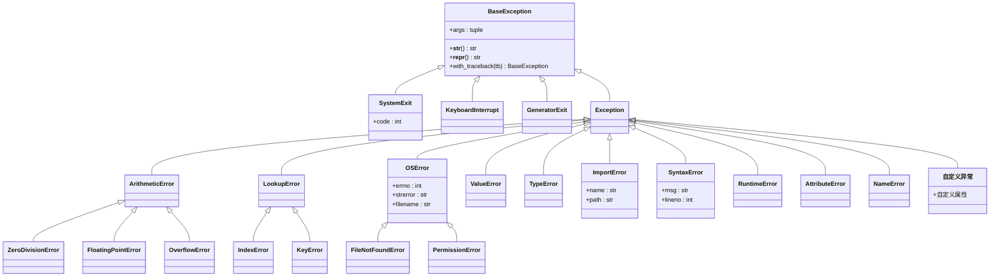
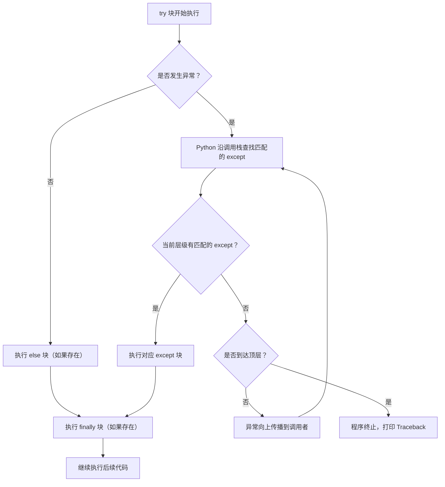
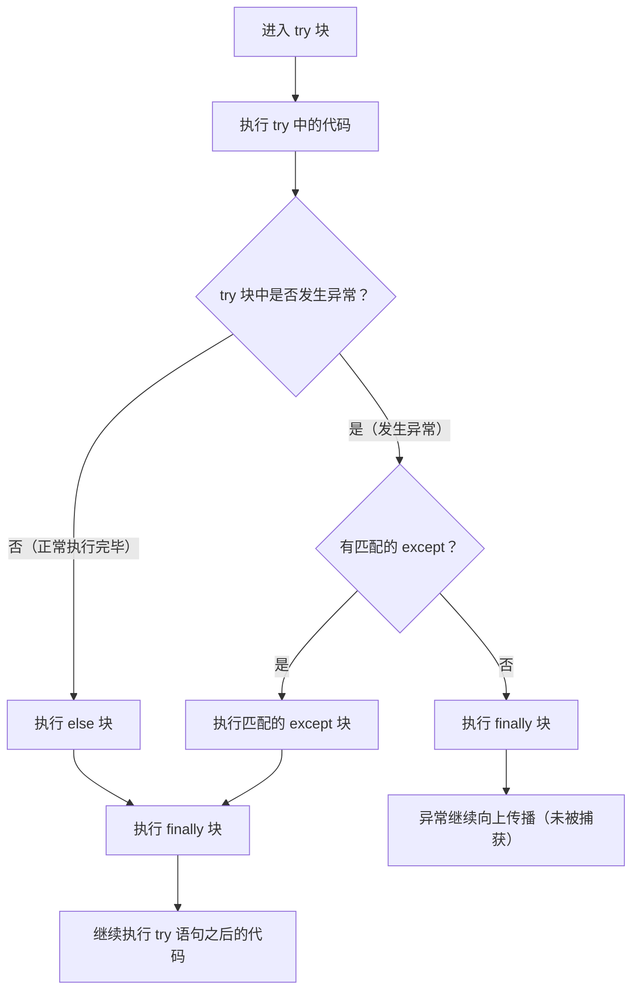
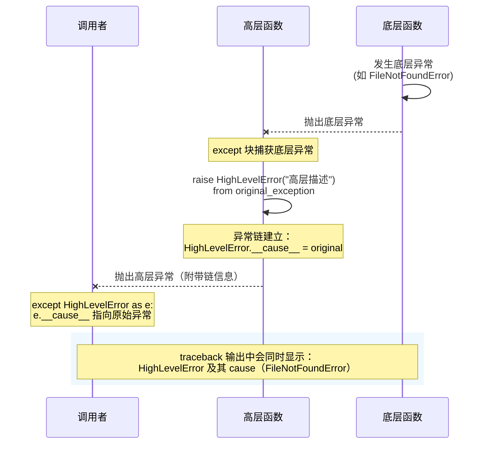

# 异常处理机制

在程序运行过程中，可能会遇到各种错误，如文件不存在、网络连接失败、除以零等。这些错误会导致程序中断执行，称为**异常**（Exception）。Python 提供了一套机制来捕捉和处理这些异常，以确保程序能够在出现错误时优雅地应对，而不是直接崩溃。

## 为什么 Python 使用异常而不是错误码？

在 C 等语言中，函数通常通过返回值来表示错误（如返回 `-1` 或 `NULL`），这种方式存在几个根本性问题：

1. **调用者容易忘记检查返回值**：编译器不会强制你检查返回值，遗漏检查的代码可以编译通过，却在运行时产生难以追踪的 bug
2. **返回值与正常结果混用**：函数的返回值既要表达"正常结果"，又要表达"出错了"，语义模糊，如 `int divide(int a, int b)` 返回 `-1` 是错误还是正常结果？
3. **错误处理代码与业务逻辑交织**：每一行调用都需要紧跟 `if (result == ERROR)` 的检查，代码膨胀且难以阅读
4. **错误无法自动传播**：内层函数的错误必须逐层手动传递到调用者，中间任何一层遗漏都会导致错误丢失

Python 的异常机制从根本上解决了这些问题：

- **异常无法被忽略**：未捕获的异常会立即中断程序并显示清晰的错误信息，而不是悄悄地产生错误结果
- **错误与正常结果分离**：正常返回值只表达业务结果，错误通过异常通道传递，语义清晰
- **异常自动传播**：异常会沿着调用栈自动向上传播，直到被某个 `except` 块捕获，中间层不需要逐层传递
- **强制显式处理**：`try-except` 语法让错误处理逻辑在代码结构上清晰可见

```python
# 错误码风格（C 语言思维方式）—— 容易遗漏检查
def divide_error_code(a, b):
    if b == 0:
        return None, "除数不能为零"   # 返回值混用了结果和错误
    return a / b, None

result, err = divide_error_code(10, 0)
# 如果忘记检查 err，直接使用 result 就会产生 NoneType 错误
# print(result + 1)  # TypeError: unsupported operand type(s) for +: 'NoneType' and 'int'

# 异常风格（Pythonic 方式）—— 错误无法被忽略
def divide_exception(a, b):
    if b == 0:
        raise ZeroDivisionError("除数不能为零")  # 错误通过异常通道传递
    return a / b

try:
    result = divide_exception(10, 0)   # 正常返回值只包含业务结果
    print(result + 1)                  # 只有成功时才会执行到这里
except ZeroDivisionError as e:
    print(f"错误：{e}")                 # 错误处理与业务逻辑清晰分离
```

## 异常的层次结构

Python 内置许多异常类，所有异常类都继承自基类 `BaseException`。常见的异常类包括：

- `BaseException`：所有异常的基类
  - `SystemExit`：解释器请求退出
  - `KeyboardInterrupt`：用户中断执行（通常是 Ctrl+C）
  - `GeneratorExit`：生成器被关闭
  - `Exception`：大多数内置异常的基类，不包括上述三种异常
    - `ArithmeticError`：算术错误的基类，如 `ZeroDivisionError`
    - `LookupError`：无效数据查询的基类，如 `IndexError`、 `KeyError`
    - `OSError`：操作系统相关的错误，如文件不存在、权限不足等
    - `ValueError`：操作数类型正确但值不合适
    - `TypeError`：操作数类型不合适
    - `ImportError`：导入模块失败
    - `SyntaxError`：语法错误
    - ... 以及更多特定的异常类型

### 类图：Python 异常体系



### 为什么异常层次结构很重要？

异常的继承关系不仅是组织代码的方式，更直接决定了 `except` 的匹配行为：

1. **`except` 会捕获该类及其所有子类**：`except Exception` 会捕获 `ValueError`、`KeyError` 等所有 `Exception` 的子类，因为子类 "是一个" 父类
2. **捕获顺序从上到下**：如果先写 `except Exception`，再写 `except ValueError`，后者永远不会被匹配到，因为 `ValueError` 已经被前者捕获
3. **自定义异常应继承最接近的基类**：如果你的错误是"配置找不到"，继承 `FileNotFoundError` 比直接继承 `Exception` 更合理——调用者可以用 `except OSError` 一并捕获
4. **`BaseException` 的三个直接子类不应被普通 `except Exception` 捕获**：`SystemExit`、`KeyboardInterrupt`、`GeneratorExit` 继承自 `BaseException` 而非 `Exception`，这是设计上的刻意区分——它们不是"程序错误"，而是"控制流信号"

```python
# 继承关系决定捕获行为
try:
    raise FileNotFoundError("配置文件不存在")
except OSError:           # FileNotFoundError 是 OSError 的子类，会被捕获
    print("被 OSError 捕获")

# 捕获顺序错误示例
try:
    raise ValueError("值错误")
except Exception:         # 先匹配，捕获了所有 Exception 子类
    print("被 Exception 捕获")
except ValueError:        # 永远不会执行！ValueError 已经被上面的 Exception 捕获
    print("永远不会到达这里")

# KeyboardInterrupt 不是 Exception 的子类
try:
    raise KeyboardInterrupt
except Exception:         # 不会捕获 KeyboardInterrupt！
    print("不会被捕获")
except BaseException:     # 需要 BaseException 才能捕获
    print("被 BaseException 捕获")
```

### 文本版异常树

下图展示了 Python 异常层次结构的一部分：

```text
BaseException
├── SystemExit
├── KeyboardInterrupt
├── GeneratorExit
└── Exception
    ├── ArithmeticError
    │   ├── ZeroDivisionError
    │   ├── FloatingPointError
    │   └── OverflowError
    ├── LookupError
    │   ├── IndexError
    │   └── KeyError
    ├── OSError
    │   ├── FileNotFoundError
    │   ├── PermissionError
    │   └── ... (其他 OSError 子类)
    ├── ValueError
    ├── TypeError
    ├── ImportError
    ├── SyntaxError
    │   └── IndentationError
    │       └── TabError
    └── ... (更多异常类)
```

## 捕获和处理异常

`Python` 使用 `try-except` 语句来捕捉和处理异常。基本语法如下：

```python
try:
    # 可能引发异常的代码块
    ...
except ExceptionType as e:
    # 处理特定类型的异常
    ...
except AnotherExceptionType as e:
    # 处理另一种类型的异常
    ...
else:
    # 如果没有异常发生，执行此代码块
    ...
finally:
    # 无论是否发生异常，都会执行此代码块
    ...
```

### 执行流程

1. `try` 块中的代码被首先执行。
2. 如果在 `try` 块中发生异常，Python 会查找匹配的 `except` 块。
3. 找到匹配的 `except` 块后，执行其中的代码。
4. 如果没有异常发生，执行 `else` 块（如果存在）。
5. 无论是否有异常，`finally` 块都会被执行（如果存在）。

注意：如果在 `try` 块中使用了 `return`、`break` 或 `continue`，`finally` 块仍然会被执行。

### 流程图：异常传播机制



### 流程图：try-except-else-finally 完整执行流程



### `try...except`：核心捕捉机制

`try...except` 是异常处理的基础。它允许你隔离可能出错的代码，并为特定类型的错误提供处理逻辑。

**示例：处理用户输入**

一个常见的场景是处理用户输入，用户可能提供无效的数据。下面的示例展示了如何处理 `ValueError`（输入无法转换为整数）和 `ZeroDivisionError`（除数为零）。

```python
try:
    num_str = input("请输入一个非零整数: ")
    num = int(num_str)
    result = 100 / num
except ValueError:
    print(f"输入无效: '{num_str}' 不是一个有效的整数。")
except ZeroDivisionError:
    print("错误：除数不能为零。")
```

#### 捕获多种异常

如果多种异常需要用相同的方式处理，可以将它们放在一个元组中，使代码更紧凑。

```python
try:
    # ... 同样的代码 ...
    num_str = input("请输入一个非零整数: ")
    num = int(num_str)
    result = 100 / num
except (ValueError, ZeroDivisionError) as e:
    print(f"发生了一个输入或计算错误: {e}")
```

#### 捕获多种异常的完整示例

```python
# 捕获多种异常的完整可运行示例
def safe_divide(a, b):
    """安全除法函数，演示多种异常捕获方式"""
    try:
        # 第一步：尝试将输入转换为浮点数
        x = float(a)                   # 可能抛出 ValueError
        y = float(b)                   # 可能抛出 ValueError

        # 第二步：执行除法运算
        result = x / y                 # 可能抛出 ZeroDivisionError

    except ValueError as e:
        # 捕获类型转换失败：输入不是有效数字
        print(f"[ValueError] 输入无效，无法转换为数字: {e}")

    except ZeroDivisionError as e:
        # 捕获除零错误：除数为 0
        print(f"[ZeroDivisionError] 除数不能为零: {e}")

    except (TypeError, NameError) as e:
        # 用元组同时捕获多种异常，统一处理
        print(f"[TypeError/NameError] 类型或名称错误: {e}")

    else:
        # 没有异常时执行：输出计算结果
        print(f"计算成功: {x} / {y} = {result}")

    finally:
        # 无论如何都会执行：收尾工作
        print("--- safe_divide 调用结束 ---\n")


# 测试各种情况
safe_divide(10, 3)          # 正常计算
safe_divide(10, 0)          # ZeroDivisionError
safe_divide("abc", 2)       # ValueError
safe_divide(10, "xyz")      # ValueError
```

#### 异常对象的属性

捕获异常后，异常对象本身携带了丰富的诊断信息：

```python
# 异常对象的三大属性：类型、值、回溯
import sys
import traceback

def demonstrate_exception_attributes():
    """演示异常对象的属性"""
    try:
        # 故意触发一个异常
        numbers = [1, 2, 3]
        print(numbers[10])              # IndexError: 索引超出范围

    except IndexError as e:
        # 属性 1：异常的类型 —— 即异常的类对象
        exc_type = type(e)              # <class 'IndexError'>
        print(f"异常类型: {exc_type.__name__}")        # IndexError

        # 属性 2：异常的值 —— 即异常实例本身，包含错误消息
        print(f"异常值（str）: {e}")                    # list index out of range
        print(f"异常值（repr）: {repr(e)}")            # IndexError('list index out of range')

        # 属性 3：异常的回溯对象 —— 记录了异常发生时的调用栈
        exc_tb = e.__traceback__        # traceback 对象
        print(f"回溯对象: {exc_tb}")

        # 使用 sys.exc_info() 获取三元组 (type, value, traceback)
        exc_info = sys.exc_info()
        print(f"sys.exc_info() 类型: {exc_info[0]}")   # <class 'IndexError'>
        print(f"sys.exc_info() 值:   {exc_info[1]}")   # IndexError 实例
        print(f"sys.exc_info() 回溯: {exc_info[2]}")   # traceback 对象

        # 使用 traceback 模块格式化完整的调用栈
        print("\n--- 完整回溯信息 ---")
        traceback.print_exc()           # 打印格式化的 traceback

        # 异常的 args 属性：传递给异常构造函数的参数元组
        print(f"\n异常参数 (args): {e.args}")          # ('list index out of range',)

demonstrate_exception_attributes()
```

#### 使用 `else` 子句分离成功逻辑

`else` 子句提供了一个清晰的方式来分离"成功"代码和"尝试"代码。只有当 `try` 块**没有**引发任何异常时，`else` 块才会执行。这提高了代码的可读性，因为它将核心业务逻辑与错误处理分离开来。

```python
try:
    num_str = input("请输入一个非零整数: ")
    num = int(num_str)
    result = 100 / num
except (ValueError, ZeroDivisionError) as e:
    print(f"错误: {e}")
else:
    # 仅在 try 块成功时执行
    print(f"计算成功！结果是: {result:.2f}")
```

这种结构 `try-except-else` 的逻辑流程是：

1.  **尝试** (`try`) 执行核心操作。
2.  如果失败，**捕获** (`except`) 并处理异常。
3.  如果成功，则 (`else`) 执行后续的成功逻辑。

#### try-except-else-finally 完整示例

```python
# try-except-else-finally 的完整可运行示例
def read_file_safely(filepath):
    """
    安全读取文件内容的完整示例
    演示 try-except-else-finally 的完整执行流程
    """
    file_handle = None                  # 初始化文件句柄，确保 finally 中可以安全引用

    try:
        # try 块：只放置"可能出错"的代码
        file_handle = open(filepath, 'r', encoding='utf-8')  # 可能抛出 FileNotFoundError
        content = file_handle.read()                          # 可能抛出 IOError

    except FileNotFoundError:
        # except 块：处理"文件不存在"的情况
        print(f"[except] 错误：文件 '{filepath}' 不存在")
        return None                     # 提前返回，但 finally 仍会执行

    except PermissionError:
        # except 块：处理"权限不足"的情况
        print(f"[except] 错误：没有权限读取 '{filepath}'")
        return None

    except UnicodeDecodeError as e:
        # except 块：处理"编码错误"的情况
        print(f"[except] 错误：文件编码无法解析 - {e}")
        return None

    else:
        # else 块：try 块没有任何异常时执行
        # 这里放"成功后"的逻辑，避免将成功逻辑混入 try 块
        print(f"[else] 文件读取成功，共 {len(content)} 个字符")
        return content                  # 提前返回，但 finally 仍会执行

    finally:
        # finally 块：无论是否异常、无论是否 return，都会执行
        # 用于释放资源，确保文件句柄被关闭
        if file_handle is not None:
            file_handle.close()
            print("[finally] 文件句柄已关闭")
        else:
            print("[finally] 无需关闭（文件未成功打开）")


# 测试：读取不存在的文件
print("=== 测试1：文件不存在 ===")
result1 = read_file_safely("nonexistent_file.txt")

# 测试：读取存在的文件（请先创建一个测试文件）
# print("\n=== 测试2：文件存在 ===")
# with open("test_file.txt", "w", encoding="utf-8") as f:
#     f.write("Hello, Python 异常处理！")
# result2 = read_file_safely("test_file.txt")
```

### finally 块

`finally` 块中的代码无论是否发生异常都会执行，常用于释放资源，如关闭文件、断开网络连接等。**示例：**

#### 确保资源被释放：`finally` 与 `with`

`finally` 块确保无论是否发生异常，某些代码（通常是资源清理代码）都将被执行。这在处理文件、网络连接或数据库会话等需要显式关闭的资源时至关重要。

**传统方式：使用 `try...finally`**

一个典型的文件读取示例如下：

```python
file = None
try:
    file = open("non_existent_file.txt", "r", encoding="utf-8")
    content = file.read()
    print(content)
except FileNotFoundError:
    print("错误：文件未找到。")
except Exception as e:
    print(f"发生未知错误: {e}")
finally:
    if file:
        file.close()
        print("文件已关闭，资源已释放。")
```

这种模式虽然可行，但存在一些问题：

- **代码冗余**：需要手动检查 `file` 对象是否存在。
- **容易出错**：忘记关闭资源或在 `finally` 块中引入新的错误。

**最佳实践：使用 `with` 语句（上下文管理器）**

为了解决这些问题，Python 引入了 `with` 语句，它利用**上下文管理器协议**自动管理资源的生命周期（获取和释放）。任何支持该协议的对象（实现了 `__enter__` 和 `__exit__` 方法）都可以与 `with` 一起使用。

上面的示例可以被重构为更简洁、更安全的形式：

```python
try:
    with open("non_existent_file.txt", "r", encoding="utf-8") as file:
        content = file.read()
        print(content)
except FileNotFoundError:
    print("错误：文件未找到。")
except Exception as e:
    print(f"发生未知错误: {e}")

# 当代码块执行完毕或发生异常跳出时，文件会自动关闭，无需手动调用 file.close()
```

`with` 语句的优势：

- **代码简洁**：无需编写 `finally` 块来关闭资源。
- **安全性高**：无论代码块是正常结束、发生异常还是通过 `return` 语句退出，资源都会被自动、可靠地释放。
- **可读性强**：清晰地标示了资源使用的范围。

因此，在处理文件、锁、数据库连接等资源时，**强烈推荐使用 `with` 语句**。

### 捕捉所有异常

可以使用 `except` 不指定异常类型来捕捉所有异常，但这通常不推荐，因为可能会掩盖潜在的问题。**示例：**

```python
try:
    result = 10 / 0
except:
    print("发生了错误。")
```

**推荐做法：** 尽量明确捕捉特定的异常类型，以便针对性地处理

## 异常传播机制：栈回溯

### 异常是如何传播的？

当异常发生时，Python 的运行时会执行**栈回溯**（Stack Unwinding）：

1. **当前帧停止执行**：异常发生的那一行代码之后的语句不再执行
2. **查找当前帧的 except**：Python 检查当前函数是否有匹配的 `except` 子句
3. **逐帧回溯**：如果没有匹配的 `except`，Python 销毁当前栈帧（释放局部变量），回到调用者帧，重复步骤 2
4. **到达顶层**：如果回溯到模块顶层仍未被捕获，Python 终止程序并打印完整的 traceback

这个过程就像一层一层"剥开"调用栈，因此称为"栈回溯"。traceback 信息正是从最内层（异常发生处）到最外层（程序入口）的栈帧记录。

```python
# 栈回溯过程的可视化演示
def inner():
    """最内层函数：异常在这里发生"""
    x = 10                             # 局部变量 x，栈回溯时会被销毁
    y = 0                              # 局部变量 y
    return x / y                       # ZeroDivisionError 在这里发生！

def middle():
    """中间层函数：调用 inner，没有捕获异常"""
    result = inner()                   # 异常从 inner 传播到这里
    print("这行不会执行")               # 因为异常已经传播，此行被跳过
    return result

def outer():
    """最外层函数：调用 middle，捕获异常"""
    try:
        middle()                       # 异常从 middle 传播到这里
        print("这行也不会执行")          # 因为异常已经传播，此行被跳过
    except ZeroDivisionError as e:
        # 异常在这里被捕获，栈回溯停止
        print(f"在 outer 中捕获异常: {e}")
        print("inner 中的局部变量 x、y 已经随着栈帧销毁而不可访问")

outer()
# 输出：
# 在 outer 中捕获异常: division by zero
# inner 中的局部变量 x、y 已经随着栈帧销毁而不可访问
```

### 异常的传播与嵌套处理

当一个函数中发生异常且未被捕捉时，异常会向上传播到调用该函数的函数，直到被捕捉或导致程序终止

### 异常传播示例

```python
def func_a():
    print("进入 func_a")
    func_b()
    print("退出 func_a")  # 这行不会被执行

def func_b():
    print("进入 func_b")
    raise ValueError("来自 func_b 的错误")
    print("退出 func_b")  # 这行不会被执行

try:
    func_a()
except ValueError as e:
    print(f"捕捉到异常: {e}")
```

**输出：**

```text
进入 func_a
进入 func_b
捕捉到异常: 来自 func_b 的错误
```

### 嵌套的 `try-except` 语句

可以在一个 `try` 块内部嵌套另一个 `try-except` 语句，以处理不同层次的异常。**示例：**

```python
try:
    try:
        result = 10 / 0
    except ZeroDivisionError as e:
        print(f"内部捕捉到异常: {e}")
        raise  # 重新抛出异常
except Exception as e:
    print(f"外部捕捉到异常: {e}")
```

**输出：**

```text
内部捕捉到异常: division by zero
外部捕捉到异常: division by zero
```

## 抛出异常

除了捕捉异常，`Python` 允许程序主动抛出异常，使用 `raise` 关键字。

### 抛出内置异常

```python
def divide(a, b):
    if b == 0:
        raise ZeroDivisionError("除数不能为零。")
    return a / b

try:
    result = divide(10, 0)
except ZeroDivisionError as e:
    print(e)

# 输出：除数不能为零。
```

### 重新抛出异常

在异常处理中，可以使用 `raise` 语句不带参数来重新抛出当前异常：

```python
try:
    try:
        result = 10 / 0
    except ZeroDivisionError:
        print("记录日志：发生了除零错误")
        raise  # 重新抛出异常
except ZeroDivisionError as e:
    print(f"最终处理：{e}")
```

### raise 和 re-raise 的完整示例

```python
# raise 和 re-raise 的完整可运行示例
import logging

# 配置日志
logging.basicConfig(level=logging.WARNING, format='%(levelname)s: %(message)s')

def process_data(data):
    """处理数据，演示 raise 的各种用法"""
    if data is None:
        # raise 一个新的异常：主动抛出错误
        raise ValueError("数据不能为 None")

    if isinstance(data, str):
        # raise 一个带自定义消息的 TypeError
        raise TypeError(f"期望数字类型，收到了字符串: '{data}'")

    return data * 2


def safe_process(data):
    """安全处理数据，演示 re-raise 的用法"""
    try:
        result = process_data(data)

    except ValueError as e:
        # 记录日志后重新抛出 —— 让上层调用者决定如何处理
        logging.warning(f"process_data 抛出 ValueError: {e}")
        raise                           # re-raise：保留原始异常的完整 traceback

    except TypeError as e:
        # 捕获后抛出一个不同类型的异常
        logging.warning(f"类型错误，转换为 RuntimeError: {e}")
        raise RuntimeError(f"数据处理失败: {e}") from e  # 使用异常链保留原始原因

    return result


# 测试 1：正常数据
try:
    print(safe_process(5))              # 输出: 10
except Exception as e:
    print(f"捕获: {e}")

# 测试 2：None 值 —— 触发 ValueError，被 re-raise
try:
    safe_process(None)
except ValueError as e:
    print(f"上层捕获 ValueError: {e}")

# 测试 3：字符串 —— 触发 TypeError，转换为 RuntimeError
try:
    safe_process("hello")
except RuntimeError as e:
    print(f"上层捕获 RuntimeError: {e}")
    if e.__cause__:
        print(f"  原始原因: {type(e.__cause__).__name__}: {e.__cause__}")
```

### 抛出自定义异常

自定义异常有助于更好地描述程序中的特定错误情况，提高代码的可读性和可维护性。通过继承内置的 `Exception` 类来创建自定义异常。

#### 何时使用自定义异常？

- **领域特定错误**：当你的应用有独特的错误类别（如 `PaymentError`、`AuthenticationError`），用内置异常无法精确表达
- **API 边界**：库或模块对外暴露的异常应该是自定义的，这样调用者可以精确捕获你的模块抛出的异常，而不会误捕其他代码的异常
- **携带额外上下文**：自定义异常可以携带业务数据（如错误码、用户 ID 等），帮助调用者做出更精细的处理
- **异常层级**：为你的模块建立异常继承树，让调用者可以按粒度捕获（捕获父类 = 捕获所有子类）

**示例：**

```python
class MyCustomError(Exception):
    def __init__(self, message):
        super().__init__(message)

def greet(name):
    if not name:
        raise MyCustomError("名字不能为空。")
    print(f"Hello, {name}!")

try:
    greet("")
except MyCustomError as e:
    print(e)
```

**自定义异常的最佳实践：**

1. 使用有意义的名称，通常以 "Error" 结尾
2. 添加清晰的文档字符串
3. 继承自最接近的异常基类（通常是 `Exception` 或更具体的子类）
4. 考虑添加额外的属性来传递更多上下文信息

### 自定义异常类的完整示例

```python
# 自定义异常类的完整可运行示例
# ---- 定义异常层级 ----

class AppError(Exception):
    """应用程序基础异常，所有自定义异常的父类"""
    pass


class DatabaseError(AppError):
    """数据库相关错误"""
    def __init__(self, query, message="数据库操作失败"):
        self.query = query              # 记录出错的 SQL 查询
        self.message = message
        super().__init__(self.message)

    def __str__(self):
        return f"{self.message} | SQL: {self.query}"


class ConnectionError(DatabaseError):
    """数据库连接错误（继承自 DatabaseError）"""
    def __init__(self, host, port, query=""):
        self.host = host                # 记录连接的主机
        self.port = port                # 记录连接的端口
        super().__init__(query, f"无法连接到 {host}:{port}")


class ValidationError(AppError):
    """数据验证错误"""
    def __init__(self, field, value, reason=""):
        self.field = field              # 出错的字段名
        self.value = value              # 出错的值
        self.reason = reason            # 出错原因
        super().__init__(f"字段 '{field}' 验证失败: {reason} (值: {value})")


# ---- 使用自定义异常 ----

def validate_user(username, age):
    """验证用户数据，演示自定义异常的使用"""
    if not username or len(username) < 2:
        # 抛出验证异常，携带字段和值信息
        raise ValidationError("username", username, "用户名至少2个字符")

    if not isinstance(age, int) or age < 0 or age > 150:
        raise ValidationError("age", age, "年龄必须是 0-150 的整数")

    return {"username": username, "age": age}


def connect_database(host, port):
    """模拟数据库连接，演示异常层级"""
    if port < 0 or port > 65535:
        raise ConnectionError(host, port)

    # 模拟连接失败
    if host == "unreachable.host":
        raise ConnectionError(host, port)

    return f"已连接到 {host}:{port}"


# ---- 测试 ----

# 测试 1：验证错误
try:
    validate_user("A", 25)              # 用户名太短
except ValidationError as e:
    print(f"验证失败: {e}")
    print(f"  出错字段: {e.field}")
    print(f"  出错值: {e.value}")

# 测试 2：数据库连接错误
try:
    connect_database("unreachable.host", 5432)
except ConnectionError as e:
    print(f"连接失败: {e}")
    print(f"  主机: {e.host}")
    print(f"  端口: {e.port}")

# 测试 3：利用异常层级，用父类捕获所有数据库错误
try:
    connect_database("unreachable.host", 5432)
except DatabaseError as e:              # ConnectionError 是 DatabaseError 的子类
    print(f"数据库错误（父类捕获）: {e}")

# 测试 4：利用最顶层父类捕获所有自定义异常
try:
    validate_user("", -1)
except AppError as e:                   # ValidationError 是 AppError 的子类
    print(f"应用错误（顶层捕获）: {e}")
```

示例：

```python
class AgeError(Exception):
    """年龄错误异常"""
    def __init__(self, age, message="年龄必须在 0 到 120 之间。"):
        self.age = age
        self.message = message
        super().__init__(self.message)

def check_age(age):
    if age < 0 or age > 120:
        raise AgeError(age)
    return age

try:
    age = check_age(150)
except AgeError as e:
    print(f"错误: {e}")


# 输出：错误: 年龄必须在 0 到 120 之间。
```

### 异常链（Exception Chaining）：追溯问题根源

在复杂的系统中，一个错误可能由另一个底层错误引发。例如，一个"配置错误"可能是由"文件未找到"或"解析错误"引起的。在这种情况下，简单地捕获底层异常并抛出一个新的、更高级别的异常可能会丢失原始错误的上下文，使调试变得困难。

Python 的**异常链**机制通过 `raise ... from ...` 语法解决了这个问题，它允许将一个新的异常与原始异常"链接"起来。

**语法：**

```python
raise NewException("更高层级的错误信息") from original_exception
```

### 时序图：异常链（raise from）传播过程



**场景：加载应用配置**

假设我们有一个函数，负责从 `JSON` 文件中加载应用配置。这个过程可能因为多种原因失败：文件不存在、文件格式损坏（不是有效的 `JSON`）、或者缺少必要的配置项。

```python
import json

class ConfigError(Exception):
    """自定义配置错误，用于封装所有与配置相关的失败。"""
    pass

def load_config(path):
    """加载配置文件并验证。"""
    try:
        with open(path, 'r', encoding='utf-8') as f:
            data = json.load(f)

        if 'host' not in data or 'port' not in data:
            raise KeyError("配置文件中缺少 'host' 或 'port' 项")

        return data

    except FileNotFoundError as e:
        # 将 FileNotFoundError 链接到新的 ConfigError
        raise ConfigError(f"配置文件 '{path}' 不存在") from e

    except json.JSONDecodeError as e:
        # 将 JSONDecodeError 链接到新的 ConfigError
        raise ConfigError(f"配置文件 '{path}' 格式错误") from e

    except KeyError as e:
        # 将 KeyError 链接到新的 ConfigError
        raise ConfigError("配置项不完整") from e

# --- 测试 --- #
try:
    config = load_config("config.json")
    print("配置加载成功:", config)
except ConfigError as e:
    print(f"配置失败: {e}")
    if e.__cause__:
        print(f"  根本原因: {type(e.__cause__).__name__}: {e.__cause__}")
```

当运行这段代码时，如果 `config.json` 文件不存在，输出将是：

```text
配置失败: 配置文件 'config.json' 不存在
  根本原因: FileNotFoundError: [Errno 2] No such file or directory: 'config.json'
```

**优势：**

- **保留完整上下文**：异常的回溯信息（Traceback）会同时显示 `ConfigError` 和底层的 `FileNotFoundError`，让开发者可以清晰地看到从低级 I/O 错误到高级应用错误的完整调用链。
- **提高可维护性**：调用者只需处理高级别的 `ConfigError`，而无需关心所有可能的底层实现细节（如 `FileNotFoundError`、`JSONDecodeError` 等），同时在需要时又能深入探究根本原因。

### 异常链的完整示例

```python
# 异常链的完整可运行示例
import json

class PaymentError(Exception):
    """支付错误基类"""
    pass

class NetworkError(PaymentError):
    """网络错误"""
    pass

class InsufficientFundsError(PaymentError):
    """余额不足"""
    pass


def call_payment_api(card_number, amount):
    """模拟调用支付 API（底层函数）"""
    if not card_number.isdigit():
        # 底层抛出 ValueError，表示卡号格式无效
        raise ValueError(f"卡号格式无效: {card_number}")
    if amount > 10000:
        # 底层抛出 RuntimeError，表示金额超限
        raise RuntimeError("单笔交易金额超限")
    return {"status": "success", "transaction_id": "TXN_12345"}


def process_payment(card_number, amount):
    """处理支付（高层函数），将底层异常转换为领域异常"""
    try:
        result = call_payment_api(card_number, amount)
        return result

    except ValueError as e:
        # 将底层 ValueError 转换为 NetworkError，保留原始原因
        raise NetworkError(f"支付请求格式错误: {e}") from e

    except RuntimeError as e:
        # 将底层 RuntimeError 转换为 InsufficientFundsError
        raise InsufficientFundsError(f"支付被拒绝: {e}") from e


# 测试：卡号格式错误
try:
    process_payment("ABC123", 100)
except PaymentError as e:               # 用父类捕获所有支付错误
    print(f"支付失败: {e}")
    if e.__cause__:                     # 通过 __cause__ 访问原始异常
        print(f"  底层原因: {type(e.__cause__).__name__}: {e.__cause__}")

# 测试：金额超限
try:
    process_payment("1234567890", 50000)
except PaymentError as e:
    print(f"支付失败: {e}")
    if e.__cause__:
        print(f"  底层原因: {type(e.__cause__).__name__}: {e.__cause__}")

# 测试：使用 raise ... from None 抑制异常链
# 有时你想抛出新异常但不想暴露底层原因（如安全考虑）
try:
    try:
        raise RuntimeError("敏感的内部错误信息")
    except RuntimeError:
        # from None 会将 __cause__ 设为 None，隐藏原始异常
        raise PaymentError("支付处理失败，请稍后重试") from None
except PaymentError as e:
    print(f"支付失败: {e}")
    print(f"  __cause__: {e.__cause__}")  # None，底层异常被隐藏
```

## 断言（assert）

`assert` 语句用于在代码中设置检查点，当条件为 `False` 时抛出 `AssertionError`。断言主要用于**开发阶段**的调试和契约验证，不应替代正常的异常处理。

```python
# assert 的完整可运行示例

def calculate_average(numbers):
    """
    计算数值列表的平均值
    使用 assert 进行前置条件检查
    """
    # 断言：输入必须是列表且非空
    assert isinstance(numbers, list), f"期望 list，收到了 {type(numbers).__name__}"
    assert len(numbers) > 0, "列表不能为空"

    total = sum(numbers)
    average = total / len(numbers)

    # 断言：结果应该是一个有限数字
    assert isinstance(average, (int, float)), "平均值应该是数字"

    return average


# 正常使用
result = calculate_average([10, 20, 30])
print(f"平均值: {result}")               # 20.0

# 触发断言：空列表
try:
    calculate_average([])
except AssertionError as e:
    print(f"断言失败: {e}")               # 列表不能为空

# 触发断言：类型错误
try:
    calculate_average("not a list")
except AssertionError as e:
    print(f"断言失败: {e}")               # 期望 list，收到了 str


# 重要：assert 可以通过 python -O 命令禁用！
# 运行 python -O script.py 时，所有 assert 语句会被跳过
# 因此不要在 assert 中放有副作用的代码

# 错误示范：assert 中有副作用
# assert file.close(), "文件关闭失败"  # -O 模式下 close() 不会执行！

# 正确做法：先执行操作，再断言结果
# file.close()
# assert file.closed, "文件关闭失败"
```

## 上下文管理器与异常处理

Python 的上下文管理器（`with` 语句）提供了一种优雅的方式来管理资源，并自动处理异常。

### 自定义上下文管理器

可以通过实现 `__enter__` 和 `__exit__` 方法来创建自定义上下文管理器：

```python
class DatabaseConnection:
    def __init__(self, db_name):
        self.db_name = db_name
        self.connection = None

    def __enter__(self):
        print(f"连接到数据库 {self.db_name}")
        self.connection = f"连接到 {self.db_name}"
        return self.connection

    def __exit__(self, exc_type, exc_val, exc_tb):
        print("关闭数据库连接")
        self.connection = None
        # 如果返回 True，异常会被抑制
        # 如果返回 False 或 None，异常会继续传播
        return False

# 使用自定义上下文管理器
try:
    with DatabaseConnection("mydb") as conn:
        print(f"使用连接: {conn}")
        # 模拟异常
        raise ValueError("数据库操作失败")
except ValueError as e:
    print(f"捕获异常: {e}")
```

### 上下文管理器与异常的完整示例

```python
# 上下文管理器与异常的完整可运行示例

class Timer:
    """计时器上下文管理器，自动测量代码块执行时间"""
    import time

    def __init__(self, name="代码块"):
        self.name = name                # 代码块名称，用于日志输出
        self.start_time = None          # 开始时间
        self.elapsed = None             # 经过时间

    def __enter__(self):
        """进入 with 块时调用：开始计时"""
        import time
        self.start_time = time.time()
        print(f"[{self.name}] 开始执行...")
        return self                     # 返回自身，可以用 as 接收

    def __exit__(self, exc_type, exc_val, exc_tb):
        """退出 with 块时调用：停止计时并报告"""
        import time
        self.elapsed = time.time() - self.start_time

        if exc_type is None:
            # 正常退出：无异常
            print(f"[{self.name}] 正常完成，耗时 {self.elapsed:.4f} 秒")
        else:
            # 异常退出：exc_type 是异常类型，exc_val 是异常值
            print(f"[{self.name}] 异常退出 ({exc_type.__name__}: {exc_val})，"
                  f"耗时 {self.elapsed:.4f} 秒")

        # 返回 False：异常继续传播
        # 返回 True：异常被抑制（不推荐，除非有充分理由）
        return False


# 测试 1：正常执行
with Timer("数据处理"):
    total = sum(range(1000000))

# 测试 2：异常执行
try:
    with Timer("风险操作"):
        result = 10 / 0                 # 触发异常
except ZeroDivisionError:
    print("外部捕获到异常")


# 使用 contextlib.contextmanager 装饰器简化
from contextlib import contextmanager

@contextmanager
def temp_directory(path):
    """临时目录上下文管理器（简化版）"""
    import os
    os.makedirs(path, exist_ok=True)    # 创建目录
    print(f"创建临时目录: {path}")
    try:
        yield path                      # yield 之前的代码相当于 __enter__
    finally:
        # yield 之后的代码相当于 __exit__，finally 确保一定执行
        print(f"清理临时目录: {path}")
        # 实际项目中这里可以执行 shutil.rmtree(path) 删除临时目录


# 测试 contextmanager 装饰器版本
with temp_directory("/tmp/my_temp_dir") as tmp:
    print(f"在临时目录中工作: {tmp}")
```

### 使用 `contextlib` 简化上下文管理器

Python 的 `contextlib` 模块提供了简化上下文管理器创建的工具：

```python
from contextlib import contextmanager

@contextmanager
def file_manager(filename, mode):
    try:
        file = open(filename, mode)
        yield file
    finally:
        file.close()

# 使用简化版的上下文管理器
with file_manager("example.txt", "w") as f:
    f.write("Hello, world!")
# 文件会自动关闭
```

## warnings 模块

`warnings` 模块用于发出**警告**——它们不像异常那样中断程序，而是提示开发者可能存在的问题。警告适用于"不该这样做但不会崩溃"的情况，如使用了已弃用的 API。

```python
# warnings 模块的完整可运行示例
import warnings

# ---- 基本用法 ----

# 发出一个默认警告（默认只显示一次）
warnings.warn("这是一个普通警告")

# 发出 DeprecationWarning（弃用警告，默认被过滤器隐藏）
warnings.warn("旧函数已弃用，请使用新函数", DeprecationWarning)

# 发出 UserWarning（用户可见的警告）
warnings.warn("配置项 'old_option' 已弃用，请使用 'new_option'", UserWarning)


# ---- 在函数中使用警告 ----

def legacy_function(data):
    """
    旧版函数，使用警告提示用户迁移
    警告不会中断程序执行
    """
    if isinstance(data, str):
        # 发出 DeprecationWarning，但通过 stacklevel 指向调用者
        warnings.warn(
            "字符串参数已弃用，请传入列表",
            DeprecationWarning,
            stacklevel=2                # stacklevel=2 让警告指向调用者而非本函数
        )
        data = [data]

    return data


# 调用旧函数，会看到弃用警告
result = legacy_function("hello")
print(f"结果: {result}")                 # 结果: ['hello']


# ---- 控制警告行为 ----

# 将特定警告转为异常
warnings.filterwarnings("error", category=DeprecationWarning)

try:
    warnings.warn("这个弃用警告会变成异常", DeprecationWarning)
except DeprecationWarning as e:
    print(f"警告被转为异常: {e}")

# 忽略特定警告
warnings.filterwarnings("ignore", category=UserWarning)
warnings.warn("这个用户警告会被忽略", UserWarning)   # 不会显示

# 重置所有过滤器
warnings.resetwarnings()


# ---- 自定义警告类 ----

class PerformanceWarning(UserWarning):
    """性能警告：建议优化"""
    pass

def process_large_data(data, chunk_size=100):
    """处理大数据，当数据量大时发出性能警告"""
    if len(data) > chunk_size * 10:
        warnings.warn(
            f"数据量 ({len(data)}) 远超块大小 ({chunk_size})，建议增大 chunk_size",
            PerformanceWarning,
            stacklevel=2
        )
    return len(data)

process_large_data(list(range(100000)), chunk_size=100)
```

## traceback 模块：调用栈分析

`traceback` 模块提供了比默认 traceback 更精细的控制，可以格式化、提取和操作异常的调用栈信息。

```python
# traceback 模块的完整可运行示例
import traceback
import sys


def deep_function():
    """最深层函数：异常在这里发生"""
    data = {"key": "value"}
    return data["nonexistent_key"]      # KeyError: 键不存在

def middle_function():
    """中间层函数"""
    return deep_function()

def top_function():
    """顶层函数"""
    return middle_function()


# ---- 1. traceback.print_exc()：打印当前异常的格式化回溯 ----
print("=== 1. print_exc() ===")
try:
    top_function()
except KeyError:
    traceback.print_exc()               # 打印格式化的 traceback 到 stderr


# ---- 2. traceback.format_exc()：获取回溯的字符串 ----
print("\n=== 2. format_exc() ===")
try:
    top_function()
except KeyError:
    tb_str = traceback.format_exc()     # 返回字符串而非打印
    print(f"回溯字符串长度: {len(tb_str)}")
    print(tb_str[:200] + "...")         # 只打印前 200 个字符


# ---- 3. traceback.extract_tb()：提取回溯帧信息 ----
print("\n=== 3. extract_tb() ===")
try:
    top_function()
except KeyError as e:
    exc_type, exc_value, exc_tb = sys.exc_info()

    # extract_tb 返回 FrameSummary 对象列表
    frames = traceback.extract_tb(exc_tb)
    for i, frame in enumerate(frames):
        print(f"  帧 {i}: {frame.filename}:{frame.lineno} in {frame.name}")
        print(f"         {frame.line}")


# ---- 4. traceback.print_stack()：打印当前调用栈（无需异常） ----
print("\n=== 4. print_stack() ===")
def show_current_stack():
    """打印当前的调用栈，即使没有异常"""
    print("当前调用栈:")
    traceback.print_stack()             # 打印从程序入口到当前位置的完整调用栈

show_current_stack()


# ---- 5. 将 traceback 写入日志文件 ----
print("\n=== 5. 写入日志 ===")
import logging

logging.basicConfig(
    level=logging.ERROR,
    format='%(asctime)s - %(levelname)s - %(message)s'
)

try:
    top_function()
except KeyError as e:
    # 使用 logging.exception 自动记录完整 traceback
    logging.exception("处理数据时发生错误")

    # 或者手动将 traceback 字符串写入日志
    # tb_str = traceback.format_exc()
    # logging.error("处理数据时发生错误:\n%s", tb_str)
```

## 常见的异常类型

常见的运行时异常：

| 异常类型             | 描述                 | 异常类型                | 描述                         |
| -------------------- | -------------------- | ----------------------- | ---------------------------- |
| `ArithmeticError`    | 算术错误的基类       | `AssertionError`        | 断言失败                     |
| `AttributeError`     | 对象没有指定的属性   | `BufferError`           | 缓冲区相关错误               |
| `EOFError`           | 文件结束错误（EOF）  | `ImportError`           | 导入模块失败                 |
| `LookupError`        | 无效数据查询的基类   | `IndexError`            | 序列下标超出范围             |
| `KeyError`           | 字典中不存在的键     | `MemoryError`           | 内存不足                     |
| `NameError`          | 未找到局部或全局名称 | `OSError`               | 操作系统相关的错误           |
| `ReferenceError`     | 弱引用相关错误       | `RuntimeError`          | 其他运行时错误               |
| `SyntaxError`        | 语法错误             | `IndentationError`      | 缩进错误                     |
| `TabError`           | 制表符和空格混用错误 | `SystemError`           | 解释器系统错误               |
| `TypeError`          | 操作数类型不合适     | `ValueError`            | 操作数具有正确类型但值不合适 |
| `UnicodeError`       | Unicode 相关错误     | `UnicodeEncodeError`    | Unicode 编码错误             |
| `UnicodeDecodeError` | Unicode 解码错误     | `UnicodeTranslateError` | Unicode 转换错误             |

## 异常与调试

异常处理与调试密切相关。合理地捕捉和处理异常，可以帮助开发者更快地定位和修复问题

### 使用 `traceback` 模块打印异常堆栈

`traceback` 模块可以用于打印详细的异常堆栈信息，有助于调试。**示例：**

```python
import traceback

try:
    result = 10 / 0
except ZeroDivisionError:
    traceback.print_exc()
```

**输出：**

```text
Traceback (most recent call last):
  File "example.py", line 3, in <module>
    result = 10 / 0
ZeroDivisionError: division by zero
```

### 使用日志记录异常

结合 `logging` 模块，可以更灵活地记录异常信息，包括异常类型、消息和堆栈跟踪。**示例：**

```python
import logging

logging.basicConfig(level=logging.ERROR, filename='app.log', format='%(asctime)s - %(levelname)s - %(message)s')

try:
    result = 10 / 'a'
except TypeError as e:
    logging.error("类型错误发生: %s", e, exc_info=True)
```

**`app.log` 内容示例：**

```text
ERROR - 类型错误发生: unsupported operand type(s) for /: 'int' and 'str'
Traceback (most recent call last):
  File "example.py", line 6, in <module>
    result = 10 / 'a'
TypeError: unsupported operand type(s) for /: 'int' and 'str'
```

可以根据需要设置不同的日志级别，如 `DEBUG`、`INFO`、`WARNING`、`ERROR`、 `CRITICAL`

```python
import logging

logging.basicConfig(level=logging.DEBUG)

try:
    result = 10 / 2
    logging.info("除法成功，结果为 %s", result)
except ZeroDivisionError as e:
    logging.error("除零错误: %s", e)
```

## 异常处理的应用场景

### 1. 文件操作

在文件读写过程中，可能会遇到文件不存在、权限不足等问题，使用异常处理可以优雅地处理这些情况。**示例：**

```python
try:
    with open("data.txt", "r") as file:
        content = file.read()
        print(content)
except FileNotFoundError:
    print("文件未找到，请检查文件路径。")
except PermissionError:
    print("没有权限读取该文件。")
except IOError as e:
    print(f"文件操作失败: {e}")
```

### 2. 网络请求

在进行网络通信时，可能会遇到连接超时、服务器错误等问题，异常处理可以确保程序的稳定性。**示例：**

```python
import requests

url = "https://api.example.com/data"

try:
    response = requests.get(url, timeout=5)
    response.raise_for_status()  # 检查响应状态码
    data = response.json()
    print(data)
except requests.exceptions.HTTPError as http_err:
    print(f"HTTP 错误发生: {http_err}")
except requests.exceptions.ConnectionError as conn_err:
    print(f"连接错误发生: {conn_err}")
except requests.exceptions.Timeout as timeout_err:
    print(f"请求超时: {timeout_err}")
except requests.exceptions.RequestException as req_err:
    print(f"请求异常: {req_err}")
```

### 3. 数据库操作

在与数据库交互时，可能会遇到连接失败、查询错误等问题，异常处理可以确保数据操作的可靠性。

**示例：**

```python
import sqlite3

db_path = "example.db"

try:
    conn = sqlite3.connect(db_path)
    cursor = conn.cursor()
    cursor.execute("SELECT * FROM users WHERE id = ?", (1,))
    user = cursor.fetchone()
    if user:
        print(f"User found: {user}")
    else:
        print("User not found.")
except sqlite3.Error as e:
    print(f"Database error occurred: {e}")
finally:
    if conn:
        conn.close()
```

### 4. 处理用户输入

在处理用户输入时，可能会遇到各种预期之外的输入，使用异常处理可以提高程序的健壮性。**示例：**

```python
try:
    age = int(input("Please enter your age: "))
    if age < 0:
        raise ValueError("Age cannot be negative.")
    print(f"Your age is {age}.")
except ValueError as ve:
    print(f"Invalid input: {ve}")
```

**运行示例：**

```text
Please enter your age: twenty
Invalid input: invalid literal for int() with base 10: 'twenty'

Please enter your age: -5
Invalid input: Age cannot be negative.

Please enter your age: 25
Your age is 25.
```

### 5. Web 应用中的异常处理

在 Web 应用中，合理地捕捉和处理异常，可以返回友好的错误页面或信息给用户，提高用户体验。**示例（使用 Flask）：**

```python
from flask import Flask, request, jsonify

app = Flask(__name__)

@app.route('/divide', methods=['GET'])
def divide():
    try:
        a = float(request.args.get('a'))
        b = float(request.args.get('b'))
        result = a / b
        return jsonify({"result": result})
    except ZeroDivisionError:
        return jsonify({"error": "除数不能为零。"}), 400
    except (TypeError, ValueError):
        return jsonify({"error": "参数必须是数字。"}), 400
    except Exception as e:
        # 记录未知异常
        app.logger.error(f"未知错误: {e}")
        return jsonify({"error": "内部服务器错误。"}), 500

if __name__ == '__main__':
    app.run(debug=True)
```

**测试示例：**

```sh
GET /divide?a=10&b=2
# 响应: {"result": 5.0}

GET /divide?a=10&b=0
# 响应: {"error": "除数不能为零。"}, 状态码: 400

GET /divide?a=abc&b=2
# 响应: {"error": "参数必须是数字。"}, 状态码: 400
```

## 异常处理与多线程

在多线程编程中，异常处理需要特别注意，因为子线程中的异常不会影响主线程。如果需要在主线程中捕捉子线程的异常，可以使用额外的机制，如队列（`queue.Queue`）来传递异常信息

示例：捕捉子线程的异常

```python
import threading
import queue

def worker(q):
    try:
        # 模拟发生异常
        raise ValueError("子线程发生错误")
    except Exception as e:
        q.put(e)

q = queue.Queue()
thread = threading.Thread(target=worker, args=(q,))
thread.start()
thread.join()

if not q.empty():
    error = q.get()
    print(f"捕捉到子线程异常: {error}")


# 输出：捕捉到子线程异常: 子线程发生错误
```

`Python` 的 `concurrent.futures` 模块提供更高级的线程和进程池管理，可以更方便地捕捉子线程中的异常。**示例：**

```python
from concurrent.futures import ThreadPoolExecutor

def worker():
    raise ValueError("子线程发生错误")

with ThreadPoolExecutor(max_workers=1) as executor:
    future = executor.submit(worker)
    try:
        future.result()
    except Exception as e:
        print(f"捕捉到子线程异常: {e}")

# 输出：捕捉到子线程异常: 子线程发生错误
```

## 异常处理与异步编程

在异步编程（如使用 `asyncio` 模块）中，异常处理同样重要。需要使用 `try-except` 块来捕捉异步函数中的异常

示例：捕捉异步函数中的异常

```python
import asyncio

async def async_worker():
    await asyncio.sleep(1)
    raise ValueError("异步函数发生错误")

async def main():
    try:
        await async_worker()
    except ValueError as e:
        print(f"捕捉到异步异常: {e}")

asyncio.run(main())

# 输出：捕捉到异步异常: 异步函数发生错误
```

当同时运行多个异步任务时，可以使用 `asyncio.gather` 并设置 `return_exceptions=True` 来捕捉所有任务的异常。**示例：**

```python
import asyncio

async def task1():
    await asyncio.sleep(1)
    raise ValueError("任务1发生错误")

async def task2():
    await asyncio.sleep(2)
    return "任务2完成"

async def main():
    results = await asyncio.gather(task1(), task2(), return_exceptions=True)
    for i, result in enumerate(results):
        if isinstance(result, Exception):
            print(f"任务{i+1}捕捉到异常: {result}")
        else:
            print(f"任务{i+1}结果: {result}")

asyncio.run(main())
```

**输出：**

```text
任务1捕捉到异常: 任务1发生错误
任务2结果: 任务2完成
```

## 异常处理的性能考虑

虽然异常处理是 Python 编程的重要部分，但频繁使用异常可能会影响程序性能：

1. 异常处理机制的开销比条件判断大
2. 异常捕获比正常控制流路径慢
3. 频繁抛出和捕获异常会降低代码执行效率

因此，建议：

- 对于可预见的错误情况，优先使用条件判断而非异常
- 只对真正的异常情况（不可预见的错误）使用异常处理
- 避免在性能关键的循环中使用异常处理

## 异常处理的性能比较

```python
# 使用条件判断（更高效）
def divide_with_check(a, b):
    if b == 0:
        return None
    return a / b

# 使用异常处理（较低效）
def divide_with_exception(a, b):
    try:
        return a / b
    except ZeroDivisionError:
        return None
```

在大多数情况下，性能差异可能不明显，但在性能关键的代码中，这种差异可能变得显著。

## 最佳实践对比

### 异常处理 vs 返回值检查

| 对比维度 | 异常处理 | 返回值检查 |
|---------|---------|-----------|
| 错误可忽略性 | 不可忽略，未捕获会崩溃 | 容易被忽略，忘记检查返回值 |
| 代码可读性 | 错误处理与业务逻辑分离 | 每步都要 if 检查，代码膨胀 |
| 错误传播 | 自动沿调用栈传播 | 需要逐层手动传递 |
| 错误信息丰富度 | 包含类型、消息、调用栈 | 通常只有一个错误码或字符串 |
| 适用语言 | Python、Java、C# 等现代语言 | C、Go（多返回值）、Rust（Result） |
| Pythonic 程度 | 符合 EAFP 哲学，推荐使用 | 不符合 Python 习惯 |

### bare except vs specific exception

| 对比维度 | `except:` (bare except) | `except SpecificError:` |
|---------|------------------------|------------------------|
| 捕获范围 | 捕获所有异常，包括 `KeyboardInterrupt`、`SystemExit` | 只捕获指定类型的异常 |
| 调试难度 | 极高——异常被吞掉，问题难以追踪 | 低——未捕获的异常会正常报告 |
| 安全风险 | 可能隐藏严重错误（如内存溢出） | 只处理已知可恢复的错误 |
| 使用场景 | 几乎没有正当使用场景 | 几乎所有场景都应该使用 |
| 替代方案 | 如需捕获所有，用 `except Exception:` | 如需多种，用 `except (A, B, C):` |
| 代码审查 | 应该被标记为代码异味 | 正常做法 |

```python
# 反模式：bare except 吞掉所有异常
try:
    do_something()
except:                    # 危险！连 KeyboardInterrupt 都会被捕获
    pass                   # 异常被吞掉，问题完全被隐藏

# 正确做法：捕获特定异常
try:
    do_something()
except (ValueError, IOError) as e:   # 只捕获已知可恢复的异常
    logging.error(f"操作失败: {e}")    # 至少记录日志

# 如果确实需要捕获所有"普通"异常
try:
    do_something()
except Exception as e:     # 不包括 KeyboardInterrupt 和 SystemExit
    logging.exception("未预期的错误")
```

### assert vs raise

| 对比维度 | `assert` | `raise` |
|---------|----------|---------|
| 目的 | 开发阶段调试和契约验证 | 运行时错误处理 |
| 可禁用性 | `python -O` 可全局禁用 | 不可禁用 |
| 使用阶段 | 开发和测试 | 生产环境 |
| 错误类型 | `AssertionError` | 任意异常类型 |
| 信息携带 | 只能带消息字符串 | 可携带任意属性和上下文 |
| 典型场景 | 前置/后置条件检查、不变量验证 | 输入验证、资源错误、业务逻辑错误 |
| 副作用风险 | assert 中不应有副作用代码 | raise 前可以执行任意操作 |

```python
# assert：开发阶段的内部不变量检查
def factorial(n):
    assert isinstance(n, int) and n >= 0, "n 必须是非负整数"  # 开发时检查
    if n <= 1:
        return 1
    return n * factorial(n - 1)

# raise：运行时的输入验证（即使用 -O 运行也必须检查）
def factorial_safe(n):
    if not isinstance(n, int) or n < 0:
        raise ValueError("n 必须是非负整数")    # 生产环境也必须检查
    if n <= 1:
        return 1
    return n * factorial_safe(n - 1)
```

### EAFP vs LBYL

| 对比维度 | EAFP (Easier to Ask Forgiveness) | LBYL (Look Before You Leap) |
|---------|----------------------------------|------------------------------|
| 核心思想 | 先做，出错再处理 | 先检查，没问题再做 |
| Pythonic 程度 | 更 Pythonic，Python 社区推荐 | 不够 Pythonic |
| 竞态条件 | 无——操作和检查是原子性的 | 有——检查和使用之间状态可能改变 |
| 异常路径开销 | 异常发生时较慢 | 无异常开销 |
| 正常路径开销 | 无异常时几乎无开销 | 每次都要先检查 |
| 可读性 | 简洁，意图清晰 | 条件检查多，代码冗长 |
| 适用场景 | 大多数 Python 代码 | 性能关键且异常频繁的代码 |

```python
# EAFP：先尝试，失败时处理（推荐）
def get_config_value(config, key, default=None):
    try:
        return config[key]              # 直接访问，失败再处理
    except KeyError:
        return default

# LBYL：先检查，再访问
def get_config_value_lbyl(config, key, default=None):
    if key in config:                   # 先检查
        return config[key]              # 再访问
    else:
        return default

# EAFP 避免竞态条件的经典例子
import os
# LBYL 有竞态条件：检查和创建之间文件可能已被其他进程创建
if not os.path.exists("file.txt"):     # 检查时不存在
    with open("file.txt", "w") as f:   # 但创建时可能已存在
        f.write("data")

# EAFP 无竞态条件
try:
    with open("file.txt", "x") as f:   # "x" 模式：排他创建，原子操作
        f.write("data")
except FileExistsError:
    print("文件已存在")
```

## 异常处理的测试

在单元测试中，测试异常处理是重要的一环。使用 `unittest` 或 `pytest` 可以方便地测试异常：

```python
import unittest

class TestExceptionHandling(unittest.TestCase):
    def test_divide_by_zero(self):
        with self.assertRaises(ZeroDivisionError):
            divide(10, 0)

    def test_age_validation(self):
        with self.assertRaises(AgeError):
            check_age(150)

# 使用 pytest 测试异常
import pytest

def test_divide_by_zero():
    with pytest.raises(ZeroDivisionError):
        divide(10, 0)
```

## 常见陷阱与 FAQ

### 陷阱 1：bare except 吞掉所有异常

```python
# 陷阱：bare except 会捕获 KeyboardInterrupt 和 SystemExit
# 导致你无法用 Ctrl+C 终止程序！
while True:
    try:
        do_work()
    except:                  # 危险！连 Ctrl+C 都会被捕获
        pass                 # 程序无法正常退出

# 正确做法：至少使用 except Exception
while True:
    try:
        do_work()
    except Exception as e:   # 不会捕获 KeyboardInterrupt 和 SystemExit
        logging.error(f"工作失败: {e}")
```

### 陷阱 2：finally 中的 return 覆盖异常

```python
# 陷阱：finally 中的 return 会吞掉 try 块中的异常！
def dangerous_function():
    try:
        raise ValueError("重要错误！")
    finally:
        return 42            # 这个 return 会覆盖异常，导致异常丢失！

result = dangerous_function()
print(result)                # 42 —— 异常被吞掉了！没有任何报错！


# 同样，finally 中的 return 也会覆盖 try 中的 return
def another_dangerous_function():
    try:
        return 100
    finally:
        return 0             # 这个 return 覆盖了 try 中的 return 100

result = another_dangerous_function()
print(result)                # 0 —— 不是 100！


# 正确做法：不要在 finally 中使用 return
def safe_function():
    result = None
    try:
        result = do_something()
    except ValueError as e:
        logging.error(f"错误: {e}")
        raise                # 让异常正常传播
    finally:
        cleanup()            # finally 只做清理，不做 return
    return result
```

### 陷阱 3：异常在生成器中的处理

```python
# 陷阱：生成器中的异常可能在不经意间被传播或吞掉
def bad_generator():
    yield 1
    raise ValueError("生成器中的错误")  # 异常会传播给调用者
    yield 2                              # 永远不会执行

gen = bad_generator()
print(next(gen))            # 1
try:
    next(gen)               # 触发 ValueError
except ValueError as e:
    print(f"捕获: {e}")     # 捕获: 生成器中的错误


# 陷阱：生成器的 close() 方法会抛出 GeneratorExit
def my_generator():
    try:
        while True:
            yield 1
    except GeneratorExit:           # GeneratorExit 是 BaseException 的子类
        print("生成器被关闭")        # 不是 Exception 的子类！
        return                      # 清理并退出

gen = my_generator()
next(gen)                   # 1
gen.close()                  # 触发 GeneratorExit → 输出 "生成器被关闭"


# 陷阱：在生成器中用 except Exception 不会捕获 GeneratorExit
def another_generator():
    try:
        while True:
            yield 1
    except Exception:               # 不会捕获 GeneratorExit！
        print("这行不会执行")
    # GeneratorExit 会穿透 except Exception，生成器被关闭

gen = another_generator()
next(gen)
gen.close()                  # GeneratorExit 穿透 except Exception
```

### 陷阱 4：过度使用异常控制流程

```python
# 反模式：用异常代替正常的流程控制
def find_item(lst, target):
    """用异常控制流程——不推荐"""
    try:
        index = lst.index(target)    # index() 在找不到时抛出 ValueError
        return index
    except ValueError:
        return -1                    # 用异常来表达"未找到"这个正常结果

# 更好的做法：使用返回值表达正常逻辑
def find_item_better(lst, target):
    """用条件判断——推荐用于这种正常逻辑"""
    if target in lst:
        return lst.index(target)
    return -1


# 另一个反模式：用异常实现循环退出
def read_until_empty(lst):
    """用异常控制循环——不推荐"""
    i = 0
    while True:
        try:
            yield lst[i]
            i += 1
        except IndexError:
            break                   # 用 IndexError 表示"遍历结束"

# 正确做法：使用 for 循环
def read_until_empty_better(lst):
    """正常迭代——推荐"""
    for item in lst:
        yield item
```

### 陷阱 5：KeyboardInterrupt 不是 Exception 的子类

```python
# 陷阱：except Exception 不会捕获 KeyboardInterrupt
import time

def long_running_task():
    try:
        while True:
            time.sleep(1)
            print("工作中...")
    except Exception:               # Ctrl+C 不会被这里捕获！
        print("异常被捕获")          # 这行不会执行

# 运行后按 Ctrl+C，程序直接崩溃而不是优雅退出
# KeyboardInterrupt 继承自 BaseException，不是 Exception

# 正确做法：如需捕获中断信号，显式捕获 KeyboardInterrupt
def long_running_task_safe():
    try:
        while True:
            time.sleep(1)
            print("工作中...")
    except KeyboardInterrupt:       # 显式捕获中断信号
        print("\n收到中断信号，正在优雅退出...")
        # 执行清理工作
    finally:
        print("资源已释放")
```

### FAQ

**Q：`except Exception` 和 `except BaseException` 有什么区别？**

A：`except Exception` 只捕获"普通异常"，不包括 `SystemExit`、`KeyboardInterrupt`、`GeneratorExit` 这三个控制流信号。`except BaseException` 捕获所有异常。绝大多数场景下应该使用 `except Exception`，让控制流信号正常传播。

**Q：什么时候应该用 `raise` 重新抛出异常，什么时候应该用 `raise ... from`？**

A：如果你只是在记录日志后原样重新抛出，用 `raise`（不带参数）。如果你想将底层异常转换为一个更高级别的异常，同时保留原始原因，用 `raise NewError(...) from original_error`。如果你想隐藏原始异常（如安全考虑），用 `raise NewError(...) from None`。

**Q：`finally` 块什么时候不会执行？**

A：极少数情况下 `finally` 不会执行：进程被 `os._exit()` 强制终止、断电、`kill -9` 信号、或者 `finally` 块本身进入了无限循环。`sys.exit()` 和 `raise` 都不会阻止 `finally` 执行。

**Q：异常处理有性能开销吗？**

A：`try-except` 块本身的开销极小（Python 3 已大幅优化）。真正有开销的是异常的**抛出和捕获**过程——需要构建 traceback 对象、回溯调用栈。因此，"异常路径"比"正常路径"慢得多，但"设置 try-except"几乎免费。如果异常是罕见情况（如文件不存在），EAFP 比 LBYL 更快；如果异常频繁发生，LBYL 更合适。

## 异常处理的最佳实践总结

1. **捕捉特定异常**：尽量捕捉具体的异常类型，而不是使用裸露的 `except`

2. **最小化异常处理范围**：仅在必要的地方捕捉异常

3. **不要静默地忽略异常**：至少应记录异常信息或添加注释说明原因

4. **谨慎使用异常处理控制流程**：异常处理应主要用于处理异常情况，而非正常流程

5. **提供有意义的错误信息**：在抛出异常时，提供清晰、具体的错误信息

6. **保持异常链的完整性**：在捕捉并重新抛出异常时，保留原始异常信息

7. **使用上下文管理器管理资源**：优先使用 `with` 语句自动管理资源

8. **在性能关键代码中考虑性能影响**：对于性能敏感的代码，考虑使用条件判断替代异常处理

9. **编写测试验证异常处理**：确保异常处理逻辑被充分测试

10. **遵循 Python 的 EAFP 风格**：在 Python 中，"请求原谅比请求许可更容易"（Easier to Ask for Forgiveness than Permission）是一种常见的编程风格，倾向于使用异常处理而非预先检查

### EAFP vs. LBYL 风格

Python 支持两种主要的编程风格：

- **LBYL (Look Before You Leap)**：先检查条件，再执行操作
- **EAFP (Easier to Ask for Forgiveness than Permission)**：直接执行操作，失败时处理异常

**LBYL 风格示例：**

```python
if key in my_dict:
    value = my_dict[key]
else:
    value = default_value
```

**EAFP 风格示例（更 Pythonic）：**

```python
try:
    value = my_dict[key]
except KeyError:
    value = default_value
```

在大多数情况下，EAFP 风格更简洁、更 Pythonic，但在性能关键且异常频繁发生的场景中，LBYL 可能更合适。

## 术语表

| 术语 | 英文 | 定义 |
|------|------|------|
| 异常 | Exception | 程序运行时发生的错误事件，会中断正常的控制流。Python 中所有异常都是 `BaseException` 的子类实例 |
| 栈回溯 | Stack Unwinding / Traceback | 异常发生时，Python 从异常发生处逐层回溯调用栈寻找 `except` 的过程；也指异常对象中记录的调用栈信息 |
| 异常链 | Exception Chaining | 通过 `raise ... from ...` 将新异常与原始异常关联起来的机制，保留完整的错误上下文。`__cause__` 为显式链（`from`），`__context__` 为隐式链 |
| EAFP | Easier to Ask Forgiveness than Permission | Python 编程哲学：先尝试执行操作，失败时再处理异常。与 LBYL 相对，更 Pythonic |
| LBYL | Look Before You Leap | 编程风格：先检查条件是否满足，再执行操作。可能引入竞态条件 |
| 上下文管理器 | Context Manager | 实现了 `__enter__` 和 `__exit__` 方法的对象，与 `with` 语句配合使用，确保资源的自动获取和释放 |
| 断言 | Assertion | 使用 `assert` 语句设置的检查点，条件为 `False` 时抛出 `AssertionError`。用于开发阶段的契约验证，可通过 `-O` 选项禁用 |

## 延伸阅读

- → [流程控制](12-流程控制) —— 异常处理是流程控制的一种特殊形式，理解 `if/for/while` 是学习异常的基础
- → [函数](13-函数) —— 异常沿函数调用栈传播，理解函数调用机制才能深入理解异常传播
- → [文件操作](16-文件操作) —— 文件操作是最常见的异常场景之一（文件不存在、权限不足、编码错误等）

## 版本差异（Python 3.8-3.12 → 3.14）

| 特性 | 本文编写时 | Python 3.14 |
|------|-----------|-------------|
| 类型注解求值 | 运行时立即求值 | PEP 649/749 延迟求值：注解不再在定义时执行，解决前向引用，提升启动性能 |
| 字符串模板 | 普通 f-string / `str.format` | PEP 750 模板字符串 `t"..."`：可插值且能被安全处理（3.14 新特性） |
| 标准库多解释器 | 无官方支持 | PEP 734：`concurrent.interpreters` 模块支持在同一进程创建多个子解释器 |
| 调试 | 仅 Python 内建 pdb / IDE 调试 | PEP 768：安全的 CPython 外部调试器接口（custom debugger protocol） |
| 字节码与运行时 | 3.12 前无 JIT | 3.13 引入实验性 JIT（PEP 744）；3.14 进一步改进 free-threaded（无 GIL）构建 |
| `datetime` API | `utcnow()` 常用 | 3.12 起弃用，官方要求改用 `datetime.now(tz=datetime.UTC)`（aware 对象） |
| 压缩算法 | zlib / gzip / bz2 / lzma | 3.14 新增标准库 Zstandard 支持（PEP 784） |

> 本文讲解的语法与数据结构原理在 3.14 中依然成立；新项目建议基于 Python 3.13/3.14，并优先使用 aware datetime、PEP 649 注解与最新类型语法。
