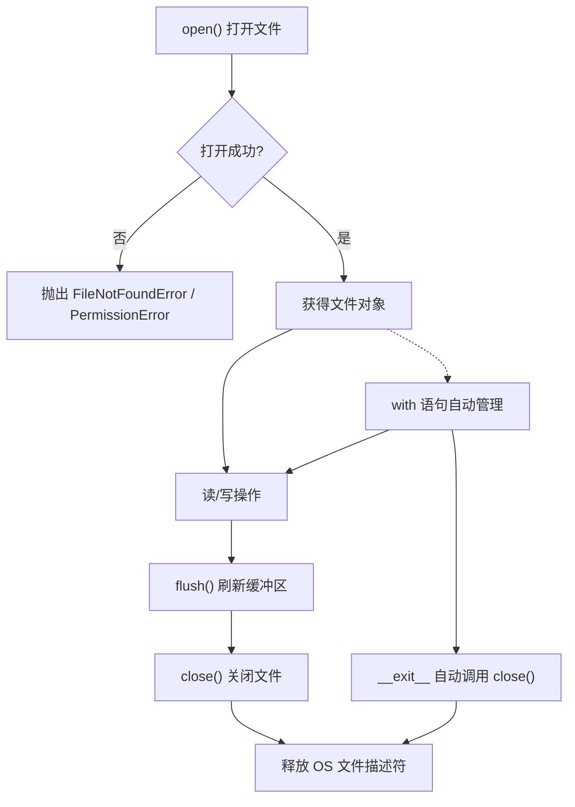
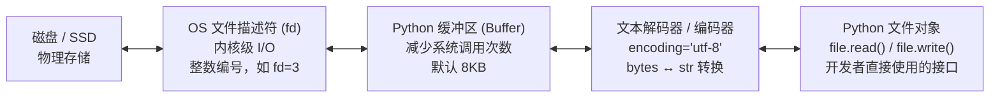
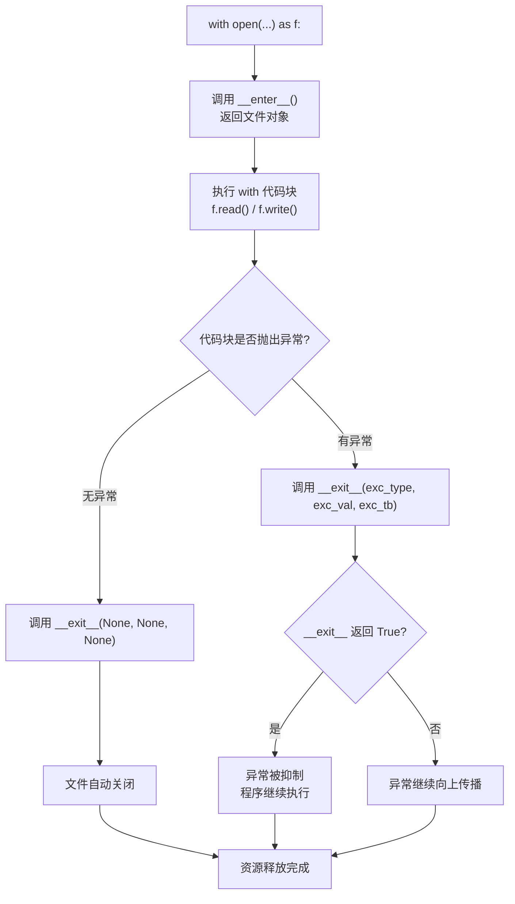
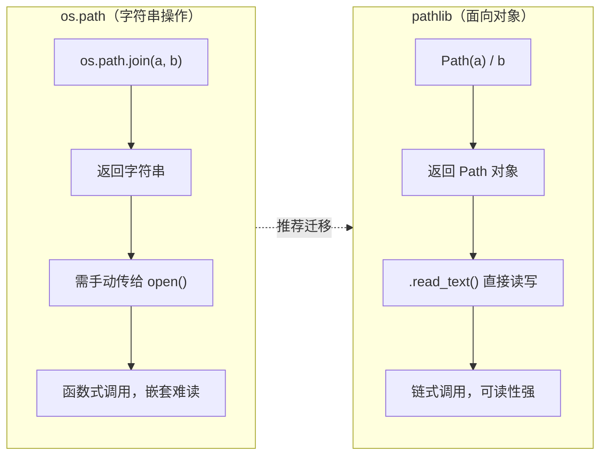

# 文件操作

Python 提供丰富的文件操作功能，使读取、写入、修改和管理数据变得简便。掌握常见模式、编码、路径与目录处理、二进制与文本读写，以及异常处理与优化策略，就能应付日常开发与数据处理场景。

## 文件操作完整生命周期

文件操作遵循一个严格的生命周期：打开 → 操作 → 关闭。理解这个流程是避免资源泄漏和数据丢失的基础。



## Python 文件对象的内部层次

理解文件对象的内部结构，有助于你写出更高效、更安全的文件操作代码。Python 的文件对象并非直接操作磁盘，而是经过多层抽象。



**为什么需要缓冲区？** 每次调用 OS 的 `read()`/`write()` 都是一次系统调用（从用户态切换到内核态），开销很大。缓冲区将多次小读写合并为少量大读写，显著提升性能。`flush()` 的作用就是强制将缓冲区中的数据写入磁盘，即使缓冲区还没满。

**为什么需要文本解码器？** 磁盘上存储的是字节（bytes），而 Python 3 的字符串是 Unicode。文本模式（`'r'`/`'w'`）自动在 bytes 和 str 之间转换；二进制模式（`'rb'`/`'wb'`）跳过这一层，直接操作 bytes。

## 文件打开与关闭

在 `Python` 中文件操作通常使用内置的 `open()` 函数：`file_object = open(file_name [, access_mode][, buffering])`

- **file_name**: 文件的路径（相对路径或绝对路径）
- **access_mode**: 打开文件的模式（如读取、写入、追加等）
- **buffering**: 设置缓冲策略（一般使用默认值即可）

```python
# 打开文件（只读模式）
file = open('example.txt', 'r')

# 读取文件内容
content = file.read()
print(content)

# 关闭文件
file.close()
```

### 常用的文件打开模式

| 模式  | 描述                                                                       |
| ----- | -------------------------------------------------------------------------- |
| `'r'` | 只读模式（默认）。文件必须存在，否则会引发 `FileNotFoundError`             |
| `'w'` | 写入模式。如果文件存在，则覆盖；如果文件不存在，则创建新文件               |
| `'a'` | 追加模式。如果文件存在，则在文件末尾追加内容；如果文件不存在，则创建新文件 |
| `'x'` | 创建模式。如果文件已存在，则引发 `FileExistsError`；否则创建新文件         |
| `'b'` | 二进制模式（与其他模式结合使用，如 `'rb'` 或 `'wb'`）                      |
| `'t'` | 文本模式（默认，可以与其他模式结合使用，如 `'rt'` 或 `'wt'`）              |
| `'+'` | 更新模式（读写，与其他模式结合使用，如 `'r+'` 或 `'w+'`）                  |

### 文件打开模式完整列表与选择指南

| 模式组合  | 读 | 写 | 追加 | 文件存在时     | 文件不存在时       | 典型场景                     |
| --------- | -- | -- | ---- | -------------- | ------------------ | ---------------------------- |
| `'r'`     | ✅ | ❌ | ❌   | 从头读取       | **报错**           | 读取配置文件、日志文件       |
| `'r+'`    | ✅ | ✅ | ❌   | 从头读写       | **报错**           | 修改文件中特定位置的内容     |
| `'w'`     | ❌ | ✅ | ❌   | **清空覆盖**   | 创建新文件         | 写入新报告、生成输出文件     |
| `'w+'`    | ✅ | ✅ | ❌   | **清空覆盖**   | 创建新文件         | 先写后读（如写入后校验）     |
| `'a'`     | ❌ | ✅ | ✅   | 末尾追加       | 创建新文件         | 日志记录、数据采集追加       |
| `'a+'`    | ✅ | ✅ | ✅   | 末尾追加       | 创建新文件         | 追加写入后回读               |
| `'x'`     | ❌ | ✅ | ❌   | **报错**       | 创建新文件         | 安全创建文件，防止意外覆盖   |
| `'rb'`    | ✅ | ❌ | ❌   | 从头读取字节   | **报错**           | 读取图片、音频、视频         |
| `'wb'`    | ❌ | ✅ | ❌   | **清空覆盖**   | 创建新文件         | 下载文件、复制二进制文件     |
| `'ab'`    | ❌ | ✅ | ✅   | 末尾追加字节   | 创建新文件         | 追加二进制数据块             |

```python
# --- 'r' 只读模式：最常用，文件必须存在 ---
with open('config.txt', 'r', encoding='utf-8') as f:
    content = f.read()  # 读取全部内容

# --- 'w' 写入模式：会清空已有内容！谨慎使用 ---
with open('output.txt', 'w', encoding='utf-8') as f:
    f.write('这会覆盖文件原有内容')  # 原有内容全部丢失

# --- 'a' 追加模式：在文件末尾添加，不影响已有内容 ---
with open('app.log', 'a', encoding='utf-8') as f:
    f.write('2026-06-04 新的日志条目\n')  # 追加到末尾

# --- 'r+' 读写模式：可读可写，文件必须存在，写入从指针位置开始 ---
with open('data.txt', 'r+', encoding='utf-8') as f:
    old = f.read()       # 先读取（指针移到末尾）
    f.write('追加内容')  # 在当前指针位置（末尾）写入

# --- 'x' 独占创建模式：文件已存在则报错，防止意外覆盖 ---
try:
    with open('new_file.txt', 'x', encoding='utf-8') as f:
        f.write('安全创建的新文件')
except FileExistsError:
    print('文件已存在，不会覆盖！')

# --- 'b' 二进制模式：处理非文本文件 ---
with open('photo.jpg', 'rb') as f:   # 二进制读取
    image_data = f.read()
with open('copy.jpg', 'wb') as f:    # 二进制写入
    f.write(image_data)

# --- 't' 文本模式（默认）：与 'b' 相对 ---
# open('file.txt', 'r') 等价于 open('file.txt', 'rt')
```

### 文件编码

在处理文本文件时，指定正确的编码格式非常重要，以避免出现编码错误或乱码。编码要与源文件保持一致，必要时可通过 `chardet` 等库检测未知编码。

**为什么编码如此重要？** 计算机只认识 0 和 1，所有文本在磁盘上都是以字节序列存储的。编码就是"字节序列 ↔ 人类可读文本"的映射规则。如果用错误的编码去解读字节序列，就会产生乱码或报错。

- **文本模式**（`'r'`/`'w'`）：Python 自动在 bytes 和 str 之间转换，需要指定 encoding
- **二进制模式**（`'rb'`/`'wb'`）：直接操作 bytes，不涉及编码转换

```python
# 指定编码格式读取文件
with open('example_utf8.txt', 'r', encoding='utf-8') as file:
    content = file.read()
```

```python
# 指定编码格式写入文件
with open('example_gbk.txt', 'w', encoding='gbk') as file:
    file.write('这是一个测试。')
```

**注意**：常用的编码格式包括 `'utf-8'`、`'gbk'`、`'ascii'` 等。选择合适的编码格式取决于文件的实际编码

### 编码错误处理（errors 参数）

当文件中包含无法解码的字节时，Python 默认会抛出 `UnicodeDecodeError`。通过 `errors` 参数可以控制错误处理策略：

```python
# errors 参数的常用取值：
# 'strict'  — 默认，遇到错误抛出 UnicodeDecodeError
# 'ignore'  — 忽略无法解码的字节（可能丢失数据）
# 'replace' — 用 � 替换无法解码的字节
# 'backslashreplace' — 用 \xNN 转义序列替换

# 场景：读取一个混合编码的日志文件，部分字节无法解码
with open('mixed_encoding.log', 'r', encoding='utf-8', errors='replace') as f:
    content = f.read()
    # 无法解码的字节会被替换为 �，程序不会崩溃

# 场景：需要知道哪些字节有问题，用转义序列标记
with open('mixed_encoding.log', 'r', encoding='utf-8', errors='backslashreplace') as f:
    content = f.read()
    # 无法解码的字节会显示为 \xff 这样的转义序列
```

### with 语句文件操作

`with` 语句可以自动管理文件的打开与关闭，即使在操作过程中发生异常也能确保文件被正确关闭，也便于同时管理多个文件资源

**为什么 with 语句是文件操作的必备工具？**

1. **资源安全**：即使代码块中发生异常，`__exit__` 方法也会被调用，文件一定被关闭
2. **代码简洁**：不需要手动写 `try...finally...close()`，减少样板代码
3. **防止泄漏**：忘记关闭文件会导致文件描述符泄漏，长期运行的服务可能耗尽系统资源



```python
# 使用 with 语句打开文件
with open('example.txt', 'r') as file:
    content = file.read()
    print(content)

# 文件已自动关闭，无需显式调用 file.close()
```

```python
# 同时读写两个文件
with open('input.txt', 'r', encoding='utf-8') as fin, \
        open('output.txt', 'w', encoding='utf-8') as fout:
    for line in fin:
        fout.write(line.upper())
```

### 文件操作的上下文管理器

除了 `with` 语句，`Python` 还支持自定义上下文管理器，通过实现 `__enter__` 和 `__exit__` 方法，可以创建更复杂的文件操作逻辑。示例：自定义上下文管理器

```python
class FileManager:
    def __init__(self, filename, mode):
        self.filename = filename
        self.mode = mode
        self.file = None

    def __enter__(self):
        self.file = open(self.filename, self.mode)
        return self.file

    def __exit__(self, exc_type, exc_val, exc_tb):
        if self.file:
            self.file.close()

# 使用自定义上下文管理器
with FileManager('example_custom.txt', 'w') as file:
    file.write('Using a custom context manager.')
```

## 现代路径管理：`pathlib` 模块

在 Python 3.4 之前，处理文件路径主要依赖 `os.path` 模块，它使用字符串来表示路径。这种方式在功能上是完备的，但在代码可读性和易用性上有所欠缺。为了解决这些问题，Python 3.4 引入了 `pathlib` 模块，它采用面向对象的方式来表示和操作文件系统路径。

**强烈推荐在现代 Python 项目中使用 `pathlib`。**

### `pathlib` vs `os.path`：为何选择 `pathlib`？

| 特性           | `os.path` (传统方式)                    | `pathlib` (现代方式)              | 优势                                    |
| :------------- | :-------------------------------------- | :-------------------------------- | :-------------------------------------- |
| **路径表示**   | 字符串                                  | `Path` 对象                       | **面向对象**，方法和属性更直观          |
| **路径拼接**   | `os.path.join('dir', 'subdir', 'file')` | `Path('dir') / 'subdir' / 'file'` | **更简洁、可读性更高**，使用 `/` 操作符 |
| **读取文件**   | `with open(p, 'r') as f: f.read()`      | `Path(p).read_text()`             | **内置读写方法**，一行代码完成          |
| **获取父目录** | `os.path.dirname(p)`                    | `Path(p).parent`                  | **属性访问**，更符合直觉                |
| **获取文件名** | `os.path.basename(p)`                   | `Path(p).name`                    | 属性访问，清晰明了                      |
| **获取扩展名** | `os.path.splitext(p)[1]`                | `Path(p).suffix`                  | 属性访问，无需索引                      |
| **跨平台**     | 需要注意路径分隔符                      | 自动处理路径分隔符                | **更好的跨平台兼容性**                  |

### os.path vs pathlib 方法对比流程



### os.path vs pathlib 完整对照表

| 操作             | `os.path` 写法                              | `pathlib` 写法                    | 说明                     |
| ---------------- | ------------------------------------------- | ---------------------------------- | ------------------------ |
| 当前目录         | `os.getcwd()`                               | `Path.cwd()`                       | pathlib 返回 Path 对象   |
| 拼接路径         | `os.path.join('dir', 'sub', 'file')`        | `Path('dir') / 'sub' / 'file'`    | `/` 操作符更直观         |
| 父目录           | `os.path.dirname(p)`                        | `Path(p).parent`                   | 属性访问                 |
| 文件名           | `os.path.basename(p)`                       | `Path(p).name`                     | 属性访问                 |
| 不含后缀的文件名 | `os.path.splitext(os.path.basename(p))[0]`  | `Path(p).stem`                     | pathlib 一步到位         |
| 后缀             | `os.path.splitext(p)[1]`                    | `Path(p).suffix`                   | 属性访问                 |
| 所有后缀         | 需手动实现                                  | `Path(p).suffixes`                 | 如 `.tar.gz` → ['.tar','.gz'] |
| 是否存在         | `os.path.exists(p)`                         | `Path(p).exists()`                 | 方法调用                 |
| 是否为文件       | `os.path.isfile(p)`                         | `Path(p).is_file()`                | 命名风格不同             |
| 是否为目录       | `os.path.isdir(p)`                          | `Path(p).is_dir()`                 | 命名风格不同             |
| 文件大小         | `os.path.getsize(p)`                        | `Path(p).stat().st_size`           | pathlib 通过 stat 获取   |
| 绝对路径         | `os.path.abspath(p)`                        | `Path(p).resolve()`                | resolve 还会解析符号链接 |
| 相对路径         | `os.path.relpath(p, start)`                 | `Path(p).relative_to(start)`       | pathlib 更直观           |
| 列出目录         | `os.listdir(p)`                             | `Path(p).iterdir()`                | pathlib 返回迭代器       |
| 递归搜索         | `os.walk(p)` + `fnmatch`                    | `Path(p).rglob(pattern)`           | pathlib 一行搞定         |

### `pathlib` 核心用法

#### 1. 创建路径对象

```python
from pathlib import Path
import os

# 从字符串创建 Path 对象
p = Path('docs/基础知识/13-文件操作.md')  # 相对路径示例

# 获取当前工作目录
cwd = Path.cwd()
print(f"当前目录: {cwd}")

# 获取用户主目录
home = Path.home()
print(f"主目录: {home}")
```

#### 2. 路径拼接与分解

`pathlib` 最具代表性的特性就是使用 `/` 操作符来拼接路径，这比 `os.path.join()` 更自然。

```python
from pathlib import Path

# 拼接路径
data_dir = Path.home() / 'data'
report_path = data_dir / 'reports' / '2025' / 'report.csv'
print(f"报告路径: {report_path}")

# 访问路径的各个部分
print(f"  - 父目录: {report_path.parent}")
print(f"  - 文件名: {report_path.name}")
print(f"  - 文件名（无后缀）: {report_path.stem}")
print(f"  - 后缀: {report_path.suffix}")
print(f"  - 各部分组成的元组: {report_path.parts}")
```

#### 3. 文件和目录操作

`Path` 对象封装了大量常用的文件系统操作。

**检查路径状态：**

```python
from pathlib import Path

p = Path('students.csv')

print(f"路径 '{p}' 是否存在? {p.exists()}")
print(f"路径 '{p}' 是文件吗? {p.is_file()}")
print(f"路径 '{p}' 是目录吗? {p.is_dir()}")
```

**创建和删除目录：**

```python
from pathlib import Path

# 创建单级目录
results_dir = Path('results')
results_dir.mkdir(exist_ok=True)  # exist_ok=True: 如果目录已存在，不抛出错误

# 创建多级目录
archive_dir = Path('归档/2025/monthly')
archive_dir.mkdir(parents=True, exist_ok=True) # parents=True: 自动创建所有父目录
```

**遍历目录内容：**

`iterdir()` 方法返回一个迭代器，用于遍历目录中的所有项目。

```python
from pathlib import Path

p = Path('.') # 当前目录
for item in p.iterdir():
    if item.is_dir():
        print(f"目录: {item.name}")
    else:
        print(f"文件: {item.name}")
```

**递归遍历与文件搜索：**

使用 `glob()` 或 `rglob()` 方法可以方便地按模式查找文件。

- `glob(pattern)`: 在当前目录下查找。
- `rglob(pattern)`: 递归地在所有子目录中查找。

```python
from pathlib import Path

docs_dir = Path('docs')  # 待搜索的目录

# 查找所有 Markdown 文件
md_files = list(docs_dir.glob('*.md'))
print(f"找到的 Markdown 文件: {md_files}")

# 递归查找所有 Python 文件
py_files_recursive = list(docs_dir.rglob('*.py'))
print(f"递归找到的 Python 文件: {py_files_recursive}")
```

#### 4. 直接读写文件

`Path` 对象提供了便捷的读写方法，对于简单的文件操作，可以省去 `open()` 的步骤。

```python
from pathlib import Path

p = Path('greeting.txt')

# 写入文本，自动处理文件打开和关闭
p.write_text('Hello, pathlib!', encoding='utf-8')

# 读取文本
content = p.read_text(encoding='utf-8')
print(content)

# 写入二进制数据
p_bin = Path('data.bin')
p_bin.write_bytes(b'\x00\x01\x02')

# 读取二进制数据
binary_content = p_bin.read_bytes()
print(binary_content)
```

## 核心读写操作：文本与二进制

文件操作的核心可以分为两大类：处理人类可读的**文本文件**和处理非文本数据的**二进制文件**（如图片、音频、可执行文件等）。

### 文本模式 vs 二进制模式对比

| 特性         | 文本模式 (`'r'`/`'w'`/`'a'`)          | 二进制模式 (`'rb'`/`'wb'`/`'ab'`) |
| ------------ | -------------------------------------- | ---------------------------------- |
| 数据类型     | `str`（Unicode 字符串）               | `bytes`（字节序列）               |
| 编码转换     | 自动（需指定 encoding）               | 无（原始字节）                     |
| 换行符处理   | 自动转换（平台相关 → `\n`）           | 不转换（原样保留）                 |
| 文件指针     | 按字符定位（seek 受限）               | 按字节定位（seek 自由）            |
| 典型用途     | .txt, .csv, .json, .py, .md           | .jpg, .mp3, .zip, .exe, .pdf      |
| 读取方法返回 | `str`                                  | `bytes`                            |
| 写入方法接受 | `str`                                  | `bytes`                            |

### 1. 文本文件读写

处理文本文件时，最关键的一点是**始终显式指定编码**，`encoding='utf-8'` 是最广泛接受和推荐的选择，能有效避免在不同系统上出现乱码问题。

#### 读取方法完整对比

| 方法              | 返回值           | 内存占用     | 适用场景                       |
| ----------------- | ---------------- | ------------ | ------------------------------ |
| `f.read()`        | 整个文件的字符串 | 高（全量）   | 小文件，需要整体处理           |
| `f.readline()`    | 一行字符串       | 低（单行）   | 需要逐行控制、行号追踪         |
| `f.readlines()`   | 所有行的列表     | 高（全量）   | 需要随机访问行、多次遍历       |
| `for line in f:`  | 每次迭代一行     | 最低（惰性） | 大文件逐行处理（**推荐**）     |

```python
# --- read()：一次性读取全部内容 ---
# 适合小文件（如配置文件），大文件会占用大量内存
with open('small_config.txt', 'r', encoding='utf-8') as f:
    all_content = f.read()  # 返回整个文件的字符串
    print(f"文件共 {len(all_content)} 个字符")

# --- readline()：每次读取一行 ---
# 适合需要精确控制读取进度的场景
with open('data.txt', 'r', encoding='utf-8') as f:
    first_line = f.readline()   # 读取第一行
    second_line = f.readline()  # 读取第二行
    # readline() 返回空字符串 '' 表示文件结束（不是 None）

# --- readlines()：读取所有行到列表 ---
# 适合需要随机访问某一行，或多次遍历的场景
# 注意：大文件会占用大量内存
with open('data.txt', 'r', encoding='utf-8') as f:
    lines = f.readlines()  # 返回列表，每个元素是一行（含 \n）
    print(f"共 {len(lines)} 行")
    # 可以通过索引随机访问：lines[5] 是第 6 行

# --- 迭代（推荐）：逐行读取，内存最省 ---
# 文件对象本身是可迭代的，每次 yield 一行
# 这是处理大文件的最佳方式
with open('large_log.txt', 'r', encoding='utf-8') as f:
    for line_number, line in enumerate(f, 1):  # 行号从 1 开始
        if 'ERROR' in line:
            print(f"第 {line_number} 行发现错误: {line.strip()}")
```

#### 逐行读取（处理大文件的首选）

对于大文件，逐行读取是内存效率最高的方式，因为文件内容不会被一次性加载到内存中。文件对象本身是可迭代的，可以直接用于 `for` 循环。

```python
from pathlib import Path

path = Path('my_large_log.txt')

# 假设文件内容是：
# INFO: Task started
# WARNING: Deprecated feature used
# ERROR: Connection failed

with path.open('r', encoding='utf-8') as f:
    for line in f:
        # .strip() 用于移除行尾的换行符 \n
        if "ERROR" in line:
            print(f"发现错误: {line.strip()}")
```

#### 一次性读取全部内容

如果文件不大，可以一次性将其全部读入内存。`Path.read_text()` 是 `pathlib` 提供的便捷方法。

```python
from pathlib import Path

path = Path('config.ini')

# 假设文件内容是：
# [database]
# host = localhost

try:
    content = path.read_text(encoding='utf-8')
    print("配置文件内容：\n", content)
except FileNotFoundError:
    print(f"错误: 文件 '{path}' 未找到。")
```

#### 写入与追加内容

- **写入 (`'w'`)**：会覆盖文件的全部现有内容。如果文件不存在，则会创建它。
- **追加 (`'a'`)**：会在文件末尾添加新内容，而不会影响原有内容。如果文件不存在，也会创建它。

```python
from pathlib import Path

log_path = Path('application.log')

# 写入模式 ('w')：清空并写入新日志
log_path.write_text("--- 日志开始 ---\n", encoding='utf-8')

# 追加模式 ('a')：添加更多日志条目
with log_path.open('a', encoding='utf-8') as f:
    f.write("2025-11-27 10:00 - 应用启动\n")
    f.write("2025-11-27 10:01 - 连接数据库...\n")

print(log_path.read_text(encoding='utf-8'))
```

#### 写入方法完整示例

```python
# --- write()：写入字符串 ---
# 返回写入的字符数（文本模式）或字节数（二进制模式）
with open('output.txt', 'w', encoding='utf-8') as f:
    chars_written = f.write('Hello, World!\n')  # 返回 14
    print(f"写入了 {chars_written} 个字符")

# --- writelines()：写入字符串列表 ---
# 注意：writelines 不会自动添加换行符！需要手动在每行末尾加 \n
lines = ['第一行\n', '第二行\n', '第三行\n']
with open('multi_lines.txt', 'w', encoding='utf-8') as f:
    f.writelines(lines)  # 一次性写入多行

# 对比：逐行 write vs writelines
# 逐行 write（每次都触发缓冲区写入）
with open('slow.txt', 'w', encoding='utf-8') as f:
    for line in lines:
        f.write(line)

# writelines（一次性提交，效率更高）
with open('fast.txt', 'w', encoding='utf-8') as f:
    f.writelines(lines)
```

### 2. 二进制文件读写

处理二进制文件（如图片、视频、PDF 等）时，必须使用二进制模式（如 `'rb'` 读取，`'wb'` 写入）。在二进制模式下，读写的是 `bytes` 对象，而不是 `str` 对象。

**场景：复制一张图片**

```python
from pathlib import Path

source_image = Path('logo.png')
destination_image = Path('logo_copy.png')

# 假设 logo.png 存在于当前目录
if not source_image.exists():
    print(f"源文件 '{source_image}' 不存在！")
else:
    try:
        # 以二进制读取模式 ('rb') 打开源文件
        binary_data = source_image.read_bytes()

        # 以二进制写入模式 ('wb') 写入目标文件
        destination_image.write_bytes(binary_data)

        print(f"图片已成功复制到 '{destination_image}'")

    except Exception as e:
        print(f"复制文件时发生错误: {e}")
```

这种逐块读写的模式对于处理非常大的二进制文件（如视频）同样适用，可以有效控制内存使用。

#### 大二进制文件分块读写

```python
# 对于大文件（如视频、数据库备份），不要一次性 read() 全部内容
# 使用分块读写，控制内存使用
def copy_large_file(src: str, dst: str, chunk_size: int = 64 * 1024) -> None:
    """分块复制大文件，每次只读 chunk_size 字节到内存"""
    with open(src, 'rb') as f_in, open(dst, 'wb') as f_out:
        while True:
            chunk = f_in.read(chunk_size)  # 每次读取 64KB
            if not chunk:                  # 读到文件末尾，chunk 为空 bytes
                break
            f_out.write(chunk)             # 写入当前块

# 使用示例：复制一个 2GB 的视频文件，内存占用始终只有 64KB
copy_large_file('presentation.mp4', 'presentation_backup.mp4')
```

## 处理结构化数据：JSON 与 CSV

在实际应用中，我们很少处理纯粹的无格式文本。更常见的是处理如 `JSON`、`CSV`、`XML` 或 `YAML` 等结构化数据。Python 的标准库为处理最常见的格式（`JSON` 和 `CSV`）提供了强大的支持。

### 1. JSON：Web API 与配置文件的首选

`JSON` (JavaScript Object Notation) 是一种轻量级的数据交换格式，因其易于人类阅读和编写，同时也易于机器解析和生成而成为 Web API 和配置文件的标准。Python 的 `json` 模块可以轻松地将 Python 对象（如字典和列表）与 `JSON` 字符串进行相互转换。

- `json.dump(obj, file)`: 将 Python 对象序列化为 `JSON` 格式并写入文件。
- `json.load(file)`: 从文件中读取 `JSON` 数据并反序列化为 Python 对象。
- `json.dumps(obj)`: 将 Python 对象序列化为 `JSON` 格式的字符串。
- `json.loads(string)`: 将 `JSON` 格式的字符串反序列化为 Python 对象。

**场景：保存和加载应用配置**

```python
import json
from pathlib import Path

config_path = Path('app_config.json')

# 创建一个配置字典
config_data = {
    'database': {
        'host': 'localhost',
        'port': 5432,
        'user': 'admin'
    },
    'api_keys': [
        {'service': 'google', 'key': 'AIzaSy...'},
        {'service': 'stripe', 'key': 'sk_test_...'}
    ],
    'debug_mode': True
}

# --- 写入 JSON 文件 ---
try:
    with config_path.open('w', encoding='utf-8') as f:
        # indent=4 使文件格式化，更易读
        # ensure_ascii=False 确保中文字符能被正确写入，而不是被转义为 \uXXXX
        json.dump(config_data, f, indent=4, ensure_ascii=False)
    print(f"配置已成功写入到 '{config_path}'")

except Exception as e:
    print(f"写入 JSON 文件时出错: {e}")

# --- 读取 JSON 文件 ---
try:
    with config_path.open('r', encoding='utf-8') as f:
        loaded_config = json.load(f)
    print("\n成功加载配置:")
    print(f"  数据库主机: {loaded_config['database']['host']}")
    print(f"  第一个 API 服务: {loaded_config['api_keys'][0]['service']}")

except FileNotFoundError:
    print(f"错误: 配置文件 '{config_path}' 不存在。")
except json.JSONDecodeError:
    print(f"错误: 配置文件 '{config_path}' 格式不正确。")
except Exception as e:
    print(f"读取 JSON 文件时出错: {e}")
```

### 2. CSV：表格数据的通用格式

`CSV` (Comma-Separated Values) 是存储表格数据的标准格式，广泛用于电子表格和数据库之间的数据导入导出。Python 的 `csv` 模块提供了读取和写入 `CSV` 文件的强大工具。

**场景：读写学生成绩单**

假设我们有以下数据需要写入 `CSV` 文件：

```python
import csv
from pathlib import Path

students_path = Path('students.csv')

# 待写入的数据：一个字典列表
student_data = [
    {'name': '张三', 'math_score': 92, 'english_score': 88},
    {'name': '李四', 'math_score': 78, 'english_score': 95},
    {'name': '王五', 'math_score': 85, 'english_score': 89}
]

# --- 写入 CSV 文件 ---
try:
    with students_path.open('w', newline='', encoding='utf-8') as f:
        # 定义表头
        fieldnames = ['name', 'math_score', 'english_score']

        # 创建一个 DictWriter 对象
        writer = csv.DictWriter(f, fieldnames=fieldnames)

        # 写入表头
        writer.writeheader()

        # 写入所有数据行
        writer.writerows(student_data)

    print(f"学生数据已成功写入到 '{students_path}'")

except Exception as e:
    print(f"写入 CSV 文件时出错: {e}")

# --- 读取 CSV 文件 ---
try:
    with students_path.open('r', encoding='utf-8') as f:
        # 创建一个 DictReader 对象
        reader = csv.DictReader(f)

        print("\n从 CSV 文件中读取的学生数据:")
        for row in reader:
            # row 是一个字典，可以直接通过列名访问
            print(f"  姓名: {row['name']}, 数学: {row['math_score']}, 英语: {row['english_score']}")

except FileNotFoundError:
    print(f"错误: CSV 文件 '{students_path}' 不存在。")
except Exception as e:
    print(f"读取 CSV 文件时出错: {e}")
```

**关键参数说明：**

- `newline=''`: 在写入 `CSV` 文件时，这是**必须**的参数。它能防止 `csv` 模块在处理换行符时出现意外的空行。
- `DictWriter` / `DictReader`: 使用字典来读写 `CSV` 数据使得代码更具可读性和可维护性，因为它允许我们通过列名而不是索引来访问数据。

## 文件指针的操作

文件指针指示下一个读写的位置。可以使用以下方法操作文件指针：

### tell()

返回文件指针的当前位置

```python
with open('example.txt', 'r') as file:
    content = file.read(10)
    position = file.tell()
    print(f'已读取 10 个字符，当前指针位置: {position}')
```

### seek(offset[, whence])

移动文件指针到指定位置

- **offset**: 移动的字节数
- **whence**: 参考点：0（默认）表示文件开头、1 表示当前位置、2 表示文件末尾

```python
with open('example.txt', 'r') as file:
    file.seek(5)  # 移动到第 6 个字节
    content = file.read(10)
    print(content)
```

## 处理二进制文件

文本文件与二进制文件

- **文本文件**：以文本模式（如 `'r'`、`'w'`）打开，数据以字符串形式处理
- **二进制文件**：以二进制模式（如 `'rb'`、`'wb'`）打开，数据以字节形式处理

示例：读取二进制文件

```python
with open('image.jpg', 'rb') as file:
    binary_data = file.read()
    # 可以对 binary_data 进行处理，如保存到另一个文件
```

示例：写入二进制文件

```python
data_to_write = b'\x00\x01\x02\x03'  # 字节数据
with open('binary_output.bin', 'wb') as file:
    file.write(data_to_write)
```

## 文件的其他常用方法

### 1. flush()

刷新文件内部缓冲区，立即将数据写入磁盘

```python
with open('example_flush.txt', 'w') as file:
    file.write('Data to flush')
    file.flush()  # 确保数据立即写入磁盘
```

### 2. isatty()

判断文件是否连接到一个终端设备

```python
with open('example.txt', 'r') as file:
    if file.isatty():
        print("文件连接到一个终端设备。")
    else:
        print("文件未连接到一个终端设备。")  # 通常为这种情况
```

### 3. truncate([size])

截断文件到指定大小

- **size**: 可选参数，指定截断后的大小。默认为当前指针位置

```python
with open('example_truncate.txt', 'w+') as file:
    file.write('This is a longer text that will be truncated.')
    file.seek(10)  # 移动指针到第 11 个字节
    file.truncate()  # 截断文件，保留前 10 个字节
```

## 异常处理

在文件操作过程中，可能会遇到各种异常，如文件不存在、权限不足等。使用 `try-except` 语句可以捕捉并处理这些异常，提高程序的健壮性

示例：捕捉文件未找到异常

```python
try:
    with open('nonexistent_file.txt', 'r') as file:
        content = file.read()
except FileNotFoundError:
    print("错误：文件未找到。")
```

示例：捕捉多种异常

```python
try:
    with open('example.txt', 'r') as file:
        content = file.read(100)
        # 假设对内容进行一些处理，可能引发 ValueError
        if 'error' in content:
            raise ValueError("内容中包含错误关键字。")
except FileNotFoundError:
    print("错误：文件未找到。")
except PermissionError:
    print("错误：没有权限访问文件。")
except ValueError as ve:
    print(f"值错误：{ve}")
except Exception as e:
    print(f"发生未知错误：{e}")
```

## 处理大文件

对于非常大的文件，一次性读取整个文件可能会导致内存不足。此时，可以采用逐行读取或分块读取的方法。

### 逐行读取大文件

```python
with open('large_file.txt', 'r') as file:
    for line in file:
        # 处理每一行
        process(line.strip())
```

### 分块读取大文件

```python
chunk_size = 1024  # 每次读取 1KB
with open('large_file.bin', 'rb') as file:
    while True:
        chunk = file.read(chunk_size)
        if not chunk:
            break
        # 处理每个块
        process_chunk(chunk)
```

### 内存映射文件（mmap）：超大文件的高效处理

对于需要随机访问的超大文件（如数据库文件、大型日志分析），Python 提供了 `mmap` 模块，将文件映射到虚拟内存中，让操作系统按需加载页面，避免一次性读入全部内容。

```python
import mmap
from pathlib import Path

# 场景：在一个 10GB 的日志文件中搜索特定关键字
# 使用 mmap，内存占用只有几 KB，而不是 10GB
log_path = Path('huge_server.log')

with log_path.open('r', encoding='utf-8') as f:
    # 将文件映射到内存，access=mmap.ACCESS_READ 表示只读
    with mmap.mmap(f.fileno(), 0, access=mmap.ACCESS_READ) as mm:
        # mmap 对象可以像 bytes 一样操作，但不会全部加载到内存
        # 搜索关键字（比逐行读取快得多）
        keyword = b'CRITICAL ERROR'  # mmap 操作的是 bytes
        position = mm.find(keyword)
        if position != -1:
            # 定位到关键字所在位置，读取周围上下文
            mm.seek(max(0, position - 100))  # 向前 100 字节
            context = mm.read(200 + len(keyword))  # 读取 200+ 字节的上下文
            print(f"在位置 {position} 找到关键字")
            print(f"上下文: {context.decode('utf-8', errors='replace')}")
        else:
            print("未找到关键字")

# mmap 的优势：
# 1. 内存占用极低——OS 按需加载页面，不是全部读入
# 2. 支持随机访问——seek 到任意位置，不需要从头读
# 3. 多进程共享——多个进程可以映射同一文件，共享数据
```

## 临时文件与安全写入

对关键数据执行写操作时，可先写入临时文件，确认成功后再替换目标文件，避免中途失败导致文件损坏。

```python
import tempfile
import shutil
from pathlib import Path

target = Path('report.txt')
with tempfile.NamedTemporaryFile('w', delete=False, encoding='utf-8') as tmp:
    tmp.write('new content')
    tmp_path = Path(tmp.name)

shutil.move(str(tmp_path), target)  # 原子替换（同一文件系统内）
```

`tempfile.TemporaryDirectory()` 则适合在任务运行期间存放中间产物，任务结束后由上下文自动清理。

### tempfile 模块完整用法

```python
import tempfile
from pathlib import Path

# --- NamedTemporaryFile：创建有名字的临时文件 ---
# delete=False：文件关闭后不会自动删除，需要手动处理
# 适合"先写临时文件，再原子替换目标文件"的安全写入模式
with tempfile.NamedTemporaryFile(mode='w', delete=False, encoding='utf-8', suffix='.json') as tmp:
    tmp.write('{"status": "ok"}')
    tmp_path = Path(tmp.name)
    print(f"临时文件路径: {tmp_path}")
# 文件仍然存在，可以用于 shutil.move() 原子替换

# --- TemporaryFile：创建匿名临时文件 ---
# 文件关闭后自动删除，适合中间处理步骤
with tempfile.TemporaryFile(mode='w+', encoding='utf-8') as tmp:
    tmp.write('中间数据\n')
    tmp.seek(0)              # 回到文件开头
    content = tmp.read()     # 读取刚写入的内容
    print(f"中间数据: {content.strip()}")
# 文件已自动删除，无需手动清理

# --- TemporaryDirectory：创建临时目录 ---
# 适合需要多个临时文件的场景（如解压、批量处理）
with tempfile.TemporaryDirectory() as tmp_dir:
    tmp_dir_path = Path(tmp_dir)
    # 在临时目录中创建多个文件
    (tmp_dir_path / 'part1.txt').write_text('数据1', encoding='utf-8')
    (tmp_dir_path / 'part2.txt').write_text('数据2', encoding='utf-8')
    # 列出临时目录中的文件
    for f in tmp_dir_path.iterdir():
        print(f"临时文件: {f.name}")
# 退出 with 块后，整个临时目录及其内容自动删除
```

## 最佳实践

1. **使用 `with` 语句**：确保文件在使用后正确关闭，避免资源泄漏
2. **处理异常**：捕捉并处理可能的异常，提高程序的健壮性
3. **指定编码**：在打开文件时明确指定编码格式，避免编码问题
4. **使用 `pathlib`**：利用路径对象简化拼接、遍历等操作
5. **避免硬编码路径**：使用配置文件或环境变量管理路径，增强可移植性
6. **模块化代码**：将文件操作封装到函数或类中，提高可重用性与可测试性
7. **备份重要文件**：写操作前备份或使用临时文件+原子替换，防止损坏
8. **监控文件大小**：大文件采用分块或流式处理，避免一次性读入内存
9. **权限控制**：在生产环境中关注读写权限与敏感信息保护

### 读取方式选择指南

| 场景                       | 推荐方式              | 原因                                   |
| -------------------------- | --------------------- | -------------------------------------- |
| 小配置文件（< 1MB）        | `Path.read_text()`    | 一行代码搞定，简洁高效                 |
| 大日志文件逐行过滤         | `for line in f:`      | 惰性迭代，内存占用恒定                 |
| 需要随机访问某一行         | `f.readlines()`       | 返回列表，支持索引访问                 |
| 只读前几行（如文件头）     | `f.readline()`        | 精确控制读取行数                       |
| 超大文件随机访问           | `mmap`                | OS 按需加载，支持 seek                 |
| 二进制文件复制             | `f.read(chunk_size)`  | 分块读写，控制内存                     |

以下是一个综合示例，展示如何读取一个文本文件，处理其内容，并将结果写入另一个文件，同时处理可能出现的异常

```python
from pathlib import Path

def process_line(line: str) -> str:
    """示例处理函数：将行转换为大写"""
    return line.upper()

def main() -> None:
    input_path = Path('input.txt')
    output_path = Path('output.txt')

    # 检查输入文件是否存在
    if not input_path.exists():
        print(f"错误：输入文件 '{input_path}' 不存在。")
        return

    try:
        with input_path.open('r', encoding='utf-8') as fin, \
                output_path.open('w', encoding='utf-8') as fout:
            for line_number, line in enumerate(fin, 1):
                processed_line = process_line(line.rstrip('\n'))
                fout.write(f"{line_number}: {processed_line}\n")
        print(f"处理完成，结果已写入 '{output_path}'。")
    except OSError as e:
        print(f"文件操作错误：{e}")
    except Exception as e:
        print(f"发生未知错误：{e}")

if __name__ == '__main__':
    main()
```

## 常见陷阱与 FAQ

### 陷阱 1：忘记关闭文件

```python
# ❌ 错误：忘记关闭文件
f = open('data.txt', 'r')
content = f.read()
# 忘记 f.close()！
# 后果：文件描述符泄漏，长期运行的服务可能耗尽系统资源
# 在 Windows 上，未关闭的文件会被锁定，其他程序无法访问

# ✅ 正确：使用 with 语句，自动关闭
with open('data.txt', 'r', encoding='utf-8') as f:
    content = f.read()
# 离开 with 块后，文件自动关闭，即使发生异常也是如此
```

**为什么这很严重？** 每个 `open()` 都会占用一个 OS 文件描述符（一个整数编号）。操作系统的文件描述符数量是有限的（Linux 默认 1024，可通过 `ulimit -n` 查看）。如果在一个循环中反复 `open()` 而不 `close()`，很快就会达到上限，导致 `OSError: [Errno 24] Too many open files`。

### 陷阱 2：编码错误处理

```python
# ❌ 错误：不指定编码，依赖系统默认值
with open('data.txt', 'r') as f:  # Windows 默认 gbk，Linux 默认 utf-8
    content = f.read()
# 同一文件在不同系统上可能产生乱码或 UnicodeDecodeError

# ✅ 正确：始终显式指定 encoding
with open('data.txt', 'r', encoding='utf-8') as f:
    content = f.read()

# ✅ 遇到编码不明的文件，使用 errors 参数容错
with open('unknown_encoding.txt', 'r', encoding='utf-8', errors='replace') as f:
    content = f.read()  # 无法解码的字节替换为 �，不会崩溃
```

### 陷阱 3：大文件一次性读取内存问题

```python
# ❌ 错误：对大文件使用 read() 或 readlines()
with open('10GB_database_dump.txt', 'r') as f:
    all_lines = f.readlines()  # 尝试将 10GB 加载到内存！
# 后果：MemoryError，程序崩溃，甚至系统卡死

# ✅ 正确：逐行迭代，内存占用恒定
with open('10GB_database_dump.txt', 'r', encoding='utf-8') as f:
    for line in f:
        if 'target_keyword' in line:
            process(line.strip())
            break  # 找到后可以提前退出，不用读完整个文件

# ✅ 二进制大文件：分块读取
CHUNK_SIZE = 64 * 1024  # 64KB
with open('large_video.mp4', 'rb') as f:
    while chunk := f.read(CHUNK_SIZE):  # 海象运算符，Python 3.8+
        process_chunk(chunk)
```

### 陷阱 4：文件路径跨平台问题

```python
# ❌ 错误：硬编码路径分隔符
config_path = 'data\\config\\settings.json'  # Windows 路径
# 在 Linux/macOS 上会失败，因为它们使用 / 作为分隔符

# ❌ 错误：手动拼接路径
data_dir = base_dir + '/' + subdir + '/' + filename  # 不安全，可能产生双斜杠

# ✅ 正确：使用 pathlib，自动处理跨平台分隔符
from pathlib import Path
config_path = Path('data') / 'config' / 'settings.json'
# Windows 上自动变为 data\config\settings.json
# Linux/macOS 上自动变为 data/config/settings.json

# ✅ 正确：使用 os.path.join（传统方式）
import os
config_path = os.path.join('data', 'config', 'settings.json')
```

### 陷阱 5：Windows 换行符 \r\n 问题

```python
# Windows 使用 \r\n（CRLF）作为换行符
# Linux/macOS 使用 \n（LF）作为换行符
# 这可能导致意想不到的问题：

# ❌ 问题：Windows 上创建的文件，字节层面行尾是 \r\n
# 默认文本模式会自动把 \r\n 转成 \n；用 newline='' 禁用转换才能看到原始行尾
with open('windows_file.txt', 'r', encoding='utf-8', newline='') as f:
    for line in f:
        # 此时 line 末尾是 '...\r\n' 而不是 '...\n'
        # 如果用 line == 'expected_text\n' 比较，会失败
        print(repr(line))  # 显示 '...\r\n'

# ✅ 解决方案 1：使用 .strip() 移除所有空白字符（包括 \r）
with open('windows_file.txt', 'r', encoding='utf-8') as f:
    for line in f:
        clean_line = line.strip()  # 移除首尾空白，包括 \r 和 \n

# ✅ 解决方案 2：文本模式自动转换（默认行为）
# Python 文本模式在读取时自动将平台换行符转换为 \n
# 在写入时自动将 \n 转换为平台换行符
# 所以大多数情况下，你不需要手动处理 \r\n

# ✅ 解决方案 3：如果需要保留原始换行符，使用 newline=''
with open('raw_file.txt', 'r', encoding='utf-8', newline='') as f:
    for line in f:
        # line 保留原始换行符，不做任何转换
        print(repr(line))
```

## 术语表

| 术语         | 英文                | 定义                                                                                   |
| ------------ | ------------------- | -------------------------------------------------------------------------------------- |
| 文件描述符   | File Descriptor (fd)| 操作系统为每个打开的文件分配的整数编号，是内核与用户程序之间文件访问的句柄。Python 通过 `f.fileno()` 获取 |
| 缓冲区       | Buffer              | 位于内存中的临时存储区域，用于合并多次小读写为少量大读写，减少系统调用开销。默认大小 8KB |
| 编码         | Encoding            | 字节序列与 Unicode 字符串之间的映射规则。常见编码：UTF-8（通用）、GBK（中文）、ASCII（英文） |
| 上下文管理器 | Context Manager     | 实现了 `__enter__` 和 `__exit__` 方法的对象，`with` 语句通过它确保资源的获取与释放成对出现 |
| 路径对象     | Path Object         | `pathlib.Path` 的实例，以面向对象方式表示文件系统路径，提供属性和方法操作路径，自动处理跨平台差异 |
| 内存映射     | Memory Map (mmap)   | 将文件内容映射到进程的虚拟地址空间，由操作系统按需加载页面，实现高效随机访问，避免一次性读入全部内容 |

## 延伸阅读

- → [字符串](08-字符串) — 文本文件读写的核心是字符串操作，编码转换依赖对字符串的深入理解
- → [异常处理](15-异常处理) — 文件操作中 `FileNotFoundError`、`PermissionError`、`UnicodeDecodeError` 等异常的完整处理策略
- → [面向对象](14-面向对象) — `pathlib.Path` 和上下文管理器（`__enter__`/`__exit__`）都是面向对象设计的经典应用

## 版本差异（Python 3.8-3.12 → 3.14）

| 特性 | 本文编写时 | Python 3.14 |
|------|-----------|-------------|
| 类型注解求值 | 运行时立即求值 | PEP 649/749 延迟求值：注解不再在定义时执行，解决前向引用，提升启动性能 |
| 字符串模板 | 普通 f-string / `str.format` | PEP 750 模板字符串 `t"..."`：可插值且能被安全处理（3.14 新特性） |
| 标准库多解释器 | 无官方支持 | PEP 734：`concurrent.interpreters` 模块支持在同一进程创建多个子解释器 |
| 调试 | 仅 Python 内建 pdb / IDE 调试 | PEP 768：安全的 CPython 外部调试器接口（custom debugger protocol） |
| 字节码与运行时 | 3.12 前无 JIT | 3.13 引入实验性 JIT（PEP 744）；3.14 进一步改进 free-threaded（无 GIL）构建 |
| `datetime` API | `utcnow()` 常用 | 3.12 起弃用，官方要求改用 `datetime.now(tz=datetime.UTC)`（aware 对象） |
| 压缩算法 | zlib / gzip / bz2 / lzma | 3.14 新增标准库 Zstandard 支持（PEP 784） |

> 本文讲解的语法与数据结构原理在 3.14 中依然成立；新项目建议基于 Python 3.13/3.14，并优先使用 aware datetime、PEP 649 注解与最新类型语法。
