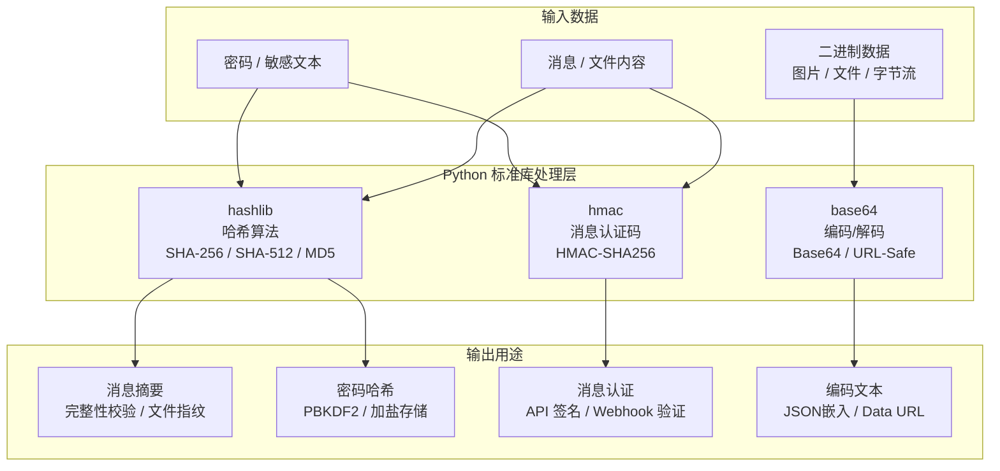
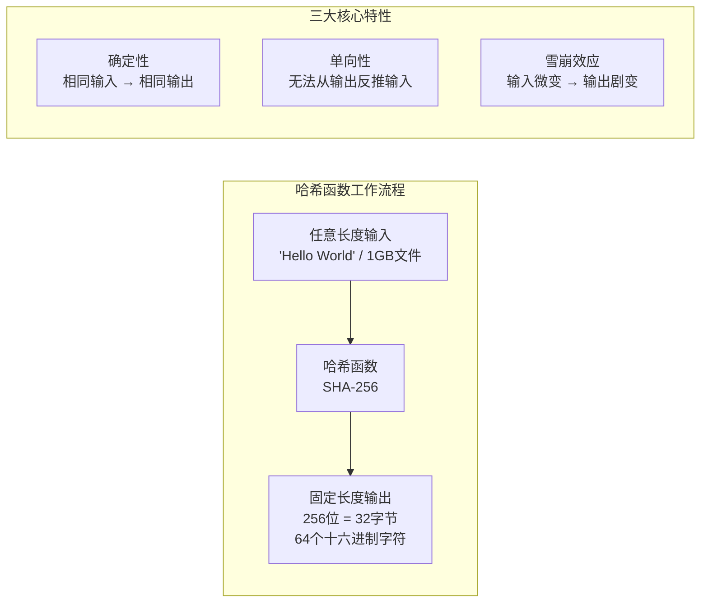
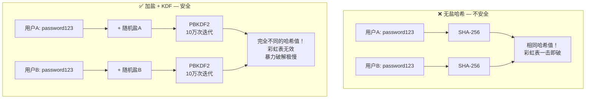
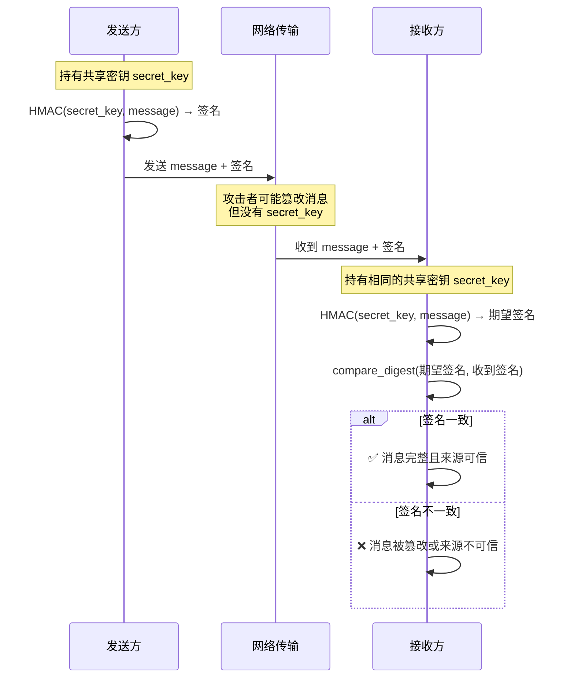
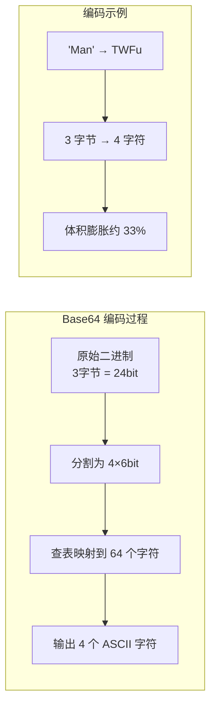
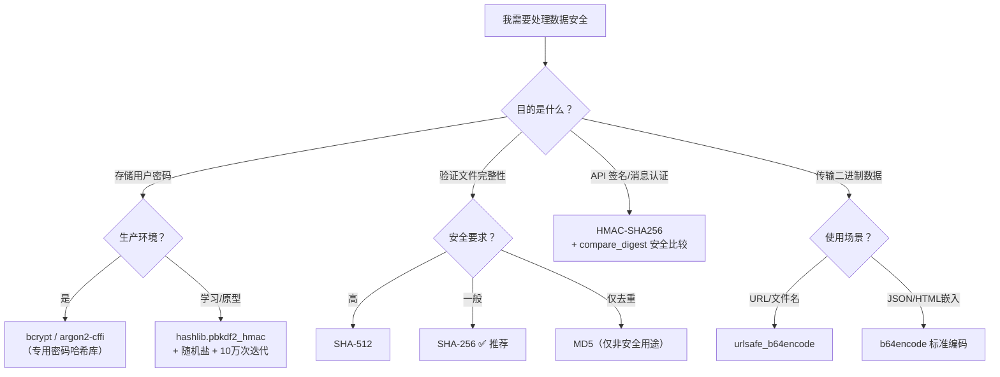

# 加密与编码工具：hashlib、hmac 与 base64

在现代软件开发中，数据的安全性和完整性至关重要。Python 标准库提供了 `hashlib`、`hmac` 和 `base64` 三个模块，分别用于哈希运算、消息认证和数据编码。本文将从底层原理到实战场景，系统化梳理这三个模块的核心用法。

## 全局架构一览



## 一、hashlib — 哈希算法

### 1.1 是什么：哈希的本质

**哈希函数**（Hash Function）是一种将任意长度的输入数据映射为固定长度输出的单向数学函数。这个输出被称为**摘要**（Digest）或**指纹**（Fingerprint）。

`hashlib` 是 Python 标准库中的哈希算法模块，实现了 FIPS 安全哈希算法（SHA 系列）和 MD5 等算法。其底层由 OpenSSL 提供，性能极高。



### 1.2 为什么：哈希的设计动机

哈希算法在计算机科学中无处不在。理解它的设计动机，才能正确地选择和使用：

| 应用场景 | 需求 | 推荐算法 |
|----------|------|----------|
| **文件完整性校验** | 验证下载/传输的文件未被篡改 | SHA-256、SHA-512 |
| **密码安全存储** | 以不可逆形式存储密码 | PBKDF2 + SHA-256、bcrypt、argon2 |
| **数据去重** | 为内容生成唯一标识 | SHA-256、BLAKE2 |
| **Git 版本控制** | 为每次提交生成唯一 ID | SHA-1（Git 内部使用） |
| **区块链** | 区块链接与工作量证明 | SHA-256（比特币） |

::: danger 算法选择警告
`MD5` 和 `SHA-1` 已被证实存在**碰撞漏洞**（不同输入产生相同输出），**绝对不能**用于密码存储或数字签名等安全敏感场景。对于新项目，推荐至少使用 `SHA-256`。
:::

### 1.3 怎么做：hashlib 基础用法

#### 基本哈希计算

```python
import hashlib

# ========== 方式一：单次计算（适合小数据） ==========
# 直接对字节串计算哈希
text = "Hello, Python 哈希世界！"
digest = hashlib.sha256(text.encode('utf-8')).hexdigest()
print(f"SHA-256: {digest}")
# 输出: 64个十六进制字符的固定长度字符串

# ========== 方式二：分块更新（适合大文件） ==========
# 对于大文件，分块读取并逐步更新哈希对象
hasher = hashlib.sha256()
hasher.update(b"Hello, ")       # 第一块
hasher.update(b"Python ")       # 第二块
hasher.update(b"World!")        # 第三块
# 最终结果与一次性计算 b"Hello, Python World!" 完全相同
print(f"分块 SHA-256: {hasher.hexdigest()}")

# ========== 方式三：使用 new() 工厂函数 ==========
# 通过算法名称字符串动态选择算法
algo = "sha512"
hasher = hashlib.new(algo)
hasher.update(b"some data")
print(f"{algo}: {hasher.hexdigest()}")
```

#### 获取可用的哈希算法

```python
import hashlib

# 查看当前平台支持的所有算法
print("可用算法:", hashlib.algorithms_available)
# 输出: {'sha256', 'sha512', 'md5', 'sha3_256', 'blake2b', ...}

# 查看在所有平台上保证可用的算法
print("保证可用:", hashlib.algorithms_guaranteed)
# 输出: {'sha256', 'sha384', 'sha224', 'sha512', 'sha1', 'md5', ...}
```

#### 常用哈希算法对比

| 算法 | 输出长度 | 速度 | 安全性 | 推荐场景 |
|------|----------|------|--------|----------|
| **MD5** | 128 bit (32 hex) | 极快 | ❌ 已破解 | 仅用于非安全校验（如文件去重） |
| **SHA-1** | 160 bit (40 hex) | 快 | ❌ 已破解 | Git 内部使用，不推荐新项目 |
| **SHA-256** | 256 bit (64 hex) | 中 | ✅ 安全 | **日常首选**：文件校验、数据完整性 |
| **SHA-512** | 512 bit (128 hex) | 较慢 | ✅ 安全 | 高安全需求场景 |
| **SHA3-256** | 256 bit (64 hex) | 中 | ✅ 安全 | 下一代标准，抗量子计算理论上更优 |
| **BLAKE2b** | 可配置 | 极快 | ✅ 安全 | 高性能场景，比 SHA-256 更快 |

#### 文件完整性校验实战

```python
import hashlib

def file_checksum(filepath: str, algorithm: str = "sha256") -> str:
    """
    计算文件的哈希校验值，用于验证文件完整性。

    Args:
        filepath: 文件路径
        algorithm: 哈希算法名称（sha256, sha512, md5 等）

    Returns:
        十六进制哈希字符串
    """
    hasher = hashlib.new(algorithm)
    with open(filepath, "rb") as f:
        # 每次读取 64KB，避免大文件撑爆内存
        while chunk := f.read(65536):
            hasher.update(chunk)
    return hasher.hexdigest()

# 使用示例
# checksum = file_checksum("ubuntu-24.04.iso", "sha256")
# print(f"文件 SHA-256: {checksum}")
# 将结果与官网公布的校验值比对，一致则说明文件未被篡改
```

---

## 二、场景一：安全的密码哈希

### 2.1 是什么：密码哈希的特殊性

存储用户密码时，**绝不能使用简单的哈希函数**。原因有二：

1. **相同密码产生相同哈希**：攻击者可以使用"彩虹表"（预先计算好的哈希值 → 明文映射表）进行快速破解
2. **哈希计算太快**：SHA-256 每秒可计算数百万次，攻击者可以暴力穷举

### 2.2 为什么：加盐与密钥派生



- **盐（Salt）**：为每个密码独立生成的随机字符串。确保相同密码产生不同哈希，彻底瓦解彩虹表攻击
- **密钥派生函数（KDF）**：通过大量迭代计算（如 10 万次），显著增加破解单个密码的时间成本

### 2.3 怎么做：PBKDF2 密码哈希

`hashlib.pbkdf2_hmac` 是 Python 标准库中实现 KDF 的推荐方法：

```python
import hashlib
import os
import hmac

def hash_password(password: str, iterations: int = 100_000) -> bytes:
    """
    使用 PBKDF2-HMAC-SHA256 和随机盐安全地哈希密码。

    Args:
        password: 用户输入的明文密码
        iterations: PBKDF2 迭代次数（推荐 ≥ 100000）

    Returns:
        salt(16字节) + hash(32字节) 的拼接字节串
    """
    # 1. 生成 16 字节（128 位）的密码学安全随机盐
    salt = os.urandom(16)

    # 2. 使用 PBKDF2-HMAC-SHA256 进行密钥派生
    hashed = hashlib.pbkdf2_hmac(
        'sha256',                        # 底层哈希算法
        password.encode('utf-8'),        # 密码转为字节
        salt,                            # 随机盐
        iterations                       # 迭代次数
    )

    # 3. 将盐和哈希值拼接存储（验证时需要原始盐）
    return salt + hashed


def verify_password(stored: bytes, provided_password: str, iterations: int = 100_000) -> bool:
    """
    验证提供的密码是否与存储的哈希匹配。

    Args:
        stored: hash_password() 返回的存储值
        provided_password: 用户登录时输入的密码
        iterations: 必须与 hash_password 时使用的迭代次数一致

    Returns:
        True 表示密码正确
    """
    # 1. 从存储值中分离盐和原始哈希
    salt = stored[:16]           # 前 16 字节是盐
    original_hash = stored[16:]  # 后面是哈希值

    # 2. 使用相同的盐和迭代次数重新计算哈希
    new_hash = hashlib.pbkdf2_hmac(
        'sha256',
        provided_password.encode('utf-8'),
        salt,
        iterations
    )

    # 3. 使用 hmac.compare_digest 安全比较（防止时序攻击）
    return hmac.compare_digest(original_hash, new_hash)


# --- 使用示例 ---
password = "My-S3cr3t-P@ssw0rd!"
stored = hash_password(password)
print(f"存储值 (盐+哈希): {stored.hex()}")

print(f"正确密码验证: {verify_password(stored, 'My-S3cr3t-P@ssw0rd!')}")  # True
print(f"错误密码验证: {verify_password(stored, 'wrong-password')}")       # False
```

::: tip 生产环境建议
对于生产环境的密码存储，强烈推荐使用专门的第三方库：
- **bcrypt**：`pip install bcrypt`，久经考验的密码哈希库
- **argon2-cffi**：`pip install argon2-cffi`，2015 年密码哈希竞赛冠军，抗 GPU/ASIC 破解

它们内置了盐生成、迭代管理和安全的默认配置，比手动使用 PBKDF2 更不容易出错。
:::

---

## 三、场景二：消息认证与完整性（HMAC）

### 3.1 是什么：HMAC 的本质

**HMAC**（Hash-based Message Authentication Code，基于哈希的消息认证码）是一种将**共享密钥**与消息结合进行哈希的机制。与普通哈希不同，HMAC 同时验证：

- **数据完整性**：消息是否被篡改
- **来源真实性**：消息是否来自声称的发送方



### 3.2 为什么：HMAC 的应用场景

| 场景 | 说明 | 典型实现 |
|------|------|----------|
| **API 请求签名** | 确保 API 请求在传输中未被篡改 | AWS Signature V4、阿里云 API 签名 |
| **Webhook 验证** | 验证回调通知确实来自声称的服务 | GitHub Webhook、Stripe Webhook |
| **JWT Token** | JSON Web Token 的签名部分 | HS256（HMAC-SHA256） |
| **Cookie 防篡改** | 防止客户端修改 Cookie 值 | Flask/Sanic session cookie |

### 3.3 怎么做：HMAC 实战

```python
import hmac
import hashlib

# 共享密钥（双方事先约定，必须保密）
SECRET_KEY = b'my-super-secret-key-change-in-production'

def sign_message(message: bytes) -> str:
    """
    发送方：为消息生成 HMAC 签名。

    Args:
        message: 待发送的消息（字节串）

    Returns:
        十六进制签名字符串
    """
    h = hmac.new(SECRET_KEY, message, hashlib.sha256)
    return h.hexdigest()


def verify_message(message: bytes, signature: str) -> bool:
    """
    接收方：验证消息的 HMAC 签名。

    Args:
        message: 收到的消息（字节串）
        signature: 收到的十六进制签名字符串

    Returns:
        True 表示消息完整且来源可信
    """
    expected = hmac.new(SECRET_KEY, message, hashlib.sha256).hexdigest()
    # 关键：使用 compare_digest 而非 ==，防止时序攻击
    return hmac.compare_digest(expected, signature)


# --- 使用示例 ---
original_message = b'{"order_id": 12345, "amount": 99.90}'
sig = sign_message(original_message)
print(f"消息: {original_message.decode()}")
print(f"签名: {sig}")

# 正常验证
print(f"验证(未篡改): {verify_message(original_message, sig)}")  # True

# 篡改验证
tampered_message = b'{"order_id": 12345, "amount": 0.01}'
print(f"验证(已篡改): {verify_message(tampered_message, sig)}")  # False
```

::: danger 时序攻击与防御
**时序攻击**（Timing Attack）是一种通过测量比较操作的耗时来推断正确值的侧信道攻击。普通字符串比较 `==` 在发现第一个不同字符时就返回，耗时差异可被利用。

`hmac.compare_digest()` 使用**恒定时间比较**，无论内容是否相同，耗时始终一致，从根本上杜绝了时序攻击。在验证密码哈希、HMAC 签名、API Token 时，**务必**使用它。
:::

---

## 四、base64 — 数据编码

### 4.1 是什么：Base64 编码原理

**Base64** 是一种将二进制数据转换为纯 ASCII 文本的**编码**方式。它将每 3 个字节（24 bit）的数据重新分组为 4 个 6 bit 的单元，每个单元映射到 64 个可打印字符之一（A-Z、a-z、0-9、+、/）。



::: danger 核心区别：编码 ≠ 加密
**Base64 不是加密！** 它不提供任何保密性。任何人都可以轻松解码 Base64 数据。它的唯一目的是确保二进制数据能在只支持文本的环境（如 JSON、HTTP Header、HTML）中被安全传输和处理。
:::

### 4.2 为什么：Base64 的应用场景

| 场景 | 说明 | 示例 |
|------|------|------|
| **JSON 嵌入二进制** | JSON 只支持文本，图片/文件需先编码 | API 返回含缩略图的 JSON |
| **Data URL** | 在 HTML/CSS 中直接嵌入小图片/字体 | `` |
| **HTTP Basic Auth** | 将 `username:password` 编码后放入 Header | `Authorization: Basic dXNlcjpwYXNz` |
| **邮件附件** | MIME 规范使用 Base64 编码附件 | `Content-Transfer-Encoding: base64` |
| **URL 参数传递** | URL-Safe Base64 可在 URL 中安全传输二进制 | JWT Token 的 Header 和 Payload 部分 |

### 4.3 怎么做：base64 模块用法

#### 基础编码与解码

```python
import base64

original_text = "探索 Python 的编码世界！"
original_bytes = original_text.encode('utf-8')

# ========== 编码 ==========
encoded_bytes = base64.b64encode(original_bytes)
encoded_text = encoded_bytes.decode('utf-8')
print(f"原始文本: {original_text}")
print(f"Base64 编码: {encoded_text}")

# ========== 解码 ==========
decoded_bytes = base64.b64decode(encoded_text)
decoded_text = decoded_bytes.decode('utf-8')
print(f"解码还原: {decoded_text}")
```

#### 标准 Base64 vs URL-Safe Base64

标准 Base64 字符集包含 `+` 和 `/`，这两个字符在 URL 和文件名中有特殊含义。URL-Safe 版本将 `+` 替换为 `-`，`/` 替换为 `_`，并去除末尾的 `=` 填充：

```python
import base64

# 包含特殊字符的二进制数据
data = b'\xde\xad\xbe\xef\xfe\xed'

# 标准编码：使用 + 和 /
standard = base64.b64encode(data)
print(f"标准编码:  {standard.decode()}")   # 3q2+7/7t

# URL-Safe 编码：使用 - 和 _
urlsafe = base64.urlsafe_b64encode(data)
print(f"URL-Safe:  {urlsafe.decode()}")    # 3q2-7_7t

# 解码 URL-Safe 字符串（标准解码函数也可处理 URL-Safe 格式）
decoded = base64.urlsafe_b64decode(urlsafe)
print(f"解码还原:  {decoded.hex()}")       # deadbeeffeed
```

#### 实用工具函数

```python
import base64

def image_to_data_url(filepath: str, mime_type: str = "image/png") -> str:
    """
    将图片文件转换为可嵌入 HTML 的 Data URL。

    Args:
        filepath: 图片文件路径
        mime_type: MIME 类型（image/png, image/jpeg, image/gif 等）

    Returns:
        data:image/png;base64,... 格式的 Data URL 字符串
    """
    with open(filepath, "rb") as f:
        encoded = base64.b64encode(f.read()).decode("ascii")
    return f"data:{mime_type};base64,{encoded}"

# 使用示例
# data_url = image_to_data_url("logo.png")
# 在 HTML 中: 
```

---

## 五、哈希算法对比与选择决策

### 5.1 完整对比表

| 算法 | 输出位长 | 输出 hex 长度 | 相对速度 | 碰撞抵抗 | 推荐场景 |
|------|----------|---------------|----------|----------|----------|
| MD5 | 128 bit | 32 | ⚡ 极快 | ❌ 已破解 | 仅非安全校验 |
| SHA-1 | 160 bit | 40 | ⚡ 快 | ❌ 已破解 | 不推荐 |
| SHA-256 | 256 bit | 64 | 🏃 中 | ✅ | **日常首选** |
| SHA-512 | 512 bit | 128 | 🐢 较慢 | ✅ | 高安全需求 |
| SHA3-256 | 256 bit | 64 | 🏃 中 | ✅ | 下一代标准 |
| BLAKE2b | 可配置 | 可配置 | ⚡ 极快 | ✅ | 高性能场景 |
| PBKDF2 | 可配置 | 可配置 | 🐢 故意慢 | ✅ | **密码存储** |

### 5.2 方案选择决策树



---

## 六、常见陷阱与 FAQ

### FAQ 1: Base64 是加密吗？为什么不能用于密码存储？

**A:** Base64 **不是加密，只是编码**。编码与加密的核心区别：

| 维度 | 编码（Base64） | 加密（AES 等） |
|------|---------------|---------------|
| **是否需要密钥** | 否 | 是 |
| **可否轻易还原** | 是（公开算法） | 否（需要密钥） |
| **目的** | 格式转换，兼容文本协议 | 保密性，防止未授权访问 |
| **安全性** | 无 | 取决于算法和密钥 |

任何人都可以解码 Base64 数据，因此**绝对不能**用于密码存储或保护敏感数据。

### FAQ 2: MD5 和 SHA-1 还能使用吗？

**A:** 对于安全敏感场景（密码存储、数字签名），**绝对不能**。它们已被证实存在碰撞漏洞（不同输入产生相同输出）。仅可用于非安全场景（如文件去重、数据分片标识）。

### FAQ 3: 为什么密码哈希需要加盐？

**A:** 三个核心原因：

1. **瓦解彩虹表**：相同密码加不同盐 → 不同哈希，预计算攻击失效
2. **防止批量破解**：攻击者无法用一次计算比对所有用户的密码
3. **隐藏相同密码**：即使两个用户使用相同密码，存储的哈希值也完全不同

### FAQ 4: HMAC 和普通哈希有什么区别？

**A:**

- **普通哈希**：`hash(data)` → 仅验证数据完整性（是否被篡改）
- **HMAC**：`hmac(key, data)` → 同时验证数据完整性 + 来源真实性（需要共享密钥）

如果攻击者可以同时篡改数据和重新计算哈希值，普通哈希无法提供保护。HMAC 要求攻击者必须知道密钥才能伪造有效签名。

### FAQ 5: 如何安全地比较哈希值？

**A:** 使用 `hmac.compare_digest(a, b)` 而非 `a == b`。`compare_digest` 使用恒定时间比较算法，防止时序攻击——攻击者无法通过测量比较耗时来逐字符猜测正确值。

### FAQ 6: 为什么 PBKDF2 要设置高迭代次数？

**A:** PBKDF2 的核心思想是"故意变慢"——通过大量迭代使哈希计算变得昂贵。10 万次迭代对正常登录来说微不足道（约 0.1 秒），但对攻击者暴力破解来说，每个密码尝试都慢 10 万倍，使大规模破解变得不可行。

### FAQ 7: 什么时候用 SHA-256，什么时候用 SHA-512？

**A:**

- **SHA-256**：日常首选。256 位输出在可预见的未来足够安全，且速度更快
- **SHA-512**：高安全需求场景。在 64 位 CPU 上，SHA-512 有时比 SHA-256 更快（因为其内部使用 64 位字长）

### FAQ 8: 如何选择 Base64 编码模式？

**A:**

- **标准 Base64**（`b64encode`）：通用场景，JSON 嵌入、HTTP Basic Auth
- **URL-Safe Base64**（`urlsafe_b64encode`）：URL 参数、文件名、JWT Token 编码

---

## 七、术语表

| 术语 | 英文 | 定义 |
|------|------|------|
| **哈希函数** | Hash Function | 将任意长度输入映射为固定长度输出的单向数学函数 |
| **摘要/指纹** | Digest / Fingerprint | 哈希函数的输出，数据的"数字指纹" |
| **碰撞** | Collision | 两个不同的输入产生相同的哈希输出 |
| **彩虹表** | Rainbow Table | 预先计算好的哈希值 → 明文映射表，用于反向查询密码 |
| **盐** | Salt | 为每个密码独立生成的随机字符串，使相同密码产生不同哈希 |
| **密钥派生函数** | KDF (Key Derivation Function) | 通过大量迭代从密码生成安全密钥的函数 |
| **PBKDF2** | Password-Based Key Derivation Function 2 | 基于密码的密钥派生函数，PKCS #5 标准 |
| **HMAC** | Hash-based Message Authentication Code | 基于哈希的消息认证码，结合密钥验证完整性和来源 |
| **时序攻击** | Timing Attack | 通过测量操作耗时推断秘密值的侧信道攻击 |
| **恒定时间比较** | Constant-Time Comparison | 无论内容是否相同，比较耗时始终一致的算法 |
| **Base64** | Base64 | 将二进制数据编码为 64 个可打印 ASCII 字符的编码方式 |
| **URL-Safe Base64** | URL-Safe Base64 | Base64 变体，用 `-` 和 `_` 替代 `+` 和 `/`，适合 URL 传输 |
| **SHA** | Secure Hash Algorithm | 安全哈希算法系列，由 NIST 发布 |
| **FIPS** | Federal Information Processing Standards | 美国联邦信息处理标准，定义了安全哈希算法规范 |
| **雪崩效应** | Avalanche Effect | 输入微小变化导致输出剧烈变化的特性 |
| **Data URL** | Data URL | 将数据直接嵌入 HTML/CSS 的 `data:` 协议格式 |
| **MIME** | Multipurpose Internet Mail Extensions | 多用途互联网邮件扩展，定义了 Base64 在邮件中的使用 |

---

## 八、延伸阅读

### 站内链接

- [数据类型](07-数据类型) — bytes 与 str 的编码转换基础
- [文件操作](16-文件操作) — 文件读写与校验结合使用
- [内置模块/14-hashlib](../07-模块/03-内置模块/14-hashlib) — hashlib 模块的更多高级用法
- [内置模块/13-base64](../07-模块/03-内置模块/13-base64) — base64 模块的更多细节
- [工程化/测试](../03-工程化与运维/01-工程化/03-测试) — 安全相关代码的测试策略

### 外部链接

- [Python hashlib 官方文档](https://docs.python.org/zh-cn/3/library/hashlib.html) — 最权威的参考
- [Python hmac 官方文档](https://docs.python.org/zh-cn/3/library/hmac.html) — HMAC 模块文档
- [Python base64 官方文档](https://docs.python.org/zh-cn/3/library/base64.html) — base64 模块文档
- [OWASP — Password Storage Cheat Sheet](https://cheatsheetseries.owasp.org/cheatsheets/Password_Storage_Cheat_Sheet.html) — 密码存储最佳实践
- [NIST SP 800-132 — PBKDF2 推荐](https://csrc.nist.gov/publications/detail/sp/800-132/final) — PBKDF2 官方建议
- [bcrypt 库](https://pypi.org/project/bcrypt/) — 生产级密码哈希库
- [argon2-cffi 库](https://pypi.org/project/argon2-cffi/) — 密码哈希竞赛冠军
- [RFC 2104 — HMAC 规范](https://tools.ietf.org/html/rfc2104) — HMAC 协议标准
- [RFC 4648 — Base64 编码规范](https://tools.ietf.org/html/rfc4648) — Base64 编码标准
- [CWE-208 — Timing Attack](https://cwe.mitre.org/data/definitions/208.html) — 时序攻击漏洞说明

---

## 九、总结

Python 的 `hashlib`、`hmac` 和 `base64` 三个模块构成了数据安全与编码的基础工具链。使用时请牢记以下原则：

1. **编码 ≠ 加密**：Base64 只是格式转换，不提供任何保密性
2. **密码必须加盐**：使用 PBKDF2（或更优的 bcrypt/argon2），绝不用裸哈希存储密码
3. **消息认证用 HMAC**：需要同时验证完整性和来源时，HMAC 是正确的选择
4. **安全比较用 compare_digest**：验证哈希/签名时，始终使用恒定时间比较
5. **算法选择看场景**：SHA-256 是日常首选；密码存储用 KDF；高性能场景用 BLAKE2
6. **不要重复造轮子**：密码存储优先使用 bcrypt/argon2 等专用库，它们内置了安全默认配置

## 版本差异（Python 3.8-3.12 → 3.14）

| 特性 | 本文编写时 | Python 3.14 |
|------|-----------|-------------|
| 类型注解求值 | 运行时立即求值 | PEP 649/749 延迟求值：注解不再在定义时执行，解决前向引用，提升启动性能 |
| 字符串模板 | 普通 f-string / `str.format` | PEP 750 模板字符串 `t"..."`：可插值且能被安全处理（3.14 新特性） |
| 标准库多解释器 | 无官方支持 | PEP 734：`concurrent.interpreters` 模块支持在同一进程创建多个子解释器 |
| 调试 | 仅 Python 内建 pdb / IDE 调试 | PEP 768：安全的 CPython 外部调试器接口（custom debugger protocol） |
| 字节码与运行时 | 3.12 前无 JIT | 3.13 引入实验性 JIT（PEP 744）；3.14 进一步改进 free-threaded（无 GIL）构建 |
| `datetime` API | `utcnow()` 常用 | 3.12 起弃用，官方要求改用 `datetime.now(tz=datetime.UTC)`（aware 对象） |
| 压缩算法 | zlib / gzip / bz2 / lzma | 3.14 新增标准库 Zstandard 支持（PEP 784） |

> 本文讲解的语法与数据结构原理在 3.14 中依然成立；新项目建议基于 Python 3.13/3.14，并优先使用 aware datetime、PEP 649 注解与最新类型语法。
