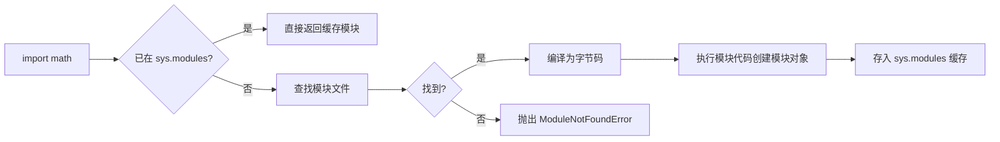
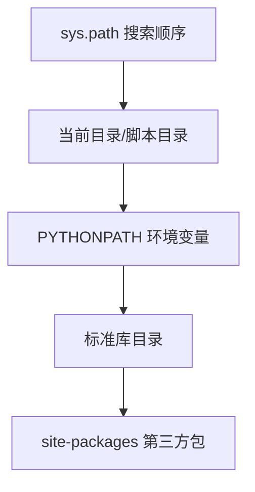

# 模块与包

当代码量变大后，把所有内容写在一个文件里会难以维护。**模块（Module）** 和 **包（Package）** 是 Python 组织代码、实现复用的核心机制。模块是一个 `.py` 文件，包是包含 `__init__.py` 的目录。

## 为什么需要模块

- **复用**：把常用功能封装成模块，多处导入使用，避免重复代码
- **组织**：按功能拆分文件，代码结构清晰、易于维护
- **隔离命名空间**：每个模块有独立的命名空间，避免名称冲突
- **可测试**：模块化后可以单独测试每个功能单元

## 模块的基本概念

### 模块就是一个 `.py` 文件

在 Python 中，任何一个 `.py` 文件都可以作为模块被导入。模块名就是文件名（去掉 `.py` 后缀）。

```python
# my_math.py —— 定义一个模块
def add(a, b):
    return a + b

def multiply(a, b):
    return a * b

PI = 3.14159
```

在其他文件中导入并使用：

```python
import my_math

print(my_math.add(2, 3))        # 5
print(my_math.PI)               # 3.14159
```

### 导入模块的几种方式

```python
# 1. import 模块名 —— 需通过模块名访问
import math
print(math.sqrt(16))            # 4.0

# 2. from 模块 import 名字 —— 直接导入指定名字
from math import sqrt
print(sqrt(16))                 # 4.0

# 3. from 模块 import 名字 as 别名 —— 起别名避免冲突
from math import sqrt as s
print(s(16))                    # 4.0

# 4. from 模块 import * —— 导入全部公开名字（不推荐，污染命名空间）
from math import *
```

### import 语句的执行过程



Python 的 `import` 会先检查 `sys.modules` 缓存，如果模块已被导入过则直接复用，不会重复执行模块代码。这也是"循环导入"问题的根源——两个模块互相导入时，可能拿到尚未初始化完成的模块对象。

### `sys.path` 与模块搜索路径

导入模块时，Python 按 `sys.path` 中的路径顺序查找：

```python
import sys
print(sys.path)
# 输出示例：['', '/usr/lib/python3.12', '/usr/lib/python3.12/site-packages', ...]
```

`sys.path` 包含：
1. 当前脚本所在目录（或交互环境当前目录）
2. `PYTHONPATH` 环境变量指定的路径
3. Python 安装目录、标准库路径
4. `site-packages`（第三方包安装目录）



### `__name__` 变量的作用

每个模块都有一个 `__name__` 变量：
- 当模块被**直接运行**时，`__name__ == '__main__'`
- 当模块被**导入**时，`__name__ == '模块名'`

利用这个特性，可以让一个文件既可作为脚本运行，也可作为模块导入：

```python
def main():
    print("程序入口")

if __name__ == '__main__':
    main()      # 只有直接运行时才执行
```

> 💡 **最佳实践**：把可执行逻辑放在 `if __name__ == '__main__':` 块中，这样模块被导入时不会意外执行，也便于测试。

## 包（Package）

当模块数量增多时，用**包**来组织模块。包是包含 `__init__.py` 文件的目录。

### 创建包

```
mypackage/
├── __init__.py      # 包的初始化文件（可为空）
├── math_tools.py    # 模块 1
└── str_tools.py     # 模块 2
```

```python
# __init__.py —— 可以为空，也可定义包的公开接口
from .math_tools import add
from .str_tools import reverse

__all__ = ['add', 'reverse']
```

### 导入包中的模块

```python
# 导入包下的模块
import mypackage.math_tools
mypackage.math_tools.add(1, 2)

# 从包导入模块
from mypackage import math_tools
math_tools.add(1, 2)

# 从包.模块导入函数
from mypackage.math_tools import add
add(1, 2)
```

### 相对导入 vs 绝对导入

在包内部，模块之间可以用相对导入（`.` 表示当前包，`..` 表示上级包）：

```python
# 绝对导入
from mypackage import math_tools

# 相对导入（推荐在包内部使用）
from . import math_tools       # 从当前包导入
from .math_tools import add    # 从当前包的模块导入
from ..other import func       # 从上级包导入
```

> ⚠️ **注意**：相对导入只能在包内部使用，直接运行包内的单个模块（`python mypackage/math_tools.py`）会失败。应通过包入口运行。

### 包的嵌套

包可以嵌套，形成层次结构：

```
project/
└── src/
    └── utils/
        ├── __init__.py
        ├── text/
        │   ├── __init__.py
        │   └── formatting.py
        └── data/
            ├── __init__.py
            └── loader.py
```

```python
from src.utils.text.formatting import trim
from src.utils.data import loader
```

## 常用内置模块

Python 标准库提供了丰富的内置模块，掌握常用模块能大幅提升效率：

| 模块 | 用途 | 常用接口 |
|------|------|---------|
| `math` | 数学运算 | `sqrt`、`ceil`、`floor`、`pow`、`pi` |
| `random` | 随机数 | `random`、`randint`、`choice`、`shuffle` |
| `datetime` | 日期时间 | `datetime`、`date`、`timedelta` |
| `os` | 操作系统接口 | `getcwd`、`listdir`、`path.join` |
| `sys` | 解释器相关 | `argv`、`path`、`exit`、`version` |
| `json` | JSON 处理 | `dumps`、`loads` |
| `re` | 正则表达式 | `match`、`search`、`findall`、`sub` |
| `collections` | 高级容器 | `Counter`、`defaultdict`、`namedtuple` |

```python
import math
import random
import datetime

print(math.floor(3.7))                    # 3
print(random.randint(1, 6))               # 1-6 随机整数
print(datetime.date.today())              # 今天日期
```

## 第三方模块安装

内置模块之外的第三方库，通过包管理器安装：

```bash
# 使用 pip 安装
pip install requests

# 安装指定版本
pip install requests==2.31.0

# 卸载
pip uninstall requests

# 查看已安装
pip list
```

安装后即可导入使用：

```python
import requests
resp = requests.get('https://api.example.com')
```

> 💡 **环境隔离**：建议为每个项目创建独立虚拟环境（`python -m venv venv`），避免第三方包版本冲突。详见 [02-开发环境与工具](02-开发环境与工具)。

## 常见陷阱

### 陷阱1：循环导入

两个模块互相导入会导致循环导入：

```python
# a.py
import b
def a_func():
    return b.b_func()

# b.py
import a          # 此时 a 可能尚未完全初始化
def b_func():
    return 'b'
```

**解决**：将公共代码抽到第三个模块，或在函数内部再导入。

```python
# a.py —— 延迟导入
def a_func():
    import b      # 函数内部导入，运行时才执行
    return b.b_func()
```

### 陷阱2：`from module import *` 导入过多

`import *` 会导入模块所有公开名字，容易污染命名空间、覆盖已有变量。可用 `__all__` 控制：

```python
# my_module.py
__all__ = ['public_func']   # 只允许导入 public_func

def public_func(): pass
def _private(): pass        # 下划线开头，约定为私有
```

### 陷阱3：修改模块后不生效

交互环境中，修改了 `.py` 文件后，再次 `import` 不会重新加载（模块已在 `sys.modules` 缓存）。需重启解释器或使用 `importlib.reload`：

```python
import importlib
import my_module
importlib.reload(my_module)
```

### 陷阱4：命名冲突

```python
# 避免与内置/常用名冲突
# list = []          # 覆盖了内置 list
# from math import *  # 可能意外覆盖已有名字
import math as m     # 用别名避免冲突
```

## 调试与检查技巧

```python
import sys

# 查看已导入的模块
print(sys.modules)

# 查看模块的搜索路径
print(sys.path)

# 查看模块的公开接口
import math
print([n for n in dir(math) if not n.startswith('_')])
```

## 常见问题解答

### Q: `ModuleNotFoundError` 怎么解决？
A: 常见原因：模块未安装、安装在其他虚拟环境、`sys.path` 未包含模块目录、文件名拼写错误。用 `pip list` 检查已安装，用 `print(sys.path)` 检查搜索路径。

### Q: `__init__.py` 可以为空吗？
A: 可以。Python 3.3+ 即使没有 `__init__.py` 也能作为包（命名空间包），但为了兼容性和明确性，建议保留空的 `__init__.py`。

### Q: 相对导入和绝对导入该用哪个？
A: 包内部模块间推荐用相对导入（更易维护），但要注意不能直接运行包内单个模块。

## 术语表

| 术语 | 英文 | 定义 |
|------|------|------|
| 模块 | Module | 一个 `.py` 文件，是 Python 组织代码的最小单元 |
| 包 | Package | 包含 `__init__.py` 的目录，用于组织多个模块 |
| 命名空间包 | Namespace Package | 无 `__init__.py` 的包（Python 3.3+） |
| 导入 | Import | 加载模块并使其名字可用 |
| `sys.path` | Module Search Path | 模块搜索路径列表 |
| `sys.modules` | Module Cache | 已导入模块的缓存字典 |

## 延伸阅读

- → [综合练习集](18-综合练习集) —— 练习九涉及模块的实际使用
- → [模块与标准库](../07-模块/01-Python模块) —— 深入理解 Python 的模块系统
- → [开发环境与工具](02-开发环境与工具) —— 虚拟环境与依赖管理

## 版本差异（Python 3.8-3.12 → 3.14）

| 特性 | 本文编写时 | Python 3.14 |
|------|-----------|-------------|
| 类型注解求值 | 运行时立即求值 | PEP 649/749 延迟求值：注解不再在定义时执行，解决前向引用，提升启动性能 |
| 字符串模板 | 普通 f-string / `str.format` | PEP 750 模板字符串 `t"..."`：可插值且能被安全处理（3.14 新特性） |
| 标准库多解释器 | 无官方支持 | PEP 734：`concurrent.interpreters` 模块支持在同一进程创建多个子解释器 |
| 调试 | 仅 Python 内建 pdb / IDE 调试 | PEP 768：安全的 CPython 外部调试器接口（custom debugger protocol） |
| 字节码与运行时 | 3.12 前无 JIT | 3.13 引入实验性 JIT（PEP 744）；3.14 进一步改进 free-threaded（无 GIL）构建 |
| `datetime` API | `utcnow()` 常用 | 3.12 起弃用，官方要求改用 `datetime.now(tz=datetime.UTC)`（aware 对象） |
| 压缩算法 | zlib / gzip / bz2 / lzma | 3.14 新增标准库 Zstandard 支持（PEP 784） |

> 本文讲解的语法与数据结构原理在 3.14 中依然成立；新项目建议基于 Python 3.13/3.14，并优先使用 aware datetime、PEP 649 注解与最新类型语法。
