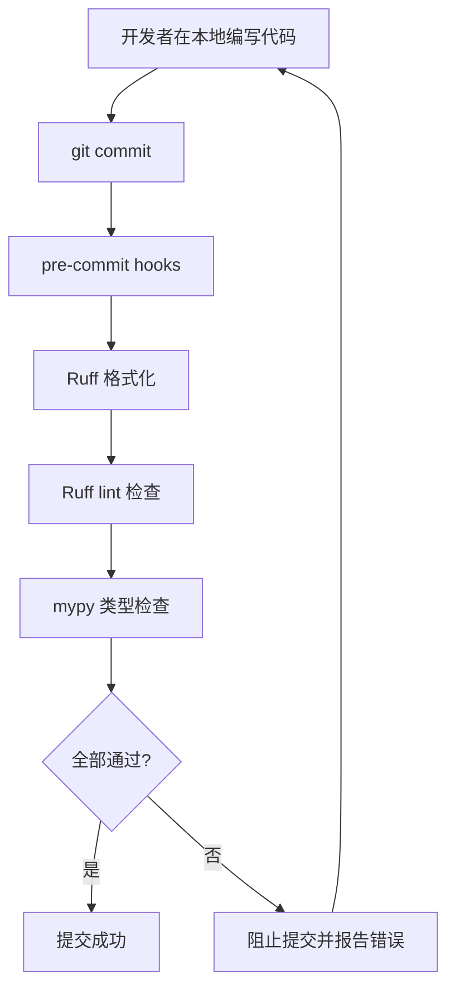
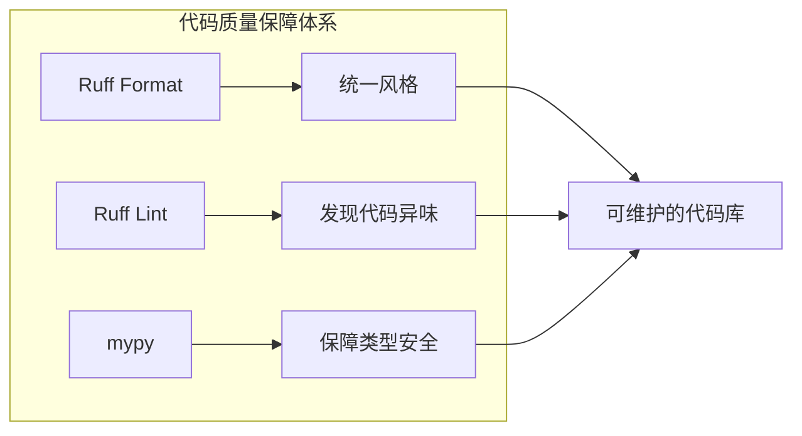
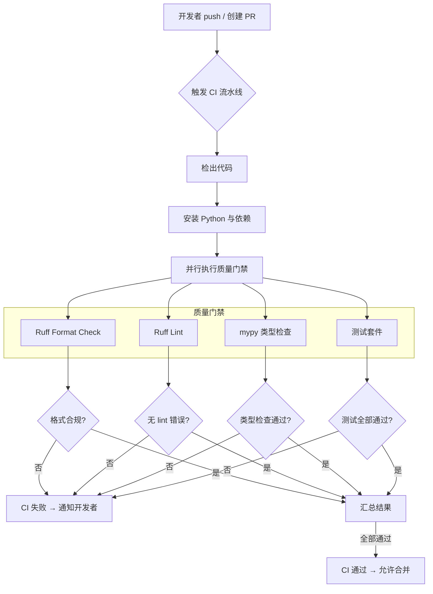

# 代码规范

## 概念说明

代码规范是一组关于命名、格式、结构和注释的约定。它不决定代码能不能跑，但决定团队成员看到对方代码时，是把精力花在理解逻辑上，还是花在猜测"这坨到底在写什么"上。

对于 1-3 年经验的开发者，代码规范最容易在被忽视的阶段埋下隐患：一个人写的小项目不需要规范也能跑，但一旦两个以上的人在同一仓库里持续提交代码、互相审查，缺乏规范的项目会迅速积累"风格噪音"——每个人的写法都不一样，评审时被迫逐行争议空格和命名，而不是讨论架构和逻辑。

Python 社区的代码规范以 **PEP 8** 为基准，但仅靠人工记忆和自觉遵守是不够的。现代工程实践的做法是：**用工具自动检查、自动格式化，把人从风格警察的角色里解放出来。**

## 为什么代码规范值得认真对待

规范不是一种审美偏好，而是工程约束。它直接影响到三条线：

**团队协作效率**。当所有人的代码看起来像同一个人写的，阅读他人代码的认知成本会显著下降。你不需要在每次 `import` 块里满屏跳跃去找某个模块来自哪里，因为你信任导入顺序是固定的；你不需要纠结某个变量是 `isActive` 还是 `is_active`，因为命名规则是确定的。

**代码审查成本**。没有规范的 PR 评审往往是这样的：50% 的时间在讨论"这里应该加个空格""这个函数名应该改成蛇形""这个 import 为什么放在最下面"，剩下 50% 的时间才真正评审逻辑。把风格问题交给工具自动处理之后，人工评审才能聚焦在架构、边界条件和业务正确性上。

**维护可持续性**。六个月后的你再回头看自己写的代码，其实和看别人写的代码差不多——你已经忘了当时的思路。一致的代码风格让这种"最熟悉的陌生代码"更容易被重新理解，进而降低重构和排查 bug 的阻力。

::: tip 关键认知
代码规范不是限制创造力，而是减少不必要的噪音。你仍然可以在架构、算法和设计模式上发挥创造力，但缩进用几个空格这种问题不应该成为创造力的战场。
:::

## PEP 8 核心规则速查

PEP 8 是 Python 官方风格指南，原文长达数十页。这里提炼日常开发中最常碰到、最容易被忽略的关键规则，按优先级排列。

### 命名规范

命名的核心原则是"一眼能看出它是什么"。

| 类型 | 规范 | 示例 |
|---|---|---|
| 模块/文件 | `snake_case`（全小写+下划线） | `user_service.py`, `email_utils.py` |
| 普通变量 | `snake_case` | `user_count`, `max_retries` |
| 函数/方法 | `snake_case` | `get_user_by_id()`, `calculate_total()` |
| 类 | `PascalCase`（首字母大写驼峰） | `UserRepository`, `OrderService` |
| 异常类 | `PascalCase`，且应以 `Error` 结尾 | `ValidationError`, `ConnectionTimeoutError` |
| 常量 | `UPPER_CASE` | `MAX_CONNECTIONS`, `DEFAULT_TIMEOUT` |
| 私有属性/方法 | 单下划线前缀 `_` | `_cache`, `_validate_input()` |
| 内部私有（防名称冲突） | 双下划线前缀 `__` | `__init_hooks()`（触发 name mangling） |
| 避免单字符 | 除 `i`/`j` 在紧凑循环中外，始终用有意义的名称 | `index` 优于 `i`（长循环）, `user` 优于 `u` |

::: warning 常见混淆
`snake_case` 用于变量、函数、模块；`PascalCase` 用于类；`UPPER_CASE` 用于常量。三者不可混用。见过有开发者把函数写成 `GetUserName()` 或把类写成 `user_service`，这是最容易被挑出来的规范问题。
:::

### 缩进与空格

```python
# 正确示例（Python 3.10+）
# 4 个空格缩进，不用 tab


def process_order(
    order_id: int,
    items: list[str],
    discount_rate: float = 0.0,
) -> dict[str, object]:
    """处理订单，续行使用悬挂缩进或与起始括号对齐。"""
    total = 0
    result = {
        "order_id": order_id,
        "items": items,
    }

    # 运算符两侧各一个空格
    final_total = total * (1 - discount_rate)

    # 函数参数中的默认值等号不加空格
    # 函数调用中关键字参数的等号也不加空格
    send_notification(order_id=order_id, message="已完成")

    return result | {"final_total": final_total}
```

关键要点汇总：

- **缩进永远是 4 个空格**，不要混用 tab。
- **二元运算符两侧各一个空格**（`=`, `+`, `-`, `*`, `==`, `is` 等）。
- **函数定义和调用中，关键字参数的 `=` 两侧不加空格**。
- **冒号后空一格**（切片除外），逗号后空一格。
- **顶级函数和类定义之间空两行**，类内方法之间空一行。

### 行长度与换行

- **建议每行不超过 79 字符**（PEP 8 原文建议用于代码行，docstring/注释为 72）。
- **实际工程中，99 字符是更常见的团队约定**（允许现代宽屏和 IDE 分栏布局，又不至于过长）。
- 优先用**括号内隐式续行**，避免用反斜杠 `\`：

```python
# 推荐：括号内隐式续行
result = some_function(
    argument_one,
    argument_two,
    argument_three,
)

# 不推荐：反斜杠续行（容易因为末尾空格而失效）
result = some_function(argument_one, argument_two, \
                       argument_three)

# 长字符串用隐式拼接
long_message = (
    "这是一个很长的消息，"
    "它被拆成了多行，"
    "Python 会自动拼接相邻的字符串字面量。"
)
```

### 导入顺序

导入必须分成三组，按顺序排列，组间用空行隔开：

1. **标准库**
2. **第三方库**
3. **本地模块**

每组内部按模块名字母顺序排列。绝对导入优先于相对导入。

```python
# 正确顺序示例
import os
import sys
from pathlib import Path

import requests
from pydantic import BaseModel

from myproject.config import settings
from myproject.services import UserService
```

::: danger 避免
永远不要使用 `from module import *`。它会污染命名空间，让静态分析和人类都无法确定某个名字来自哪里。唯一的例外是框架明确要求（如 Django settings），且应放在 `__all__` 的严格控制下。
:::

### 注释与文档字符串

注释的原则是"解释为什么，而不是重复代码在做什么"。

```python
# 差：重复代码
# 将 user_id 加 1
user_id += 1

# 好：解释原因
# 新 ID 从 10001 开始，避免与旧系统 ID 冲突
user_id += 1
```

- **行内注释**：`# ` 开头（井号后一个空格），与代码同级缩进。
- **块注释**：`# ` 开头的多行，每行缩进一致。
- **文档字符串（docstring）**：用三重双引号 `"""..."""`，放在模块、类、函数的第一行内部。对公共函数，建议用 Google 风格或 NumPy 风格书写参数与返回值说明。
- **TODO 注释**：用 `# TODO(name): 说明` 格式，标明负责人和待办内容，方便全局搜索。

## 自动化工具链

规范定得再好，如果全靠人工在 Code Review 里逐条核对，迟早会流于形式。自动化工具链的核心思路是：**能机器检查的绝不人肉检查，能自动修正的绝不手动调整。**

::: info 工具链关系
Ruff 是当前 Python 社区推荐的一站式方案（格式 + lint），但它不解决类型问题。类型检查需要 mypy 或 pyright。三者配合使用，覆盖代码质量的全部维度。
:::



### Ruff：一站式格式与 lint

[Ruff](https://docs.astral.sh/ruff/) 是 Rust 写的 Python linter 和 formatter，速度比传统工具链（flake8 + isort + black）快 10-100 倍。它统一了格式化与 lint 规则，并兼容大量 flake8 插件规则。

**安装**

```bash
pip install ruff
```

**常用命令**

```bash
# 检查代码问题
ruff check .

# 自动修复可修复的问题
ruff check --fix .

# 格式化代码
ruff format .

# 同时运行 check 和 format（推荐日常使用）
ruff check --fix . && ruff format .
```

### Black：纯格式化备选方案

[Black](https://black.readthedocs.io/) 是沿袭多年的"零配置 Python 格式化器"，设计哲学是"不给你选择，所有输出都一样"。在 Ruff 出现之前是社区事实标准，现在更多作为备选方案。如果你的团队已经投资了 Black 并配置了大量 CI 集成，切换到 Ruff 的优先级可以放低。

**对比要点**：

| 维度 | Ruff | Black |
|---|---|---|
| 速度 | 极快（Rust 实现） | 较慢（Python 实现） |
| 功能范围 | 格式 + lint | 仅格式化 |
| 配置集中度 | 全部在 `pyproject.toml` | 同样在 `pyproject.toml` |
| 社区迁移趋势 | 快速增长，官方推荐 | 成熟稳定，存量项目多 |
| 兼容性 | 默认与 Black 兼容，高 | 生态参照物 |

### mypy / pyright：类型检查

格式化只保证"看起来对"，类型检查保证"用起来也对"。

| 工具 | 实现语言 | 特点 | 适用场景 |
|---|---|---|---|
| [mypy](https://mypy.readthedocs.io/) | Python | 社区最成熟，生态最丰富 | 大多数项目默认选择 |
| [pyright](https://github.com/microsoft/pyright) | TypeScript | 微软开发，VSCode 内置 | VSCode 用户，大型项目 |

**mypy 基本使用**

```bash
pip install mypy
mypy src/          # 检查 src 目录下的所有文件
mypy --strict src/ # 开启严格模式
```

**mypy 与 Ruff 的分工**：Ruff 管代码风格（怎么写的），mypy 管类型安全（写的是什么）。两者不重叠，也不互相替代。



### pre-commit hooks 配置

`.pre-commit-config.yaml` 是 pre-commit 框架的配置文件，用于在每次 `git commit` 时自动运行检查。它的作用是让不规范代码根本进不了仓库。

```yaml
# .pre-commit-config.yaml
# 安装：pip install pre-commit && pre-commit install
repos:
  - repo: https://github.com/astral-sh/ruff-pre-commit
    rev: v0.11.0
    hooks:
      - id: ruff
        args: [--fix]
      - id: ruff-format

  - repo: https://github.com/pre-commit/mirrors-mypy
    rev: v1.15.0
    hooks:
      - id: mypy
        args: [--strict, --ignore-missing-imports]
        additional_dependencies:
          - types-requests
          - types-pyyaml

  - repo: https://github.com/pre-commit/pre-commit-hooks
    rev: v5.0.0
    hooks:
      - id: check-yaml
      - id: check-toml
      - id: check-json
      - id: end-of-file-fixer
      - id: trailing-whitespace
      - id: check-added-large-files
      - id: detect-private-key
```

关键说明：

- **ruff** 负责格式和 lint，在提交前自动修复可修复的问题。
- **mypy** 负责类型检查，配置 `--ignore-missing-imports` 避免因缺少第三方类型桩而误报。
- **pre-commit-hooks** 提供基础文件级检查：YAML/TOML/JSON 语法、行尾空格、文件末尾换行、大文件误提交、私钥泄露等。

## pyproject.toml 中配置 Ruff

现代 Python 项目统一使用 `pyproject.toml` 作为项目元数据和工具配置的中心文件。下面是 Ruff 的完整配置示例。

```toml
# pyproject.toml —— Ruff 配置段

[tool.ruff]
# 目标 Python 版本（当前最新稳定版 3.14，兼容旧版可下调）
target-version = "py314"

# 单行最大长度（与 Black 兼容）
line-length = 99

# 需要检查的目录
src = ["src", "tests"]

[tool.ruff.lint]
# 启用规则集
select = [
    "E",     # pycodestyle errors
    "W",     # pycodestyle warnings
    "F",     # Pyflakes（未使用导入、未定义变量等）
    "I",     # isort（导入排序）
    "N",     # pep8-naming（命名规范）
    "B",     # flake8-bugbear（常见 bug 检查）
    "C4",    # flake8-comprehensions（推导式优化）
    "UP",    # pyupgrade（现代语法升级）
    "SIM",   # flake8-simplify（代码简化建议）
    "T20",   # flake8-print（禁止遗留 print 语句）
]

# 忽略特定规则
ignore = [
    "E501",  # 行长度交给 formatter 处理
]

# pydocstyle 设置（文档字符串）
[tool.ruff.lint.pydocstyle]
convention = "google"

[tool.ruff.format]
# 格式化设置
quote-style = "double"
indent-style = "space"
skip-magic-trailing-comma = false
line-ending = "auto"
```

配置要点解读：

- `target-version = "py314"` 告诉 Ruff 按 Python 3.14 语法标准处理，确保不会建议向下不兼容的写法；若项目需兼容旧版本，可下调为 `py312`/`py310` 等。
- `select` 中的规则集涵盖了命名、导入、潜在 bug、现代语法升级等所有日常高频问题。
- `ignore = ["E501"]` 是常见做法：行长度约束交给 `ruff format` 的 formatter 统一处理，lint 不再重复报错。
- `convention = "google"` 指定 docstring 风格为 Google 风格，与许多团队的 API 文档生成工具（如 mkdocstrings）保持一致。

## CI 中的代码质量检查流水线

将本地工具链嵌入 CI 流水线之后，代码规范不再依赖个人自觉，而是成为每次提交和合并请求的硬性门禁。



对应的 GitHub Actions 配置如下：

```yaml
# .github/workflows/quality.yml
name: Code Quality

on:
  push:
    branches: [main]
  pull_request:

jobs:
  quality:
    runs-on: ubuntu-latest

    steps:
      - uses: actions/checkout@v4

      - name: Set up Python
        uses: actions/setup-python@v5
        with:
          python-version: "3.12"

      - name: Install dependencies
        run: |
          python -m pip install --upgrade pip
          pip install ruff mypy

      - name: Ruff Format Check
        run: ruff format --check .

      - name: Ruff Lint
        run: ruff check .

      - name: Mypy Type Check
        run: mypy src/ --strict --ignore-missing-imports
```

::: tip 流水线设计原则
质量门禁中的每个步骤保持独立，便于快速定位失败原因。不要把所有检查写在一个 shell 脚本里然后只报告"something failed"——那样排查起来和没有 CI 差不多痛苦。
:::

## 常见陷阱

| 陷阱 | 表现 | 后果 | 正确做法 |
|---|---|---|---|
| 仅依赖 IDE 自动格式化 | 每个人 IDE 不同（VSCode / PyCharm / Vim），格式化配置也各异 | 同一文件在不同人机器上来回改变格式，diff 全是噪声 | 项目级配置 Ruff/Black，pre-commit 强制统一，IDE 设置仅为辅助 |
| 忽略类型检查 | 项目只跑了 lint 和 format，跳过 mypy/pyright | 运行时因为类型不匹配报错，而这些错误静态检查本可以在提交前发现 | 从第一天起就把 mypy 或 pyright 加入工具链，即使初期用宽松配置 |
| CI 与本地配置不一致 | CI 用的 Ruff 版本、规则集和本地不同 | 本地通过 CI 报错，或反过来，浪费时间排查环境差异 | 用 `pre-commit` 和 `pyproject.toml` 锁定规则，本地和 CI 共用同一份配置 |
| 一次性加齐所有规则 | 在遗留项目上直接启用全部 lint 规则 | 上千条报错，团队心态崩溃，最后关掉 lint | 逐步启用规则集，每次只新增 1-2 组，修完再继续 |
| 配置分散在多处 | Ruff 配在 `pyproject.toml`，flake8 配在 `.flake8`，isort 配在 `setup.cfg` | 维护时不知道该改哪个，新成员接手成本极高 | 全部收敛到 `pyproject.toml`，减少配置文件的散落 |

## 最佳实践

### 项目初期就配置好工具链

很多团队的习惯是"等项目稳定了再加规范"。这种策略的问题在于，不规范代码的积累速度远超预期——当你决定引入工具链时，可能要修几百上千条历史问题，修复过程还会引入新的逻辑 bug。

建议的节奏是：

1. **创建仓库当天**就加入 `pyproject.toml`、`.pre-commit-config.yaml` 和 `.editorconfig`。
2. **第一个功能分支**上运行 `ruff format .`，从第一天就统一风格。
3. lint 规则可以**从宽松到严格**逐步收紧，但绝不留白。
4. 类型检查可以从 `mypy` 的默认配置开始，后续逐步启用 `--strict`。

### 团队统一编辑器配置

`.editorconfig` 文件让不同编辑器和 IDE 在基础设置上保持一致——缩进风格、编码、行尾字符等。它不替代 Ruff/Black，但补上了工具链覆盖不到的底层编辑器行为。

```ini
# .editorconfig
root = true

[*]
charset = utf-8
end_of_line = lf
indent_style = space
indent_size = 4
insert_final_newline = true
trim_trailing_whitespace = true

[*.{yml,yaml}]
indent_size = 2

[Makefile]
indent_style = tab

[*.md]
trim_trailing_whitespace = false
```

### 分工明确：工具检查 vs 人工审查

将代码审查的关注点分离，是效率提升最直接的手段。

| 检查项 | 负责方 | 工具 |
|---|---|---|
| 格式（缩进、空格、引号） | 工具自动 | Ruff format |
| 导入顺序、未使用导入 | 工具自动 | Ruff lint（`I`, `F` 规则） |
| 命名规范 | 工具自动 | Ruff lint（`N` 规则） |
| 潜在 bug 模式 | 工具自动 | Ruff lint（`B`, `SIM` 规则） |
| 类型安全 | 工具自动 | mypy / pyright |
| 架构合理性 | 人工审查 | 无替代 |
| 业务逻辑正确性 | 人工审查 | 无替代 |
| 可读性与设计意图 | 人工审查 | 无替代 |

机器能做的事，不要让人类在 CR 里逐行检查。人工审查应该聚焦在架构层面——数据流是否合理、边界条件是否覆盖、设计选择是否可维护——这些是任何工具都做不好的。

## 术语表

| 术语 | 说明 |
|---|---|
| PEP 8 | Python Enhancement Proposal 8，Python 官方代码风格指南 |
| Lint / Linter | 静态分析工具，检查代码中的潜在错误、风格问题和代码异味 |
| Formatter | 自动格式化工具，按既定规则重新排版代码，不改变逻辑 |
| pre-commit hook | Git 钩子，在 `git commit` 之前自动执行检查脚本 |
| pyproject.toml | Python 项目元数据和工具配置的统一文件（PEP 518/621） |
| snake_case | 蛇形命名法，全小写+下划线分隔，用于变量、函数、模块 |
| PascalCase | 帕斯卡命名法，每个单词首字母大写，用于类名 |
| 隐式续行 | 利用括号 `()`、`[]`、`{}` 使表达式跨行，优于反斜杠续行 |
| 类型桩（Type Stub） | `.pyi` 文件或 `types-*` 包，为无注解的第三方库提供类型信息 |
| name mangling | Python 对双下划线前缀名称的变形机制，避免子类属性冲突 |
| CI | 持续集成（Continuous Integration），自动化验证每次代码提交的质量 |

## 版本说明

- **PEP 8 背景**：最早发布于 2001 年，由 Guido van Rossum 等人共同编写，是 Python 社区最长寿的基础规范之一。
- **Python 3.12+**：本文所有代码示例基于 Python 3.12+ 语法编写（使用 `X | Y` 联合类型、`list[str]` 内建泛型等现代语法），当前推荐使用最新稳定版 3.13/3.14。
- **Ruff**：2022 年底首次发布，到 2025 年已成为 Python 生态推荐的一站式 lint + format 工具，替代 flake8、isort、pyupgrade、Black 等传统工具组合。
- **mypy**：2012 年开始活跃，是 Python 类型检查的事实标准。
- **pyproject.toml**：自 PEP 518（2016）和 PEP 621（2020）后成为 Python 项目配置的标准方式。
- **兼容性提示**：如果你的项目需要兼容 Python 3.8/3.9，应将 Ruff 的 `target-version` 设置为对应版本，并使用 `from __future__ import annotations` 及传统类型注解语法。

## 延伸阅读

- PEP 8 — Style Guide for Python Code：https://peps.python.org/pep-0008/
- PEP 257 — Docstring Conventions：https://peps.python.org/pep-0257/
- Ruff 官方文档：https://docs.astral.sh/ruff/
- Black 官方文档：https://black.readthedocs.io/
- mypy 官方文档：https://mypy.readthedocs.io/
- pre-commit 框架：https://pre-commit.com/
- EditorConfig 规范：https://editorconfig.org/
- Google Python Style Guide：https://google.github.io/styleguide/pyguide.html
- Python Packaging User Guide（pyproject.toml 说明）：https://packaging.python.org/en/latest/guides/writing-pyproject-toml/

## 版本差异（工程化 → Python 3.13/3.14）

| 特性 | 本文编写时 | 当前 |
|------|-----------|------|
| Python 基线 | 3.8-3.12 | 3.14（最新稳定版，3.9- 已全部 EOL） |
| 包管理 | pip/poetry | `uv` 成为新一代工具（极快）；`pyproject.toml` 为事实标准 |
| 类型检查 | mypy | Pyright/Pylance 为主流；mypy 持续更新 |
| 格式化 | Black/isort | `ruff format` 一体化（Rust 实现） |
| 测试 | pytest 7 | pytest 8.x |
| 构建 | setuptools | 3.12+ `pyproject.toml` 构建后端成熟（Hatchling/Flit） |

> 本文讲解的工程化最佳实践（规范、注解、测试、打包、结构）与 Python 3.14 完全兼容；建议新项目使用 `uv` + `ruff` + `pyproject.toml` 组合。
