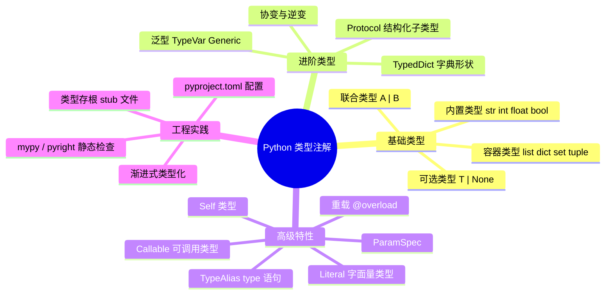
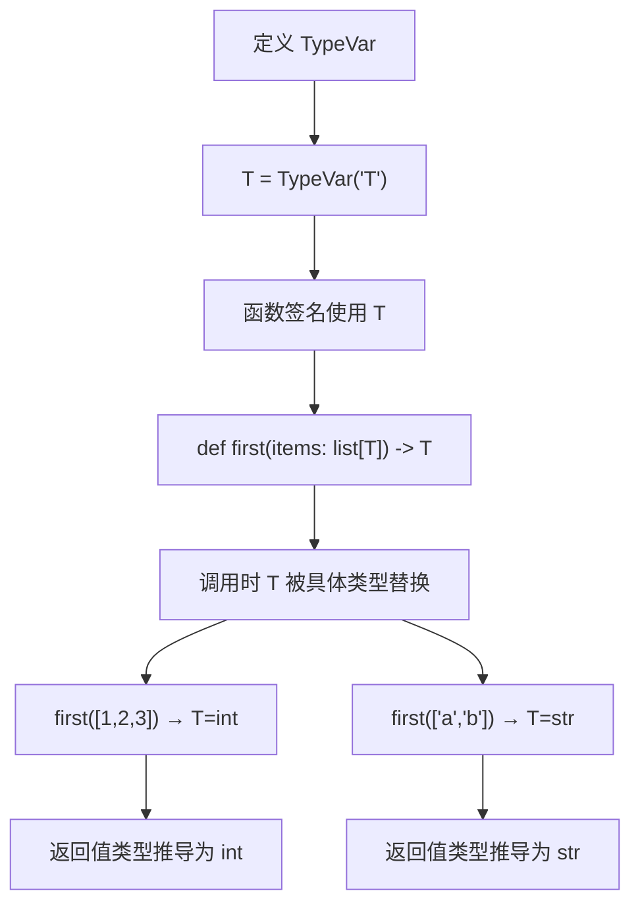
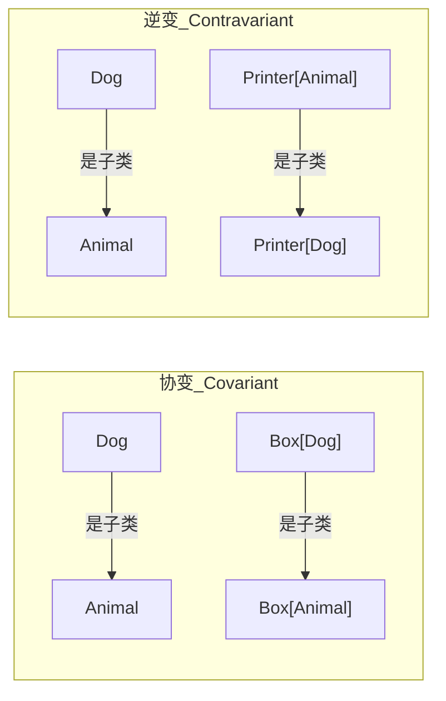
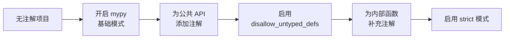

# 类型注解

类型注解是写在变量、函数参数、返回值和数据结构上的类型信息，用来表达"这个值应该是什么形状"。它默认不会替你做运行时校验，但能显著提升可读性、编辑器提示、重构安全性以及静态检查质量。对于 Python 3.12+ 项目，类型注解已经不是锦上添花，而是工程协作的基础设施之一。

> 阅读提示

- 如果你只想快速上手，直接看[基础类型注解](#基础类型注解)和[实战场景一](#场景一api-响应的类型安全处理)
- 如果你想理解泛型、Protocol 等进阶内容，从[泛型编程](#泛型编程)开始
- 如果你已经在用类型注解但想查最佳实践，跳到[常见陷阱](#常见陷阱)和[最佳实践速查表](#最佳实践速查表)
- 本文所有代码基于 **Python 3.12+**，采用现代语法

## 类型系统全景



## 基础类型注解

### 变量注解

```python
# 基本类型
name: str = "Alice"
age: int = 30
score: float = 95.5
active: bool = True

# 容器类型（Python 3.9+ 内建泛型，不再需要 typing.List）
names: list[str] = ["Alice", "Bob"]
scores: dict[str, int] = {"math": 95, "english": 88}
unique_ids: set[int] = {1, 2, 3}
coordinates: tuple[float, float] = (39.9, 116.4)

# 固定长度元组：每个位置可以不同类型
record: tuple[int, str, float] = (1, "Alice", 95.5)
```

::: tip 优先使用内建泛型
Python 3.9+ 支持直接写 `list[str]`、`dict[str, int]`，不再需要 `typing.List[str]`、`typing.Dict[str, int]`。新项目应统一使用内建泛型写法。
:::

### 函数注解

```python
def greet(name: str, times: int = 1) -> str:
    """返回问候语字符串"""
    return ", ".join([f"Hello, {name}!"] * times)

# 可选参数与可选返回值
def find_user(user_id: int) -> str | None:
    """查找用户名，找不到返回 None"""
    users: dict[int, str] = {1: "Alice", 2: "Bob"}
    return users.get(user_id)

# 多返回值
def split_name(full_name: str) -> tuple[str, str]:
    """拆分全名为姓和名"""
    parts = full_name.split(" ", 1)
    return parts[0], parts[-1]
```

### 现代语法速查

| 旧写法（Python 3.8） | 新写法（Python 3.10+） | 说明 |
|---|---|---|
| `Optional[str]` | `str \| None` | 可选类型 |
| `Union[str, int]` | `str \| int` | 联合类型 |
| `List[str]` | `list[str]` | 内建泛型 |
| `Dict[str, int]` | `dict[str, int]` | 内建泛型 |
| `Tuple[int, str]` | `tuple[int, str]` | 内建泛型 |
| `Callable[[int], str]` | `Callable[[int], str]` | 仍需 typing |

## 泛型编程

泛型让你编写"适用于多种类型、但保持类型安全"的代码。这是类型注解中最核心也最容易被误用的部分。

### TypeVar：类型变量



```python
from typing import TypeVar

# 定义类型变量
T = TypeVar("T")


def first(items: list[T]) -> T:
    """返回列表的第一个元素，保持元素类型"""
    if not items:
        raise ValueError("列表不能为空")
    return items[0]


# 调用时 T 自动推导
number = first([1, 2, 3])  # 推导: T = int → 返回 int
name = first(["Alice", "Bob"])  # 推导: T = str → 返回 str
```

**关键点**：同一个函数调用中，`T` 的所有出现必须是同一个类型。`first([1, 2, 3])` 中 `T=int`，所以参数必须是 `list[int]`，返回值也是 `int`。

### 多个 TypeVar

```python
K = TypeVar("K")
V = TypeVar("V")


def get_or_default(mapping: dict[K, V], key: K, default: V) -> V:
    """从字典获取值，找不到则返回默认值"""
    return mapping.get(key, default)


# K=str, V=int
result = get_or_default({"a": 1, "b": 2}, "a", 0)  # 返回 int
# K=str, V=list[str]
items = get_or_default({"x": ["a", "b"]}, "x", [])  # 返回 list[str]
```

### Generic：泛型类

当你需要创建一个容器类或工具类，它能处理多种类型的数据时，使用 `Generic`：

```python
from typing import TypeVar, Generic

T = TypeVar("T")


class Stack(Generic[T]):
    """类型安全的栈实现"""

    def __init__(self) -> None:
        self._items: list[T] = []

    def push(self, item: T) -> None:
        self._items.append(item)

    def pop(self) -> T:
        if not self._items:
            raise IndexError("栈为空")
        return self._items.pop()

    def peek(self) -> T | None:
        return self._items[-1] if self._items else None

    def __len__(self) -> int:
        return len(self._items)


# 使用时指定具体类型
num_stack: Stack[int] = Stack()
num_stack.push(42)
num_stack.push(7)
value: int = num_stack.pop()  # 类型检查器知道返回 int

str_stack: Stack[str] = Stack()
str_stack.push("hello")
word: str = str_stack.pop()  # 类型检查器知道返回 str
```

### bounded TypeVar：约束类型范围

```python
from typing import TypeVar
from decimal import Decimal

# 值约束：T 只能取 int/float/Decimal 三种类型之一（支持算术运算）
Number = TypeVar("Number", int, float, Decimal)


def clamp(value: Number, min_val: Number, max_val: Number) -> Number:
    """将值限制在范围内"""
    return max(min_val, min(value, max_val))


clamp(5, 0, 10)  # ✅ int 满足约束
clamp(3.14, 0.0, 1.0)  # ✅ float 满足约束
# clamp("hello", "a", "z")  # ❌ str 不满足约束
```

### 协变与逆变（高级）

这是泛型中最难理解的概念。简单来说：

- **协变（Covariant）**：子类型关系保持方向。`Dog` 是 `Animal` 的子类 → `list[Dog]` 是 `list[Animal]` 的子类（列表是协变的）
- **逆变（Contravariant）**：子类型关系反转。`Dog` 是 `Animal` 的子类 → `Printer[Animal]` 是 `Printer[Dog]` 的子类



```python
from typing import TypeVar, Generic

# 协变：生产者（只读容器）用 covariant=True
T_co = TypeVar("T_co", covariant=True)


class ReadOnlyBox(Generic[T_co]):
    """只读容器：协变"""
    def __init__(self, value: T_co) -> None:
        self._value = value

    def get(self) -> T_co:
        return self._value


# 逆变：消费者（只写容器）用 contravariant=True
T_contra = TypeVar("T_contra", contravariant=True)


class WriteOnlySink(Generic[T_contra]):
    """只写容器：逆变"""
    def __init__(self) -> None:
        self._items: list[object] = []

    def put(self, item: T_contra) -> None:
        self._items.append(item)
```

::: tip 何时需要关心协变/逆变
大多数日常开发不需要手动声明协变/逆变。只有在你设计**泛型容器类**或**泛型协议**时才需要考虑。如果你不确定，直接用普通 `TypeVar` 就好。
:::

## Protocol：结构化子类型

`Protocol` 是 Python 类型系统中最重要的特性之一。它让你基于"行为"而非"继承"定义接口，类似于 Go 语言的接口和 Rust 的 trait。

### 为什么需要 Protocol

```python
# 传统做法：抽象基类
from abc import ABC, abstractmethod


class Drawable(ABC):
    @abstractmethod
    def draw(self) -> None: ...


class Circle(Drawable):  # 必须显式继承
    def draw(self) -> None:
        print("Drawing circle")


# 问题：已有类无法被识别为 Drawable
class LegacyShape:  # 没有继承 Drawable
    def draw(self) -> None:
        print("Drawing legacy shape")


def render(shape: Drawable) -> None:
    shape.draw()


render(Circle())  # ✅
# render(LegacyShape())  # ❌ 类型检查报错，但运行时完全正常！
```

```python
# 现代做法：Protocol
from typing import Protocol


class Drawable(Protocol):
    def draw(self) -> None: ...


class Circle:  # 不需要继承 Drawable
    def draw(self) -> None:
        print("Drawing circle")


class LegacyShape:  # 也不需要继承
    def draw(self) -> None:
        print("Drawing legacy shape")


def render(shape: Drawable) -> None:
    shape.draw()


render(Circle())  # ✅
render(LegacyShape())  # ✅ 只要有 draw() 方法就行
```

### Protocol 实战：依赖注入与测试替身

```python
from typing import Protocol
from dataclasses import dataclass


class EmailSender(Protocol):
    """发送邮件的协议接口"""
    def send(self, to: str, subject: str, body: str) -> None: ...


@dataclass
class NotificationService:
    """通知服务：依赖邮件发送协议"""
    email_sender: EmailSender

    def notify_user(self, email: str, message: str) -> None:
        self.email_sender.send(
            to=email,
            subject="系统通知",
            body=message,
        )


# 生产实现
class SmtpEmailSender:
    def __init__(self, host: str, port: int) -> None:
        self.host = host
        self.port = port

    def send(self, to: str, subject: str, body: str) -> None:
        print(f"SMTP -> {to}: [{subject}] {body}")


# 测试替身
class FakeEmailSender:
    def __init__(self) -> None:
        self.sent: list[tuple[str, str, str]] = []

    def send(self, to: str, subject: str, body: str) -> None:
        self.sent.append((to, subject, body))


# 生产环境
service = NotificationService(email_sender=SmtpEmailSender("smtp.example.com", 587))
service.notify_user("user@example.com", "订单已发货")

# 测试环境
fake = FakeEmailSender()
test_service = NotificationService(email_sender=fake)
test_service.notify_user("test@example.com", "测试消息")
assert len(fake.sent) == 1
assert fake.sent[0][0] == "test@example.com"
```

### Protocol vs ABC 对比

| 对比维度 | `Protocol` | `abc.ABC` |
|---|---|---|
| 类型检查方式 | 结构化（看行为） | 名义化（看继承） |
| 侵入性 | 低，不需要继承 | 高，必须显式继承 |
| 第三方类适配 | 天然支持 | 需要注册或包装 |
| 运行时约束 | 默认较弱 | 可显式强约束 |
| 适用场景 | 接口抽象、依赖注入 | 需要强制继承体系的框架 |

## TypedDict：字典形状描述

当函数接收或返回一个"固定键"的字典时，`TypedDict` 让类型检查器知道哪些键必须存在、值是什么类型。

### 基础用法

```python
from typing import TypedDict


class UserInfo(TypedDict):
    name: str
    age: int
    email: str


def create_user(info: UserInfo) -> None:
    print(f"创建用户: {info['name']}, 年龄: {info['age']}, 邮箱: {info['email']}")


# ✅ 所有必需字段都提供
create_user({"name": "Alice", "age": 30, "email": "alice@example.com"})

# ❌ 缺少字段会被类型检查器捕获
# create_user({"name": "Bob"})  # 缺少 age 和 email
```

### 可选字段

```python
from typing import TypedDict, NotRequired


class UserPayload(TypedDict):
    id: int
    name: str
    email: NotRequired[str]  # 可选字段
    avatar: NotRequired[str]  # 可选字段


def process_user(user: UserPayload) -> None:
    print(f"处理用户: {user['name']}")
    # 可选字段需要用 .get() 访问
    email = user.get("email", "未设置")
    print(f"  邮箱: {email}")


# ✅ 不提供可选字段
process_user({"id": 1, "name": "Alice"})
# ✅ 提供可选字段
process_user({"id": 2, "name": "Bob", "email": "bob@example.com"})
```

### 实战：API 响应类型化

```python
from typing import TypedDict, NotRequired


class PaginationMeta(TypedDict):
    page: int
    per_page: int
    total: int


class ArticleItem(TypedDict):
    id: int
    title: str
    author: str
    summary: NotRequired[str]


class ArticleListResponse(TypedDict):
    status: str
    data: list[ArticleItem]
    meta: PaginationMeta


def parse_article_response(response: ArticleListResponse) -> list[str]:
    """从 API 响应中提取文章标题列表"""
    if response["status"] != "ok":
        return []
    return [item["title"] for item in response["data"]]


# 模拟 API 响应
mock_response: ArticleListResponse = {
    "status": "ok",
    "data": [
        {"id": 1, "title": "Python 类型注解", "author": "Alice"},
        {"id": 2, "title": "深入理解泛型", "author": "Bob", "summary": "泛型进阶指南"},
    ],
    "meta": {"page": 1, "per_page": 10, "total": 2},
}

titles = parse_article_response(mock_response)
print(titles)  # ['Python 类型注解', '深入理解泛型']
```

## @overload：函数重载

当一个函数根据参数类型返回不同类型的值时，`@overload` 让类型检查器理解这种多态：

```python
from typing import overload


@overload
def process(value: int) -> str: ...
@overload
def process(value: str) -> int: ...
@overload
def process(value: bytes) -> float: ...


def process(value: int | str | bytes) -> str | int | float:
    """根据输入类型返回不同类型的结果"""
    if isinstance(value, int):
        return f"数字: {value}"
    elif isinstance(value, str):
        return len(value)
    else:
        return len(value) * 0.5


# 类型检查器能推导出精确的返回类型
result1: str = process(42)  # 推导返回 str
result2: int = process("hello")  # 推导返回 int
result3: float = process(b"hello")  # 推导返回 float
```

### 实战：灵活的查询接口

```python
from typing import overload, Sequence


@overload
def query_user(user_id: int) -> dict[str, str] | None: ...
@overload
def query_user(user_id: Sequence[int]) -> list[dict[str, str]]: ...


def query_user(
    user_id: int | Sequence[int],
) -> dict[str, str] | None | list[dict[str, str]]:
    """
    查询用户：传入单个 ID 返回单个用户或 None，
    传入 ID 列表返回用户列表。
    """
    db: dict[int, dict[str, str]] = {
        1: {"name": "Alice", "email": "alice@example.com"},
        2: {"name": "Bob", "email": "bob@example.com"},
    }

    if isinstance(user_id, int):
        return db.get(user_id)
    else:
        return [db[uid] for uid in user_id if uid in db]


# 单个查询：返回值可能是 None
user = query_user(1)  # 推导: dict[str, str] | None
if user is not None:
    print(user["name"])

# 批量查询：返回值是列表
users = query_user([1, 2, 3])  # 推导: list[dict[str, str]]
for u in users:
    print(u["name"])
```

## 其他重要类型工具

### Literal：字面量类型

```python
from typing import Literal


def set_log_level(level: Literal["DEBUG", "INFO", "WARNING", "ERROR"]) -> None:
    """设置日志级别，只允许特定字符串值"""
    print(f"日志级别设置为: {level}")


set_log_level("INFO")  # ✅
# set_log_level("VERBOSE")  # ❌ 类型检查器报错


# 配合联合类型使用
Mode = Literal["r", "w", "a", "rb", "wb"]


def open_file(path: str, mode: Mode = "r") -> None:
    print(f"打开文件: {path}, 模式: {mode}")
```

### Callable：可调用类型

```python
from typing import Callable


def apply_transform(
    data: list[int],
    transform: Callable[[int], int],
) -> list[int]:
    """对列表中每个元素应用变换函数"""
    return [transform(x) for x in data]


# 变换函数签名：(int) -> int
doubled = apply_transform([1, 2, 3], lambda x: x * 2)
print(doubled)  # [2, 4, 6]


# 带默认值和关键字的回调
EventHandler = Callable[[str, dict[str, str]], None]


def register_handler(handler: EventHandler) -> None:
    """注册事件处理器"""
    handler("click", {"button": "submit"})


def on_event(event_type: str, payload: dict[str, str]) -> None:
    print(f"事件: {event_type}, 数据: {payload}")


register_handler(on_event)
```

### Self 类型

当一个方法返回自身类型的实例时（特别是继承场景），使用 `Self`：

```python
from typing import Self


class Builder:
    """建造者模式：每个方法返回 self 以支持链式调用"""

    def __init__(self) -> None:
        self._parts: list[str] = []

    def add_part(self, part: str) -> Self:
        self._parts.append(part)
        return self

    def build(self) -> str:
        return " + ".join(self._parts)


result = Builder().add_part("引擎").add_part("轮子").add_part("车身").build()
print(result)  # 引擎 + 轮子 + 车身
```

### type 语句（Python 3.12+）

```python
# Python 3.12 新语法：type 语句定义类型别名
type Vector = list[float]
type Matrix = list[Vector]
type UserID = int
type Username = str

# 泛型类型别名
type Pair[T] = tuple[T, T]
type Result[T, E] = T | E

# 使用
def dot_product(a: Vector, b: Vector) -> float:
    return sum(x * y for x, y in zip(a, b))

def divide(a: float, b: float) -> Result[float, str]:
    if b == 0:
        return "除数不能为零"
    return a / b
```

### ParamSpec：参数规格传递

当你编写装饰器时，需要保留被装饰函数的参数签名，`ParamSpec` 是关键工具：

```python
from typing import ParamSpec, TypeVar, Callable
import time
import functools

P = ParamSpec("P")
R = TypeVar("R")


def timing(func: Callable[P, R]) -> Callable[P, R]:
    """计时装饰器：保留原函数的参数签名"""
    @functools.wraps(func)
    def wrapper(*args: P.args, **kwargs: P.kwargs) -> R:
        start = time.perf_counter()
        result = func(*args, **kwargs)
        duration = time.perf_counter() - start
        print(f"{func.__name__} 耗时: {duration:.4f}s")
        return result
    return wrapper


@timing
def fetch_data(url: str, timeout: int = 30) -> dict[str, str]:
    """模拟网络请求"""
    time.sleep(0.1)
    return {"url": url, "status": "ok"}


# 类型检查器知道 fetch_data 的签名仍然是 (url: str, timeout: int = 30) -> dict[str, str]
data = fetch_data("https://example.com", timeout=10)
```

## 实战场景

### 场景一：API 响应的类型安全处理

```python
from typing import TypedDict, NotRequired, Literal
from dataclasses import dataclass


# 定义 API 响应结构
class ErrorResponse(TypedDict):
    code: int
    message: str


class SuccessResponse(TypedDict):
    code: Literal[0]
    data: list[dict[str, str]]
    total: int


type ApiResponse = SuccessResponse | ErrorResponse


def handle_response(response: ApiResponse) -> list[str]:
    """处理 API 响应，返回用户名列表或抛出异常"""
    if response["code"] != 0:
        # 类型缩窄：此处 response 一定是 ErrorResponse
        raise RuntimeError(f"请求失败: {response['message']}")

    # 类型缩窄：此处 response 一定是 SuccessResponse
    return [item["name"] for item in response["data"]]


# 测试
ok: ApiResponse = {"code": 0, "data": [{"name": "Alice"}, {"name": "Bob"}], "total": 2}
print(handle_response(ok))  # ['Alice', 'Bob']

err: ApiResponse = {"code": 404, "message": "未找到"}
# handle_response(err)  # 抛出 RuntimeError
```

### 场景二：类型安全的配置系统

```python
from typing import TypeVar, Callable, Any, Protocol
from dataclasses import dataclass, field


class ConfigSource(Protocol):
    """配置源协议"""
    def get(self, key: str) -> str | None: ...


@dataclass
class EnvConfigSource:
    """环境变量配置源"""
    prefix: str = "APP_"

    def get(self, key: str) -> str | None:
        import os
        return os.getenv(f"{self.prefix}{key.upper()}")


@dataclass
class DictConfigSource:
    """字典配置源（测试用）"""
    data: dict[str, str] = field(default_factory=dict)

    def get(self, key: str) -> str | None:
        return self.data.get(key)


T = TypeVar("T")


@dataclass
class ConfigBuilder:
    """类型安全的配置构建器"""
    source: ConfigSource

    def get(self, key: str, cast: Callable[[str], T], default: T | None = None) -> T:
        """获取配置值并转换类型"""
        value = self.source.get(key)
        if value is None:
            if default is not None:
                return default
            raise KeyError(f"配置项 '{key}' 未设置")
        return cast(value)

    def get_str(self, key: str, default: str | None = None) -> str:
        return self.get(key, str, default)

    def get_int(self, key: str, default: int | None = None) -> int:
        return self.get(key, int, default)

    def get_bool(self, key: str, default: bool | None = None) -> bool:
        def parse_bool(s: str) -> bool:
            return s.lower() in ("true", "1", "yes")
        return self.get(key, parse_bool, default)


# 使用
config = ConfigBuilder(source=DictConfigSource(data={
    "DATABASE_URL": "postgresql://localhost/mydb",
    "PORT": "8080",
    "DEBUG": "true",
}))

db_url: str = config.get_str("DATABASE_URL")
port: int = config.get_int("PORT")
debug: bool = config.get_bool("DEBUG")
print(f"数据库: {db_url}, 端口: {port}, 调试: {debug}")
```

### 场景三：类型安全的注册表模式

```python
from typing import TypeVar, Generic, Callable
from dataclasses import dataclass, field


T = TypeVar("T")


@dataclass
class Registry(Generic[T]):
    """类型安全的注册表：按名称注册和获取处理器"""
    _handlers: dict[str, type[T]] = field(default_factory=dict)

    def register(self, name: str) -> Callable[[type[T]], type[T]]:
        """注册装饰器"""
        def decorator(cls: type[T]) -> type[T]:
            self._handlers[name] = cls
            return cls
        return decorator

    def get(self, name: str) -> type[T]:
        """获取已注册的类"""
        if name not in self._handlers:
            raise KeyError(f"未注册的处理器: {name}")
        return self._handlers[name]

    def create(self, name: str, **kwargs: object) -> T:
        """创建已注册类的实例"""
        cls = self.get(name)
        return cls(**kwargs)

    def list_handlers(self) -> list[str]:
        return list(self._handlers.keys())


# 定义基类
class DataParser:
    """数据解析器基类"""
    def parse(self, data: str) -> dict[str, str]:
        raise NotImplementedError


# 创建注册表
parsers = Registry[DataParser]()


@parsers.register("csv")
class CSVParser(DataParser):
    def parse(self, data: str) -> dict[str, str]:
        parts = data.split(",")
        return {f"col{i}": v for i, v in enumerate(parts)}


@parsers.register("json")
class JSONParser(DataParser):
    def parse(self, data: str) -> dict[str, str]:
        import json
        return json.loads(data)


# 使用
print(parsers.list_handlers())  # ['csv', 'json']

parser = parsers.create("csv")
result = parser.parse("Alice,30,alice@example.com")
print(result)  # {'col0': 'Alice', 'col1': '30', 'col2': 'alice@example.com'}
```

## 静态检查工具配置

### mypy 配置

在 `pyproject.toml` 中配置 mypy：

```toml
[tool.mypy]
python_version = "3.12"
warn_return_any = true
warn_unused_configs = true
disallow_untyped_defs = true  # 公共函数必须注解
check_untyped_defs = true
no_implicit_optional = true
warn_redundant_casts = true

# 第三方库缺少存根时忽略
[[tool.mypy.overrides]]
module = "third_party_lib.*"
ignore_missing_imports = true
```

### pyright 配置

```toml
[tool.pyright]
pythonVersion = "3.12"
typeCheckingMode = "basic"  # basic / standard / strict
reportMissingTypeStubs = false
include = ["src"]
exclude = ["tests"]
```

### 渐进式类型化策略



**渐进式接入建议**：

| 阶段 | mypy 配置 | 目标 |
|------|----------|------|
| 第1周 | `--no-error-summary` + `--ignore-missing-imports` | 先跑起来，不阻塞开发 |
| 第2-4周 | 默认模式 | 为新增代码添加注解 |
| 第1-2月 | `disallow_untyped_defs = true` | 公共函数必须注解 |
| 第3月+ | `strict` 模式 | 全面类型覆盖 |

## TypedDict vs dataclass 选择指南

| 对比维度 | `TypedDict` | `dataclass` |
|---|---|---|
| 数据形态 | 字典 | 对象实例 |
| 字段访问 | `payload["name"]` | `user.name` |
| JSON 映射 | 天然兼容 | 需要 `asdict()` 转换 |
| 封装行为 | 不适合 | 适合 |
| 不可变支持 | 不适用 | `frozen=True` |
| 默认值 | `NotRequired` | 直接声明 |
| 适用场景 | API 响应、配置、消息体 | 领域模型、DTO、业务对象 |

**原则**：数据从外部进来时用 `TypedDict` 描述形状；进入业务逻辑后转为 `dataclass` 封装行为。

## 常见陷阱

| 陷阱 | 现象 | 原因 | 解决方案 |
|------|------|------|----------|
| 注解不等于运行时校验 | `name: str` 仍可传入 `123` | 类型注解仅用于静态分析 | 需要运行时校验时用 `pydantic` 或 `typeguard` |
| `Any` 吞掉类型信息 | 用了 `Any` 后下游全部失焦 | `Any` 兼容所有类型 | 尽量用具体类型或泛型替代 |
| `list \| None` vs `list[str \| None]` | 混淆"列表可能为空"和"元素可能为None" | 语义不同 | 空列表用 `list[str]`（不是 `None`）；元素可能缺失用 `list[str \| None]` |
| 可变默认参数的类型注解 | `def f(items: list[str] = [])` | 运行时共享同一个列表 | 用 `items: list[str] \| None = None` |
| 循环导入类型 | 模块 A 引用模块 B 的类型，B 又引用 A | 类型注解在模块加载时求值 | 用 `from __future__ import annotations` 或 `TYPE_CHECKING` |
| 过度嵌套泛型 | `dict[str, list[tuple[int, str | None]]]` | 可读性极差 | 提取类型别名：`type Record = tuple[int, str | None]` |
| 忘记 `@overload` 的实现 | 只写了 overload 签名没有实际实现 | overload 只是给检查器看的 | 必须有一个不带 `@overload` 的实际实现 |

### 陷阱详解：循环导入

```python
# ❌ 循环导入类型
# model.py
from database import Database  # database.py 又导入 model.py

class User:
    db: Database

# ✅ 使用 TYPE_CHECKING 避免循环导入
from __future__ import annotations
from typing import TYPE_CHECKING

if TYPE_CHECKING:
    from database import Database  # 仅类型检查时导入，运行时不执行

class User:
    db: Database  # 因为 from __future__ import annotations，这里只是字符串

    def __init__(self, db: Database) -> None:  # 同理
        self.db = db
```

### 陷阱详解：Any 的传染性

```python
from typing import Any

# ❌ Any 会"传染"——一旦出现，下游类型信息全部丢失
def parse_json(data: str) -> Any:  # 返回 Any
    import json
    return json.loads(data)

result = parse_json('{"name": "Alice"}')
name = result["name"]  # 类型: Any —— 检查器无法推断
upper_name = name.upper()  # 类型: Any —— 污染继续扩散

# ✅ 用具体类型替代
from typing import TypedDict

class UserPayload(TypedDict):
    name: str
    age: int

def parse_user(data: str) -> UserPayload:
    import json
    return json.loads(data)  # type: ignore[return-value]

result = parse_user('{"name": "Alice", "age": 30}')
name: str = result["name"]  # 类型: str ✅
```

## 最佳实践速查表

| 场景 | 推荐做法 | 避免 |
|------|---------|------|
| 新项目语法 | `list[str]`、`str \| None` | `typing.List[str]`、`Optional[str]` |
| 公共 API | 必须标注参数和返回值 | 只标参数不标返回值 |
| 私有/内部函数 | 也建议标注，至少标返回值 | 完全不标注 |
| 字典形状 | `TypedDict` | `dict[str, Any]` |
| 接口抽象 | `Protocol` | 强制继承 ABC |
| 装饰器类型 | `ParamSpec` + `TypeVar` | 手写 `*args, **kwargs` 返回 `Any` |
| 类型别名 | `type Alias = ...`（3.12+） | 散落的复杂类型表达式 |
| 运行时校验 | `pydantic` / `typeguard` | 依赖类型注解做运行时检查 |
| 第三方库无存根 | `# type: ignore` 或 stub 文件 | 全局 `ignore_missing_imports` |
| 复杂类型签名 | 提取类型别名简化 | 一行写 100 字符的类型表达式 |

## 版本说明

| 版本 | 关键特性 | 推荐场景 |
|------|---------|---------|
| Python 3.9+ | 内建泛型 `list[str]`、`dict[str, int]` | 新项目最低版本 |
| Python 3.10+ | `A \| B` 联合类型、`ParamSpec`、`TypeAlias` | 推荐新项目最低版本 |
| Python 3.11+ | `Self`、`Required`/`NotRequired`、`ExceptionGroup` | 追求最新类型特性 |
| Python 3.12+ | `type` 语句、更灵活的泛型语法、`@override` | 最新特性与最佳实践 |
| Python 3.13/3.14+ | 延迟注解默认求值（PEP 649）、模板字符串 `t"..."`（PEP 750） | 当前最新稳定版，新项目首选 |

::: warning 兼容性提示
如果项目需要兼容 Python 3.8/3.9，可以添加 `from __future__ import annotations` 使字符串注解延迟求值，但运行时行为不受影响。旧版语法（`Optional`、`Union`、`typing.List`）仍可使用，但不推荐新代码采用。
:::

## 术语表

| 术语 | 英文 | 定义 |
|------|------|------|
| 类型注解 | Type Annotation | 写在变量、参数和返回值上的类型信息，用于静态分析和文档 |
| 类型提示 | Type Hint | 同"类型注解"，强调其对类型检查器的提示性质 |
| 静态类型检查 | Static Type Checking | 在不运行代码的情况下检查类型正确性（如 mypy、pyright） |
| 泛型 | Generic | 编写适用于多种类型但保持类型安全的代码的机制 |
| 类型变量 | TypeVar | 泛型中代表"待确定的类型"的占位符 |
| 协变 | Covariant | 子类型关系保持方向的泛型变体（生产者） |
| 逆变 | Contravariant | 子类型关系反转的泛型变体（消费者） |
| 结构化子类型 | Structural Subtyping | 基于行为（方法签名）而非继承关系判断类型兼容性 |
| Protocol | Protocol | 定义结构化接口的类型工具，类似 Go 接口 |
| TypedDict | TypedDict | 描述固定键和值类型的字典形状 |
| 类型存根 | Type Stub | 为无注解的第三方库提供类型信息的 `.pyi` 文件 |
| 渐进式类型化 | Gradual Typing | 逐步为项目添加类型注解的策略，无需一步到位 |
| 类型缩窄 | Type Narrowing | 通过条件判断（如 `isinstance`）缩小变量的类型范围 |
| 重载 | Overload | 同一函数根据参数类型返回不同类型值的类型签名 |

## 延伸阅读

### 官方文档与规范

- [Python 官方 typing 模块文档](https://docs.python.org/3/library/typing.html)
- [Python 官方 typing 指南](https://typing.python.org/)
- [PEP 484 — Type Hints](https://peps.python.org/pep-0484/)
- [PEP 544 — Protocols: Structural Subtyping](https://peps.python.org/pep-0544/)
- [PEP 585 — Type Hinting Generics In Standard Collections](https://peps.python.org/pep-0585/)
- [PEP 604 — Allow writing union types as X | Y](https://peps.python.org/pep-0604/)
- [PEP 673 — Self Type](https://peps.python.org/pep-0673/)
- [PEP 695 — Type Parameter Syntax](https://peps.python.org/pep-0695/)

### 工具

- [mypy](https://mypy.readthedocs.io/) — 官方静态类型检查器
- [pyright](https://github.com/microsoft/pyright) — 微软出品，速度快
- [pydantic](https://docs.pydantic.dev/) — 运行时数据校验与类型安全的利器
- [typeguard](https://github.com/agronholm/typeguard) — 运行时类型检查

### 推荐阅读

- 《流畅的 Python（第2版）》第 8 章：类型注解
- [Real Python — Python Type Checking Guide](https://realpython.com/python-type-checking/)
- 本系列：函数 — 函数注解基础
- 本系列：[代码规范](01-代码规范) — 类型注解在代码规范中的要求

## 版本差异（工程化 → Python 3.13/3.14）

| 特性 | 本文编写时 | 当前 |
|------|-----------|------|
| Python 基线 | 3.8-3.12 | 3.14（最新稳定版，3.9- 已全部 EOL） |
| 包管理 | pip/poetry | `uv` 成为新一代工具（极快）；`pyproject.toml` 为事实标准 |
| 类型检查 | mypy | Pyright/Pylance 为主流；mypy 持续更新 |
| 格式化 | Black/isort | `ruff format` 一体化（Rust 实现） |
| 测试 | pytest 7 | pytest 8.x |
| 构建 | setuptools | 3.12+ `pyproject.toml` 构建后端成熟（Hatchling/Flit） |

> 本文讲解的工程化最佳实践（规范、注解、测试、打包、结构）与 Python 3.14 完全兼容；建议新项目使用 `uv` + `ruff` + `pyproject.toml` 组合。
