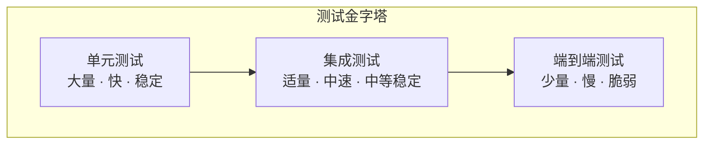
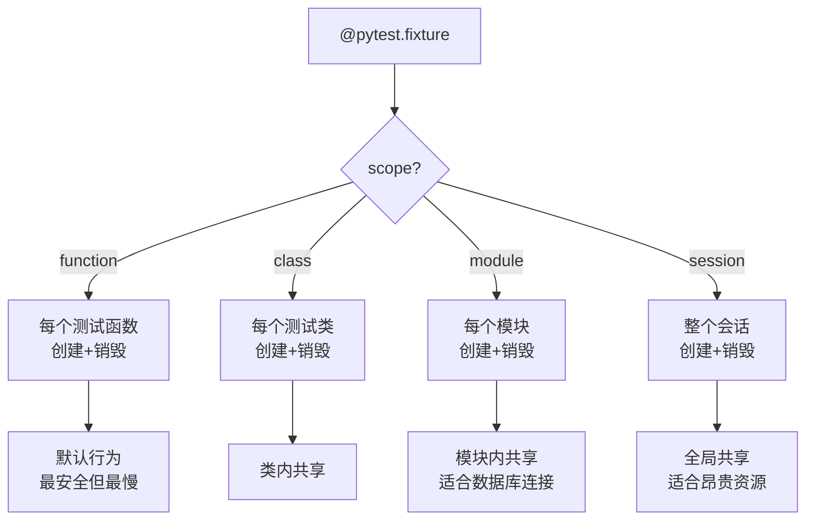
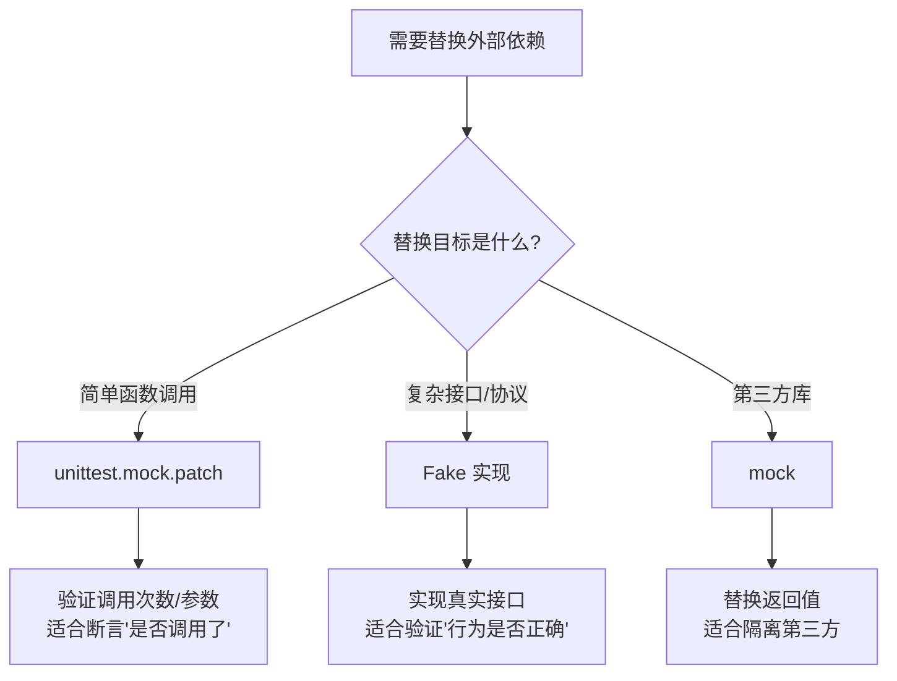
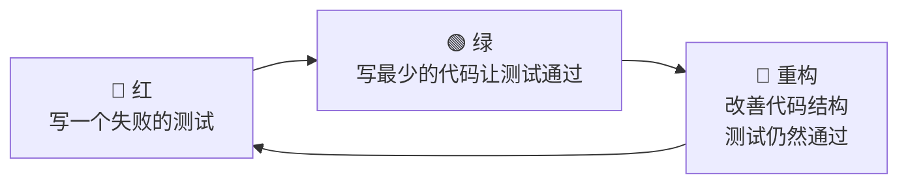

# 测试

测试用于验证代码行为是否符合预期，并在后续修改时尽早暴露回归问题。对 Python 项目来说，测试不是"写完以后补一点"的附属流程，而是让重构、协作和发布变得可控的安全网。如果没有测试，项目越大，改动时心里越虚；有测试之后，至少你不是在黑灯瞎火里拆电路。

> 阅读提示

- 如果你只想快速上手，直接看 [pytest 基础](#pytest-基础)和[场景一：纯函数测试](#场景一纯函数的单元测试)
- 如果你想理解测试策略（单元/集成/E2E 如何分工），从[测试金字塔](#测试金字塔)开始
- 如果你已经会写测试但想查最佳实践，跳到[常见陷阱](#常见陷阱)和[最佳实践速查表](#最佳实践速查表)
- 本文以 **pytest** 为主，所有代码基于 Python 3.12+（当前推荐使用最新稳定版 3.13/3.14）

## 测试金字塔



| 层级 | 关注范围 | 速度 | 数量 | 定位难度 | 适用场景 |
|------|---------|------|------|---------|---------|
| **单元测试** | 单个函数/类/规则 | 快（ms） | 最多 | 容易 | 核心业务规则、边界条件、纯函数 |
| **集成测试** | 多组件协作 | 中（s） | 适中 | 中等 | 仓储+服务+配置组合、数据库交互 |
| **端到端测试** | 完整用户流程 | 慢（10s+） | 最少 | 较难 | 关键用户路径、发布回归验证 |

**原则**：单元测试最多（收益最高），集成测试适量，端到端测试只覆盖关键路径。

## pytest 基础

### 为什么选 pytest

| 对比维度 | `unittest` | `pytest` |
|---|---|---|
| 标准库支持 | 内置 | 第三方（`pip install pytest`） |
| 语法风格 | 类组织，样板代码多 | 函数式，极简 |
| 断言方式 | `self.assertEqual(a, b)` | 直接 `assert a == b` |
| 错误信息 | 需要手写 msg | 自动展示差异 |
| 参数化 | 需要 `@parameterized.expand` | 内置 `@pytest.mark.parametrize` |
| 夹具（Setup/Teardown） | `setUp`/`tearDown` | `@pytest.fixture`，灵活组合 |
| 插件生态 | 基础 | 极其丰富（cov、mock、async、benchmark） |

### 安装与第一个测试

```bash
# 安装 pytest 和常用插件
pip install pytest pytest-cov pytest-mock pytest-asyncio

# 运行测试
pytest                        # 自动发现 test_*.py / *_test.py
pytest -v                     # 详细输出
pytest -x                     # 遇到第一个失败就停止
pytest -k "test_discount"     # 只运行名字匹配的测试
pytest --cov=src --cov-report=html  # 生成覆盖率报告
```

```python
# src/discount.py — 被测代码
def apply_discount(price: float, rate: float) -> float:
    """应用折扣率计算折后价"""
    if not 0 <= rate <= 1:
        raise ValueError("rate must be between 0 and 1")
    return round(price * (1 - rate), 2)


# tests/test_discount.py — 测试代码
def test_apply_discount_returns_discounted_price():
    """正常路径：合法折扣率返回正确折后价"""
    assert apply_discount(100.0, 0.2) == 80.0

def test_apply_discount_rejects_invalid_rate():
    """异常路径：非法折扣率抛出 ValueError"""
    import pytest
    with pytest.raises(ValueError):
        apply_discount(100.0, 1.5)
```

### 断言的艺术

```python
import pytest


def test_assertion_examples():
    # 基础断言
    assert 1 + 1 == 2
    assert "hello" in "hello world"
    assert [1, 2, 3]  # 非空判断

    # 浮点数比较
    assert 0.1 + 0.2 == pytest.approx(0.3)

    # 异常断言
    with pytest.raises(ValueError, match="must be between"):
        apply_discount(100, -0.1)

    # 异常断言 + 检查异常信息
    with pytest.raises(ValueError) as exc_info:
        apply_discount(100, 2.0)
    assert "rate must be" in str(exc_info.value)

    # 警告断言
    with pytest.warns(DeprecationWarning):
        import warnings
        warnings.warn("这个功能已弃用", DeprecationWarning)
```

## pytest fixture：测试夹具

fixture 是 pytest 最强大的特性——它让你以声明式方式管理测试的前置条件和清理逻辑。

### fixture 生命周期



### 基础 fixture

```python
import pytest
from pathlib import Path
import tempfile
import shutil


@pytest.fixture
def temp_dir():
    """创建临时目录，测试后自动清理"""
    dir_path = Path(tempfile.mkdtemp())
    yield dir_path  # yield 之前的代码是 setup，之后是 teardown
    shutil.rmtree(dir_path, ignore_errors=True)


def test_write_file(temp_dir):
    """fixture 通过参数名自动注入"""
    test_file = temp_dir / "test.txt"
    test_file.write_text("hello")
    assert test_file.read_text() == "hello"
```

### conftest.py：共享 fixture

```python
# tests/conftest.py — pytest 会自动加载这个文件中的 fixture

import pytest
from dataclasses import dataclass


@dataclass
class MockUser:
    id: int
    name: str
    role: str = "user"


@pytest.fixture
def admin_user():
    """所有测试文件都可使用这个 fixture"""
    return MockUser(id=1, name="Admin", role="admin")


@pytest.fixture
def normal_user():
    return MockUser(id=2, name="Alice", role="user")


@pytest.fixture
def user_list(admin_user, normal_user):
    """fixture 可以组合其他 fixture"""
    return [admin_user, normal_user]
```

### 作用域控制

```python
import pytest


@pytest.fixture(scope="session")
def db_connection():
    """整个测试会话只创建一次数据库连接"""
    import sqlite3
    conn = sqlite3.connect(":memory:")
    conn.execute("CREATE TABLE users (id INTEGER, name TEXT)")
    yield conn
    conn.close()


@pytest.fixture(scope="function")
def db_with_seed(db_connection):
    """每个测试函数获得干净的数据库状态"""
    db_connection.execute("DELETE FROM users")
    db_connection.execute("INSERT INTO users VALUES (1, 'Alice')")
    db_connection.commit()
    yield db_connection
    # 测试后清空（虽然 scope="function" 的 fixture 会重新执行，但显式清理是好习惯）
    db_connection.execute("DELETE FROM users")
    db_connection.commit()


def test_user_exists(db_with_seed):
    cursor = db_with_seed.execute("SELECT name FROM users WHERE id = 1")
    assert cursor.fetchone()[0] == "Alice"
```

## 参数化测试

当你需要用多组输入验证同一个函数时，`@pytest.mark.parametrize` 让你避免写重复的测试函数。

### 基础参数化

```python
import pytest


def fibonacci(n: int) -> int:
    """计算第 n 个斐波那契数"""
    if n < 0:
        raise ValueError("n 不能为负数")
    if n <= 1:
        return n
    a, b = 0, 1
    for _ in range(2, n + 1):
        a, b = b, a + b
    return b


@pytest.mark.parametrize("n, expected", [
    (0, 0),
    (1, 1),
    (2, 1),
    (5, 5),
    (10, 55),
    (20, 6765),
])
def test_fibonacci_values(n, expected):
    """参数化测试：多组输入验证同一个函数"""
    assert fibonacci(n) == expected


@pytest.mark.parametrize("invalid_input", [-1, -100])
def test_fibonacci_rejects_negative(invalid_input):
    """参数化测试：验证异常路径"""
    with pytest.raises(ValueError):
        fibonacci(invalid_input)
```

### 多参数组合

```python
@pytest.mark.parametrize("price, rate, expected", [
    (100.0, 0.0, 100.0),    # 无折扣
    (100.0, 0.5, 50.0),     # 半价
    (100.0, 1.0, 0.0),      # 免费赠送
    (99.99, 0.15, 84.99),    # 精度测试
])
def test_discount_combinations(price, rate, expected):
    assert apply_discount(price, rate) == expected
```

### pytest.param：标记和命名

```python
@pytest.mark.parametrize("input_str, expected", [
    pytest.param("hello", "HELLO", id="小写转大写"),
    pytest.param("WORLD", "WORLD", id="已是大写"),
    pytest.param("HeLLo", "HELLO", id="混合大小写"),
    pytest.param("", "", id="空字符串"),
    pytest.param("123", "123", marks=pytest.mark.xfail(reason="数字不需要转换"), id="数字输入"),
])
def test_upper_variants(input_str, expected):
    assert input_str.upper() == expected
```

## Mock 与 Fake：测试替身

当被测代码依赖外部系统（数据库、网络、文件系统）时，你需要用"替身"替代这些依赖，使测试可控、快速、可重复。

### Mock vs Fake 选择指南



| 策略 | 适用场景 | 优点 | 缺点 |
|------|---------|------|------|
| **Fake** | 复杂接口、需要状态 | 行为真实、可复用、可读性好 | 需要额外编写 |
| **Mock（patch）** | 简单替换、验证调用 | 快速、灵活 | 过度耦合实现细节 |
| **Spy** | 需要验证真实调用+记录 | 介于 Fake 和 Mock 之间 | 较少用 |

### 实战：用 Protocol + Fake 替换依赖

```python
# src/notification.py — 被测代码
from typing import Protocol
from dataclasses import dataclass


class EmailSender(Protocol):
    def send(self, to: str, subject: str, body: str) -> None: ...


@dataclass
class NotificationService:
    email_sender: EmailSender

    def notify_user(self, email: str, message: str) -> None:
        if not email or "@" not in email:
            raise ValueError("无效的邮箱地址")
        self.email_sender.send(
            to=email,
            subject="系统通知",
            body=message,
        )


# tests/test_notification.py — 测试代码
class FakeEmailSender:
    """轻量级替身：记录发送的邮件，不真正发送"""
    def __init__(self) -> None:
        self.sent: list[tuple[str, str, str]] = []

    def send(self, to: str, subject: str, body: str) -> None:
        self.sent.append((to, subject, body))


def test_notify_user_sends_email():
    """正常路径：通知用户时发送邮件"""
    fake = FakeEmailSender()
    service = NotificationService(email_sender=fake)

    service.notify_user("user@example.com", "订单已发货")

    assert len(fake.sent) == 1
    assert fake.sent[0] == ("user@example.com", "系统通知", "订单已发货")


def test_notify_user_rejects_invalid_email():
    """异常路径：无效邮箱地址抛出 ValueError"""
    fake = FakeEmailSender()
    service = NotificationService(email_sender=fake)

    import pytest
    with pytest.raises(ValueError, match="无效的邮箱"):
        service.notify_user("", "消息")

    # 确认没有发送邮件
    assert len(fake.sent) == 0
```

### 实战：用 mock.patch 替换函数

```python
# src/weather.py — 被测代码
import requests


def get_temperature(city: str) -> float:
    """获取城市温度（依赖外部 API）"""
    response = requests.get(f"https://api.weather.com/{city}")
    data = response.json()
    return data["temperature"]


# tests/test_weather.py — 测试代码
import requests
from unittest.mock import patch


def test_get_temperature():
    """用 mock 替换 requests.get，返回预设数据"""
    mock_response = type("MockResponse", (), {
        "json": lambda self: {"temperature": 25.5},
    })()

    with patch("src.weather.requests.get", return_value=mock_response):
        temp = get_temperature("beijing")
        assert temp == 25.5


def test_get_temperature_timeout():
    """模拟请求超时"""
    with patch("src.weather.requests.get", side_effect=requests.Timeout("超时")):
        import pytest
        with pytest.raises(requests.Timeout):
            get_temperature("beijing")
```

### 实战：用 pytest-mock 简化

```python
# pip install pytest-mock
# pytest-mock 提供 mocker fixture，比 unittest.mock 更简洁


def test_get_temperature_with_mocker(mocker):
    """使用 pytest-mock 的 mocker fixture"""
    mock_response = mocker.MagicMock()
    mock_response.json.return_value = {"temperature": 30.0}

    mocker.patch("src.weather.requests.get", return_value=mock_response)

    temp = get_temperature("shanghai")
    assert temp == 30.0

    # 验证调用参数
    requests.get.assert_called_once_with("https://api.weather.com/shanghai")
```

## 测试覆盖率

覆盖率不是目标，而是信号。追求 100% 覆盖率往往导致写无意义的测试；合理的覆盖率门槛能帮你在关键区域不遗漏。

### 配置

```toml
# pyproject.toml
[tool.pytest.ini_options]
testpaths = ["tests"]
addopts = "-v --tb=short"

[tool.coverage.run]
source = ["src"]
omit = ["tests/*", "*/__pycache__/*"]

[tool.coverage.report]
fail_under = 80       # 覆盖率低于 80% 构建失败
show_missing = true   # 显示未覆盖的行号
exclude_lines = [
    "pragma: no cover",
    "if TYPE_CHECKING:",
    "raise NotImplementedError",
    "if __name__ == .__main__.:",
]
```

### 运行

```bash
# 终端报告
pytest --cov=src --cov-report=term-missing

# HTML 报告（可点击查看未覆盖的代码）
pytest --cov=src --cov-report=html
open htmlcov/index.html

# 只检查关键模块
pytest --cov=src.core --cov=src.service
```

### 覆盖率策略

| 区域 | 建议覆盖率 | 原因 |
|------|----------|------|
| 核心业务逻辑 | 90%+ | 最高价值，回归风险最大 |
| 数据处理管道 | 85%+ | 数据错误影响面广 |
| API 接口层 | 80%+ | 契约验证 |
| 工具函数 | 70%+ | 相对简单 |
| UI / 配置代码 | 50%+ | 变化频繁，ROI 较低 |

## 实战场景

### 场景一：纯函数的单元测试

纯函数（无副作用、相同输入总是相同输出）是最容易测试的，优先覆盖：

```python
# src/validator.py — 被测代码
import re


def validate_email(email: str) -> bool:
    """验证邮箱格式"""
    pattern = r'^[a-zA-Z0-9._%+-]+@[a-zA-Z0-9.-]+\.[a-zA-Z]{2,}$'
    return bool(re.match(pattern, email))


def validate_password(password: str) -> tuple[bool, str]:
    """验证密码强度：至少8位，包含大小写和数字"""
    if len(password) < 8:
        return False, "密码至少8位"
    if not re.search(r'[A-Z]', password):
        return False, "密码必须包含大写字母"
    if not re.search(r'[a-z]', password):
        return False, "密码必须包含小写字母"
    if not re.search(r'\d', password):
        return False, "密码必须包含数字"
    return True, "密码强度合格"


# tests/test_validator.py — 测试代码
import pytest


class TestValidateEmail:
    """邮箱验证测试组"""

    @pytest.mark.parametrize("email", [
        "user@example.com",
        "user.name+tag@domain.co",
        "a@b.cc",
    ])
    def test_valid_emails(self, email):
        assert validate_email(email) is True

    @pytest.mark.parametrize("email", [
        "",
        "no-at-sign",
        "@domain.com",
        "user@",
        "user@.com",
        "user@domain",
    ])
    def test_invalid_emails(self, email):
        assert validate_email(email) is False


class TestValidatePassword:
    """密码验证测试组"""

    def test_strong_password(self):
        ok, msg = validate_password("Abc12345")
        assert ok is True
        assert "合格" in msg

    @pytest.mark.parametrize("password, expected_msg", [
        ("Ab1!", "至少8位"),
        ("abcdefgh", "大写字母"),
        ("ABCDEFGH", "小写字母"),
        ("Abcdefgh", "数字"),
    ])
    def test_weak_passwords(self, password, expected_msg):
        ok, msg = validate_password(password)
        assert ok is False
        assert expected_msg in msg
```

### 场景二：依赖数据库的集成测试

```python
# src/user_repository.py — 被测代码
import sqlite3
from dataclasses import dataclass


@dataclass
class User:
    id: int
    name: str
    email: str


class UserRepository:
    def __init__(self, db_path: str) -> None:
        self.conn = sqlite3.connect(db_path)
        self.conn.row_factory = sqlite3.Row
        self._init_db()

    def _init_db(self) -> None:
        self.conn.execute("""
            CREATE TABLE IF NOT EXISTS users (
                id INTEGER PRIMARY KEY AUTOINCREMENT,
                name TEXT NOT NULL,
                email TEXT NOT NULL UNIQUE
            )
        """)
        self.conn.commit()

    def create_user(self, name: str, email: str) -> User:
        cursor = self.conn.execute(
            "INSERT INTO users (name, email) VALUES (?, ?)",
            (name, email),
        )
        self.conn.commit()
        return User(id=cursor.lastrowid, name=name, email=email)

    def get_user(self, user_id: int) -> User | None:
        row = self.conn.execute(
            "SELECT * FROM users WHERE id = ?", (user_id,)
        ).fetchone()
        if row is None:
            return None
        return User(id=row["id"], name=row["name"], email=row["email"])

    def close(self) -> None:
        self.conn.close()


# tests/test_user_repository.py — 测试代码
import sqlite3
import pytest
from pathlib import Path


@pytest.fixture
def repo():
    """创建内存数据库仓库，测试后自动关闭"""
    repository = UserRepository(":memory:")
    yield repository
    repository.close()


def test_create_and_get_user(repo):
    """创建用户后可以查询到"""
    user = repo.create_user("Alice", "alice@example.com")
    assert user.id is not None
    assert user.name == "Alice"

    found = repo.get_user(user.id)
    assert found is not None
    assert found.email == "alice@example.com"


def test_get_nonexistent_user(repo):
    """查询不存在的用户返回 None"""
    assert repo.get_user(999) is None


def test_create_duplicate_email(repo):
    """重复邮箱应该抛出异常"""
    repo.create_user("Alice", "alice@example.com")
    with pytest.raises(sqlite3.IntegrityError):
        repo.create_user("Bob", "alice@example.com")
```

### 场景三：异步代码测试

```python
# src/async_service.py — 被测代码
import asyncio


async def fetch_data(url: str, delay: float = 0.1) -> dict[str, str]:
    """模拟异步网络请求"""
    await asyncio.sleep(delay)
    if "error" in url:
        raise ConnectionError(f"请求失败: {url}")
    return {"url": url, "status": "ok"}


async def fetch_multiple(urls: list[str]) -> list[dict[str, str]]:
    """并发获取多个 URL"""
    tasks = [fetch_data(url) for url in urls]
    results = await asyncio.gather(*tasks, return_exceptions=True)
    return [r for r in results if not isinstance(r, Exception)]


# tests/test_async_service.py — 测试代码
import pytest


@pytest.mark.asyncio
async def test_fetch_data_success():
    """异步请求成功路径"""
    result = await fetch_data("https://example.com")
    assert result["status"] == "ok"


@pytest.mark.asyncio
async def test_fetch_data_error():
    """异步请求失败路径"""
    with pytest.raises(ConnectionError, match="请求失败"):
        await fetch_data("https://error.example.com")


@pytest.mark.asyncio
async def test_fetch_multiple():
    """并发请求：部分成功部分失败"""
    urls = [
        "https://a.com",
        "https://error.b.com",
        "https://c.com",
    ]
    results = await fetch_multiple(urls)
    # 失败的请求被过滤掉
    assert len(results) == 2
    assert all(r["status"] == "ok" for r in results)
```

## TDD 实践

TDD（测试驱动开发）的节奏是：**红 → 绿 → 重构**。



### TDD 实例：实现温度转换器

**第一步：写失败测试（红）**

```python
# tests/test_temperature.py
def test_celsius_to_fahrenheit():
    from src.temperature import celsius_to_fahrenheit  # 还没实现
    assert celsius_to_fahrenheit(0) == 32
    assert celsius_to_fahrenheit(100) == 212
```

**第二步：最简实现（绿）**

```python
# src/temperature.py
def celsius_to_fahrenheit(celsius: float) -> float:
    return celsius * 9 / 5 + 32
```

**第三步：补充边界测试（红）**

```python
def test_absolute_zero():
    assert celsius_to_fahrenheit(-273.15) == pytest.approx(-459.67, abs=0.01)

def test_invalid_temperature():
    with pytest.raises(ValueError):
        celsius_to_fahrenheit(-300)  # 低于绝对零度
```

**第四步：实现边界检查（绿）**

```python
def celsius_to_fahrenheit(celsius: float) -> float:
    if celsius < -273.15:
        raise ValueError("温度不能低于绝对零度")
    return celsius * 9 / 5 + 32
```

**第五步：重构**

```python
ABSOLUTE_ZERO_C = -273.15

def celsius_to_fahrenheit(celsius: float) -> float:
    _validate_celsius(celsius)
    return celsius * 9 / 5 + 32

def _validate_celsius(celsius: float) -> None:
    if celsius < ABSOLUTE_ZERO_C:
        raise ValueError(f"温度不能低于绝对零度 ({ABSOLUTE_ZERO_C}°C)")
```

::: tip TDD 何时适用
- **适合 TDD**：核心业务逻辑、算法、数据验证、API 契约
- **不一定适合 TDD**：探索性原型、UI 布局、一次性脚本
- **关键原则**：先写测试让你思考"我期望什么行为"，而不是"我怎么实现"
:::

## 常见陷阱

| 陷阱 | 现象 | 原因 | 解决方案 |
|------|------|------|----------|
| 断言实现步骤而非结果 | 重构后测试全部失败 | 测试"怎么做的"而非"做了什么" | 断言可观察行为（输入→输出），不检查内部调用 |
| 过度 mock | mock 代码比业务代码还多 | 对每个依赖都 mock，测试变成"验证 mock" | 优先用 Fake，只在必要时 mock |
| 测试间共享可变状态 | 测试单独跑通过，一起跑失败 | 测试顺序依赖 | fixture 用 scope="function"，不用全局变量 |
| 追求 100% 覆盖率 | 为 getter/setter 写无意义测试 | 覆盖率数字好看但无价值 | 重点覆盖业务逻辑，简单代码可排除 |
| 测试名称不描述意图 | `test_function_1()` | 难以从报告定位问题 | 用"should_xxx_when_yyy"风格命名 |
| 忽略慢测试 | 测试套件跑 10 分钟 | 集成测试和 E2E 太多 | 分层：快测试频繁跑，慢测试 CI 跑 |
| 硬编码测试数据 | `assert user.age == 30` | 数据变更导致测试脆弱 | 用工厂函数生成测试数据 |

### 陷阱详解：断言实现步骤而非结果

```python
# ❌ 反面：断言实现细节——重构后测试全废
def test_process_order_bad(mocker):
    mock_validate = mocker.patch("src.order.validate_order")
    mock_save = mocker.patch("src.order.save_order")
    mock_notify = mocker.patch("src.order.send_notification")

    process_order({"id": 1, "items": []})

    mock_validate.assert_called_once()  # 如果改了内部流程，测试就废了
    mock_save.assert_called_once()
    mock_notify.assert_called_once()

# ✅ 正面：断言可观察行为——重构不影响测试
def test_process_order_good():
    """处理有效订单后，订单状态应为 completed"""
    order = create_test_order(items=[{"sku": "A1", "qty": 2}])
    result = process_order(order)
    assert result.status == "completed"
    assert result.total == 200.0
```

### 陷阱详解：测试间共享可变状态

```python
# ❌ 反面：共享可变状态
_shared_cart: list[str] = []

def test_add_item():
    _shared_cart.append("apple")
    assert "apple" in _shared_cart  # 依赖之前的状态

def test_remove_item():
    _shared_cart.remove("apple")  # 如果 test_add_item 没先跑，这里就报错
    assert "apple" not in _shared_cart

# ✅ 正面：每个测试获得独立数据
@pytest.fixture
def cart():
    return ["apple"]  # 每次都创建新的

def test_add_item(cart):
    cart.append("banana")
    assert "banana" in cart

def test_remove_item(cart):
    cart.remove("apple")
    assert "apple" not in cart
```

## 项目配置与最佳实践

### pyproject.toml 完整配置

```toml
[tool.pytest.ini_options]
testpaths = ["tests"]
python_files = ["test_*.py", "*_test.py"]
python_classes = ["Test*"]
python_functions = ["test_*"]
addopts = [
    "-v",
    "--tb=short",
    "--strict-markers",
]
markers = [
    "slow: 标记慢测试（deselect with '-m \"not slow\"')",
    "integration: 标记集成测试",
    "e2e: 标记端到端测试",
]

[tool.coverage.run]
source = ["src"]
omit = ["tests/*"]

[tool.coverage.report]
fail_under = 80
show_missing = true
```

### 测试目录结构

```
project/
├── src/
│   ├── __init__.py
│   ├── validator.py
│   └── service.py
├── tests/
│   ├── conftest.py          ← 共享 fixture
│   ├── test_validator.py    ← 对应 src/validator.py
│   └── test_service.py      ← 对应 src/service.py
└── pyproject.toml
```

### 持续集成配置

```yaml
# .github/workflows/test.yml
name: Tests
on: [push, pull_request]

jobs:
  test:
    runs-on: ubuntu-latest
    steps:
      - uses: actions/checkout@v4
      - uses: actions/setup-python@v5
        with:
          python-version: "3.12"
      - run: pip install -e ".[dev]"
      - run: pytest --cov=src --cov-report=xml
      - uses: codecov/codecov-action@v4
```

## 最佳实践速查表

| 场景 | 推荐做法 | 避免 |
|------|---------|------|
| 新项目 | 直接用 pytest，不用 unittest | unittest 的样板代码 |
| 测试命名 | `test_should_xxx_when_yyy` | `test_function_1` |
| 断言方式 | `assert a == b`（pytest 风格） | `self.assertEqual(a, b)` |
| 替换依赖 | 优先用 Protocol + Fake | 过度 mock.patch |
| 测试数据 | fixture + 工厂函数 | 硬编码魔法数字 |
| 参数化 | `@pytest.mark.parametrize` | 复制粘贴多组测试 |
| 覆盖率 | 核心逻辑 90%+，整体 80%+ | 追求 100% |
| 慢测试 | `@pytest.mark.slow`，CI 跑 | 混在快测试里 |
| 异步测试 | `@pytest.mark.asyncio` | 手动 `asyncio.run()` |
| 临时文件 | `tmp_path` fixture（pytest 内置） | 自己创建不清理 |

## unittest vs pytest 迁移指南

如果你已有 `unittest` 测试，可以渐进迁移：

```python
# unittest 风格
import unittest

class TestDiscount(unittest.TestCase):
    def test_apply_discount(self):
        self.assertEqual(apply_discount(100, 0.2), 80.0)

# 等价的 pytest 风格（更简洁）
def test_apply_discount():
    assert apply_discount(100, 0.2) == 80.0
```

**迁移策略**：

1. `pytest` 可以直接运行 `unittest` 测试，无需一次迁移
2. 新测试用 pytest 风格写
3. 旧测试在需要修改时逐步迁移
4. `setUp`/`tearDown` → `@pytest.fixture`
5. `self.assertEqual` → `assert`

## 术语表

| 术语 | 英文 | 定义 |
|------|------|------|
| 单元测试 | Unit Test | 验证单个函数/类/模块行为的测试，隔离外部依赖 |
| 集成测试 | Integration Test | 验证多个组件协作是否正常的测试 |
| 端到端测试 | End-to-End Test | 从用户入口到最终输出的完整链路测试 |
| 测试夹具 | Fixture | 测试的前置条件（数据、环境、依赖），pytest 通过 `@pytest.fixture` 管理 |
| 参数化测试 | Parameterized Test | 用多组输入运行同一个测试逻辑 |
| Mock | Mock Object | 替换真实依赖的对象，可验证调用行为 |
| Fake | Fake Object | 实现真实接口的轻量级替身，有真实行为但简化实现 |
| 测试替身 | Test Double | Mock、Fake、Spy 等替代真实依赖的对象统称 |
| 覆盖率 | Coverage | 代码被测试执行到的比例，通常用百分比表示 |
| TDD | Test-Driven Development | 测试驱动开发：先写测试，再写实现 |
| 回归 | Regression | 修改代码后，之前正常的功能出现问题 |
| 断言 | Assertion | 验证实际结果是否符合预期的语句 |

## 延伸阅读

### 官方文档

- [pytest 官方文档](https://docs.pytest.org/)
- [pytest 中文文档](https://learning-pytest.readthedocs.io/)
- [unittest 官方文档](https://docs.python.org/3/library/unittest.html)
- [coverage.py 官方文档](https://coverage.readthedocs.io/)

### 插件生态

- [pytest-cov](https://pytest-cov.readthedocs.io/) — 覆盖率
- [pytest-mock](https://pytest-mock.readthedocs.io/) — mock 封装
- [pytest-asyncio](https://pytest-asyncio.readthedocs.io/) — 异步测试
- [pytest-benchmark](https://pytest-benchmark.readthedocs.io/) — 性能基准
- [pytest-xdist](https://pytest-xdist.readthedocs.io/) — 并行执行

### 推荐阅读

- 《测试驱动开发》（Kent Beck）— TDD 经典
- 《单元测试的艺术》— 单元测试方法论
- [Martin Fowler — TestPyramid](https://martinfowler.com/articles/practical-test-pyramid.html)
- 本系列：[类型注解](02-类型注解) — 用 Protocol 定义可测试的接口
- 本系列：CI/CD — 自动化测试流水线

## 版本差异（工程化 → Python 3.13/3.14）

| 特性 | 本文编写时 | 当前 |
|------|-----------|------|
| Python 基线 | 3.8-3.12 | 3.14（最新稳定版，3.9- 已全部 EOL） |
| 包管理 | pip/poetry | `uv` 成为新一代工具（极快）；`pyproject.toml` 为事实标准 |
| 类型检查 | mypy | Pyright/Pylance 为主流；mypy 持续更新 |
| 格式化 | Black/isort | `ruff format` 一体化（Rust 实现） |
| 测试 | pytest 7 | pytest 8.x |
| 构建 | setuptools | 3.12+ `pyproject.toml` 构建后端成熟（Hatchling/Flit） |

> 本文讲解的工程化最佳实践（规范、注解、测试、打包、结构）与 Python 3.14 完全兼容；建议新项目使用 `uv` + `ruff` + `pyproject.toml` 组合。
