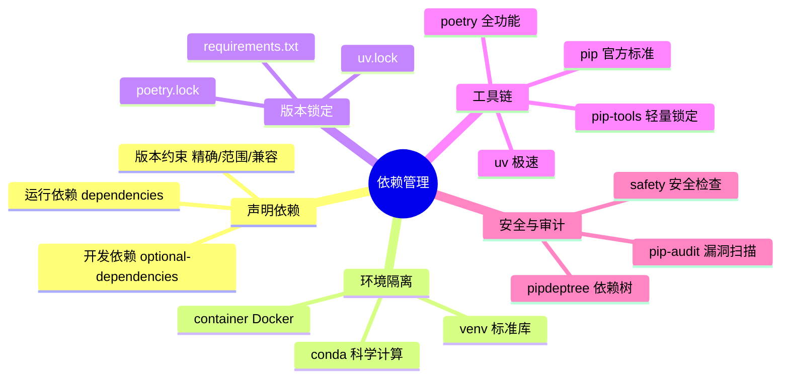
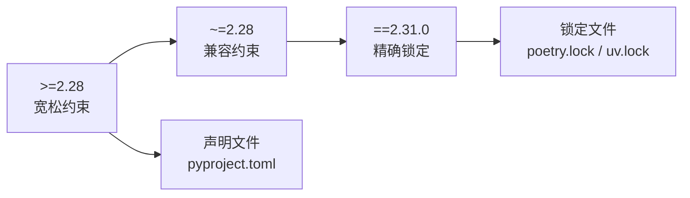
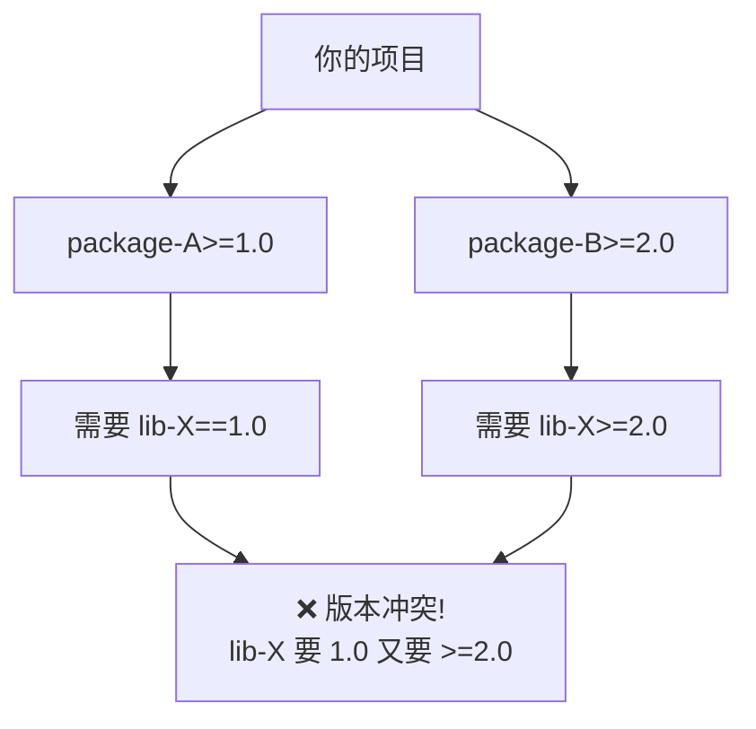

# 依赖管理

依赖管理解决的是三个很实际的问题：项目依赖哪些包、这些包在什么环境里运行、别人如何稳定复现同样结果。如果没有稳定的依赖管理策略，一个项目在你的电脑上能跑，不代表换到同事机器、CI 环境或半年后的自己那里还会老老实实地跑。

> 阅读提示

- 如果你只想快速上手，直接看 [venv + pip 实战](#venv--pip-基础工作流)和[pyproject.toml 配置](#pyprojecttoml-依赖声明)
- 如果你想对比 pip/Poetry/uv 选型，跳到[工具链对比](#依赖管理工具对比)
- 如果你遇到环境问题，查看[常见陷阱](#常见陷阱)
- 本文基于 **Python 3.12+**，以 `pyproject.toml` 为核心

## 依赖管理全景



## venv + pip 基础工作流

### 创建和激活虚拟环境

```bash
# 创建虚拟环境
python -m venv .venv

# 激活虚拟环境
# macOS / Linux
source .venv/bin/activate
# Windows
.venv\Scripts\activate
# Windows PowerShell
.venv\Scripts\Activate.ps1

# 验证
which python        # 应该指向 .venv/bin/python
python --version    # 确认版本

# 退出虚拟环境
deactivate
```

### 日常操作

```bash
# 安装包
pip install requests              # 最新版
pip install requests==2.31.0      # 指定版本
pip install "requests>=2.28,<3"   # 版本范围

# 从 pyproject.toml 安装
pip install .                     # 安装当前项目（运行依赖）
pip install ".[dev]"              # 安装当前项目 + 开发依赖

# 导出锁定版本
pip freeze > requirements.txt

# 从锁定文件安装
pip install -r requirements.txt

# 升级包
pip install --upgrade requests

# 卸载包
pip uninstall requests

# 查看已安装包
pip list
pip show requests                 # 查看包详情
```

### .gitignore 配置

```gitignore
# 虚拟环境不提交
.venv/
venv/
env/

# 不要提交 pip freeze 的全量输出到版本控制
# 如果需要锁定，使用 pip-tools 或 poetry.lock
```

## pyproject.toml 依赖声明

`pyproject.toml` 是现代 Python 项目的配置中心（PEP 621），依赖声明是其中的核心部分。

### 最小配置

```toml
[project]
name = "myapp"
version = "1.0.0"
description = "我的应用"
requires-python = ">=3.12"

# 运行依赖：生产环境必须的包
dependencies = [
    "requests>=2.28",
    "pydantic>=2.0",
    "click>=8.0",
]

# 开发依赖：只在开发和测试时需要
[project.optional-dependencies]
dev = [
    "pytest>=8.0",
    "pytest-cov>=5.0",
    "mypy>=1.10",
    "ruff>=0.4",
]
```

### 版本约束语法

| 约束写法 | 含义 | 适用场景 |
|---------|------|---------|
| `requests` | 任意版本（不推荐） | 仅用于不重要的开发依赖 |
| `requests>=2.28` | 大于等于 2.28 | 默认选择，允许小版本升级 |
| `requests>=2.28,<3` | 2.28 到 3.0 之间 | 防止大版本破坏兼容性 |
| `requests==2.31.0` | 精确版本 | 锁定文件中使用，不在声明中使用 |
| `requests~=2.28` | 兼容版本（>=2.28, <3） | 等价于 `>=2.28,<3` |
| `requests~=2.28.1` | 兼容版本（>=2.28.1, <2.29） | 锁定小版本 |



**原则**：声明文件（`pyproject.toml`）用范围约束，锁定文件（`*.lock`）用精确版本。

### 完整项目配置示例

```toml
[project]
name = "data-pipeline"
version = "2.1.0"
description = "数据处理管道"
requires-python = ">=3.12"
license = {text = "MIT"}
authors = [
    {name = "Team", email = "team@example.com"},
]

# 运行依赖
dependencies = [
    "requests>=2.31",
    "pydantic>=2.5",
    "sqlalchemy>=2.0",
    "click>=8.1",
    "rich>=13.0",
]

# 分组开发依赖
[project.optional-dependencies]
dev = [
    "pytest>=8.0",
    "pytest-cov>=5.0",
    "pytest-asyncio>=0.23",
    "mypy>=1.10",
    "ruff>=0.4",
]
docs = [
    "mkdocs>=1.5",
    "mkdocs-material>=9.0",
]
db = [
    "psycopg2-binary>=2.9",
    "alembic>=1.13",
]

# 入口点：安装后可直接运行
[project.scripts]
pipeline = "data_pipeline.cli:main"

# 构建系统
[build-system]
requires = ["hatchling"]
build-backend = "hatchling.build"

# 工具配置
[tool.ruff]
line-length = 100

[tool.mypy]
python_version = "3.12"
strict = true

[tool.pytest.ini_options]
testpaths = ["tests"]
```

## 依赖管理工具对比

### pip vs Poetry vs uv

| 对比维度 | pip + venv | Poetry | uv |
|---------|-----------|--------|-----|
| 安装方式 | 内置 / pip | `pip install poetry` | `pip install uv` 或独立安装 |
| 依赖声明 | `pyproject.toml` | `pyproject.toml`（自有格式） | `pyproject.toml` |
| 版本锁定 | `requirements.txt`（手动） | `poetry.lock`（自动） | `uv.lock`（自动） |
| 安装速度 | 慢 | 中 | **极快**（Rust 实现） |
| 虚拟环境 | 手动 `python -m venv` | 自动创建管理 | 自动创建管理 |
| 依赖解析 | 无（顺序安装） | 有（完整解析器） | 有（完整解析器） |
| 发布能力 | `python -m build` + `twine` | `poetry publish` | `uv publish` |
| 插件/脚本 | 无 | `poetry run` | `uv run` |
| 学习成本 | 低 | 中 | 低 |
| 成熟度 | 最成熟 | 成熟 | 快速发展中 |

### pip + pip-tools：轻量锁定方案

如果你不想引入 Poetry/uv，但需要版本锁定能力：

```bash
pip install pip-tools
```

```toml
# requirements.in — 声明顶层依赖（不锁定）
requests>=2.28
pydantic>=2.0
click>=8.0
```

```bash
# 编译生成锁定文件（包含所有传递依赖的精确版本）
pip-compile requirements.in -o requirements.txt

# 安装锁定版本
pip-sync requirements.txt
# 或
pip install -r requirements.txt
```

生成的 `requirements.txt` 示例：

```text
# This file is autogenerated by pip-compile with Python 3.12
# Using pip-tools for reproducible installs
certifi==2024.2.2
    # via requests
charset-normalizer==3.3.2
    # via requests
click==8.1.7
    # via -r requirements.in
idna==3.6
    # via requests
pydantic==2.6.3
    # via -r requirements.in
requests==2.31.0
    # via -r requirements.in
urllib3==2.2.1
    # via requests
```

### Poetry：全功能方案

```bash
pip install poetry

# 初始化项目
poetry init

# 添加依赖
poetry add requests           # 运行依赖
poetry add --group dev pytest # 开发依赖

# 安装
poetry install                # 安装所有依赖
poetry install --without dev  # 只安装运行依赖

# 运行命令
poetry run python main.py
poetry run pytest

# 构建和发布
poetry build
poetry publish
```

### uv：极速方案（推荐新项目）

```bash
pip install uv

# 创建虚拟环境 + 安装
uv venv
uv pip install -e ".[dev]"

# 或使用项目模式
uv init myapp
cd myapp
uv add requests pydantic
uv add --dev pytest mypy ruff

# 运行
uv run python main.py
uv run pytest

# 锁定文件 uv.lock 自动生成和更新
```

## 实战场景

### 场景一：从零开始的新项目

```bash
# 1. 创建项目目录
mkdir myapp && cd myapp

# 2. 初始化 git
git init

# 3. 创建虚拟环境
python -m venv .venv
source .venv/bin/activate

# 4. 创建 pyproject.toml
cat > pyproject.toml << 'EOF'
[project]
name = "myapp"
version = "0.1.0"
requires-python = ">=3.12"
dependencies = []

[project.optional-dependencies]
dev = ["pytest>=8.0", "ruff>=0.4", "mypy>=1.10"]

[build-system]
requires = ["hatchling"]
build-backend = "hatchling.build"
EOF

# 5. 安装项目（可编辑模式）
pip install -e ".[dev]"

# 6. 验证
pytest --version
ruff --version
```

### 场景二：多环境依赖管理

```toml
[project]
name = "web-service"
version = "1.0.0"
requires-python = ">=3.12"
dependencies = [
    "fastapi>=0.110",
    "uvicorn>=0.29",
    "sqlalchemy>=2.0",
    "pydantic>=2.5",
]

[project.optional-dependencies]
dev = [
    "pytest>=8.0",
    "pytest-cov>=5.0",
    "httpx>=0.27",          # 测试 FastAPI 需要
    "mypy>=1.10",
    "ruff>=0.4",
]
prod = [
    "gunicorn>=22.0",
    "psycopg2-binary>=2.9",
]
monitoring = [
    "sentry-sdk[fastapi]>=2.0",
    "prometheus-client>=0.20",
]
```

```bash
# 开发环境：安装运行依赖 + 开发依赖
pip install -e ".[dev]"

# 生产环境：安装运行依赖 + 生产依赖
pip install ".[prod]"

# 带监控的生产环境
pip install ".[prod,monitoring]"

# CI 环境：最小安装
pip install .                   # 只装运行依赖（不安装 optional-dependencies）
```

### 场景三：依赖审计与安全检查

```bash
# 安装审计工具
pip install pip-audit pipdeptree

# 查看依赖树（发现冲突和重复）
pipdeptree
# 输出示例:
# myapp==1.0.0
# ├── fastapi==0.110.0
# │   ├── pydantic==2.6.3
# │   └── starlette==0.36.3
# ├── requests==2.31.0
# │   ├── certifi==2024.2.2
# │   ├── charset-normalizer==3.3.2
# │   ├── idna==3.6
# │   └── urllib3==2.2.1
# └── sqlalchemy==2.0.29

# 安全审计：检查已知漏洞
pip-audit
# 输出示例:
# Found 2 known vulnerabilities:
# Package  Version ID             Description
# flask    2.2.0   PYSEC-2023-62  Flask security vulnerability

# 只检查运行依赖（不含开发依赖）
pip-audit --skip-dev

# 生成 SBOM（软件物料清单）
pip-audit --format json > sbom.json
```

### 场景四：Docker 中的依赖管理

```dockerfile
# 多阶段构建：最小化最终镜像
FROM python:3.12-slim AS builder

WORKDIR /app
COPY pyproject.toml .
COPY src/ src/
RUN pip install --no-cache-dir .

# --- 最终镜像 ---
FROM python:3.12-slim

WORKDIR /app
COPY --from=builder /usr/local/lib/python3.12/site-packages /usr/local/lib/python3.12/site-packages
COPY --from=builder /usr/local/bin /usr/local/bin
COPY src/ src/

CMD ["python", "-m", "myapp"]
```

```dockerfile
# Poetry 项目的 Docker 构建
FROM python:3.12-slim AS builder

RUN pip install poetry
WORKDIR /app
COPY pyproject.toml poetry.lock .
RUN poetry config virtualenvs.create false \
    && poetry install --without dev --no-interaction --no-ansi

# --- 最终镜像 ---
FROM python:3.12-slim
WORKDIR /app
COPY --from=builder /usr/local/lib/python3.12/site-packages /usr/local/lib/python3.12/site-packages
COPY src/ src/
CMD ["python", "-m", "myapp"]
```

## 依赖解析与冲突处理

### 什么是依赖冲突



### 解决策略

| 策略 | 操作 | 适用场景 |
|------|------|---------|
| 升级依赖 | 升级 package-A 到支持 lib-X 2.x 的版本 | 最优先尝试 |
| 降级依赖 | 降级 package-B 到兼容 lib-X 1.x 的版本 | 次优先 |
| 替换依赖 | 用功能相同的其他包替换冲突方 | 前两者不行时 |
| 隔离运行 | 在不同虚拟环境中分别运行 | 临时方案 |

```bash
# 查看哪个包引入了冲突依赖
pipdeptree -p lib-X

# 尝试升级解决
pip install --upgrade package-A

# 如果无法解决，检查包的兼容性矩阵
pip show package-A  # 查看 Requires 字段
```

## 常见陷阱

| 陷阱 | 现象 | 原因 | 解决方案 |
|------|------|------|----------|
| 全局安装包 | 项目间互相干扰 | 不同项目需要不同版本 | 每个项目创建独立虚拟环境 |
| 不锁定版本 | 昨天能跑今天挂 | 依赖的依赖自动升级 | 使用 lock 文件或 pip-tools |
| requirements.txt 包含间接依赖 | 升级时很难确定哪些是顶层依赖 | `pip freeze` 包含所有包 | 用 pip-tools 从 `.in` 文件生成 |
| 开发依赖泄漏到生产 | 生产镜像过大或不安全 | 安装时没区分 dev/prod | 用 `[project.optional-dependencies]` 分组 |
| 忘记提交 lock 文件 | 团队成员环境不一致 | `.gitignore` 排除了 lock 文件 | `poetry.lock` / `uv.lock` 必须提交 |
| Python 版本不匹配 | 本地 3.12，CI 用 3.10 | `requires-python` 未设置 | 在 `pyproject.toml` 中明确 `requires-python` |
| 依赖循环 | 包 A 依赖 B，B 又依赖 A | 设计问题 | 重构为公共子模块 |
| 混用 pip 和 poetry | 环境状态混乱 | 不同工具对依赖的理解不同 | 团队统一一种工具链 |

### 陷阱详解：不锁定版本

```bash
# ❌ 只用 pyproject.toml，不锁定间接依赖版本
# 今天安装：requests 2.31.0 → urllib3 2.2.1
# 半年后安装：requests 2.31.0 → urllib3 2.3.0（可能有 breaking change）

# ✅ 使用锁定文件
# Poetry: poetry.lock（自动管理，必须提交到 git）
# uv: uv.lock（同上）
# pip-tools: requirements.txt（从 requirements.in 编译生成）
```

### 陷阱详解：开发依赖泄漏到生产

```dockerfile
# ❌ 错误：在 Docker 中安装了所有依赖
RUN pip install ".[dev]"
# 结果：生产镜像包含 pytest、mypy 等，体积大且不安全

# ✅ 正确：只安装运行依赖
RUN pip install ".[prod]"
# 或更精确：只安装运行依赖，不装 optional
RUN pip install --no-deps . && pip install -r requirements.txt
```

## 最佳实践速查表

| 场景 | 推荐做法 | 避免 |
|------|---------|------|
| 新项目初始化 | `pyproject.toml` + venv + pip/uv | 手动 `pip install` 不记录 |
| 依赖声明 | `[project.dependencies]` 中写范围约束 | 不写版本或写死精确版本 |
| 版本锁定 | 用 lock 文件（poetry.lock / uv.lock / pip-compile） | `pip freeze > requirements.txt` |
| 开发依赖 | `[project.optional-dependencies.dev]` | 混在运行依赖里 |
| 虚拟环境 | 每个项目 `.venv/` | 全局环境堆包 |
| Docker 构建 | 多阶段构建，只装运行依赖 | `pip install ".[dev]"` |
| 安全审计 | 定期 `pip-audit` | 只管装不管安全 |
| 依赖升级 | 定期检查更新，CI 中自动测试 | 永远不升级或随意升级 |
| 团队统一 | 全团队用同一工具链 | 一半用 pip 一半用 Poetry |

## 版本说明

| 版本 | 关键特性 | 影响 |
|------|---------|------|
| Python 3.3+ | `venv` 进入标准库 | 不再需要 `virtualenv` 第三方包 |
| Python 3.11+ | `tomllib` 进入标准库 | 可直接读取 TOML，无需 `tomli` |
| Python 3.12+ | `pyproject.toml` 生态成熟 | 新项目应以 `pyproject.toml` 为中心 |
| PEP 621 | 项目元数据标准化 | 所有工具共享同一份 `pyproject.toml` |
| PEP 660 | 可编辑安装标准化 | `pip install -e .` 统一行为 |

## 术语表

| 术语 | 英文 | 定义 |
|------|------|------|
| 虚拟环境 | Virtual Environment | 项目级依赖隔离的运行环境，与系统 Python 包互不影响 |
| 运行依赖 | Runtime Dependency | 程序运行时必须的包，部署到生产环境需要 |
| 开发依赖 | Development Dependency | 只在开发和测试时需要的包（如 pytest、mypy） |
| 传递依赖 | Transitive Dependency | 你安装的包所依赖的包（依赖的依赖） |
| 版本锁定 | Version Locking | 将所有依赖（含传递依赖）的精确版本记录到文件中 |
| 依赖解析 | Dependency Resolution | 自动计算满足所有版本约束的依赖版本组合 |
| 可编辑安装 | Editable Install | `pip install -e .` 以开发模式安装，修改源码立即生效 |
| SBOM | Software Bill of Materials | 软件物料清单，列出所有依赖及其版本 |
| pyproject.toml | — | Python 项目配置文件标准（PEP 621），集中管理元数据、依赖和工具配置 |
| lock 文件 | Lock File | 记录所有依赖精确版本的文件（poetry.lock / uv.lock） |

## 延伸阅读

### 官方文档

- [Python 官方 venv 文档](https://docs.python.org/3/library/venv.html)
- [Python 官方 tomllib 文档](https://docs.python.org/3/library/tomllib.html)
- [Python 打包用户指南](https://packaging.python.org/)
- [PEP 621 — Storing project metadata in pyproject.toml](https://peps.python.org/pep-0621/)
- [PEP 660 — Editable installs](https://peps.python.org/pep-0660/)

### 工具文档

- [Poetry 官方文档](https://python-poetry.org/docs/)
- [uv 官方文档](https://docs.astral.sh/uv/)
- [pip-tools 官方文档](https://pip-tools.readthedocs.io/)
- [pip-audit 官方文档](https://pypi.org/project/pip-audit/)

### 推荐阅读

- [Real Python — Python Virtual Environments Primer](https://realpython.com/python-virtual-environments-a-primer/)
- [Real Python — Python Dependencies Management](https://realpython.com/courses/managing-python-dependencies/)
- 本系列：[打包与发布](05-打包与发布) — 依赖管理的下游环节
- 本系列：CI/CD — 自动化依赖安装与安全检查
- 本系列：[项目结构设计](06-项目结构设计) — 项目目录与 pyproject.toml 位置

## 版本差异（工程化 → Python 3.13/3.14）

| 特性 | 本文编写时 | 当前 |
|------|-----------|------|
| Python 基线 | 3.8-3.12 | 3.14（最新稳定版，3.9- 已全部 EOL） |
| 包管理 | pip/poetry | `uv` 成为新一代工具（极快）；`pyproject.toml` 为事实标准 |
| 类型检查 | mypy | Pyright/Pylance 为主流；mypy 持续更新 |
| 格式化 | Black/isort | `ruff format` 一体化（Rust 实现） |
| 测试 | pytest 7 | pytest 8.x |
| 构建 | setuptools | 3.12+ `pyproject.toml` 构建后端成熟（Hatchling/Flit） |

> 本文讲解的工程化最佳实践（规范、注解、测试、打包、结构）与 Python 3.14 完全兼容；建议新项目使用 `uv` + `ruff` + `pyproject.toml` 组合。
