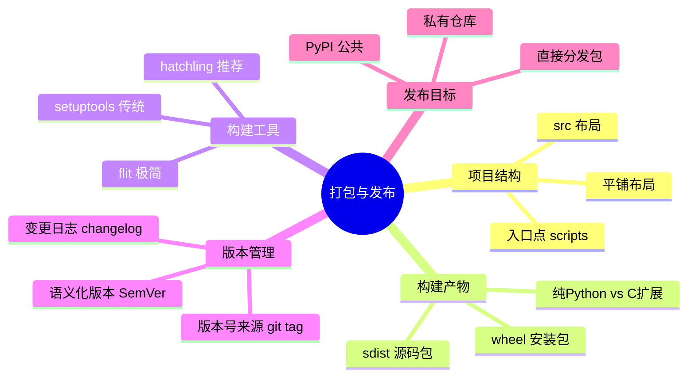
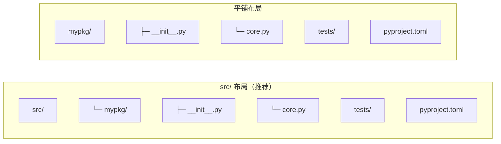
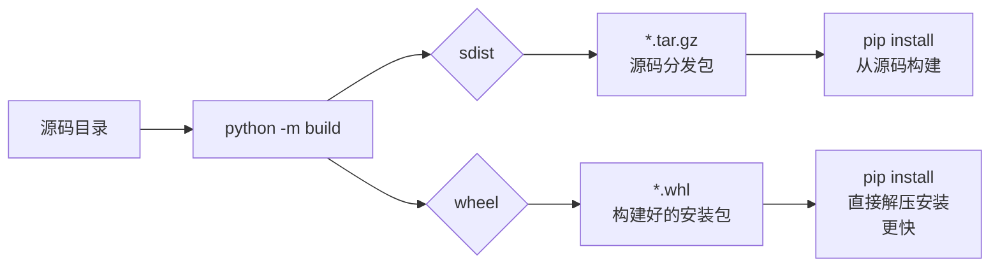
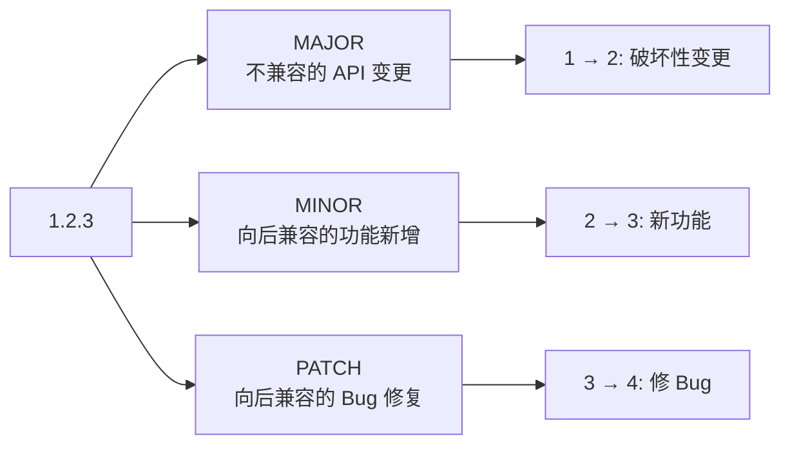
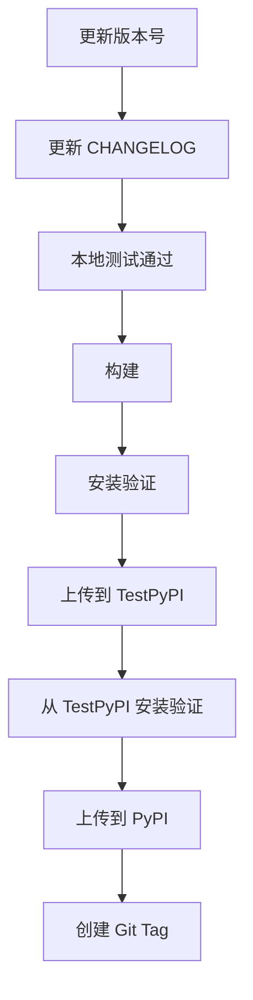

# 打包与发布

打包与发布解决的是"如何把一堆零散代码整理成可安装、可复用、可分发的软件包"。当项目开始被他人使用、被多个仓库复用，或者需要持续部署时，打包就不再是高级话题，而是基础设施。

> 阅读提示

- 如果你只想快速把项目打包，直接看 [最小包结构](#最小包结构)和[构建与安装](#构建与安装)
- 如果你想理解 src/ 布局 vs 平铺布局，看[目录结构选择](#目录结构选择)
- 如果你想了解发布到 PyPI 的流程，跳到[发布流程](#发布流程)
- 本文基于 **Python 3.12+**，以 `pyproject.toml` 为核心

## 打包全景



## 最小包结构

```text
hello-pkg/
├─ pyproject.toml       ← 项目配置中心
├─ README.md            ← 项目说明
├─ LICENSE              ← 开源协议
└─ src/                 ← src 布局
   └─ hello_pkg/
      ├─ __init__.py
      └─ greeting.py
```

`src/hello_pkg/greeting.py`：

```python
def greet(name: str) -> str:
    """返回问候语"""
    return f"Hello, {name}!"
```

`src/hello_pkg/__init__.py`：

```python
from .greeting import greet

__all__ = ["greet"]
__version__ = "0.1.0"
```

`pyproject.toml`：

```toml
[build-system]
requires = ["hatchling"]
build-backend = "hatchling.build"

[project]
name = "hello-pkg"
version = "0.1.0"
description = "A tiny example package"
readme = "README.md"
requires-python = ">=3.12"
license = {text = "MIT"}
dependencies = []
```

## 目录结构选择

### src/ 布局 vs 平铺布局



| 对比维度 | 平铺布局 | `src/` 布局 |
|---------|---------|-------------|
| 导入体验 | 本地直接 `import mypkg` | 需要先 `pip install -e .` |
| 暴露打包问题 | 掩盖（本地能跑但安装后可能失败） | 提前暴露 |
| 打包一致性 | 中 | 高 |
| 测试隔离 | 容易意外导入未安装的源码 | 强制通过安装后导入 |
| 适用场景 | 小脚本/快速原型 | 正式项目 |

**原则**：正式项目用 `src/` 布局，它强迫你验证"安装后的包"而非"源码目录"。

### 包含命令行工具的项目

```text
cli-app/
├─ pyproject.toml
├─ README.md
├─ src/
│  └─ cli_app/
│     ├─ __init__.py
│     ├─ cli.py        ← CLI 入口
│     ├─ commands/     ← 子命令
│     │  ├─ __init__.py
│     │  ├─ build.py
│     │  └─ deploy.py
│     └─ core.py       ← 核心逻辑
└─ tests/
   ├─ conftest.py
   └─ test_cli.py
```

`pyproject.toml` 中声明入口点：

```toml
[project.scripts]
myapp = "cli_app.cli:main"
```

安装后用户可直接运行 `myapp` 命令。

### 包含数据的包

```text
data-app/
├─ pyproject.toml
└─ src/
   └─ data_app/
      ├─ __init__.py
      ├─ templates/     ← 数据文件
      │  └─ report.html
      └─ generator.py
```

`pyproject.toml` 中声明数据包含：

```toml
[tool.hatch.build.targets.wheel]
packages = ["src/data_app"]

# 确保非 .py 文件也被包含
[tool.hatch.build.targets.wheel.force-include]
"src/data_app/templates" = "data_app/templates"
```

在代码中访问数据文件：

```python
from importlib.resources import files
from pathlib import Path

def get_template_path() -> Path:
    """获取模板文件的路径"""
    return files("data_app") / "templates" / "report.html"
```

## 构建与安装

### 构建流程



### 构建命令

```bash
# 安装构建工具
pip install build

# 构建（同时生成 sdist + wheel）
python -m build

# 只构建 wheel
python -m build --wheel

# 只构建 sdist
python -m build --sdist

# 构建产物在 dist/ 目录
ls dist/
# hello_pkg-0.1.0.tar.gz          ← sdist
# hello_pkg-0.1.0-py3-none-any.whl ← wheel
```

### sdist vs wheel

| 对比维度 | `sdist` (.tar.gz) | `wheel` (.whl) |
|---------|-------------------|----------------|
| 内容 | 源码包 | 构建好的安装包 |
| 安装速度 | 慢（需要本地构建） | 快（直接解压安装） |
| 对构建环境依赖 | 高（可能需要编译器） | 低（已编译好） |
| 适用场景 | 包含 C 扩展的源码分发 | 纯 Python 包的快速安装 |
| 调试审计 | 方便查看源码 | 较难 |
| 发布建议 | 两者都发布 | 两者都发布 |

### 安装验证

```bash
# 在干净环境中验证安装
python -m venv .venv-test
source .venv-test/bin/activate

# 从 wheel 安装
pip install dist/hello_pkg-0.1.0-py3-none-any.whl

# 验证导入和功能
python -c "from hello_pkg import greet; print(greet('World'))"
# 输出: Hello, World!

# 验证命令行入口（如果定义了）
myapp --help

# 验证元数据
pip show hello-pkg
```

::: tip 安装验证是必须步骤
构建成功不等于安装成功。一定要在干净环境中验证 `pip install` + `import` + 命令行入口是否正常。
:::

## 版本管理

### 语义化版本（SemVer）



| 版本变更 | 含义 | 示例 |
|---------|------|------|
| `1.0.0 → 2.0.0` | MAJOR：破坏性变更 | 删除公共 API、改变函数签名 |
| `1.0.0 → 1.1.0` | MINOR：新功能（向后兼容） | 新增函数、新增可选参数 |
| `1.0.0 → 1.0.1` | PATCH：Bug 修复 | 修复错误行为 |

### 动态版本号（从 git tag 读取）

```toml
# pyproject.toml — 使用 hatch-vcs 从 git tag 自动获取版本
[build-system]
requires = ["hatchling", "hatch-vcs"]
build-backend = "hatchling.build"

[tool.hatch.version]
source = "vcs"

[tool.hatch.build.hooks.vcs]
version-file = "src/myapp/_version.py"
```

```bash
# 创建版本标签
git tag v1.0.0
git push --tags

# 构建时自动读取版本号
python -m build
# 产物: myapp-1.0.0-py3-none-any.whl
```

### 变更日志

```markdown
# Changelog

## 1.2.0 (2026-06-01)

### Added
- 新增 `export_csv()` 函数
- 支持自定义日期格式

### Fixed
- 修复空数据集导致崩溃的问题

## 1.1.0 (2026-05-15)

### Added
- 新增异步导出支持

### Changed
- `process()` 函数的 `timeout` 参数默认值从 30 改为 60

## 1.0.0 (2026-05-01)

Initial release.
```

## 发布流程

### 发布到公共 PyPI



```bash
# 1. 安装发布工具
pip install twine

# 2. 构建
python -m build

# 3. 先上传到 TestPyPI 验证
twine upload --repository testpypi dist/*
# 从 TestPyPI 安装验证
pip install --index-url https://test.pypi.org/simple/ hello-pkg

# 4. 确认无误后上传到正式 PyPI
twine upload dist/*

# 5. 打标签
git tag v1.0.0
git push --tags
```

### 使用 GitHub Actions 自动发布

```yaml
# .github/workflows/publish.yml
name: Publish to PyPI

on:
  release:
    types: [published]

jobs:
  publish:
    runs-on: ubuntu-latest
    permissions:
      id-token: write  # Trusted Publishing
    steps:
      - uses: actions/checkout@v4
      - uses: actions/setup-python@v5
        with:
          python-version: "3.12"
      - run: pip install build
      - run: python -m build
      - name: Publish to PyPI
        uses: pypa/gh-action-pypi-publish@release/v1
```

### 发布到私有仓库

```bash
# 上传到私有仓库
twine upload --repository-url https://pypi.example.com/ dist/*

# 从私有仓库安装
pip install --extra-index-url https://pypi.example.com/ myapp

# 或配置 pip.conf
# [global]
# extra-index-url = https://pypi.example.com/
```

## 构建后端选择

| 构建后端 | 适用场景 | 特点 |
|---------|---------|------|
| **hatchling** | 通用项目（推荐） | 现代、灵活、插件丰富 |
| setuptools | 传统项目 | 最成熟，但配置较冗长 |
| flit | 纯 Python 简单包 | 极简，不支持 C 扩展 |
| maturin | Rust 扩展包 | 专为 PyO3/maturin 设计 |
| scikit-build-core | C/C++ 扩展包 | 基于 CMake |

```toml
# hatchling 配置（推荐）
[build-system]
requires = ["hatchling"]
build-backend = "hatchling.build"

# setuptools 配置（传统）
[build-system]
requires = ["setuptools>=68", "wheel"]
build-backend = "setuptools.build_meta"

# flit 配置（极简）
[build-system]
requires = ["flit_core>=3.8"]
build-backend = "flit_core.buildapi"
```

## 实战场景

### 场景一：发布一个命令行工具

```toml
[build-system]
requires = ["hatchling"]
build-backend = "hatchling.build"

[project]
name = "csv-reporter"
version = "1.0.0"
description = "将 CSV 文件转换为美观的表格报告"
readme = "README.md"
requires-python = ">=3.12"
license = {text = "MIT"}
dependencies = [
    "click>=8.1",
    "rich>=13.0",
    "pandas>=2.0",
]

[project.optional-dependencies]
dev = [
    "pytest>=8.0",
    "ruff>=0.4",
    "mypy>=1.10",
    "build>=1.2",
    "twine>=5.0",
]

[project.scripts]
csv-report = "csv_reporter.cli:main"

[tool.hatch.build.targets.wheel]
packages = ["src/csv_reporter"]
```

```python
# src/csv_reporter/cli.py
import click
import pandas as pd
from rich.console import Console
from rich.table import Table


@click.command()
@click.argument("csv_file", type=click.Path(exists=True))
@click.option("--max-rows", default=20, help="最大显示行数")
def main(csv_file: str, max_rows: int) -> None:
    """将 CSV 文件转换为美观的表格报告"""
    df = pd.read_csv(csv_file)
    console = Console()

    table = Table(title=f"报告: {csv_file}")
    for col in df.columns:
        table.add_column(col, style="cyan")

    for _, row in df.head(max_rows).iterrows():
        table.add_row(*[str(v) for v in row])

    console.print(table)
    console.print(f"\n共 {len(df)} 行，显示前 {min(max_rows, len(df))} 行")


if __name__ == "__main__":
    main()
```

```bash
# 构建、安装、验证
pip install -e ".[dev]"
python -m build
pip install dist/csv_reporter-1.0.0-py3-none-any.whl
csv-report data.csv --max-rows 10
```

### 场景二：发布包含 C 扩展的包

```toml
[build-system]
requires = ["setuptools>=68", "wheel", "Cython>=3.0"]
build-backend = "setuptools.build_meta"

[project]
name = "fast-calc"
version = "0.1.0"
requires-python = ">=3.12"
dependencies = []
```

```python
# setup.py — 仅用于 C 扩展的编译配置
from setuptools import setup, Extension
from Cython.Build import cythonize

extensions = [
    Extension("fast_calc._core", ["src/fast_calc/_core.pyx"]),
]

setup(
    ext_modules=cythonize(extensions, compiler_directives={"language_level": "3"}),
)
```

构建时会自动编译 `.pyx` 文件为 `.so`/`.pyd`，并包含在 wheel 中。

### 场景三：多平台 wheel 发布

```bash
# 纯 Python 包：any 平台
python -m build
# 产物: myapp-1.0.0-py3-none-any.whl

# 包含 C 扩展：需要为每个平台构建
# 使用 cibuildwheel 自动构建多平台 wheel
pip install cibuildwheel

# 本地构建当前平台
cibuildwheel --platform auto

# CI 中构建所有平台（Linux/macOS/Windows）
# 参见 .github/workflows/wheels.yml
```

```yaml
# .github/workflows/wheels.yml
name: Build Wheels
on: [push, pull_request]

jobs:
  build:
    strategy:
      matrix:
        os: [ubuntu-latest, macos-latest, windows-latest]
    runs-on: ${{ matrix.os }}
    steps:
      - uses: actions/checkout@v4
      - uses: actions/setup-python@v5
        with:
          python-version: "3.12"
      - run: pip install cibuildwheel
      - run: cibuildwheel --output-dir wheelhouse
      - uses: actions/upload-artifact@v4
        with:
          name: wheels-${{ matrix.os }}
          path: wheelhouse/
```

## 常见陷阱

| 陷阱 | 现象 | 原因 | 解决方案 |
|------|------|------|----------|
| 忘记 `__init__.py` | 安装后无法导入 | Python 不识别没有 `__init__.py` 的目录为包 | 每个包目录下都加 `__init__.py`（即使是空的） |
| 包名与内置模块冲突 | `import collections` 导入了你的包而非标准库 | 包名覆盖了标准库命名空间 | 避免使用与标准库相同的名字 |
| 平铺布局掩盖导入问题 | 本地能跑，安装后失败 | 开发时从源码目录导入，跳过了安装验证 | 使用 `src/` 布局 + 干净环境验证 |
| 版本号不一致 | `pip show` 显示的版本与代码中不同 | 多处硬编码版本号 | 用动态版本（hatch-vcs）或单一来源 |
| 发布了调试代码 | 生产环境中出现 print 调试信息 | 打包前未检查 | 使用 ruff 检查 + CI 门禁 |
| wheel 体积过大 | 包含了测试文件、文档、`.pyc` | 未正确配置排除规则 | 在 `pyproject.toml` 中配置 `exclude` |
| 缺少 `requires-python` | 用户在 Python 3.8 上安装后运行崩溃 | 未声明最低版本 | 始终设置 `requires-python` |

### 陷阱详解：平铺布局掩盖导入问题

```python
# ❌ 平铺布局中，即使没安装包，也能直接 import
# 因为 Python 会在当前目录中查找模块
# 这掩盖了打包配置错误（如缺少 __init__.py）

# ✅ src/ 布局中，必须先 pip install 才能导入
# 如果打包配置有误，在开发时就会发现问题
```

## 最佳实践速查表

| 场景 | 推荐做法 | 避免 |
|------|---------|------|
| 项目布局 | `src/` 布局 | 平铺布局（正式项目） |
| 构建后端 | hatchling | 混用多种后端 |
| 版本管理 | 语义化版本 + git tag | 手动改版本号 |
| 构建验证 | 干净环境 `pip install` + `import` | 只检查 `python -m build` 成功 |
| 发布流程 | TestPyPI 先验证 → 正式 PyPI | 直接发布到正式环境 |
| CI 自动化 | GitHub Actions + Trusted Publishing | 手动上传 |
| 代码检查 | ruff + mypy + pytest 作为发布门禁 | 跳过检查直接发布 |
| 变更日志 | 每次发版更新 CHANGELOG | 无版本记录 |

## 术语表

| 术语 | 英文 | 定义 |
|------|------|------|
| 包 | Package | 带命名空间和目录结构的可分发 Python 单元 |
| 模块 | Module | 单个 `.py` 文件，是包的组成单元 |
| sdist | Source Distribution | 源码分发包（.tar.gz），需要本地构建 |
| wheel | Wheel | 构建好的安装包（.whl），可直接解压安装 |
| 入口点 | Entry Point | 安装后可执行的命令行脚本或插件注册点 |
| 构建后端 | Build Backend | 执行构建的工具（如 hatchling、setuptools） |
| PyPI | Python Package Index | Python 官方第三方包仓库 |
| TestPyPI | Test PyPI | PyPI 的测试环境，用于发布前验证 |
| SemVer | Semantic Versioning | 语义化版本规范：MAJOR.MINOR.PATCH |
| Trusted Publishing | — | PyPI 的 OIDC 认证发布机制，无需 API Token |
| cibuildwheel | — | 跨平台 wheel 构建工具 |

## 延伸阅读

### 官方文档与规范

- [Python 打包用户指南](https://packaging.python.org/)
- [PEP 517 — 构建系统独立格式](https://peps.python.org/pep-0517/)
- [PEP 518 — 最小构建系统要求](https://peps.python.org/pep-0518/)
- [PEP 621 — pyproject.toml 项目元数据](https://peps.python.org/pep-0621/)

### 工具文档

- [hatch 官方文档](https://hatch.pypa.io/)
- [setuptools 官方文档](https://setuptools.pypa.io/)
- [build 工具文档](https://pypi.org/project/build/)
- [twine 官方文档](https://twine.readthedocs.io/)
- [cibuildwheel 官方文档](https://cibuildwheel.readthedocs.io/)

### 推荐阅读

- [Real Python — How to Publish an Open-Source Python Package to PyPI](https://realpython.com/pypi-publish-python-package/)
- 本系列：[依赖管理](04-依赖管理) — 包的依赖声明与锁定
- 本系列：CI/CD — 自动化构建与发布流水线
- 本系列：[项目结构设计](06-项目结构设计) — 项目目录与包结构设计

## 版本差异（工程化 → Python 3.13/3.14）

| 特性 | 本文编写时 | 当前 |
|------|-----------|------|
| Python 基线 | 3.8-3.12 | 3.14（最新稳定版，3.9- 已全部 EOL） |
| 包管理 | pip/poetry | `uv` 成为新一代工具（极快）；`pyproject.toml` 为事实标准 |
| 类型检查 | mypy | Pyright/Pylance 为主流；mypy 持续更新 |
| 格式化 | Black/isort | `ruff format` 一体化（Rust 实现） |
| 测试 | pytest 7 | pytest 8.x |
| 构建 | setuptools | 3.12+ `pyproject.toml` 构建后端成熟（Hatchling/Flit） |

> 本文讲解的工程化最佳实践（规范、注解、测试、打包、结构）与 Python 3.14 完全兼容；建议新项目使用 `uv` + `ruff` + `pyproject.toml` 组合。
