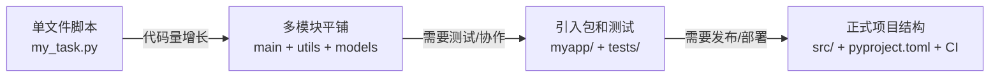
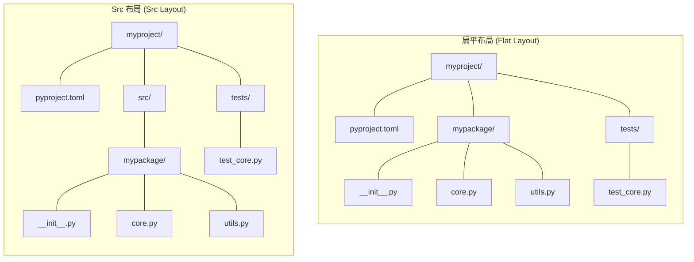
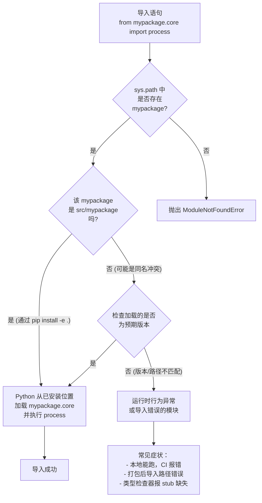

# 项目结构设计

## 概念说明

项目结构设计回答的是一个很根本的问题："代码应该放在哪个目录下？文件之间应该以什么层级关系相互引用？"
对只有单个 `.py` 文件的脚本来说，这不成问题。但当代码量增长到几十个模块、包含测试和文档、需要被多人协作或被其他项目依赖时，一个混乱的目录结构会变成持续产生 bug 的温床。

::: warning 脚本与项目的分水岭
如果你发现自己在做以下任何一件事，你就已经不是在写脚本，而是在维护一个项目：
- 在多个 `.py` 文件之间 `import` 自定义模块
- 需要单独运行测试文件来验证代码行为
- 想把代码打包给别人用，或部署到服务器上
- 需要 CI 流水线自动检查代码质量
:::

本文聚焦 Python 3.12+ 下的项目结构最佳实践。核心要解决的问题只有三个：

1. **源码放哪**：是平铺在项目根目录，还是放进 `src/` 隔离层。
2. **测试怎么组织**：如何让测试代码既能 `import` 到源码，又不污染安装后的包结构。
3. **入口在哪**：命令行工具、可执行脚本如何通过 `pyproject.toml` 声明，而不依赖散乱的 shebang 脚本。

## 核心要点

- 项目结构的选择会影响导入路径、测试可运行性、打包正确性和团队协作效率，不是"风格偏好"问题。
- `src/` 布局（src layout）是 Python 打包权威机构 PyPA 推荐的默认方案，能防止"在当前目录意外导入未安装的源码"。
- 扁平布局（flat layout）对单包小项目足够友好，但一旦项目复杂或需要发布，副作用会逐渐浮现。
- `pyproject.toml` 已取代 `setup.py` / `setup.cfg` / `MANIFEST.in` 的大部分职责，成为项目配置的唯一事实标准。
- 测试目录应镜像源码目录结构，让每个源码模块都能在测试树里找到对应的测试文件。
- 入口点（entry points / `console_scripts`）是声明命令行工具的正确方式，比手写 `#!/usr/bin/env python` 脚本健壮得多。
- 命名空间包（namespace package）用于多个独立分发包共享同一个顶级包名，但不应在日常项目中滥用。
- **常见误区**：项目跑通了就不管结构了。结构混乱的代价不会立刻显现，但会让每一次新人入职和每一次重构都付出更高成本。
- **常见误区**：把所有 `__init__.py` 都写成空文件就万事大吉。`__init__.py` 的内容决定了包的公开 API 和导入行为。

## 为什么项目结构重要：从脚本到项目的演进路径

大多数 Python 开发者的成长路径是这样的：

**阶段一：单文件脚本**

```text
my_task.py          # 所有逻辑堆在一个文件里
```

这个阶段没有任何结构问题。`import` 只涉及标准库和第三方包，不涉及自定义模块。

**阶段二：拆分模块**

```text
project/
├─ main.py           # 入口
├─ utils.py          # 工具函数
├─ models.py         # 数据模型
└─ config.py         # 配置
```

当代码量超过 300-500 行后，按职责拆分成多个文件是自然而然的做法。此时所有文件在同一个目录层级，使用 `import utils` 即可互相引用。

**阶段三：引入子包**

```text
project/
├─ main.py
├─ myapp/
│  ├─ __init__.py
│  ├─ core.py
│  ├─ utils.py
│  └─ models/
│     ├─ __init__.py
│     └─ user.py
├─ tests/
│  ├─ test_core.py
│  └─ test_utils.py
└─ requirements.txt
```

这是很多项目实际停留的阶段。已经用上了包（package）而非模块（module），但目录结构是"随手长出来的"，缺乏系统性设计。

**阶段四：正式项目结构**

```text
myproject/
├─ pyproject.toml
├─ README.md
├─ src/
│  └─ mypackage/
│     ├─ __init__.py
│     ├─ core.py
│     ├─ utils.py
│     └─ models/
│        ├─ __init__.py
│        └─ user.py
├─ tests/
│  ├─ __init__.py
│  ├─ test_core.py
│  └─ conftest.py
├─ docs/
└─ .github/
   └─ workflows/
      └─ ci.yml
```

从阶段三到阶段四，最关键的变化不是文件变多了，而是引入了一套**系统性的约定**：
- 源码被 `src/` 隔离，防止意外的本地导入。
- 项目元数据集中在 `pyproject.toml`。
- 测试目录独立于源码，镜像源码结构。
- CI 配置和文档也有了自己的固定位置。

下面的 Mermaid 图展示了这个演进路径中，项目复杂度与对结构设计需求之间的关系：



::: tip 关键洞察
结构设计不是"做大做强以后再考虑"的事情。在阶段二到阶段三的切换点，花 30 分钟整理好目录结构，能省下后续几周的调试时间。而一旦到了阶段三才回头重建结构，迁移成本会高得多。
:::

## 两种主流布局

Python 社区有两种主流的项目布局方式：扁平布局（Flat Layout）和 src 布局（Src Layout）。
它们之间的区别不在于"谁更高级"，而在于各自解决了不同的问题。

### 扁平布局（Flat Layout）

扁平布局将 Python 包直接放在项目根目录下：

```text
myproject/
├─ pyproject.toml
├─ mypackage/
│  ├─ __init__.py
│  ├─ core.py
│  └─ utils.py
├─ tests/
│  └─ test_core.py
└─ README.md
```

安装方式：`pip install .`（或 `pip install -e .` 用于开发模式）。

**优点**：
- 目录结构直观，新手一眼就能找到源码。
- `import mypackage` 在项目根目录下可以直接工作（但这是一个陷阱，见下文）。
- 小型项目（单一包、少依赖、仅供内部使用）足够胜任。

**隐性问题**：
- 在项目根目录运行 `python` 或 `pytest` 时，当前工作目录会被自动加入 `sys.path`，导致你能 `import mypackage`——但这导入的是**本地源码目录**，而不是**已安装的包**。
- 这意味着：你在本地测试的是一个版本，用户 `pip install` 后得到的可能是另一个版本（比如你忘记在 `pyproject.toml` 里声明某个模块）。
- 打包工具在构建时，可能会意外地把根目录下的其他文件（日志、临时数据、虚拟环境）一起打进去。

### Src 布局（Src Layout）

Src 布局在项目根目录和源码包之间插入一个 `src/` 目录作为隔离层：

```text
myproject/
├─ pyproject.toml
├─ src/
│  └─ mypackage/
│     ├─ __init__.py
│     ├─ core.py
│     └─ utils.py
├─ tests/
│  └─ test_core.py
└─ README.md
```

安装方式：`pip install -e .`（开发模式）。**注意：没有 `-e` 安装时，直接访问 `src/` 下的源码不受支持。**

**优点**：
- 强制你使用 `pip install -e .` 来开发，从而确保测试运行的始终是"安装后的包"，而不是本地目录的快照。这避免了"本地能跑、安装后炸掉"这一经典问题。
- 打包时自动排除根目录的杂项文件，减少构建产物的噪音。
- 如果你的项目包含多个包（比如 `mypackage` 和 `mypackage_cli`），`src/` 是唯一推荐的布局。

**缺点**：
- 多了一层目录，需要团队理解 `src/` 存在的意义。
- 必须使用可编辑安装（`pip install -e .`）才能开发，直接从项目根目录运行 `python src/mypackage/core.py` 会遇到导入路径问题。

### 两种布局的树形对比



::: tip 选择建议
- 单包项目、仅供内部使用、不会发布到 PyPI → 扁平布局足够。
- 需要发布到 PyPI、多包项目、团队协作、有 CI 流程 → 优先选择 src 布局。
- 不确定选哪个 → 选 src 布局。从扁平迁移到 src 有成本，但从 src 迁移回扁平几乎没有成本。
:::

## 核心文件与目录详解

一个经过结构设计的 Python 项目，通常包含以下标准目录和文件。它们各司其职，缺一个不一定会导致项目崩溃，但会让工程体验打折扣。

### `pyproject.toml` —— 项目元数据中心

`pyproject.toml` 是现代 Python 项目唯一的配置真相来源（single source of truth）。它替代了过去散落在 `setup.py`、`setup.cfg`、`MANIFEST.in`、`requirements.txt` 中的配置。

一个典型的最小配置如下：

```toml
[build-system]
requires = ["setuptools>=75", "wheel"]
build-backend = "setuptools.build_meta"

[project]
name = "myproject"
version = "0.1.0"
description = "A well-structured Python project"
readme = "README.md"
requires-python = ">=3.12"
license = {text = "MIT"}
authors = [
    {name = "Your Name", email = "you@example.com"}
]
dependencies = [
    "httpx>=0.27",
    "pydantic>=2",
]

[project.optional-dependencies]
dev = [
    "pytest>=8",
    "ruff>=0.5",
    "mypy>=1.10",
]

[project.scripts]
mycli = "mypackage.cli:main"

[tool.setuptools.packages.find]
where = ["src"]

[tool.pytest.ini_options]
testpaths = ["tests"]
```

几个要点：

- `[build-system]` 声明了构建工具，缺省它则 `pip install` 可能报错。
- `[project]` 块是 PEP 621 标准化的项目元数据。
- `requires-python` 用来声明 Python 版本要求，这会在 PyPI 上展示并影响 pip 的版本解析。
- `[project.scripts]` 声明命令行入口点（见下文详细说明）。
- `[tool.setuptools.packages.find]` 告诉 setuptools 去 `src/` 目录下找包。
- `[tool.pytest.ini_options]` 将 pytest 配置也收入 `pyproject.toml`，避免再散落一个 `pytest.ini`。

### `src/` 或包目录 —— 源码存放处

在 src 布局中，所有可安装的 Python 包都放在 `src/` 下。每个包是一个包含 `__init__.py` 的目录。

```text
src/
└─ mypackage/
   ├─ __init__.py
   ├─ py.typed          # PEP 561 marker: 声明此包提供类型信息
   ├─ core.py
   ├─ utils.py
   ├─ models/
   │  ├─ __init__.py
   │  └─ user.py
   └─ cli.py
```

关于 `__init__.py`：

- 它存在的最基础意义是把目录标记为 Python 包（regular package）。
- 可以在 `__init__.py` 中通过 `from .core import public_function` 来定义包的公开 API，让使用者可以直接 `from mypackage import public_function`。
- 使用 `__all__` 列表显式控制 `from mypackage import *` 的行为。
- 不应在 `__init__.py` 中执行副作用（如连接数据库、发送网络请求），导入不应有副作用。
- `py.typed` 是一个空标记文件，告诉类型检查器（mypy、pyright 等）此包提供了内联类型注解。如果包中有类型注解，务必添加此文件。

### `tests/` —— 测试目录

测试目录应与源码目录镜像对应，形成清晰的映射关系：

```text
src/mypackage/core.py       →  tests/test_core.py
src/mypackage/utils.py      →  tests/test_utils.py
src/mypackage/models/user.py →  tests/models/test_user.py
```

推荐的测试目录结构：

```text
tests/
├─ __init__.py        # 非必需，但有助于解决部分导入问题
├─ conftest.py        # pytest fixtures 和共享配置
├─ test_core.py
├─ test_utils.py
└─ models/
   ├─ __init__.py
   └─ test_user.py
```

**`conftest.py`** 是 pytest 的配置钩子文件，用于定义共享 fixture、插件和命令行选项。它应放在 `tests/` 目录下，pytest 会自动发现并应用。

### `docs/` —— 文档目录

文档通常使用独立工具（如 Sphinx、MkDocs、VitePress）构建，放在 `docs/` 目录下。它不应与源码包混在一起。

### `scripts/` 或 `bin/` —— 工具脚本

与 `[project.scripts]` 定义的正式入口点不同，`scripts/` 或 `bin/` 目录通常用于存放开发期间使用的辅助脚本，它们不需要被打包进发布产物：

```text
scripts/
├─ generate_fixtures.py    # 生成测试数据
├─ migrate_db.py           # 数据库迁移脚本（一次性）
└─ benchmark.sh            # 性能基准测试脚本
```

### `.github/workflows/` —— CI 配置

CI 工作流配置文件放在 `.github/workflows/`（GitHub Actions）或对应的 CI 平台目录下。一个最小 Python CI 工作流应覆盖 lint、类型检查、测试和构建几个步骤（参见 CI/CD）。

## 小型、中型、大型项目的结构模板

不同规模的项目对结构复杂度的需求不同。以下三个模板覆盖了最常见的场景。

### 小型项目（单包，< 20 个模块）

适用于命令行工具、内部脚本库、小型微服务：

```text
myproject/
├─ pyproject.toml
├─ README.md
├─ LICENSE
├─ src/
│  └─ myproject/
│     ├─ __init__.py
│     ├─ py.typed
│     ├─ core.py
│     ├─ utils.py
│     └─ cli.py
├─ tests/
│  ├─ __init__.py
│  ├─ conftest.py
│  ├─ test_core.py
│  └─ test_utils.py
├─ docs/
│  ├─ index.md
│  └─ guide/
│     └─ getting-started.md
├─ scripts/
│  └─ release.sh
└─ .github/
   └─ workflows/
      └─ ci.yml
```

**pyproject.toml 关键配置**：

```toml
[project]
name = "myproject"
requires-python = ">=3.12"

[project.scripts]
myproject = "myproject.cli:main"

[tool.setuptools.packages.find]
where = ["src"]
```

### 中型项目（多子包，20-100 个模块）

适用于有明确领域边界的 Web 应用后端、数据处理管线：

```text
myplatform/
├─ pyproject.toml
├─ README.md
├─ src/
│  └─ myplatform/
│     ├─ __init__.py
│     ├─ py.typed
│     ├─ core/
│     │  ├─ __init__.py
│     │  ├─ config.py
│     │  ├─ security.py
│     │  └─ events.py
│     ├─ domain/
│     │  ├─ __init__.py
│     │  ├─ models/
│     │  │  ├─ __init__.py
│     │  │  ├─ user.py
│     │  │  └─ order.py
│     │  └─ services/
│     │     ├─ __init__.py
│     │     └─ order_service.py
│     ├─ adapters/
│     │  ├─ __init__.py
│     │  ├─ db.py
│     │  ├─ cache.py
│     │  └─ http_client.py
│     └─ api/
│        ├─ __init__.py
│        ├─ routes.py
│        └─ middleware.py
├─ tests/
│  ├─ __init__.py
│  ├─ conftest.py
│  ├─ core/
│  │  ├─ test_config.py
│  │  └─ test_security.py
│  ├─ domain/
│  │  ├─ models/
│  │  │  └─ test_user.py
│  │  └─ services/
│  │     └─ test_order_service.py
│  ├─ adapters/
│  │  ├─ test_db.py
│  │  └─ test_cache.py
│  └─ api/
│     └─ test_routes.py
├─ docs/
├─ scripts/
├─ .github/
│  └─ workflows/
│     ├─ ci.yml
│     └─ release.yml
└─ docker/
   ├─ Dockerfile
   └─ compose.yml
```

**关键设计点**：

- `core/`、`domain/`、`adapters/`、`api/` 是按架构分层组织的子包，而非按文件类型（不要搞成 `models/` 和 `views/` 混在一个层级）。
- 测试目录严格镜像源码结构，一眼就能找到对应关系。
- docker 配置独立成目录，保持根目录整洁。

### 大型项目（多包 monorepo，> 100 个模块）

适用于平台级项目，多个独立可发布包共享同一个仓库：

```text
myplatform/
├─ pyproject.toml              # 工作区/顶层配置（可选）
├─ README.md
├─ packages/
│  ├─ core/
│  │  ├─ pyproject.toml
│  │  ├─ src/
│  │  │  └─ myplatform_core/
│  │  │     ├─ __init__.py
│  │  │     └─ ...
│  │  └─ tests/
│  ├─ api/
│  │  ├─ pyproject.toml
│  │  ├─ src/
│  │  │  └─ myplatform_api/
│  │  │     └─ ...
│  │  └─ tests/
│  ├─ cli/
│  │  ├─ pyproject.toml
│  │  └─ src/
│  │     └─ myplatform_cli/
│  │        └─ ...
│  └─ shared-types/
│     ├─ pyproject.toml
│     └─ src/
│        └─ myplatform_types/
│           └─ ...
├─ docs/
├─ scripts/
├─ .github/
│  └─ workflows/
│     ├─ ci-core.yml
│     ├─ ci-api.yml
│     └─ release.yml
└─ docker/
```

**monorepo 场景下的注意事项**：

- 每个子包有自己的 `pyproject.toml`，独立声明版本和依赖。
- 子包之间的依赖通过标准包名引用（如 `myplatform_core`），配合可编辑安装 `pip install -e packages/core`。
- CI 可以按变更路径选择性触发，不必每次全量构建。
- 版本号可以统一管理（借助工具如 `bump-my-version`）或各自独立。

## 命名空间包

### 什么是命名空间包

命名空间包（namespace package）允许多个独立分发包共享同一个顶级包名前缀。最常见的例子是 `azure-*` 系列包：`azure-storage-blob`、`azure-identity`、`azure-keyvault` 都安装在 `azure/` 这个命名空间下。

```text
# 安装后，site-packages 中的目录结构：
site-packages/
├─ azure/
│  ├─ storage/
│  │  └─ blob/...          # 来自 azure-storage-blob 包
│  ├─ identity/...          # 来自 azure-identity 包
│  └─ keyvault/...          # 来自 azure-keyvault 包
```

### 何时使用

- 你的组织维护了一组相关的包，希望在逻辑上归到同一个命名空间下（如 `acme_corp.data`、`acme_corp.ml`、`acme_corp.web`）。
- 这些包各自独立发布和版本管理，互不锁定。
- 用户可能只需要安装其中一两个，而不是全部。

### 何时不用

- 你只有一个包：此时用常规包（regular package）即可。
- 所有子包总是一起安装：此时可以直接维护一个多子包的常规包。
- 子包之间有紧密的内部 API 耦合：命名空间包不提供任何特殊的内部访问机制。

### 实现方式

自 Python 3.3 起，PEP 420 引入了隐式命名空间包。只需在 `src/` 下创建对应目录，**不要放** `__init__.py`：

```text
# 包 A: acme-data
acme-data/
├─ pyproject.toml
└─ src/
   └─ acme_corp/
      └─ data/              # 注意：命名空间层 acme_corp/ 没有 __init__.py，data/ 是常规包
         ├─ __init__.py
         └─ loader.py

# 包 B: acme-ml
acme-ml/
├─ pyproject.toml
└─ src/
   └─ acme_corp/
      └─ ml/                # 同样没有 __init__.py
         ├─ __init__.py
         └─ predictor.py
```

::: warning 命名空间包的去 `__init__.py` 规则
命名空间包**不能**在命名空间目录层级放置 `__init__.py`。如果 `acme_corp/` 下有 `__init__.py`，这个目录就成了一个常规包，后续安装的其他分发包将无法把自己的子包挂载到这个命名空间下。但子包（如 `data/`、`ml/`）内部仍然需要 `__init__.py` 作为常规包。
:::

## 入口点配置

### 什么是入口点

入口点（entry points）是 Python 包用来向外部暴露可调用对象（函数、类）的标准化机制。最常见的用途是声明**命令行工具**，即 `[project.scripts]`。

### 为什么不用手写脚本

传统做法是在项目根目录放一个 `cli.py` 或以 shebang (`#!/usr/bin/env python`) 开头的脚本，然后用 `chmod +x` 标记为可执行。

这种做法的问题：

- 跨平台兼容性差（Windows 不认 shebang，也不认 Unix 权限位）。
- 依赖解析不可靠：shebang 指向的 Python 解释器可能没有安装所需的依赖。
- 需要手动管理 PATH，或把脚本复制到 `bin/` 目录。

### `[project.scripts]` 的正确写法

在 `pyproject.toml` 中声明：

```toml
[project.scripts]
myapp = "mypackage.cli:main"
myapp-admin = "mypackage.admin_cli:main"
```

对应源码：

```python
# src/mypackage/cli.py
import argparse


def main() -> None:
    parser = argparse.ArgumentParser(prog="myapp")
    parser.add_argument("--verbose", action="store_true")
    args = parser.parse_args()
    # ... 业务逻辑 ...


if __name__ == "__main__":
    main()
```

执行 `pip install -e .` 后，pip 会在虚拟环境的 `bin/`（或 `Scripts/`）目录下生成包装脚本。这个包装脚本：
- 指向当前虚拟环境的 Python 解释器。
- 自动 `import mypackage.cli` 并调用 `main()`。
- 在 Windows 上也生成对应的 `.exe` 包装器。

### `[project.gui-scripts]`

如果入口点是一个 GUI 应用（不希望弹出控制台窗口，仅 Windows 有区别），使用 `gui-scripts`：

```toml
[project.gui-scripts]
myapp-gui = "mypackage.gui:main"
```

## Import 解析路径与 Src 布局的关系

理解 Python 的导入机制对于正确设计项目结构至关重要。以下流程图展示了在 src 布局下，`from mypackage.core import process` 这个导入语句的完整解析过程：



::: warning 关键配置
使用 src 布局时，确保在 `pyproject.toml` 中正确设置包发现路径：

```toml
[tool.setuptools.packages.find]
where = ["src"]
```

如果不设置此选项，setuptools 默认从项目根目录查找包，会找不到 `src/mypackage`。
:::

**测试环境下的导入路径**：

在 src 布局下，运行 `pytest` 时，pytest 会尝试将项目根目录加入 `sys.path`。但正确的做法不是依赖这个行为，而是：

```bash
# 唯一推荐的开发流程
pip install -e ".[dev]"   # 可编辑安装，同时安装开发依赖
pytest                     # 此时 mypackage 作为已安装包被导入
```

这样测试导入的 `mypackage` 与最终用户 `pip install` 后导入的 `mypackage` 完全一致。

## 常见陷阱

| 陷阱 | 症状 | 原因 | 解决方案 |
|---|---|---|---|
| **扁平布局的隐式导入** | 本地测试通过，CI 或用户安装后 `ModuleNotFoundError` | 当前目录被自动加入 `sys.path`，导入了源码而非已安装包 | 改用 src 布局，或始终使用 `pip install -e .` |
| **测试无法导入源码** | `ImportError: No module named 'mypackage'` | 未执行可编辑安装，`sys.path` 中缺少包路径 | 在项目根目录执行 `pip install -e ".[dev]"` |
| **`__init__.py` 中有副作用** | `import mypackage` 时触发网络请求/文件写入/日志输出 | `__init__.py` 在导入时执行，不应包含有副作用的代码 | 将副作用代码移到函数或类中，通过显式调用来触发 |
| **`pip install` 后缺少模块** | 本地文件存在但安装后 `import` 报错 | `pyproject.toml` 中未声明该模块，或包发现配置错误 | 检查 `[tool.setuptools.packages.find]` 配置，确认包目录正确 |
| **命名空间包放了 `__init__.py`** | 后安装的命名空间包无法挂载 | 命名空间目录被标记为常规包，阻止其他分发包加入 | 移除命名空间级别的 `__init__.py`，仅保留子包的 |
| **`__all__` 与公开 API 不一致** | `from package import *` 导入的内容超出预期 | `__init__.py` 中未定义或未维护 `__all__` | 在 `__init__.py` 中显式定义 `__all__`，只包含公开 API |
| **测试与源码命名冲突** | `pytest` 收集到错误的测试模块 | 测试文件名与标准库或第三方包重名（如 `test/csv.py`） | 测试文件以 `test_` 前缀命名，不要与标准库模块重名 |
| **`console_scripts` 指向的函数在导入时执行了副作用** | 命令行工具启动慢、或意外输出了调试信息 | 入口函数所在模块在导入时执行了顶层代码 | 模块顶层只定义，将执行逻辑放在 `if __name__ == "__main__"` 或函数内 |

## 最佳实践

### 1. 测试镜像源码结构

```text
# 推荐
src/myapp/domain/services/order_service.py
tests/domain/services/test_order_service.py

# 不推荐
src/myapp/domain/services/order_service.py
tests/test_order_stuff.py          # 不知道测哪个模块
tests/order/test_order_service.py  # 嵌套路径与源码不一致
```

这样做的好处：
- 文件定位快：看到测试失败，立刻知道去哪个源码文件排查。
- 新成员入职时不用猜测"这个测试对应哪个模块"。
- 代码审查时，PR 的目录结构变化清晰体现新增/移除的模块。

### 2. 避免循环导入

循环导入（circular import）是 Python 项目结构不当的典型症状。当模块 A 导入模块 B，而模块 B（直接或间接）又导入模块 A 时，Python 解释器会抛出 `ImportError`。

**常见触发场景**：
- 在包 `__init__.py` 中导入了包内的子模块，子模块又反过来引用了上层包。
- 两个领域模块互相引用对方的数据模型（如 `Order` 引用 `User`，`User` 引用 `Order`）。

**解决方案**（按推荐程度排序）：

1. **重新审视模块边界**：如果两个模块互相强依赖，可能它们本应属于同一个模块。
2. **提取共享接口/基类到公共模块**：让双方都依赖于抽象，而非彼此的具体实现。
3. **延迟导入（lazy import）**：在函数或方法内部执行 `import`，而非模块顶层。这是最后的补救手段，不应滥用。

```python
# 方案 1：提取共享模块（推荐）
# src/myapp/shared/types.py
from dataclasses import dataclass

@dataclass
class UserRef:
    id: str
    name: str

# src/myapp/orders/models.py
from myapp.shared.types import UserRef

@dataclass
class Order:
    user: UserRef  # 使用轻量引用，而非直接导入 User 模型

# 方案 3：延迟导入（仅在无法重构时使用）
def get_user_for_order(order_id: str):
    from myapp.users.models import User  # 延迟到函数调用时才导入
    # ...
```

### 3. 相对导入还是绝对导入

| 场景 | 推荐方式 | 示例 |
|---|---|---|
| 包内跨子模块引用 | 相对导入 | `from .models import User` |
| 跨包引用（如测试导入源码） | 绝对导入 | `from myapp.models import User` |
| 包内深层嵌套引用 | 相对导入 | `from ..utils import helper` |
| `__init__.py` 重导出 | 相对导入 | `from .core import public_api` |

**指导原则**：
- 包内部使用**相对导入**，因为它更清晰地表达了"这是包内模块之间的引用关系"，且不依赖包名。
- 对外（测试文件、脚本、文档示例）使用**绝对导入**，因为它们是包的消费者，应通过已安装的包名来访问。
- 避免在同一个文件中混用两种导入风格。

### 4. `__init__.py` 的设计原则

```python
# src/myapp/__init__.py —— 好的设计

# 1. 显式定义公开 API
from myapp.core import process, configure
from myapp.models import User, Order

__all__ = ["process", "configure", "User", "Order"]

# 2. 定义包级别元数据
__version__ = "0.1.0"

# 3. 不要在 __init__.py 中做这些事：
#    - 连接数据库
#    - 发送 HTTP 请求
#    - 创建线程/进程
#    - 修改全局状态
#    - 执行任何 I/O 操作
```

### 5. 其他关键实践

- **每个项目根目录只有一个 `README.md`**，包含项目描述、安装步骤、基本使用示例和贡献指南的链接。详细文档放在 `docs/` 下。
- **`conftest.py` 放在测试根目录**，不要放在 `src/` 中。pytest 会沿目录层级向上查找 `conftest.py`，放在 `tests/` 根目录是最清晰的做法。
- **不要在版本控制中提交虚拟环境目录**（`.venv/`、`venv/`、`env/`），将其加入 `.gitignore`。
- **使用 `py.typed` 标记文件**（PEP 561）：如果你的包提供类型注解，在包目录下放一个空的 `py.typed` 文件，让 mypy/pyright 等类型检查器知道这个包的类型信息可用。
- **`requires-python` 版本要具体**：写 `">=3.12"` 而不是 `">=3"`，避免在 Python 4.0 发布时意外兼容。

## 版本说明

- **Python 3.3**：引入 PEP 420 隐式命名空间包，命名空间包不再需要 `__init__.py`。
- **Python 3.11**：标准库加入 `tomllib`，可以直接解析 TOML 格式。
- **Python 3.12**：`pyproject.toml` 作为项目配置中心的实践已普遍成熟。`setuptools` 对 PEP 621 的支持稳定。`pip` 的依赖解析器（自 20.3 起的 resolver）行为更加可预测。
- **`setuptools>=75`**：对 `[tool.setuptools.packages.find]` 和 `[project.scripts]` 的支持稳定，推荐作为构建后端的最低版本。

## 术语表

| 术语 | 英文 | 定义 |
|---|---|---|
| 包 | Package | 包含 `__init__.py` 的目录，可以包含子模块和子包 |
| 模块 | Module | 单个 `.py` 文件 |
| 常规包 | Regular Package | 有 `__init__.py` 的传统 Python 包 |
| 命名空间包 | Namespace Package | 无 `__init__.py`、可跨多个分发包共享的包 |
| 入口点 | Entry Point | 包对外暴露可调用对象的标准化机制 |
| 可编辑安装 | Editable Install | `pip install -e .`，使源码修改即时生效的开发模式 |
| 扁平布局 | Flat Layout | 源码包直接放在项目根目录的结构 |
| Src 布局 | Src Layout | 源码包放在 `src/` 隔离层下的结构 |
| 分发包 | Distribution Package | 可被 pip 安装的、包含 `pyproject.toml` 的目录/归档 |
| 构建后端 | Build Backend | 负责从源码生成 sdist/wheel 的工具（如 setuptools） |
| 控制台脚本 | Console Script | 通过 `[project.scripts]` 声明的命令行入口点 |

## 延伸阅读

- Python Packaging User Guide — Packaging and distributing projects: https://packaging.python.org/tutorials/packaging-projects/
- PyPA — src layout vs flat layout: https://packaging.python.org/discussions/src-layout-vs-flat-layout/
- PEP 621 — Storing project metadata in pyproject.toml: https://peps.python.org/pep-0621/
- PEP 420 — Implicit Namespace Packages: https://peps.python.org/pep-0420/
- PEP 561 — Distributing and Packaging Type Information: https://peps.python.org/pep-0561/
- setuptools 官方文档 — Entry Points: https://setuptools.pypa.io/en/latest/userguide/entry_point.html
- pytest 官方文档 — Good Practices: https://docs.pytest.org/en/stable/explanation/goodpractices.html
- 本栏目相关文档：[打包与发布](05-打包与发布)、[依赖管理](04-依赖管理)、CI/CD

## 版本差异（工程化 → Python 3.13/3.14）

| 特性 | 本文编写时 | 当前 |
|------|-----------|------|
| Python 基线 | 3.8-3.12 | 3.14（最新稳定版，3.9- 已全部 EOL） |
| 包管理 | pip/poetry | `uv` 成为新一代工具（极快）；`pyproject.toml` 为事实标准 |
| 类型检查 | mypy | Pyright/Pylance 为主流；mypy 持续更新 |
| 格式化 | Black/isort | `ruff format` 一体化（Rust 实现） |
| 测试 | pytest 7 | pytest 8.x |
| 构建 | setuptools | 3.12+ `pyproject.toml` 构建后端成熟（Hatchling/Flit） |

> 本文讲解的工程化最佳实践（规范、注解、测试、打包、结构）与 Python 3.14 完全兼容；建议新项目使用 `uv` + `ruff` + `pyproject.toml` 组合。
