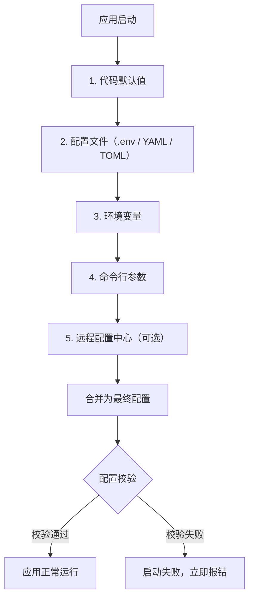
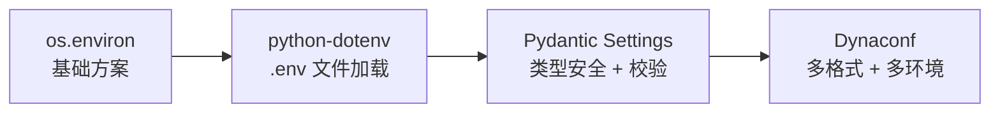

# 配置管理

## 概念说明

配置管理解决的是"程序的行为参数从哪里来、如何组织、怎么保证正确"这三个问题。
一个典型的 Python 项目至少会涉及数据库连接串、Redis 地址、API 密钥、日志级别、功能开关等十几项配置。
如果没有统一的配置管理策略，这些值会散落在代码各处，变成硬编码字符串、注释掉的备选方案、以及"这个值改一下就能切环境"的口头约定。

配置管理的目标不是消灭配置，而是让每一项配置**来源清晰、优先级明确、变更可追溯、启动时可校验**。

::: tip 核心原则
配置应当与代码分离。代码是逻辑，配置是数据。把环境相关的值硬编码进代码，等于把"换个环境部署"变成了"改代码重新发布"。
:::

## 核心要点

- 配置管理的首要目标是**环境分离**：同一份代码，不同环境注入不同配置，而不是不同环境维护不同分支。
- 密钥、Token、密码等敏感信息**绝对不能**出现在代码仓库中，这是安全底线而非风格偏好。
- 配置应有明确的优先级体系，团队中每个人都能回答"这个值最终会从哪里读"。
- 配置校验应该发生在**应用启动时**，而不是第一次用到某个配置项时才报错。
- 所有配置项都应可追溯：从哪里来、默认值是什么、谁在什么时候改过。
- 遵循 [12-Factor App](https://12factor.net/zh_cn/config) 原则：将配置存储在环境变量中，与代码完全分离。
- ⚠️ 常见误区：把 `.env` 文件提交到 Git。"只是开发环境用的"不是理由，一旦提交，历史记录里永远有你的密钥。
- ⚠️ 常见误区：默认值过于宽松。`DEBUG=True` 作为默认值会让生产环境在配置遗漏时以调试模式运行。
- ⚠️ 常见误区：配置散落在 `settings.py`、`config.py`、`constants.py`、环境变量读取、命令行参数解析等各处，改一个值需要翻五个文件。

## 配置来源与优先级

一个工程化的配置系统会从多个来源读取配置，并按明确优先级合并。以下是典型的加载链路：



::: warning 优先级原则
后加载的来源会覆盖先加载的来源。也就是说，命令行参数优先级最高，代码默认值优先级最低。这个顺序保证了：你可以用默认值让开发环境开箱即用，同时用环境变量在生产环境覆盖关键配置。
:::

### 各来源详解

**代码默认值**：在配置类中定义的字段默认值。它们让开发环境无需任何外部配置就能启动，但默认值必须是**安全的**——例如 `DEBUG=False`、数据库连接池大小为保守值。

**配置文件**：`.env`、`config.yaml`、`pyproject.toml` 等。配置文件适合存放非敏感的开发环境默认值。注意：包含密钥的配置文件不应进入版本控制。

**环境变量**：12-Factor App 推荐的主要配置方式。容器化部署、CI/CD 流水线、云平台都原生支持注入环境变量。环境变量的值是字符串，需要配置层做类型转换和校验。

**命令行参数**：适合运行时临时覆盖，例如 `--port 8080`、`--log-level DEBUG`。命令行参数优先级最高，因为它代表"这次运行我明确要求这样做"。

**远程配置中心**：Consul、etcd、AWS Parameter Store、Azure App Configuration 等。适合微服务架构中需要动态变更配置且不重启服务的场景。对于大多数项目属于进阶选项。

## 实现方案对比

Python 生态中配置管理的方案从简到繁有清晰的演进路径。选择哪个方案取决于项目规模和团队对类型安全的要求。



### 方案一：os.environ / os.getenv()

最基础的方案，标准库自带，零依赖。

```python
import os

# 直接读取，不存在时抛出 KeyError
db_host = os.environ["DB_HOST"]

# 带默认值的安全读取
db_port: int = int(os.getenv("DB_PORT", "5432"))
debug: bool = os.getenv("DEBUG", "false").lower() == "true"
```

**优点**：零依赖、直观、适合极简脚本。
**缺点**：没有类型转换和校验、没有结构化管理、密钥容易散落各处、多环境切换需要手动管理环境变量。

::: danger 注意
`os.getenv("KEY")` 在 KEY 不存在时返回 `None`，但 `os.environ["KEY"]` 会抛出 `KeyError`。两者行为不同，混用容易出 bug。建议统一使用 `os.getenv("KEY", "默认值")`。
:::

### 方案二：python-dotenv

在项目根目录放置 `.env` 文件，`python-dotenv` 负责将其加载到 `os.environ`。

```bash
# .env 文件示例
DB_HOST=localhost
DB_PORT=5432
REDIS_URL=redis://localhost:6379/0
SECRET_KEY=dev-secret-do-not-use-in-prod
```

```python
from dotenv import load_dotenv
import os

load_dotenv()  # 自动查找项目根目录的 .env 文件

db_host = os.getenv("DB_HOST", "localhost")
```

**优点**：`.env` 文件是跨语言通用的配置格式，Docker Compose、Node.js 等项目也在用。
**缺点**：仍然没有类型安全和校验，本质上只是把环境变量写进了文件。

### 方案三：Pydantic Settings（推荐）

Pydantic Settings 是目前 Python 生态中配置管理的事实标准。它基于 Pydantic 的数据校验能力，提供类型安全、嵌套配置、多来源加载等工程化特性。

```python
from pydantic_settings import BaseSettings, SettingsConfigDict


class DatabaseSettings(BaseSettings):
    """数据库配置"""
    host: str = "localhost"
    port: int = 5432
    user: str = "postgres"
    password: str = ""
    name: str = "myapp"

    @property
    def url(self) -> str:
        """构建数据库连接 URL（同步驱动）"""
        return f"postgresql://{self.user}:{self.password}@{self.host}:{self.port}/{self.name}"

    @property
    def async_url(self) -> str:
        """构建数据库连接 URL（异步驱动）"""
        return f"postgresql+asyncpg://{self.user}:{self.password}@{self.host}:{self.port}/{self.name}"


class RedisSettings(BaseSettings):
    """Redis 配置"""
    url: str = "redis://localhost:6379/0"
    max_connections: int = 10
    decode_responses: bool = True


class AppSettings(BaseSettings):
    """应用根配置，聚合所有子配置模块"""

    model_config = SettingsConfigDict(
        env_file=".env",          # 自动加载 .env 文件
        env_file_encoding="utf-8",
        env_nested_delimiter="__", # 嵌套配置用 __ 分隔，如 DB__HOST
        case_sensitive=False,      # 环境变量名不区分大小写
    )

    # 应用基础配置
    app_name: str = "MyApp"
    debug: bool = False
    log_level: str = "INFO"

    # API 密钥（敏感信息）
    secret_key: str
    api_key: str = ""

    # 嵌套配置
    db: DatabaseSettings = DatabaseSettings()
    redis: RedisSettings = RedisSettings()


# 使用示例
settings = AppSettings()  # 自动从环境变量和 .env 加载
print(settings.db.url)    # postgresql://postgres:@localhost:5432/myapp
```

::: tip 类型安全的价值
`settings.db.port` 是 `int` 类型，IDE 能自动补全，mypy/pyright 能检查类型错误。如果你在环境变量里设置了 `DB_PORT=not-a-number`，应用会在**启动时**立即报错，而不是在第一次执行 SQL 时才崩溃。
:::

### 方案四：Dynaconf

Dynaconf 支持多种配置格式（TOML、YAML、JSON、INI）和多环境切换，适合已有大量配置文件的项目。

```python
from dynaconf import Dynaconf

settings = Dynaconf(
    envvar_prefix="MYAPP",
    settings_files=["settings.toml", ".secrets.toml"],
    environments=True,  # 启用多环境支持
)

# 通过环境变量 MYAPP_ENV=production 切换环境
print(settings.DB_HOST)
```

| 对比维度 | os.environ | python-dotenv | Pydantic Settings | Dynaconf |
|---|---|---|---|---|
| 类型安全 | 无 | 无 | 强（Pydantic 校验） | 中（支持类型转换） |
| 配置校验 | 无 | 无 | 启动时自动校验 | 支持自定义校验器 |
| 嵌套配置 | 手动处理 | 手动处理 | 原生支持 | 原生支持 |
| 多格式支持 | 仅环境变量 | .env | .env + 环境变量 | TOML/YAML/JSON/INI |
| 多环境切换 | 手动 | 手动 | 通过 env_file 切换 | 原生支持 |
| 学习成本 | 极低 | 低 | 中 | 中 |
| 适用场景 | 极简脚本 | 小型项目 | 中大型项目（推荐） | 多环境、多格式项目 |
| 依赖 | 标准库 | python-dotenv | pydantic-settings | dynaconf |

## Pydantic Settings 实战

以下是一个接近真实项目的完整配置示例，覆盖数据库、Redis、第三方 API、日志和 CORS 配置。

::: code-group

```python [config.py]
from __future__ import annotations

from typing import Literal
from pydantic import Field, SecretStr, field_validator
from pydantic_settings import BaseSettings, SettingsConfigDict


class DatabaseSettings(BaseSettings):
    """数据库连接配置"""

    host: str = "localhost"
    port: int = 5432
    user: str = "postgres"
    password: SecretStr = Field(default=SecretStr(""), description="数据库密码，启动时从环境变量注入")
    name: str = "myapp"
    pool_size: int = Field(default=5, ge=1, le=50, description="连接池大小，1-50")
    echo_sql: bool = False

    @property
    def sync_url(self) -> str:
        return (
            f"postgresql://{self.user}:"
            f"{self.password.get_secret_value()}"
            f"@{self.host}:{self.port}/{self.name}"
        )

    @property
    def async_url(self) -> str:
        return (
            f"postgresql+asyncpg://{self.user}:"
            f"{self.password.get_secret_value()}"
            f"@{self.host}:{self.port}/{self.name}"
        )


class RedisSettings(BaseSettings):
    """Redis 连接配置"""

    url: str = "redis://localhost:6379/0"
    max_connections: int = Field(default=10, ge=1)
    socket_timeout: float = 5.0


class SentrySettings(BaseSettings):
    """Sentry 错误追踪配置"""

    dsn: str = ""
    traces_sample_rate: float = Field(default=1.0, ge=0.0, le=1.0)
    environment: str = "development"


class CorsSettings(BaseSettings):
    """CORS 跨域配置"""

    allowed_origins: list[str] = ["http://localhost:5173"]
    allowed_methods: list[str] = ["GET", "POST", "PUT", "DELETE", "PATCH"]
    allowed_headers: list[str] = ["*"]


class Settings(BaseSettings):
    """应用根配置"""

    model_config = SettingsConfigDict(
        env_file=".env",
        env_file_encoding="utf-8",
        env_nested_delimiter="__",
        case_sensitive=False,
    )

    # ---- 基础配置 ----
    app_name: str = "MyApp"
    version: str = "0.1.0"
    debug: bool = False
    log_level: Literal["DEBUG", "INFO", "WARNING", "ERROR"] = "INFO"

    # ---- 安全配置 ----
    secret_key: SecretStr = Field(
        ...,  # 必填，无默认值
        description="应用密钥，用于 JWT 签名等。启动时必须提供",
    )
    api_key: SecretStr = Field(default=SecretStr(""), description="第三方 API 密钥")

    # ---- 嵌套配置 ----
    db: DatabaseSettings = DatabaseSettings()
    redis: RedisSettings = RedisSettings()
    sentry: SentrySettings = SentrySettings()
    cors: CorsSettings = CorsSettings()

    @field_validator("log_level", mode="before")
    @classmethod
    def uppercase_log_level(cls, v: str) -> str:
        return v.upper()
```

```bash [.env]
# ===== 应用配置 =====
APP_NAME=MyApp
DEBUG=false
LOG_LEVEL=INFO

# ===== 安全配置 =====
SECRET_KEY=dev-secret-change-in-production
API_KEY=

# ===== 数据库配置 =====
DB__HOST=localhost
DB__PORT=5432
DB__USER=postgres
DB__PASSWORD=dev-password
DB__NAME=myapp
DB__POOL_SIZE=10

# ===== Redis 配置 =====
REDIS__URL=redis://localhost:6379/0
REDIS__MAX_CONNECTIONS=20

# ===== Sentry 配置 =====
SENTRY__DSN=
SENTRY__ENVIRONMENT=development

# ===== CORS 配置 =====
CORS__ALLOWED_ORIGINS=["http://localhost:5173","http://localhost:3000"]
```

```python [main.py]
from config import Settings

# 应用启动时加载并校验配置
try:
    settings = Settings()
except Exception as e:
    print(f"配置校验失败，应用无法启动: {e}")
    raise SystemExit(1)

# 使用配置
print(f"应用名称: {settings.app_name}")
print(f"数据库地址: {settings.db.sync_url}")
print(f"Redis 地址: {settings.redis.url}")
print(f"调试模式: {settings.debug}")
```

:::

::: tip SecretStr 的用途
`SecretStr` 在打印或序列化时会显示为 `**********`，避免密钥意外泄漏到日志或错误信息中。但在代码中可以通过 `.get_secret_value()` 获取真实值。
:::

## 敏感信息管理

敏感信息管理是配置管理中最容易出事故的环节。以下是必须遵守的规则：

### 绝对不要做的事

1. **不要把密钥提交到 Git**。一旦提交，即使你马上删除，它仍然存在于 Git 历史中。攻击者会扫描公开仓库的历史记录寻找密钥。
2. **不要把生产环境密钥写在代码注释里**。注释也会被提交到仓库。
3. **不要在 Slack、飞书等聊天工具中直接发送密钥**。这些平台的数据可能被索引和泄露。

### 应该做的事

::: tip .env.example 模板
在仓库中放置一个 `.env.example` 文件，列出所有需要的环境变量及其说明，但**不包含真实密钥**。新成员克隆项目后复制为 `.env` 并填入自己的值。
:::

```bash
# .env.example —— 提交到 Git
# 复制此文件为 .env 并填入真实值
# cp .env.example .env

# 应用密钥（必填，用于 JWT 签名）
SECRET_KEY=change-me-to-a-random-string

# 数据库密码（开发环境）
DB__PASSWORD=your-db-password

# 第三方 API 密钥（可选）
API_KEY=
```

```gitignore
# .gitignore —— 确保 .env 不会被提交
.env
.env.local
.env.*.local
*.secret
```

::: danger 如果密钥已经泄漏到 Git
1. 立即在对应平台（AWS、GitHub、数据库等）轮换密钥，让泄漏的密钥失效。
2. 使用 `git filter-repo` 或 `BFG Repo-Cleaner` 从 Git 历史中彻底清除。
3. 检查访问日志，确认是否有未授权访问。
:::

## 环境策略

典型的项目至少需要三个环境，每个环境的配置策略不同：

| 环境 | 配置来源 | 日志级别 | 调试模式 | 密钥策略 |
|---|---|---|---|---|
| **development** | `.env` 文件 | DEBUG | 开启 | 本地开发密钥，无敏感数据 |
| **staging** | 环境变量 + CI/CD 注入 | INFO | 关闭 | 与生产隔离的测试密钥 |
| **production** | 环境变量 + 密钥管理服务 | WARNING | 关闭 | 从密钥管理服务（Vault/AWS Secrets Manager）注入 |

### 环境切换实现

```python
import os

from pydantic_settings import BaseSettings, SettingsConfigDict


class Settings(BaseSettings):
    model_config = SettingsConfigDict(
        # 通过环境变量指定要加载的 .env 文件，如 ENV_FILE=.env.production
        env_file=os.getenv("ENV_FILE", ".env"),
        env_file_encoding="utf-8",
        extra="ignore",
    )

    env: str = "development"
    debug: bool = False


# 切换环境：ENV_FILE=.env.staging python main.py
# 生产环境建议完全用环境变量注入，不依赖 .env 文件
```

::: warning 生产环境注意事项
生产环境不应依赖 `.env` 文件。应通过容器编排平台（Kubernetes Secrets、Docker Swarm Secrets）或云平台的密钥管理服务注入敏感配置。`.env` 文件只是开发环境的便利工具。
:::

## 常见陷阱

| 陷阱 | 后果 | 正确做法 |
|---|---|---|
| 密钥提交到 Git | 密钥泄露，可能被恶意利用 | `.env` 加入 `.gitignore`，使用 `.env.example` 模板 |
| 默认值过于宽松（如 `DEBUG=True`） | 配置遗漏时生产环境以调试模式运行 | 默认值应设为最安全的选项 |
| 配置散落各处 | 改一个值需要翻多个文件，容易遗漏 | 所有配置集中在统一的 Settings 类中 |
| 启动时不校验配置 | 应用运行到一半才发现配置缺失 | 使用 Pydantic Settings 在启动时校验所有必填项 |
| 硬编码环境判断（`if env == "production"`） | 环境逻辑散落代码各处，难以维护 | 通过配置值控制行为，而非判断环境名称 |
| 敏感信息打印到日志 | 日志系统可能记录密钥 | 使用 `SecretStr`，日志脱敏 |
| 所有环境共用同一套密钥 | 开发环境泄漏影响生产 | 每个环境使用独立的密钥 |
| 配置文件不设版本控制 | 不知道谁在什么时候改了什么 | 非敏感配置文件纳入 Git，变更走 PR 评审 |

## 最佳实践

### 1. 配置即代码

配置的定义（字段名、类型、默认值、校验规则）应当作为代码的一部分纳入版本控制。配置文件的具体值可以随环境变化，但"有哪些配置项、每个配置项是什么类型"应该由代码定义。

```python
# 好的做法：配置结构由代码定义
class Settings(BaseSettings):
    redis_url: str = "redis://localhost:6379/0"
    redis_max_connections: int = Field(default=10, ge=1)

# 坏的做法：配置结构完全由 .env 文件定义，代码中直接 os.getenv()
redis_url = os.getenv("REDIS_URL", "redis://localhost:6379/0")
```

### 2. 所有配置可追溯

- 非敏感配置文件（如 `settings.toml`、`pyproject.toml` 中的配置段）纳入 Git。
- 敏感配置通过环境变量或密钥管理服务注入，在部署日志中记录配置版本（不是配置值）。
- 配置变更走 PR 评审流程，让团队知晓变更内容。

### 3. 启动时校验配置完整性

```python
# main.py 或应用工厂函数中
def create_app() -> FastAPI:
    try:
        settings = Settings()
    except ValidationError as e:
        # 以人类可读的方式展示所有配置错误
        print("配置校验失败，应用无法启动：")
        for error in e.errors():
            print(f"  - {error['loc']}: {error['msg']}")
        raise SystemExit(1)

    # 可选：额外的运行时校验
    if settings.debug and settings.env == "production":
        raise ValueError("生产环境不能开启 DEBUG 模式")

    return FastAPI()
```

### 4. 分层配置

将配置按功能模块拆分，每个模块有自己的配置类，根配置类聚合所有子模块。这样每个模块只关心自己需要的配置，职责清晰。

### 5. 敏感字段使用 SecretStr

Pydantic 的 `SecretStr` 类型在打印和序列化时会自动隐藏真实值，减少密钥意外泄漏的风险。

### 6. 配置文档化

每个配置字段都应有清晰的 `description`，让团队成员无需翻源码就能理解每个配置项的用途。

## 术语表

| 术语 | 说明 |
|---|---|
| **12-Factor App** | 一套构建 SaaS 应用的方法论，其中第三原则要求"配置与代码分离，存储在环境变量中" |
| **环境变量** | 操作系统级别的键值对，进程启动时继承。容器和云平台原生支持注入 |
| **.env 文件** | 存放环境变量的纯文本文件，用于本地开发。不应提交到版本控制 |
| **SecretStr** | Pydantic 提供的字符串包装类型，打印和序列化时自动隐藏真实值 |
| **配置校验** | 在应用启动时检查所有配置项是否存在、类型是否正确、值是否在合法范围内 |
| **配置优先级** | 多个配置来源同时存在时，哪个来源的值最终生效的规则 |
| **密钥轮换** | 定期更换密钥并让旧密钥失效的安全实践 |

## 版本说明

- **Python 3.10+**：支持 `X | Y` 联合类型语法，配置类中可使用 `str | None` 表示可选配置。
- **Python 3.11+**：`tomllib` 进入标准库，可直接在配置加载中使用 TOML 格式。
- **Pydantic Settings**：需要安装 `pydantic-settings` 包，依赖 Pydantic v2。
- **python-dotenv**：第三方包，与 Python 版本无关。
- **Dynaconf**：第三方包，支持 Python 3.8+。

## 延伸阅读

- 12-Factor App 配置原则：https://12factor.net/zh_cn/config
- Pydantic Settings 官方文档：https://docs.pydantic.dev/latest/concepts/pydantic_settings/
- python-dotenv 文档：https://github.com/theskumar/python-dotenv
- Dynaconf 文档：https://www.dynaconf.com/
- PEP 621 - Storing project metadata in pyproject.toml
- OWASP 密钥管理最佳实践：https://cheatsheetseries.owasp.org/cheatsheets/Secrets_Management_Cheat_Sheet.html

## 版本差异（工程化 → Python 3.13/3.14）

| 特性 | 本文编写时 | 当前 |
|------|-----------|------|
| Python 基线 | 3.8-3.12 | 3.14（最新稳定版，3.9- 已全部 EOL） |
| 包管理 | pip/poetry | `uv` 成为新一代工具（极快）；`pyproject.toml` 为事实标准 |
| 类型检查 | mypy | Pyright/Pylance 为主流；mypy 持续更新 |
| 格式化 | Black/isort | `ruff format` 一体化（Rust 实现） |
| 测试 | pytest 7 | pytest 8.x |
| 构建 | setuptools | 3.12+ `pyproject.toml` 构建后端成熟（Hatchling/Flit） |

> 本文讲解的工程化最佳实践（规范、注解、测试、打包、结构）与 Python 3.14 完全兼容；建议新项目使用 `uv` + `ruff` + `pyproject.toml` 组合。
