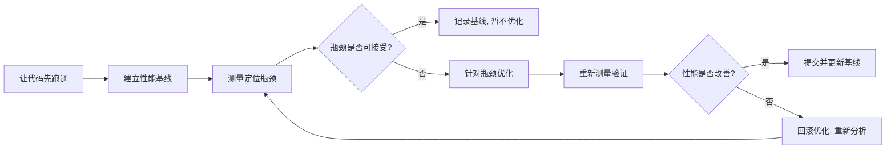
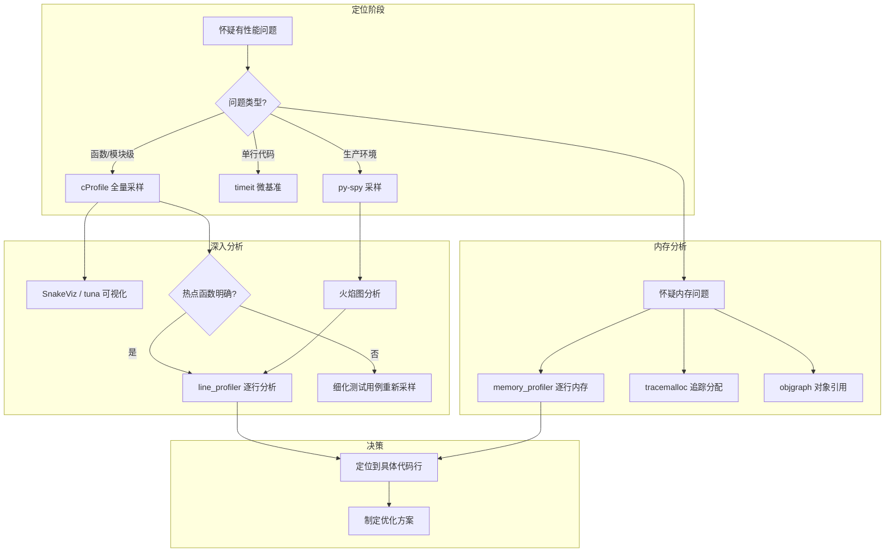
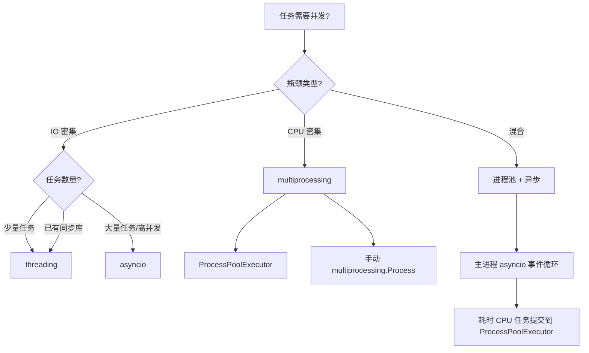

# 性能优化

## 概念说明

性能优化不是"代码写完之后调一调"的可选步骤，而是贯穿开发全周期的工程实践。Python 的性能话题常常被简化成一句"Python 慢"，但这句话既不公平也不准确——真正的问题不是 Python 本身慢，而是开发者没有搞清楚**哪里慢、为什么慢、值不值得优化**。

本文面向有 1-3 年经验的 Python 开发者，系统梳理性能优化的核心方法论：从建立测量基线、定位瓶颈，到代码级优化、数据结构选择、并发策略，再到缓存与进阶方案。读完本文后，你应当能够独立完成一次有据可依、收益可量化的性能优化工作。

## 核心要点

- **先跑通，再测量，后优化**——没有测量数据的优化是盲目的，没有正确性保证的优化是危险的。
- cProfile 是 Python 内置的第一道性能诊断工具，应成为每个开发者的肌肉记忆。
- 代码级优化的收益往往来自"用对数据结构"和"用对内置函数"，而非花哨的技巧。
- 并发策略的选择取决于瓶颈类型：IO 密集走 asyncio，CPU 密集走 multiprocessing，选错方向可能越优化越慢。
- 缓存是性价比最高的优化手段之一，但缓存失效和内存膨胀是两个最常见的坑。
- Python 3.11/3.12 本身带来了显著的内置性能提升，升级解释器版本是零成本的优化。
- 性能优化应纳入 CI 流程，建立性能回归测试，防止优化成果被后续提交悄悄吃掉。

## Python 性能优化哲学

### 不要过早优化

Donald Knuth 的名言"过早优化是万恶之源"在 Python 社区同样适用。在实际工程中，过早优化的典型表现包括：

- 代码还没跑通就开始"优化"循环写法
- 凭直觉猜测瓶颈，而不是用 profiler 测量
- 为了微不足道的性能收益牺牲代码可读性
- 在需求尚未稳定的模块上做深度性能调优

正确的顺序永远是：



::: tip 关键原则
优化的目标不是让代码"看起来更快"，而是让测量数据说话。任何没有前后对比数据的优化都是不可靠的。
:::

### 性能优化的成本层级

不同层级的优化手段，成本与收益差异巨大。理解这个层级有助于你在正确的时机选择正确的工具：

| 层级 | 手段 | 成本 | 典型收益 | 适用时机 |
|---|---|---|---|---|
| 0 | 升级 Python 版本（3.11/3.12） | 极低 | 10%-60% | 任何项目，优先考虑 |
| 1 | 使用内置函数与标准库 | 低 | 2-10x | 日常编码习惯 |
| 2 | 选择正确的数据结构 | 低 | 数倍到数十倍 | 设计阶段 |
| 3 | 添加缓存 | 中 | 数倍到数千倍 | 发现重复计算时 |
| 4 | 并发/并行改造 | 中高 | 数倍 | IO 或 CPU 瓶颈明确时 |
| 5 | Cython / C 扩展 | 高 | 数十倍 | 纯计算热点且前几层已用尽 |
| 6 | 换 PyPy 解释器 | 中 | 数倍 | 兼容且对 CPython C 扩展依赖少 |

## 性能测量工具链

性能优化的第一步永远是测量。Python 生态提供了从微基准到生产环境采样的完整工具链。

### 工具全景图



### timeit：微基准测试

`timeit` 模块用于测量小段代码的执行时间。它自动处理重复运行、禁用垃圾回收等细节，适合对比两种写法的性能差异。

```python
# Python 3.12+
import timeit

# 对比列表推导式 vs map 的性能
setup = "data = list(range(10_000))"

stmt_listcomp = "[x * 2 for x in data]"
stmt_map = "list(map(lambda x: x * 2, data))"

t1 = timeit.timeit(stmt_listcomp, setup=setup, number=10_000)
t2 = timeit.timeit(stmt_map, setup=setup, number=10_000)

print(f"列表推导式: {t1:.4f}s")
print(f"map+lambda:  {t2:.4f}s")
print(f"列表推导式快 {t2/t1:.1f}x")
```

::: warning 注意
`timeit` 默认关闭垃圾回收（`gc.disable()`），如果你的代码依赖 `gc` 行为，需要显式启用。另外，微基准测试的结果不一定能线性外推到真实场景，它更适合做 A/B 对比而非绝对值测量。
:::

### cProfile：函数级性能剖析

`cProfile` 是 Python 标准库内置的确定性 profiler，记录每个函数的调用次数、总耗时、自身耗时等指标。

```python
# Python 3.12+
import cProfile
import pstats
import io


def fibonacci(n: int) -> int:
    """故意用低效递归来演示 profiling"""
    if n <= 1:
        return n
    return fibonacci(n - 1) + fibonacci(n - 2)


def main() -> None:
    result = fibonacci(30)
    print(f"结果: {result}")


# 方式一：直接运行并输出统计
cProfile.run("main()", sort="cumtime")

# 方式二：保存到文件，后续用 pstats 或可视化工具分析
profiler = cProfile.Profile()
profiler.enable()
main()
profiler.disable()

# 输出到字符串
stream = io.StringIO()
stats = pstats.Stats(profiler, stream=stream)
stats.sort_stats("cumtime")
stats.print_stats(10)  # 只打印前 10 条
print(stream.getvalue())
```

常用排序字段：

| 排序字段 | 含义 | 使用场景 |
|---|---|---|
| `cumtime` | 累计时间（含子调用） | 找总耗时最多的函数 |
| `tottime` | 自身时间（不含子调用） | 找函数自身计算最重的 |
| `ncalls` | 调用次数 | 找调用次数异常多的函数 |
| `calls` | 调用者/被调用者关系 | 理解调用链 |

::: tip 可视化工具推荐
命令行输出对大型项目不够直观，推荐使用 **SnakeViz**（`pip install snakeviz`）将 cProfile 输出转为交互式火焰图，或使用 **tuna**（`pip install tuna`）生成更美观的运行时图。
:::

### py-spy：生产环境采样 profiler

`py-spy` 是一个采样型 profiler，不需要修改代码、不需要重启进程，可以直接 attach 到运行中的 Python 进程。它的采样开销极低，适合生产环境诊断。

```bash
# 对运行中的进程采样（PID 为 12345）
py-spy top --pid 12345

# 生成火焰图
py-spy record -o flamegraph.svg --pid 12345

# 直接对脚本采样
py-spy record -o profile.svg -- python my_script.py
```

::: tip 何时选择 py-spy 而非 cProfile
- 生产环境不能重启进程时
- 需要分析多线程/多进程程序的整体视图时
- cProfile 的 overhead 太大（>10%）影响了测量准确性时
- 需要原生格式的火焰图输出时
:::

### line_profiler：逐行分析

当 cProfile 告诉你"这个函数慢"，但函数有几十行代码时，`line_profiler` 能精确到每一行的耗时。

```python
# Python 3.12+
# 安装: pip install line_profiler


@profile  # 装饰器由 kernprof 在运行时注入，直接运行会报错
def process_data(items: list[dict]) -> list[dict]:
    results = []
    for item in items:  # line_profiler 会显示这行的耗时
        value = item.get("value", 0)
        processed = value**2 + value * 3 - 1
        if processed > 100:
            results.append({"id": item["id"], "result": processed})
    return results


# 使用方式（命令行）:
# kernprof -l -v my_script.py
```

输出示例会显示每行的 Hits（执行次数）、Time（总耗时）、Per Hit（单次耗时）和 % Time（占比），让你一眼看到最耗时的代码行。

### memory_profiler：内存分析

性能问题不只有时间维度，内存占用同样关键。`memory_profiler` 提供逐行内存使用量分析。

```python
# Python 3.12+
# 安装: pip install memory_profiler


@profile
def build_large_list() -> list[int]:
    """对比不同方式构建大列表的内存使用"""
    # 方式一：一次性构建
    data = [i * 2 for i in range(1_000_000)]  # 内存峰值高
    total = sum(data)
    del data

    # 方式二：生成器惰性求值
    total2 = sum(i * 2 for i in range(1_000_000))  # 内存峰值低

    return [total, total2]


# 使用方式（命令行）:
# python -m memory_profiler my_script.py
```

## 代码级优化

### 优先使用内置函数和标准库

Python 的内置函数和标准库核心模块是用 C 实现的，调用它们相当于直接执行 C 代码，比纯 Python 循环快一个数量级。

```python
# Python 3.12+
import random

data = [random.randint(0, 100) for _ in range(100_000)]

# 差：手动循环求和
total = 0
for x in data:
    total += x

# 好：使用内置 sum（C 实现）
total = sum(data)

# 差：手动找最大值
max_val = data[0]
for x in data:
    if x > max_val:
        max_val = x

# 好：使用内置 max
max_val = max(data)

# 差：手动去重
seen: set[int] = set()
unique: list[int] = []
for x in data:
    if x not in seen:
        seen.add(x)
        unique.append(x)

# 好：利用 set 的特性
unique = list(set(data))
```

常用内置函数的 C 实现加速比：

| 内置函数 | 对比手写循环 | 原因 |
|---|---|---|
| `sum()` | 5-10x | C 级别累加 |
| `max()` / `min()` | 3-5x | C 级别遍历 |
| `sorted()` | 10-20x | Timsort 在 C 中实现 |
| `any()` / `all()` | 3-5x | 短路求值 + C 实现 |
| `map()` / `filter()` | 2-3x | C 级别迭代（但不如推导式直观） |
| `str.join()` | 10-100x | 避免字符串重复分配 |

### 列表推导式 vs map/filter

```python
# Python 3.12+
data = list(range(100_000))

# 列表推导式（推荐）：可读性好，性能优秀
result1 = [x * 2 for x in data if x % 2 == 0]

# map + filter + lambda：性能略优但可读性差
result2 = list(map(lambda x: x * 2, filter(lambda x: x % 2 == 0, data)))

# 结论：优先用列表推导式。只有当函数已经是现成的 C 实现时，
# map(str.lower, names) 才比 [n.lower() for n in names] 略快。
```

### 生成器：惰性求值减少内存

当数据量很大但只需要遍历一次时，生成器可以显著降低内存占用。

```python
# Python 3.12+
from collections.abc import Iterator


def read_large_file(path: str) -> Iterator[str]:
    """逐行读取大文件，内存占用恒定"""
    with open(path, encoding="utf-8") as f:
        for line in f:
            yield line.strip()


# 差：一次性加载所有行到内存
# lines = open("huge_file.txt").readlines()

# 好：生成器管道处理
def process_logs(path: str) -> dict[str, int]:
    error_counts: dict[str, int] = {}
    for line in read_large_file(path):
        if "ERROR" in line:
            # 提取错误类型（简化示例）
            error_type = line.split("ERROR")[-1].strip().split()[0]
            error_counts[error_type] = error_counts.get(error_type, 0) + 1
    return error_counts
```

::: tip 生成器表达式
当逻辑简单时，用生成器表达式替代生成器函数更简洁：`sum(x * 2 for x in range(10**7))` 不会在内存中创建包含一千万个元素的列表。
:::

### 局部变量缓存

Python 查找变量时遵循 LEGB 规则（Local -> Enclosing -> Global -> Built-in），每次访问全局变量或属性都需要额外的字典查找。在循环中将这些引用缓存为局部变量可以显著提速。

```python
# Python 3.12+
import math


def compute_distances_slow(points: list[tuple[float, float]]) -> list[float]:
    """慢：每次循环都查找 math.sqrt 和 math.atan2"""
    return [
        math.sqrt(x**2 + y**2) * math.atan2(y, x)
        for x, y in points
    ]


def compute_distances_fast(points: list[tuple[float, float]]) -> list[float]:
    """快：将函数引用缓存为局部变量"""
    sqrt = math.sqrt
    atan2 = math.atan2
    return [
        sqrt(x**2 + y**2) * atan2(y, x)
        for x, y in points
    ]


# 同样适用于方法调用
def process_items_slow(items: list[str]) -> list[str]:
    result: list[str] = []
    for item in items:
        result.append(item.strip().upper())  # 每次查找 append
    return result


def process_items_fast(items: list[str]) -> list[str]:
    result: list[str] = []
    append = result.append
    strip = str.strip
    upper = str.upper
    for item in items:
        append(upper(strip(item)))
    return result
```

### 字符串拼接用 join()

```python
# Python 3.12+
words = ["hello", "world", "python", "performance"] * 10_000

# 差：+ 拼接每次创建新字符串，O(n²) 复杂度
# result = ""
# for w in words:
#     result += w + ","

# 好：join() 一次性分配结果空间
result = ",".join(words)
```

### collections.deque 替代 list 做队列

`list.pop(0)` 或 `list.insert(0, item)` 是 O(n) 操作，因为需要移动所有后续元素。`collections.deque` 在两端操作都是 O(1)。

```python
# Python 3.12+
from collections import deque


class RecentItems:
    """保存最近 N 条记录的高效队列"""

    def __init__(self, maxlen: int = 100) -> None:
        self._items: deque[str] = deque(maxlen=maxlen)

    def add(self, item: str) -> None:
        self._items.append(item)  # O(1)

    def get_recent(self, n: int = 10) -> list[str]:
        return list(self._items)[-n:]

    @property
    def count(self) -> int:
        return len(self._items)
```

## 数据结构选择指南

选择正确的数据结构往往是性能优化中收益最大的单次决策。下表总结了常见场景下的最优选择：

| 场景 | 推荐结构 | 时间复杂度 | 避免使用 | 原因 |
|---|---|---|---|---|
| 频繁在两端插入/删除 | `collections.deque` | O(1) | `list` | list 的 pop(0)/insert(0) 是 O(n) |
| 快速成员检测（`in`） | `set` / `frozenset` | O(1) 平均 | `list` | list 的 `in` 是 O(n) |
| 键值对快速查找 | `dict` | O(1) 平均 | `list` of tuples | 线性扫描是 O(n) |
| 保持插入顺序的键值对 | `dict`（3.7+ 保证） | O(1) | `collections.OrderedDict` | 普通 dict 已保证顺序 |
| 需要计数 | `collections.Counter` | O(n) 构建 | 手动 dict 循环计数 | Counter 是 C 优化的 |
| 固定容量 LRU 缓存 | `collections.deque(maxlen=N)` | O(1) | 手动管理 list | deque 自动淘汰旧元素 |
| 需要最小/最大值频繁获取 | `heapq` | O(log n) 插入, O(1) 取最值 | `list` + `min()`/`max()` | 每次 min/max 是 O(n) |
| 不可变序列 | `tuple` | 创建后不可变 | `list` | tuple 更省内存，创建更快 |
| 大量数值计算 | `array.array` / `numpy.ndarray` | 向量化操作 | `list` | list 存储 PyObject 指针，开销大 |
| 带默认值的字典 | `collections.defaultdict` | O(1) | `dict` + `setdefault` | 代码更简洁，减少判断 |
| 需要命名字段的记录 | `dataclasses.dataclass` | - | `dict` / `tuple` | 类型安全，内存优化（`__slots__`） |

::: tip 选择数据结构的决策流程
1. 先明确操作模式：主要是读还是写？需要什么查询模式？
2. 查表匹配推荐结构。
3. 如果不确定，用 `timeit` 对比两种候选结构的实际性能。
4. 在原型阶段不必过度纠结，但一旦数据量上来，数据结构的选择就是性能的分水岭。
:::

## 并发策略选择

Python 的并发模型因 GIL（全局解释器锁）的存在而显得特殊。选错并发方案不仅不能提速，反而可能因为上下文切换开销而变慢。

### 决策框架



### IO 密集：asyncio

```python
# Python 3.12+
import asyncio
import time
from typing import Any

import httpx  # pip install httpx


async def fetch_url(client: httpx.AsyncClient, url: str) -> dict[str, Any]:
    """异步获取 URL"""
    response = await client.get(url)
    return {"url": url, "status": response.status_code, "length": len(response.text)}


async def fetch_all(urls: list[str]) -> list[dict[str, Any]]:
    async with httpx.AsyncClient(timeout=httpx.Timeout(10.0)) as client:
        tasks = [fetch_url(client, url) for url in urls]
        return await asyncio.gather(*tasks)


# 使用
# results = asyncio.run(fetch_all(["https://httpbin.org/delay/1"] * 10))
```

### CPU 密集：multiprocessing

```python
# Python 3.12+
from concurrent.futures import ProcessPoolExecutor
import math


def is_prime(n: int) -> bool:
    """CPU 密集：判断素数"""
    if n < 2:
        return False
    for i in range(2, int(math.sqrt(n)) + 1):
        if n % i == 0:
            return False
    return True


def count_primes_in_range(start: int, end: int) -> int:
    return sum(1 for n in range(start, end) if is_prime(n))


def parallel_prime_count(total_range: int, workers: int = 4) -> int:
    """使用进程池并行计算素数个数"""
    chunk_size = total_range // workers
    ranges = [
        (i * chunk_size, (i + 1) * chunk_size)
        for i in range(workers)
    ]

    with ProcessPoolExecutor(max_workers=workers) as executor:
        futures = [executor.submit(count_primes_in_range, s, e) for s, e in ranges]
        return sum(f.result() for f in futures)
```

### 并发方案对比

| 方案 | 适用场景 | GIL 影响 | 内存开销 | 通信方式 | 调试难度 |
|---|---|---|---|---|---|
| `asyncio` | 高并发 IO（网络、文件） | 不受限（IO 释放 GIL） | 低（单线程） | 无需特殊通信 | 中 |
| `threading` | 中等并发 IO | IO 时释放 GIL | 低（共享内存） | `queue.Queue` | 中高（竞态条件） |
| `multiprocessing` | CPU 密集 | 不受限（独立进程） | 高（每进程独立内存） | `Queue` / `Pipe` / `shared_memory` | 中 |
| `concurrent.futures` | 统一接口 | 取决于后端 | 取决于后端 | 取决于后端 | 低 |

::: danger 注意
用 `threading` 解决 CPU 密集问题是 Python 中最常见的性能错误之一。由于 GIL 的存在，多个线程无法同时执行 Python 字节码，CPU 密集任务用多线程不仅不会加速，反而会因为线程切换开销而变慢。CPU 密集任务请使用 `multiprocessing`。
:::

## 缓存策略

缓存是性价比最高的性能优化手段——用空间换时间，避免重复计算。

### functools.lru_cache

```python
# Python 3.12+
import functools
import time


@functools.lru_cache(maxsize=128)
def expensive_query(user_id: int, month: str) -> dict:
    """模拟一次昂贵的数据库查询"""
    time.sleep(0.1)  # 模拟查询延迟
    return {"user_id": user_id, "month": month, "data": "some result"}


# 第一次调用：执行查询
result1 = expensive_query(42, "2026-01")  # 耗时 ~100ms

# 第二次调用：命中缓存
result2 = expensive_query(42, "2026-01")  # 耗时 ~0ms

# 查看缓存统计
print(expensive_query.cache_info())
# CacheInfo(hits=1, misses=1, maxsize=128, currsize=1)
```

::: warning 注意
`lru_cache` 要求函数的参数必须是可哈希的（不能传 list、dict 等可变类型）。如果需要缓存带可变参数的结果，可以先将其转为不可变类型（如 `tuple`、`frozenset`），或使用 `functools.cache`（Python 3.9+，无容量限制的简化版）。
:::

### 本地内存缓存

对于需要跨函数共享、支持过期时间的缓存，可以使用 `cachetools` 或自行实现：

```python
# Python 3.12+
import time
from collections.abc import Callable
from typing import TypeVar

T = TypeVar("T")


class TTLCache:
    """简单的带过期时间的本地缓存"""

    def __init__(self, ttl_seconds: float = 60.0) -> None:
        self._ttl = ttl_seconds
        self._store: dict[str, tuple[float, object]] = {}

    def get(self, key: str) -> object | None:
        entry = self._store.get(key)
        if entry is None:
            return None
        timestamp, value = entry
        if time.monotonic() - timestamp > self._ttl:
            del self._store[key]
            return None
        return value

    def set(self, key: str, value: object) -> None:
        self._store[key] = (time.monotonic(), value)

    def clear_expired(self) -> int:
        """清理过期条目，返回清理数量"""
        now = time.monotonic()
        expired = [
            k for k, (ts, _) in self._store.items()
            if now - ts > self._ttl
        ]
        for k in expired:
            del self._store[k]
        return len(expired)
```

### Redis 缓存（分布式场景）

当多个进程或服务需要共享缓存时，Redis 是 Python 生态中最常见的选择：

```python
# Python 3.12+
# pip install redis
import json
from typing import Any

import redis


class RedisCache:
    def __init__(
        self,
        host: str = "localhost",
        port: int = 6379,
        default_ttl: int = 300,
    ) -> None:
        self._client = redis.Redis(host=host, port=port, decode_responses=True)
        self._default_ttl = default_ttl

    def get(self, key: str) -> Any | None:
        value = self._client.get(key)
        if value is None:
            return None
        return json.loads(value)

    def set(self, key: str, value: Any, ttl: int | None = None) -> None:
        self._client.setex(
            key,
            ttl or self._default_ttl,
            json.dumps(value),
        )

    def delete(self, key: str) -> None:
        self._client.delete(key)
```

### 缓存策略对比

| 方案 | 适用场景 | 过期支持 | 持久化 | 跨进程 | 复杂度 |
|---|---|---|---|---|---|
| `lru_cache` | 单函数、纯计算 | 否（LRU 淘汰） | 否 | 否 | 极低 |
| `cachetools.TTLCache` | 单进程、需过期 | 是 | 否 | 否 | 低 |
| 自建 TTL 字典 | 单进程、简单场景 | 是 | 否 | 否 | 低 |
| Redis | 分布式、多服务 | 是 | 可选 | 是 | 中 |
| `functools.cache` | 单函数、无容量限制 | 否 | 否 | 否 | 极低 |

## Python 3.11/3.12 内置性能提升

升级 Python 版本是零成本的性能优化。3.11 和 3.12 带来了显著的内置加速：

| 版本 | 关键优化 | 典型提升 | 影响范围 |
|---|---|---|---|
| 3.11 | Faster CPython（自适应解释器） | 10%-25% 整体 | 所有纯 Python 代码 |
| 3.11 | 零开销异常处理 | 异常处理几乎无开销 | try/except 重度场景 |
| 3.11 | 内联函数调用 | 函数调用开销降低 | 函数调用频繁的代码 |
| 3.11 | `asyncio` 重写 | Task 创建显著加快 | 异步代码 |
| 3.12 | 推导式内联 | 列表/字典/集合推导式更快 | 所有推导式 |
| 3.12 | 不可变对象优化（immortal objects） | 内存和启动优化 | 全局对象、None/True/False |
| 3.12 | `asyncio` 性能持续优化 | TaskGroup 等更高效 | 异步代码 |
| 3.12 | 每个子解释器的独立 GIL（PEP 684） | 为真正的并行铺路 | 未来多核利用 |

::: tip 实际收益
根据官方 pyperformance 基准，Python 3.11 较 3.10 平均约 1.25 倍，3.12 再快约 5%，纯 Python 代码从 3.10 升级到 3.12 通常可获得约 25%-35% 的整体性能提升（视工作负载，区间 10%-60%），无需修改任何代码。
:::

## 进阶方案概述

当代码级优化和并发改造仍无法满足性能需求时，可以考虑以下进阶方案。这些方案成本较高，建议在确认热点且前几层优化已用尽后再采用。

### Cython / C 扩展

**Cython** 是 Python 的超集，允许在 Python 代码中添加静态类型声明，然后编译为 C 扩展模块。对于数学计算、循环密集的代码，Cython 可以带来数十倍的性能提升。

- 适合：数值计算、图像处理、数据序列化等纯计算热点
- 成本：需要学习 Cython 语法，引入编译步骤
- 文档：https://cython.readthedocs.io/

**C 扩展**（Python C API / `pybind11`）直接用 C/C++ 编写 Python 模块，性能最高但开发成本也最高。

- 适合：对性能要求极致的核心算法
- 成本：需要 C/C++ 能力，调试困难，跨平台编译复杂
- 推荐：优先使用 `pybind11` 而非原始 Python C API

### Numba JIT 编译

**Numba** 是一个 JIT（Just-In-Time）编译器，通过装饰器将 Python 函数编译为机器码。它对 NumPy 数组操作和数值循环的加速效果尤为显著。

```python
# Python 3.12+
# pip install numba
from numba import jit
import math


@jit(nopython=True)
def count_primes_numba(limit: int) -> int:
    """Numba 加速的素数计数"""
    count = 0
    for n in range(2, limit):
        is_p = True
        for i in range(2, int(math.sqrt(n)) + 1):
            if n % i == 0:
                is_p = False
                break
        if is_p:
            count += 1
    return count
```

- 适合：数值循环、NumPy 操作、科学计算
- 限制：只支持 Python 语法子集和 NumPy 的部分功能
- 文档：https://numba.readthedocs.io/

### PyPy 解释器

**PyPy** 是 Python 的替代解释器，使用 JIT 编译技术，对纯 Python 代码通常有 3-7 倍的性能提升。

- 适合：纯 Python 逻辑为主、不依赖 C 扩展的项目
- 限制：与部分 C 扩展不兼容（如 numpy 需要特殊版本），内存占用通常更高
- 文档：https://www.pypy.org/

::: warning 选择 PyPy 前需要验证
PyPy 不是 CPython 的"加速版"，而是另一个实现。使用前需要确认：所有依赖在 PyPy 下可运行、性能确实有提升（不是所有代码都能加速）、内存开销可接受。
:::

## 常见陷阱

| 陷阱 | 表现 | 正确做法 |
|---|---|---|
| 过早优化 | 代码可读性牺牲，但瓶颈根本不在这里 | 先跑通，用 profiler 找到真正的热点再优化 |
| 不测量就优化 | 凭直觉"优化"后性能反而下降 | 优化前后必须对比测量数据 |
| 用多线程解决 CPU 密集问题 | 线程越多越慢，CPU 利用率上不去 | CPU 密集用 `multiprocessing` |
| 在循环中拼接字符串 | 数据量大时耗时指数增长 | 使用 `"".join()` |
| 用 list 做频繁的头部操作 | `pop(0)` / `insert(0, x)` 极慢 | 使用 `collections.deque` |
| 忘记缓存重复计算 | 同一个昂贵计算被反复执行 | 使用 `lru_cache` 或手动缓存 |
| 不设 maxsize 的 lru_cache | 内存持续增长，最终 OOM | 始终设置合理的 `maxsize` |
| 在 asyncio 中调用同步阻塞函数 | 整个事件循环被阻塞 | 使用 `loop.run_in_executor()` 包装 |
| 忽略 Python 版本升级 | 白白浪费约 25%-35% 的免费性能提升 | 积极跟进 Python 3.11/3.12+ |
| 对生成器多次遍历 | 第二次遍历为空 | 需要多次遍历时转为 list 或使用 `itertools.tee` |

## 最佳实践

### 建立性能基线

任何优化工作都应从建立性能基线开始。基线是你判断"优化是否有效"的唯一参照物。

1. **确定关键指标**：响应时间（P50/P95/P99）、吞吐量（QPS）、内存峰值、CPU 利用率。
2. **编写基准测试脚本**：模拟真实负载，而非人工构造的理想场景。
3. **记录基线数据**：将结果写入项目文档或 CI 产物，确保团队共享同一认知。
4. **每次优化后更新基线**：形成"基线 -> 优化 -> 新基线"的闭环。

### CI 中集成性能回归测试

性能优化不是一次性工作。今天优化好的代码，明天可能被一个看似无害的 PR 拖慢。将性能测试集成到 CI 流程中，可以防止性能退化。

```yaml
# GitHub Actions 示例片段
perf:
  runs-on: ubuntu-latest
  steps:
    - uses: actions/checkout@v4
    - uses: actions/setup-python@v5
      with:
        python-version: "3.12"
    - name: Install dependencies
      run: pip install -e .[dev]
    - name: Run performance benchmarks
      run: pytest tests/benchmarks/ --benchmark-only
    - name: Compare with baseline
      run: python scripts/compare_benchmarks.py
```

::: tip 性能回归测试的要点
- 使用专用 runner 或标记（如 `pytest-benchmark`）隔离性能测试
- 设定合理的性能退化阈值（如 10%），超过则 CI 失败
- 性能测试环境应尽量稳定（专用 runner、避免共享资源）
- 将基准数据版本化存储，便于追溯历史趋势
:::

### 性能优化的检查清单

在提交性能优化 PR 之前，确认以下事项：

- [ ] 是否用 profiler 定位了真正的瓶颈（而非猜测）？
- [ ] 是否有优化前后的对比测量数据？
- [ ] 优化是否通过了所有现有测试（行为未被改变）？
- [ ] 代码可读性是否仍在可接受范围内？
- [ ] 如果引入了缓存，是否设置了合理的容量和过期策略？
- [ ] 如果引入了并发，是否处理了竞态条件和资源管理？
- [ ] 是否更新了性能基线文档？

## 术语表

| 术语 | 说明 |
|---|---|
| GIL（Global Interpreter Lock） | CPython 解释器中的全局锁，保证同一时刻只有一个线程执行 Python 字节码 |
| Profiler | 性能分析器，用于测量程序各部分的时间/内存消耗 |
| 火焰图（Flame Graph） | 将调用栈可视化为色块层级，宽度代表耗时占比 |
| 采样 Profiler | 以固定频率采样调用栈，而非记录每次调用（如 py-spy） |
| 确定性 Profiler | 记录每次函数调用和返回（如 cProfile），overhead 更高但数据更精确 |
| LRU（Least Recently Used） | 最近最少使用淘汰策略，缓存满时淘汰最久未访问的条目 |
| JIT（Just-In-Time）编译 | 运行时将代码编译为机器码，PyPy 和 Numba 都使用此技术 |
| TTL（Time To Live） | 缓存条目的生存时间，过期后自动失效 |
| 惰性求值（Lazy Evaluation） | 只在需要时才计算值，生成器是典型实现 |
| QPS（Queries Per Second） | 每秒查询数，衡量系统吞吐量的常用指标 |

## 版本说明

- **Python 3.11**：Faster CPython 项目落地，整体性能提升 10%-25%，异常处理零开销，asyncio 重写。
- **Python 3.12**：推导式内联、不可变对象优化、子解释器独立 GIL（PEP 684），整体性能继续提升。
- **Python 3.13+ 展望**：实验性 JIT 编译器（PEP 744），GIL 可选（PEP 703，free-threaded 模式），性能格局可能发生根本变化。
- **工具兼容性**：本文涉及的 cProfile、timeit、line_profiler、memory_profiler、py-spy 在 Python 3.12 下均稳定可用。

## 延伸阅读

- Python 官方性能文档：https://docs.python.org/3/howto/perf.html
- cProfile 官方文档：https://docs.python.org/3/library/profile.html
- py-spy 项目：https://github.com/benfred/py-spy
- SnakeViz 可视化工具：https://github.com/jiffyclub/snakeviz
- line_profiler：https://github.com/pyutils/line_profiler
- memory_profiler：https://github.com/pythonprofilers/memory_profiler
- Numba 文档：https://numba.readthedocs.io/
- Cython 文档：https://cython.readthedocs.io/
- PyPy 官网：https://www.pypy.org/
- Python 3.11 新特性：https://docs.python.org/3/whatsnew/3.11.html
- Python 3.12 新特性：https://docs.python.org/3/whatsnew/3.12.html
- `pytest-benchmark`：https://pytest-benchmark.readthedocs.io/

## 相关页面

- [代码规范](01-代码规范)
- [测试](03-测试)
- CI/CD

## 版本差异（工程化 → Python 3.13/3.14）

| 特性 | 本文编写时 | 当前 |
|------|-----------|------|
| Python 基线 | 3.8-3.12 | 3.14（最新稳定版，3.9- 已全部 EOL） |
| 包管理 | pip/poetry | `uv` 成为新一代工具（极快）；`pyproject.toml` 为事实标准 |
| 类型检查 | mypy | Pyright/Pylance 为主流；mypy 持续更新 |
| 格式化 | Black/isort | `ruff format` 一体化（Rust 实现） |
| 测试 | pytest 7 | pytest 8.x |
| 构建 | setuptools | 3.12+ `pyproject.toml` 构建后端成熟（Hatchling/Flit） |

> 本文讲解的工程化最佳实践（规范、注解、测试、打包、结构）与 Python 3.14 完全兼容；建议新项目使用 `uv` + `ruff` + `pyproject.toml` 组合。
