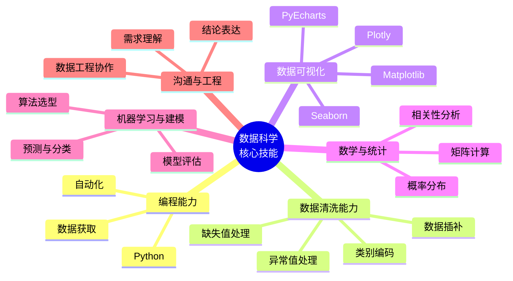
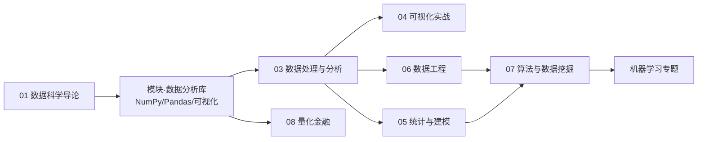

# 数据科学导论

> 本页是「数据科学」专题的**统一入口**。经过深度融合，原「数据分析」「数据分析实战」「数据工程」「数据挖掘」四个并列目录，已重组为按「导论 → 数据处理 → 工程化 → 算法建模」分层的数据科学知识体系，核心工具链（NumPy/Pandas 等）位于 [模块·数据分析库](/docs/python/模块/数据分析库/01-NumPy数组与数据类型)。

## 什么是数据科学

数据驱动早已成为互联网公司乃至传统行业的普遍共识。数据分析、数据挖掘、数据工程构建起从原始数据到业务价值转化的完整链路：

- **数据分析**让业务决策有据可依：通过取数、清洗、统计分析、可视化，把数据转化为结论。
- **数据挖掘**从海量数据中发现隐藏规律：用算法从数据中学习模型，支撑推荐、风控、预测等智能业务。
- **数据工程**让上述过程规模化、自动化：通过 ETL 管道、任务调度、质量校验，保障数据从采集到应用的稳定交付。

用 Python 串联这三者，仅需一套技术栈即可覆盖「取数 → 清洗 → 分析 → 建模 → 可视化」的完整数据闭环，这也是 Python 成为数据科学主流语言的根本原因。

### 数据科学解决的四大问题

数据挖掘与建模围绕四类经典问题展开，本专题的算法篇也按此组织：

| 问题类型 | 目标 | 代表算法 | 典型场景 |
|---------|------|---------|---------|
| 分类 | 预测离散类别 | KNN、决策树、朴素贝叶斯、SVM、神经网络 | 用户流失预测、文本分类 |
| 聚类 | 发现天然分组 | K-Means、DBScan | 用户分群、相似城市发现 |
| 回归 | 预测连续数值 | 线性回归、逻辑回归 | 房价预测、销量预测 |
| 关联 | 发现共现规律 | Apriori、FP-Growth | 啤酒与尿布、景点玩法关联 |

## 数据分析师的核心技能

无论从事数据分析还是数据挖掘，体系化的技能树是持续成长的基础。以下六大能力构成数据科学的技能主干：

- **编程能力**：Python 是贯穿全流程的主力语言，用于取数、清洗、分析、建模与报告生成。
- **数据清洗能力**：上游系统不可靠导致数据源普遍存在缺失、异常、重复等问题，清洗是分析质量的前提。
- **数据可视化能力**：不仅用于呈现结果，还能在分析过程中帮助发现规律与特征关联。
- **数学与统计基础**：概率分布、相关性、矩阵运算与梯度是建模与评估的底层支撑。
- **机器学习与建模能力**：通过训练模型对业务产生预测性效果，而非仅输出结论。
- **沟通与工程能力**：与上游系统、下游决策者及工程团队协作，让分析落地。

## 本专题的学习路径

深度融合后，本专题按「导论 → 数据分析库（模块专题）→ 数据处理 → 工程化 → 算法建模」组织，建议按以下顺序学习：

| 分层 | 目录 | 内容 | 角色 |
|------|------|------|------|
| 导论 | [01-数据科学导论](/docs/python/数据科学/01-数据科学导论/00-数据科学导论) | 数据科学概览、技能体系、学习路径 | 全局认知 |
| 数据分析库 | [模块·数据分析库](/docs/python/模块/数据分析库/01-NumPy数组与数据类型) | NumPy、Pandas、Matplotlib、Seaborn、PyEcharts、数据获取 | 掌握核心库 |
| 数据处理 | [02-数据处理与分析](/docs/python/数据科学/02-数据处理与分析/02-文件读取与DataFrame) | 数据采集、DataFrame、清洗、时间序列、统计 | 实战数据处理 |
| 可视化 | [03-可视化实战](/docs/python/数据科学/03-可视化实战/01-绘图基础与基础图表) | Matplotlib/Seaborn/Plotly 实战图表 | 分析呈现 |
| 统计与建模 | [04-统计与建模](/docs/python/数据科学/04-统计与建模/01-回归分析) | 回归、EDA、机器学习案例 | 模型入门 |
| 数据工程 | [05-数据工程](/docs/python/数据科学/05-数据工程/01-数据清洗管道实战) | ETL、Airflow、数据质量 | 规模化落地 |
| 算法挖掘 | [06-算法与数据挖掘](/docs/python/数据科学/06-算法与数据挖掘/00-数据挖掘导论与流程) | 分类/聚类/回归/关联算法与实践 | 算法建模 |
| 量化金融 | [07-量化金融](/docs/python/数据科学/07-量化金融/01-量化交易入门) | 量化策略与回测 | 领域应用 |

## 前置知识

- [Python 基础](/docs/python/基础与入门/00-导航总览)：语法、数据类型、流程控制、函数、面向对象
- [模块与库](/docs/python/模块/01-Python模块)：标准库与第三方库安装使用

## 延伸方向

- 建模进阶 → [机器学习](/docs/python/机器学习/01-人工智能概述)
- 数据采集 → [爬虫](/docs/python/Web与爬虫/爬虫/01-爬虫概览与HTTP基础)
- 数据存储 → [数据库](/docs/python/进阶核心/数据库/01-关系型数据库)

## 学习建议

数据科学是一种面向应用的实践，建议**以问题为导向**学习：每个阶段完成至少一个真实项目（本专题各分层均配有案例实战），在动手过程中理解工具与算法，而非停留在概念记忆。数据与算法结合业务场景才能举一反三。

## 版本差异（数据科学栈 → 当前版本）

| 库 | 本文编写时 | 当前稳定版 | 升级要点 |
|----|-----------|-----------|---------|
| Python | 3.8-3.12 | 3.14 | 3.12+ 起性能显著提升；3.14 PEP 649/750 |
| NumPy | 1.x/2.0 | 2.5.x | `np.float_` 等别名移除；NEP 50 类型提升 |
| Pandas | 1.x/2.x | 3.0.x | Copy-on-Write 默认开启；`inplace`/`fillna(method=)` 弃用；字符串 dtype 变化 |
| Matplotlib | 3.x | 3.x 稳定版 | API 兼容，样式更新 |
| Seaborn | 0.12/0.13 | 0.13.x | API 稳定 |
| scikit-learn | 1.x | 1.9.x | API 稳定，新算法持续加入 |

> 本文讲解的数据分析流程（读取→清洗→分析→可视化）与核心 API 在最新版本中成立；升级时重点关注 Pandas 3.0 的 Copy-on-Write 与 NumPy 2.x 的类型变化。
