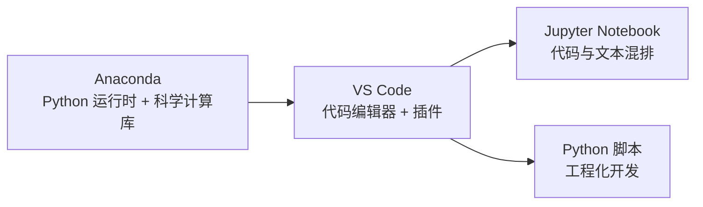

# 开发环境与工具

> 工欲善其事，必先利其器。本章介绍数据科学开发环境的搭建方法，以及常用扩展库的安装使用。

## 环境组成

一套高效的数据科学开发环境由三部分构成：

- **Python 运行时**：使用 [Anaconda](https://www.anaconda.com/products/individual) 提供，预装数百个数据科学常用包（NumPy、pandas、Matplotlib 等），并支持多环境隔离。
- **代码编辑器**：使用 [VS Code](https://code.visualstudio.com/)，配合 Python / Jupyter 插件，获得代码联想、错误提示与 Notebook 编辑能力。
- **Notebook 交互环境**：Jupyter Notebook，实现代码与文本混排，是数据分析的主力工作形态。



## 安装 Anaconda

1. 访问 [Anaconda 官网](https://www.anaconda.com/products/individual)，根据设备类型（Mac / Windows）选择 **Graphical Installer**。
2. 双击安装包，一路 Next / I Agree，保持默认位置安装即可（约需 2~3 分钟）。
3. 安装完成后，打开 **Anaconda Navigator**，即可看到全部工具（Jupyter Notebook、Spyder、Qt Console 等）。

> 对数据分析而言，Anaconda 预装的科学计算库（NumPy、Pandas、Matplotlib 等）正是首选，无需逐个手动安装。

## 配置 VS Code

1. **安装 VS Code**：访问 [code.visualstudio.com](https://code.visualstudio.com/) 下载安装，默认配置即可。
2. **安装中文语言包（可选）**：插件面板搜索 `Chinese`，安装后重启生效。
3. **安装 Python 插件**：插件面板搜索 `Python`，安装列表第一个插件。
4. **安装 Jupyter 插件**：插件面板搜索 `Jupyter`，安装微软官方出品的插件。

### 关联 Python 环境

新建 `hello.py` 文件后，状态栏会显示当前 Python 环境（如 `Python 3.8.5 64-bit (conda)`）。如果不是 Conda 环境，点击状态栏环境名，选择带 Conda 字样的环境即可。

## Jupyter Notebook 基本操作

在 VS Code 中按 `CTRL+P`（Mac 为 `CMD+P`），输入 `> Jupyter`，选择 **Jupyter: Create New Blank Jupyter Notebook** 创建 Notebook。

Notebook 由多个 **Cell** 组成，分为两种类型：

- **代码 Cell**：编写 Python 代码，可单独执行，结果展示在 Cell 下方。
- **文本 Cell**：编写分析思路与推导逻辑，实现代码与文本混排。

Notebook 界面分为三个区域：

- **主操作区**：运行全部 / 上一个 / 下一个 Cell、重启与中断 Kernel、插入 Cell、清空结果、查看变量、保存、导出。
- **边栏操作区**：不同位置的 `+` 号代表在不同位置插入 Cell。
- **Cell 操作区**：运行当前 Cell（`Shift+Enter`）、切换代码/文本模式。

### 常用快捷键

| 快捷键 | 功能 |
|--------|------|
| `CTRL+P` / `CMD+P` | 打开命令面板 |
| `Shift+Enter` | 运行当前 Cell |
| `CTRL+Enter` | 运行当前 Cell（新版默认） |
| `Esc` | 退出 Cell 编辑状态 |

### 新版 Notebook 界面

新版 VS Code Notebook 提供了更简洁的 UI，功能一致。新版主操作区依次为：执行全部、清空输出、重启内核、查看变量、导出、分栏。当鼠标浮动在 Cell 上时，会出现执行上一个 / 下一个 Cell、拆分、删除等按钮。

## 常用扩展库

数据科学与数据挖掘相关的库可按用途分类：

| 类别 | 库 | 用途 |
|------|-----|------|
| 数值计算 | NumPy、SciPy | 多维数组、矩阵运算、科学计算 |
| 数据处理 | pandas | 基于 NumPy 的表格数据分析 |
| 可视化 | Matplotlib、Seaborn、Plotly | 静态 / 统计 / 交互图表 |
| 机器学习 | scikit-learn | 分类、回归、聚类、降维、预处理的统一框架 |
| 自然语言 | NLTK、Gensim | 文本处理、TF-IDF、word2vec |
| 图像处理 | OpenCV | 图像与视频处理 |
| 深度学习 | TensorFlow、PyTorch、PaddlePaddle | 深度神经网络建模 |

> 查看模块内容的两个实用方法：`dir(math)` 列出模块所有方法，`help(math)` 查看模块描述与方法说明。

## 包管理

### 使用 pip

pip 是 Python 自带的包管理器：

```bash
pip --version                  # 查看 pip 版本
pip install tensorflow         # 安装最新版
pip install tensorflow==1.14   # 安装指定版本
pip uninstall tensorflow       # 卸载
pip list                       # 查看已安装包
```

### 使用 conda

Anaconda 的 conda 既是包管理器也是环境管理器：

```bash
# 创建环境（当前最新稳定版为 3.14）
conda create --name python-my python=3.14
# 激活 / 注销环境（现代写法）
conda activate python-my
conda deactivate
# 安装包
conda install matplotlib
# 查看环境
conda info -e
# 导出 / 重建环境
conda env export > environment.yaml
conda env create -f environment.yaml
```

**多环境隔离**是 conda 的核心优势：不同项目可构建互不干扰的环境，环境可打包迁移到其他机器一键重建。

### 配置国内镜像源

pip 默认源可能下载中断，可临时或永久切换为国内镜像：

```bash
# 临时切换（单条命令）
pip install tensorflow -i https://pypi.tuna.tsinghua.edu.cn/simple
# 永久修改默认源
pip config set global.index-url https://pypi.tuna.tsinghua.edu.cn/simple
```

常用镜像源：阿里云 `https://mirrors.aliyun.com/pypi/simple/`、中科大 `https://pypi.mirrors.ustc.edu.cn/simple/`、清华 `https://pypi.tuna.tsinghua.edu.cn/simple/`。

## 验证环境

环境配置完成后，用以下代码验证 NumPy 与 Matplotlib 是否就绪（应输出柱状图）：

```python
import numpy as np
import matplotlib.pyplot as plt

labels = ['G1', 'G2', 'G3', 'G4', 'G5']
men_means = [20, 35, 30, 35, 27]
women_means = [25, 32, 34, 20, 25]
width = 0.35

fig, ax = plt.subplots()
ax.bar(labels, men_means, width, label='Men')
ax.bar(labels, women_means, width, bottom=men_means, label='Women')
ax.set_ylabel('Scores')
ax.set_title('Scores by group and gender')
ax.legend()
plt.show()
```

## 小结

- 使用 **Anaconda + VS Code + Jupyter 插件**可搭建具备代码提示、错误提示与 Notebook 混排能力的高效开发环境。
- 掌握 **pip / conda** 两种包管理方式，并善用**国内镜像源**解决下载中断问题。
- 数据科学库可按**数值计算、数据处理、可视化、机器学习、深度学习**分类记忆，遇到问题知道去何处寻求方案即可。

## 延伸阅读

- 更详细的开发环境与工具链：[开发环境与工具](/docs/python/基础与入门/02-开发环境与工具)
- 数据分析库 → [NumPy 数组与数据类型](/docs/python/模块/数据分析库/01-NumPy数组与数据类型)

## 版本差异（数据科学栈 → 当前版本）

| 库 | 本文编写时 | 当前稳定版 | 升级要点 |
|----|-----------|-----------|---------|
| Python | 3.8-3.12 | 3.14 | 3.12+ 起性能显著提升；3.14 PEP 649/750 |
| NumPy | 1.x/2.0 | 2.5.x | `np.float_` 等别名移除；NEP 50 类型提升 |
| Pandas | 1.x/2.x | 3.0.x | Copy-on-Write 默认开启；`inplace`/`fillna(method=)` 弃用；字符串 dtype 变化 |
| Matplotlib | 3.x | 3.x 稳定版 | API 兼容，样式更新 |
| Seaborn | 0.12/0.13 | 0.13.x | API 稳定 |
| scikit-learn | 1.x | 1.9.x | API 稳定，新算法持续加入 |

> 本文讲解的数据分析流程（读取→清洗→分析→可视化）与核心 API 在最新版本中成立；升级时重点关注 Pandas 3.0 的 Copy-on-Write 与 NumPy 2.x 的类型变化。
