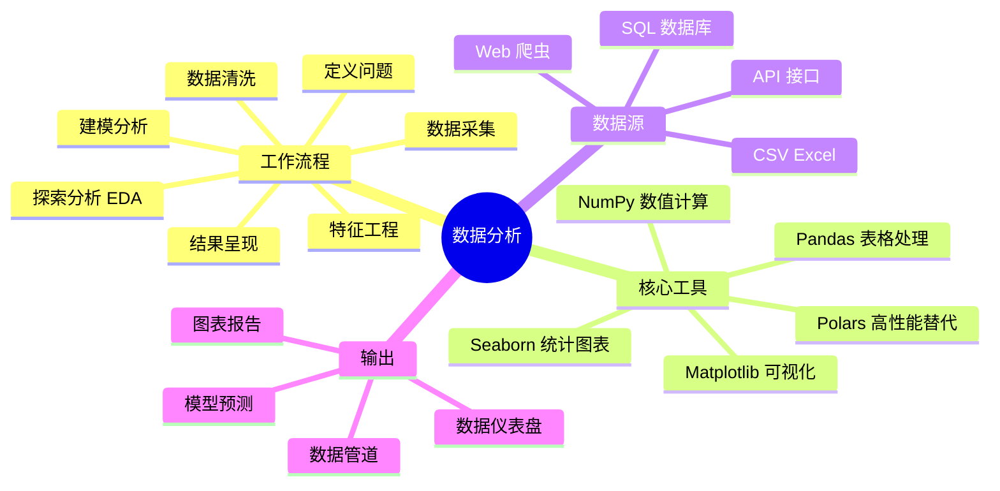
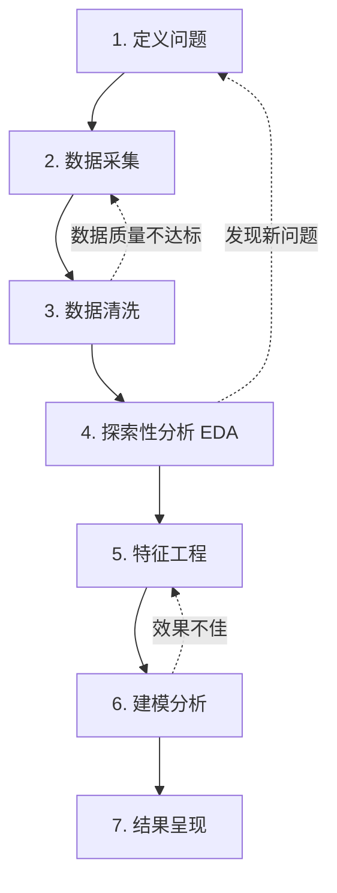
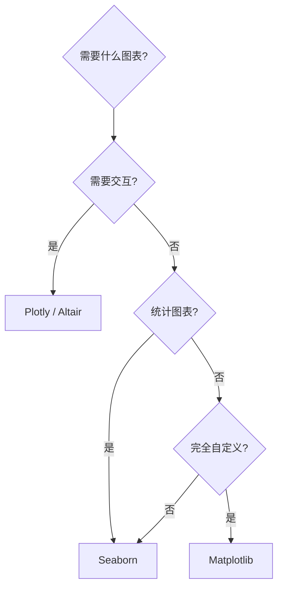

# 数据分析概览

在 Python 数据分析领域，NumPy、Pandas 和 Matplotlib 构成了数据处理、分析和可视化的基础设施。本文不重复每个库的 API 手册，而是聚焦于**工作流程、工具选择和实战决策**。

> 阅读提示

- 如果你想了解完整数据分析流程，从 [数据分析工作流程](#数据分析工作流程)开始
- 如果你想快速选择工具，跳到 [核心工具链选择](#核心工具链选择)
- 如果你想看数据清洗实战，直接看 [场景一：CSV 数据清洗管道](#场景一csv-数据清洗管道)
- 如果你想查常见陷阱，跳到 [常见陷阱](#常见陷阱)
- 本文基于 **Python 3.14**（推荐 3.13+），NumPy 2.5.x，Pandas 3.0.x

## 数据分析全景



## 数据分析工作流程

一个典型的数据分析项目遵循结构化工作流程，确保分析过程的系统性和结果的可靠性：



### 各阶段详解

| 阶段 | 核心任务 | 常用工具 | 耗时占比 |
|------|---------|---------|---------|
| **定义问题** | 明确分析目标、业务问题、假设 | 头脑风暴、业务访谈 | 5% |
| **数据采集** | 收集内部/外部数据 | SQL、requests、爬虫 | 10% |
| **数据清洗** | 处理缺失值、异常值、重复值、格式统一 | Pandas、NumPy | **60%** |
| **探索分析** | 描述性统计、可视化、发现模式 | Pandas、Matplotlib、Seaborn | 10% |
| **特征工程** | 创建新特征、转换现有特征 | Pandas、NumPy | 10% |
| **建模分析** | 统计检验、机器学习 | scikit-learn、statsmodels | 5% |
| **结果呈现** | 图表、报告、仪表盘 | Matplotlib、Plotly | 5% |

::: tip 现实中的耗时分布
数据清洗通常占项目 60% 以上的时间，但很多人低估了这一点。如果你发现"分析"阶段很短，大概率是因为清洗做得不够彻底。
:::

## 核心工具链选择

### NumPy vs Pandas vs Polars

| 对比维度 | NumPy | Pandas | Polars |
|---------|-------|--------|--------|
| 数据结构 | n 维数组 ndarray | 二维表格 DataFrame | 二维表格 DataFrame |
| 典型场景 | 数值计算、线性代数 | 表格数据清洗与分析 | 大数据集高性能处理 |
| 性能 | 高（C 实现） | 中（单线程） | 高（Rust 实现，多线程） |
| 内存效率 | 高（固定类型） | 中（对象开销） | 高（Apache Arrow） |
| 学习曲线 | 中 | 中 | 中（API 不同于 Pandas） |
| 生态成熟度 | 最成熟 | 最成熟 | 快速发展中 |
| 适合数据量 | 任意 | < 5GB 内存 | > 5GB 或需要速度 |

**选择原则**：

- **小数据集 + 快速探索** → Pandas（生态最全，教程最多）
- **纯数值计算**（矩阵运算、信号处理） → NumPy
- **大数据集 + 性能敏感** → Polars（比 Pandas 快 5-50 倍）

### 可视化工具选择

| 工具 | 特点 | 适用场景 |
|------|------|---------|
| **Matplotlib** | 底层、灵活、啰嗦 | 完全自定义的出版级图表 |
| **Seaborn** | 统计图表、简洁 | 数据探索、统计可视化 |
| **Plotly** | 交互式、Web 友好 | 仪表盘、交互报告 |
| **Altair** | 声明式语法 | 简洁统计图表 |



## NumPy 核心速查

```python
import numpy as np

# 创建数组
arr = np.array([1, 2, 3, 4, 5])
matrix = np.array([[1, 2], [3, 4]])

# 常用操作
arr.mean()        # 均值: 3.0
arr.std()         # 标准差: 1.414...
arr.max()         # 最大值: 5
arr.min()         # 最小值: 1
arr.sum()         # 求和: 15

# 向量化运算（避免 Python 循环）
prices = np.array([100, 200, 300])
rates = np.array([0.1, 0.2, 0.15])
discounted = prices * (1 - rates)  # [90. 160. 255.]

# 布尔索引筛选
scores = np.array([85, 92, 78, 95, 60, 88])
high_scores = scores[scores >= 80]  # [85 92 95 88]

# 常用创建函数
np.zeros((3, 4))       # 3×4 零矩阵
np.ones((2, 3))        # 2×3 全1矩阵
np.arange(0, 10, 2)    # [0 2 4 6 8]
np.linspace(0, 1, 5)   # [0. 0.25 0.5 0.75 1.]
np.random.randn(3, 3)  # 3×3 标准正态分布
```

::: tip 向量化 vs 循环
NumPy 的核心价值是**向量化运算**：用数组运算替代 Python 循环。性能差距可达 100 倍以上。

```python
# ❌ 慢：Python 循环
result = []
for x in data:
    result.append(x ** 2 + 2 * x + 1)

# ✅ 快：NumPy 向量化
result = data ** 2 + 2 * data + 1
```
:::

## Pandas 核心速查

```python
import pandas as pd

# 读取数据
df = pd.read_csv("sales.csv")
df = pd.read_excel("data.xlsx", sheet_name="Sheet1")
df = pd.read_json("api_response.json")

# 查看数据
df.head()                    # 前5行
df.info()                    # 列信息 + 类型 + 缺失值
df.describe()                 # 数值列统计摘要
df.shape                      # (行数, 列数)
df.columns.tolist()           # 列名列表
df.dtypes                     # 每列数据类型

# 筛选与过滤
df[df["age"] > 30]                          # 条件筛选
df[["name", "age", "salary"]]               # 选择列
df.loc[df["city"] == "Beijing", "salary"]   # label 筛选

# 排序
df.sort_values("salary", ascending=False)    # 降序
df.sort_values(["city", "age"])             # 多列排序

# 分组聚合
df.groupby("city")["salary"].mean()         # 按城市分组求平均薪资
df.groupby("city").agg(
    avg_salary=("salary", "mean"),
    max_salary=("salary", "max"),
    count=("salary", "count"),
)

# 缺失值处理
df.isnull().sum()                           # 每列缺失值数量
df.dropna(subset=["email"])                 # 删除 email 列缺失的行
df["age"].fillna(df["age"].median())        # 用中位数填充

# 新增列
df["salary_k"] = df["salary"] / 1000
df["is_senior"] = df["years"] >= 5

# 时间处理
df["date"] = pd.to_datetime(df["date"])
df["month"] = df["date"].dt.month
df.set_index("date").resample("ME")["sales"].sum()  # 按月汇总（ME=月末；旧别名 M 已移除）

# 导出
df.to_csv("output.csv", index=False)
df.to_parquet("output.parquet")             # 更快更小
```

## Matplotlib 核心速查

```python
import matplotlib.pyplot as plt

# 基础折线图
plt.figure(figsize=(10, 6))
plt.plot(months, revenue, marker='o', linewidth=2, label='营收')
plt.plot(months, cost, marker='s', linestyle='--', label='成本')
plt.xlabel('月份')
plt.ylabel('金额（万元）')
plt.title('月度营收与成本趋势')
plt.legend()
plt.grid(True, alpha=0.3)
plt.tight_layout()
plt.savefig('trend.png', dpi=150)
plt.show()

# 子图布局
fig, axes = plt.subplots(2, 2, figsize=(12, 8))
axes[0, 0].bar(categories, values)
axes[0, 1].hist(data, bins=30)
axes[1, 0].scatter(x, y, alpha=0.6)
axes[1, 1].pie(sizes, labels=labels, autopct='%1.1f%%')
fig.suptitle('数据分析概览', fontsize=16)
plt.tight_layout()
```

## 实战场景

### 场景一：CSV 数据清洗管道

```python
import pandas as pd
import numpy as np


def clean_sales_data(input_path: str, output_path: str) -> pd.DataFrame:
    """完整的 CSV 数据清洗管道"""

    # 1. 读取数据
    df = pd.read_csv(input_path)
    print(f"原始数据: {df.shape[0]} 行, {df.shape[1]} 列")

    # 2. 列名标准化
    df.columns = df.columns.str.strip().str.lower().str.replace(' ', '_')

    # 3. 去除完全重复的行
    before = len(df)
    df = df.drop_duplicates()
    print(f"去重: {before - len(df)} 行")

    # 4. 处理缺失值
    # 数值列用中位数填充
    numeric_cols = df.select_dtypes(include=[np.number]).columns
    for col in numeric_cols:
        missing = df[col].isnull().sum()
        if missing > 0:
            df[col] = df[col].fillna(df[col].median())
            print(f"  {col}: 填充 {missing} 个缺失值（中位数）")

    # 分类列用众数填充
    categorical_cols = df.select_dtypes(include=['object']).columns
    for col in categorical_cols:
        missing = df[col].isnull().sum()
        if missing > 0:
            mode_value = df[col].mode()[0]
            df[col] = df[col].fillna(mode_value)
            print(f"  {col}: 填充 {missing} 个缺失值（众数: {mode_value}）")

    # 5. 处理异常值（IQR 法）
    for col in numeric_cols:
        q1 = df[col].quantile(0.25)
        q3 = df[col].quantile(0.75)
        iqr = q3 - q1
        lower = q1 - 1.5 * iqr
        upper = q3 + 1.5 * iqr
        outliers = (df[col] < lower) | (df[col] > upper)
        if outliers.sum() > 0:
            df.loc[outliers, col] = df[col].clip(lower, upper)
            print(f"  {col}: 截断 {outliers.sum()} 个异常值")

    # 6. 日期解析
    date_cols = [c for c in df.columns if 'date' in c]
    for col in date_cols:
        df[col] = pd.to_datetime(df[col], errors='coerce')

    # 7. 导出
    df.to_parquet(output_path, index=False)
    print(f"\n清洗完成: {len(df)} 行 → {output_path}")
    return df


# 使用
clean_sales_data("raw_sales.csv", "clean_sales.parquet")
```

### 场景二：快速探索性分析报告

```python
import pandas as pd
import numpy as np
import matplotlib.pyplot as plt


def quick_eda(df: pd.DataFrame, target: str | None = None) -> None:
    """生成快速 EDA 报告"""

    print("=" * 60)
    print("探索性数据分析报告")
    print("=" * 60)

    # 基本信息
    print(f"\n数据维度: {df.shape[0]} 行 × {df.shape[1]} 列")
    print(f"内存占用: {df.memory_usage(deep=True).sum() / 1024 / 1024:.1f} MB")

    # 缺失值
    missing = df.isnull().sum()
    missing_pct = (missing / len(df) * 100).round(2)
    missing_df = pd.DataFrame({"缺失数": missing, "缺失率%": missing_pct})
    missing_df = missing_df[missing_df["缺失数"] > 0].sort_values("缺失率%", ascending=False)
    if len(missing_df) > 0:
        print(f"\n缺失值统计:\n{missing_df.to_string()}")
    else:
        print("\n✅ 无缺失值")

    # 数值列统计
    numeric_df = df.describe().T
    print(f"\n数值列统计:\n{numeric_df.to_string()}")

    # 如果有目标变量
    if target and target in df.columns:
        print(f"\n目标变量 '{target}' 分布:")
        if df[target].dtype == 'object':
            print(df[target].value_counts().to_string())
        else:
            print(f"  均值: {df[target].mean():.2f}")
            print(f"  中位数: {df[target].median():.2f}")
            print(f"  标准差: {df[target].std():.2f}")

    # 生成关键图表
    fig, axes = plt.subplots(1, 3, figsize=(15, 5))

    # 缺失值柱状图
    if len(missing_df) > 0:
        missing_df["缺失率%"].plot.bar(ax=axes[0], color='coral')
        axes[0].set_title('缺失值比例')
        axes[0].set_ylabel('缺失率 (%)')

    # 数值列分布
    numeric_cols = df.select_dtypes(include=[np.number]).columns[:2]
    if len(numeric_cols) >= 1:
        df[numeric_cols[0]].hist(ax=axes[1], bins=30, color='steelblue', alpha=0.7)
        axes[1].set_title(f'{numeric_cols[0]} 分布')

    # 相关性热力图（取 top 8 数值列）
    corr_cols = df.select_dtypes(include=[np.number]).columns[:8]
    if len(corr_cols) > 1:
        corr = df[corr_cols].corr()
        im = axes[2].imshow(corr, cmap='RdBu_r', vmin=-1, vmax=1)
        axes[2].set_xticks(range(len(corr_cols)))
        axes[2].set_yticks(range(len(corr_cols)))
        axes[2].set_xticklabels(corr_cols, rotation=45, ha='right', fontsize=8)
        axes[2].set_yticklabels(corr_cols, fontsize=8)
        axes[2].set_title('相关性矩阵')

    plt.tight_layout()
    plt.savefig('eda_report.png', dpi=150, bbox_inches='tight')
    print("\n📊 图表已保存: eda_report.png")
    plt.show()


# 使用
df = pd.read_csv("sales.csv")
quick_eda(df, target="revenue")
```

### 场景三：数据聚合与分组报告

```python
import pandas as pd


def generate_sales_report(df: pd.DataFrame) -> pd.DataFrame:
    """生成多维度销售汇总报告"""

    # 按城市和产品分组
    report = df.groupby(["city", "product"]).agg(
        订单数=("order_id", "count"),
        总营收=("amount", "sum"),
        平均客单价=("amount", "mean"),
        最大订单=("amount", "max"),
        最早订单=("order_date", "min"),
        最近订单=("order_date", "max"),
    ).reset_index()

    # 计算环比增长
    report["营收排名"] = report.groupby("city")["总营收"].rank(ascending=False).astype(int)

    # 筛选 Top 3 产品
    top_products = (
        report[report["营收排名"] <= 3]
        .sort_values(["city", "营收排名"])
    )

    return top_products


# 使用
df = pd.read_csv("sales.csv", parse_dates=["order_date"])
report = generate_sales_report(df)
print(report.to_string(index=False))
```

## 常见陷阱

| 陷阱 | 现象 | 原因 | 解决方案 |
|------|------|------|----------|
| SettingWithCopyWarning | Pandas 发出链式赋值警告 | 修改了 DataFrame 的视图而非副本 | 用 `.copy()` 显式复制，或用 `.loc[]` 赋值 |
| 忽略数据类型 | 内存浪费 + 性能差 | Pandas 默认用 `object` 存字符串 | `df.astype({"col": "category"})` 或指定 `dtype` |
| 大文件直接 read_csv | 内存溢出 | 一次性加载全部数据 | 用 `chunksize` 参数分块，或用 Polars |
| 用 Python 循环替代向量化 | 速度慢 100 倍 | 逐行操作抵消了 NumPy 优势 | 使用 Pandas/NumPy 向量化操作 |
| 忘记处理时区 | 时间数据错乱 | 时间戳默认无时区 | `pd.to_datetime(col, utc=True).dt.tz_convert('Asia/Shanghai')` |
| 合并后行数暴增 | 数据爆炸 | 多对多合并产生笛卡尔积 | 合并前检查重复键，用 `validate='one_to_one'` |
| 过早优化图表 | 花大量时间调 matplotlib | 分析阶段图表是工具不是产品 | 探索阶段用 Seaborn 快速出图，最终报告再精调 |

### 陷阱详解：SettingWithCopyWarning

```python
# ❌ 反面：修改视图触发警告
subset = df[df["city"] == "Beijing"]  # subset 可能是视图
subset["salary"] = subset["salary"] * 1.1  # Warning!

# ✅ 正面：显式复制
subset = df[df["city"] == "Beijing"].copy()
subset["salary"] = subset["salary"] * 1.1  # 安全

# ✅ 正面：用 .loc[] 直接在原 DataFrame 上修改
df.loc[df["city"] == "Beijing", "salary"] *= 1.1
```

## 最佳实践速查表

| 场景 | 推荐做法 | 避免 |
|------|---------|------|
| 数据读取 | 先 `df.info()` 检查类型 | 盲目信任数据格式 |
| 缺失值 | 根据业务含义选择填充策略 | 统一用 0 或删除填充 |
| 大文件 | `chunksize` 或 Polars | 直接 `read_csv` |
| 向量化 | 优先 NumPy/Pandas 内置操作 | Python 循环逐行处理 |
| 图表探索 | Seaborn 快速出图 | 一开始就调 matplotlib |
| 数据导出 | Parquet（更快更小） | 到处用 CSV |
| 列名规范 | 小写+下划线 `user_name` | 混用大小写或空格 |
| 链式操作 | `df.query().assign()` | 中间创建大量临时变量 |
| 分组聚合 | `agg()` 一次多指标 | 多次 groupby |

## 版本说明

| 版本 | 关键特性 | 影响 |
|------|---------|------|
| Pandas 2.x | PyArrow 后端、Copy-on-Write | 性能大幅提升，需注意写入行为变化 |
| NumPy 2.x | 更严格的类型提升规则 | 某些隐式类型转换不再生效 |
| Polars 1.x | LazyFrame、多线程 | 大数据集的首选替代方案 |

::: warning Copy-on-Write（Pandas 2.x）
Pandas 2.x 引入了 Copy-on-Write 模式（`pd.options.mode.copy_on_write = True`），将彻底解决 SettingWithCopyWarning 问题。建议新项目开启此模式。
:::

## 术语表

| 术语 | 英文 | 定义 |
|------|------|------|
| EDA | Exploratory Data Analysis | 探索性数据分析：通过统计和可视化理解数据特征 |
| DataFrame | DataFrame | Pandas 中二维表格数据结构 |
| Series | Series | Pandas 中一维数组数据结构 |
| 向量化 | Vectorization | 用数组运算替代循环，充分利用底层 C 实现 |
| 缺失值 | Missing Value | 数据中的空值（NaN、None、NA） |
| 异常值 | Outlier | 显著偏离大多数数据的极端值 |
| 特征工程 | Feature Engineering | 从原始数据中创建新变量以改善分析/建模效果 |
| 分组聚合 | GroupBy Aggregation | 按分类变量分组并计算每组的统计量 |
| IQR | Interquartile Range | 四分位距：Q3 - Q1，用于识别异常值 |
| Parquet | Apache Parquet | 列式存储格式，比 CSV 更快更小 |
| Copy-on-Write | CoW | 写入时复制：Pandas 2.x 的优化策略 |

## 延伸阅读

### 官方文档

- [Pandas 官方文档](https://pandas.pydata.org/docs/)
- [NumPy 官方文档](https://numpy.org/doc/)
- [Matplotlib 官方文档](https://matplotlib.org/stable/)
- [Seaborn 官方文档](https://seaborn.pydata.org/)
- [Polars 官方文档](https://pola-rs.github.io/polars/)

### 推荐阅读

- 《利用 Python 进行数据分析》（Wes McKinney）— Pandas 作者亲著
- 《Python 数据科学手册》— 系统入门三件套
- [Real Python — Pandas Tutorials](https://realpython.com/learning-paths/pandas-data-science/)
- 本站：[量化交易入门](../07-量化金融/01-量化交易入门) — 数据分析的金融应用
- 本站：[Pandas 与 NumPy 策略回测](../07-量化金融/02-Pandas与NumPy策略回测) — 进阶数据处理
- 本站：[爬虫概览与HTTP基础](../../01-Web与爬虫/02-爬虫/01-爬虫概览与HTTP基础) — 数据采集

## 版本差异（数据科学栈 → 当前版本）

| 库 | 本文编写时 | 当前稳定版 | 升级要点 |
|----|-----------|-----------|---------|
| Python | 3.8-3.12 | 3.14 | 3.12+ 起性能显著提升；3.14 PEP 649/750 |
| NumPy | 1.x/2.0 | 2.5.x | `np.float_` 等别名移除；NEP 50 类型提升 |
| Pandas | 1.x/2.x | 3.0.x | Copy-on-Write 默认开启；`inplace`/`fillna(method=)` 弃用；字符串 dtype 变化 |
| Matplotlib | 3.x | 3.x 稳定版 | API 兼容，样式更新 |
| Seaborn | 0.12/0.13 | 0.13.x | API 稳定 |
| scikit-learn | 1.x | 1.9.x | API 稳定，新算法持续加入 |

> 本文讲解的数据分析流程（读取→清洗→分析→可视化）与核心 API 在最新版本中成立；升级时重点关注 Pandas 3.0 的 Copy-on-Write 与 NumPy 2.x 的类型变化。
