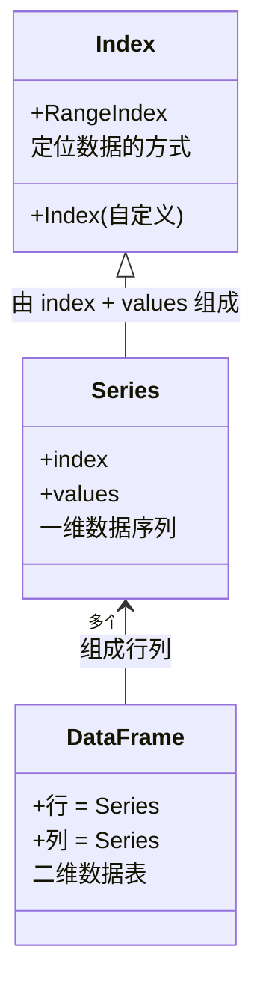
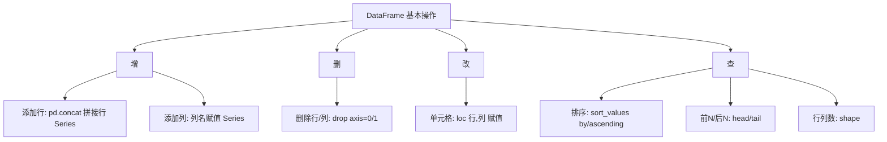

# 文件读取与 DataFrame

前文使用 csv 模块直接读取数据存在两个明显的不足：

- 只能读取 csv 文件，而数据分析的数据除了可能来自 csv，也可能来自 Excel，甚至可以来自 html 的表格。
- 读取到的结果一般是字典列表，并不利于分析。虽然每个字典代表一行记录，但一旦要取某一列的数据就会非常复杂。

Python 作为数据分析领域的主流语言，自然不会只有 csv 模块这样的初级工具。本部分将学习表格类型的大数据处理工具：pandas。

pandas 不仅可以从多种不同的文件格式读取数据，还具备各种数据处理功能。掌握 pandas 是踏上数据分析之路的重要基础。下面开始 pandas 的学习。

在第一个 Cell 中，导入 pandas。为了在后续调用 pandas 的函数方便，给它起一个别名：pd。import 语句中，在模块名后面跟 as 就可以给导入的模块起一个别名，如下所示。

```
import pandas as pd

```

运行之后如果没有报错，说明 pandas 已经成功安装。

### 使用 pandas 读取 csv 文件

首先学习如何使用 pandas 读取 csv 文件。

pandas 模块提供了一个 read_csv 的方法，可以直接读取 csv 文件，并返回一个 DataFrame 对象。DataFrame 对象是 pandas 模块的核心，pandas 的所有表格都通过 DataFrame 对象来存储，并且 DataFrame 还提供了非常多查看数据、修改数据的方法。之后的课程中会逐渐学习 DataFrame 的用法。

现在只需知道，pandas 可以直接从一个 csv 文件中将数据读到 Python 中，并以 DataFrame 对象的形式返回，拿到这个对象就可以查看其中的数据。

#### 实战 read_csv

具体演练一下这个过程。首先将前文收集到的国产电视剧数据集 tv_rating.csv 放在工作目录中。

新建 Cell，输入如下的代码。

```
# 使用 pandas 模块的 read_csv 函数，读取 csv 文件。并将结果存在 df_rating 变量中
df_rating = pd.read_csv("tv_rating.csv")
# 打印 df_rating 变量
print("df_rating:")
print(df_rating)
# 打印 df_rating 变量的类型
print("df_rating type:")
print(type(df_rating))

```

运行之后输出如下所示（为了表格类的数据看着好看一些，这类数据都截图展示）。

从上面的输出中可以看到，df_rating 变量中包含了 csv 文件中的所有数据，并且有形状的描述：3600 行 x 3列，与下载的数据一致。通过打印 df_rating 的类型，可以看到 df_rating 的类型就是上文提到的 DataFrame。

#### 更好看的表格

DataFrame 很强大，甚至针对 notebook 有专门优化。之前学习过，当一个 Cell 的最后一行是一个变量时，notebook 就会将这个变量打印出来。比如如下的代码：

```
a = 3
b = 4 + a
a

```

或者

```
a

```

这样的代码，即便没有任何的 print 语句，但因为满足 cell 最后一行是一个变量的条件，notebook 都会打印出这个变量，也就是 a 的值。

回到 DataFrame，当不是直接用 print 打印它，而是把 DataFrame 变量放在 Cell 的末尾时，notebook 就会用一种更好看的格式来打印它。新建一个 Cell，输入如下的代码运行。

```
df_rating

```

输出

可以看到这一次的格式比上一次好看多了，更像一个表格，也更加整齐。DataFrame 的常见操作会在下一篇具体展开介绍。

### 使用 pandas 读取 excel 文件

在 Python 还没有兴起之前，大量数据分析是通过 Excel 完成的。在很多传统行业中，还有大量数据保存在 Excel 中，所以读取 Excel 也是 Python 数据分析领域的常见任务。

Excel 的 .xls/.xlsx 文件格式是微软针对表格开发的，只能使用 Excel 打开，比如用记事本打开往往会看到乱码。Python 读取 Excel 中的内容，同样通过 pandas 实现。

类似 csv 的读取，pandas 也提供了 read_excel 函数来实现读取 excel 文件中的内容，但使用方法比 read_csv 稍微复杂一些。

下面通过一个小实战来学习 read_excel 的使用。

#### （1）准备测试数据

之前做的数据都是 csv 格式的。先制作一个简单的 excel 文件，用来测试后面的代码。

打开 Excel，将第一个表格（sheet）的名字改为：基本信息，并复制添加下述内容。

添加完后的 Excel 如下所示。

然后，点击下面的 +号，新建一个表格，命名为“绩效”，然后复制粘贴以下内容。

添加之后的 Excel 界面如下所示。

保存 Excel 到工作目录中，命名为 info.xlsx。

#### （2）读取数据

数据准备完毕，现在读取刚才创建的表格。形式类似刚才的 read_csv，可以先尝试思考一下自己写，然后继续往下看。

新建 Cell，输入如下的代码。

```
# 使用 read_excel 函数，读取 info.xlsx 的内容并存储在 df_info 变量中
df_info = pd.read_excel("info.xlsx")
# 不用 print，直接将 df_info 放在最后一行，让 notebook 用表格形式打印
df_info

```

执行之后，输出如下。

可以看到，Excel 中的数据被成功打印了出来，和 read_csv 一样，read_excel 返回的也是一个 DataFrame。

不过内容虽然打印出来了，但只打印出了第一个表格，也就是“基本信息”这个表格，后面添加的“绩效”表格并没有打印出来。这是 pandas 的机制导致的，read_excel 默认只读取 excel 文件中的一个表格。

一个 Excel 中包含多个表格是很常见的。如何读取更多的表格？进入下一个步骤。

#### （3）读取不同的表格

read_excel 比 read_csv 复杂的地方在于，read_excel 支持非常多的参数。比如要实现读取后面的表格，只需给 read_excel 函数的 sheet_name 参数赋值即可。

新建 Cell，输入下面的代码。

```
# 使用 read_excel 函数读取 info.xlsx 文件里的“绩效”这个表格
# 并将结果存在 df_perf 变量中
df_perf = pd.read_excel("info.xlsx", sheet_name="绩效")
# 让 notebook 打印 df_perf 变量
df_perf

```

输出如下所示。

可以看到，这次输出的就是增加的“绩效”表格中的内容。

**在 read_excel 中，通过给 sheet_name 赋值来决定要加载文件的哪个表格，如果不指定，pandas 则默认加载第一个表格**。

#### （4）选择性读取

有时候 excel 文件的数据很多，全部加载到 Python 中可能会卡，而且有时只对其中某几列感兴趣，全部加载显示也不容易看。read_excel 提供了 usecols 参数，可以指定要加载哪几列。

举个例子，刚才的“绩效”表格，对“上期考核结果”不感兴趣，只想加载姓名和绩效考核这两列的内容。可以这样操作，新建 Cell，输入如下代码。

```
# 使用 read_excel 函数读取 info.xlsx 中的绩效表格
# 并只读取 A B两列，并将结果存到 df_perf1 变量中
df_perf1 = pd.read_excel("info.xlsx", sheet_name="绩效", usecols="A,B")
# 让 notebook 打印 df_perf1 变量
df_perf1

```

执行之后，输出结果可以看到，已经成功实现了只加载前两列的内容。

至此，学完了基本的读取 excel 文件的操作。

### 使用 pandas 读取 html 文件

有的时候数据并不是整理好的 csv 表格或者 Excel 表格，而是以网页中的表格形式存在，最常见的就是各类股票财经网站，比如同花顺的股票涨跌幅数据中心：[http://data.10jqka.com.cn/market/zdfph/](http://data.10jqka.com.cn/market/zdfph/?fileGuid=xxQTRXtVcqtHK6j8)。

或者像招商银行的外汇行情页面，如下所示。

如果将这些网页中的表格“导入”到 Python 进行处理，根据上一个部分学习的爬虫技术，可以将这个页面的 html 下载下来，然后用 BeautifulSoup 分析表格的标签结构，再把内容一行一行地提取出来，一步一步拆分成列。

这样做是可以的，但流程较为复杂，工作量较大。而对于提取网页中的表格，存在一个非常简单的方法：使用 pandas。

和 read_csv、read_excel 类似，pandas 也提供了一个 read_html 的方法，来**智能地提取网页中的所有表格**，并以 DataFrame 列表的形式返回，一个表格对应一个 DataFrame。

通过一个简单的小例子来学习 read_html 方法的使用。以刚才举的招商银行外汇行情的页面为例，尝试在 Python 中加载该网页中表格的数据。

#### （1）准备网页

首先要做的一件事，是拿到网页的内容。前面已经写过一个获取网页内容的函数。

新建 Cell，将 download_content 函数先搬过来，别忘记在开头加上导入 urllib3 的语句，代码如下所示。

```
import urllib3
def download_content(url):
    # 创建一个 PoolManager 对象，命名为 http
    http = urllib3.PoolManager()
    # 调用 http 对象的 request 方法，第一个参数传一个字符串 "GET"
    # 第二个参数则是要下载的网址，也就是 url 变量
    # request 方法会返回一个 HTTPResponse 类的对象，命名为 response
    response = http.request("GET", url)
    # 获取 response 对象的 data 属性，存储在变量 response_data 中
    response_data = response.data
    # 调用 response_data 对象的 decode 方法，获得网页的内容，存储在 html_content
    # 变量中
    html_content = response_data.decode()
    return html_content
html_content = download_content("http://fx.cmbchina.com/Hq/")

```

执行上述代码之后，网页内容就已经存储在 html_content 变量中。

#### （2）读取数据

在准备好网页的内容之后，就可以调用 read_html 函数来获取表格了。

新建 Cell，输入如下代码。

```
# 调用 read_html 函数，传入网页的内容，并将结果存储在 cmb_table_list 中
# read_html 函数返回的是一个 DataFrame 的 list
cmb_table_list = pd.read_html(html_content)
# 打印 list 的长度，看看抽取出了几个表格
print(len(cmb_table_list))

```

执行代码，输出结果为 2。这说明找到了两个表格，但回头看网页，主体应该只有一个表格。这种情况比较常见，多半是网页在一些**不是表格的元素也使用了表格的标签**，导致 pandas 识别多了一个。遇到这种情况，只需要**逐一查看返回的 DataFrame 列表**，找到所需的即可。

现在从列表中找出所需的表格，首先查看第一个 DataFrame。

新建 Cell，输入以下代码并运行。

```
# 直接写变量，利用 notebook 的特性打印表格
cmb_table_list[0]

```

执行后，输出如下：

很明显，这不是所需的表格，现在看第二个。

新建 Cell，输入如下的代码。

```
cmb_table_list[1]

```

执行之后，输出如下所示。

很明显，这个就是所需的表格了。可以看到招行官网上看到的汇率表格已经完整地被加载到了 pandas 的 DataFrame 中，并且能够以表格的形式打印出来。

如果用 BeautifulSoup 来解析这个网页然后提取出表格的内容，恐怕代码要写大几十行，而 pandas 一个函数就搞定了。


首先介绍 pandas 中的三个最常见概念：index、Series 和 DataFrame。

### 数据的“目录”： index

index 也叫索引。索引是计算机科学中非常常见的概念，虽然听起来可能有些陌生，但应该很早之前就打过交道。比如看一本书，书的目录就是书本内容的索引。通俗意义上，索引可以理解为存储了如何访问某块数据方式的数据。拿目录的例子来说，目录本身也是数据，但这个数据的内容是如何访问另一块数据（书的正文）。

在之前的学习中，也已或多或少和索引打过交道。比如通过列表的下标访问列表的某个元素，例如 a[5]，这个 5 也叫列表的索引。字典的场景中，通过 key 来访问字典中的某个元素，例如 student["name"]，这个 "name" 的字符串，也属于字典的索引。

### 一维数据序列：Series

Series 本身是一种数据类型，很像之前打交道的列表，是存储多个数据元素的容器。事实上，也可以直接使用一个列表来创建一个 Series。但与列表不同的是，Series 一般由两部分组成：index 和 values。

- values 容易理解，就是存储了 Series 里面所有元素的值，所以 values 部分可以认为和列表是等价的。
- index 部分代表 Series 的**索引**。根据上面对于索引的定义，index 部分的数据就是为了方便定位到 values 里面的数据。

Series 有一个单独的索引项，这使得它既支持类似列表一样的数字索引，也支持类似字典一样的用字符串或者其他 Python 对象来做索引。对于 Series，可以简单理解成一个列表和字典的集合体。

下面用几个实例简单介绍 Series 的概念。

#### （1）直接从列表创建 Series

```
import pandas as pd
# 通过列表创建 Series
ser1 = pd.Series([1,3,5,7])
# 通过 notebook 打印 ser1
ser1

```

输出显示如下：

```
0    1
1    3
2    5
3    7
dtype: int64

```

输出有两列，第一列是 index，第二列是 values。values 就是传入的列表，而 index 则是对应的序号。当只使用列表来创建 Series 对象时，会生成默认的索引，即类似列表那样，每一个元素的位置作为索引。Series 对象也具备 index 和 values 属性，这样可以单独访问这两个部分。

```
print("values: ", ser1.values)
print("index: ", ser1.index)

```

从以下输出结果可以看到，values 就是传入的列表，而 index 则是一个 RangeIndex 的对象。

```
values:  [1 3 5 7]
index:  RangeIndex(start=0, stop=4, step=1)

```

对于这个 Series 对象，通过 index 的值来获得对应 values 里面的值。比如 index 等于 1 对应的是 values 里面的 3。在代码中想要获得 1 对应的值就可以这样：

```
ser1[1]

```

输出

```
3

```

#### （2）创建 Series，并指定索引

在上面的例子中，直接从列表创建了 Series，Series 为其分配了默认的 index，即元素在列表中的位置作为其对应的 index。比如 5 是列表 1,3,5,7 中的第三个数字，则它的 index 就是 2（从 0 开始数起）。

除了这种方式，Series 还支持创建的时候指定对应的索引。

```
# 使用列表创建 Series，并指定其索引为另一个列表
ser2 = pd.Series([1,3,5,7], index=["a", "b", "c", "d"])
# 使用 notebook 打印 ser2
ser2

```

输出为：

```
a    1
b    3
c    5
d    7
dtype: int64

```

可以看到，指定了一个由 4 个字符串组成的列表作为数字列表的索引。两个列表的元素是一一对应的关系，比如字符串 "a" 就是数字 1 的索引，字符串 "b" 就是数字 3 的索引。验证一下。

```
print(ser2["d"])

```

输出如下，可以看到通过索引 "d"，确实拿到了数字 7。

```
7

```

现在来看一下 ser2 的 values 和 index 的值。

```
print("values:", ser2.values)
print("index:", ser2.index)

```

输出

```
values: [1 3 5 7]
index: Index(['a', 'b', 'c', 'd'], dtype='object')

```

values 和第一个例子一样，但 index 这次就不是 RangeIndex 对象了，而是一个 Index 对象，里面保存了传入的作为索引的字符串数组。

总结一下，Series 可以看成是高级的列表或者字典。当不指定 index 时，Series 会生成默认的位置索引，这样的 Series 就像是一个列表。而当指定了 index 之后，则可以通过 index 列表中的元素来访问对应的 values 中的元素，就像字典的 key-value 结构一样。

整体来说，**Series 通过将 index 和 values 分别存储的机制，实现了列表和字典的结合。**

### 二维数据表：DataFrame

学习完了 Series，现在来看前文经常出现的 DataFrame。在前文的学习中，都是从各种文件中加载数据，之后直接存储为 DataFrame。这个部分一步步揭开 DataFrame 的面纱。

#### （1）DataFrame 的组成

根据前文学习的内容，DataFrame 是一个由行和列组成的二维表格。DataFrame 是由 Series 组成的，DataFrame 的某一行或某一列都是一个 Series。

通过代码确认这一点。将 tv_rating.csv 放在工作目录，新建 Cell，输入如下代码：

```
# 加载电视剧评分数据
df_rating = pd.read_csv("tv_rating.csv")
# 输出评分的 DataFrame
df_rating

```

输出为：

在上述表格中，无论是列（比如标题、评分）还是行（比如第二行、第三行）都是 Series。其中 title、rating、stars 则是列的索引，而 0、1、2...3599 是行的索引。

通过列名作为索引，单独输出某一列，比如评分这一列。

```
# 获取 rating 这一列，存储在 ser_rating 变量中
ser_rating = df_rating["rating"]
# 输出 ser_rating 这个 Series
print(ser_rating)
# 分割一下，方便查看
print("------------分割一下------------")
# 查看数据的类型
print(type(ser_rating))

```

输出结果为：

```
0       3.7分
1       4.0分
2       4.6分
3       3.4分
4       4.4分
        ...
3595    4.0分
3596    4.0分
3597    1.0分
3598    2.0分
3599    4.6分
Name: rating, Length: 3600, dtype: object
------------分割一下------------
<class 'pandas.core.series.Series'>

```

可以看到，评分这一列被打印出来，格式和上面学习的 Series 是一样的，左边是 index，右边是 values。之后通过 type 函数获得了 ser_rating 变量的类型，确实是 Series。

除了输出某一列，还可以用行索引来单独输出某一行。比如输出第二行：刘老根第三部，对应的索引是 1。用如下的代码获取这一行。

```
# DataFrame 通过 loc 函数可以查看行索引对应的值
# 取出行索引为 1 的行，存储在 ser_1 变量中
ser_1 = df_rating.loc[1]
# 打印 ser1 这个 Series
print(df_rating.loc[1])
# 分割一下，方便查看
print("------------分割一下------------")
# 查看数据的类型
print(type(df_rating.loc[1]))

```

输出为：

```
title                  刘老根第三部
rating                   4.0分
stars     主演赵本山,范伟,李静,闫学晶,王小宝
Name: 1, dtype: object
------------分割一下------------
<class 'pandas.core.series.Series'>

```

可以看到，拿到的 ser_1 仍然是一个 Series 类型的对象。左边的 title、rating、stars 是 index，右边的“刘老根第三部”“4.0分”等是 values。因为 ser_1 是一个 Series，所以如果要拿这一行中的某个数据，比如评分，直接写 ser_1["rating"] 就可以实现。

对比通过行索引取出的行 Series 和通过列索引取出的列 Series 不难发现，**列 Series 的 index 是 DataFrame 的行头，而行 Series 的 index 则是 DataFrame 的列名**。

#### （2）DataFrame 的创建

既然 DataFrame 是一个个 Series 组成的，那自然可以用 Series 来构造 DataFrame。

构造 DataFrame 最常见的方式是用多个行 Series 的形式来创建，不同的行 Series 的长度应该是一致的（因为表格中每一行的元素个数都需要相等）。

以如下表格为例，将其直接创建为一个 DataFrame。

新建 Cell，输入如下代码：

```
# 将列索引保存在 index_arr 变量中
index_arr = ["姓名", "年龄", "籍贯", "部门"]
# 构建小明、小亮、小E的行 Series，并使用创建好的 index_arr 作为 Series 的 index
ser_xiaoming = pd.Series(["小明", 22, "河北","IT部"], index= index_arr)
ser_xiaoliang = pd.Series(["小亮", 25, "广东","IT部"], index = index_arr)
ser_xiaoe = pd.Series(["小E", 23, "四川","财务部"], index=  index_arr)
# 直接将三个 Series 以列表的形式作为 DataFrame 的参数，创建 DataFrame
df_info = pd.DataFrame([ser_xiaoming, ser_xiaoliang, ser_xiaoe])
# 使用 notebook 打印 DataFrame
df_info

```

输出

可以看到，表格已经被成功打印出来，这说明已经将内容正确构建出了 DataFrame。

### 基本操作

下面讲解 DataFrame 和 Series 的常见操作。

#### （1）添加行

DataFrame 没有内置的 append 方法（旧版 append 已在 Pandas 2.0 移除），添加一行使用 `pd.concat` 拼接，用法如下：

```
# 新建一个行 Series，存储在 ser_xiaoh 变量中
ser_xiaoh = pd.Series(["小红", 28, "福建", "财务部"], index = index_arr)
# 使用 pd.concat 将新行拼接到原 DataFrame 上
# ignore_index=True 的含义是让 DataFrame 丢弃旧索引、自动生成新的行索引
# concat 会返回一个新的 DataFrame，将其保存回 df_info 变量
df_info = pd.concat([df_info, ser_xiaoh.to_frame().T], ignore_index=True)
# 查看添加后的 DataFrame
df_info

```

输出后可以看到，小红的记录已经追加到了末尾。

#### （2）添加列

添加一列一般有两种情况。如果添加的列，所有行的值都相同，直接以单个值赋值给新添加的列即可。如下所示：

```
# 直接将新添加的列名当作 DataFrame 的列索引，对其赋新的值
df_info["考核结果"] = "合格"
# 查看
df_info

```

输出为：

但如果新添加的列，每一行的内容不是完全一样时，就需要将一个新的 Series 赋值给 DataFrame 中针对新列名的列 Series。

```
# 将新添加的 Series 赋值给 DataFrame 中新列名对应的列 Series
df_info["考核结果"] = pd.Series(["合格", "良好", "优秀", "良好"])
# 查看
df_info

```

输出结果为：

可以看到，列已经对应到了不同的行上面。有一点值得注意的是，第一次已经添加了“考核结果”这一列，每一行的值都是合格。后来对这一列赋值了一个新的 Series，修改了它的值。

所以，**当对 DataFrame 某个列名对应的列 Series 赋值时，如果列名不存在，则会新建对应的列；而当列名存在时，则会修改原先列的值。**

所以这个技术既能创建新的一列，也可以修改已有的列。

#### （3）删除行或列

DataFrame 提供了 drop 方法来删除某一行或者某一列。

先以删除列举例，比如删除刚才添加的“考核结果”这一列。

```
# labels 是要删除的列名
# axis = 1 代表要删除的是列
# inplace = True 代表删除直接在 df_info 中生效
# 注意：Pandas 已弃用 inplace 参数，更推荐写法 df_info = df_info.drop("考核结果", axis=1)
df_info.drop(labels = "考核结果", axis=1, inplace= True)
# 查看
df_info

```

输出结果如下，可以看到考核结果一列已经被删除。

接下来是删除行，以删除小 E 这一行为例：

```
# labels 是要删除行的 index，小E的index是2
# axis = 0 代表要删除的是行
df_info.drop(labels=2, axis=0, inplace=True)
# 查看
df_info

```

输出结果如下，可以看到小 E 那一行记录已经被成功删除。

#### （4）单个单元格的查看与修改

在上面的操作中，整体还是以 Series 维度的操作为主，比如修改 Series、增加 Series。如果只需要查看和修改其中某一个单元格的内容，虽然也可以通过上面的方法（比如首先获得单元格所在的行 Series 或列 Series，再用进一步的索引去获得单元格的内容），但这种方式比较麻烦，而且修改时可能会有问题。

对于单个单元格的查看和修改，推荐的方式是使用 DataFrame 的 loc 属性，可以一步到位指定定位到单元格。以查看小亮的籍贯，以及修改为广西这个任务为例，演示 loc 函数的用法。

查看单元格：

```
# loc 属性后面跟中括号，中括号里面第一个元素是行索引，第二个元素是列索引
# 小亮的行索引是1，想查看籍贯，所以列索引就是籍贯
df_info.loc[1, "籍贯"]

```

输出为：

```
'广东'

```

学会了查看之后，修改就比较简单了，直接给 loc 属性选出来的单元格赋值即可。

```
# 对行索引为1，列索引为籍贯的单元格赋值，赋值广西
df_info.loc[1, "籍贯"] = "广西"
# 查看 DataFrame
df_info

```

输出可以看到，小亮的籍贯已经被修改为广西。

#### （5）DataFrame 的排序

在数据分析任务中，对数据集进行排序是非常常见的诉求。拿电视剧评分的数据集来说，可能需要分析高分的电影和低分的电影分别都有什么特征。做这样的分析，首先第一步就需要将 DataFrame 按评分排序。以之前从 csv 加载的 DataFrame df_rating 为例。

DataFrame 提供了 sort_values 方法来实现排序，用法如下。

```
# by 参数代表要按 rating 这个列索引来排序
# inplace = True 的含义和上面说的一样，代表更新当前的 DataFrame，而不是返回一个新的
df_rating.sort_values(by = "rating", inplace=True)
# 查看排序后的 DataFrame
df_rating

```

输出为：

可以看到，整个 DataFrame 不再按行头的索引排序，而是按照电视剧的评分从低到高来排序了。

如果想看从高到低，自然也是支持的。只需要将是否升序排序的参数 ascending 设置为 False 即可。

```
# 在刚才的基础上，增加 ascending=False，代表按降序排序
df_rating.sort_values(by="rating", inplace=True, ascending=False)
# 查看
df_rating

```

输出如下所示，可以看到 DataFrame 已经变为评分从高到低排序了。

#### （6）取前 N 个和后 N 个

在排序后，要对数据表进行分析，比如对高分进行分析，往往需要多查看几个条目。但是每次输出 DataFrame 时，Notebook 一般只会选择前五个和末尾五个组成摘要进行表格的输出。如果默认的表格打印不满足需求，使用 DataFrame 的 head 函数和 tail 函数来输出前 N 个和后 N 个的数据。

举个例子，分别分析 20 条高分电视剧和 20 条低分电视剧，可以按如下方式实现：

```
# head 函数返回 DataFrame 的前 N 条记录，N 就是函数参数指定的值
# 这里指定 20
df_rating.head(20)

```

输出结果为：

输出最后的 20 条的原理是类似的，只不过换成 tail 函数。

```
# tail 函数，返回 DataFrame 的末尾的 N 条记录，N 就是函数的参数
# 这里的 N 指定 20
df_rating.tail(20)

```

输出如下所示，可以看到这次输出了 20 条都是 1 分的数据。

#### （7）获取 DataFrame 的行数和列数

很多时候，从数据文件加载为 DataFrame 时，首先会看这个 DataFrame 有多少行、多少列。DataFrame 提供了 shape 属性来返回行数和列数的信息。

shape 属性返回一个元组，这个数据结构之前没有学习过，不过可以简单把它当一个列表用即可。shape 属性返回的元组有两个元素，第一个就是行数，第二个就是列数。

以 df_rating 这个 DataFrame 为例，打印其行列数信息，代码如下：

```
# shape 属性，返回一个元祖，第一个是行数，第二个元素是列数
shape = df_rating.shape
# 打印行数和列数
print("行数:", shape[0])
print("列数:", shape[1])

```

输出后和数据集的情况是匹配的。

```
行数: 3600
列数: 3

```

### pandas 数据结构关系



### DataFrame 基本操作归类



### 小结

总结本文学习的内容。

首先，学习了一个计算机领域非常重要的概念——索引，这也是 pandas 中 DataFrame 很多操作的基础。索引之于数据就像目录之于书本内容，通过索引从一堆数据中取出所需的一个或多个数据。

然后，学习了 pandas 中的一维数据序列对象：Series。Series 融合了列表和字典的功能。通过把 index 和 values 分开存储，让它既能按照列表使用，也能按照字典使用。

之后，学习了 DataFrame 的基本概念。DataFrame 是由 Series 组成的二维数据表，DataFrame 的一行或一列都是一个 Series，自然用多个行 Series 或多个列 Series 来创建 DataFrame。

最后，学习了 DataFrame 的基本操作。

- 添加行：用 pd.concat 拼接行 Series（旧版 append 方法已在 Pandas 2.0 移除）
- 添加列：将新增加的列 Series 通过列名作为列索引赋值给 DataFrame。
- 删除行或者列：用 drop 方法，通过 axis 参数控制删除行或删除列
- 单个单元格的查看与修改：loc 属性，中括号内第一个元素是行索引，第二个是列索引。
- 排序：用 sort_values 方法，by 参数指定要用哪一列作为排序标准，ascending 参数决定要升序还是降序。
- 取前 N 个和后 N 个：head 和 tail 函数，N 就是函数的参数。
- 获取行数和列数：shape 属性。

---

## 版本差异（数据科学栈 → 当前版本）

| 库 | 本文编写时 | 当前稳定版 | 升级要点 |
|----|-----------|-----------|---------|
| Python | 3.8-3.12 | 3.14 | 3.12+ 起性能显著提升；3.14 PEP 649/750 |
| NumPy | 1.x/2.0 | 2.5.x | `np.float_` 等别名移除；NEP 50 类型提升 |
| Pandas | 1.x/2.x | 3.0.x | Copy-on-Write 默认开启；`inplace`/`fillna(method=)` 弃用；`DataFrame.append` 已移除；字符串 dtype 变化 |
| Matplotlib | 3.x | 3.x 稳定版 | API 兼容，样式更新 |
| Seaborn | 0.12/0.13 | 0.13.x | API 稳定 |
| scikit-learn | 1.x | 1.9.x | API 稳定，新算法持续加入 |

> 本文讲解的数据分析流程（读取→清洗→分析→可视化）与核心 API 在最新版本中成立；升级时重点关注 Pandas 3.0 的 Copy-on-Write 与 NumPy 2.x 的类型变化。
